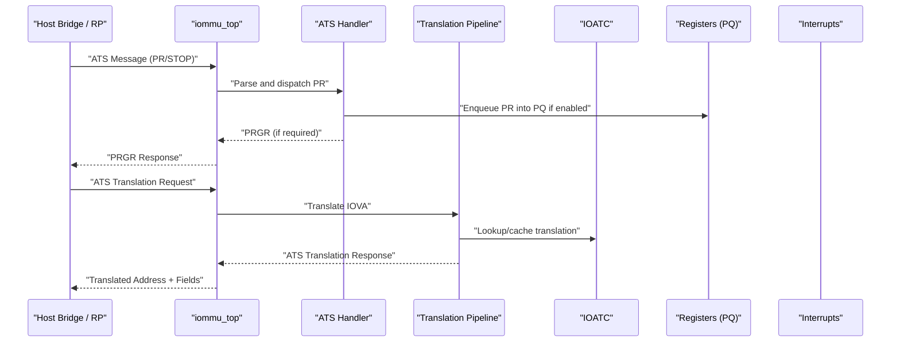
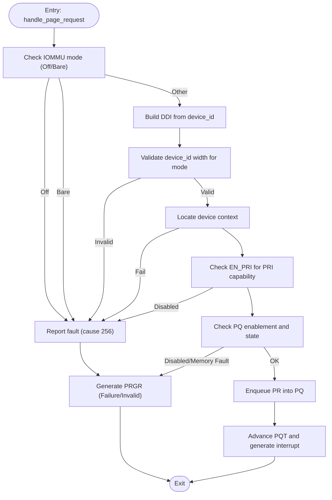
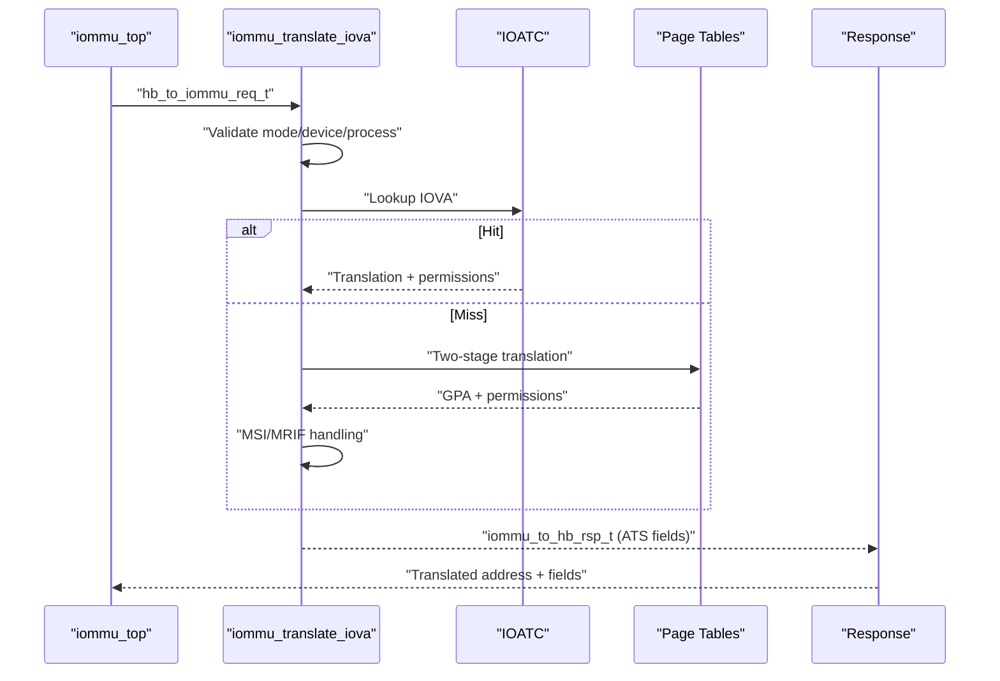
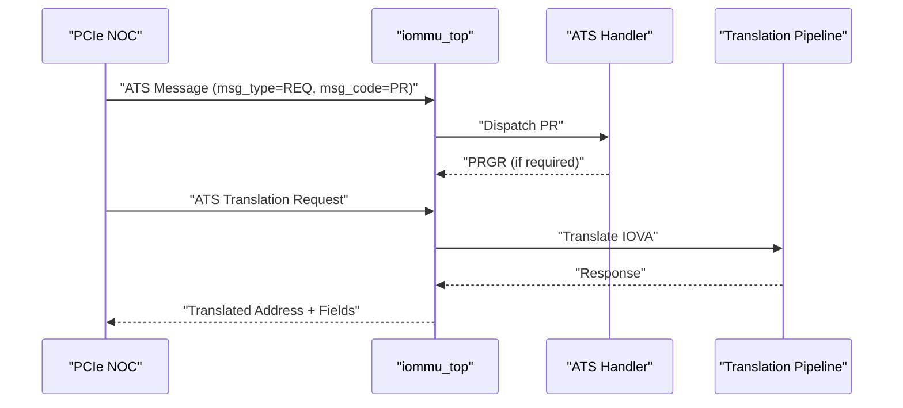
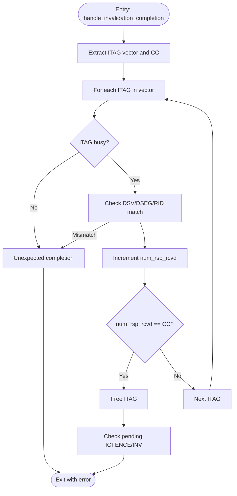
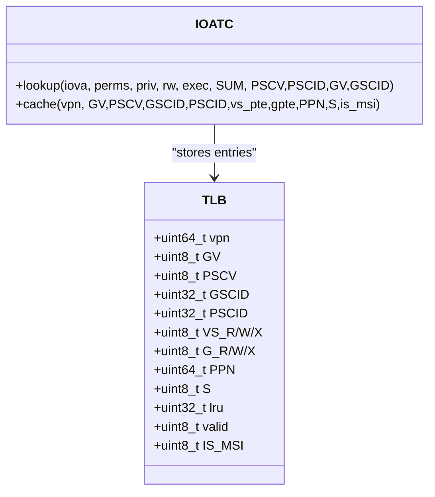
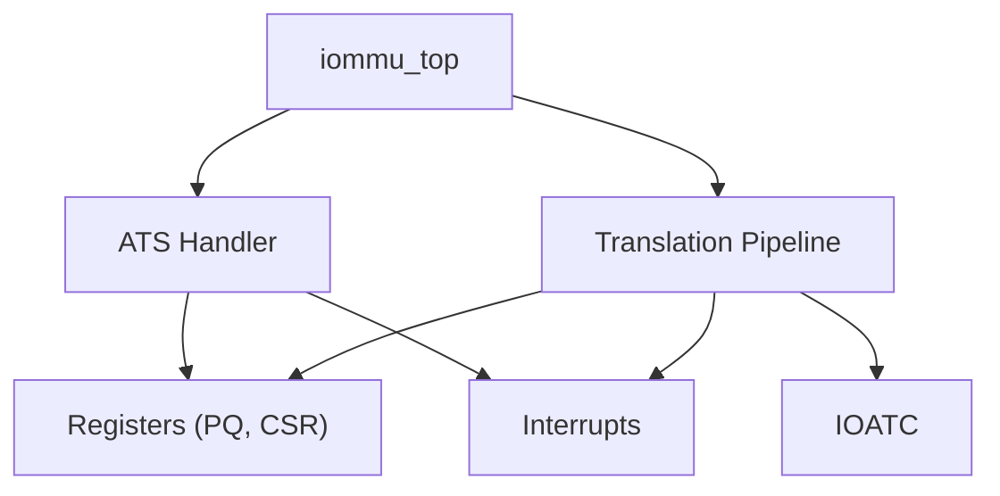

# ATS (Address Translation Services)

<cite>
**Referenced Files in This Document**
- [iommu_ats.hh](file://iommu/iommu_ats.hh)
- [iommu_ats.cc](file://iommu/iommu_ats.cc)
- [iommu_atc.hh](file://iommu/iommu_atc.hh)
- [iommu_atc.cc](file://iommu/iommu_atc.cc)
- [iommu_translate.hh](file://iommu/iommu_translate.hh)
- [iommu_translate.cc](file://iommu/iommu_translate.cc)
- [iommu_top.hh](file://iommu/iommu_top.hh)
- [iommu_top.cc](file://iommu/iommu_top.cc)
- [iommu_req_rsp.hh](file://iommu/iommu_req_rsp.hh)
- [iommu_struct.hh](file://iommu/iommu_struct.hh)
- [iommu_registers.hh](file://iommu/iommu_registers.hh)
- [iommu_interrupt.hh](file://iommu/iommu_interrupt.hh)
- [iommu_interrupt.cc](file://iommu/iommu_interrupt.cc)
- [iommu_utils.hh](file://iommu/iommu_utils.hh)
- [iommu_utils.cc](file://iommu/iommu_utils.cc)
- [test_pcienoc.hh](file://pcienoc/test_pcienoc.hh)
</cite>

## Table of Contents
1. [Introduction](#introduction)
2. [Project Structure](#project-structure)
3. [Core Components](#core-components)
4. [Architecture Overview](#architecture-overview)
5. [Detailed Component Analysis](#detailed-component-analysis)
6. [Dependency Analysis](#dependency-analysis)
7. [Performance Considerations](#performance-considerations)
8. [Troubleshooting Guide](#troubleshooting-guide)
9. [Conclusion](#conclusion)
10. [Appendices](#appendices)

## Introduction
This document explains the ATS (Address Translation Services) implementation in the IOMMU model, focusing on PCIe ATS/PRI message processing, ATS translation request handling, invalidation workflows, and integration with the PCIe NOC interface. It covers ATS message types (page requests and invalidation requests), ATS handler implementation, validation and error handling, response generation, and performance optimization strategies. Practical ATS communication scenarios and integration patterns with PCIe devices are included.

## Project Structure
The ATS implementation spans several IOMMU modules:
- ATS message definitions and handlers
- ATS translation request pipeline
- PCIe NOC integration via SystemC sockets
- ATS Translation Cache (ATC) for performance
- Interrupt and queue management for ATS queues

```mermaid
graph TB
subgraph "SystemC Top"
TOP["iommu_top<br/>AXI/AHB bridges"]
end
subgraph "IOMMU Core"
ATS["ATS Handler<br/>Page Requests / Invalidation"]
TR["Translation Pipeline<br/>ATS Translation Requests"]
ATC["ATS Translation Cache<br/>IOATC"]
REG["Registers<br/>PQ CSR, PQ Base/Index"]
INT["Interrupts<br/>PQ/FAULT/CMD"]
end
subgraph "PCIe NOC"
HB["Host Bridge / RP"]
end
TOP --> ATS
TOP --> TR
ATS --> REG
TR --> ATC
TR --> REG
ATS --> INT
TR --> INT
TOP <-- HB
```

**Diagram sources**
- [iommu_top.cc:77-180](file://iommu/iommu_top.cc#L77-L180)
- [iommu_ats.cc:96-373](file://iommu/iommu_ats.cc#L96-L373)
- [iommu_translate.cc:8-694](file://iommu/iommu_translate.cc#L8-L694)
- [iommu_atc.cc:150-233](file://iommu/iommu_atc.cc#L150-L233)
- [iommu_registers.hh:419-454](file://iommu/iommu_registers.hh#L419-L454)
- [iommu_interrupt.cc:28-106](file://iommu/iommu_interrupt.cc#L28-L106)

**Section sources**
- [iommu_top.hh:19-56](file://iommu/iommu_top.hh#L19-L56)
- [iommu_top.cc:77-180](file://iommu/iommu_top.cc#L77-L180)

## Core Components
- ATS message types and structures: page request (PR) and PRG response (PRGR), invalidation request (INV_REQ) and invalidation completion (INV_CC), plus PR payload fields and PRGR response codes.
- ATS handler: validates device context, checks ATS/PRI enablement, enqueues PR into PQ, and generates PRGR when required.
- ATS translation request pipeline: performs two-stage translation, consults IOATC, caches translations, and returns ATS-specific response fields.
- PCIe NOC integration: routes ATS messages and translation requests through SystemC sockets and translates ATS messages into internal ATS structures.
- ATS Translation Cache (ATC): TLB-like cache for ATS translations to reduce page walks and improve latency.

**Section sources**
- [iommu_ats.hh:47-96](file://iommu/iommu_ats.hh#L47-L96)
- [iommu_ats.cc:96-373](file://iommu/iommu_ats.cc#L96-L373)
- [iommu_translate.cc:8-694](file://iommu/iommu_translate.cc#L8-L694)
- [iommu_atc.cc:150-233](file://iommu/iommu_atc.cc#L150-L233)
- [iommu_top.cc:96-180](file://iommu/iommu_top.cc#L96-L180)

## Architecture Overview
The ATS subsystem integrates with the PCIe NOC via the SystemC top module. Incoming ATS messages (e.g., page requests) are parsed and dispatched to the ATS handler. Translation requests (ATS translation requests) traverse the translation pipeline, consult the IOATC, and return ATS-specific response fields. ATS invalidation requests are tracked via ITAGs and coordinated with IOFENCE operations.



**Diagram sources**
- [iommu_top.cc:96-180](file://iommu/iommu_top.cc#L96-L180)
- [iommu_ats.cc:96-373](file://iommu/iommu_ats.cc#L96-L373)
- [iommu_translate.cc:336-476](file://iommu/iommu_translate.cc#L336-L476)
- [iommu_atc.cc:150-233](file://iommu/iommu_atc.cc#L150-L233)
- [iommu_registers.hh:419-454](file://iommu/iommu_registers.hh#L419-L454)

## Detailed Component Analysis

### ATS Message Types and Structures
- Page Request (PR): carries requester RID, PASID (PV/PID), privilege/exec request, and PR payload including Last/Read/Write flags and PRGI.
- PRG Response (PRGR): response to PR with status code and PRGI; includes optional PASID depending on PRPR policy.
- Invalidation Request (INV_REQ) and Invalidation Completion (INV_CC): used to invalidate ATS translations; INV_CC carries per-ITAG completion counts and vector.

Key structures and constants define message codes, PR payload fields, and PRGR status encodings.

**Section sources**
- [iommu_ats.hh:47-96](file://iommu/iommu_ats.hh#L47-L96)
- [iommu_ats.cc:96-373](file://iommu/iommu_ats.cc#L96-L373)

### ATS Handler Implementation
The ATS handler performs:
- Device context lookup and validation
- ATS/PRI enablement checks
- Page-request-queue (PQ) eligibility (enabled, not full, no memory fault)
- Enqueue PR into PQ and update indices
- Generate PRGR when PR requires response or on error conditions
- Track ITAGs for invalidation requests and coordinate with IOFENCE



**Diagram sources**
- [iommu_ats.cc:96-373](file://iommu/iommu_ats.cc#L96-L373)
- [iommu_translate.cc:178-207](file://iommu/iommu_translate.cc#L178-L207)

**Section sources**
- [iommu_ats.cc:96-373](file://iommu/iommu_ats.cc#L96-L373)

### ATS Translation Request Pipeline
The ATS translation request pipeline:
- Validates IOMMU mode and device/process contexts
- Determines first-stage and guest-stage page table modes
- Consults IOATC for hit/miss
- Performs two-stage translation on miss
- Handles MSI translation and MRIF mode
- Returns ATS-specific response fields (Priv, Global, R/W/X, PBMT, CXL_IO, N, AMA)



**Diagram sources**
- [iommu_translate.cc:8-694](file://iommu/iommu_translate.cc#L8-L694)
- [iommu_atc.cc:150-233](file://iommu/iommu_atc.cc#L150-L233)

**Section sources**
- [iommu_translate.cc:8-694](file://iommu/iommu_translate.cc#L8-L694)
- [iommu_atc.cc:150-233](file://iommu/iommu_atc.cc#L150-L233)

### PCIe NOC Integration and Message Routing
The SystemC top module integrates with the PCIe NOC:
- Routes ATS messages (e.g., PR/STOP) to the ATS handler
- Routes ATS translation requests through the translation pipeline
- Sends PRGR responses back to the RP via PCIe NOC sockets
- Manages AXI/AHB bridges for register and memory access



**Diagram sources**
- [iommu_top.cc:96-180](file://iommu/iommu_top.cc#L96-L180)
- [test_pcienoc.hh:10-21](file://pcienoc/test_pcienoc.hh#L10-L21)

**Section sources**
- [iommu_top.cc:77-180](file://iommu/iommu_top.cc#L77-L180)
- [test_pcienoc.hh:10-21](file://pcienoc/test_pcienoc.hh#L10-L21)

### ATS Invalidation Workflows and ITAG Management
ATS invalidation requests are tracked via ITAGs:
- Allocate ITAG for pending invalidations
- Track per-ITAG completion counts and vector
- Coordinate with IOFENCE operations and pending invalidations
- Handle timer expiry and timeout signaling



**Diagram sources**
- [iommu_ats.cc:57-82](file://iommu/iommu_ats.cc#L57-L82)
- [iommu_ats.cc:35-55](file://iommu/iommu_ats.cc#L35-L55)

**Section sources**
- [iommu_ats.cc:57-82](file://iommu/iommu_ats.cc#L57-L82)
- [iommu_ats.cc:35-55](file://iommu/iommu_ats.cc#L35-L55)

### ATS Translation Cache (IOATC)
The IOATC caches ATS translations to avoid repeated page walks:
- Stores VPN/NAPOT ranges, permissions, and page sizes
- Supports privilege and SUM checks
- Handles G-stage permission faults by evicting entries
- Supports MSI detection and MRIF mode handling



**Diagram sources**
- [iommu_atc.hh:9-36](file://iommu/iommu_atc.hh#L9-L36)
- [iommu_atc.cc:96-147](file://iommu/iommu_atc.cc#L96-L147)

**Section sources**
- [iommu_atc.hh:9-36](file://iommu/iommu_atc.hh#L9-L36)
- [iommu_atc.cc:96-147](file://iommu/iommu_atc.cc#L96-L147)

## Dependency Analysis
The ATS implementation depends on:
- Translation pipeline for ATS translation requests
- IOATC for fast translation lookups
- Registers for PQ base/index and control/status
- Interrupt subsystem for queue events
- PCIe NOC integration via SystemC sockets



**Diagram sources**
- [iommu_ats.cc:96-373](file://iommu/iommu_ats.cc#L96-L373)
- [iommu_translate.cc:336-476](file://iommu/iommu_translate.cc#L336-L476)
- [iommu_atc.cc:150-233](file://iommu/iommu_atc.cc#L150-L233)
- [iommu_registers.hh:419-454](file://iommu/iommu_registers.hh#L419-L454)
- [iommu_interrupt.cc:28-106](file://iommu/iommu_interrupt.cc#L28-L106)
- [iommu_top.cc:77-180](file://iommu/iommu_top.cc#L77-L180)

**Section sources**
- [iommu_ats.cc:96-373](file://iommu/iommu_ats.cc#L96-L373)
- [iommu_translate.cc:336-476](file://iommu/iommu_translate.cc#L336-L476)
- [iommu_atc.cc:150-233](file://iommu/iommu_atc.cc#L150-L233)
- [iommu_registers.hh:419-454](file://iommu/iommu_registers.hh#L419-L454)
- [iommu_interrupt.cc:28-106](file://iommu/iommu_interrupt.cc#L28-L106)
- [iommu_top.cc:77-180](file://iommu/iommu_top.cc#L77-L180)

## Performance Considerations
- Enable ATS translation caching in IOATC to reduce page table walks for ATS translation requests.
- Configure PQ with sufficient capacity and monitor PQCSR flags to avoid overflow and memory faults.
- Use ITAG allocation efficiently to minimize invalidation batching and reduce completion latency.
- Ensure proper endianness and memory access patterns to avoid PQ memory faults.
- Tune IOFENCE coordination to avoid long stalls when pending invalidations block IOFENCE completion.

[No sources needed since this section provides general guidance]

## Troubleshooting Guide
Common ATS issues and resolutions:
- All inbound transactions disallowed: occurs when IOMMU mode is Off; ATS translation requests return UR, PRs generate PRGR with Response Failure.
- Transaction type disallowed: occurs in Bare mode or when ATS/PRI disabled; PRs generate PRGR with Invalid Request; translation requests return UR.
- PQ disabled/full/memory fault: PRs are dropped; PRGR Success is generated for full condition; PRGR Failure for memory fault.
- Unexpected invalidation completion: mismatch in DSV/DSEG/RID or unexpected ITAG busy state; indicates incorrect routing or stale state.
- MSI/MRIF translation: ATS translation requests to MRIF may require special handling; ensure MRIF mode is supported and handled appropriately.

**Section sources**
- [iommu_ats.cc:117-130](file://iommu/iommu_ats.cc#L117-L130)
- [iommu_ats.cc:204-231](file://iommu/iommu_ats.cc#L204-L231)
- [iommu_ats.cc:64-72](file://iommu/iommu_ats.cc#L64-L72)
- [iommu_translate.cc:616-668](file://iommu/iommu_translate.cc#L616-L668)

## Conclusion
The ATS implementation integrates seamlessly with the IOMMU translation pipeline and PCIe NOC interface. It supports PCIe ATS PR messages, PRGR responses, ATS translation requests, and ATS invalidation workflows with robust validation, error handling, and performance optimizations via IOATC and PQ management. Proper configuration of device contexts, PQ state, and ITAG tracking ensures reliable ATS operation across diverse PCIe device scenarios.

[No sources needed since this section summarizes without analyzing specific files]

## Appendices

### ATS Communication Scenarios
- ATS Translation Request: Host Bridge sends ATS translation request; IOMMU translates IOVA via IOATC and page tables, returning ATS-specific response fields.
- Page Request (PR): PCIe device sends PR; IOMMU validates context, enqueues into PQ, and optionally generates PRGR.
- Invalidation Request: IOMMU tracks ITAGs and coordinates with IOFENCE; INV_CC frees ITAGs upon completion.

**Section sources**
- [iommu_top.cc:120-178](file://iommu/iommu_top.cc#L120-L178)
- [iommu_ats.cc:96-373](file://iommu/iommu_ats.cc#L96-L373)
- [iommu_translate.cc:495-575](file://iommu/iommu_translate.cc#L495-L575)