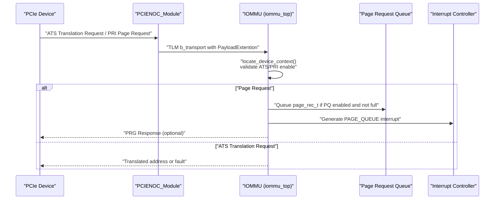
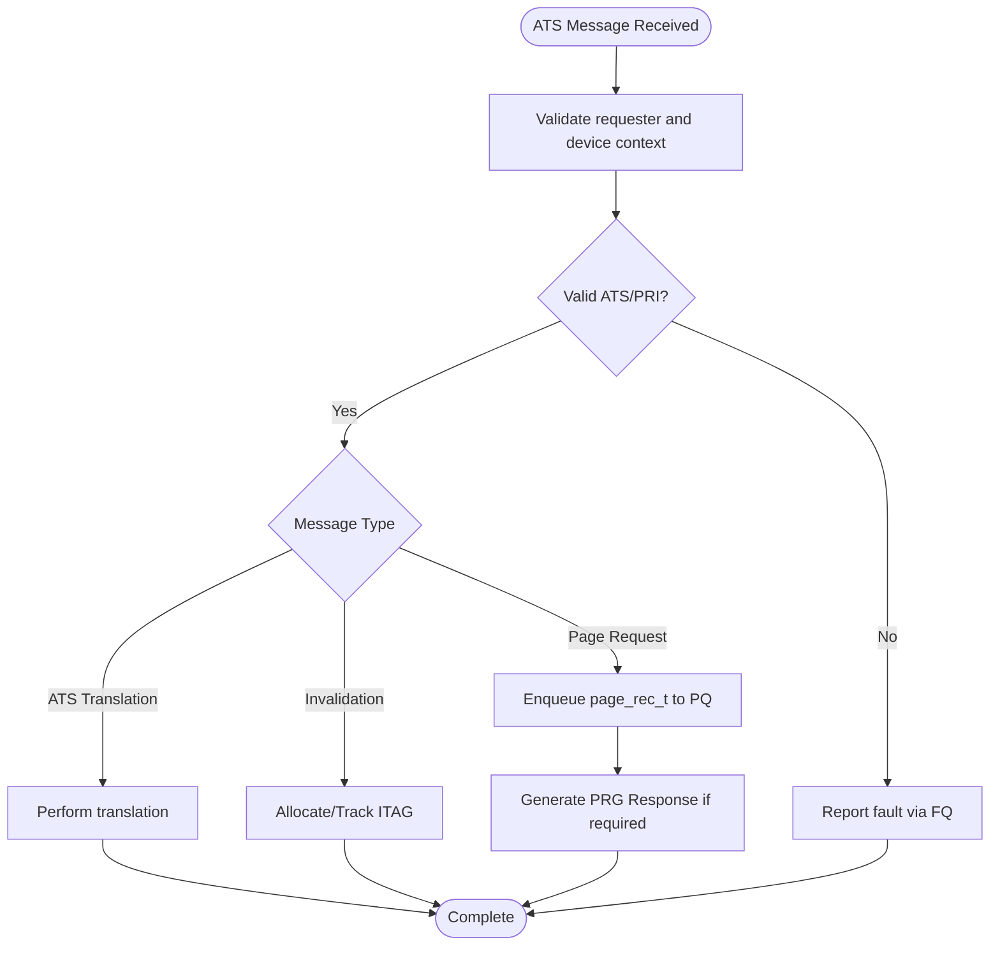
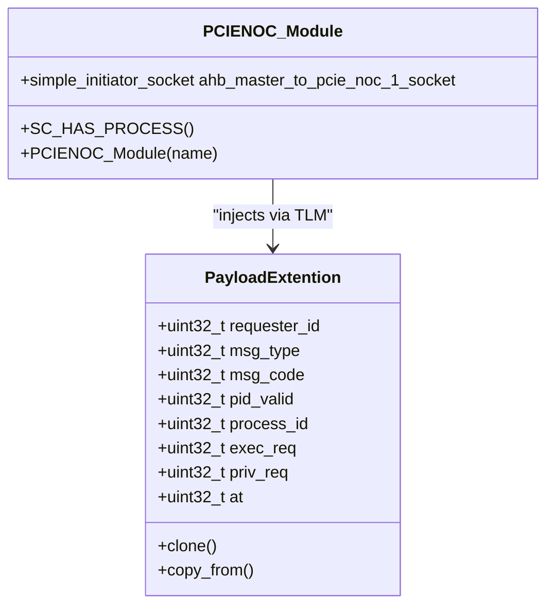
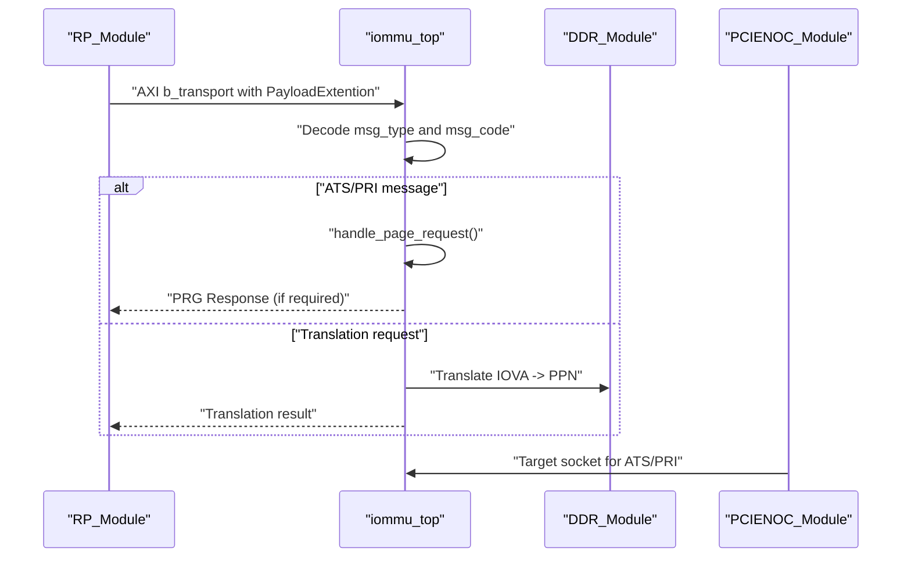
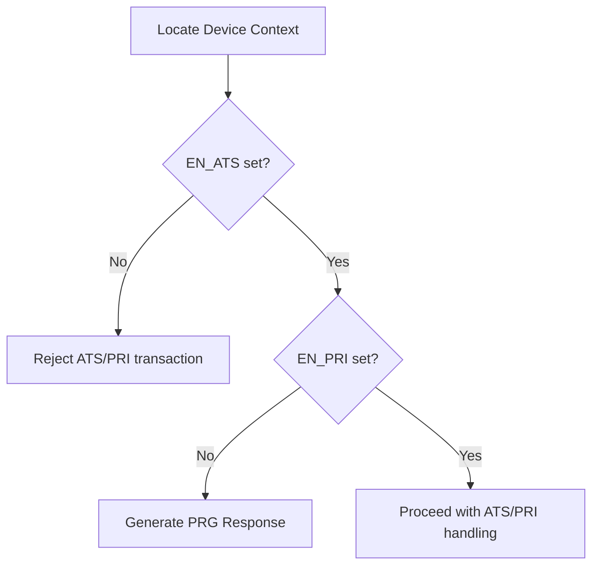
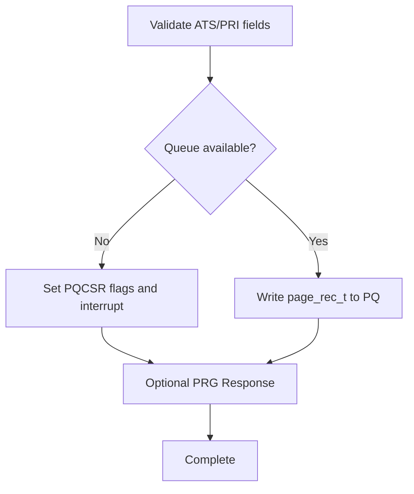
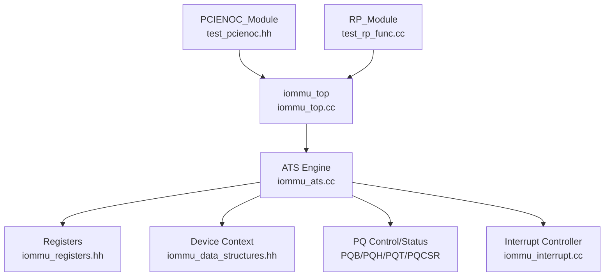

# ATS PCIe NOC Integration

<cite>
**Referenced Files in This Document**
- [main.cpp](file://main.cpp)
- [iommu_top.hh](file://iommu/iommu_top.hh)
- [iommu_top.cc](file://iommu/iommu_top.cc)
- [iommu_ats.hh](file://iommu/iommu_ats.hh)
- [iommu_ats.cc](file://iommu/iommu_ats.cc)
- [iommu_struct.hh](file://iommu/iommu_struct.hh)
- [iommu_registers.hh](file://iommu/iommu_registers.hh)
- [iommu_data_structures.hh](file://iommu/iommu_data_structures.hh)
- [iommu_req_rsp.hh](file://iommu/iommu_req_rsp.hh)
- [param_trans_def.hh](file://iommu/param_trans_def.hh)
- [test_pcienoc.hh](file://pcienoc/test_pcienoc.hh)
- [test_rp_func.cc](file://rp/test_rp_func.cc)
- [test_rp_thread.cc](file://rp/test_rp_thread.cc)
- [iommu_faults.cc](file://iommu/iommu_faults.cc)
- [iommu_interrupt.cc](file://iommu/iommu_interrupt.cc)
</cite>

## Table of Contents
1. [Introduction](#introduction)
2. [Project Structure](#project-structure)
3. [Core Components](#core-components)
4. [Architecture Overview](#architecture-overview)
5. [Detailed Component Analysis](#detailed-component-analysis)
6. [Dependency Analysis](#dependency-analysis)
7. [Performance Considerations](#performance-considerations)
8. [Troubleshooting Guide](#troubleshooting-guide)
9. [Conclusion](#conclusion)
10. [Appendices](#appendices)

## Introduction
This document explains the ATS (Address Translation Services) integration with the PCIe NOC (Network-on-Chip) interface in the IOMMU model. It covers PCIe ATS messaging protocols, ATS message routing through the PCIe NOC, ATS communication patterns between the IOMMU and PCIe devices, ATS message transmission/reception mechanisms, ATS interface configuration, ATS signaling requirements, ATS integration testing infrastructure, ATS message validation, and ATS performance monitoring. Practical examples illustrate ATS communication scenarios, PCIe ATS device integration, and ATS troubleshooting procedures.

## Project Structure
The project is organized around a SystemC-based IOMMU model with supporting modules for PCIe NOC, Root Port (RP), and DRAM (DDR). The IOMMU implements ATS/PRI (Page Request Interface) handling, device context management, and queue-based fault/page-request reporting. The PCIe NOC module provides a target socket for ATS/PRI message injection into the IOMMU pipeline.

```mermaid
graph TB
subgraph "SystemC Top"
MAIN["sc_main<br/>main.cpp"]
IOMMU["iommu_top<br/>iommu/iommu_top.cc"]
RP["RP_Module<br/>rp/test_rp_func.cc"]
NOC["PCIENOC_Module<br/>pcienoc/test_pcienoc.hh"]
DDR["DDR_Module<br/>ddr/test_ddr.cc"]
end
MAIN --> IOMMU
MAIN --> RP
MAIN --> NOC
MAIN --> DDR
IOMMU <- --> RP
IOMMU <- --> NOC
IOMMU <- --> DDR
```

**Diagram sources**
- [main.cpp:38-87](file://main.cpp#L38-L87)
- [iommu_top.hh:19-57](file://iommu/iommu_top.hh#L19-L57)
- [test_pcienoc.hh:10-21](file://pcienoc/test_pcienoc.hh#L10-L21)
- [rp/test_rp_func.cc:23-67](file://rp/test_rp_func.cc#L23-L67)

**Section sources**
- [main.cpp:38-87](file://main.cpp#L38-L87)
- [iommu_top.hh:19-57](file://iommu/iommu_top.hh#L19-L57)
- [test_pcienoc.hh:10-21](file://pcienoc/test_pcienoc.hh#L10-L21)
- [rp/test_rp_func.cc:23-67](file://rp/test_rp_func.cc#L23-L67)

## Core Components
- IOMMU ATS/PRI engine: Handles ATS translation requests, invalidation requests/completions, and page request messages. Manages ITAG allocation, pending invalidations, and PRG (Page Request Group) response generation.
- PCIe NOC interface: Provides a target socket for injecting ATS/PRI messages into the IOMMU pipeline via SystemC TLM.
- RP (Root Port) module: Emulates PCIe upstream behavior, constructs TLM payloads with ATS/PRI metadata, and triggers translation or message processing in the IOMMU.
- Queue infrastructure: Page Request Queue (PQ), Fault Queue (FQ), and Command Queue (CQ) for ATS/PRI event reporting and command processing.
- Interrupt controller: Generates MSI interrupts for page queue, fault queue, and command queue events.

Key ATS/PRI data structures and constants:
- ATS message structure with fields for requester ID, PASID, privilege/exec flags, and payload.
- Page request record structure for PQ entries.
- ITAG tracker for ATS invalidation tracking and completion correlation.

**Section sources**
- [iommu_ats.hh:47-97](file://iommu/iommu_ats.hh#L47-L97)
- [iommu_ats.cc:7-374](file://iommu/iommu_ats.cc#L7-L374)
- [iommu_struct.hh:42-99](file://iommu/iommu_struct.hh#L42-L99)
- [iommu_registers.hh:419-454](file://iommu/iommu_registers.hh#L419-L454)

## Architecture Overview
The ATS/PRI flow integrates with the PCIe NOC through the IOMMU's target sockets. Upstream PCIe devices send ATS translation requests and PRI page requests to the IOMMU via the NOC/RP. The IOMMU validates device contexts, processes ATS/PRI messages, and responds accordingly, potentially queuing page requests and generating PRG responses.



**Diagram sources**
- [iommu_top.cc:96-178](file://iommu/iommu_top.cc#L96-L178)
- [iommu_ats.cc:96-373](file://iommu/iommu_ats.cc#L96-L373)
- [iommu_registers.hh:419-454](file://iommu/iommu_registers.hh#L419-L454)

**Section sources**
- [iommu_top.cc:96-178](file://iommu/iommu_top.cc#L96-L178)
- [iommu_ats.cc:96-373](file://iommu/iommu_ats.cc#L96-L373)
- [iommu_registers.hh:419-454](file://iommu/iommu_registers.hh#L419-L454)

## Detailed Component Analysis

### ATS Message Handling Engine
The ATS engine manages:
- ITAG allocation and tracking for ATS invalidation requests.
- Pending invalidation coordination with IOFENCE operations.
- ATS timer expiry handling to release blocked ITAGs.
- Page request message processing, including validation, PQ enqueue, and PRG response generation.



**Diagram sources**
- [iommu_ats.cc:96-373](file://iommu/iommu_ats.cc#L96-L373)
- [iommu_ats.hh:85-91](file://iommu/iommu_ats.hh#L85-L91)

**Section sources**
- [iommu_ats.cc:7-94](file://iommu/iommu_ats.cc#L7-L94)
- [iommu_ats.cc:96-373](file://iommu/iommu_ats.cc#L96-L373)
- [iommu_ats.hh:47-97](file://iommu/iommu_ats.hh#L47-L97)

### PCIe NOC Interface and Message Injection
The PCIe NOC module exposes a target socket that accepts TLM transactions carrying ATS/PRI metadata via a custom extension. The RP module constructs these payloads and injects them into the IOMMU pipeline.



**Diagram sources**
- [test_pcienoc.hh:10-21](file://pcienoc/test_pcienoc.hh#L10-L21)
- [param_trans_def.hh:12-97](file://iommu/param_trans_def.hh#L12-L97)

**Section sources**
- [test_pcienoc.hh:10-21](file://pcienoc/test_pcienoc.hh#L10-L21)
- [param_trans_def.hh:12-97](file://iommu/param_trans_def.hh#L12-L97)

### IOMMU Top-Level Integration
The IOMMU top module registers target sockets for AXI and AHB traffic, processes translation requests, and handles ATS/PRI messages. It routes translation completions to DRAM or streams MSI data, and forwards ATS messages back to the RP via a dedicated socket.



**Diagram sources**
- [iommu_top.cc:41-180](file://iommu/iommu_top.cc#L41-L180)
- [iommu_top.hh:22-28](file://iommu/iommu_top.hh#L22-L28)

**Section sources**
- [iommu_top.cc:41-180](file://iommu/iommu_top.cc#L41-L180)
- [iommu_top.hh:22-28](file://iommu/iommu_top.hh#L22-L28)

### ATS Session Management and Device Context
ATS/PRI enablement and behavior are governed by device context fields. The IOMMU validates device contexts, checks ATS/PRI enablement, and enforces transaction type restrictions. The RP module programs device contexts and process contexts to configure ATS/PRI behavior.



**Diagram sources**
- [iommu_ats.cc:169-184](file://iommu/iommu_ats.cc#L169-L184)
- [iommu_data_structures.hh:29-130](file://iommu/iommu_data_structures.hh#L29-L130)

**Section sources**
- [iommu_ats.cc:169-184](file://iommu/iommu_ats.cc#L169-L184)
- [iommu_data_structures.hh:29-130](file://iommu/iommu_data_structures.hh#L29-L130)

### ATS Message Validation and Fault Reporting
The IOMMU validates ATS/PRI messages against device context and queue state. Faults are recorded in the fault queue with appropriate cause codes and interrupt generation when enabled.



**Diagram sources**
- [iommu_ats.cc:199-231](file://iommu/iommu_ats.cc#L199-L231)
- [iommu_faults.cc:8-159](file://iommu/iommu_faults.cc#L8-L159)

**Section sources**
- [iommu_ats.cc:199-231](file://iommu/iommu_ats.cc#L199-L231)
- [iommu_faults.cc:8-159](file://iommu/iommu_faults.cc#L8-L159)

## Dependency Analysis
The ATS/PRI subsystem depends on:
- Device context configuration (EN_ATS, EN_PRI, T2GPA, PRPR).
- Queue infrastructure (PQ, FQ, CQ) and their control/status registers.
- Interrupt controller for MSI delivery.
- PCIe NOC/RP for message injection and translation request routing.



**Diagram sources**
- [iommu_ats.cc:96-373](file://iommu/iommu_ats.cc#L96-L373)
- [iommu_registers.hh:419-454](file://iommu/iommu_registers.hh#L419-L454)
- [iommu_data_structures.hh:324-335](file://iommu/iommu_data_structures.hh#L324-L335)
- [iommu_interrupt.cc:27-106](file://iommu/iommu_interrupt.cc#L27-L106)
- [test_pcienoc.hh:10-21](file://pcienoc/test_pcienoc.hh#L10-L21)
- [rp/test_rp_func.cc:23-67](file://rp/test_rp_func.cc#L23-L67)
- [iommu_top.cc:96-178](file://iommu/iommu_top.cc#L96-L178)

**Section sources**
- [iommu_ats.cc:96-373](file://iommu/iommu_ats.cc#L96-L373)
- [iommu_registers.hh:419-454](file://iommu/iommu_registers.hh#L419-L454)
- [iommu_data_structures.hh:324-335](file://iommu/iommu_data_structures.hh#L324-L335)
- [iommu_interrupt.cc:27-106](file://iommu/iommu_interrupt.cc#L27-L106)
- [test_pcienoc.hh:10-21](file://pcienoc/test_pcienoc.hh#L10-L21)
- [rp/test_rp_func.cc:23-67](file://rp/test_rp_func.cc#L23-L67)
- [iommu_top.cc:96-178](file://iommu/iommu_top.cc#L96-L178)

## Performance Considerations
- Queue sizing: PQCSR controls enablement and overflow conditions; ensure adequate queue depth to avoid overflow and stall conditions.
- Interrupt coalescing: MSI delivery is gated by vector masks; pending interrupts are released when masks clear.
- Translation throughput: Translation requests are processed via AXI b_transport; minimize payload overhead and ensure proper QoS IDs for IOMMU-initiated accesses.
- ATS invalidation batching: ITAG tracking and pending invalidation coordination reduce per-request overhead.

[No sources needed since this section provides general guidance]

## Troubleshooting Guide
Common ATS/PRI issues and diagnostics:
- All inbound transactions disallowed: Cause 256; indicates IOMMU mode Off or misconfiguration.
- Transaction type disallowed: Cause 260; typically EN_PRI disabled for PRI or ATS disabled for ATS.
- Page request queue full/overflow: PQCSR flags indicate overflow; drain PQ or increase queue size.
- Page request queue memory fault: PQCSR indicates memory access fault; fix memory backing PQ.
- Fault queue overflow/memory fault: Indicates severe IOMMU error; investigate device context and queue configuration.

Validation utilities:
- RP test module provides helpers to check fault records and translation responses.
- Queue entry validation routines compare expected fields against logged records.

**Section sources**
- [iommu_faults.cc:8-159](file://iommu/iommu_faults.cc#L8-L159)
- [rp/test_rp_func.cc:70-157](file://rp/test_rp_func.cc#L70-L157)
- [rp/test_rp_thread.cc:61-189](file://rp/test_rp_thread.cc#L61-L189)

## Conclusion
The ATS/PRI integration leverages the IOMMU's queue infrastructure, device context management, and interrupt controller to provide robust ATS translation and PRI page request handling. The PCIe NOC/RP modules enable realistic ATS/PRI message injection and translation request routing. Proper configuration of device contexts, queue sizing, and interrupt handling ensures reliable ATS operation and efficient performance.

[No sources needed since this section summarizes without analyzing specific files]

## Appendices

### Practical ATS Communication Scenarios
- ATS translation request: Device sends ATS translation request; IOMMU translates IOVA to PPN and returns result.
- PRI page request: Device sends page request; IOMMU validates, enqueues to PQ, and optionally generates PRG response.
- ATS invalidation: IOMMU allocates ITAG, tracks completions, and coordinates with pending IOFENCE operations.

**Section sources**
- [iommu_top.cc:96-178](file://iommu/iommu_top.cc#L96-L178)
- [iommu_ats.cc:96-373](file://iommu/iommu_ats.cc#L96-L373)

### PCIe ATS Device Integration Checklist
- Configure device context: EN_ATS, EN_PRI, T2GPA, PRPR according to device capabilities.
- Enable and size PQ: Program PQB, PQH, PQT, PQCSR; ensure capacity for expected PRG volume.
- Configure MSI vectors: Set ICVEC and MSI configuration table for ATS/PRI interrupts.
- Validate translation: Use RP translation helpers to verify IOVA to PPN mapping.

**Section sources**
- [iommu_data_structures.hh:29-130](file://iommu/iommu_data_structures.hh#L29-L130)
- [iommu_registers.hh:419-454](file://iommu/iommu_registers.hh#L419-L454)
- [rp/test_rp_func.cc:181-265](file://rp/test_rp_func.cc#L181-L265)

### ATS Testing Infrastructure
- SystemC testbench: Creates IOMMU, RP, PCIENOC, and DDR modules and binds sockets.
- RP test threads: Exercise translation and ATS/PRI flows, validate responses and faults.
- Queue monitoring: Utilities to check PQ/FQ/CQ entries and CSR states.

**Section sources**
- [main.cpp:38-87](file://main.cpp#L38-L87)
- [rp/test_rp_thread.cc:61-189](file://rp/test_rp_thread.cc#L61-L189)
- [rp/test_rp_func.cc:727-760](file://rp/test_rp_func.cc#L727-L760)