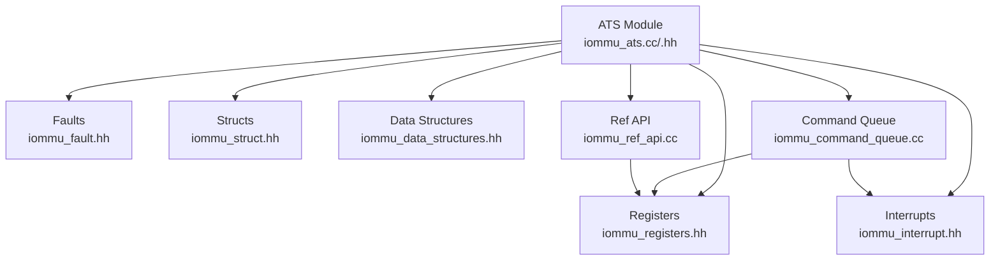
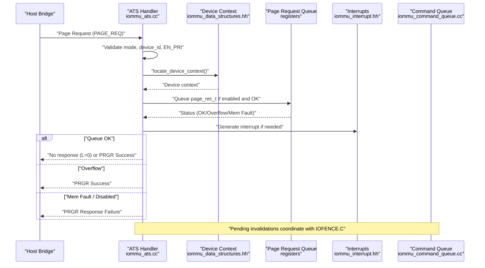
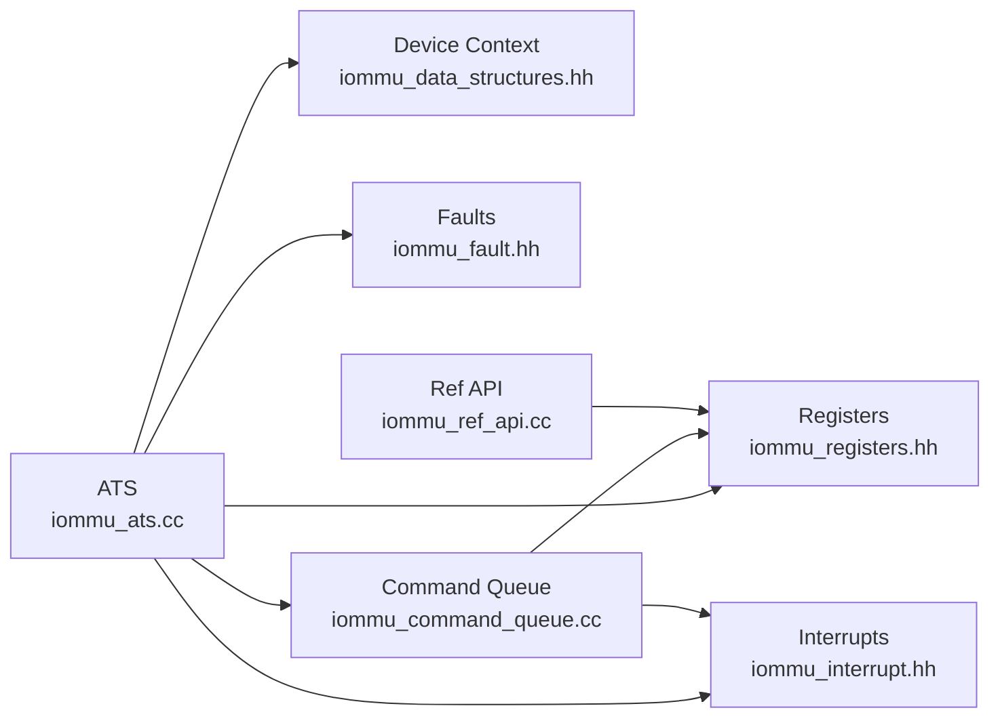

# ATS Protocol Implementation

<cite>
**Referenced Files in This Document**
- [iommu_ats.hh](file://iommu/iommu_ats.hh)
- [iommu_ats.cc](file://iommu/iommu_ats.cc)
- [iommu_struct.hh](file://iommu/iommu_struct.hh)
- [iommu_registers.hh](file://iommu/iommu_registers.hh)
- [iommu_data_structures.hh](file://iommu/iommu_data_structures.hh)
- [iommu_fault.hh](file://iommu/iommu_fault.hh)
- [iommu_interrupt.hh](file://iommu/iommu_interrupt.hh)
- [iommu_ref_api.cc](file://iommu/iommu_ref_api.cc)
- [iommu_command_queue.cc](file://iommu/iommu_command_queue.cc)
- [iommu_utils.hh](file://iommu/iommu_utils.hh)
</cite>

## Table of Contents
1. [Introduction](#introduction)
2. [Project Structure](#project-structure)
3. [Core Components](#core-components)
4. [Architecture Overview](#architecture-overview)
5. [Detailed Component Analysis](#detailed-component-analysis)
6. [Dependency Analysis](#dependency-analysis)
7. [Performance Considerations](#performance-considerations)
8. [Troubleshooting Guide](#troubleshooting-guide)
9. [Conclusion](#conclusion)

## Introduction
This document describes the ATS (Address Translation Services) protocol implementation within the IOMMU model. It covers ATS message types (invalidate requests, invalidate completions, page requests, and PRG responses), ATS message structure and bit-field definitions, payload encoding, validation procedures, ATS handler implementation, parsing logic, ATS state machine management via itag tracking, page record format (page_rec_t), ATS response generation, error handling, status codes, and protocol compliance. Practical workflows and integration points with IOMMU core functionality are included.

## Project Structure
The ATS implementation is primarily located under the iommu/ directory and integrates with IOMMU core components:
- ATS message definitions and constants
- ATS handler logic for page requests and invalidation completions
- ATS state tracking via itag tracker
- Integration with IOMMU registers and queues
- Interrupt and fault reporting mechanisms
- Reference API for sending ATS messages to the host bridge

**Diagram sources**
- [iommu_ats.cc:1-374](file://iommu/iommu_ats.cc#L1-L374)
- [iommu_ats.hh:1-98](file://iommu/iommu_ats.hh#L1-L98)
- [iommu_registers.hh:1-987](file://iommu/iommu_registers.hh#L1-L987)
- [iommu_command_queue.cc:560-676](file://iommu/iommu_command_queue.cc#L560-L676)
- [iommu_ref_api.cc:145-196](file://iommu/iommu_ref_api.cc#L145-L196)

**Section sources**
- [iommu_ats.hh:1-98](file://iommu/iommu_ats.hh#L1-L98)
- [iommu_ats.cc:1-374](file://iommu/iommu_ats.cc#L1-L374)
- [iommu_struct.hh:42-102](file://iommu/iommu_struct.hh#L42-L102)
- [iommu_registers.hh:1-987](file://iommu/iommu_registers.hh#L1-L987)

## Core Components
- ATS message types and constants:
  - Invalidate Request (INVAL_REQ)
  - Invalidate Completion (INVAL_COMPL)
  - Page Request (PAGE_REQ)
  - PRG Response (PRGR)
- ATS message header fields:
  - MSGCODE, TAG, RID, DSV, DSEG, PV, PID, PRIV, EXEC_REQ, PAYLOAD
- Page record format (page_rec_t):
  - Fields: PID, PV, PRIV, EXEC, DID, PAYLOAD, reserved areas
- ATS response status codes:
  - Success, Invalid Request, Response Failure
- ATS state machine:
  - Itag allocation and tracking via itag_tracker_t
  - Pending invalidation coordination with IOFENCE.C

**Section sources**
- [iommu_ats.hh:47-91](file://iommu/iommu_ats.hh#L47-L91)
- [iommu_ats.cc:56-94](file://iommu/iommu_ats.cc#L56-L94)
- [iommu_ats.cc:96-373](file://iommu/iommu_ats.cc#L96-L373)

## Architecture Overview
The ATS subsystem handles inbound PCIe ATS messages and generates outbound ATS messages to the host bridge. It validates device context and queue conditions, constructs page records for page requests, and sends PRG responses when required. It coordinates with the command queue and IOFENCE.C to maintain ordering and completion semantics.

**Diagram sources**
- [iommu_ats.cc:96-373](file://iommu/iommu_ats.cc#L96-L373)
- [iommu_data_structures.hh:324-335](file://iommu/iommu_data_structures.hh#L324-L335)
- [iommu_registers.hh:419-454](file://iommu/iommu_registers.hh#L419-L454)
- [iommu_interrupt.hh:16-25](file://iommu/iommu_interrupt.hh#L16-L25)
- [iommu_command_queue.cc:575-640](file://iommu/iommu_command_queue.cc#L575-L640)

## Detailed Component Analysis

### ATS Message Types and Structures
- Invalidate Request (INVAL_REQ)
  - MSGCODE: 0x01
  - Used to request device ATC invalidation for specific RID/device segments
- Invalidate Completion (INVAL_COMPL)
  - MSGCODE: 0x02
  - Reports completion of prior invalidation requests
- Page Request (PAGE_REQ)
  - MSGCODE: 0x04
  - Payload fields: L (last), W, R, PRGI, Page Address
- PRG Response (PRGR)
  - MSGCODE: 0x05
  - Response code encoding: Success (0), Invalid Request (1), Response Failure (15)
  - Payload fields: Dest RID, Resp Code, PRGI

ATS message header fields:
- MSGCODE: 8 bits
- TAG: 8 bits
- RID: 16 bits requester ID
- DSV: 1 bit device segment valid
- DSEG: 1 bit device segment
- PV: 1 bit PASID valid
- PID: 20 bits PASID
- PRIV: 1 bit privilege requested
- EXEC_REQ: 1 bit execute requested
- DSV/DSEG/RID/PV/PID/PRIV/EXEC_REQ are propagated to PRGR when required
- PAYLOAD: variable-length depending on message type

Page record format (page_rec_t):
- Fields: PID (20), PV (1), PRIV (1), EXEC (1), DID (24), PAYLOAD (64)
- Total size: 16 bytes
- Stored in PQ with PQ entry size equal to page_rec_t

PRG response status encoding:
- Success: 0x0
- Invalid Request: 0x1
- Response Failure: 0xF
- Unused codes 0x2..0xE are treated as Response Failure

**Section sources**
- [iommu_ats.hh:47-91](file://iommu/iommu_ats.hh#L47-L91)
- [iommu_ats.hh:1-34](file://iommu/iommu_ats.hh#L1-L34)
- [iommu_ats.cc:300-373](file://iommu/iommu_ats.cc#L300-L373)

### ATS Handler Implementation: Page Request Processing
The handler performs the following steps:
1. Determine device_id from DSV/DSEG/RID
2. Validate IOMMU mode and PRI enablement
3. Compute DDI based on capabilities.MSI_FLAT
4. Validate device_id width against current mode
5. Locate device context and check EN_PRI
6. Validate PQ enablement, memory fault, and overflow conditions
7. If OK, write page_rec_t to PQ and advance pqt
8. If error, generate PRGR with appropriate status

Key validations and error conditions:
- IOMMU mode Off: report fault cause 256, PRGR Response Failure
- IOMMU mode Bare: report fault cause 260, PRGR Invalid Request
- Device_id exceeds mode capacity: report fault cause 260, PRGR Invalid Request
- EN_PRI disabled: report fault cause 260, PRGR Invalid Request
- PQ disabled or PQMF set: PRGR Response Failure
- PQOF set: PRGR Success (auto-complete)
- PQ full: set PQCSR.pqof, interrupt, PRGR Success

PRGR payload encoding:
- Bits 63:48: Dest RID
- Bits 47:44: Response Code
- Bits 43:32: PRGI
- Other bits reserved

**Section sources**
- [iommu_ats.cc:96-373](file://iommu/iommu_ats.cc#L96-L373)
- [iommu_fault.hh:52-77](file://iommu/iommu_fault.hh#L52-L77)
- [iommu_registers.hh:419-454](file://iommu/iommu_registers.hh#L419-L454)

### ATS Handler Implementation: Invalidation Completion Handling
On receipt of INVAL_COMPL:
- Extract itag_vector and completion counter (cc)
- For each set bit i in itag_vector:
  - Verify the tracked entry is busy
  - If DSV=1, verify DSEG matches
  - Verify RID matches
  - Increment num_rsp_rcvd and complete when it equals cc
- After processing, resume pending IOFENCE and blocked ATS invalidations

Timer expiry:
- Marks specified itags as complete and sets timeout flag
- Enables resumption of pending IOFENCE and ATS invalidations

Allocation and tracking:
- allocate_itag() finds free slot and initializes DSV/DSEG/RID/num_rsp_rcvd
- any_ats_invalidation_requests_pending() checks for active itags

**Section sources**
- [iommu_ats.cc:56-94](file://iommu/iommu_ats.cc#L56-L94)
- [iommu_ats.cc:7-33](file://iommu/iommu_ats.cc#L7-L33)
- [iommu_ats.hh:85-91](file://iommu/iommu_ats.hh#L85-L91)

### ATS State Machine Management
The ATS state machine centers on the itag tracker:
- Busy flag indicates active invalidation
- DSV/DSEG/RID track the scope of the invalidation
- num_rsp_rcvd counts completions and completes the tag when equal to cc
- Timer expiry forces completion and marks timeout

Integration with IOFENCE.C:
- do_iofence_c() sets wait flag if ATS invalidations are pending
- do_pending_iofence_inval_reqs() resumes IOFENCE after all ATS invalidations finish or timeout
- queue_any_blocked_ats_inval_req() reissues blocked ATS invalidations when an itag becomes available

**Section sources**
- [iommu_ats.cc:34-55](file://iommu/iommu_ats.cc#L34-L55)
- [iommu_command_queue.cc:575-640](file://iommu/iommu_command_queue.cc#L575-L640)
- [iommu_command_queue.cc:658-676](file://iommu/iommu_command_queue.cc#L658-L676)

### ATS Message Parsing Logic
Parsing helpers:
- get_bits() extracts bitfields from PAYLOAD
- Device ID assembly: RID or RID with DSEG depending on DSV
- PRG payload construction uses get_bits() to extract L/W/R/PRGI

PRG response generation:
- Status derived from error conditions
- PRPR controls whether PASID is included in PRGR
- PAYLOAD assembled with Dest RID, Resp Code, PRGI

**Section sources**
- [iommu_utils.hh:7-9](file://iommu/iommu_utils.hh#L7-L9)
- [iommu_ats.cc:329-371](file://iommu/iommu_ats.cc#L329-L371)

### ATS Message Transmission
Outbound ATS messages are sent via send_msg_iommu_to_hb():
- Maps RID to bus range using internal registers
- Constructs TLM generic payload with MSGCODE/TAG and PAYLOAD
- Extends payload with requester attributes (RID, PV, PID, PRIV, EXEC_REQ, DSEG)
- Uses AXI master socket to deliver to host bridge

**Section sources**
- [iommu_ref_api.cc:145-196](file://iommu/iommu_ref_api.cc#L145-L196)

## Dependency Analysis
The ATS module depends on:
- Register file for mode, queue base/tail/status, and QoS IDs
- Device context for EN_ATS/EN_PRI and PRPR
- Interrupt subsystem for page queue events
- Fault subsystem for reporting error causes
- Command queue for coordinating invalidations and IOFENCE.C

**Diagram sources**
- [iommu_ats.cc:1-374](file://iommu/iommu_ats.cc#L1-L374)
- [iommu_registers.hh:1-987](file://iommu/iommu_registers.hh#L1-L987)
- [iommu_data_structures.hh:324-335](file://iommu/iommu_data_structures.hh#L324-L335)
- [iommu_command_queue.cc:560-676](file://iommu/iommu_command_queue.cc#L560-L676)
- [iommu_ref_api.cc:145-196](file://iommu/iommu_ref_api.cc#L145-L196)

**Section sources**
- [iommu_ats.cc:1-374](file://iommu/iommu_ats.cc#L1-L374)
- [iommu_command_queue.cc:560-676](file://iommu/iommu_command_queue.cc#L560-L676)
- [iommu_ref_api.cc:145-196](file://iommu/iommu_ref_api.cc#L145-L196)

## Performance Considerations
- Page request queue sizing: log2szm1 determines queue depth; larger queues reduce overflow risk
- Endianness: fctl.be selects endianness for memory accesses to queues and device contexts
- Interrupt coalescing: PQCSR.pip reduces interrupt frequency when multiple entries are produced
- Command queue stalls: ATS invalidations may block command queue until itag is available

## Troubleshooting Guide
Common ATS error scenarios and resolutions:
- All inbound transactions disallowed (cause 256): IOMMU in Off mode; switch to a valid mode
- Transaction type disallowed (cause 260): PRI disabled or device_id out of mode bounds; enable PRI and adjust device_id
- Page-request queue disabled (pqcsr.pqen/pqon clear): Enable PQ and ensure base/tail alignment
- Page-request queue memory fault (pqcsr.pqmf set): Fix memory access to PQ base; clear pqmf
- Page-request queue overflow (pqcsr.pqof set): Drain PQ (advance pqh) or increase queue size
- ATS invalidation timeout: Investigate host bridge responsiveness; consider retry or diagnostics

**Section sources**
- [iommu_ats.cc:117-165](file://iommu/iommu_ats.cc#L117-L165)
- [iommu_ats.cc:199-231](file://iommu/iommu_ats.cc#L199-L231)
- [iommu_ats.cc:212-215](file://iommu/iommu_ats.cc#L212-L215)
- [iommu_ats.cc:268-273](file://iommu/iommu_ats.cc#L268-L273)
- [iommu_command_queue.cc:600-608](file://iommu/iommu_command_queue.cc#L600-L608)

## Conclusion
The ATS implementation provides robust handling of PCIe ATS messages, including strict validation of device contexts and queue conditions, accurate PRG response generation, and coordinated invalidation state management. Integration with IOMMU registers, interrupts, and the command queue ensures protocol compliance and proper ordering with respect to IOFENCE.C. The design balances correctness, performance, and diagnostics to support reliable ATS/PRI operation.