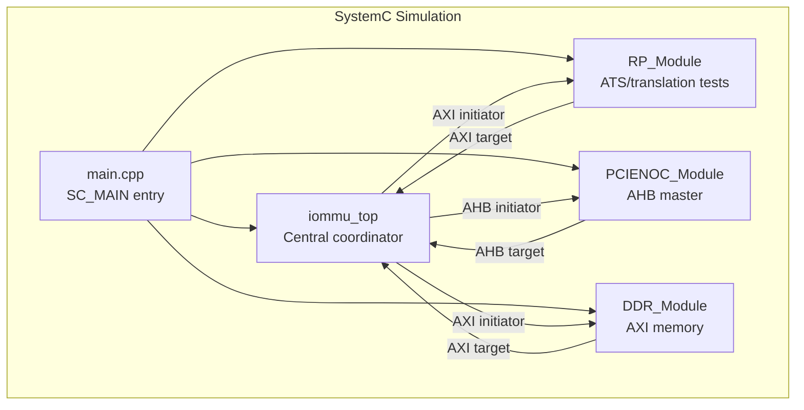
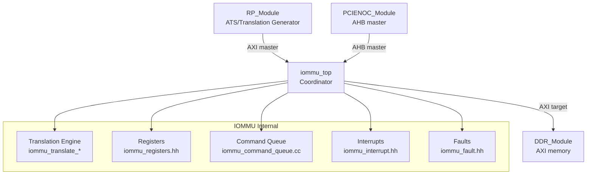
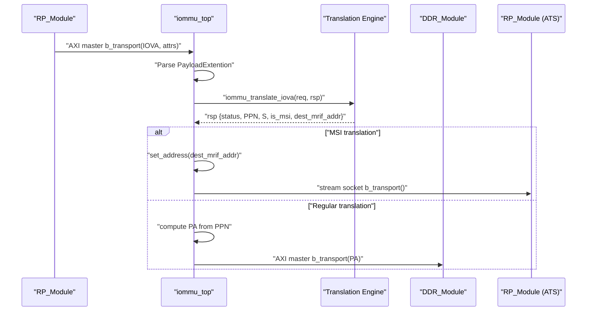
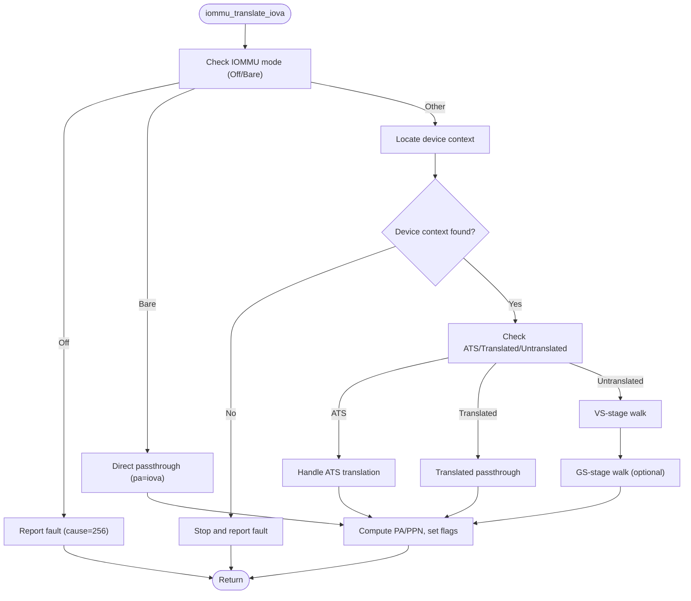
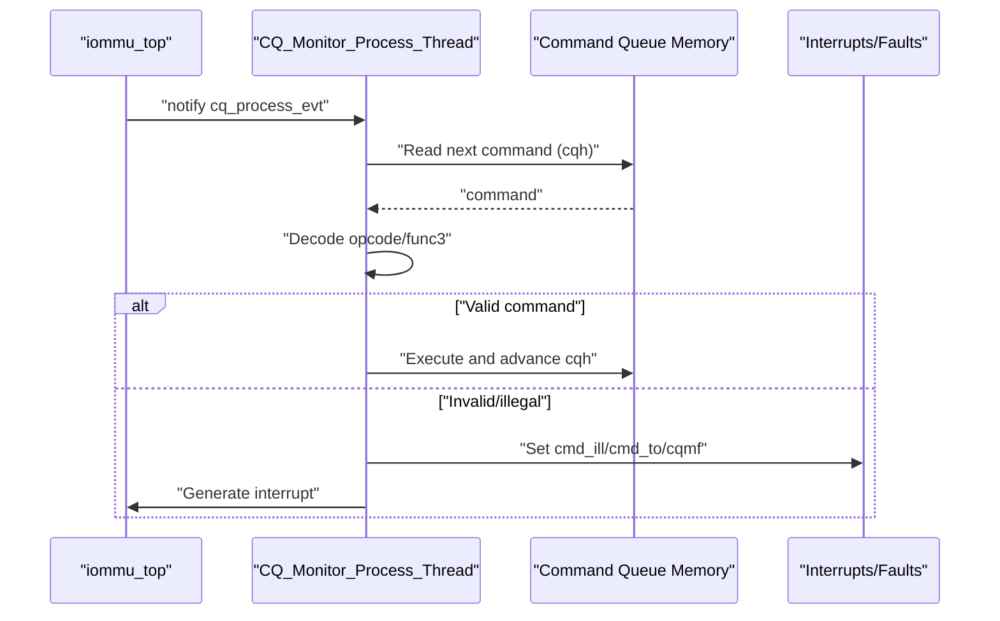
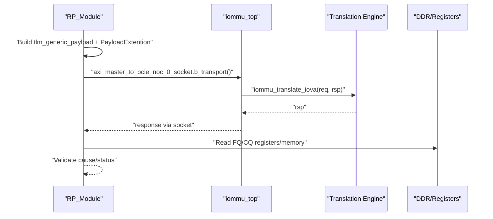
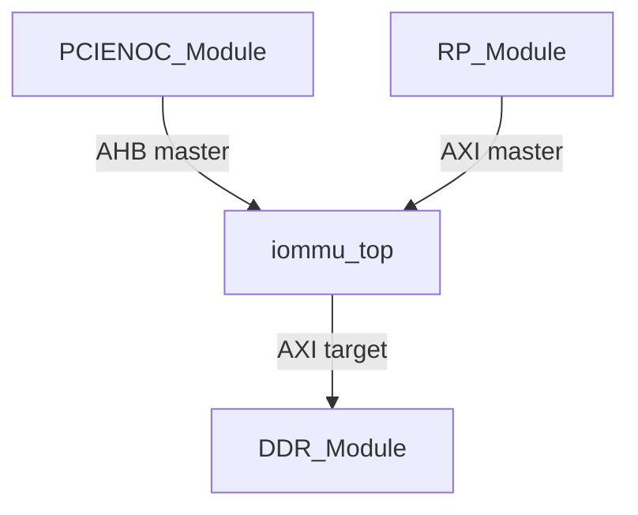
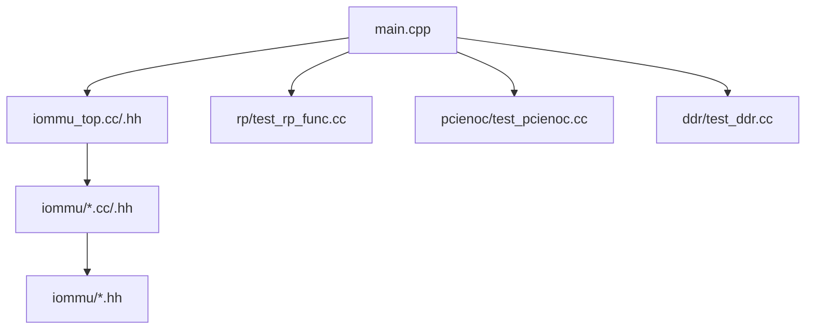

# Architecture Overview

<cite>
**Referenced Files in This Document**
- [main.cpp](file://main.cpp)
- [Makefile](file://Makefile)
- [iommu_top.hh](file://iommu/iommu_top.hh)
- [iommu_top.cc](file://iommu/iommu_top.cc)
- [param_trans_def.hh](file://iommu/param_trans_def.hh)
- [iommu_req_rsp.hh](file://iommu/iommu_req_rsp.hh)
- [iommu_struct.hh](file://iommu/iommu_struct.hh)
- [iommu_translate.cc](file://iommu/iommu_translate.cc)
- [iommu_command_queue.cc](file://iommu/iommu_command_queue.cc)
- [iommu_interrupt.hh](file://iommu/iommu_interrupt.hh)
- [iommu_fault.hh](file://iommu/iommu_fault.hh)
- [iommu_registers.hh](file://iommu/iommu_registers.hh)
- [test_rp.hh](file://rp/test_rp.hh)
- [test_rp_func.cc](file://rp/test_rp_func.cc)
- [test_pcienoc.hh](file://pcienoc/test_pcienoc.hh)
- [test_ddr.hh](file://ddr/test_ddr.hh)
</cite>

## Table of Contents
1. [Introduction](#introduction)
2. [Project Structure](#project-structure)
3. [Core Components](#core-components)
4. [Architecture Overview](#architecture-overview)
5. [Detailed Component Analysis](#detailed-component-analysis)
6. [Dependency Analysis](#dependency-analysis)
7. [Performance Considerations](#performance-considerations)
8. [Troubleshooting Guide](#troubleshooting-guide)
9. [Conclusion](#conclusion)

## Introduction
This document describes the architecture of the IOMMU SystemC model. The IOMMU is modeled as a transaction-level SystemC simulation with a central top-level module coordinating interactions among RP (Root Complex/ATS endpoint), DDR memory, and PCIe NOC (Network-on-Chip) interfaces. The design uses TLM 2.0 sockets for inter-module communication, enabling event-driven simulation of address translation, ATS messaging, and DMA traffic. Cross-cutting concerns include timing via delays, synchronization via events, and resource management via internal queues and caches.

## Project Structure
The repository organizes code by functional domain:
- Top-level simulation and binding in main.cpp and Makefile
- IOMMU core in iommu/: translation engine, registers, command queue, interrupts, faults, and supporting data structures
- RP (Root Complex/ATS endpoint) in rp/: test harness and translation request generators
- PCIe NOC in pcienoc/: minimal interface for AHB traffic
- DDR in ddr/: simple AXI memory model

**Diagram sources**
- [main.cpp:37-79](file://main.cpp#L37-L79)
- [iommu_top.hh:19-56](file://iommu/iommu_top.hh#L19-L56)
- [test_rp.hh:54-112](file://rp/test_rp.hh#L54-L112)
- [test_pcienoc.hh:10-21](file://pcienoc/test_pcienoc.hh#L10-L21)
- [test_ddr.hh:15-61](file://ddr/test_ddr.hh#L15-L61)

**Section sources**
- [main.cpp:37-79](file://main.cpp#L37-L79)
- [Makefile:1-98](file://Makefile#L1-L98)

## Core Components
- iommu_top: Central SystemC module exposing multiple TLM sockets for AXI and AHB traffic, hosting the IOMMU state machine, and driving command queue monitoring.
- RP_Module: Generates translation requests and validates responses; acts as an ATS endpoint and AXI master to the IOMMU.
- PCIENOC_Module: Minimal AHB master module used to simulate NOC-side traffic.
- DDR_Module: Simulated AXI memory with three target sockets for different IOMMU access domains.
- IOMMU internals: Translation engine, register file, command queue, ATS/ATC, interrupts, and fault handling.

Key sockets and roles:
- AXI streams: Stream-to-CMN-RND, Master-0 to PCIe NOC, Master-1 to CMN-RND, Master-2 to PCIe NOC (ATS).
- AXI slaves: From PCIe NOC (AXI), From PCIe NOC (AHB).
- Event-driven command queue monitoring thread.

**Section sources**
- [iommu_top.hh:19-56](file://iommu/iommu_top.hh#L19-L56)
- [iommu_top.cc:6-36](file://iommu/iommu_top.cc#L6-L36)
- [test_rp.hh:54-112](file://rp/test_rp.hh#L54-L112)
- [test_pcienoc.hh:10-21](file://pcienoc/test_pcienoc.hh#L10-L21)
- [test_ddr.hh:15-61](file://ddr/test_ddr.hh#L15-L61)

## Architecture Overview
The IOMMU operates as a transaction-level model with explicit separation of concerns:
- iommu_top coordinates incoming transactions, performs address translation, and forwards traffic to appropriate destinations.
- RP generates requests and validates outcomes; it also handles ATS messages.
- PCIe NOC provides an AHB interface for legacy or auxiliary traffic.
- DDR provides AXI memory backing for DMA and register accesses.

**Diagram sources**
- [iommu_top.cc:77-180](file://iommu/iommu_top.cc#L77-L180)
- [iommu_translate.cc:8-11](file://iommu/iommu_translate.cc#L8-L11)
- [iommu_command_queue.cc:7-13](file://iommu/iommu_command_queue.cc#L7-L13)
- [iommu_interrupt.hh:23-25](file://iommu/iommu_interrupt.hh#L23-L25)
- [iommu_fault.hh:87-89](file://iommu/iommu_fault.hh#L87-L89)
- [iommu_registers.hh:1-200](file://iommu/iommu_registers.hh#L1-L200)

## Detailed Component Analysis

### iommu_top: Central Coordinator
Responsibilities:
- Registers AXI/AHB b_transport handlers for slave sockets.
- Implements translation logic for AXI slave traffic and ATS message handling for AHB slave.
- Forwards translated traffic to DDR via AXI sockets or streams to RP/CMN-RND via dedicated sockets.
- Drives command queue monitoring via an SC_THREAD sensitive to an event.

**Diagram sources**
- [iommu_top.cc:77-180](file://iommu/iommu_top.cc#L77-L180)
- [iommu_translate.cc:8-11](file://iommu/iommu_translate.cc#L8-L11)
- [param_trans_def.hh:12-97](file://iommu/param_trans_def.hh#L12-L97)

**Section sources**
- [iommu_top.hh:19-56](file://iommu/iommu_top.hh#L19-L56)
- [iommu_top.cc:6-36](file://iommu/iommu_top.cc#L6-L36)
- [iommu_top.cc:77-180](file://iommu/iommu_top.cc#L77-L180)

### Translation Pipeline and Data Structures
The translation engine consumes requests with device/process attributes and address type, consults device/process contexts, and produces a physical address or MSI redirection. It tracks transaction types, permissions, and faults.

**Diagram sources**
- [iommu_translate.cc:8-11](file://iommu/iommu_translate.cc#L8-L11)
- [iommu_translate.cc:96-141](file://iommu/iommu_translate.cc#L96-L141)
- [iommu_req_rsp.hh:29-101](file://iommu/iommu_req_rsp.hh#L29-L101)

**Section sources**
- [iommu_translate.cc:8-11](file://iommu/iommu_translate.cc#L8-L11)
- [iommu_req_rsp.hh:29-101](file://iommu/iommu_req_rsp.hh#L29-L101)

### Command Queue and Event-Driven Processing
The command queue is polled by an SC_THREAD sensitive to an event. The monitor checks readiness (enabled, no faults, no stalls) and executes commands from memory-mapped queue entries.

**Diagram sources**
- [iommu_top.hh:32-33](file://iommu/iommu_top.hh#L32-L33)
- [iommu_top.cc:185-192](file://iommu/iommu_top.cc#L185-L192)
- [iommu_command_queue.cc:7-13](file://iommu/iommu_command_queue.cc#L7-L13)

**Section sources**
- [iommu_top.cc:185-192](file://iommu/iommu_top.cc#L185-L192)
- [iommu_command_queue.cc:7-13](file://iommu/iommu_command_queue.cc#L7-L13)

### RP Module: Translation Requests and Validation
The RP module constructs TLM transactions with PayloadExtention metadata, sends them to iommu_top, and validates responses and faults via register reads and memory inspection.

**Diagram sources**
- [test_rp_func.cc:23-67](file://rp/test_rp_func.cc#L23-L67)
- [test_rp_func.cc:112-157](file://rp/test_rp_func.cc#L112-L157)
- [param_trans_def.hh:12-97](file://iommu/param_trans_def.hh#L12-L97)

**Section sources**
- [test_rp.hh:54-112](file://rp/test_rp.hh#L54-L112)
- [test_rp_func.cc:23-67](file://rp/test_rp_func.cc#L23-L67)
- [test_rp_func.cc:112-157](file://rp/test_rp_func.cc#L112-L157)

### PCIe NOC and DDR Modules
- PCIENOC_Module exposes an AHB master socket bound to iommu_top’s AHB slave.
- DDR_Module exposes three AXI target sockets and implements b_transport for read/write with bounds checking.

**Diagram sources**
- [test_pcienoc.hh:10-21](file://pcienoc/test_pcienoc.hh#L10-L21)
- [test_ddr.hh:15-61](file://ddr/test_ddr.hh#L15-L61)
- [iommu_top.hh:27-28](file://iommu/iommu_top.hh#L27-L28)

**Section sources**
- [test_pcienoc.hh:10-21](file://pcienoc/test_pcienoc.hh#L10-L21)
- [test_ddr.hh:15-61](file://ddr/test_ddr.hh#L15-L61)

## Dependency Analysis
The build system compiles all IOMMU sources and links against SystemC. The main binds modules and wires sockets according to the intended topology.

**Diagram sources**
- [Makefile:30-50](file://Makefile#L30-L50)
- [main.cpp:7-12](file://main.cpp#L7-L12)

**Section sources**
- [Makefile:30-50](file://Makefile#L30-L50)
- [main.cpp:7-12](file://main.cpp#L7-L12)

## Performance Considerations
- Transaction-level modeling: Uses TLM 2.0 to abstract memory latency behind delays, enabling coarse-grained timing without cycle-accurate DRAM models.
- Event-driven scheduling: Threads and sockets minimize busy-waiting; command queue processing occurs only when signaled.
- Caching: Internal caches (TLB, ATC, DDT/PDT) reduce repeated translation overhead.
- Pipeline stages: Translation engine separates device/process context lookup, stage walks, and permission checks to support pipelined request handling.

## Troubleshooting Guide
Common areas to inspect:
- Translation failures: Validate device/process contexts, IOMMU mode, and ATS enablement; check fault queue records and causes.
- Command queue stalls: Inspect readiness flags, memory faults, and ITAG tracker availability.
- Socket mismatches: Verify bind order and directionality (initiator/target) in main.cpp.
- Address errors: Confirm address ranges and alignment for AXI transactions.

**Section sources**
- [iommu_fault.hh:52-89](file://iommu/iommu_fault.hh#L52-L89)
- [iommu_command_queue.cc:48-73](file://iommu/iommu_command_queue.cc#L48-L73)
- [test_ddr.hh:44-58](file://ddr/test_ddr.hh#L44-L58)
- [main.cpp:52-65](file://main.cpp#L52-L65)

## Conclusion
The IOMMU SystemC model employs a modular, event-driven design centered on iommu_top. TLM sockets enable clean separation between RP, PCIe NOC, and DDR while preserving transaction semantics. The translation engine, command queue, interrupts, and faults form a cohesive subsystem that supports realistic IOMMU behavior for testing and validation.