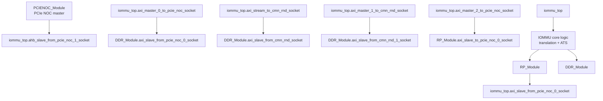
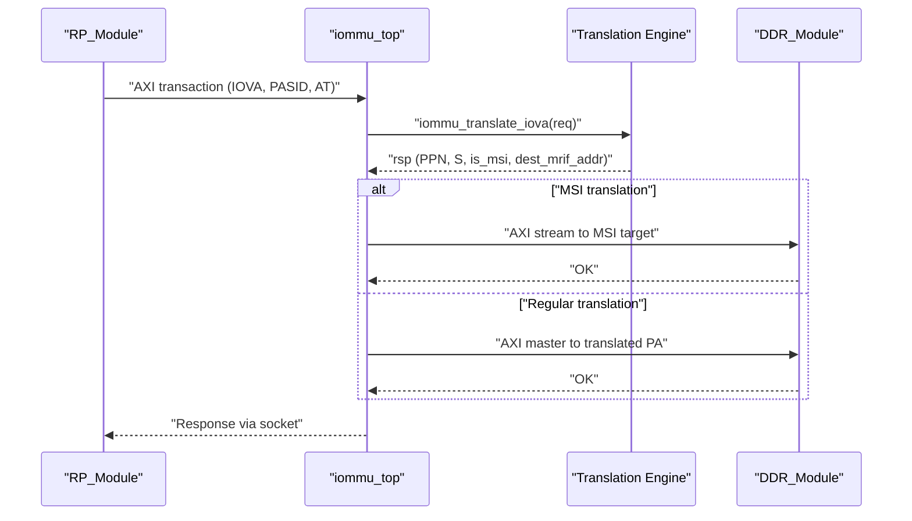
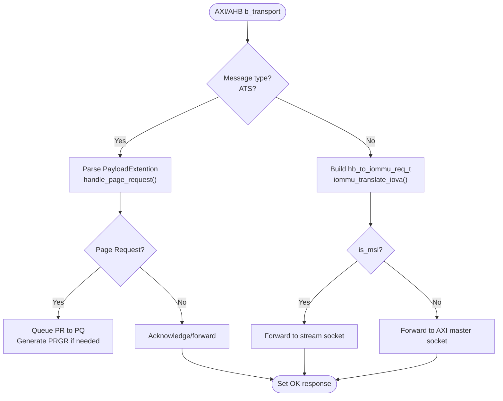
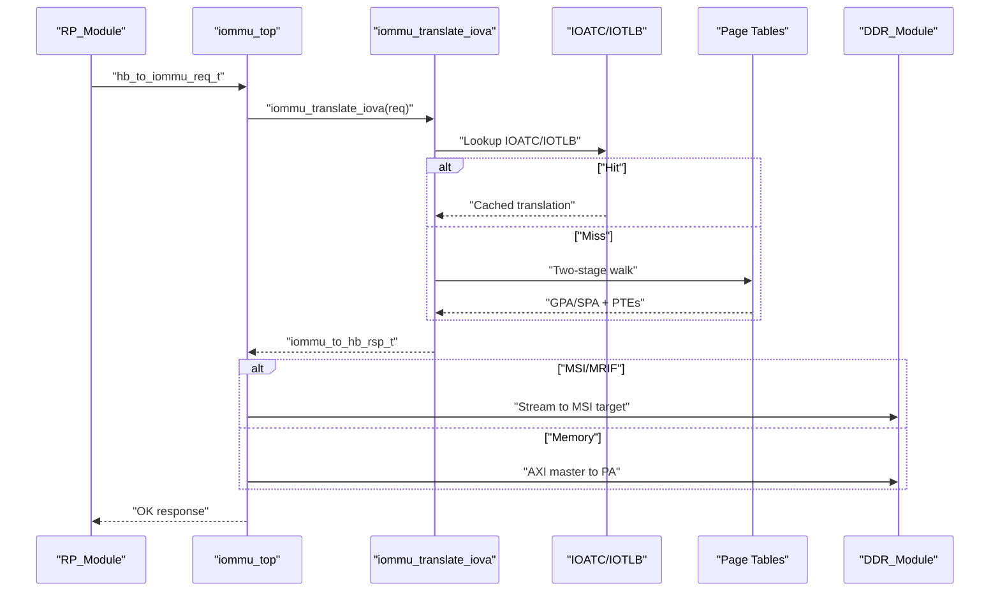
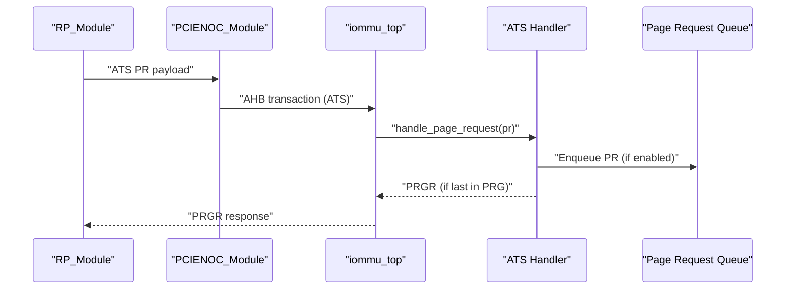
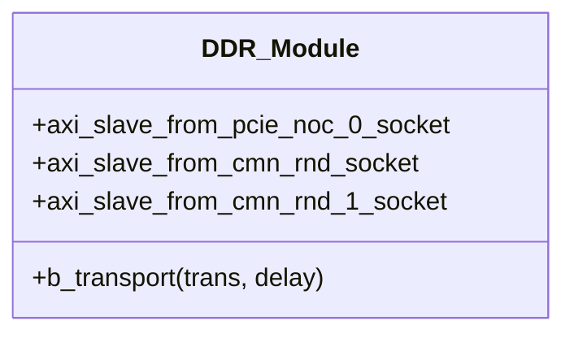
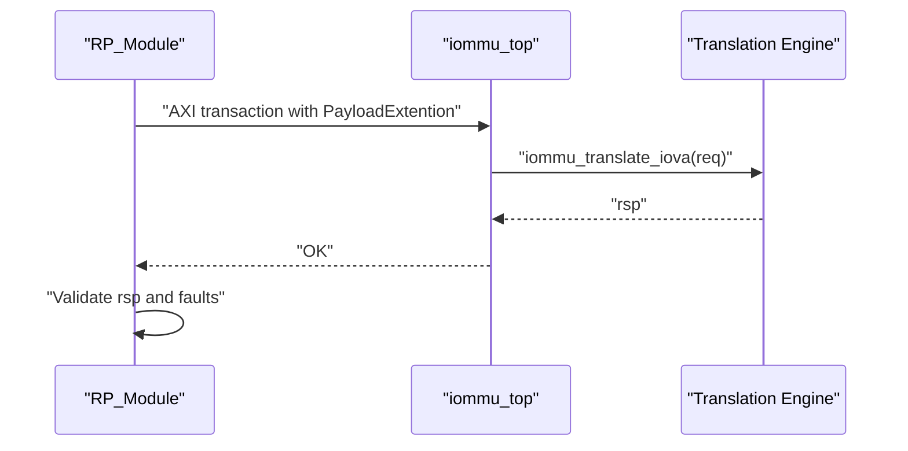
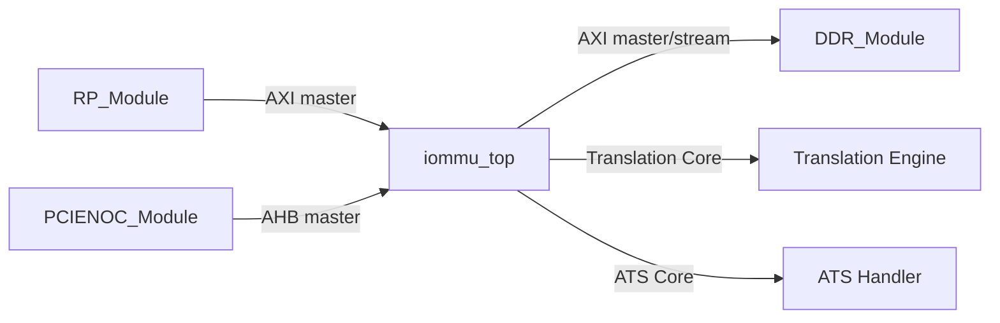

# Component Interactions

<cite>
**Referenced Files in This Document**
- [main.cpp](file://main.cpp)
- [iommu_top.hh](file://iommu/iommu_top.hh)
- [iommu_top.cc](file://iommu/iommu_top.cc)
- [param_trans_def.hh](file://iommu/param_trans_def.hh)
- [iommu_req_rsp.hh](file://iommu/iommu_req_rsp.hh)
- [iommu_struct.hh](file://iommu/iommu_struct.hh)
- [iommu_translate.cc](file://iommu/iommu_translate.cc)
- [iommu_ats.hh](file://iommu/iommu_ats.hh)
- [iommu_ats.cc](file://iommu/iommu_ats.cc)
- [test_rp.hh](file://rp/test_rp.hh)
- [test_rp_func.cc](file://rp/test_rp_func.cc)
- [test_ddr.hh](file://ddr/test_ddr.hh)
- [test_pcienoc.hh](file://pcienoc/test_pcienoc.hh)
</cite>

## Table of Contents
1. [Introduction](#introduction)
2. [Project Structure](#project-structure)
3. [Core Components](#core-components)
4. [Architecture Overview](#architecture-overview)
5. [Detailed Component Analysis](#detailed-component-analysis)
6. [Dependency Analysis](#dependency-analysis)
7. [Performance Considerations](#performance-considerations)
8. [Troubleshooting Guide](#troubleshooting-guide)
9. [Conclusion](#conclusion)

## Introduction
This document explains the component interaction patterns within the IOMMU system model. It focuses on how iommu_top communicates with its major interfaces:
- RP test modules for PCIe traffic
- DDR memory module for memory transactions
- PCIe NOC for ATS messaging

It documents the TLM socket-based communication model, transaction types (requests, responses, acknowledgments), timing constraints, synchronization mechanisms, arbitration, and resource sharing. Sequence diagrams illustrate typical flows for address translation requests, ATS message handling, and command processing.

## Project Structure
The system is built around a SystemC/TLm simulation with four primary modules:
- iommu_top: central IOMMU controller exposing TLM sockets and orchestrating translation and ATS handling
- RP test modules: PCIe requester/test client issuing translation requests and ATS messages
- DDR module: simulated DRAM target for memory transactions
- PCIe NOC module: PCIe interconnect abstraction for ATS and control traffic

**Diagram sources**
- [main.cpp:60-73](file://main.cpp#L60-L73)
- [iommu_top.hh:22-28](file://iommu/iommu_top.hh#L22-L28)
- [test_ddr.hh:21-25](file://ddr/test_ddr.hh#L21-L25)
- [test_rp.hh:56-59](file://rp/test_rp.hh#L56-L59)

**Section sources**
- [main.cpp:38-77](file://main.cpp#L38-L77)
- [iommu_top.hh:19-51](file://iommu/iommu_top.hh#L19-L51)

## Core Components
- iommu_top
  - Provides TLM sockets for PCIe and memory traffic
  - Implements AXI and AHB slave b_transport handlers
  - Orchestrates translation via iommu_translate_iova
  - Handles ATS messages and forwards MSI to stream socket
- RP_Module
  - Generates PCIe translation requests and ATS messages
  - Reads/writes simulated memory via DDR
  - Validates translation responses and faults
- DDR_Module
  - Simulates DRAM with TLM target sockets
  - Implements read/write with bounds checking
- PCIENOC_Module
  - PCIe NOC master for ATS and control traffic

Key data structures:
- PayloadExtention: carries PCIe ATS and PASID metadata in TLM extensions
- hb_to_iommu_req_t / iommu_to_hb_rsp_t: request/response envelopes for translation
- ats_msg_t: ATS message format for PR/INV/PRGR

**Section sources**
- [iommu_top.cc:41-180](file://iommu/iommu_top.cc#L41-L180)
- [param_trans_def.hh:12-97](file://iommu/param_trans_def.hh#L12-L97)
- [iommu_req_rsp.hh:29-101](file://iommu/iommu_req_rsp.hh#L29-L101)
- [iommu_ats.hh:47-91](file://iommu/iommu_ats.hh#L47-L91)
- [test_rp.hh:54-110](file://rp/test_rp.hh#L54-L110)
- [test_ddr.hh:15-60](file://ddr/test_ddr.hh#L15-L60)
- [test_pcienoc.hh:10-19](file://pcienoc/test_pcienoc.hh#L10-L19)

## Architecture Overview
The IOMMU uses a socket-based TLM model:
- iommu_top exposes multiple sockets:
  - AXI master sockets to memory (DMA/data) and RP (ATS replies)
  - AXI stream socket for MSI
  - AXI slave socket for PCIe translation requests
  - AHB slave socket for ATS control
- RP and PCIe NOC connect to iommu_top via bind operations
- Translation path: RP -> iommu_top.axi_slave_from_pcie_noc_0_socket -> iommu_translate_iova -> memory or RP

**Diagram sources**
- [iommu_top.cc:77-180](file://iommu/iommu_top.cc#L77-L180)
- [iommu_translate.cc:8-595](file://iommu/iommu_translate.cc#L8-L595)
- [test_rp_func.cc:23-67](file://rp/test_rp_func.cc#L23-L67)

**Section sources**
- [iommu_top.hh:22-28](file://iommu/iommu_top.hh#L22-L28)
- [iommu_top.cc:77-180](file://iommu/iommu_top.cc#L77-L180)
- [iommu_translate.cc:8-595](file://iommu/iommu_translate.cc#L8-L595)

## Detailed Component Analysis

### iommu_top: Socket Model and Timing
- Socket roles:
  - AXI slave (pcie): incoming PCIe translation requests
  - AHB slave (pcie): ATS control channel
  - AXI masters: memory DMA/data, stream for MSI, ATS replies to RP
- Timing:
  - b_transport is synchronous per TLM semantics; delays are passed through
  - Responses are set on the same transaction object before return
- Control flow:
  - AXI slave handles ATS messages and translation requests
  - Translation invokes iommu_translate_iova and routes to memory or RP
  - AHB slave handles register reads/writes for ATS control

**Diagram sources**
- [iommu_top.cc:77-180](file://iommu/iommu_top.cc#L77-L180)
- [iommu_ats.cc:96-373](file://iommu/iommu_ats.cc#L96-L373)
- [iommu_translate.cc:8-595](file://iommu/iommu_translate.cc#L8-L595)

**Section sources**
- [iommu_top.cc:41-180](file://iommu/iommu_top.cc#L41-L180)
- [iommu_top.hh:35-50](file://iommu/iommu_top.hh#L35-L50)

### Translation Engine: Address Translation Requests
- Input: hb_to_iommu_req_t (device_id, PASID, AT, IOVA, length, read/write/AMO)
- Processing:
  - Device/process context lookup
  - Two-stage translation (VS/G-stage) with IOATC/T2GPA handling
  - MSI address translation and MRIF detection
  - Permission checks and ATS-specific response fields
- Output: iommu_to_hb_rsp_t (status, PPN, S, permissions, MRIF fields)

**Diagram sources**
- [iommu_translate.cc:8-595](file://iommu/iommu_translate.cc#L8-L595)
- [iommu_req_rsp.hh:36-101](file://iommu/iommu_req_rsp.hh#L36-L101)

**Section sources**
- [iommu_translate.cc:8-595](file://iommu/iommu_translate.cc#L8-L595)
- [iommu_req_rsp.hh:29-101](file://iommu/iommu_req_rsp.hh#L29-L101)

### ATS Messaging: Page Requests and Invalidation
- RP sends ATS Page Request (PR) via PCIe NOC to iommu_top AHBSlave
- iommu_top parses PayloadExtention and forwards to handle_page_request
- handle_page_request validates contexts and queues PR to PQ if enabled
- PRGR responses are generated when required
- Invalidation requests (INV) are tracked with itag allocation and completion handling

**Diagram sources**
- [iommu_top.cc:96-118](file://iommu/iommu_top.cc#L96-L118)
- [iommu_ats.cc:96-373](file://iommu/iommu_ats.cc#L96-L373)
- [iommu_ats.hh:47-91](file://iommu/iommu_ats.hh#L47-L91)

**Section sources**
- [iommu_ats.cc:96-373](file://iommu/iommu_ats.cc#L96-L373)
- [iommu_ats.hh:47-91](file://iommu/iommu_ats.hh#L47-L91)

### Memory Transactions: DDR Module
- Provides three AXI target sockets for different IOMMU traffic:
  - AXI master to PCIe NOC (data)
  - AXI stream to CMN/RND (MSI)
  - AXI master to CMN/RND (register/data access)
- Implements b_transport with read/write and bounds checking

**Diagram sources**
- [test_ddr.hh:15-60](file://ddr/test_ddr.hh#L15-L60)

**Section sources**
- [test_ddr.hh:15-60](file://ddr/test_ddr.hh#L15-L60)

### RP Test Module: Request Generation and Validation
- Creates TLM transactions with PayloadExtention metadata
- Issues translation requests and validates responses and faults
- Supports enabling/disabling queues and device contexts

**Diagram sources**
- [test_rp_func.cc:23-67](file://rp/test_rp_func.cc#L23-L67)
- [test_rp_func.cc:159-179](file://rp/test_rp_func.cc#L159-L179)

**Section sources**
- [test_rp_func.cc:23-67](file://rp/test_rp_func.cc#L23-L67)
- [test_rp_func.cc:159-179](file://rp/test_rp_func.cc#L159-L179)

## Dependency Analysis
- Binding in main.cpp establishes the inter-module connections:
  - iommu_top AXI sockets bound to DDR target sockets
  - RP AXI master bound to iommu_top AXI slave
  - PCIe NOC AHB master bound to iommu_top AHB slave
- iommu_top depends on:
  - Translation engine for address resolution
  - ATS handler for PR/INV/PRGR processing
  - Register/file access for queue and capability configuration

**Diagram sources**
- [main.cpp:60-73](file://main.cpp#L60-L73)

**Section sources**
- [main.cpp:60-73](file://main.cpp#L60-L73)

## Performance Considerations
- IOATC/IOTLB hit reduces page table walks and improves latency for repeated translations
- MRIF MSI handling avoids caching MRIF entries in ATC, reducing cache pollution
- Queue-based ATS processing (PQ) decouples request generation from response handling
- TLM b_transport is synchronous; delays propagate through the chain—ensure minimal overhead in socket handlers

## Troubleshooting Guide
Common issues and diagnostics:
- Translation failures:
  - Check cause codes and fault logging for unsupported request/completer abort
  - Validate device/process contexts and ATS/PRI enablement
- ATS PR queue errors:
  - Verify PQCSR state (pqof/pqmf) and queue configuration
  - Ensure PRG last-bit handling and PRGR generation
- Socket binding mismatches:
  - Confirm correct socket-to-socket bindings in main.cpp
- Memory access violations:
  - Bounds-checking in DDR b_transport returns address errors

**Section sources**
- [iommu_translate.cc:631-683](file://iommu/iommu_translate.cc#L631-L683)
- [iommu_ats.cc:267-298](file://iommu/iommu_ats.cc#L267-L298)
- [test_ddr.hh:38-59](file://ddr/test_ddr.hh#L38-L59)

## Conclusion
The IOMMU system employs a socket-centric TLM design to integrate PCIe translation, ATS messaging, and memory access. iommu_top acts as the central coordinator, delegating translation to a robust two-stage engine and ATS handling to dedicated modules. The RP and DDR modules provide realistic test and memory targets. Proper queue configuration, context setup, and socket binding are essential for correct operation and performance.