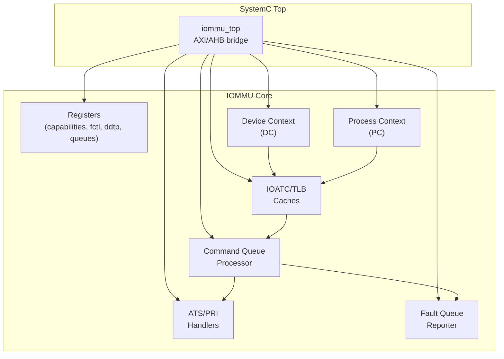
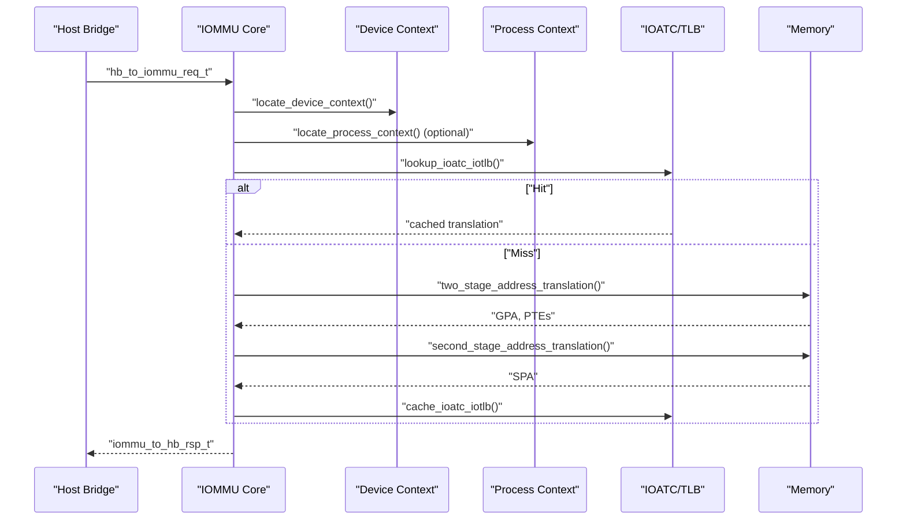
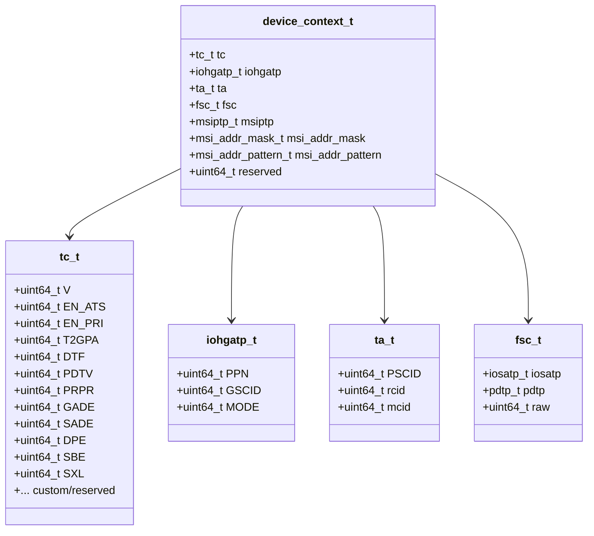
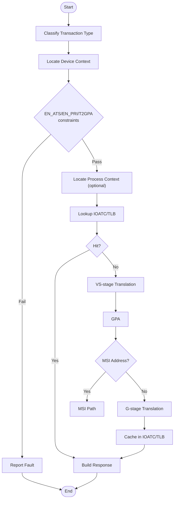
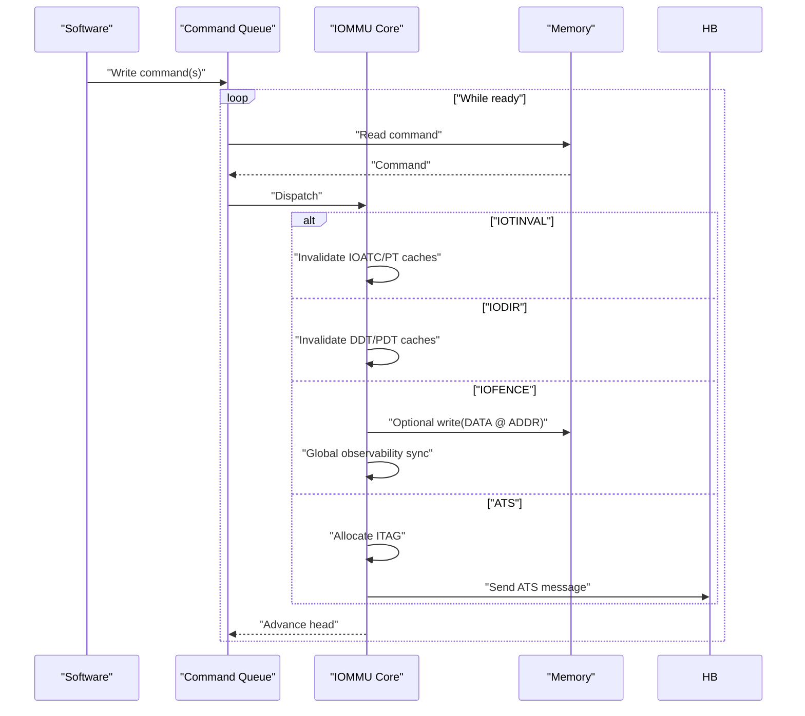
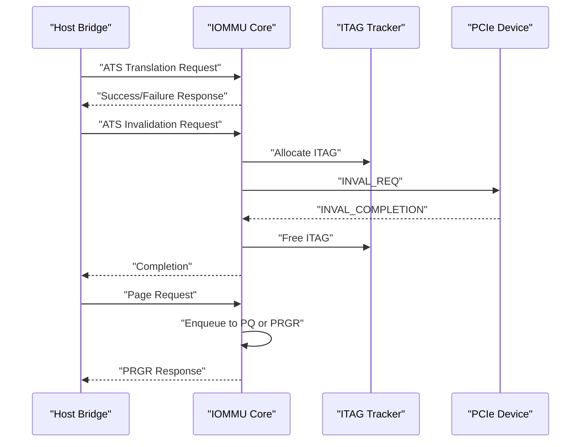
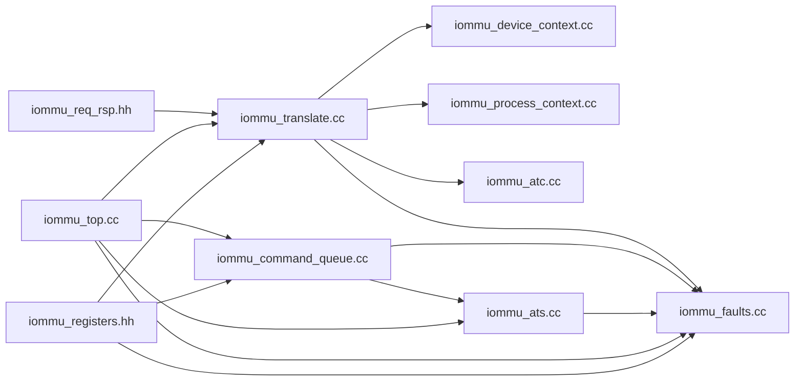

# Data Flow and Modeling

<cite>
**Referenced Files in This Document**
- [iommu_data_structures.hh](file://iommu/iommu_data_structures.hh)
- [iommu_struct.hh](file://iommu/iommu_struct.hh)
- [iommu_req_rsp.hh](file://iommu/iommu_req_rsp.hh)
- [param_trans_def.hh](file://iommu/param_trans_def.hh)
- [iommu_translate.hh](file://iommu/iommu_translate.hh)
- [iommu_translate.cc](file://iommu/iommu_translate.cc)
- [iommu_command_queue.cc](file://iommu/iommu_command_queue.cc)
- [iommu_ats.cc](file://iommu/iommu_ats.cc)
- [iommu_device_context.cc](file://iommu/iommu_device_context.cc)
- [iommu_process_context.cc](file://iommu/iommu_process_context.cc)
- [iommu_registers.hh](file://iommu/iommu_registers.hh)
- [iommu_fault.hh](file://iommu/iommu_fault.hh)
- [iommu_faults.cc](file://iommu/iommu_faults.cc)
- [iommu_atc.cc](file://iommu/iommu_atc.cc)
- [iommu_top.cc](file://iommu/iommu_top.cc)
- [iommu_utils.cc](file://iommu/iommu_utils.cc)
- [iommu_utils.hh](file://iommu/iommu_utils.hh)
</cite>

## Table of Contents
1. [Introduction](#introduction)
2. [Project Structure](#project-structure)
3. [Core Components](#core-components)
4. [Architecture Overview](#architecture-overview)
5. [Detailed Component Analysis](#detailed-component-analysis)
6. [Dependency Analysis](#dependency-analysis)
7. [Performance Considerations](#performance-considerations)
8. [Troubleshooting Guide](#troubleshooting-guide)
9. [Conclusion](#conclusion)

## Introduction
This document explains the data flow patterns and modeling approaches used in the IOMMU system. It focuses on:
- Transaction definition structures and request/response formats
- Data transformation pipelines through translation stages
- Parameter definitions for page sizes and translation modes (SV32/SV39/SV48/SV57 and x4 variants)
- Hierarchical data structures for device contexts, process contexts, and translation cache entries
- Flow diagrams for translation pipeline, command processing, and ATS message handling
- Validation, type conversions, and error propagation mechanisms

## Project Structure
The IOMMU subsystem is organized around core data structures, translation logic, ATS handling, command processing, and fault reporting. The top-level SystemC module integrates AXI/AHB transactions and routes them to the IOMMU translation engine.

**Diagram sources**
- [iommu_top.cc:1-192](file://iommu/iommu_top.cc#L1-L192)
- [iommu_registers.hh:172-800](file://iommu/iommu_registers.hh#L172-L800)
- [iommu_data_structures.hh:324-414](file://iommu/iommu_data_structures.hh#L324-L414)
- [iommu_atc.cc:1-233](file://iommu/iommu_atc.cc#L1-L233)
- [iommu_command_queue.cc:1-676](file://iommu/iommu_command_queue.cc#L1-L676)
- [iommu_ats.cc:1-374](file://iommu/iommu_ats.cc#L1-L374)
- [iommu_faults.cc:1-160](file://iommu/iommu_faults.cc#L1-L160)

**Section sources**
- [iommu_top.cc:1-192](file://iommu/iommu_top.cc#L1-L192)
- [iommu_registers.hh:172-800](file://iommu/iommu_registers.hh#L172-L800)

## Core Components
- Device Context (DC): Encapsulates translation control, G-stage translation, translation attributes, first-stage context, and optional MSI configuration.
- Process Context (PC): Per-process translation control and first-stage context for VS-stage translation.
- Translation Pipeline: Two-stage address translation (VS-stage → G-stage), MSI address translation, and IOATC caching.
- Command Queue: In-memory command processing for invalidations, fences, and ATS messaging.
- ATS/PRI: PCIe ATS translation requests, invalidation requests, and page request handling.
- Fault Reporting: Structured fault records enqueued for software consumption.

**Section sources**
- [iommu_data_structures.hh:324-414](file://iommu/iommu_data_structures.hh#L324-L414)
- [iommu_process_context.cc:1-236](file://iommu/iommu_process_context.cc#L1-L236)
- [iommu_translate.hh:95-131](file://iommu/iommu_translate.hh#L95-L131)
- [iommu_command_queue.cc:1-276](file://iommu/iommu_command_queue.cc#L1-L276)
- [iommu_ats.cc:1-374](file://iommu/iommu_ats.cc#L1-L374)
- [iommu_fault.hh:52-90](file://iommu/iommu_fault.hh#L52-L90)

## Architecture Overview
The IOMMU translates IOVA to SPA via VS-stage and G-stage page tables, optionally recognizing MSI traffic and caching translations in IOATC/TLB. Commands are processed from a memory-mapped command queue, and ATS messages are handled for translation and page request flows.

**Diagram sources**
- [iommu_translate.cc:8-709](file://iommu/iommu_translate.cc#L8-L709)
- [iommu_device_context.cc:9-225](file://iommu/iommu_device_context.cc#L9-L225)
- [iommu_process_context.cc:11-196](file://iommu/iommu_process_context.cc#L11-L196)
- [iommu_atc.cc:149-233](file://iommu/iommu_atc.cc#L149-L233)

## Detailed Component Analysis

### Transaction Definition Structures and Formats
- Request structures:
  - hb_to_iommu_req_t: Host bridge to IOMMU request carrying device/process identifiers, address type, and transaction attributes.
  - iommu_trans_req_t: Encapsulates IOVA, address type, length, and read/write/AMO intent.
- Response structures:
  - iommu_to_hb_rsp_t: Status plus iommu_trans_rsp_t with PPN, flags (S, Global, Priv, U, R, W, Exe, AMA, PBMT), and MSI/MRIF metadata.

Key fields and semantics:
- Address type encodings: Untranslated, PCIe ATS Translation Request, Translated.
- Response flags encode permission grants, page size selection, and memory type.

**Section sources**
- [iommu_req_rsp.hh:13-103](file://iommu/iommu_req_rsp.hh#L13-L103)

### Translation Modes and Page Sizes
Supported virtual memory schemes and page sizes:
- VS-stage modes: Bare, Sv32, Sv39, Sv48, Sv57.
- G-stage modes: Bare, Sv32x4, Sv39x4, Sv48x4, Sv57x4.
- Page sizes: 4 KiB base; larger superpages encoded in PPN field for responses.

Implementation notes:
- SXL controls whether S-stage uses 32-bit or wider schemes.
- PBMT resolution merges G-stage and VS-stage types.
- NAPOT encoding in PPN for response size signaling.

**Section sources**
- [iommu_data_structures.hh:141-191](file://iommu/iommu_data_structures.hh#L141-L191)
- [iommu_translate.hh:17-92](file://iommu/iommu_translate.hh#L17-L92)
- [iommu_translate.cc:441-510](file://iommu/iommu_translate.cc#L441-L510)

### Device Context Model
Device context hierarchy:
- tc: Translation control (EN_ATS, EN_PRI, T2GPA, SADE, GADE, SBE, SXL, DTF, DPE, PRPR).
- iohgatp: G-stage root pointer and guest soft-context ID.
- ta: Translation attributes (PSCID, RCID, MCID).
- fsc: First-stage context (iosatp or pdtp).
- Optional MSI fields (msiptp, msi_addr_mask/pattern).

Validation and configuration checks ensure mode compatibility, alignment, and capability constraints.

**Diagram sources**
- [iommu_data_structures.hh:324-335](file://iommu/iommu_data_structures.hh#L324-L335)
- [iommu_data_structures.hh:29-130](file://iommu/iommu_data_structures.hh#L29-L130)
- [iommu_data_structures.hh:139-200](file://iommu/iommu_data_structures.hh#L139-L200)
- [iommu_data_structures.hh:158-185](file://iommu/iommu_data_structures.hh#L158-L185)
- [iommu_data_structures.hh:206-258](file://iommu/iommu_data_structures.hh#L206-L258)

**Section sources**
- [iommu_device_context.cc:9-225](file://iommu/iommu_device_context.cc#L9-L225)
- [iommu_data_structures.hh:324-414](file://iommu/iommu_data_structures.hh#L324-L414)

### Process Context Model
Process context hierarchy:
- ta: Process translation attributes (V, ENS, SUM, PSCID).
- fsc: First-stage context (iosatp) for VS-stage translation.

Validation ensures mode compatibility with DC and capability support.

**Section sources**
- [iommu_process_context.cc:11-196](file://iommu/iommu_process_context.cc#L11-L196)
- [iommu_data_structures.hh:350-412](file://iommu/iommu_data_structures.hh#L350-L412)

### Translation Pipeline
End-to-end translation flow:
1. Device and process context lookup.
2. IOATC lookup; if miss, perform two-stage translation (VS-stage → G-stage).
3. Optional MSI address translation.
4. Permission checks and PBMT resolution.
5. Cache translation in IOATC/TLB.

**Diagram sources**
- [iommu_translate.cc:8-709](file://iommu/iommu_translate.cc#L8-L709)
- [iommu_atc.cc:149-233](file://iommu/iommu_atc.cc#L149-L233)
- [iommu_translate.hh:105-131](file://iommu/iommu_translate.hh#L105-L131)

**Section sources**
- [iommu_translate.cc:8-709](file://iommu/iommu_translate.cc#L8-L709)
- [iommu_translate.hh:95-131](file://iommu/iommu_translate.hh#L95-L131)

### Command Processing Stages
Command queue processing:
- Fetch from memory-mapped queue.
- Decode opcode and function; validate against capabilities.
- Execute commands (IOTINVAL, IODIR, IOFENCE, ATS).
- Manage invalidation tracking, pending ATS, and fence ordering.

**Diagram sources**
- [iommu_command_queue.cc:7-276](file://iommu/iommu_command_queue.cc#L7-L276)
- [iommu_command_queue.cc:541-573](file://iommu/iommu_command_queue.cc#L541-L573)

**Section sources**
- [iommu_command_queue.cc:7-676](file://iommu/iommu_command_queue.cc#L7-L676)

### ATS Message Handling
- ATS Translation Request: Translate IOVA to GPA/SPA, return permissions and flags.
- ATS Invalidation Request: Send invalidation to requester; track completion via ITAGs.
- Page Request (PRI): Enqueue to page-request queue or auto-generate PRGR response.

**Diagram sources**
- [iommu_ats.cc:7-374](file://iommu/iommu_ats.cc#L7-L374)
- [iommu_command_queue.cc:214-246](file://iommu/iommu_command_queue.cc#L214-L246)

**Section sources**
- [iommu_ats.cc:1-374](file://iommu/iommu_ats.cc#L1-L374)
- [iommu_command_queue.cc:214-246](file://iommu/iommu_command_queue.cc#L214-L246)

### Data Validation, Type Conversions, and Error Propagation
- Bit-field extraction macro for packed fields.
- Address range matching using NAPOT masks.
- Fault reporting with structured records, including cause, TTYP, DID, PID, and iotval/iotval2.
- Conditional reporting based on DTF and cause categories.

**Section sources**
- [iommu_utils.hh:7-10](file://iommu/iommu_utils.hh#L7-L10)
- [iommu_utils.cc:7-17](file://iommu/iommu_utils.cc#L7-L17)
- [iommu_faults.cc:8-160](file://iommu/iommu_faults.cc#L8-L160)
- [iommu_fault.hh:52-90](file://iommu/iommu_fault.hh#L52-L90)

## Dependency Analysis
The IOMMU core orchestrates interactions among data structures, translation routines, ATS handlers, command processor, and fault reporter. The top-level SystemC module bridges external protocols to the IOMMU.

**Diagram sources**
- [iommu_req_rsp.hh:13-103](file://iommu/iommu_req_rsp.hh#L13-L103)
- [iommu_translate.cc:8-709](file://iommu/iommu_translate.cc#L8-L709)
- [iommu_device_context.cc:9-225](file://iommu/iommu_device_context.cc#L9-L225)
- [iommu_process_context.cc:11-196](file://iommu/iommu_process_context.cc#L11-L196)
- [iommu_atc.cc:1-233](file://iommu/iommu_atc.cc#L1-L233)
- [iommu_command_queue.cc:1-676](file://iommu/iommu_command_queue.cc#L1-L676)
- [iommu_ats.cc:1-374](file://iommu/iommu_ats.cc#L1-L374)
- [iommu_faults.cc:1-160](file://iommu/iommu_faults.cc#L1-L160)
- [iommu_top.cc:1-192](file://iommu/iommu_top.cc#L1-L192)
- [iommu_registers.hh:172-800](file://iommu/iommu_registers.hh#L172-L800)

**Section sources**
- [iommu_struct.hh:42-99](file://iommu/iommu_struct.hh#L42-L99)

## Performance Considerations
- IOATC/TLB caching reduces repeated page table walks; NAPOT encoding optimizes range matching.
- Command queue processing is stall-controlled to avoid resource conflicts (ITAG availability, pending invalidations).
- MSI address translation short-circuits normal translation for MSI traffic.
- Endianness and capability flags influence memory access patterns and PTE interpretation.

[No sources needed since this section provides general guidance]

## Troubleshooting Guide
Common issues and handling:
- Translation type disallowed: Verify EN_ATS/EN_PRI/T2GPA and PDTV/PID width constraints.
- Access faults and data corruption: Inspect memory access paths and poison detection.
- Fault queue overflow or memory faults: Investigate queue configuration and backing memory.
- ATS timeouts: Monitor ITAG allocation and completion timers.

**Section sources**
- [iommu_translate.cc:113-141](file://iommu/iommu_translate.cc#L113-L141)
- [iommu_faults.cc:23-44](file://iommu/iommu_faults.cc#L23-L44)
- [iommu_command_queue.cc:586-608](file://iommu/iommu_command_queue.cc#L586-L608)
- [iommu_ats.cc:84-94](file://iommu/iommu_ats.cc#L84-L94)

## Conclusion
The IOMMU implements a robust, layered translation pipeline with explicit device and process contexts, extensive caching, and strict validation. The ATS and command-processing subsystems integrate tightly with translation and fault reporting to provide a complete, standards-aligned address translation solution.