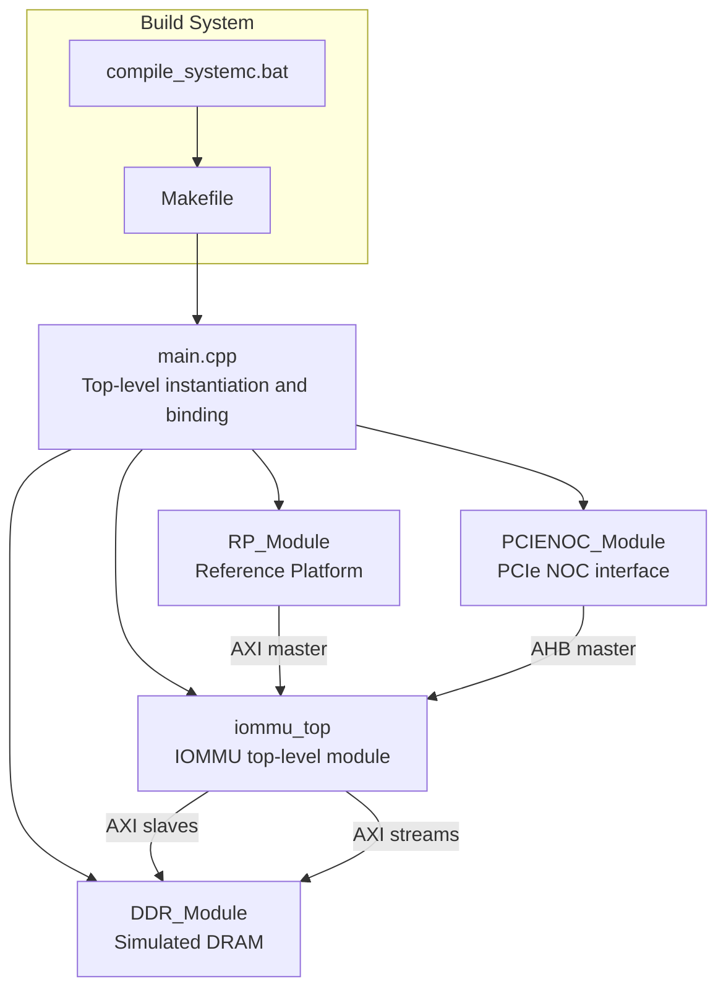
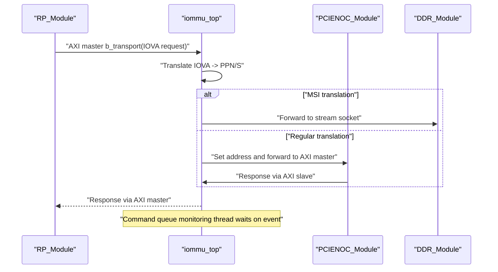
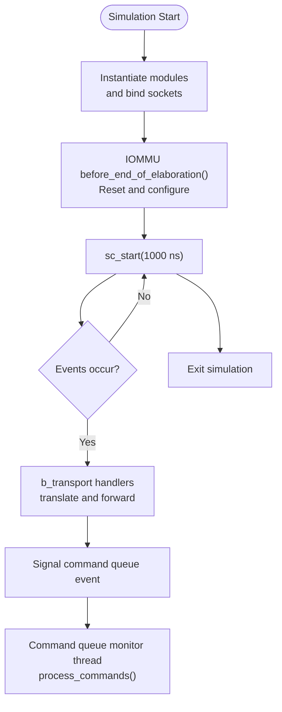
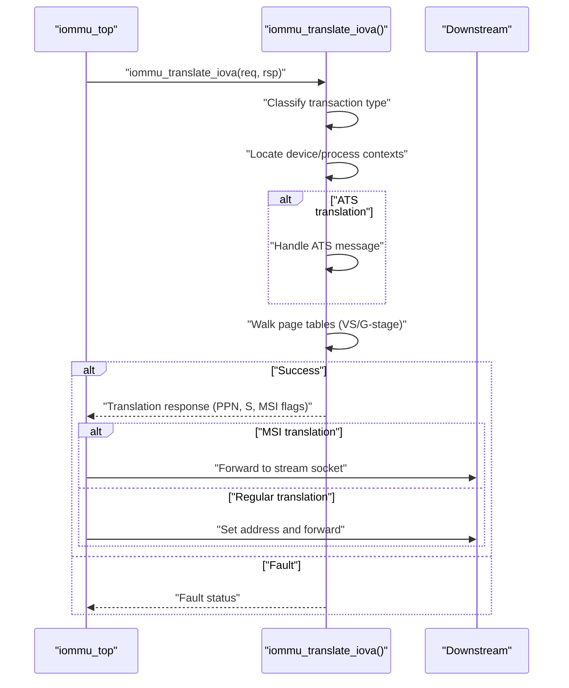
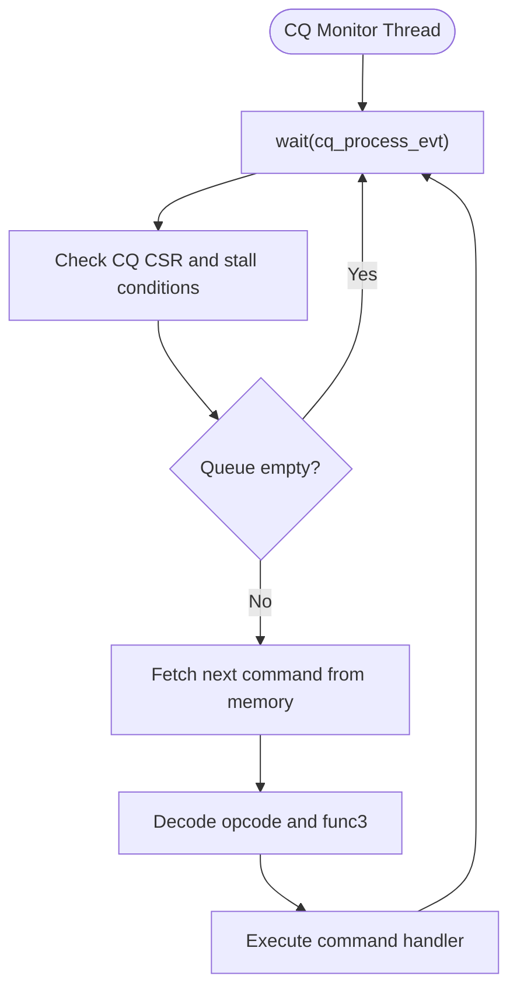
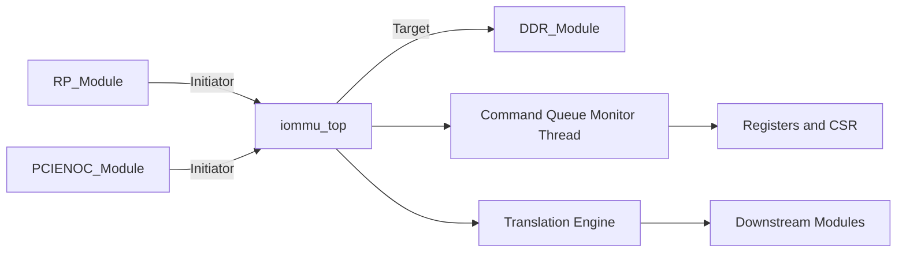

# Simulation Methodology

<cite>
**Referenced Files in This Document**
- [main.cpp](file://main.cpp)
- [Makefile](file://Makefile)
- [compile_systemc.bat](file://compile_systemc.bat)
- [gdb_debug.sh](file://gdb_debug.sh)
- [GDB_DEBUG_GUIDE.md](file://GDB_DEBUG_GUIDE.md)
- [iommu_top.hh](file://iommu/iommu_top.hh)
- [iommu_top.cc](file://iommu/iommu_top.cc)
- [iommu_translate.cc](file://iommu/iommu_translate.cc)
- [iommu_command_queue.cc](file://iommu/iommu_command_queue.cc)
- [iommu_struct.hh](file://iommu/iommu_struct.hh)
- [iommu_registers.hh](file://iommu/iommu_registers.hh)
- [test_rp.hh](file://rp/test_rp.hh)
- [test_rp_thread.cc](file://rp/test_rp_thread.cc)
- [test_ddr.hh](file://ddr/test_ddr.hh)
- [test_ddr.cc](file://ddr/test_ddr.cc)
- [test_pcienoc.hh](file://pcienoc/test_pcienoc.hh)
- [test_pcienoc.cc](file://pcienoc/test_pcienoc.cc)
</cite>

## Table of Contents
1. [Introduction](#introduction)
2. [Project Structure](#project-structure)
3. [Core Components](#core-components)
4. [Architecture Overview](#architecture-overview)
5. [Detailed Component Analysis](#detailed-component-analysis)
6. [Dependency Analysis](#dependency-analysis)
7. [Performance Considerations](#performance-considerations)
8. [Troubleshooting Guide](#troubleshooting-guide)
9. [Conclusion](#conclusion)

## Introduction
This document explains the SystemC simulation methodology and execution model used in the IOMMU implementation. It covers the event-driven simulation approach, process scheduling, timing coordination between modules, simulation setup and initialization, termination conditions, build configuration, platform-specific considerations, debugging with GDB, simulation tracing, and performance profiling. It also clarifies the relationship between simulation cycles and real-world timing, including clock generation and synchronization mechanisms.

## Project Structure
The project is organized around a SystemC-based top-level simulation that instantiates the IOMMU, a Reference Platform (RP), a PCIe NOC interface, and a simulated DDR memory model. The IOMMU exposes TLM sockets for AXI and AHB interconnects and integrates with RP and DDR via socket bindings. The Makefile drives compilation and links against SystemC and pthreads. Platform-specific build scripts support Windows builds of SystemC.

**Diagram sources**
- [main.cpp:38-87](file://main.cpp#L38-L87)
- [iommu_top.hh:19-56](file://iommu/iommu_top.hh#L19-L56)
- [test_rp.hh:54-74](file://rp/test_rp.hh#L54-L74)
- [test_pcienoc.hh:10-19](file://pcienoc/test_pcienoc.hh#L10-L19)
- [test_ddr.hh:15-36](file://ddr/test_ddr.hh#L15-L36)
- [Makefile:69-70](file://Makefile#L69-L70)
- [compile_systemc.bat:17-39](file://compile_systemc.bat#L17-L39)

**Section sources**
- [main.cpp:38-87](file://main.cpp#L38-L87)
- [Makefile:1-98](file://Makefile#L1-L98)
- [compile_systemc.bat:1-50](file://compile_systemc.bat#L1-L50)

## Core Components
- IOMMU Top-Level Module: Provides TLM sockets for AXI and AHB, registers transport handlers, initializes hardware state, and runs address translation and command processing threads.
- RP Module: Generates test traffic and initiates translation requests; includes a SystemC thread for test orchestration.
- PCIe NOC Module: Minimal interface module exposing an AHB master socket for PCIe-related traffic.
- DDR Module: Simulated memory with three AXI target sockets for different IOMMU access paths.

Key runtime elements:
- Event-driven transport: AXI/AHB b_transport handlers trigger translation and forwarding logic.
- Command queue monitoring: A dedicated SystemC thread waits on an event to poll and process commands.
- Initialization: The top-level module performs reset and capability configuration during elaboration.

**Section sources**
- [iommu_top.hh:19-56](file://iommu/iommu_top.hh#L19-L56)
- [iommu_top.cc:6-36](file://iommu/iommu_top.cc#L6-L36)
- [iommu_top.cc:41-180](file://iommu/iommu_top.cc#L41-L180)
- [iommu_top.cc:185-192](file://iommu/iommu_top.cc#L185-L192)
- [test_rp.hh:54-74](file://rp/test_rp.hh#L54-L74)
- [test_ddr.hh:15-36](file://ddr/test_ddr.hh#L15-L36)
- [test_pcienoc.hh:10-19](file://pcienoc/test_pcienoc.hh#L10-L19)

## Architecture Overview
The simulation uses SystemC’s TLM 2.0 interfaces to connect modules. The IOMMU acts as a target on the PCIe NOC and RP buses, translating IOVA to PA and forwarding transactions to the appropriate downstream module. The RP module generates requests and coordinates test scenarios; the PCIe NOC module provides an AHB master interface; the DDR module simulates memory.

**Diagram sources**
- [iommu_top.cc:77-180](file://iommu/iommu_top.cc#L77-L180)
- [test_rp.hh:67-74](file://rp/test_rp.hh#L67-L74)
- [test_ddr.hh:38-59](file://ddr/test_ddr.hh#L38-L59)
- [test_pcienoc.hh:12-13](file://pcienoc/test_pcienoc.hh#L12-L13)

## Detailed Component Analysis

### SystemC Execution Model and Timing Coordination
- Event-driven simulation: The simulation advances by events. Processes suspend on sensitivity (e.g., sc_event) and resume when signaled.
- Process types:
  - Thread processes: Registered via SC_THREAD; can suspend with wait(), sensitive to events or time deltas.
  - Transport callbacks: b_transport registered on sockets; invoked synchronously by the SystemC kernel when a transaction occurs.
- Timing:
  - Time units: The simulation uses nanosecond time units for waits and start duration.
  - No explicit clock processes are present; timing relies on wait() calls and the SystemC kernel advancing time on events.

**Diagram sources**
- [main.cpp:75-77](file://main.cpp#L75-L77)
- [iommu_top.cc:6-36](file://iommu/iommu_top.cc#L6-L36)
- [iommu_top.cc:185-192](file://iommu/iommu_top.cc#L185-L192)
- [iommu_command_queue.cc:7-64](file://iommu/iommu_command_queue.cc#L7-L64)

**Section sources**
- [main.cpp:75-77](file://main.cpp#L75-L77)
- [iommu_top.cc:6-36](file://iommu/iommu_top.cc#L6-L36)
- [iommu_top.cc:185-192](file://iommu/iommu_top.cc#L185-L192)
- [iommu_command_queue.cc:7-64](file://iommu/iommu_command_queue.cc#L7-L64)

### Address Translation Workflow
The IOMMU translates IOVA to PA using device/process contexts and page tables. The flow includes classification of transaction types, device context lookup, optional ATS handling, and page table walks. On success, the IOMMU forwards the transaction to the appropriate downstream module or handles MSI redirection.

**Diagram sources**
- [iommu_top.cc:122-178](file://iommu/iommu_top.cc#L122-L178)
- [iommu_translate.cc:8-141](file://iommu/iommu_translate.cc#L8-L141)

**Section sources**
- [iommu_top.cc:122-178](file://iommu/iommu_top.cc#L122-L178)
- [iommu_translate.cc:8-141](file://iommu/iommu_translate.cc#L8-L141)

### Command Queue Monitoring
The IOMMU maintains a command queue for software-initiated operations. A dedicated thread monitors a sc_event and invokes command processing when signaled. The processing loop checks queue readiness, reads the next command, validates opcodes/functions, and executes the corresponding action.

**Diagram sources**
- [iommu_top.cc:185-192](file://iommu/iommu_top.cc#L185-L192)
- [iommu_command_queue.cc:7-64](file://iommu/iommu_command_queue.cc#L7-L64)
- [iommu_command_queue.cc:112-146](file://iommu/iommu_command_queue.cc#L112-L146)

**Section sources**
- [iommu_top.cc:185-192](file://iommu/iommu_top.cc#L185-L192)
- [iommu_command_queue.cc:7-64](file://iommu/iommu_command_queue.cc#L7-L64)
- [iommu_command_queue.cc:112-146](file://iommu/iommu_command_queue.cc#L112-L146)

### Simulation Setup and Initialization
- Top-level instantiation: The main function creates instances of iommu_top, DDR_Module, RP_Module, and PCIENOC_Module.
- Socket binding: The main function binds initiator sockets of IOMMU and RP to target sockets of DDR and vice versa.
- Elaboration and reset: The IOMMU top-level module configures capabilities and resets internal state during before_end_of_elaboration().
- Execution start: The simulation starts with a fixed time duration in nanoseconds.

**Section sources**
- [main.cpp:38-87](file://main.cpp#L38-L87)
- [iommu_top.cc:6-36](file://iommu/iommu_top.cc#L6-L36)

### Termination Conditions
- Fixed-time stop: The simulation runs for a predefined duration and then exits.
- Cleanup: The main function deletes module instances after sc_start returns.

**Section sources**
- [main.cpp:75-86](file://main.cpp#L75-L86)

### Build System Configuration and Compilation Flags
- Compiler: g++ with C++11 standard.
- Include paths: SystemC include and local directories.
- Dynamic processes: Enabled via macro.
- Debug vs Release:
  - Debug: -g -O0 with extensive DEBUG_* macros enabling logging across modules.
  - Release: -O3 with NDEBUG.
- Libraries: Links against libsystemc, pthread, and math library.
- Platform specifics:
  - Linux: Uses system-installed SystemC paths.
  - Windows: Batch script compiles and installs SystemC locally and sets environment variables.

**Section sources**
- [Makefile:14-24](file://Makefile#L14-L24)
- [Makefile:26-27](file://Makefile#L26-L27)
- [Makefile:69-70](file://Makefile#L69-L70)
- [compile_systemc.bat:5-47](file://compile_systemc.bat#L5-L47)

### Platform-Specific Considerations
- Linux: Standard SystemC installation paths are used; linking against system libraries.
- Windows: SystemC is built from source and installed locally; environment variables are set for subsequent builds.

**Section sources**
- [Makefile:8-11](file://Makefile#L8-L11)
- [compile_systemc.bat:5-47](file://compile_systemc.bat#L5-L47)

### Debugging Methodologies
- GDB integration:
  - Compile with DEBUG=1 to enable debug symbols and macros.
  - Use the provided shell script to launch GDB with preconfigured commands.
  - Set breakpoints at key translation and command-processing functions.
- Tracing:
  - Enable DEBUG macros to print translation and command processing logs.
- Profiling:
  - Use standard Unix profiling tools on Linux builds; adjust compiler flags accordingly.

**Section sources**
- [GDB_DEBUG_GUIDE.md:8-206](file://GDB_DEBUG_GUIDE.md#L8-L206)
- [gdb_debug.sh:1-37](file://gdb_debug.sh#L1-L37)
- [Makefile:18-24](file://Makefile#L18-L24)

### Relationship Between Simulation Cycles and Real-Time
- Simulation time: The kernel advances time implicitly on events and waits. There is no explicit clock process; timing is event-driven.
- Real-world timing: The simulation does not directly correlate to wall-clock seconds. Users can scale simulation time by adjusting wait durations and the total sc_start duration.

**Section sources**
- [main.cpp:75-77](file://main.cpp#L75-L77)
- [iommu_top.cc:185-192](file://iommu/iommu_top.cc#L185-L192)

## Dependency Analysis
The IOMMU top-level module aggregates core subsystems and exposes TLM sockets. The RP and PCIe NOC modules act as initiators, while the DDR module acts as a target. The command queue monitor thread depends on an event to drive processing.

**Diagram sources**
- [test_rp.hh:67-74](file://rp/test_rp.hh#L67-L74)
- [test_pcienoc.hh:12-13](file://pcienoc/test_pcienoc.hh#L12-L13)
- [test_ddr.hh:38-59](file://ddr/test_ddr.hh#L38-L59)
- [iommu_top.cc:185-192](file://iommu/iommu_top.cc#L185-L192)
- [iommu_registers.hh:1-200](file://iommu/iommu_registers.hh#L1-L200)

**Section sources**
- [test_rp.hh:54-74](file://rp/test_rp.hh#L54-L74)
- [test_ddr.hh:15-36](file://ddr/test_ddr.hh#L15-L36)
- [test_pcienoc.hh:10-19](file://pcienoc/test_pcienoc.hh#L10-L19)
- [iommu_top.cc:185-192](file://iommu/iommu_top.cc#L185-L192)
- [iommu_registers.hh:1-200](file://iommu/iommu_registers.hh#L1-L200)

## Performance Considerations
- Debug mode trade-offs: Enabling DEBUG macros and disabling optimization (-O0) reduces performance for easier debugging.
- Command queue stalls: The command processor checks CSR flags and may stall under resource constraints; ensure proper queue configuration to avoid stalls.
- Translation overhead: Complex page table walks and ATS handling add latency; profile translation paths to identify hotspots.

[No sources needed since this section provides general guidance]

## Troubleshooting Guide
- GDB debugging:
  - Ensure DEBUG=1 build to include symbols.
  - Use the provided script to automate GDB session setup.
  - Set breakpoints at translation and command-processing functions.
- Common issues:
  - Missing symbols: Verify DEBUG=1 and that the binary was not stripped.
  - Unreachable breakpoints: Confirm correct function names and execution paths.
  - Slow execution: Expect reduced speed in debug mode due to -O0.

**Section sources**
- [GDB_DEBUG_GUIDE.md:158-173](file://GDB_DEBUG_GUIDE.md#L158-L173)
- [gdb_debug.sh:7-20](file://gdb_debug.sh#L7-L20)
- [Makefile:18-24](file://Makefile#L18-L24)

## Conclusion
The IOMMU simulation employs a SystemC/TLM event-driven model with explicit process scheduling and socket-based inter-module communication. The top-level module orchestrates reset and initialization, while dedicated threads handle translation and command processing. The build system supports both Linux and Windows environments, with configurable debug and release modes. Debugging is facilitated through GDB integration and comprehensive logging macros. The simulation advances time implicitly on events without explicit clock processes, and real-world timing is not directly tied to simulation cycles.