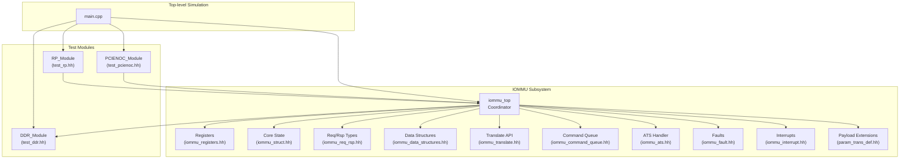
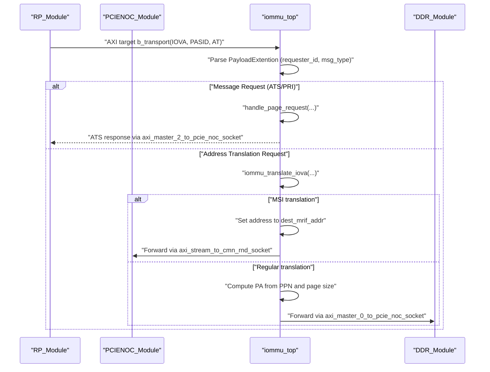
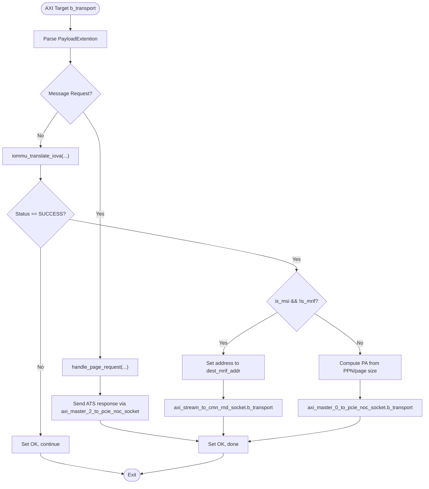
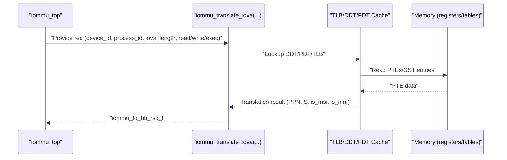
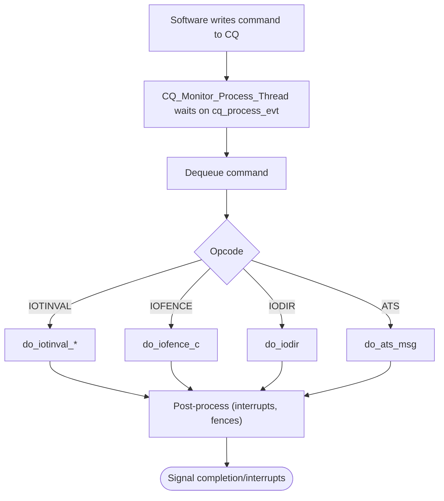
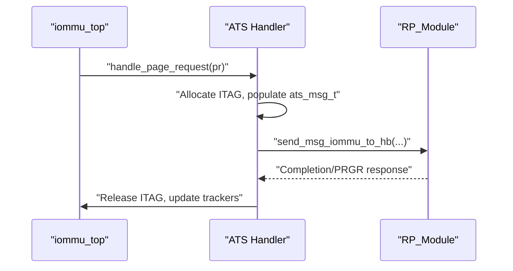
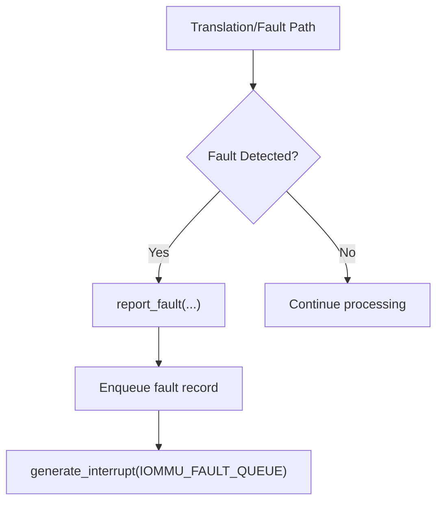
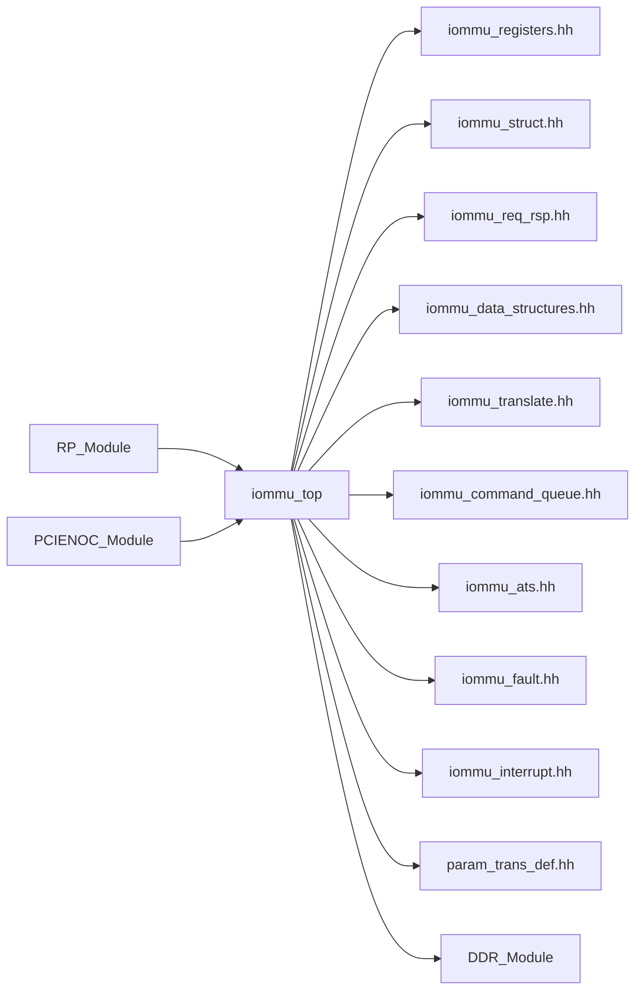

# System Design

<cite>
**Referenced Files in This Document**
- [main.cpp](file://main.cpp)
- [iommu_top.cc](file://iommu/iommu_top.cc)
- [iommu_top.hh](file://iommu/iommu_top.hh)
- [param_trans_def.hh](file://iommu/param_trans_def.hh)
- [iommu_struct.hh](file://iommu/iommu_struct.hh)
- [iommu_translate.hh](file://iommu/iommu_translate.hh)
- [iommu_command_queue.hh](file://iommu/iommu_command_queue.hh)
- [iommu_ats.hh](file://iommu/iommu_ats.hh)
- [iommu_fault.hh](file://iommu/iommu_fault.hh)
- [iommu_interrupt.hh](file://iommu/iommu_interrupt.hh)
- [iommu_registers.hh](file://iommu/iommu_registers.hh)
- [iommu_req_rsp.hh](file://iommu/iommu_req_rsp.hh)
- [iommu_data_structures.hh](file://iommu/iommu_data_structures.hh)
- [test_rp.hh](file://rp/test_rp.hh)
- [test_pcienoc.hh](file://pcienoc/test_pcienoc.hh)
- [test_ddr.hh](file://ddr/test_ddr.hh)
- [Makefile](file://Makefile)
</cite>

## Table of Contents
1. [Introduction](#introduction)
2. [Project Structure](#project-structure)
3. [Core Components](#core-components)
4. [Architecture Overview](#architecture-overview)
5. [Detailed Component Analysis](#detailed-component-analysis)
6. [Dependency Analysis](#dependency-analysis)
7. [Performance Considerations](#performance-considerations)
8. [Troubleshooting Guide](#troubleshooting-guide)
9. [Conclusion](#conclusion)

## Introduction
This document describes the SystemC-based IOMMU model, focusing on the central coordinator module iommu_top and its orchestration of traffic among RP (Root Port), DDR memory, and PCIe NOC modules. It explains the event-driven simulation methodology, transaction-level modeling (TLM) approach, and the modular design philosophy. The document details how major functional blocks—translation engine, command processor, ATS handler, and fault manager—integrate with the top-level coordinator via TLM sockets and synchronization primitives.

## Project Structure
The model is organized around a top-level SystemC module that binds to test modules representing RP, PCIe NOC, and DDR. The IOMMU subsystem is implemented in the iommu/ directory with supporting headers defining data structures, registers, and interfaces. The Makefile compiles all sources and links against SystemC.

**Diagram sources**
- [main.cpp:37-79](file://main.cpp#L37-L79)
- [iommu_top.hh:19-56](file://iommu/iommu_top.hh#L19-L56)
- [iommu_registers.hh:1-120](file://iommu/iommu_registers.hh#L1-L120)
- [iommu_struct.hh:42-99](file://iommu/iommu_struct.hh#L42-L99)
- [iommu_req_rsp.hh:13-101](file://iommu/iommu_req_rsp.hh#L13-L101)
- [iommu_data_structures.hh:29-130](file://iommu/iommu_data_structures.hh#L29-L130)
- [iommu_translate.hh:95-130](file://iommu/iommu_translate.hh#L95-L130)
- [iommu_command_queue.hh:23-124](file://iommu/iommu_command_queue.hh#L23-L124)
- [iommu_ats.hh:47-97](file://iommu/iommu_ats.hh#L47-L97)
- [iommu_fault.hh:63-88](file://iommu/iommu_fault.hh#L63-L88)
- [iommu_interrupt.hh:16-24](file://iommu/iommu_interrupt.hh#L16-L24)
- [param_trans_def.hh:12-97](file://iommu/param_trans_def.hh#L12-L97)
- [test_rp.hh:54-112](file://rp/test_rp.hh#L54-L112)
- [test_pcienoc.hh:10-21](file://pcienoc/test_pcienoc.hh#L10-L21)
- [test_ddr.hh:15-61](file://ddr/test_ddr.hh#L15-L61)

**Section sources**
- [main.cpp:37-79](file://main.cpp#L37-L79)
- [Makefile:30-50](file://Makefile#L30-L50)

## Core Components
- iommu_top: Central coordinator module that exposes TLM sockets for PCIe NOC, AHB, and DDR access, and implements the primary transaction handling pipeline. It initializes the IOMMU state and orchestrates translation and routing decisions.
- RP_Module: Test module that drives translation requests and validates responses, acting as a PCIe Root Port representative.
- PCIENOC_Module: Test module representing the PCIe network-on-chip interface.
- DDR_Module: Test module simulating DRAM with TLM target sockets for AXI master initiators.

Key integration points:
- TLM sockets on iommu_top connect to RP and NOC for inbound/outbound traffic and to DDR for memory access.
- Payload extensions (param_trans_def.hh) carry PCIe ATS/PRI metadata and requester identity across the pipeline.
- Translation results are computed via iommu_translate APIs and routed to PCIe NOC or to MSI destinations.

**Section sources**
- [iommu_top.hh:19-56](file://iommu/iommu_top.hh#L19-L56)
- [iommu_top.cc:6-36](file://iommu/iommu_top.cc#L6-L36)
- [param_trans_def.hh:12-97](file://iommu/param_trans_def.hh#L12-L97)
- [test_rp.hh:54-112](file://rp/test_rp.hh#L54-L112)
- [test_pcienoc.hh:10-21](file://pcienoc/test_pcienoc.hh#L10-L21)
- [test_ddr.hh:15-61](file://ddr/test_ddr.hh#L15-L61)

## Architecture Overview
The IOMMU operates as an event-driven SystemC model using TLM 2.0 transport-intent interfaces. The top-level iommu_top coordinates:
- Inbound PCIe transactions from RP/NOc via target sockets
- Translation via the translation engine
- Routing to PCIe NOC or to DDR based on translation outcome
- Special handling for ATS/PRI and MSI translation
- Command processing and fault/interrupt signaling

**Diagram sources**
- [iommu_top.cc:77-180](file://iommu/iommu_top.cc#L77-L180)
- [param_trans_def.hh:12-97](file://iommu/param_trans_def.hh#L12-L97)
- [test_rp.hh:77-80](file://rp/test_rp.hh#L77-L80)
- [test_ddr.hh:38-59](file://ddr/test_ddr.hh#L38-L59)

**Section sources**
- [iommu_top.cc:41-180](file://iommu/iommu_top.cc#L41-L180)
- [param_trans_def.hh:12-97](file://iommu/param_trans_def.hh#L12-L97)

## Detailed Component Analysis

### iommu_top: Central Coordinator
Responsibilities:
- Initialize IOMMU capabilities and reset state
- Implement AXI target b_transport handlers for PCIe NOC and AHB
- Route translation requests to the translation engine
- Handle ATS/PRI message requests and MSI translation
- Manage command queue monitoring thread and events

Interfaces:
- Target sockets: receive inbound transactions from NOC and AHB
- Initiator sockets: forward traffic to DDR and NOC, and send ATS responses back to RP

Processing logic highlights:
- PCIe NOC target handler parses PayloadExtention to determine message vs. translation requests
- Translation path computes PPN and routes to PCIe NOC or DDR depending on result
- MSI translation path forwards to MRIF address via stream socket

**Diagram sources**
- [iommu_top.cc:77-180](file://iommu/iommu_top.cc#L77-L180)
- [param_trans_def.hh:12-97](file://iommu/param_trans_def.hh#L12-L97)

**Section sources**
- [iommu_top.cc:6-36](file://iommu/iommu_top.cc#L6-L36)
- [iommu_top.cc:41-180](file://iommu/iommu_top.cc#L41-L180)
- [iommu_top.hh:19-56](file://iommu/iommu_top.hh#L19-L56)

### Translation Engine Integration
The translation engine is invoked through the translation API. Inputs include IOVA, device/process identifiers, access type, and privilege/exec flags. Outputs include PPN, page size, and MSI/MRIF metadata.

**Diagram sources**
- [iommu_top.cc:143-144](file://iommu/iommu_top.cc#L143-L144)
- [iommu_translate.hh:105-129](file://iommu/iommu_translate.hh#L105-L129)
- [iommu_struct.hh:89-99](file://iommu/iommu_struct.hh#L89-L99)

**Section sources**
- [iommu_translate.hh:95-130](file://iommu/iommu_translate.hh#L95-L130)
- [iommu_req_rsp.hh:77-101](file://iommu/iommu_req_rsp.hh#L77-L101)

### Command Processor and Command Queue
The command processor manages in-memory queues for commands, faults, and page requests. The top-level module exposes a command queue monitoring thread and event signaling.

**Diagram sources**
- [iommu_top.cc:185-192](file://iommu/iommu_top.cc#L185-L192)
- [iommu_command_queue.hh:113-123](file://iommu/iommu_command_queue.hh#L113-L123)
- [iommu_interrupt.hh:23-24](file://iommu/iommu_interrupt.hh#L23-L24)

**Section sources**
- [iommu_command_queue.hh:23-124](file://iommu/iommu_command_queue.hh#L23-L124)
- [iommu_interrupt.hh:16-24](file://iommu/iommu_interrupt.hh#L16-L24)
- [iommu_top.cc:32-36](file://iommu/iommu_top.cc#L32-L36)

### ATS Handler and Page Request Interface
The ATS handler processes PCIe Address Translation Services and Page Request Interface messages. It tracks in-flight requests using an ITAG tracker and sends ATS messages back to the RP.

**Diagram sources**
- [iommu_top.cc:101-116](file://iommu/iommu_top.cc#L101-L116)
- [iommu_ats.hh:85-97](file://iommu/iommu_ats.hh#L85-L97)
- [test_rp.hh:106-109](file://rp/test_rp.hh#L106-L109)

**Section sources**
- [iommu_ats.hh:47-97](file://iommu/iommu_ats.hh#L47-L97)
- [iommu_top.cc:96-118](file://iommu/iommu_top.cc#L96-L118)

### Fault Manager and Interrupt Generation
The fault manager records faults into the fault queue and triggers interrupts. Interrupts can be generated for command queue, fault queue, HPM, and page queues.

**Diagram sources**
- [iommu_fault.hh:87-88](file://iommu/iommu_fault.hh#L87-L88)
- [iommu_interrupt.hh:23-24](file://iommu/iommu_interrupt.hh#L23-L24)

**Section sources**
- [iommu_fault.hh:63-88](file://iommu/iommu_fault.hh#L63-L88)
- [iommu_interrupt.hh:16-24](file://iommu/iommu_interrupt.hh#L16-L24)

### Modular Design Philosophy
- Separation of concerns: iommu_top coordinates, translation engine implements logic, ATS/fault/interrupt modules encapsulate domain-specific behavior.
- TLM sockets decouple modules and enable transaction-level modeling with minimal protocol overhead.
- Payload extensions carry PCIe-specific metadata without modifying core transaction structures.
- Data structures and registers are centralized in dedicated headers to support consistent state and register-mapped programming.

**Section sources**
- [iommu_struct.hh:42-99](file://iommu/iommu_struct.hh#L42-L99)
- [iommu_registers.hh:771-800](file://iommu/iommu_registers.hh#L771-L800)
- [param_trans_def.hh:12-97](file://iommu/param_trans_def.hh#L12-L97)

## Dependency Analysis
The following diagram shows key dependencies among core IOMMU components and their integration with the top-level module.

**Diagram sources**
- [iommu_top.hh:9-11](file://iommu/iommu_top.hh#L9-L11)
- [iommu_registers.hh:1-120](file://iommu/iommu_registers.hh#L1-L120)
- [iommu_struct.hh:26-37](file://iommu/iommu_struct.hh#L26-L37)
- [iommu_req_rsp.hh:13-34](file://iommu/iommu_req_rsp.hh#L13-L34)
- [iommu_data_structures.hh:29-130](file://iommu/iommu_data_structures.hh#L29-L130)
- [iommu_translate.hh:95-130](file://iommu/iommu_translate.hh#L95-L130)
- [iommu_command_queue.hh:23-124](file://iommu/iommu_command_queue.hh#L23-L124)
- [iommu_ats.hh:47-97](file://iommu/iommu_ats.hh#L47-L97)
- [iommu_fault.hh:63-88](file://iommu/iommu_fault.hh#L63-L88)
- [iommu_interrupt.hh:16-24](file://iommu/iommu_interrupt.hh#L16-L24)
- [param_trans_def.hh:12-97](file://iommu/param_trans_def.hh#L12-L97)
- [test_rp.hh:54-112](file://rp/test_rp.hh#L54-L112)
- [test_pcienoc.hh:10-21](file://pcienoc/test_pcienoc.hh#L10-L21)
- [test_ddr.hh:15-61](file://ddr/test_ddr.hh#L15-L61)

**Section sources**
- [iommu_top.hh:19-56](file://iommu/iommu_top.hh#L19-L56)
- [iommu_struct.hh:42-99](file://iommu/iommu_struct.hh#L42-L99)

## Performance Considerations
- Transaction-level modeling reduces cycle-accurate overhead by abstracting bus protocols behind TLM transport-intent semantics.
- Event-driven processing minimizes polling and maximizes concurrency across modules.
- Payload extensions avoid per-transaction metadata duplication and streamline routing decisions.
- Command queue monitoring uses explicit events to reduce latency and improve throughput.

[No sources needed since this section provides general guidance]

## Troubleshooting Guide
Common areas to inspect:
- Translation failures: Verify device/process contexts, page table pointers, and access permissions. Check fault queue entries and interrupt status.
- ATS/PRI issues: Confirm ITAG allocation and completion flow; validate requester ID and PASID fields in payload extensions.
- MSI translation problems: Ensure MSI page table configuration and MRIF address computation are correct.
- Memory access errors: Validate address ranges and alignment; confirm DDR module bounds checking.

Operational checks:
- Use the translation-request interface registers when debugging translation outcomes.
- Enable debug macros during compilation to trace translation, ATS, and command processing stages.

**Section sources**
- [iommu_fault.hh:63-88](file://iommu/iommu_fault.hh#L63-L88)
- [iommu_interrupt.hh:23-24](file://iommu/iommu_interrupt.hh#L23-L24)
- [iommu_registers.hh:642-728](file://iommu/iommu_registers.hh#L642-L728)
- [Makefile:18-24](file://Makefile#L18-L24)

## Conclusion
The IOMMU SystemC model centers on iommu_top as the event-driven coordinator that orchestrates translation, ATS handling, and routing across RP, PCIe NOC, and DDR. Its modular design leverages TLM sockets and payload extensions to implement transaction-level modeling efficiently. The translation engine, command processor, ATS handler, and fault manager integrate seamlessly through well-defined interfaces, enabling scalable simulation and verification of IOMMU behavior.