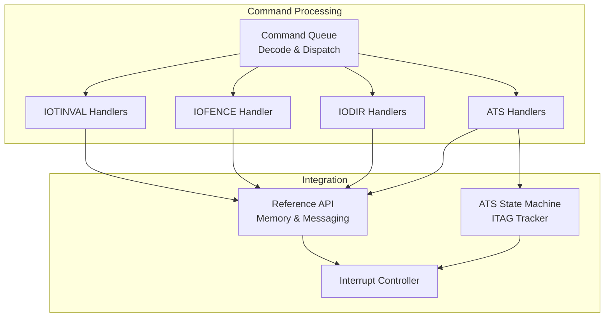
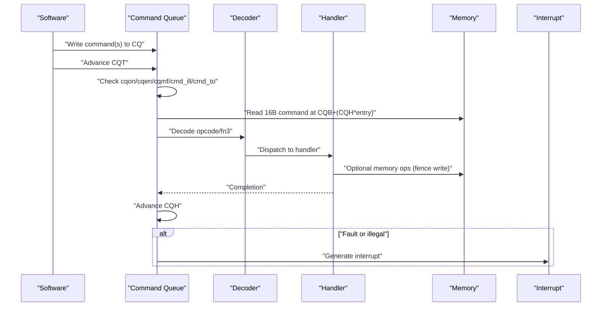
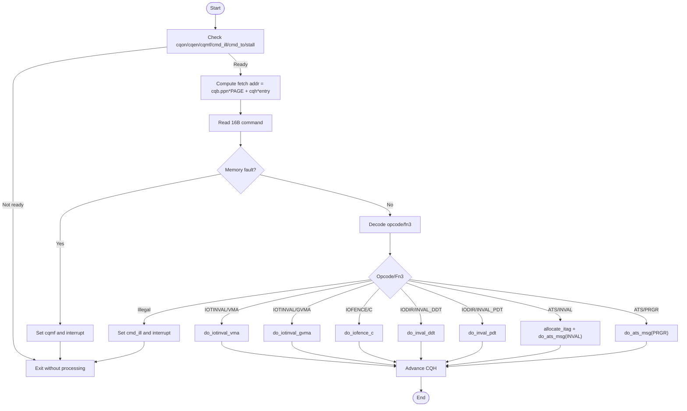
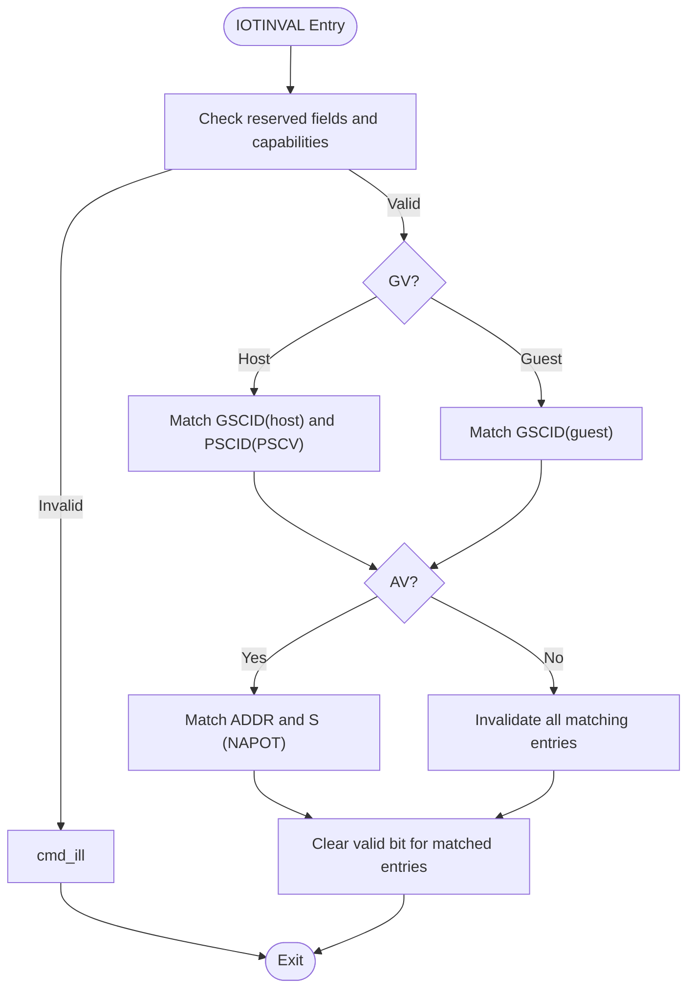
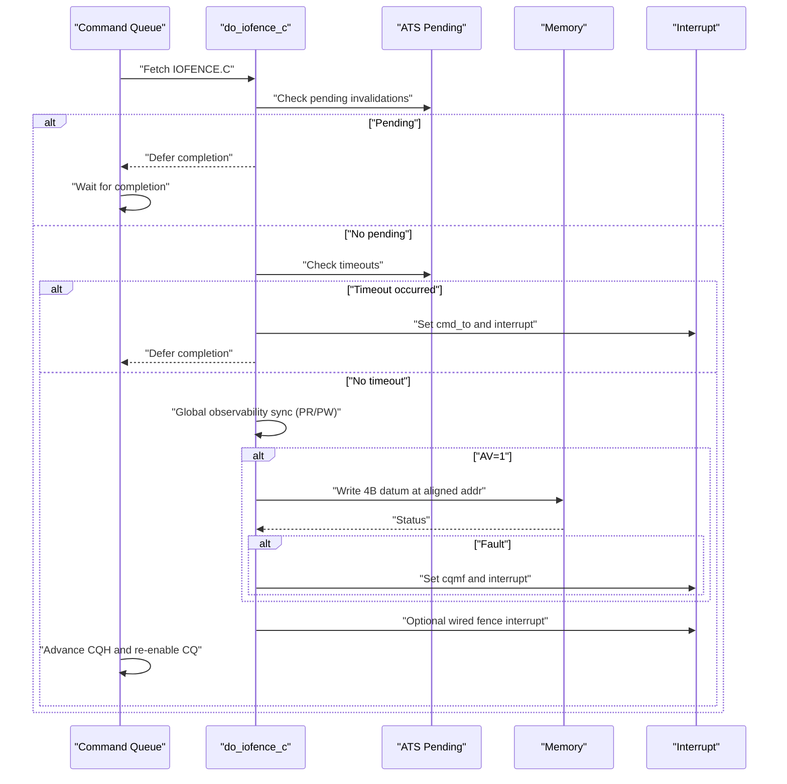
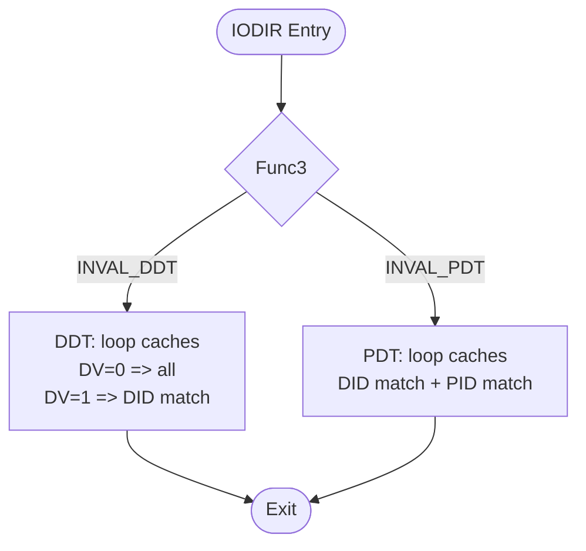
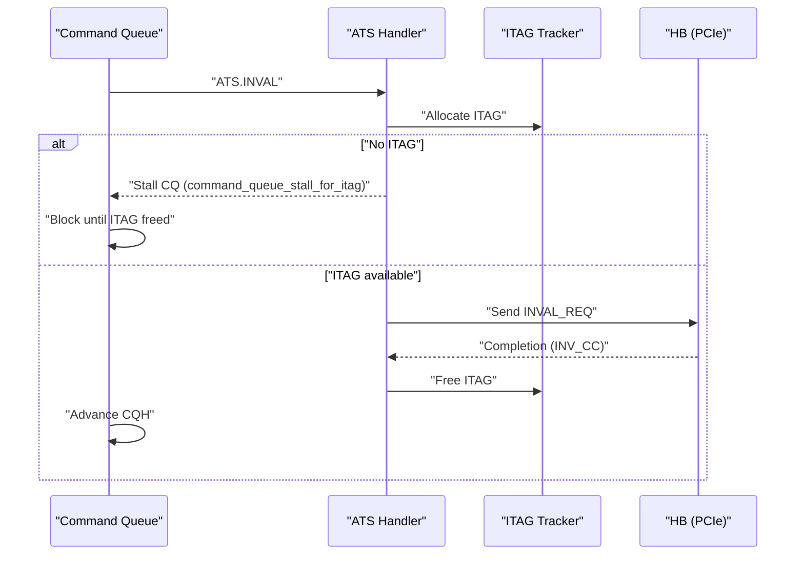
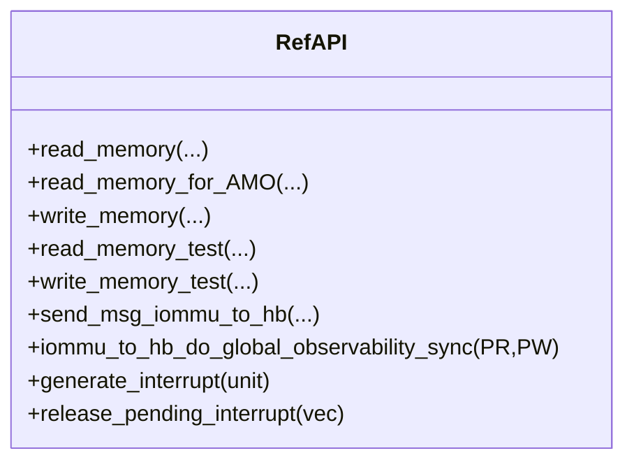
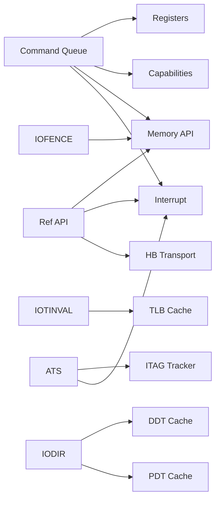

# Command Processing Engine

<cite>
**Referenced Files in This Document**
- [iommu_command_queue.cc](file://iommu/iommu_command_queue.cc)
- [iommu_command_queue.hh](file://iommu/iommu_command_queue.hh)
- [iommu_ref_api.cc](file://iommu/iommu_ref_api.cc)
- [iommu_ref_api.hh](file://iommu/iommu_ref_api.hh)
- [iommu_ats.cc](file://iommu/iommu_ats.cc)
- [iommu_ats.hh](file://iommu/iommu_ats.hh)
- [iommu_interrupt.cc](file://iommu/iommu_interrupt.cc)
- [iommu_interrupt.hh](file://iommu/iommu_interrupt.hh)
- [iommu_struct.hh](file://iommu/iommu_struct.hh)
- [iommu_data_structures.hh](file://iommu/iommu_data_structures.hh)
</cite>

## Table of Contents
1. [Introduction](#introduction)
2. [Project Structure](#project-structure)
3. [Core Components](#core-components)
4. [Architecture Overview](#architecture-overview)
5. [Detailed Component Analysis](#detailed-component-analysis)
6. [Dependency Analysis](#dependency-analysis)
7. [Performance Considerations](#performance-considerations)
8. [Troubleshooting Guide](#troubleshooting-guide)
9. [Conclusion](#conclusion)

## Introduction
This document describes the IOMMU command processing engine responsible for decoding, validating, and executing commands from the command queue. It explains the command parsing logic, execution workflows, and handler implementations for the following command families and functions:
- IOTINVAL: VMA and GVMA
- IOFENCE: C
- IODIR: INVAL_DDT and INVAL_PDT
- ATS: INVAL and PRGR
- Additional integration points for PRGR handling via ATS

It also documents the external reference API functions for memory access, message transmission, and interrupt generation, along with parameter validation, return value handling, error conditions, and performance optimization techniques.

## Project Structure
The command processing engine spans several modules:
- Command queue decode and dispatch
- Handler implementations for each command family
- ATS integration for invalidation requests and PRGR responses
- Reference API for memory and messaging
- Interrupt subsystem for signaling completion and faults

**Diagram sources**
- [iommu_command_queue.cc:7-276](file://iommu/iommu_command_queue.cc#L7-L276)
- [iommu_command_queue.hh:38-124](file://iommu/iommu_command_queue.hh#L38-L124)
- [iommu_ref_api.cc:25-196](file://iommu/iommu_ref_api.cc#L25-L196)
- [iommu_ref_api.hh:13-49](file://iommu/iommu_ref_api.hh#L13-L49)
- [iommu_ats.cc:7-94](file://iommu/iommu_ats.cc#L7-L94)
- [iommu_ats.hh:47-96](file://iommu/iommu_ats.hh#L47-L96)
- [iommu_interrupt.cc:27-106](file://iommu/iommu_interrupt.cc#L27-L106)

**Section sources**
- [iommu_command_queue.cc:7-276](file://iommu/iommu_command_queue.cc#L7-L276)
- [iommu_command_queue.hh:38-124](file://iommu/iommu_command_queue.hh#L38-L124)
- [iommu_ref_api.cc:25-196](file://iommu/iommu_ref_api.cc#L25-L196)
- [iommu_ref_api.hh:13-49](file://iommu/iommu_ref_api.hh#L13-L49)
- [iommu_ats.cc:7-94](file://iommu/iommu_ats.cc#L7-L94)
- [iommu_ats.hh:47-96](file://iommu/iommu_ats.hh#L47-L96)
- [iommu_interrupt.cc:27-106](file://iommu/iommu_interrupt.cc#L27-L106)

## Core Components
- Command decode and dispatch: Reads a 16-byte command from the in-memory command queue, validates readiness and access, decodes opcode and func3, and branches to the appropriate handler.
- Handler implementations:
  - IOTINVAL.VMA/GVMA: Invalidate IOATC entries based on address and context selectors.
  - IOFENCE.C: Ensures ordering and optional global observability, optionally writes a 4-byte datum to memory, and signals completion.
  - IODIR.INVAL_DDT/INVAL_PDT: Invalidate DDT/PDT caches selectively or globally.
  - ATS.INVAL: Allocates an ITAG, sends an invalidation request to the requester, and tracks completions.
  - ATS.PRGR: Sends a PRGR response to the requester.
- Reference API:
  - Memory read/write helpers for command queue and fence data.
  - Messaging helper to send ATS messages to the HB (host bridge).
  - Global observability synchronization hook.
- Interrupt controller: Generates MSI interrupts on faults or completion conditions.

**Section sources**
- [iommu_command_queue.cc:7-276](file://iommu/iommu_command_queue.cc#L7-L276)
- [iommu_command_queue.hh:38-124](file://iommu/iommu_command_queue.hh#L38-L124)
- [iommu_ref_api.cc:25-196](file://iommu/iommu_ref_api.cc#L25-L196)
- [iommu_ref_api.hh:13-49](file://iommu/iommu_ref_api.hh#L13-L49)
- [iommu_interrupt.cc:27-106](file://iommu/iommu_interrupt.cc#L27-L106)

## Architecture Overview
The command processing pipeline:
1. Precondition checks: command queue active/enabled, no memory fault, no illegal/timeout conditions, no resource stalls.
2. Fetch: Read 16-byte command from CQB + (CQH index * entry size) with endianness derived from fctl.
3. Decode: Extract opcode and func3; validate reserved fields against capabilities.
4. Dispatch: Route to handler based on opcode/func3.
5. Execute: Perform the operation (invalidate caches, send ATS messages, write fence data).
6. Advance: Increment CQH modulo queue size.
7. Error handling: Set cqmf/cmd_ill/cmd_to as needed and generate interrupts.

**Diagram sources**
- [iommu_command_queue.cc:7-276](file://iommu/iommu_command_queue.cc#L7-L276)
- [iommu_interrupt.cc:27-106](file://iommu/iommu_interrupt.cc#L27-L106)

## Detailed Component Analysis

### Command Parsing and Dispatch
- Precondition checks include cqon, cqen, cqmf, cmd_ill, cmd_to, ITAG stall, and IOFENCE pending invalidations.
- Fetch address computed from cqb.ppn and current CQH index; masked against pas using capabilities.pas.
- Decoder unions define bit layouts for IOTINVAL, IOFENCE, IODIR, and ATS commands.
- Illegal command detection sets cmd_ill and triggers interrupt.

**Diagram sources**
- [iommu_command_queue.cc:7-276](file://iommu/iommu_command_queue.cc#L7-L276)
- [iommu_command_queue.hh:38-109](file://iommu/iommu_command_queue.hh#L38-L109)

**Section sources**
- [iommu_command_queue.cc:7-276](file://iommu/iommu_command_queue.cc#L7-L276)
- [iommu_command_queue.hh:38-109](file://iommu/iommu_command_queue.hh#L38-L109)

### IOTINVAL: VMA and GVMA
- Purpose: Invalidate IOATC entries for first-/second-stage translations.
- Validation:
  - Reserved fields must be zero; capability-dependent fields (NL, S) must align with capabilities.
- Operations:
  - VMA: Invalidate based on GV, PSCV/PSCID, AV/ADDR, and optional S-range encoding; global vs non-global entries considered.
  - GVMA: Invalidate G-stage cached entries for specified GSCID and optional address range; PSCV=1 with GVMA is illegal.
- Range invalidation extension:
  - When S=1 and AV=1, ADDR encodes a NAPOT range; unspecified edge cases are treated conservatively.

**Diagram sources**
- [iommu_command_queue.cc:332-539](file://iommu/iommu_command_queue.cc#L332-L539)

**Section sources**
- [iommu_command_queue.cc:112-146](file://iommu/iommu_command_queue.cc#L112-L146)
- [iommu_command_queue.cc:332-539](file://iommu/iommu_command_queue.cc#L332-L539)

### IOFENCE: C
- Purpose: Ensure ordering and optional global observability; optionally write a 4-byte datum to memory; signal completion via wired interrupt if configured.
- Validation:
  - Reserved fields must be zero; WSI is reserved if MSI is supported.
- Execution:
  - If ATS invalidations are pending, defer completion and wait; track pending parameters.
  - If any ATS invalidation timed out, set cmd_to and interrupt.
  - Optional global observability sync via PR/PW.
  - Optional memory write at AV=1 with alignment and capability masking.
  - Wired interrupt signaling if configured.
- Completion:
  - If not pending, advance CQH and re-enable CQ if previously gated.

**Diagram sources**
- [iommu_command_queue.cc:575-656](file://iommu/iommu_command_queue.cc#L575-L656)
- [iommu_command_queue.cc:642-656](file://iommu/iommu_command_queue.cc#L642-L656)

**Section sources**
- [iommu_command_queue.cc:190-213](file://iommu/iommu_command_queue.cc#L190-L213)
- [iommu_command_queue.cc:575-656](file://iommu/iommu_command_queue.cc#L575-L656)

### IODIR: INVAL_DDT and INVAL_PDT
- Purpose: Invalidate DDT/PDT caches to ensure subsequent implicit reads observe recent updates to these directory structures.
- INVAL_DDT:
  - DV=0: invalidate all cached DDT/PDT entries.
  - DV=1: invalidate cached leaf DDT entry for DID and all associated PDT entries.
  - PID is reserved for this command.
- INVAL_PDT:
  - DV must be 1; DID must fit within ddtp.iommu_mode width.
  - PID constrained by capabilities (pd20/pd17) as documented.

**Diagram sources**
- [iommu_command_queue.cc:147-189](file://iommu/iommu_command_queue.cc#L147-L189)

**Section sources**
- [iommu_command_queue.cc:147-189](file://iommu/iommu_command_queue.cc#L147-L189)

### ATS: INVAL and PRGR
- INVAL:
  - Allocate an ITAG; if none available, stall the command queue until an ITAG becomes free.
  - Send an invalidation request to the requester; completion tracked via ITAG tracker.
- PRGR:
  - Send a PRGR response to the requester with optional PASID if configured.

**Diagram sources**
- [iommu_command_queue.cc:214-246](file://iommu/iommu_command_queue.cc#L214-L246)
- [iommu_ats.cc:7-94](file://iommu/iommu_ats.cc#L7-L94)

**Section sources**
- [iommu_command_queue.cc:214-246](file://iommu/iommu_command_queue.cc#L214-L246)
- [iommu_ats.cc:7-94](file://iommu/iommu_ats.cc#L7-L94)
- [iommu_ats.hh:47-96](file://iommu/iommu_ats.hh#L47-L96)

### External Reference API
- Memory access:
  - read_memory/read_memory_for_AMO/write_memory: wrappers around platform-specific tests or TLM transport.
  - read_memory_test/write_memory_test: emulate memory behavior with optional fault injection.
- Messaging:
  - send_msg_iommu_to_hb: construct and send ATS messages to HB via TLM socket; attach extended payload with message metadata.
- Global observability:
  - iommu_to_hb_do_global_observability_sync: hook for PR/PW ordering semantics.
- Interrupt:
  - generate_interrupt/release_pending_interrupt: MSI generation with vector mapping and masking.

**Diagram sources**
- [iommu_ref_api.cc:25-196](file://iommu/iommu_ref_api.cc#L25-L196)
- [iommu_ref_api.hh:13-49](file://iommu/iommu_ref_api.hh#L13-L49)
- [iommu_interrupt.cc:27-121](file://iommu/iommu_interrupt.cc#L27-L121)

**Section sources**
- [iommu_ref_api.cc:25-196](file://iommu/iommu_ref_api.cc#L25-L196)
- [iommu_ref_api.hh:13-49](file://iommu/iommu_ref_api.hh#L13-L49)
- [iommu_interrupt.cc:27-121](file://iommu/iommu_interrupt.cc#L27-L121)

## Dependency Analysis
- Command queue depends on:
  - Register file for queue base/tail and control/status bits.
  - Capability flags for validating reserved fields and extensions.
  - Memory access helpers for fetching commands and writing fence data.
  - Interrupt controller for fault/illegal/timeout signaling.
- Handlers depend on:
  - Cache arrays (TLB, DDT cache, PDT cache) for invalidation.
  - ATS subsystem for invalidation requests and PRGR responses.
- ATS subsystem depends on:
  - ITAG tracker for outstanding invalidations.
  - Interrupt controller for timeout signaling.
- Reference API bridges to platform transport (TLM) and provides hooks for global ordering.

**Diagram sources**
- [iommu_command_queue.cc:7-276](file://iommu/iommu_command_queue.cc#L7-L276)
- [iommu_ref_api.cc:25-196](file://iommu/iommu_ref_api.cc#L25-L196)
- [iommu_ats.cc:7-94](file://iommu/iommu_ats.cc#L7-L94)
- [iommu_interrupt.cc:27-106](file://iommu/iommu_interrupt.cc#L27-L106)

**Section sources**
- [iommu_command_queue.cc:7-276](file://iommu/iommu_command_queue.cc#L7-L276)
- [iommu_ref_api.cc:25-196](file://iommu/iommu_ref_api.cc#L25-L196)
- [iommu_ats.cc:7-94](file://iommu/iommu_ats.cc#L7-L94)
- [iommu_interrupt.cc:27-106](file://iommu/iommu_interrupt.cc#L27-L106)

## Performance Considerations
- Command queue bandwidth:
  - Keep CQH/CQT indices progressing; avoid stalls due to cqmf/cmd_ill/cmd_to or ITAG exhaustion.
- Cache invalidation:
  - Prefer targeted invalidation (by DID/PID/GSCID/ADDR) to minimize TLB churn.
- ATS batching:
  - Pending invalidations are deferred until completion; ensure timely completion to unblock IOFENCE and subsequent commands.
- Fence overhead:
  - IOFENCE.C may trigger global observability and memory writes; use sparingly for strict ordering.
- Interrupt coalescing:
  - MSI vectors and masks prevent storming; ensure proper vector mapping and unmasking.

[No sources needed since this section provides general guidance]

## Troubleshooting Guide
Common symptoms and diagnostics:
- Command queue stalls:
  - Check cqon/cqen/cqmf/cmd_ill/cmd_to; clear sticky bits after fixing memory or illegal commands.
  - ITAG stall indicates ATS invalidations awaiting completion or timeout.
- Memory faults during command fetch or fence write:
  - cqmf set; investigate address alignment, capability pas, and platform transport.
- Illegal command detected:
  - cmd_ill set; review reserved fields and capability-dependent encodings.
- Timeout on ATS invalidations:
  - cmd_to set; ATS timer expiry frees ITAGs and unblocks IOFENCE.
- Interrupt not received:
  - Verify vector mapping, mask bits, and pending flags; use release_pending_interrupt if needed.

Operational steps:
- For cqmf/cmd_ill/cmd_to, clear the corresponding sticky bits and re-enable CQ if needed.
- For ATS stalls, monitor itag_tracker and ATS timer expiry; ensure requester responds to INVAL_REQ.
- For IOFENCE, confirm completion path and that pending parameters are recorded correctly.

**Section sources**
- [iommu_command_queue.cc:47-100](file://iommu/iommu_command_queue.cc#L47-L100)
- [iommu_command_queue.cc:261-276](file://iommu/iommu_command_queue.cc#L261-L276)
- [iommu_command_queue.cc:586-608](file://iommu/iommu_command_queue.cc#L586-L608)
- [iommu_ats.cc:84-94](file://iommu/iommu_ats.cc#L84-L94)
- [iommu_interrupt.cc:27-121](file://iommu/iommu_interrupt.cc#L27-L121)

## Conclusion
The IOMMU command processing engine provides a robust, capability-aware pipeline for command decode, validation, and execution. It integrates tightly with ATS for device-driven invalidations, with memory access helpers for fence operations, and with the interrupt controller for asynchronous signaling. Correct handling of reserved fields, capability constraints, and resource availability (ITAGs) ensures reliable operation. Proper use of ordering fences and targeted invalidations yields predictable performance and minimal disruption to device operations.