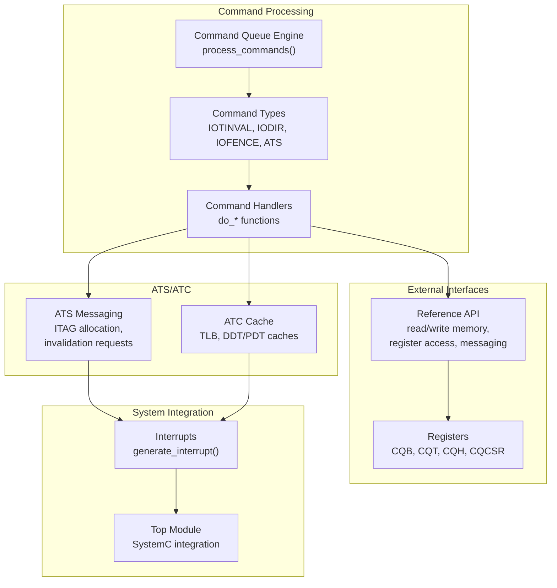
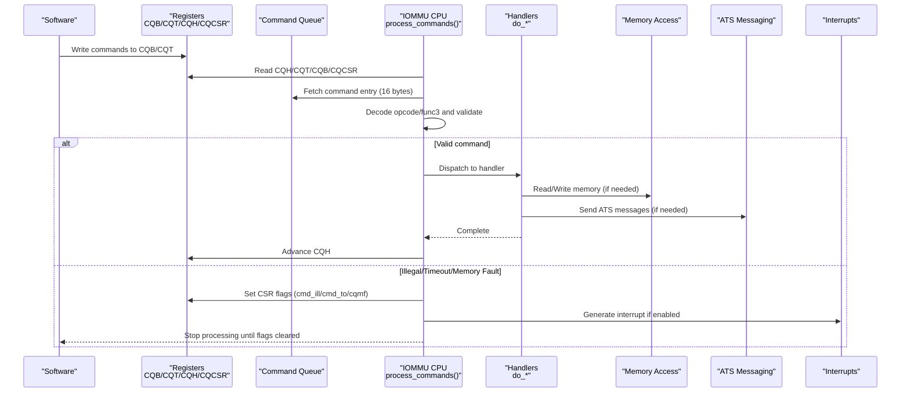
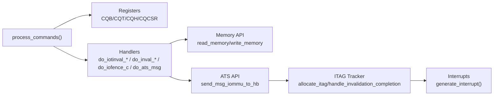

# Command Processing System

<cite>
**Referenced Files in This Document**
- [iommu_command_queue.hh](file://iommu/iommu_command_queue.hh)
- [iommu_command_queue.cc](file://iommu/iommu_command_queue.cc)
- [iommu_ref_api.hh](file://iommu/iommu_ref_api.hh)
- [iommu_ref_api.cc](file://iommu/iommu_ref_api.cc)
- [iommu_struct.hh](file://iommu/iommu_struct.hh)
- [iommu_registers.hh](file://iommu/iommu_registers.hh)
- [iommu_reg.cc](file://iommu/iommu_reg.cc)
- [iommu_data_structures.hh](file://iommu/iommu_data_structures.hh)
- [iommu_ats.hh](file://iommu/iommu_ats.hh)
- [iommu_ats.cc](file://iommu/iommu_ats.cc)
- [iommu_atc.hh](file://iommu/iommu_atc.hh)
- [iommu_interrupt.hh](file://iommu/iommu_interrupt.hh)
</cite>

## Table of Contents
1. [Introduction](#introduction)
2. [Project Structure](#project-structure)
3. [Core Components](#core-components)
4. [Architecture Overview](#architecture-overview)
5. [Detailed Component Analysis](#detailed-component-analysis)
6. [Dependency Analysis](#dependency-analysis)
7. [Performance Considerations](#performance-considerations)
8. [Troubleshooting Guide](#troubleshooting-guide)
9. [Conclusion](#conclusion)

## Introduction
This document describes the IOMMU command processing system, focusing on the command queue architecture, command entry formats, queue management operations, and the command processing engine. It explains how commands are parsed, validated, and executed, covering command types (IOTINVAL, IODIR, IOFENCE, ATS), their specific handlers, and the external reference API for command interface. Practical examples, error handling scenarios, and performance considerations for command throughput are included.

## Project Structure
The IOMMU command processing system is implemented across several modules:
- Command queue definitions and processing engine
- External reference API for memory/register access and messaging
- IOMMU data structures and register definitions
- ATS (Address Translation Services) and ATC (Address Translation Cache) integration
- Interrupt handling for command queue events

**Diagram sources**
- [iommu_command_queue.cc:7-276](file://iommu/iommu_command_queue.cc#L7-L276)
- [iommu_ref_api.hh:13-47](file://iommu/iommu_ref_api.hh#L13-L47)
- [iommu_registers.hh:331-549](file://iommu/iommu_registers.hh#L331-L549)
- [iommu_ats.hh:47-96](file://iommu/iommu_ats.hh#L47-L96)
- [iommu_atc.hh:9-51](file://iommu/iommu_atc.hh#L9-L51)

**Section sources**
- [iommu_command_queue.hh:23-124](file://iommu/iommu_command_queue.hh#L23-L124)
- [iommu_command_queue.cc:7-276](file://iommu/iommu_command_queue.cc#L7-L276)
- [iommu_ref_api.hh:13-47](file://iommu/iommu_ref_api.hh#L13-L47)
- [iommu_registers.hh:331-549](file://iommu/iommu_registers.hh#L331-L549)
- [iommu_ats.hh:47-96](file://iommu/iommu_ats.hh#L47-L96)
- [iommu_atc.hh:9-51](file://iommu/iommu_atc.hh#L9-L51)

## Core Components
- Command queue architecture: in-memory queue with base address and size configured via registers, managed by head/tail indices and CSR controls.
- Command entry format: unified 16-byte structure with opcode/func3 fields and specialized sub-fields per command type.
- Command processing engine: fetch-decode-execute loop with validation, error handling, and CSR status updates.
- Command handlers: dedicated functions for IOTINVAL, IODIR, IOFENCE, and ATS commands.
- External reference API: memory/register access helpers, messaging to HB (host bridge), and translation request interface.

Key implementation references:
- Command entry union and opcodes: [iommu_command_queue.hh:38-109](file://iommu/iommu_command_queue.hh#L38-L109)
- Command processing engine: [iommu_command_queue.cc:7-276](file://iommu/iommu_command_queue.cc#L7-L276)
- Handler declarations: [iommu_command_queue.hh:113-123](file://iommu/iommu_command_queue.hh#L113-L123)
- Reference API declarations: [iommu_ref_api.hh:13-47](file://iommu/iommu_ref_api.hh#L13-L47)

**Section sources**
- [iommu_command_queue.hh:23-124](file://iommu/iommu_command_queue.hh#L23-L124)
- [iommu_command_queue.cc:7-276](file://iommu/iommu_command_queue.cc#L7-L276)
- [iommu_ref_api.hh:13-47](file://iommu/iommu_ref_api.hh#L13-L47)

## Architecture Overview
The command processing pipeline operates as follows:
1. Software writes commands to the in-memory command queue and advances the tail index.
2. The IOMMU periodically invokes the command processing engine to fetch and decode commands.
3. Commands are validated against capabilities and reserved fields; illegal commands set CSR flags and halt processing.
4. Valid commands trigger specific handlers that update caches, send ATS messages, or perform memory operations.
5. CSR status bits (memory fault, illegal command, timeout) control processing flow and generate interrupts when enabled.

**Diagram sources**
- [iommu_command_queue.cc:7-276](file://iommu/iommu_command_queue.cc#L7-L276)
- [iommu_registers.hh:331-549](file://iommu/iommu_registers.hh#L331-L549)
- [iommu_ref_api.cc:25-46](file://iommu/iommu_ref_api.cc#L25-L46)

**Section sources**
- [iommu_command_queue.cc:7-276](file://iommu/iommu_command_queue.cc#L7-L276)
- [iommu_registers.hh:331-549](file://iommu/iommu_registers.hh#L331-L549)

## Detailed Component Analysis

### Command Queue Architecture
- Queue base and size: configured via CQB register (PPN and log2szm1 fields).
- Head/Tail indices: CQH (read-only) and CQT (software-controlled) define queue occupancy.
- Control/status: CQCSR controls enablement, interrupts, and status flags (cmd_ill, cmd_to, cqmf, fence_w_ip).
- Endianness: controlled by fctl.BE; memory accesses honor endianness.

Queue management operations:
- Empty/full detection: cqh == cqt (empty), cqt == (cqh - 1) (full).
- CSR flags halt processing until cleared.
- Turning off queue: cqen = 0; busy bit indicates ongoing operations.

References:
- Queue registers: [iommu_registers.hh:331-373](file://iommu/iommu_registers.hh#L331-L373)
- CSR control/status: [iommu_registers.hh:456-549](file://iommu/iommu_registers.hh#L456-L549)
- Queue logic: [iommu_command_queue.cc:66-73](file://iommu/iommu_command_queue.cc#L66-L73)

**Section sources**
- [iommu_registers.hh:331-373](file://iommu/iommu_registers.hh#L331-L373)
- [iommu_registers.hh:456-549](file://iommu/iommu_registers.hh#L456-L549)
- [iommu_command_queue.cc:66-73](file://iommu/iommu_command_queue.cc#L66-L73)

### Command Entry Formats
The unified command structure supports multiple command types with shared and specialized fields:
- Shared header: opcode (7 bits), func3 (3 bits), and various control/reserved fields.
- Specialized sub-structures for IOTINVAL, IOFENCE, IODIR, ATS, and a generic any variant.

Field breakdown:
- IOTINVAL: GV, AV, NL, PSCV, GSCID, PSCID, address, S (range invalidation).
- IOFENCE: PR, PW, AV, WSI, address/data payload.
- IODIR: DV, DID, PID, func3 selects DDT/PDT invalidation.
- ATS: MSGCODE, TAG, RID, DSV/DSEG, PV/PID, PAYLOAD.

References:
- Command union and sub-structures: [iommu_command_queue.hh:38-109](file://iommu/iommu_command_queue.hh#L38-L109)
- Entry size constant: [iommu_command_queue.hh:111](file://iommu/iommu_command_queue.hh#L111)

**Section sources**
- [iommu_command_queue.hh:38-109](file://iommu/iommu_command_queue.hh#L38-L109)
- [iommu_command_queue.hh:111](file://iommu/iommu_command_queue.hh#L111)

### Command Processing Engine
The engine performs:
- Pre-check: cqon/cqen/cqmf/cmd_ill/cmd_to/stall conditions.
- Fetch: read 16-byte entry from queue base + (cqh.index * entry size) with endianness.
- Decode: switch on opcode and func3; validate reserved fields and capabilities.
- Execute: dispatch to specific handler; on ATS, allocate ITAG and send message.
- Advance: increment CQH modulo queue size.

Error handling:
- Illegal command: set cmd_ill, generate interrupt if enabled.
- Memory fault during fetch/write: set cqmf, generate interrupt.
- Timeout on ATS invalidation: set cmd_to, generate interrupt.

References:
- Processing loop and decode: [iommu_command_queue.cc:7-276](file://iommu/iommu_command_queue.cc#L7-L276)
- CSR status and interrupts: [iommu_command_queue.cc:261-275](file://iommu/iommu_command_queue.cc#L261-L275)

**Section sources**
- [iommu_command_queue.cc:7-276](file://iommu/iommu_command_queue.cc#L7-L276)
- [iommu_command_queue.cc:261-275](file://iommu/iommu_command_queue.cc#L261-L275)

### Command Types and Handlers

#### IOTINVAL (VMA/GVMA)
- Purpose: Invalidate IOMMU address translation cache entries.
- VMA: Host VM address space invalidation with optional PSCID/GSCID and address range.
- GVMA: Guest VM address space invalidation with optional GSCID and address range.
- Range invalidation extension: S bit encodes NAPOT range size.

Handler behavior:
- Match TLB entries by GV/GSCID/PSCV/PSCID/AV/S and invalidate valid entries.
- Non-leaf PTE cache operations documented for completeness.

References:
- VMA handler: [iommu_command_queue.cc:331-451](file://iommu/iommu_command_queue.cc#L331-L451)
- GVMA handler: [iommu_command_queue.cc:452-539](file://iommu/iommu_command_queue.cc#L452-L539)
- TLB and cache structures: [iommu_atc.hh:9-36](file://iommu/iommu_atc.hh#L9-L36)

**Section sources**
- [iommu_command_queue.cc:331-539](file://iommu/iommu_command_queue.cc#L331-L539)
- [iommu_atc.hh:9-36](file://iommu/iommu_atc.hh#L9-L36)

#### IODIR (DDT/PDT Invalidation)
- Purpose: Invalidate IOMMU directory caches (DDT/PDT).
- INVAL_DDT: Invalidate DDT/PDT cache entries; DV controls device scope.
- INVAL_PDT: Invalidate leaf PDT entries for DID/PID; DV must be 1.

Handler behavior:
- Iterate caches and invalidate matching entries based on DV/DID/PID.
- Validate PID width against capabilities.

References:
- DDT/PDT handlers: [iommu_command_queue.cc:277-329](file://iommu/iommu_command_queue.cc#L277-L329)
- Cache structures: [iommu_atc.hh:37-51](file://iommu/iommu_atc.hh#L37-L51)

**Section sources**
- [iommu_command_queue.cc:277-329](file://iommu/iommu_command_queue.cc#L277-L329)
- [iommu_atc.hh:37-51](file://iommu/iommu_atc.hh#L37-L51)

#### IOFENCE (Global Ordering and Memory Write)
- Purpose: Order memory accesses and optionally write data to memory.
- IOFENCE.C: Guarantees all previously fetched commands are completed and committed.
- PR/PW: Request global observability synchronization.
- AV: If set, write DATA to aligned address ADDR; memory fault sets cqmf.

Handler behavior:
- Track pending ATS invalidations; if any, defer IOFENCE until completion.
- On timeout, set cmd_to and generate interrupt.
- Optionally write memory and set fence_w_ip interrupt.

References:
- IOFENCE handler: [iommu_command_queue.cc:574-640](file://iommu/iommu_command_queue.cc#L574-L640)
- Pending IOFENCE retry: [iommu_command_queue.cc:641-656](file://iommu/iommu_command_queue.cc#L641-L656)

**Section sources**
- [iommu_command_queue.cc:574-656](file://iommu/iommu_command_queue.cc#L574-L656)

#### ATS (Address Translation Services)
- Purpose: Manage device ATC invalidation and page request groups.
- INVAL: Send invalidation request to device; allocate ITAG tracker.
- PRGR: Send page request group response; optionally include PASID.

Handler behavior:
- Allocate ITAG; if none available, stall command queue until completion or timeout.
- Send ATS messages to host bridge; track completion counts per ITAG.
- Timer expiry marks ATS invalidation timeout.

References:
- ATS handler and messaging: [iommu_command_queue.cc:214-246](file://iommu/iommu_command_queue.cc#L214-L246)
- ATS messaging API: [iommu_command_queue.cc:541-573](file://iommu/iommu_command_queue.cc#L541-L573)
- ITAG allocation and completion: [iommu_ats.cc:7-33](file://iommu/iommu_ats.cc#L7-L33)
- ITAG tracker structure: [iommu_ats.hh:85-91](file://iommu/iommu_ats.hh#L85-L91)

**Section sources**
- [iommu_command_queue.cc:214-246](file://iommu/iommu_command_queue.cc#L214-L246)
- [iommu_command_queue.cc:541-573](file://iommu/iommu_command_queue.cc#L541-L573)
- [iommu_ats.cc:7-33](file://iommu/iommu_ats.cc#L7-L33)
- [iommu_ats.hh:85-91](file://iommu/iommu_ats.hh#L85-L91)

### External Reference API
The reference API provides:
- Memory access: read_memory(), write_memory() with endianness and PMA attributes.
- Register access: read_register(), write_register() with validation and alignment checks.
- Messaging: send_msg_iommu_to_hb() for ATS messages to host bridge.
- Translation request interface: iommu_translate_iova() for debug/testing.
- Utility: iommu_to_hb_do_global_observability_sync() placeholder.

References:
- API declarations: [iommu_ref_api.hh:13-47](file://iommu/iommu_ref_api.hh#L13-L47)
- Memory/register implementations: [iommu_ref_api.cc:25-111](file://iommu/iommu_ref_api.cc#L25-L111)
- Messaging implementation: [iommu_ref_api.cc:145-196](file://iommu/iommu_ref_api.cc#L145-L196)

**Section sources**
- [iommu_ref_api.hh:13-47](file://iommu/iommu_ref_api.hh#L13-L47)
- [iommu_ref_api.cc:25-111](file://iommu/iommu_ref_api.cc#L25-L111)
- [iommu_ref_api.cc:145-196](file://iommu/iommu_ref_api.cc#L145-L196)

### Practical Examples

#### Example 1: IOTINVAL.VMA with Address Range
- Command: IOTINVAL with func3=VMA, AV=1, S=1, GV=0, PSCV=1, PSCID set, address specified.
- Behavior: Invalidate TLB entries matching GV/GSCID/PSCID and address range; advance CQH.

References:
- VMA handler: [iommu_command_queue.cc:331-451](file://iommu/iommu_command_queue.cc#L331-L451)

**Section sources**
- [iommu_command_queue.cc:331-451](file://iommu/iommu_command_queue.cc#L331-L451)

#### Example 2: IOFENCE.C with Memory Write
- Command: IOFENCE.C with AV=1, PR=1, PW=1, WSI=0, address/data payload.
- Behavior: Defer if ATS invalidations pending; otherwise perform global sync, write memory, set fence_w_ip, advance CQH.

References:
- IOFENCE handler: [iommu_command_queue.cc:574-640](file://iommu/iommu_command_queue.cc#L574-L640)

**Section sources**
- [iommu_command_queue.cc:574-640](file://iommu/iommu_command_queue.cc#L574-L640)

#### Example 3: ATS.INVAL with ITAG Allocation
- Command: ATS with func3=INVAL, DSV/DSEG/RID/PV/PID/Payload.
- Behavior: Allocate ITAG; if none available, stall queue; on completion or timeout, retry blocked ATS or continue IOFENCE.

References:
- ATS handler: [iommu_command_queue.cc:214-246](file://iommu/iommu_command_queue.cc#L214-L246)
- ITAG allocation: [iommu_ats.cc:7-25](file://iommu/iommu_ats.cc#L7-L25)

**Section sources**
- [iommu_command_queue.cc:214-246](file://iommu/iommu_command_queue.cc#L214-L246)
- [iommu_ats.cc:7-25](file://iommu/iommu_ats.cc#L7-L25)

### Error Handling Scenarios
- Illegal command: Reserved bits set or unsupported func3/opcodes; sets cmd_ill and halts processing.
- Memory fault: Access fault during command fetch or IOFENCE memory write; sets cqmf and halts processing.
- Timeout: ATS invalidation request timeout; sets cmd_to and halts processing.
- CSR flags RW1C semantics: Writing 1 clears flags; interrupts generated when enabled.

References:
- Illegal command handling: [iommu_command_queue.cc:261-275](file://iommu/iommu_command_queue.cc#L261-L275)
- Memory fault handling: [iommu_command_queue.cc:84-100](file://iommu/iommu_command_queue.cc#L84-L100)
- Timeout handling: [iommu_command_queue.cc:600-608](file://iommu/iommu_command_queue.cc#L600-L608)

**Section sources**
- [iommu_command_queue.cc:261-275](file://iommu/iommu_command_queue.cc#L261-L275)
- [iommu_command_queue.cc:84-100](file://iommu/iommu_command_queue.cc#L84-L100)
- [iommu_command_queue.cc:600-608](file://iommu/iommu_command_queue.cc#L600-L608)

## Dependency Analysis
The command processing system exhibits the following dependencies:
- Command queue engine depends on register definitions and CSR status.
- Handlers depend on memory/register APIs and ATS messaging.
- ATS integration depends on ITAG tracker and completion logic.
- Interrupts depend on CSR flags and interrupt controller.

**Diagram sources**
- [iommu_command_queue.cc:7-276](file://iommu/iommu_command_queue.cc#L7-L276)
- [iommu_ref_api.cc:25-46](file://iommu/iommu_ref_api.cc#L25-L46)
- [iommu_ats.cc:7-33](file://iommu/iommu_ats.cc#L7-L33)
- [iommu_interrupt.hh:23](file://iommu/iommu_interrupt.hh#L23)

**Section sources**
- [iommu_command_queue.cc:7-276](file://iommu/iommu_command_queue.cc#L7-L276)
- [iommu_ref_api.cc:25-46](file://iommu/iommu_ref_api.cc#L25-L46)
- [iommu_ats.cc:7-33](file://iommu/iommu_ats.cc#L7-L33)
- [iommu_interrupt.hh:23](file://iommu/iommu_interrupt.hh#L23)

## Performance Considerations
- Throughput: Commands are fetched in-order but may execute out-of-order; CQH advancement does not imply completion. IOFENCE.C provides ordering guarantees.
- Queue sizing: Larger queues reduce stalls but increase memory footprint; alignment requirements apply for large queues.
- ATS overhead: ITAG allocation and completion tracking introduce latency; ensure sufficient ITAG capacity to avoid stalling the command queue.
- Memory operations: IOFENCE memory writes and command fetches are subject to endianness and access faults; minimize unnecessary writes to improve throughput.
- Interrupts: Frequent illegal/timeout conditions can halt processing; ensure proper configuration and error handling to maintain throughput.

[No sources needed since this section provides general guidance]

## Troubleshooting Guide
Common issues and resolutions:
- Command queue not processing: Verify cqon/cqen/cqmf/cmd_ill/cmd_to are cleared; check CSR flags and interrupts.
- Memory fault during command fetch: Inspect address alignment and PMA; ensure queue base is within supported physical address range.
- Illegal command detected: Review reserved bits and func3/opcodes; confirm capabilities support the command.
- ATS invalidation timeout: Confirm device responsiveness; check ITAG tracker state and timer expiry handling.
- IOFENCE not advancing: Ensure ATS invalidations complete or timeout; pending IOFENCE will stall until cleared.

References:
- CSR status and interrupts: [iommu_command_queue.cc:261-275](file://iommu/iommu_command_queue.cc#L261-L275)
- ATS completion and timeout: [iommu_ats.cc:56-94](file://iommu/iommu_ats.cc#L56-L94)

**Section sources**
- [iommu_command_queue.cc:261-275](file://iommu/iommu_command_queue.cc#L261-L275)
- [iommu_ats.cc:56-94](file://iommu/iommu_ats.cc#L56-L94)

## Conclusion
The IOMMU command processing system provides a robust, register-controlled mechanism for managing device translation and invalidation operations. Its architecture balances simplicity with powerful features like address-range invalidation, global ordering, and ATS integration. Proper configuration of queue registers, careful handling of CSR flags, and efficient ATS resource management are essential for optimal performance and reliability.