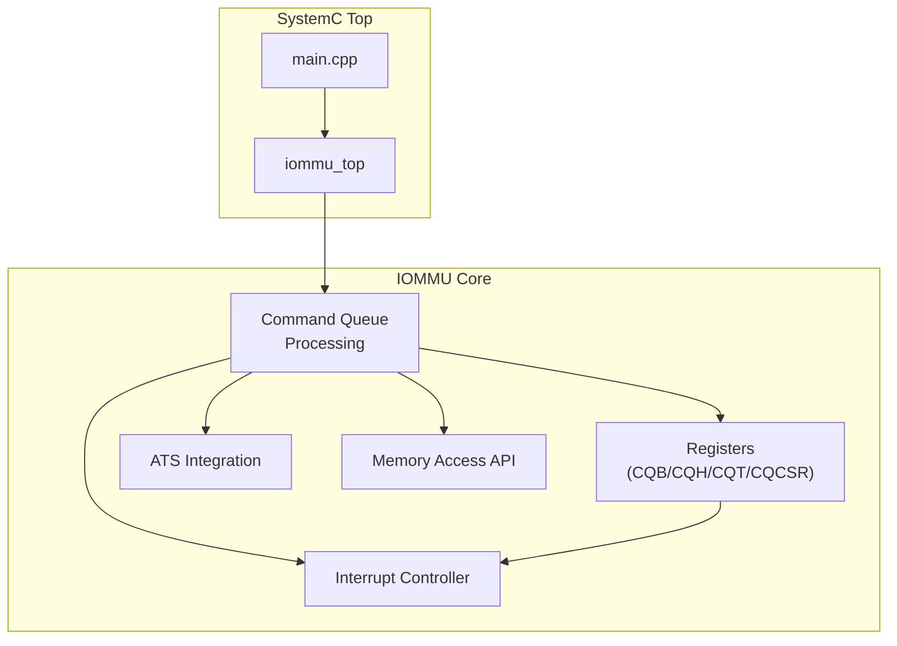
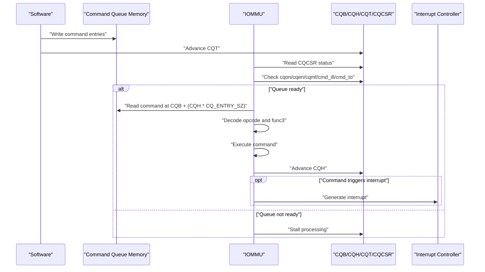
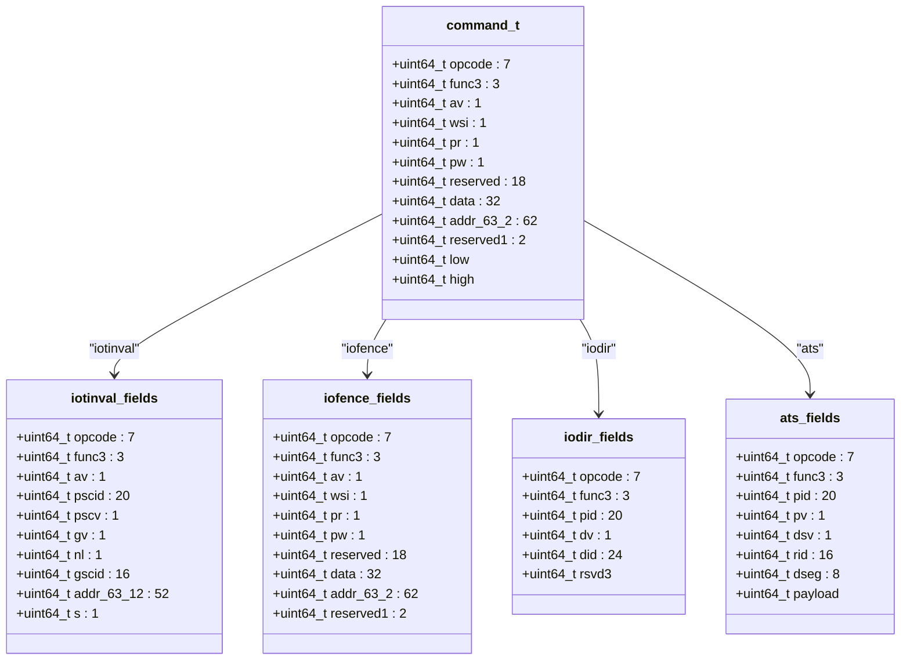
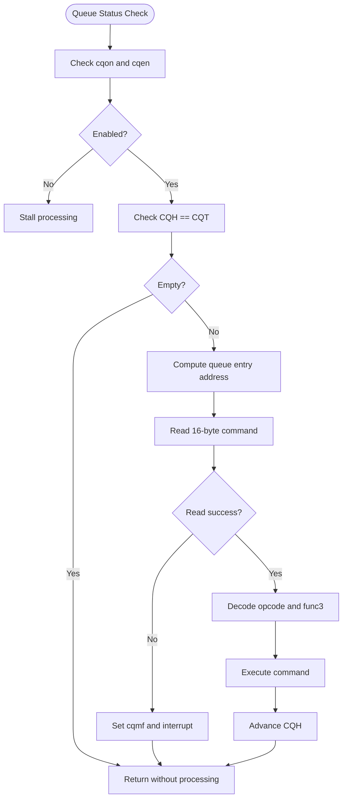
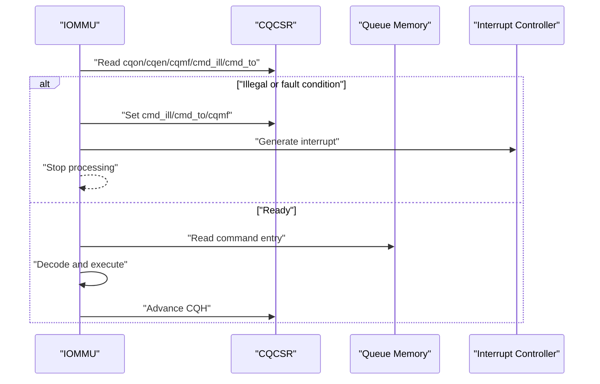
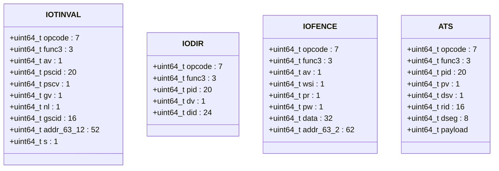
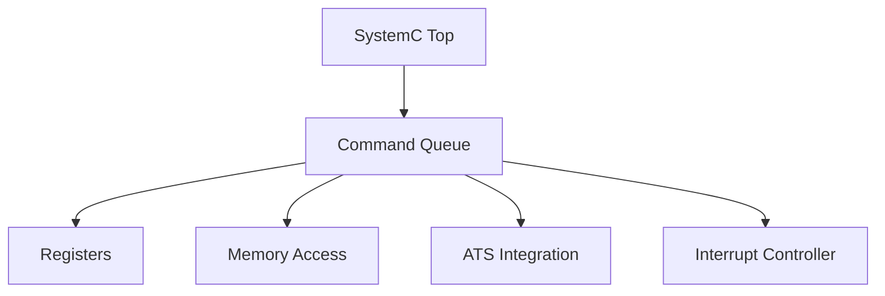

# Command Queue Architecture

<cite>
**Referenced Files in This Document**
- [iommu_command_queue.hh](file://iommu/iommu_command_queue.hh)
- [iommu_command_queue.cc](file://iommu/iommu_command_queue.cc)
- [iommu_registers.hh](file://iommu/iommu_registers.hh)
- [iommu_struct.hh](file://iommu/iommu_struct.hh)
- [iommu_ats.hh](file://iommu/iommu_ats.hh)
- [iommu_interrupt.hh](file://iommu/iommu_interrupt.hh)
- [iommu_interrupt.cc](file://iommu/iommu_interrupt.cc)
- [iommu_ref_api.cc](file://iommu/iommu_ref_api.cc)
- [iommu_ref_api.hh](file://iommu/iommu_ref_api.hh)
- [iommu_top.hh](file://iommu/iommu_top.hh)
- [iommu_top.cc](file://iommu/iommu_top.cc)
- [main.cpp](file://main.cpp)
</cite>

## Table of Contents
1. [Introduction](#introduction)
2. [Project Structure](#project-structure)
3. [Core Components](#core-components)
4. [Architecture Overview](#architecture-overview)
5. [Detailed Component Analysis](#detailed-component-analysis)
6. [Dependency Analysis](#dependency-analysis)
7. [Performance Considerations](#performance-considerations)
8. [Troubleshooting Guide](#troubleshooting-guide)
9. [Conclusion](#conclusion)

## Introduction
This document provides comprehensive documentation for the IOMMU command queue architecture. It explains the command queue design principles, memory layout, and queue management operations. It documents the command entry format structure including bit-field definitions, opcode encoding, and parameter specifications. It covers queue operations such as enqueue, dequeue, and queue status management, along with detailed descriptions of command entry unions and their specific field layouts. It includes examples of command queue initialization, operation sequencing, and error handling scenarios, and addresses queue capacity limits, overflow conditions, and performance considerations for high-throughput command processing.

## Project Structure
The IOMMU command queue implementation is part of a SystemC-based IOMMU model. The relevant files are organized as follows:
- Command queue definition and processing logic: iommu_command_queue.hh, iommu_command_queue.cc
- Register definitions and queue control/status: iommu_registers.hh
- Shared data structures and IOMMU state: iommu_struct.hh
- ATS (Address Translation Services) integration: iommu_ats.hh
- Interrupt handling for command queue events: iommu_interrupt.hh, iommu_interrupt.cc
- Memory access abstraction for queue operations: iommu_ref_api.cc, iommu_ref_api.hh
- Top-level SystemC integration: iommu_top.hh, iommu_top.cc, main.cpp

**Diagram sources**
- [iommu_command_queue.cc:7-276](file://iommu/iommu_command_queue.cc#L7-L276)
- [iommu_registers.hh:331-549](file://iommu/iommu_registers.hh#L331-L549)
- [iommu_ats.hh:47-98](file://iommu/iommu_ats.hh#L47-L98)
- [iommu_interrupt.cc:28-106](file://iommu/iommu_interrupt.cc#L28-L106)
- [iommu_ref_api.cc:25-111](file://iommu/iommu_ref_api.cc#L25-L111)
- [iommu_top.cc:38-192](file://iommu/iommu_top.cc#L38-L192)
- [main.cpp:37-79](file://main.cpp#L37-L79)

**Section sources**
- [iommu_command_queue.hh:1-125](file://iommu/iommu_command_queue.hh#L1-L125)
- [iommu_command_queue.cc:7-276](file://iommu/iommu_command_queue.cc#L7-L276)
- [iommu_registers.hh:331-549](file://iommu/iommu_registers.hh#L331-L549)
- [iommu_struct.hh:42-102](file://iommu/iommu_struct.hh#L42-L102)
- [iommu_ats.hh:47-98](file://iommu/iommu_ats.hh#L47-L98)
- [iommu_interrupt.hh:8-25](file://iommu/iommu_interrupt.hh#L8-L25)
- [iommu_interrupt.cc:28-106](file://iommu/iommu_interrupt.cc#L28-L106)
- [iommu_ref_api.cc:25-111](file://iommu/iommu_ref_api.cc#L25-L111)
- [iommu_top.hh:19-57](file://iommu/iommu_top.hh#L19-L57)
- [iommu_top.cc:38-192](file://iommu/iommu_top.cc#L38-L192)
- [main.cpp:37-79](file://main.cpp#L37-L79)

## Core Components
This section documents the core components of the command queue architecture, focusing on the command entry format, queue management registers, and processing logic.

- Command Entry Union and Bit Fields
  - The command entry is represented as a 128-bit union with multiple specialized structures for different opcodes and a generic "any" structure for common fields.
  - The union includes fields for opcode, func3, address fields, and payload fields depending on the command type.
  - The command entry size is defined as 16 bytes (RVI_IOMMU_CQ_ENTRY_SZ).

- Queue Control and Status Registers
  - Command-Queue Base (CQB): Holds the base physical page number (PPN) and log2 size of the queue.
  - Command-Queue Head (CQH): Read-only index indicating the next command to fetch.
  - Command-Queue Tail (CQT): Read-only index indicating where software enqueues the next command.
  - Command-Queue Control and Status Register (CQCSR): Controls queue enablement, interrupt generation, and status flags (memory fault, illegal command, timeout).

- Command Types and Opcodes
  - IOTINVAL (Invalidate Translation): Supports VMA and GVMA variants with optional address-range and non-leaf PTE invalidation extensions.
  - IODIR (Invalidate Directory): Supports DDT and PDT invalidation with device ID and process ID constraints.
  - IOFENCE (Fence): Supports IOFENCE.C with ordering and memory store operations.
  - ATS (Address Translation Services): Supports Invalidation Request and Page Request Group Response messages.

**Section sources**
- [iommu_command_queue.hh:38-111](file://iommu/iommu_command_queue.hh#L38-L111)
- [iommu_command_queue.hh:23-37](file://iommu/iommu_command_queue.hh#L23-L37)
- [iommu_command_queue.hh:28-37](file://iommu/iommu_command_queue.hh#L28-L37)
- [iommu_command_queue.hh:28-37](file://iommu/iommu_command_queue.hh#L28-L37)
- [iommu_command_queue.hh:34-37](file://iommu/iommu_command_queue.hh#L34-L37)
- [iommu_command_queue.hh:36-37](file://iommu/iommu_command_queue.hh#L36-L37)
- [iommu_registers.hh:331-373](file://iommu/iommu_registers.hh#L331-L373)
- [iommu_registers.hh:456-549](file://iommu/iommu_registers.hh#L456-L549)

## Architecture Overview
The command queue architecture consists of an in-memory queue controlled by software and consumed by the IOMMU. Software enqueues commands by writing to the queue memory and advancing the tail pointer. The IOMMU dequeues commands by reading from the queue memory and advancing the head pointer. The queue is managed through dedicated registers and status flags.

**Diagram sources**
- [iommu_command_queue.cc:7-276](file://iommu/iommu_command_queue.cc#L7-L276)
- [iommu_registers.hh:331-549](file://iommu/iommu_registers.hh#L331-L549)
- [iommu_interrupt.cc:28-106](file://iommu/iommu_interrupt.cc#L28-L106)

## Detailed Component Analysis

### Command Entry Format and Bit Fields
The command entry is a 128-bit union with the following structures:
- Generic "any" structure with low/high 64-bit halves
- IOTINVAL structure for translation cache invalidation
- IOFENCE structure for ordering and memory operations
- IODIR structure for directory cache invalidation
- ATS structure for address translation services

Key bit-field definitions include:
- Opcode and Func3 fields for command identification
- Address fields for memory operations
- Payload fields for ATS messages
- Capability-dependent fields (e.g., S bit for address range invalidation, NL bit for non-leaf PTE invalidation)

**Diagram sources**
- [iommu_command_queue.hh:38-109](file://iommu/iommu_command_queue.hh#L38-L109)

**Section sources**
- [iommu_command_queue.hh:38-111](file://iommu/iommu_command_queue.hh#L38-L111)

### Queue Management Operations
The command queue is managed through the following registers:
- CQB: Contains the base PPN and log2 size of the queue
- CQH: Read-only index of the next command to fetch
- CQT: Read-only index where software enqueues the next command
- CQCSR: Controls queue enablement and reports status flags

Queue capacity and indexing:
- Queue size is 2^(log2szm1 + 1) entries
- Each entry is 16 bytes
- Empty condition: CQH == CQT
- Full condition: CQT == (CQH - 1) modulo queue size

**Diagram sources**
- [iommu_command_queue.cc:7-276](file://iommu/iommu_command_queue.cc#L7-L276)
- [iommu_registers.hh:331-373](file://iommu/iommu_registers.hh#L331-L373)
- [iommu_registers.hh:456-549](file://iommu/iommu_registers.hh#L456-L549)

**Section sources**
- [iommu_command_queue.cc:7-276](file://iommu/iommu_command_queue.cc#L7-L276)
- [iommu_registers.hh:331-373](file://iommu/iommu_registers.hh#L331-L373)
- [iommu_registers.hh:456-549](file://iommu/iommu_registers.hh#L456-L549)

### Command Processing Logic
The IOMMU processes commands in the following manner:
- Validates queue readiness (cqon, cqen, cqmf, cmd_ill, cmd_to)
- Reads the command from memory at CQB + (CQH * 16)
- Decodes the opcode and func3 fields
- Executes the appropriate command handler
- Advances the CQH pointer

Illegal command handling:
- If a command uses reserved encodings or sets reserved bits, the CQCSR cmd_ill flag is set and processing stops
- An interrupt is generated if not already pending and not masked

Timeout handling:
- Certain commands (e.g., ATS invalidation) may timeout
- The CQCSR cmd_to flag is set and processing stops
- An interrupt is generated if not already pending and not masked

**Diagram sources**
- [iommu_command_queue.cc:7-276](file://iommu/iommu_command_queue.cc#L7-L276)
- [iommu_interrupt.cc:28-106](file://iommu/iommu_interrupt.cc#L28-L106)

**Section sources**
- [iommu_command_queue.cc:7-276](file://iommu/iommu_command_queue.cc#L7-L276)
- [iommu_interrupt.cc:28-106](file://iommu/iommu_interrupt.cc#L28-L106)

### Command Entry Unions and Field Layouts
The command entry unions define the layout for different command types:
- IOTINVAL.VMA/GVMA: Supports address-range invalidation (S bit) and non-leaf PTE invalidation (NL bit) based on capability flags
- IODIR.INVAL_DDT/INVAL_PDT: Supports device ID and process ID constraints with capability checks
- IOFENCE.C: Supports ordering (PR/PW) and memory store operations (AV)
- ATS: Supports Invalidation Request and Page Request Group Response with ITAG allocation

**Diagram sources**
- [iommu_command_queue.hh:38-98](file://iommu/iommu_command_queue.hh#L38-L98)

**Section sources**
- [iommu_command_queue.hh:38-111](file://iommu/iommu_command_queue.hh#L38-L111)

### Initialization and Operation Sequencing
Initialization involves configuring the command queue base and enabling the queue:
- Configure CQB with the base PPN and log2 size
- Enable the queue by setting cqen in CQCSR
- Software enqueues commands by writing to queue memory and advancing CQT
- The IOMMU processes commands by reading from queue memory and advancing CQH

Operation sequencing:
- Queue readiness check (cqon, cqen, cqmf, cmd_ill, cmd_to)
- Empty/full detection using CQH and CQT
- Memory access with proper alignment and capability checks
- Command execution and status updates

**Section sources**
- [iommu_command_queue.cc:7-276](file://iommu/iommu_command_queue.cc#L7-L276)
- [iommu_registers.hh:331-549](file://iommu/iommu_registers.hh#L331-L549)

### Error Handling Scenarios
Common error conditions and their handling:
- Memory fault during command fetch: Sets cqmf flag and generates interrupt
- Illegal command: Sets cmd_ill flag and generates interrupt
- Timeout during command execution: Sets cmd_to flag and generates interrupt
- ATS invalidation timeout: Sets cmd_to flag and halts processing until completion
- Queue stall due to resource unavailability (e.g., ITAG tracker)

Interrupt handling:
- Interrupts are generated when not already pending and not masked
- MSI or wire interrupts are supported based on capabilities and configuration
- Pending interrupts are tracked and released when masked bit is cleared

**Section sources**
- [iommu_command_queue.cc:7-276](file://iommu/iommu_command_queue.cc#L7-L276)
- [iommu_interrupt.cc:28-106](file://iommu/iommu_interrupt.cc#L28-L106)

## Dependency Analysis
The command queue architecture has the following dependencies:
- Command queue processing depends on register definitions for queue control/status
- Memory access functions are used for reading command entries and writing completion data
- ATS integration requires ITAG allocation and message handling
- Interrupt controller manages pending and masked interrupts
- SystemC top-level module coordinates queue monitoring and processing

**Diagram sources**
- [iommu_command_queue.cc:7-276](file://iommu/iommu_command_queue.cc#L7-L276)
- [iommu_registers.hh:331-549](file://iommu/iommu_registers.hh#L331-L549)
- [iommu_ref_api.cc:25-111](file://iommu/iommu_ref_api.cc#L25-L111)
- [iommu_ats.hh:47-98](file://iommu/iommu_ats.hh#L47-L98)
- [iommu_interrupt.cc:28-106](file://iommu/iommu_interrupt.cc#L28-L106)
- [iommu_top.cc:38-192](file://iommu/iommu_top.cc#L38-L192)

**Section sources**
- [iommu_command_queue.cc:7-276](file://iommu/iommu_command_queue.cc#L7-L276)
- [iommu_registers.hh:331-549](file://iommu/iommu_registers.hh#L331-L549)
- [iommu_ref_api.cc:25-111](file://iommu/iommu_ref_api.cc#L25-L111)
- [iommu_ats.hh:47-98](file://iommu/iommu_ats.hh#L47-L98)
- [iommu_interrupt.cc:28-106](file://iommu/iommu_interrupt.cc#L28-L106)
- [iommu_top.cc:38-192](file://iommu/iommu_top.cc#L38-L192)

## Performance Considerations
High-throughput command processing considerations:
- Queue size and alignment: Queue base alignment depends on queue size (4KB for ≤256 entries, natural alignment for >256 entries)
- Memory bandwidth: Commands are 16 bytes each; efficient memory access patterns improve throughput
- Command ordering: IOFENCE.C provides ordering guarantees but may stall processing until pending invalidations complete
- ATS integration: ITAG allocation can cause stalls when trackers are unavailable
- Interrupt overhead: Frequent interrupts can impact performance; batching commands reduces interrupt frequency

Capacity limits and overflow:
- Queue capacity: 2^(log2szm1 + 1) entries
- Full condition: CQT == (CQH - 1) modulo capacity
- Overflow prevention: Software must ensure CQT does not reach CQH - 1

[No sources needed since this section provides general guidance]

## Troubleshooting Guide
Common issues and resolutions:
- Command queue not processing: Check cqon and cqen bits; ensure queue is enabled
- Memory fault during command fetch: Verify CQB base address alignment and accessibility; clear cqmf flag after fixing memory issue
- Illegal command detected: Review opcode and func3 encodings; ensure reserved fields are zero
- Timeout errors: Investigate ATS invalidation timeouts; check device connectivity and response timing
- Interrupt not generated: Verify cie and masked status; check interrupt vector configuration
- Queue stall: Monitor command_queue_stall_for_itag and iofence_wait_pending_inv flags; resolve ITAG allocation or pending invalidations

Debugging aids:
- Debug prints in command processing show queue status and command details
- Interrupt generation logs help trace error conditions
- Memory access functions provide visibility into queue memory operations

**Section sources**
- [iommu_command_queue.cc:7-276](file://iommu/iommu_command_queue.cc#L7-L276)
- [iommu_interrupt.cc:28-106](file://iommu/iommu_interrupt.cc#L28-L106)
- [iommu_ref_api.cc:25-111](file://iommu/iommu_ref_api.cc#L25-L111)

## Conclusion
The IOMMU command queue architecture provides a robust mechanism for software-driven command submission and IOMMU processing. The design supports multiple command types with capability-aware extensions, maintains strict queue management semantics, and integrates with ATS and interrupt systems. Proper initialization, careful queue sizing, and attention to error conditions are essential for reliable operation. The architecture balances flexibility with performance, supporting high-throughput scenarios while maintaining correctness and observability.