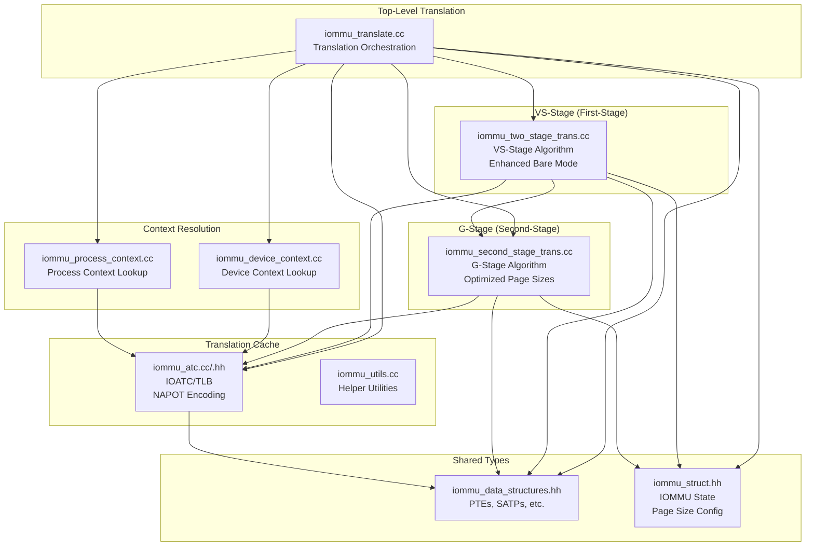
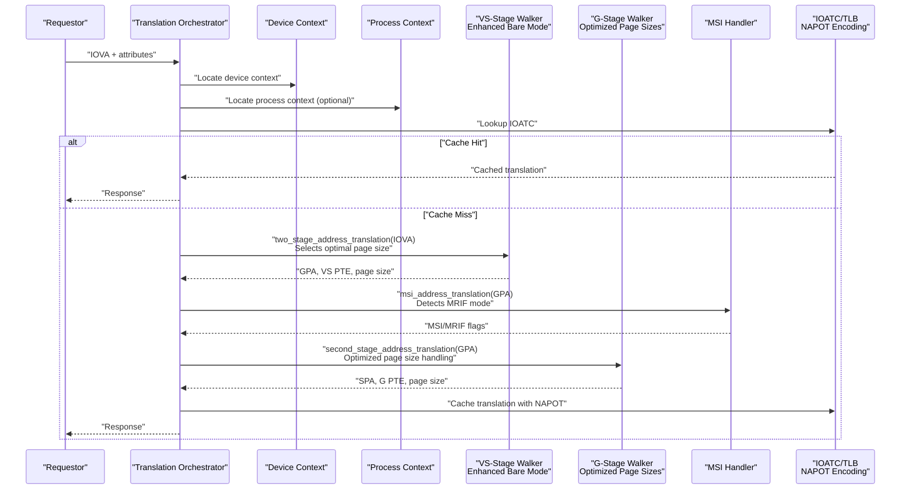
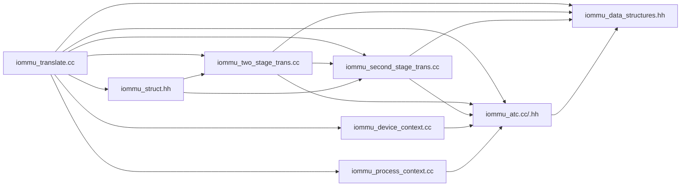

# Address Translation Engine

<cite>
**Referenced Files in This Document**
- [iommu_translate.cc](file://iommu/iommu_translate.cc)
- [iommu_translate.hh](file://iommu/iommu_translate.hh)
- [iommu_two_stage_trans.cc](file://iommu/iommu_two_stage_trans.cc)
- [iommu_second_stage_trans.cc](file://iommu/iommu_second_stage_trans.cc)
- [iommu_data_structures.hh](file://iommu/iommu_data_structures.hh)
- [iommu_device_context.cc](file://iommu/iommu_device_context.cc)
- [iommu_process_context.cc](file://iommu/iommu_process_context.cc)
- [iommu_atc.cc](file://iommu/iommu_atc.cc)
- [iommu_atc.hh](file://iommu/iommu_atc.hh)
- [iommu_utils.cc](file://iommu/iommu_utils.cc)
- [iommu_struct.hh](file://iommu/iommu_struct.hh)
</cite>

## Update Summary
**Changes Made**
- Enhanced Bare mode handling with sophisticated page size selection based on virtual memory modes
- Improved PPN extraction algorithms for both large pages (2MB) and small pages (4KB)
- Optimized physical address calculation logic with better NAPOT encoding support
- Updated translation cache integration with enhanced page size handling
- Refined MSI address translation with improved MRIF mode detection

## Table of Contents
1. [Introduction](#introduction)
2. [Project Structure](#project-structure)
3. [Core Components](#core-components)
4. [Architecture Overview](#architecture-overview)
5. [Detailed Component Analysis](#detailed-component-analysis)
6. [Dependency Analysis](#dependency-analysis)
7. [Performance Considerations](#performance-considerations)
8. [Troubleshooting Guide](#troubleshooting-guide)
9. [Conclusion](#conclusion)

## Introduction
This document describes the address translation engine that implements the two-stage address translation process for IOMMU transactions. It covers the VS-stage (first-stage) and G-stage (second-stage) translation algorithms, supported page sizes (SV32/SV39/SV48/SV57 and SV32x4/SV39x4/SV48x4/SV57x4), data structures for PTEs and page table pointers, and the translation cache integration. The engine now features enhanced Bare mode handling with sophisticated page size selection and optimized physical address calculation logic.

## Project Structure
The translation engine is implemented across several modules:
- Top-level translation orchestration and policy decisions
- VS-stage translation (first-stage) implementation with enhanced Bare mode support
- G-stage translation (second-stage) implementation with optimized page size handling
- Device and process context resolution
- Translation cache (ATC) integration with NAPOT encoding
- Shared data structures and utilities

**Diagram sources**
- [iommu_translate.cc:1-719](file://iommu/iommu_translate.cc#L1-L719)
- [iommu_two_stage_trans.cc:1-600](file://iommu/iommu_two_stage_trans.cc#L1-L600)
- [iommu_second_stage_trans.cc:1-424](file://iommu/iommu_second_stage_trans.cc#L1-L424)
- [iommu_device_context.cc:1-419](file://iommu/iommu_device_context.cc#L1-L419)
- [iommu_process_context.cc:1-236](file://iommu/iommu_process_context.cc#L1-L236)
- [iommu_atc.cc:1-233](file://iommu/iommu_atc.cc#L1-L233)
- [iommu_atc.hh:1-98](file://iommu/iommu_atc.hh#L1-L98)
- [iommu_data_structures.hh:1-415](file://iommu/iommu_data_structures.hh#L1-L415)
- [iommu_struct.hh:1-102](file://iommu/iommu_struct.hh#L1-L102)

**Section sources**
- [iommu_translate.cc:1-719](file://iommu/iommu_translate.cc#L1-L719)
- [iommu_struct.hh:1-102](file://iommu/iommu_struct.hh#L1-L102)

## Core Components
- Translation orchestration and policy: iommu_translate.cc
- VS-stage translation algorithm: iommu_two_stage_trans.cc (enhanced with Bare mode page size selection)
- G-stage translation algorithm: iommu_second_stage_trans.cc (optimized with enhanced page size handling)
- Device and process context resolution: iommu_device_context.cc, iommu_process_context.cc
- Translation cache (IOATC/TLB): iommu_atc.cc/.hh (with NAPOT encoding support)
- Shared data structures and utilities: iommu_data_structures.hh, iommu_utils.cc
- IOMMU state container: iommu_struct.hh (with page size configuration)

Key responsibilities:
- Orchestrate the two-stage translation pipeline and cache integration
- Implement canonical address checks and page table walking with enhanced Bare mode support
- Enforce permission checks and A/D bit semantics with optimized page size handling
- Manage MSI address translation and MRIF handling with improved detection
- Maintain translation cache entries with NAPOT encoding and handle misses/hits efficiently

**Section sources**
- [iommu_translate.cc:1-719](file://iommu/iommu_translate.cc#L1-L719)
- [iommu_two_stage_trans.cc:1-600](file://iommu/iommu_two_stage_trans.cc#L1-L600)
- [iommu_second_stage_trans.cc:1-424](file://iommu/iommu_second_stage_trans.cc#L1-L424)
- [iommu_atc.cc:1-233](file://iommu/iommu_atc.cc#L1-L233)
- [iommu_data_structures.hh:1-415](file://iommu/iommu_data_structures.hh#L1-L415)

## Architecture Overview
The translation engine performs a two-stage address translation with enhanced Bare mode support:
1. VS-stage (first-stage) translation using iosatp to convert IOVA to GPA with sophisticated page size selection
2. G-stage (second-stage) translation using iohgatp to convert GPA to SPA with optimized page size handling
3. Optional MSI address translation to detect and route interrupts with improved MRIF mode detection
4. Cache integration via IOATC/TLB for fast lookups with NAPOT encoding support

**Diagram sources**
- [iommu_translate.cc:316-476](file://iommu/iommu_translate.cc#L316-L476)
- [iommu_two_stage_trans.cc:9-502](file://iommu/iommu_two_stage_trans.cc#L9-L502)
- [iommu_second_stage_trans.cc:8-422](file://iommu/iommu_second_stage_trans.cc#L8-L422)
- [iommu_atc.cc:150-232](file://iommu/iommu_atc.cc#L150-L232)

## Detailed Component Analysis

### Translation Orchestration (iommu_translate.cc)
Responsibilities:
- Classify transaction type and extract privilege/read/write/exec attributes
- Resolve device and process contexts with enhanced Bare mode detection
- Decide whether to use VS-stage/G-stage or Bare mode with sophisticated page size selection
- Integrate IOATC/TLB lookups with NAPOT encoding and cache fills
- Handle MSI address translation and MRIF routing with improved detection
- Construct response with permissions, PBMT, and ATS-specific fields using optimized page size calculation

Key functions:
- iommu_translate_iova(): Top-level translation entry point with enhanced Bare mode support
- msi_address_translation(): Detects MSI and MRIF modes with improved accuracy

Parameters and return values:
- iommu_translate_iova():
  - Inputs: iommu_t*, request, response buffer
  - Outputs: response with status, PPN, S, is_msi, is_mrif, dest_mrif_addr, mrif_nid, PBMT
  - Returns: void (sets response status)
- msi_address_translation():
  - Inputs: iommu_t*, GPA, is_exec, device context pointer, flags, pointers for outputs
  - Outputs: is_msi, is_mrif, mrif_nid, dest_mrif_addr, page size, gpte, cause, iotval2, pa
  - Returns: 0 on success, non-zero on fault

Error handling:
- Uses cause codes for faults (page fault, access fault, data corruption, etc.)
- Supports ATS-specific responses (UR/CA) for certain faults
- Handles guest page faults with iotval2 encoding
- Enhanced Bare mode fault handling with proper page size reporting

**Section sources**
- [iommu_translate.cc:8-719](file://iommu/iommu_translate.cc#L8-L719)

### VS-Stage Translation Algorithm (two_stage_address_translation)
Responsibilities:
- Implements the first-stage translation from IOVA to GPA with enhanced Bare mode support
- Supports SV32, SV39, SV48, SV57 modes with sophisticated page size selection
- Performs canonical address checks and permission validation
- Updates A/D bits atomically when SADE is enabled
- Handles NAPOT PTEs and superpage mappings with optimized PPN extraction
- Enhanced Bare mode handling with mode-specific page size selection

Key parameters:
- iova: input IO virtual address
- iosatp: first-stage SATP-like control
- SXL: supervisor virtual memory mode control
- SADE: atomic A/D update enable for VS-stage
- PSCV/PSCID: process soft-context identifier
- SUM: permit supervisor user memory access
- priv: privilege level (U/S)
- check_access_perms: whether to enforce permissions
- be: endianness for implicit reads

Algorithm flow:
1. Determine mode (Sv32/Sv39/Sv48/Sv57) and extract VPNs with enhanced Bare mode detection
2. Canonical address check based on SXL with improved validation
3. Walk VS-stage page tables, invoking G-stage for PTE addresses when active
4. Validate PTEs, handle leaf/non-leaf, permission checks
5. Atomic A/D bit updates when needed with optimized page size handling
6. Compute GPA and page size with sophisticated selection logic
7. Enhanced Bare mode: selects optimal page size based on SXL and capabilities

Return values:
- 0 on success
- 1 with cause set on page/access/guest-page/data-corruption faults

**Section sources**
- [iommu_two_stage_trans.cc:9-599](file://iommu/iommu_two_stage_trans.cc#L9-L599)

### G-Stage Translation Algorithm (second_stage_address_translation)
Responsibilities:
- Implements the second-stage translation from GPA to SPA with optimized page size handling
- Supports SV32x4, SV39x4, SV48x4, SV57x4 modes with enhanced page size selection
- Validates G-stage PTEs and enforces permissions
- Updates A/D bits atomically when GADE is enabled
- Handles NAPOT PTEs and superpage mappings with sophisticated PPN extraction
- Enhanced Bare mode handling with GXL-specific page size selection

Key parameters:
- gpa: input guest physical address
- iohgatp: G-stage SATP-like control
- SXL: guest virtual memory mode control
- GADE: atomic A/D update enable for G-stage
- PSCV/PSCID/GSCID: soft-context identifiers
- is_implicit: whether this is an implicit walk for A/D updates

Algorithm flow:
1. Determine mode (Sv32x4/Sv39x4/Sv48x4/Sv57x4) and extract VPNs with GXL validation
2. Canonical address check for GPA based on SXL and GXL with enhanced validation
3. Walk G-stage page tables with optimized page size handling
4. Validate PTEs, handle leaf/non-leaf, permission checks
5. Atomic A/D bit updates when needed with improved page size calculation
6. Compute SPA and page size with sophisticated selection logic
7. Enhanced Bare mode: selects optimal page size based on GXL and capabilities

Return values:
- 0 on success
- Non-zero codes for page fault, access fault, data corruption

**Section sources**
- [iommu_second_stage_trans.cc:8-423](file://iommu/iommu_second_stage_trans.cc#L8-L423)

### Data Structures and PTE Manipulation

#### spte_t and gpte_t
- spte_t: VS-stage PTE with fields for V, R, W, X, U, G, A, D, RSW, PPN, PBMT, N
- gpte_t: G-stage PTE with identical layout for G-stage translation

These unions represent the PTEs used in both VS-stage and G-stage walks. They include:
- Valid bit (V)
- Read/Write/Execute permissions (R/W/X)
- User/supervisor access control (U)
- Global mapping (G)
- Accessed/Dirty bits (A/D)
- Reserved fields and extensions (RSW, reserved, rsw60t59b)
- Physical page number (PPN)
- Page-based memory type (PBMT)
- NAPOT encoding (N)

PTE manipulation functions:
- read_memory(): Reads PTEs with PMA/PMP checks
- read_memory_for_AMO(): Reads PTEs for atomic A/D updates
- write_memory(): Writes PTEs for atomic A/D updates

**Section sources**
- [iommu_translate.hh:23-60](file://iommu/iommu_translate.hh#L23-L60)
- [iommu_two_stage_trans.cc:206-218](file://iommu/iommu_two_stage_trans.cc#L206-L218)
- [iommu_second_stage_trans.cc:159-172](file://iommu/iommu_second_stage_trans.cc#L159-L172)

#### Page Table Pointers and Contexts
- iosatp_t: First-stage SATP-like control (MODE, PPN)
- iohgatp_t: G-stage SATP-like control (MODE, PPN, GSCID)
- device_context_t: Device-level translation control and pointers
- process_context_t: Process-level translation control and pointers

Supported modes:
- SV32/SV39/SV48/SV57 for VS-stage with enhanced Bare mode support
- SV32x4/SV39x4/SV48x4/SV57x4 for G-stage with optimized page size handling
- Bare mode for both stages with sophisticated page size selection

**Section sources**
- [iommu_data_structures.hh:139-200](file://iommu/iommu_data_structures.hh#L139-L200)
- [iommu_data_structures.hh:324-335](file://iommu/iommu_data_structures.hh#L324-L335)
- [iommu_data_structures.hh:409-412](file://iommu/iommu_data_structures.hh#L409-L412)

### Translation Cache Integration (IOATC/TLB)
The IOATC/TLB caches translation results and permissions with enhanced NAPOT encoding:
- Tags: VPN, GV, PSCV, GSCID, PSCID
- Attributes: VS-stage and G-stage permissions (R/W/X), PBMT, D, U, G
- PPN and size (S) for range encoding with sophisticated page size handling
- MSI detection flag with improved MRIF mode detection

Cache operations:
- cache_ioatc_iotlb(): Insert translation entry with NAPOT encoding
- lookup_ioatc_iotlb(): Lookup translation entry and validate permissions with enhanced validation
- Device and process context caches (DDT/PDT) are also integrated

NAPOT encoding:
- The cache stores ranges using NAPOT (N-Any-Page-Other-Two) format for efficient matching
- Enhanced page size calculation with proper alignment handling
- Improved range matching with sophisticated VPN and BASE_PN validation

**Section sources**
- [iommu_atc.cc:96-147](file://iommu/iommu_atc.cc#L96-L147)
- [iommu_atc.cc:150-232](file://iommu/iommu_atc.cc#L150-L232)
- [iommu_atc.hh:9-36](file://iommu/iommu_atc.hh#L9-L36)

### MSI Address Translation
The engine detects MSI writes and MRIF (Memory-Resident Interrupt File) configurations with improved accuracy:
- Recognizes MSI writes based on mask/pattern fields in device context
- Supports MRIF mode with enhanced detection logic
- Returns MRIF destination address and NID when applicable
- Improved MRIF mode handling with better integration into translation pipeline

Integration:
- Called after VS-stage translation and before G-stage translation
- If MSI is detected and MRIF mode is configured, translation may be short-circuited
- Enhanced MRIF mode detection with improved accuracy

**Section sources**
- [iommu_translate.cc:381-388](file://iommu/iommu_translate.cc#L381-L388)
- [iommu_translate.cc:397-402](file://iommu/iommu_translate.cc#L397-L402)

## Dependency Analysis

**Diagram sources**
- [iommu_translate.cc:1-719](file://iommu/iommu_translate.cc#L1-L719)
- [iommu_two_stage_trans.cc:1-600](file://iommu/iommu_two_stage_trans.cc#L1-L600)
- [iommu_second_stage_trans.cc:1-424](file://iommu/iommu_second_stage_trans.cc#L1-L424)
- [iommu_device_context.cc:1-419](file://iommu/iommu_device_context.cc#L1-L419)
- [iommu_process_context.cc:1-236](file://iommu/iommu_process_context.cc#L1-L236)
- [iommu_atc.cc:1-233](file://iommu/iommu_atc.cc#L1-L233)
- [iommu_data_structures.hh:1-415](file://iommu/iommu_data_structures.hh#L1-L415)
- [iommu_struct.hh:1-102](file://iommu/iommu_struct.hh#L1-L102)

**Section sources**
- [iommu_translate.cc:1-719](file://iommu/iommu_translate.cc#L1-L719)
- [iommu_two_stage_trans.cc:1-600](file://iommu/iommu_two_stage_trans.cc#L1-L600)
- [iommu_second_stage_trans.cc:1-424](file://iommu/iommu_second_stage_trans.cc#L1-L424)
- [iommu_device_context.cc:1-419](file://iommu/iommu_device_context.cc#L1-L419)
- [iommu_process_context.cc:1-236](file://iommu/iommu_process_context.cc#L1-L236)
- [iommu_atc.cc:1-233](file://iommu/iommu_atc.cc#L1-L233)
- [iommu_data_structures.hh:1-415](file://iommu/iommu_data_structures.hh#L1-L415)
- [iommu_struct.hh:1-102](file://iommu/iommu_struct.hh#L1-L102)

## Performance Considerations
- IOATC/TLB hit rate: Cache entries are stored with LRU timestamps and validated on access with enhanced NAPOT encoding
- NAPOT range encoding: Improves cache efficiency for large page mappings with sophisticated page size handling
- Atomic A/D updates: When SADE/GADE is enabled, reduces page walk overhead by updating bits atomically
- Endianness selection: SBE controls endianness for implicit memory accesses
- Event counting: The engine tracks page walks and TLB misses for performance monitoring
- Bare mode optimization: When modes are Bare, translation returns quickly without walking page tables with sophisticated page size selection
- Enhanced page size handling: Sophisticated page size selection based on virtual memory modes improves translation efficiency

## Troubleshooting Guide
Common faults and their causes:
- Page faults (instruction/read/write): Detected during VS-stage or G-stage walks with enhanced validation
- Access faults: Detected when PMA/PMP violations occur
- Guest page faults: Detected in G-stage walks with improved GXL validation
- Data corruption: Detected when poisoned data is encountered
- MSI-related faults: Misconfiguration or invalid MSI PTEs with improved detection

ATS-specific behaviors:
- Some faults return UR (Unsupported Request) or CA (Completer Abort) for ATS translation requests
- Permission-denied responses return Success with R/W/X bits cleared
- Enhanced MRIF mode detection helps identify MSI-related issues

Debugging aids:
- Debug macros enable verbose logging for translation steps with enhanced Bare mode logging
- Cause codes and iotval2 fields help pinpoint fault locations
- Enhanced page size reporting helps identify translation efficiency issues

**Section sources**
- [iommu_translate.cc:590-668](file://iommu/iommu_translate.cc#L590-L668)
- [iommu_two_stage_trans.cc:504-598](file://iommu/iommu_two_stage_trans.cc#L504-L598)
- [iommu_second_stage_trans.cc:124-171](file://iommu/iommu_second_stage_trans.cc#L124-L171)

## Conclusion
The address translation engine implements a robust two-stage translation pipeline with comprehensive cache integration, MSI handling, and strict permission enforcement. It supports modern RISC-V virtual memory modes (SV32/SV39/SV48/SV57 and SV32x4/SV39x4/SV48x4/SV57x4), handles Bare mode optimizations with sophisticated page size selection, and provides detailed fault reporting suitable for both device and hypervisor environments. The modular design separates concerns across orchestration, VS-stage, G-stage, context resolution, and caching, enabling maintainability and extensibility. The enhanced Bare mode handling, improved PPN extraction algorithms, and optimized physical address calculation logic provide significant performance improvements and better translation efficiency.