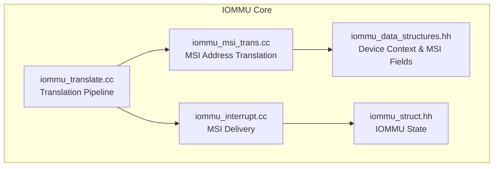
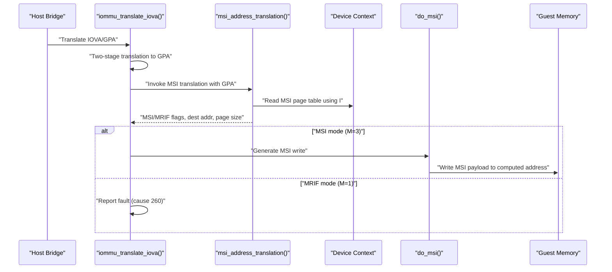
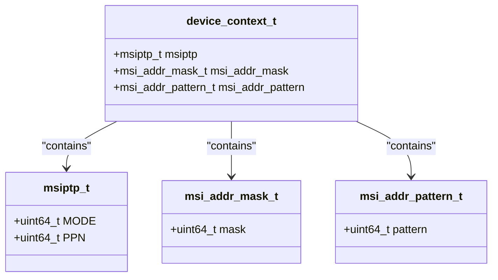
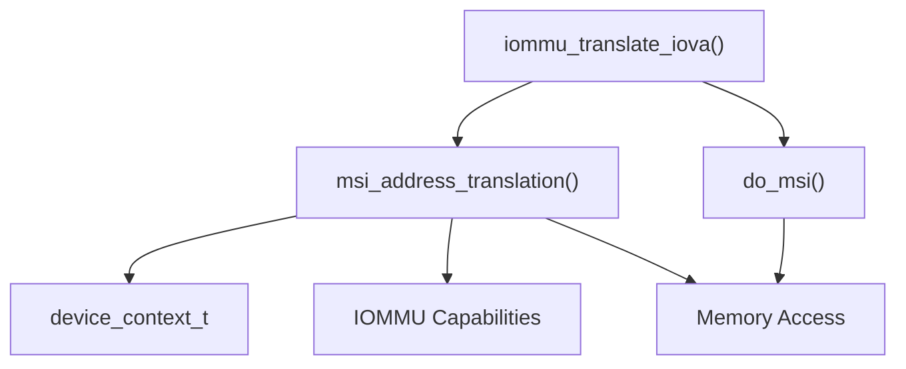

# MSI Address Translation

<cite>
**Referenced Files in This Document**
- [iommu_msi_trans.cc](file://iommu/iommu_msi_trans.cc)
- [iommu_translate.cc](file://iommu/iommu_translate.cc)
- [iommu_interrupt.cc](file://iommu/iommu_interrupt.cc)
- [iommu_data_structures.hh](file://iommu/iommu_data_structures.hh)
- [iommu_struct.hh](file://iommu/iommu_struct.hh)
</cite>

## Table of Contents
1. [Introduction](#introduction)
2. [Project Structure](#project-structure)
3. [Core Components](#core-components)
4. [Architecture Overview](#architecture-overview)
5. [Detailed Component Analysis](#detailed-component-analysis)
6. [Dependency Analysis](#dependency-analysis)
7. [Performance Considerations](#performance-considerations)
8. [Troubleshooting Guide](#troubleshooting-guide)
9. [Conclusion](#conclusion)

## Introduction
This document explains the Message Signaled Interrupt (MSI) address translation functionality in the IOMMU model. It focuses on the msi_address_translation() function, detailing how it distinguishes between MSI and MRIF (Message Request Interrupt Frame) translations, integrates with device contexts, computes destination addresses, and enforces access permissions. It also covers how MSI translation is invoked during the overall translation pipeline, how MRIF mode is handled, and how MSI writes are delivered to guests.

## Project Structure
The MSI translation logic is implemented in a dedicated translation module and integrated into the broader IOMMU translation pipeline. Supporting structures define device context fields used by MSI translation.

**Diagram sources**
- [iommu_translate.cc:1-709](file://iommu/iommu_translate.cc#L1-L709)
- [iommu_msi_trans.cc:1-294](file://iommu/iommu_msi_trans.cc#L1-L294)
- [iommu_interrupt.cc:1-121](file://iommu/iommu_interrupt.cc#L1-L121)
- [iommu_data_structures.hh:260-415](file://iommu/iommu_data_structures.hh#L260-L415)
- [iommu_struct.hh:1-102](file://iommu/iommu_struct.hh#L1-L102)

**Section sources**
- [iommu_translate.cc:1-709](file://iommu/iommu_translate.cc#L1-L709)
- [iommu_msi_trans.cc:1-294](file://iommu/iommu_msi_trans.cc#L1-L294)
- [iommu_interrupt.cc:1-121](file://iommu/iommu_interrupt.cc#L1-L121)
- [iommu_data_structures.hh:260-415](file://iommu/iommu_data_structures.hh#L260-L415)
- [iommu_struct.hh:1-102](file://iommu/iommu_struct.hh#L1-L102)

## Core Components
- msi_address_translation(): Performs MSI-specific address recognition and translation using device context MSI page tables. It determines whether an address belongs to a virtual interrupt file, extracts the interrupt file number, validates MSI PTEs, and computes either a guest physical target address (MSI) or MRIF parameters (MRIF).
- iommu_translate_iova(): Orchestrates the overall translation pipeline. It invokes MSI translation after initial GPA translation and decides whether to continue with guest-stage translation or treat the access as MSI/MRIF.
- do_msi(): Delivers MSI writes to the guest by writing to the computed MSI address with appropriate endianness and reporting faults.
- Device Context (DC): Contains MSI page table pointer (msiptp), MSI address mask (msi_addr_mask), and MSI address pattern (msi_addr_pattern) used to identify MSI writes and select MSI PTEs.

Key responsibilities:
- MSI vs MRIF detection via MSI PTE mode field.
- Interrupt file number extraction from GPA using the MSI address mask.
- MSI PTE validation and error reporting.
- Destination address computation for MSI and MRIF modes.
- Access permission enforcement aligned with second-stage semantics.

**Section sources**
- [iommu_msi_trans.cc:20-294](file://iommu/iommu_msi_trans.cc#L20-L294)
- [iommu_translate.cc:387-440](file://iommu/iommu_translate.cc#L387-L440)
- [iommu_interrupt.cc:7-26](file://iommu/iommu_interrupt.cc#L7-L26)
- [iommu_data_structures.hh:260-335](file://iommu/iommu_data_structures.hh#L260-L335)

## Architecture Overview
The MSI translation sits within the IOMMU translation pipeline. After GPA translation, the pipeline checks if the GPA corresponds to a virtual interrupt file using MSI page tables. Depending on the MSI PTE mode, it either produces a guest physical address for MSI delivery or MRIF parameters for MRIF processing.

**Diagram sources**
- [iommu_translate.cc:387-440](file://iommu/iommu_translate.cc#L387-L440)
- [iommu_msi_trans.cc:20-294](file://iommu/iommu_msi_trans.cc#L20-L294)
- [iommu_interrupt.cc:7-26](file://iommu/iommu_interrupt.cc#L7-L26)

## Detailed Component Analysis

### msi_address_translation() Function
Purpose:
- Recognize MSI writes to virtual interrupt files based on device context MSI address mask/pattern.
- Validate MSI PTEs and compute the destination for MSI or MRIF modes.
- Enforce access permissions equivalent to second-stage PTE semantics.

Parameters:
- Inputs:
  - iommu: IOMMU state pointer.
  - gpa: Guest physical address to evaluate.
  - is_exec: Indicates read-for-execute context requiring permission checks.
  - DC: Device context containing MSI page table pointer and MSI mask/pattern.
  - rcid/mcid: Resource and memory controller IDs for memory access.
- Outputs:
  - is_msi: Set if GPA belongs to a virtual interrupt file.
  - is_mrif: Set if MSI PTE is in MRIF mode.
  - mrif_nid: Destination MRIF notice identifier.
  - dest_mrif_addr: Destination MRIF address.
  - cause: Fault cause code on failure.
  - iotval2: Additional fault information.
  - pa: Computed physical address for MSI.
  - page_sz: Page size used for MSI translation.
  - g_pte: Guest-stage PTE representation for response metadata.
  - check_access_perms: Flag controlling permission checks.

Processing stages:
1. Initialize endianness and masks based on IOMMU capabilities and device context.
2. Check MSI page table pointer mode; if off, exit without MSI handling.
3. Determine if GPA belongs to a virtual interrupt file using MSI address mask/pattern comparison.
4. If not MSI, return to regular translation flow.
5. Extract interrupt file number I from GPA using MSI address mask.
6. Compute MSI page table base m from MSI page table pointer.
7. Load MSI PTE at offset I; validate address and data integrity; enforce PMA/PMP checks.
8. Validate MSI PTE presence and configuration (M field values).
9. If M=3 (Translate/RW):
   - Compute MSI target address as PPN<<12 | GPA[11:0].
   - Set guest PTE metadata for response.
10. If M=1 (MRIF):
    - Validate MRIF capability and reserved fields.
    - Compute destination MRIF address and notice MSI payload (NID).
    - Set MRIF flags and guest PTE metadata.
11. Enforce access permissions equivalent to second-stage semantics; instruction fetch checks.
12. Return success or fault with cause code.

Error handling:
- MSI PTE load access fault (cause 261).
- MSI PT data corruption (cause 270).
- MSI PTE not valid (cause 262).
- MSI PTE misconfigured (cause 263).
- Instruction access fault (cause 1) when executing from MSI region.

**Section sources**
- [iommu_msi_trans.cc:20-294](file://iommu/iommu_msi_trans.cc#L20-L294)

#### Class Diagram: MSI Translation Data Structures

**Diagram sources**
- [iommu_data_structures.hh:260-335](file://iommu/iommu_data_structures.hh#L260-L335)

### Integration with Translation Pipeline
- Invocation:
  - After GPA translation, iommu_translate_iova() calls msi_address_translation().
  - If MSI is detected and in MRIF mode, the pipeline reports a fault (cause 260) because MRIF mode is not permitted for the current transaction type.
  - If MSI is detected in Translate/RW mode, the pipeline skips guest-stage translation and prepares an MSI delivery response.
- Response fields:
  - is_msi and is_mrif flags are propagated to the translation response.
  - dest_mrif_addr and mrif_nid are included for MRIF mode; for MSI mode, pa is set to the MSI target address.

**Section sources**
- [iommu_translate.cc:387-440](file://iommu/iommu_translate.cc#L387-L440)
- [iommu_translate.cc:493-510](file://iommu/iommu_translate.cc#L493-L510)

### MSI Delivery Mechanism
- do_msi():
  - Computes address mask from IOMMU capabilities.
  - Writes 32-bit MSI payload to the computed MSI address using the IOMMU’s memory interface with appropriate endianness.
  - Reports MSI write access faults (cause 273) with iotval set to the MSI address.

**Section sources**
- [iommu_interrupt.cc:7-26](file://iommu/iommu_interrupt.cc#L7-L26)

### MSI vs MRIF Translation Distinction
- MSI (M=3):
  - MSI PTE acts as a leaf entry translating GPA to guest physical address for MSI delivery.
  - Access permissions enforced per second-stage semantics; instruction fetch disallowed.
- MRIF (M=1):
  - MSI PTE specifies a destination MRIF address and a notice MSI NID.
  - MRIF mode is not permitted for the current transaction type; results in a fault (cause 260).

**Section sources**
- [iommu_msi_trans.cc:186-217](file://iommu/iommu_msi_trans.cc#L186-L217)
- [iommu_msi_trans.cc:219-273](file://iommu/iommu_msi_trans.cc#L219-L273)
- [iommu_translate.cc:405-411](file://iommu/iommu_translate.cc#L405-L411)

### Device Context Integration
- MSI recognition:
  - Uses MSI address mask and pattern from the device context to determine if a GPA belongs to a virtual interrupt file.
- MSI page table base:
  - MSI PTEs are indexed by interrupt file number extracted from GPA using the MSI address mask.
- MSI page table pointer:
  - MSI page table pointer (msiptp) provides the base PPN for MSI PTEs.

**Section sources**
- [iommu_msi_trans.cc:76-118](file://iommu/iommu_msi_trans.cc#L76-L118)
- [iommu_data_structures.hh:260-335](file://iommu/iommu_data_structures.hh#L260-L335)

### Destination Address Calculation
- MSI mode (M=3):
  - pa = (MSI PTE.PPN << 12) | (GPA & 0xFFF).
- MRIF mode (M=1):
  - pa = MSI PTE.NPPN << 12 (notice MSI target).
  - dest_mrif_addr = MSI PTE.MRIF_Address[55:9] << 9.
  - mrif_nid = (MSI PTE.N10 << 10) | MSI PTE.N[9:0].

**Section sources**
- [iommu_msi_trans.cc:200-272](file://iommu/iommu_msi_trans.cc#L200-L272)

### Access Permission Checking
- Permission model:
  - MSI translation enforces permissions equivalent to a second-stage PTE with R=W=U=1 and X=0.
  - When checking the U bit, the transaction is treated as non-supervisor privilege.
- Instruction fetch:
  - If is_exec is set and permission checks are enabled, instruction access faults are reported (cause 1).

**Section sources**
- [iommu_msi_trans.cc:274-287](file://iommu/iommu_msi_trans.cc#L274-L287)

### Examples of MSI Translation Scenarios
- MSI Write to Virtual Interrupt File:
  - GPA matches MSI address mask/pattern; MSI PTE M=3; pa computed and MSI payload written to guest memory.
- MRIF Mode Detected:
  - GPA matches MSI address mask/pattern; MSI PTE M=1; pipeline reports fault (cause 260).
- Not an MSI Write:
  - GPA does not match MSI address mask/pattern; translation proceeds to guest-stage translation.

**Section sources**
- [iommu_msi_trans.cc:88-96](file://iommu/iommu_msi_trans.cc#L88-L96)
- [iommu_translate.cc:405-411](file://iommu/iommu_translate.cc#L405-L411)

## Dependency Analysis
- msi_address_translation() depends on:
  - Device context MSI fields (msiptp, msi_addr_mask, msi_addr_pattern).
  - IOMMU capabilities (endianness, MSI_MRIF support).
  - Memory access routines for MSI PTE loads and MSI writes.
- iommu_translate_iova() orchestrates:
  - Calls msi_address_translation() after GPA translation.
  - Propagates is_msi/is_mrif flags and MRIF parameters to the response.
- do_msi() depends on:
  - IOMMU state for endianness and memory controller IDs.
  - Guest memory interface for MSI payload writes.

**Diagram sources**
- [iommu_msi_trans.cc:20-294](file://iommu/iommu_msi_trans.cc#L20-L294)
- [iommu_translate.cc:387-440](file://iommu/iommu_translate.cc#L387-L440)
- [iommu_interrupt.cc:7-26](file://iommu/iommu_interrupt.cc#L7-L26)
- [iommu_data_structures.hh:260-335](file://iommu/iommu_data_structures.hh#L260-L335)

**Section sources**
- [iommu_msi_trans.cc:20-294](file://iommu/iommu_msi_trans.cc#L20-L294)
- [iommu_translate.cc:387-440](file://iommu/iommu_translate.cc#L387-L440)
- [iommu_interrupt.cc:7-26](file://iommu/iommu_interrupt.cc#L7-L26)
- [iommu_data_structures.hh:260-335](file://iommu/iommu_data_structures.hh#L260-L335)

## Performance Considerations
- MSI PTE caching:
  - The IOMMU may cache MSI PTEs in basic translate mode (M=3) but typically does not cache MRIF-mode PTEs, as MRIF processing is considered a cache miss extension.
- IOATC behavior:
  - MSI translations are not cached in the IOATC when is_mrif is set, ensuring MRIF-mode processing remains part of page table walks.
- Endianness handling:
  - Endianness is derived from IOMMU configuration and applied consistently during MSI PTE loads and MSI writes.

[No sources needed since this section provides general guidance]

## Troubleshooting Guide
Common failure modes and causes:
- MSI PTE load access fault (cause 261): MSI PTE address out of bounds or PMA/PMP violation.
- MSI PT data corruption (cause 270): Poisoned data during MSI PTE load.
- MSI PTE not valid (cause 262): MSI PTE.V = 0.
- MSI PTE misconfigured (cause 263): Reserved bits set or invalid M field values.
- Instruction access fault (cause 1): Executing from MSI region with permission checks enabled.
- MSI MRIF not supported (cause 263): MRIF mode encountered but capability disabled.
- Transaction type disallowed (cause 260): MRIF mode detected for current transaction type.

Remediation tips:
- Verify MSI address mask/pattern alignment with device configuration.
- Ensure MSI PTEs are valid and properly configured (M field and reserved bits).
- Confirm MSI_MRIF capability is enabled if MRIF mode is intended.
- Check permission model expectations for instruction fetches.

**Section sources**
- [iommu_msi_trans.cc:127-173](file://iommu/iommu_msi_trans.cc#L127-L173)
- [iommu_msi_trans.cc:175-200](file://iommu/iommu_msi_trans.cc#L175-L200)
- [iommu_msi_trans.cc:223-240](file://iommu/iommu_msi_trans.cc#L223-L240)
- [iommu_msi_trans.cc:274-287](file://iommu/iommu_msi_trans.cc#L274-L287)
- [iommu_translate.cc:405-411](file://iommu/iommu_translate.cc#L405-L411)

## Conclusion
The MSI address translation subsystem provides precise recognition of MSI writes to virtual interrupt files using device context fields, robust validation of MSI PTEs, and clear differentiation between MSI and MRIF modes. It integrates tightly with the translation pipeline, enforcing access permissions equivalent to second-stage PTE semantics and delivering MSI writes to the guest with proper error reporting. Understanding the MSI PTE mode, MRIF capability checks, and permission model is essential for correct operation and troubleshooting.