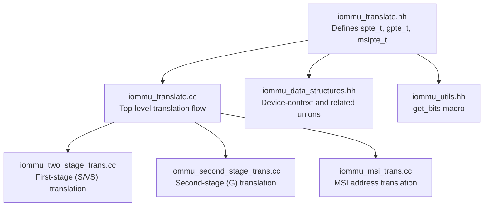
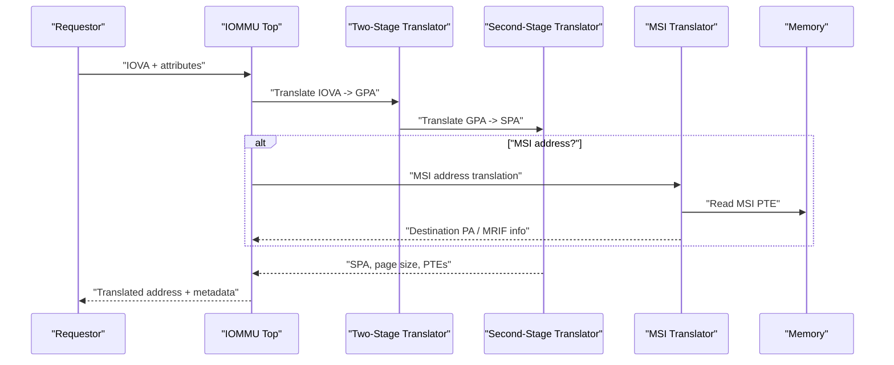
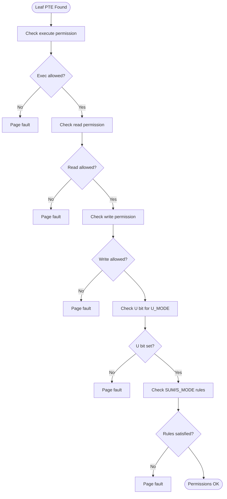
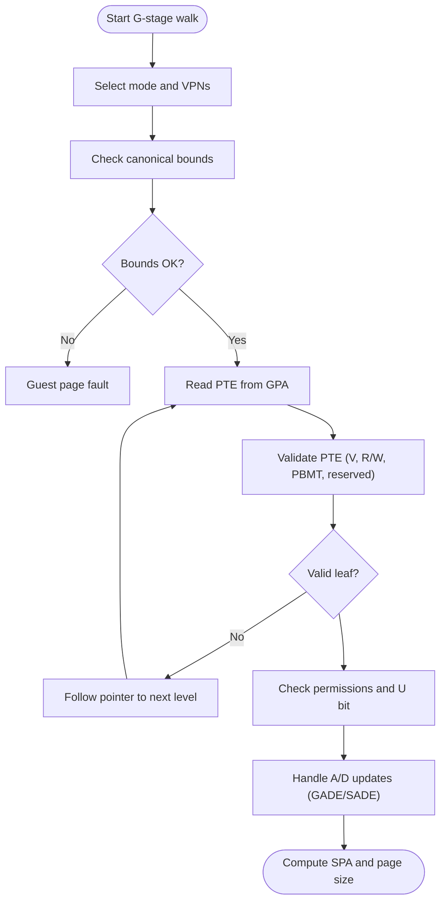
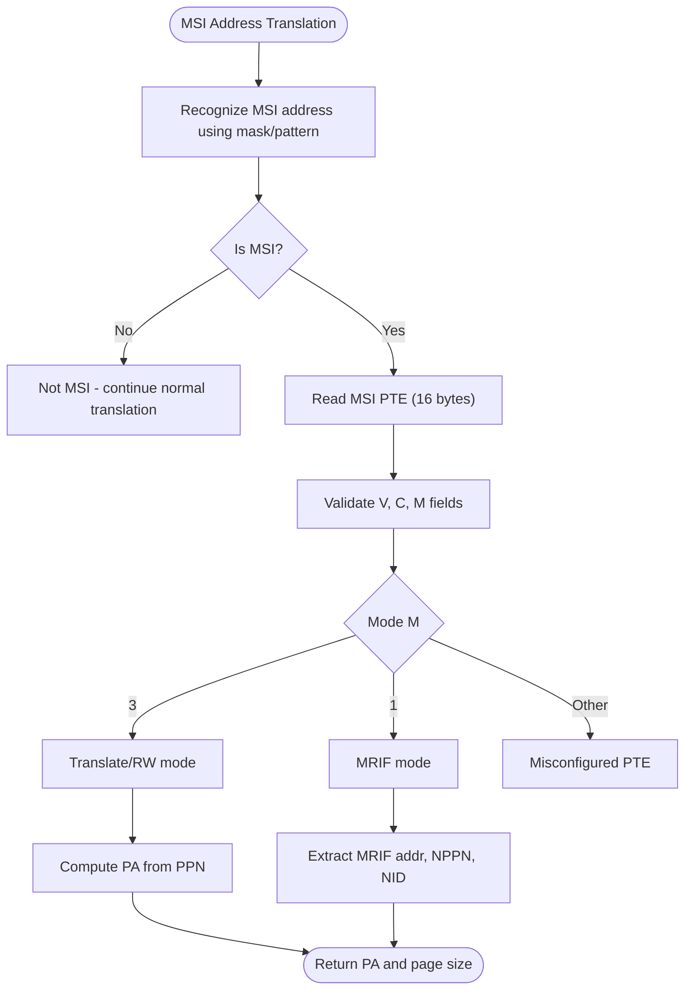
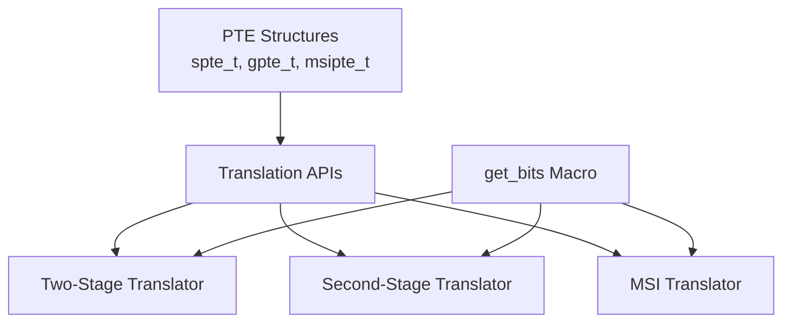

# Page Table Structures and Data Types

<cite>
**Referenced Files in This Document**
- [iommu_translate.hh](file://iommu/iommu_translate.hh)
- [iommu_translate.cc](file://iommu/iommu_translate.cc)
- [iommu_second_stage_trans.cc](file://iommu/iommu_second_stage_trans.cc)
- [iommu_two_stage_trans.cc](file://iommu/iommu_two_stage_trans.cc)
- [iommu_msi_trans.cc](file://iommu/iommu_msi_trans.cc)
- [iommu_data_structures.hh](file://iommu/iommu_data_structures.hh)
- [iommu_utils.hh](file://iommu/iommu_utils.hh)
</cite>

## Table of Contents
1. [Introduction](#introduction)
2. [Project Structure](#project-structure)
3. [Core Components](#core-components)
4. [Architecture Overview](#architecture-overview)
5. [Detailed Component Analysis](#detailed-component-analysis)
6. [Dependency Analysis](#dependency-analysis)
7. [Performance Considerations](#performance-considerations)
8. [Troubleshooting Guide](#troubleshooting-guide)
9. [Conclusion](#conclusion)

## Introduction
This document explains the page table data structures and unions used in address translation within the IOMMU subsystem. It focuses on:
- Stage 1 PTE (spte_t) and Stage 2 PTE (gpte_t) structures, including bit-field semantics for validity, permissions, user/supervisor access, global mappings, access/dirty bits, relocation fields, physical page number, page-based memory type, and native bit.
- MSI translation structures (msipte_t) covering MRIF address fields, notice identifiers, and notice page number fields.
- Union design patterns for raw data access and bit manipulation utilities.
- Practical examples of PTE parsing, permission checking, and structure initialization procedures.

## Project Structure
The relevant components are organized across header and implementation files:
- Header declarations define the PTE structures and translation APIs.
- Implementation files contain the two-stage translation, second-stage translation, and MSI translation logic.
- Utility macros provide bit extraction helpers.

**Diagram sources**
- [iommu_translate.hh:17-92](file://iommu/iommu_translate.hh#L17-L92)
- [iommu_translate.cc:8-709](file://iommu/iommu_translate.cc#L8-L709)
- [iommu_two_stage_trans.cc:8-600](file://iommu/iommu_two_stage_trans.cc#L8-L600)
- [iommu_second_stage_trans.cc:7-424](file://iommu/iommu_second_stage_trans.cc#L7-L424)
- [iommu_msi_trans.cc:19-294](file://iommu/iommu_msi_trans.cc#L19-L294)
- [iommu_data_structures.hh:324-415](file://iommu/iommu_data_structures.hh#L324-L415)
- [iommu_utils.hh:7-8](file://iommu/iommu_utils.hh#L7-L8)

**Section sources**
- [iommu_translate.hh:17-92](file://iommu/iommu_translate.hh#L17-L92)
- [iommu_translate.cc:8-709](file://iommu/iommu_translate.cc#L8-L709)

## Core Components
This section documents the primary PTE structures and their bit-field definitions.

- spte_t (Stage 1 PTE):
  - V: Valid bit indicating PTE presence.
  - R/W/X: Read, Write, Execute permissions.
  - U: User privilege bit.
  - G: Global mapping indicator.
  - A: Accessed bit.
  - D: Dirty bit.
  - RSW: Relocation field for software use.
  - PPN: Physical Page Number (44-bit).
  - PBMT: Page-Based Memory Type (2-bit).
  - N: Native bit for NAPOT encoding.
  - raw: 64-bit raw representation enabling direct memory reads/writes.

- gpte_t (Stage 2 PTE):
  - Identical bit layout to spte_t, used for G-stage translation.
  - Used to resolve final SPA and memory type during second-stage translation.

- msipte_t (MSI PTE):
  - V: Valid bit.
  - M: Mode field selecting translation behavior:
    - 3: Translate/RW mode (basic translation).
    - 1: MRIF mode (virtual interrupt file).
    - 0, 2: Reserved/misconfigured.
  - C: Custom bit (implementation-defined; reference model treats as misconfiguration).
  - upperQW: Upper 64 bits (for MRIF mode).
  - translate_rw sub-union:
    - PPN: Translated page number for Translate/RW mode.
    - Other reserved fields.
  - mrif sub-union:
    - MRIF_ADDR_55_9: MRIF base address bits [55:9].
    - N90: Notice identifier lower 10 bits.
    - NPPN: Notice page number.
    - N10: Notice identifier upper 1 bit.
    - Other reserved fields.
  - raw[2]: 128-bit raw representation for MRIF mode reads.

Key union design patterns:
- Bit-field structs provide structured access to PTE fields.
- raw fields enable direct memory reads/writes and bitwise manipulation.
- Sub-unions (translate_rw, mrif) expose mode-specific fields while sharing the same underlying storage.

**Section sources**
- [iommu_translate.hh:23-60](file://iommu/iommu_translate.hh#L23-L60)
- [iommu_translate.hh:61-92](file://iommu/iommu_translate.hh#L61-L92)

## Architecture Overview
The translation pipeline integrates first-stage (S/VS), second-stage (G), and MSI translation paths.

**Diagram sources**
- [iommu_translate.cc:8-709](file://iommu/iommu_translate.cc#L8-L709)
- [iommu_two_stage_trans.cc:8-600](file://iommu/iommu_two_stage_trans.cc#L8-L600)
- [iommu_second_stage_trans.cc:7-424](file://iommu/iommu_second_stage_trans.cc#L7-L424)
- [iommu_msi_trans.cc:19-294](file://iommu/iommu_msi_trans.cc#L19-L294)

## Detailed Component Analysis

### Stage 1 PTE (spte_t) and Permission Checking
- Bit-field semantics:
  - V, R, W, X, U, G, A, D, RSW, PPN, PBMT, N mirror the RISC-V PTE specification.
- Permission checks:
  - Execute/read/write permission checks enforce requested access.
  - User privilege (U_MODE) requires U bit set in PTE.
  - Supervisor privilege (S_MODE) with ENS/SUM rules enforced.
- A/D bit handling:
  - SADE enables atomic A/D updates; otherwise, missing A/D triggers faults.
  - For implicit accesses (e.g., PTE address translation), G-stage write permission is required for D-bit updates.

**Diagram sources**
- [iommu_two_stage_trans.cc:308-366](file://iommu/iommu_two_stage_trans.cc#L308-L366)

**Section sources**
- [iommu_two_stage_trans.cc:308-366](file://iommu/iommu_two_stage_trans.cc#L308-L366)

### Stage 2 PTE (gpte_t) and G-stage Translation
- Bit-field semantics identical to spte_t.
- Canonical address checks and mode-dependent VPN extraction.
- NAPOT encoding validation and page size computation for superpages.
- A/D bit atomic updates using AMO read-modify-write with G-stage write permission.

**Diagram sources**
- [iommu_second_stage_trans.cc:77-424](file://iommu/iommu_second_stage_trans.cc#L77-L424)

**Section sources**
- [iommu_second_stage_trans.cc:77-424](file://iommu/iommu_second_stage_trans.cc#L77-L424)

### MSI Translation (msipte_t)
- Address recognition:
  - Uses device-context MSI mask/pattern and MGPAW to detect virtual interrupt file access.
- Translate/RW mode (M=3):
  - Reads 16-byte MSI PTE, validates V/C/M fields, computes translated PA.
- MRIF mode (M=1):
  - Extracts MRIF base address, notice page number, and notice identifier.
  - Produces MRIF destination and notice MSI payload.

**Diagram sources**
- [iommu_msi_trans.cc:19-294](file://iommu/iommu_msi_trans.cc#L19-L294)

**Section sources**
- [iommu_msi_trans.cc:19-294](file://iommu/iommu_msi_trans.cc#L19-L294)

### Union Design Patterns and Raw Access
- Structured access:
  - Bit-fields provide readable semantics (e.g., V, R, W, X, U, G, A, D, RSW, PPN, PBMT, N).
- Raw access:
  - raw fields enable direct memory reads/writes for PTEs and MSI PTEs.
  - For msipte_t, raw[2] accommodates MRIF 128-bit representation.
- Sub-unions:
  - translate_rw exposes PPN for Translate/RW mode.
  - mrif exposes MRIF_ADDR_55_9, N90, NPPN, N10 for MRIF mode.

Practical usage patterns:
- Initialize PTEs to zero, then set V and permission bits.
- Use raw to read/write PTEs directly from memory.
- Use sub-unions to access mode-specific fields safely.

**Section sources**
- [iommu_translate.hh:23-92](file://iommu/iommu_translate.hh#L23-L92)

### Bit Manipulation Utilities
- get_bits macro:
  - Extracts a range of bits from a field using shift-and-mask arithmetic.
  - Used extensively to derive VPN indices and PPN fields from PTEs and addresses.

Example usage locations:
- Deriving VPN indices for S/VS and G-stage walks.
- Extracting PPN fields from PTE bitfields.

**Section sources**
- [iommu_utils.hh:7-8](file://iommu/iommu_utils.hh#L7-L8)
- [iommu_two_stage_trans.cc:87-139](file://iommu/iommu_two_stage_trans.cc#L87-L139)
- [iommu_second_stage_trans.cc:80-113](file://iommu/iommu_second_stage_trans.cc#L80-L113)

## Dependency Analysis
The translation logic depends on:
- PTE structures (spte_t, gpte_t, msipte_t) for representing page table entries.
- Translation APIs for two-stage and second-stage walks.
- MSI translation routines for virtual interrupt file handling.
- Utility macros for bit extraction.

**Diagram sources**
- [iommu_translate.hh:95-131](file://iommu/iommu_translate.hh#L95-L131)
- [iommu_translate.cc:95-130](file://iommu/iommu_translate.cc#L95-L130)
- [iommu_utils.hh:7-8](file://iommu/iommu_utils.hh#L7-L8)

**Section sources**
- [iommu_translate.hh:95-131](file://iommu/iommu_translate.hh#L95-L131)
- [iommu_translate.cc:95-130](file://iommu/iommu_translate.cc#L95-L130)
- [iommu_utils.hh:7-8](file://iommu/iommu_utils.hh#L7-L8)

## Performance Considerations
- PTE size and alignment:
  - First-stage PTEs are 64-bit; G-stage PTEs are 64-bit; MSI PTEs are 16 bytes for Translate/RW mode and 128 bits for MRIF mode.
- NAPOT encoding:
  - Improves cache locality and reduces TLB pressure for contiguous regions.
- Atomic A/D updates:
  - AMO-based updates minimize contention and ensure correctness under concurrent access.
- Endianness:
  - Respect fctl.BE to avoid unnecessary conversions and improve performance.

## Troubleshooting Guide
Common issues and indicators:
- Page faults:
  - Occur when V=0, reserved bits set, misaligned superpages, or permission violations.
  - Causes distinguish instruction, read, or write page faults.
- Access faults:
  - Occur on PMA/PMP violations or out-of-range physical addresses.
- Data corruption:
  - Detected during PTE reads/writes; indicates poisoned memory or incorrect PTEs.
- MSI misconfiguration:
  - Invalid M/C/V fields or unsupported MRIF mode lead to misconfigured PTE faults.

Diagnostic hints:
- Inspect cause codes and iotval2 for guest-page-fault details.
- Verify SXL/GXL constraints and canonical address checks.
- Confirm SADE/GADE settings for A/D updates.

**Section sources**
- [iommu_two_stage_trans.cc:504-598](file://iommu/iommu_two_stage_trans.cc#L504-L598)
- [iommu_second_stage_trans.cc:174-191](file://iommu/iommu_second_stage_trans.cc#L174-L191)
- [iommu_msi_trans.cc:136-184](file://iommu/iommu_msi_trans.cc#L136-L184)

## Conclusion
The IOMMU’s address translation relies on well-defined PTE structures with union-based designs enabling both structured and raw access. The spte_t and gpte_t structures encapsulate stage-specific semantics, while msipte_t supports both basic translation and MRIF modes. Robust permission checks, canonical address validation, and atomic A/D updates ensure correctness and performance. The provided APIs and utilities offer a clear path for parsing PTEs, validating permissions, and initializing structures for translation.