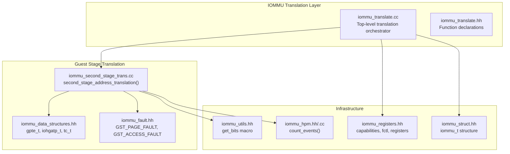
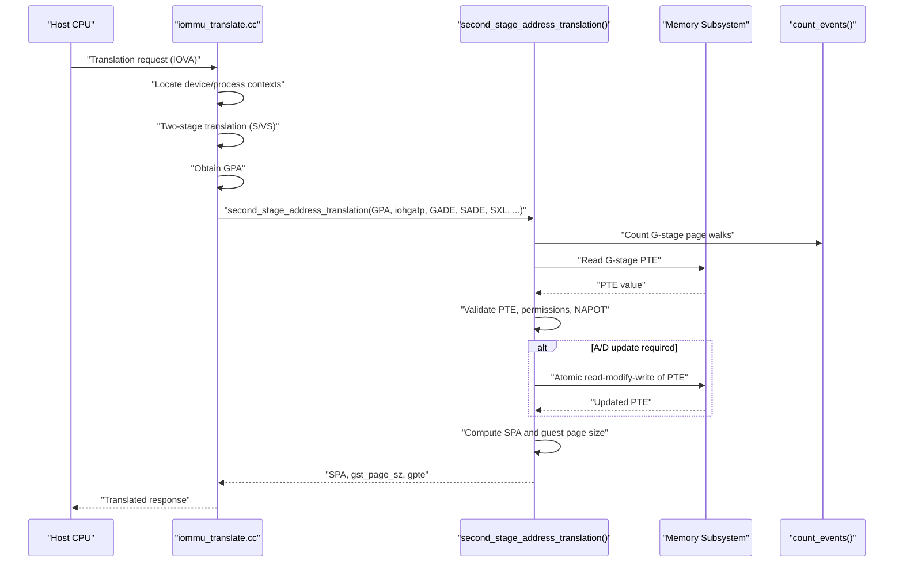
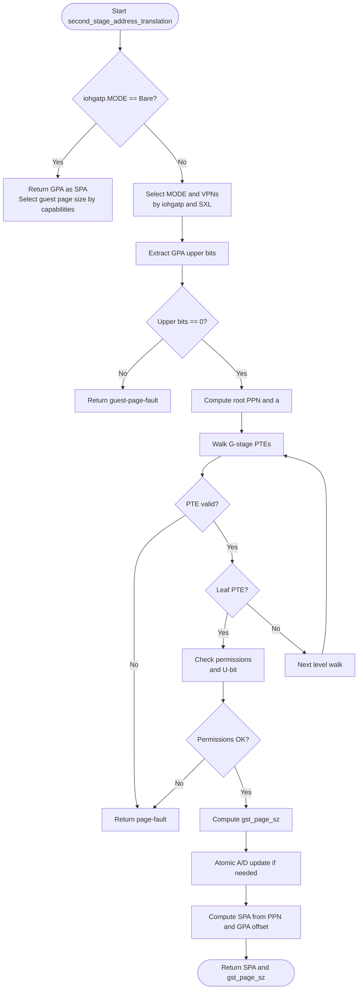
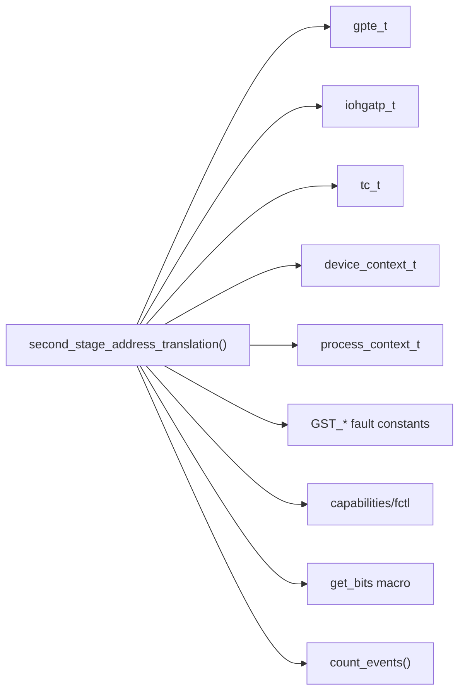

# Second Stage Translation

<cite>
**Referenced Files in This Document**
- [iommu_second_stage_trans.cc](file://iommu/iommu_second_stage_trans.cc)
- [iommu_translate.cc](file://iommu/iommu_translate.cc)
- [iommu_translate.hh](file://iommu/iommu_translate.hh)
- [iommu_data_structures.hh](file://iommu/iommu_data_structures.hh)
- [iommu_fault.hh](file://iommu/iommu_fault.hh)
- [iommu_registers.hh](file://iommu/iommu_registers.hh)
- [iommu_utils.hh](file://iommu/iommu_utils.hh)
- [iommu_hpm.hh](file://iommu/iommu_hpm.hh)
- [iommu_hpm.cc](file://iommu/iommu_hpm.cc)
- [iommu_struct.hh](file://iommu/iommu_struct.hh)
</cite>

## Table of Contents
1. [Introduction](#introduction)
2. [Project Structure](#project-structure)
3. [Core Components](#core-components)
4. [Architecture Overview](#architecture-overview)
5. [Detailed Component Analysis](#detailed-component-analysis)
6. [Dependency Analysis](#dependency-analysis)
7. [Performance Considerations](#performance-considerations)
8. [Troubleshooting Guide](#troubleshooting-guide)
9. [Conclusion](#conclusion)

## Introduction
This document provides comprehensive documentation for the second stage translation process that translates guest physical addresses (GPA) to supervisor physical addresses (SPA) within the IOMMU. It focuses on the second_stage_address_translation() function, detailing its parameters, the guest stage translation algorithm, GPA validation procedures, integration with hypervisor contexts, and performance characteristics. It also explains the gpte_t structure usage, access permission checking, and fault handling mechanisms.

## Project Structure
The second stage translation resides in the IOMMU subsystem and integrates with higher-level translation orchestration and lower-level memory access utilities.

**Diagram sources**
- [iommu_translate.cc:1-709](file://iommu/iommu_translate.cc#L1-L709)
- [iommu_second_stage_trans.cc:1-424](file://iommu/iommu_second_stage_trans.cc#L1-L424)
- [iommu_translate.hh:1-132](file://iommu/iommu_translate.hh#L1-L132)
- [iommu_data_structures.hh:1-415](file://iommu/iommu_data_structures.hh#L1-L415)
- [iommu_fault.hh:1-90](file://iommu/iommu_fault.hh#L1-L90)
- [iommu_registers.hh:1-987](file://iommu/iommu_registers.hh#L1-L987)
- [iommu_utils.hh:1-11](file://iommu/iommu_utils.hh#L1-L11)
- [iommu_hpm.hh:1-44](file://iommu/iommu_hpm.hh#L1-L44)
- [iommu_hpm.cc:25-36](file://iommu/iommu_hpm.cc#L25-L36)
- [iommu_struct.hh:1-102](file://iommu/iommu_struct.hh#L1-L102)

**Section sources**
- [iommu_translate.cc:1-709](file://iommu/iommu_translate.cc#L1-L709)
- [iommu_second_stage_trans.cc:1-424](file://iommu/iommu_second_stage_trans.cc#L1-L424)
- [iommu_translate.hh:1-132](file://iommu/iommu_translate.hh#L1-L132)
- [iommu_data_structures.hh:1-415](file://iommu/iommu_data_structures.hh#L1-L415)
- [iommu_fault.hh:1-90](file://iommu/iommu_fault.hh#L1-L90)
- [iommu_registers.hh:1-987](file://iommu/iommu_registers.hh#L1-L987)
- [iommu_utils.hh:1-11](file://iommu/iommu_utils.hh#L1-L11)
- [iommu_hpm.hh:1-44](file://iommu/iommu_hpm.hh#L1-L44)
- [iommu_hpm.cc:25-36](file://iommu/iommu_hpm.cc#L25-L36)
- [iommu_struct.hh:1-102](file://iommu/iommu_struct.hh#L1-L102)

## Core Components
- second_stage_address_translation(): Implements the guest stage translation algorithm, validates GPA, checks access permissions, handles A/D bit updates, computes SPA, and manages NAPOT PTE semantics.
- gpte_t: Guest-stage page table entry structure containing V, R, W, X, U, G, A, D, PPN, PBMT, N, and reserved fields.
- iohgatp_t: Guest-stage translation control register holding MODE, GSCID, and PPN.
- tc_t: Device context translation control fields including GADE, SADE, SXL, T2GPA, EN_ATS, etc.
- Fault handling: GST_PAGE_FAULT, GST_ACCESS_FAULT, and GST_DATA_CORRUPTION constants.
- Performance monitoring: count_events() for G-stage page table walks and other translation events.

**Section sources**
- [iommu_second_stage_trans.cc:7-424](file://iommu/iommu_second_stage_trans.cc#L7-L424)
- [iommu_translate.hh:42-60](file://iommu/iommu_translate.hh#L42-L60)
- [iommu_data_structures.hh:139-156](file://iommu/iommu_data_structures.hh#L139-L156)
- [iommu_fault.hh:81-83](file://iommu/iommu_fault.hh#L81-L83)
- [iommu_hpm.hh:42-43](file://iommu/iommu_hpm.hh#L42-L43)

## Architecture Overview
The second stage translation is invoked after the first stage (S/VS) translation produces a GPA. The second stage converts GPA to SPA using the guest-stage page tables controlled by iohgatp. It enforces guest-stage permissions, updates A/D bits atomically when permitted, and returns the translated SPA along with the guest-stage page size.

**Diagram sources**
- [iommu_translate.cc:428-438](file://iommu/iommu_translate.cc#L428-L438)
- [iommu_second_stage_trans.cc:139-422](file://iommu/iommu_second_stage_trans.cc#L139-L422)
- [iommu_hpm.hh:42-43](file://iommu/iommu_hpm.hh#L42-L43)

## Detailed Component Analysis

### second_stage_address_translation() Function
The function performs the guest stage translation algorithm with the following key steps:
- Parameter handling: Inputs include GPA, check_access_perms, DID, is_read/is_write/is_exec/is_implicit, PV/PID/PSCV/PSCID, GV/GSCID, iohgatp, GADE, SADE, SXL, plus output pointers for pa, gst_page_sz, gpte, rcid, mcid.
- Bare mode handling: If iohgatp.MODE == Bare, returns GPA as SPA with appropriate guest page size selection based on capabilities.
- GPA validity: Determines VPNs based on iohgatp.MODE and SXL, extracts upper bits, and validates that GPA upper bits are zero (or returns guest-page-fault).
- Page table walk: Reads PTEs from guest physical addresses derived from iohgatp.PPN and VPNs, with endianness derived from fctl.be.
- PTE validation: Checks V bit, reserved fields, PBMT, and leaf/non-leaf constraints; rejects invalid encodings.
- Permission checking: Enforces R/W/X/U permissions based on access type and check_access_perms; U-bit requirement enforced for guest stage.
- Superpage handling: Computes gst_page_sz based on PTE fields and validates misaligned superpages.
- A/D bit atomic updates: Uses AMO read-modify-write to update A/D bits when GADE is enabled; retries on PTE change.
- NAPOT PTE handling: Updates PPN for NAPOT entries to reflect the actual VPN.
- SPA computation: Constructs SPA from PPN and GPA offset, applying the computed gst_page_sz.

Key parameters and their impact:
- check_access_perms: Controls whether permission checks are enforced during translation.
- iohgatp: Selects guest-stage translation mode and provides root PPN and GSCID.
- GADE/SADE: Control whether A/D bit updates are permitted via atomic operations.
- SXL: Limits GPA address width for guest-stage translation.
- is_implicit: Indicates implicit walks for A/D updates; affects D-bit setting logic.
- PSCV/PSCID/GV/GSCID: Soft-context identifiers for translation fences and event counting.
- rcid/mcid: QoS IDs used for IOMMU-initiated memory accesses.

**Section sources**
- [iommu_second_stage_trans.cc:8-424](file://iommu/iommu_second_stage_trans.cc#L8-L424)
- [iommu_translate.cc:428-438](file://iommu/iommu_translate.cc#L428-L438)
- [iommu_data_structures.hh:139-156](file://iommu/iommu_data_structures.hh#L139-L156)
- [iommu_fault.hh:81-83](file://iommu/iommu_fault.hh#L81-L83)

### Guest Stage Translation Algorithm
The algorithm follows a deterministic walk through guest-stage page tables:
- Determine MODE and VPNs from iohgatp and SXL.
- Validate GPA upper bits and root alignment.
- Read PTE at a | vpn[i]*PTESIZE, validate and branch to leaf or next level.
- On leaf: enforce permissions and compute guest page size.
- On non-leaf: validate reserved fields and continue walk.
- Atomic A/D updates when required and permitted.
- Construct SPA and return.

**Diagram sources**
- [iommu_second_stage_trans.cc:34-124](file://iommu/iommu_second_stage_trans.cc#L34-L124)
- [iommu_second_stage_trans.cc:139-255](file://iommu/iommu_second_stage_trans.cc#L139-L255)
- [iommu_second_stage_trans.cc:257-422](file://iommu/iommu_second_stage_trans.cc#L257-L422)

### gpte_t Structure Usage
The gpte_t structure encapsulates guest-stage PTE fields:
- V: Valid bit
- R/W/X: Read/Write/Execute permissions
- U: User privilege bit
- G/A/D: Global, Accessed, Dirty
- PPN: Physical page number
- PBMT: Page-based memory type
- N: NAPOT encoding indicator
- Reserved and rsw60t59b: Reserved fields

Access permission checking:
- Permissions are checked against is_read/is_write/is_exec when check_access_perms is true.
- U-bit must be set for guest-stage access.
- Execute-only translations are not permitted for PCIe ATS; read permission is required for execute.

**Section sources**
- [iommu_translate.hh:42-60](file://iommu/iommu_translate.hh#L42-L60)
- [iommu_second_stage_trans.cc:278-283](file://iommu/iommu_second_stage_trans.cc#L278-L283)

### Integration with Hypervisor Contexts
- iohgatp_t: Provides guest-stage translation control, including MODE, GSCID, and root PPN.
- tc_t: Device context translation control includes GADE, SADE, SXL, T2GPA, EN_ATS, etc.
- PSCV/PSCID/GV/GSCID: Soft-context identifiers used for translation fences and event counting.
- QoS IDs: rcid/mcid embedded in device context attributes are propagated for IOMMU-initiated memory accesses.

**Section sources**
- [iommu_data_structures.hh:139-156](file://iommu/iommu_data_structures.hh#L139-L156)
- [iommu_data_structures.hh:132-130](file://iommu/iommu_data_structures.hh#L132-L130)
- [iommu_translate.cc:428-438](file://iommu/iommu_translate.cc#L428-L438)

### GPA Validation Procedures
- MODE-dependent VPN extraction and LEVELS determination.
- SXL enforcement: Limits GPA address width for guest-stage translation.
- Root PPN alignment check: Root must be 16 KiB aligned; otherwise PTE access is unspecified.
- Upper bits validation: GPA upper bits must be zero; otherwise guest-page-fault.

**Section sources**
- [iommu_second_stage_trans.cc:80-124](file://iommu/iommu_second_stage_trans.cc#L80-L124)
- [iommu_second_stage_trans.cc:133-154](file://iommu/iommu_second_stage_trans.cc#L133-L154)

### Access Permission Checking
- Permission bits R/W/X are checked against requested access type when check_access_perms is true.
- U-bit must be set for guest-stage access.
- Execute-only permission is not permitted for PCIe ATS translation requests; read permission is required for execute.

**Section sources**
- [iommu_second_stage_trans.cc:278-283](file://iommu/iommu_second_stage_trans.cc#L278-L283)
- [iommu_translate.cc:510-590](file://iommu/iommu_translate.cc#L510-L590)

### A/D Bit Atomic Updates
- When A/D bits are not set and GADE is enabled, the function performs an atomic read-modify-write to set A and D bits.
- Retry logic: If PTE changed during AMO, restart the walk from step 2.
- D-bit setting for implicit walks depends on write permission and SADE.

**Section sources**
- [iommu_second_stage_trans.cc:367-396](file://iommu/iommu_second_stage_trans.cc#L367-L396)

### gst_page_sz Calculation
- Starts with base page size; multiplied by 512 for each level of superpage coverage.
- Validates misaligned superpages by checking that PPN fields for higher levels are zero.
- Special handling for Sv32x4 with 4 MiB pages when applicable.

**Section sources**
- [iommu_second_stage_trans.cc:311-327](file://iommu/iommu_second_stage_trans.cc#L311-L327)

### Fault Handling During Guest Translation
- GST_PAGE_FAULT: Raised for invalid PTEs, misaligned superpages, permission violations, or upper bits violation.
- GST_ACCESS_FAULT: Raised for PTE read access faults or physical address access faults.
- GST_DATA_CORRUPTION: Raised for PTE read data corruption.
- Translation failure paths return to the caller with appropriate causes for ATS and non-ATS scenarios.

**Section sources**
- [iommu_second_stage_trans.cc:161-172](file://iommu/iommu_second_stage_trans.cc#L161-L172)
- [iommu_second_stage_trans.cc:181-191](file://iommu/iommu_second_stage_trans.cc#L181-L191)
- [iommu_translate.cc:605-630](file://iommu/iommu_translate.cc#L605-L630)

### Example Scenarios
- Bare guest-stage: GPA equals SPA; guest page size selected by capabilities.
- Sv39x4 guest-stage: 3-level walk; guest page size up to 512 GiB depending on PTE fields.
- NAPOT PTE: PPN updated to reflect actual VPN; cache entries created accordingly.
- ATS translation request: Success response with denied permissions reflected in response fields; no fault recorded.

**Section sources**
- [iommu_second_stage_trans.cc:34-75](file://iommu/iommu_second_stage_trans.cc#L34-L75)
- [iommu_second_stage_trans.cc:87-113](file://iommu/iommu_second_stage_trans.cc#L87-L113)
- [iommu_translate.cc:510-590](file://iommu/iommu_translate.cc#L510-L590)

## Dependency Analysis
The second stage translation depends on:
- Data structures: gpte_t, iohgatp_t, tc_t, device_context_t, process_context_t.
- Fault constants: GST_PAGE_FAULT, GST_ACCESS_FAULT, GST_DATA_CORRUPTION.
- Infrastructure: register file (capabilities, fctl), memory access helpers, performance counters.

**Diagram sources**
- [iommu_second_stage_trans.cc:1-424](file://iommu/iommu_second_stage_trans.cc#L1-L424)
- [iommu_translate.hh:42-60](file://iommu/iommu_translate.hh#L42-L60)
- [iommu_data_structures.hh:139-156](file://iommu/iommu_data_structures.hh#L139-L156)
- [iommu_fault.hh:81-83](file://iommu/iommu_fault.hh#L81-L83)
- [iommu_registers.hh:185-271](file://iommu/iommu_registers.hh#L185-L271)
- [iommu_utils.hh:7-8](file://iommu/iommu_utils.hh#L7-L8)
- [iommu_hpm.hh:42-43](file://iommu/iommu_hpm.hh#L42-L43)

**Section sources**
- [iommu_second_stage_trans.cc:1-424](file://iommu/iommu_second_stage_trans.cc#L1-L424)
- [iommu_translate.hh:42-60](file://iommu/iommu_translate.hh#L42-L60)
- [iommu_data_structures.hh:139-156](file://iommu/iommu_data_structures.hh#L139-L156)
- [iommu_fault.hh:81-83](file://iommu/iommu_fault.hh#L81-L83)
- [iommu_registers.hh:185-271](file://iommu/iommu_registers.hh#L185-L271)
- [iommu_utils.hh:7-8](file://iommu/iommu_utils.hh#L7-L8)
- [iommu_hpm.hh:42-43](file://iommu/iommu_hpm.hh#L42-L43)

## Performance Considerations
- Event counting: G-stage page walks are counted via count_events(), enabling performance monitoring and diagnostics.
- Endianness: PTE access endianness is derived from fctl.be; consistent endianness reduces misreads.
- Atomic updates: GADE enables efficient A/D updates without repeated walks; fallback to page faults when disabled.
- Cache-friendly superpages: Larger gst_page_sz reduces TLB pressure and improves translation throughput.
- Early validation: GPA upper bits and root alignment checks prevent unnecessary memory accesses.

[No sources needed since this section provides general guidance]

## Troubleshooting Guide
Common issues and resolutions:
- Guest-page-fault: Verify iohgatp.MODE and SXL settings; ensure GPA upper bits are zero; confirm root PPN alignment.
- Access-fault: Check PMA/PMP constraints; ensure physical address access is within capabilities.pas bounds.
- Data corruption: Validate memory integrity; retry translation; check for concurrent modifications.
- Permission failures: Confirm R/W/X/U bits in guest PTEs match requested access; ensure U-bit is set for guest-stage.
- ATS translation denials: Review response fields Priv/N/CXL_IO/AMA; note that execute-only is not permitted for ATS.

**Section sources**
- [iommu_second_stage_trans.cc:124-154](file://iommu/iommu_second_stage_trans.cc#L124-L154)
- [iommu_translate.cc:605-630](file://iommu/iommu_translate.cc#L605-L630)
- [iommu_translate.cc:510-590](file://iommu/iommu_translate.cc#L510-L590)

## Conclusion
The second stage translation process provides robust guest physical address translation with strict validation, permission enforcement, and atomic A/D updates. Its integration with hypervisor contexts and performance monitoring enables efficient and secure translation for virtualized environments. Proper configuration of iohgatp, GADE, SADE, and SXL ensures optimal behavior across different guest-stage translation modes.