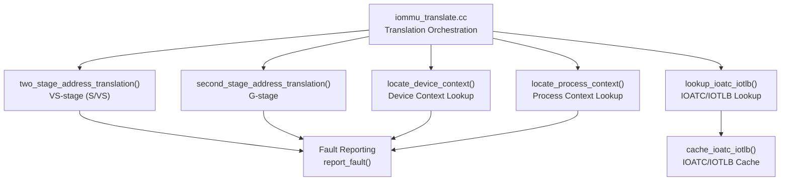
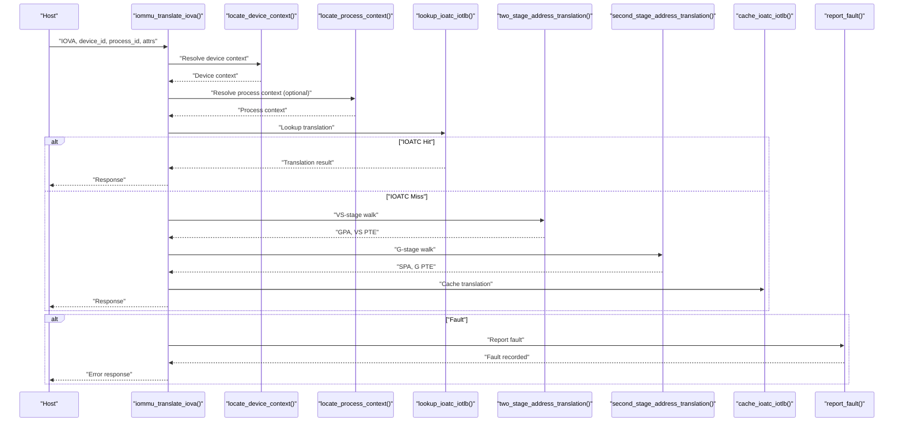
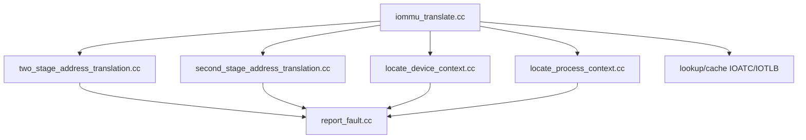

# Two-Stage Translation Process

<cite>
**Referenced Files in This Document**
- [iommu_translate.cc](file://iommu/iommu_translate.cc)
- [iommu_translate.hh](file://iommu/iommu_translate.hh)
- [iommu_two_stage_trans.cc](file://iommu/iommu_two_stage_trans.cc)
- [iommu_second_stage_trans.cc](file://iommu/iommu_second_stage_trans.cc)
- [iommu_device_context.cc](file://iommu/iommu_device_context.cc)
- [iommu_process_context.cc](file://iommu/iommu_process_context.cc)
- [iommu_atc.cc](file://iommu/iommu_atc.cc)
- [iommu_faults.cc](file://iommu/iommu_faults.cc)
- [iommu_fault.hh](file://iommu/iommu_fault.hh)
- [iommu_struct.hh](file://iommu/iommu_struct.hh)
- [iommu_data_structures.hh](file://iommu/iommu_data_structures.hh)
- [iommu_utils.cc](file://iommu/iommu_utils.cc)
</cite>

## Table of Contents
1. [Introduction](#introduction)
2. [Project Structure](#project-structure)
3. [Core Components](#core-components)
4. [Architecture Overview](#architecture-overview)
5. [Detailed Component Analysis](#detailed-component-analysis)
6. [Dependency Analysis](#dependency-analysis)
7. [Performance Considerations](#performance-considerations)
8. [Troubleshooting Guide](#troubleshooting-guide)
9. [Conclusion](#conclusion)
10. [Appendices](#appendices)

## Introduction
This document explains the two-stage translation process implemented in the IOMMU, focusing on the VS-stage (Virtual Stage) and G-stage (Guest Stage) workflow. It documents the two_stage_address_translation() function, parameter specifications, translation algorithm flow, page table walking procedures, device/process context integration, cause codes, iotval2 generation, and error handling. Practical scenarios, performance considerations, and optimization techniques are included to help users understand and operate the translation pipeline effectively.

## Project Structure
The two-stage translation logic is implemented across several modules:
- Translation orchestration and orchestration of the two-stage pipeline
- VS-stage translation (first-stage) implementation
- G-stage translation (second-stage) implementation
- Device and process context lookup and validation
- Address translation cache (IOATC/IOTLB) integration
- Fault reporting and cause code handling

**Diagram sources**
- [iommu_translate.cc:1-709](file://iommu/iommu_translate.cc#L1-L709)
- [iommu_two_stage_trans.cc:1-600](file://iommu/iommu_two_stage_trans.cc#L1-L600)
- [iommu_second_stage_trans.cc:1-424](file://iommu/iommu_second_stage_trans.cc#L1-L424)
- [iommu_device_context.cc:1-415](file://iommu/iommu_device_context.cc#L1-L415)
- [iommu_process_context.cc:1-236](file://iommu/iommu_process_context.cc#L1-L236)
- [iommu_atc.cc:1-233](file://iommu/iommu_atc.cc#L1-L233)
- [iommu_faults.cc:1-160](file://iommu/iommu_faults.cc#L1-L160)

**Section sources**
- [iommu_translate.cc:1-709](file://iommu/iommu_translate.cc#L1-L709)
- [iommu_struct.hh:1-102](file://iommu/iommu_struct.hh#L1-L102)

## Core Components
- Translation orchestration: iommu_translate_iova() coordinates device and process context selection, IOATC lookup, and invokes two-stage translation.
- VS-stage translation: two_stage_address_translation() performs first-stage page table walks and permission checks.
- G-stage translation: second_stage_address_translation() performs guest-stage page table walks and permission checks.
- Context lookup: locate_device_context() and locate_process_context() traverse DDT/PDT and validate configurations.
- IOATC/IOTLB: lookup_ioatc_iotlb() and cache_ioatc_iotlb() manage translation cache hits/misses and permission checks.
- Fault handling: report_fault() logs faults to the fault queue with iotval/iotval2 and cause codes.

**Section sources**
- [iommu_translate.cc:1-709](file://iommu/iommu_translate.cc#L1-L709)
- [iommu_translate.hh:95-131](file://iommu/iommu_translate.hh#L95-L131)
- [iommu_two_stage_trans.cc:1-600](file://iommu/iommu_two_stage_trans.cc#L1-L600)
- [iommu_second_stage_trans.cc:1-424](file://iommu/iommu_second_stage_trans.cc#L1-L424)
- [iommu_device_context.cc:9-225](file://iommu/iommu_device_context.cc#L9-L225)
- [iommu_process_context.cc:11-196](file://iommu/iommu_process_context.cc#L11-L196)
- [iommu_atc.cc:95-233](file://iommu/iommu_atc.cc#L95-L233)
- [iommu_faults.cc:8-160](file://iommu/iommu_faults.cc#L8-L160)

## Architecture Overview
The two-stage translation pipeline integrates device and process contexts with VS-stage and G-stage page tables. The flow begins with IOVA classification and device/process context resolution, followed by IOATC lookup, and finally the two-stage page table walks.

**Diagram sources**
- [iommu_translate.cc:331-439](file://iommu/iommu_translate.cc#L331-L439)
- [iommu_two_stage_trans.cc:8-502](file://iommu/iommu_two_stage_trans.cc#L8-L502)
- [iommu_second_stage_trans.cc:8-423](file://iommu/iommu_second_stage_trans.cc#L8-L423)
- [iommu_atc.cc:150-233](file://iommu/iommu_atc.cc#L150-L233)
- [iommu_faults.cc:8-160](file://iommu/iommu_faults.cc#L8-L160)

## Detailed Component Analysis

### Two-Stage Translation Orchestration
The iommu_translate_iova() function orchestrates the entire translation pipeline:
- Classifies transaction type (untranslated/read/execute/write, translated, ATS translation).
- Validates IOMMU mode and device ID width.
- Resolves device and process contexts.
- Performs IOATC lookup; if miss, invokes two_stage_address_translation() and second_stage_address_translation().
- Handles MSI address translation and caching.
- Generates response with permissions and page size.

Key parameters and roles:
- iova: Input IO Virtual Address to translate.
- TTYP: Transaction type classification.
- DID: Device identifier.
- PV, PID: Process validity and identifier.
- PSCV, PSCID: First-stage context validity and ID.
- iosatp: First-stage page table pointer (VS-stage or S-stage).
- priv, SUM: Privilege and supervisor-user memory access control.
- SADE: Atomic A/D bit update enable for VS-stage.
- GV, GSCID: G-stage context validity and ID.
- iohgatp: G-stage page table pointer.
- GADE: Atomic A/D bit update enable for G-stage.
- SXL: Supervisor virtual memory mode control.
- check_access_perms: Whether to enforce permission checks.

**Section sources**
- [iommu_translate.cc:8-709](file://iommu/iommu_translate.cc#L8-L709)
- [iommu_translate.hh:105-113](file://iommu/iommu_translate.hh#L105-L113)

### VS-Stage Translation (two_stage_address_translation)
The two_stage_address_translation() function implements the VS-stage (S/VS) page table walk:
- Determines page table mode (Sv32/Sv39/Sv48/Sv57) and validates canonical addresses.
- Walks PTEs, invoking G-stage translation for PTE addresses when G-stage is active.
- Enforces PTE validity, reserved bits, and NAPOT encoding rules.
- Checks permissions (R/W/X/U) based on privilege and SUM.
- Updates A/D bits atomically when SADE is enabled and G-stage PTE permits writes.
- Computes translated physical address and page size.

Parameters:
- iova, check_access_perms, DID, is_read, is_write, is_exec, PV, PID, PSCV, PSCID, iosatp, priv, SUM, SADE, GV, GSCID, iohgatp, GADE, SXL, cause, iotval2, pa, page_sz, pte, rcid, mcid, be.

Cause codes and iotval2:
- Page fault, access fault, guest page fault, and data corruption cause codes are set based on access type.
- iotval2 carries GPA for guest-page faults and encodes implicit access flags.

**Section sources**
- [iommu_two_stage_trans.cc:8-600](file://iommu/iommu_two_stage_trans.cc#L8-L600)

### G-Stage Translation (second_stage_address_translation)
The second_stage_address_translation() function implements the G-stage page table walk:
- Determines G-stage mode (Sv32x4/Sv39x4/Sv48x4/Sv57x4) and validates GPA canonicality.
- Walks G-stage PTEs and enforces validity and reserved bit checks.
- Checks permissions (R/W/X/U) and NAPOT encoding.
- Updates A/D bits atomically when GADE is enabled and PTE permits writes.
- Computes translated physical address and page size.

Parameters:
- gpa, check_access_perms, DID, is_read, is_write, is_exec, is_implicit, PV, PID, PSCV, PSCID, GV, GSCID, iohgatp, GADE, SADE, SXL, pa, gst_page_sz, gpte, rcid, mcid.

**Section sources**
- [iommu_second_stage_trans.cc:8-424](file://iommu/iommu_second_stage_trans.cc#L8-L424)

### Device and Process Context Resolution
Device Context (DC):
- locate_device_context() traverses the DDT radix tree using device_id and validates DC configuration.
- Supports base and extended DC formats, with capability checks for modes and features.

Process Context (PC):
- locate_process_context() traverses the PDT radix tree using process_id and validates PC configuration.
- Uses G-stage translation for PDT entry addresses when G-stage is active.

**Section sources**
- [iommu_device_context.cc:9-225](file://iommu/iommu_device_context.cc#L9-L225)
- [iommu_process_context.cc:11-196](file://iommu/iommu_process_context.cc#L11-L196)

### IOATC/IOTLB Integration
IOATC/IOTLB provides translation cache:
- lookup_ioatc_iotlb(): Matches VPN to cached entries, validates permissions, and handles implicit access D-bit checks.
- cache_ioatc_iotlb(): Stores VS/G PTEs, PPN, page size, and MSI flags for reuse.

**Section sources**
- [iommu_atc.cc:95-233](file://iommu/iommu_atc.cc#L95-L233)

### Fault Handling and Cause Codes
Fault reporting:
- report_fault() writes fault records to the fault queue with iotval/iotval2 and cause codes.
- DTF (disable-translation-fault) controls which translation-related faults are reported.

Cause codes:
- Instruction/page/access/guest-page faults, MSI/PDT/DDT corruption, and ATS-specific faults are handled with distinct causes.

iotval2 generation:
- For guest-page faults, iotval2 contains the zero-extended GPA with implicit access flags.

**Section sources**
- [iommu_faults.cc:8-160](file://iommu/iommu_faults.cc#L8-L160)
- [iommu_fault.hh:52-89](file://iommu/iommu_fault.hh#L52-L89)
- [iommu_translate.cc:617-630](file://iommu/iommu_translate.cc#L617-L630)
- [iommu_two_stage_trans.cc:563-598](file://iommu/iommu_two_stage_trans.cc#L563-L598)

## Dependency Analysis
The translation pipeline exhibits tight coupling among modules:
- iommu_translate.cc depends on device/process context lookup, IOATC, and both VS- and G-stage translation functions.
- VS- and G-stage translation functions depend on shared PTE structures and memory access utilities.
- Fault reporting depends on fault queue registers and memory access.

**Diagram sources**
- [iommu_translate.cc:1-709](file://iommu/iommu_translate.cc#L1-L709)
- [iommu_two_stage_trans.cc:1-600](file://iommu/iommu_two_stage_trans.cc#L1-L600)
- [iommu_second_stage_trans.cc:1-424](file://iommu/iommu_second_stage_trans.cc#L1-L424)
- [iommu_device_context.cc:1-415](file://iommu/iommu_device_context.cc#L1-L415)
- [iommu_process_context.cc:1-236](file://iommu/iommu_process_context.cc#L1-L236)
- [iommu_atc.cc:1-233](file://iommu/iommu_atc.cc#L1-L233)
- [iommu_faults.cc:1-160](file://iommu/iommu_faults.cc#L1-L160)

**Section sources**
- [iommu_translate.cc:1-709](file://iommu/iommu_translate.cc#L1-L709)
- [iommu_struct.hh:42-102](file://iommu/iommu_struct.hh#L42-L102)

## Performance Considerations
- IOATC/IOTLB hit rate: Minimizing misses reduces page table walks and improves latency. Use cache_ioatc_iotlb() to cache translations for repeated IOVA ranges.
- Canonical address checks: Early canonicality validation avoids unnecessary page walks.
- Atomic A/D updates: SADE/GADE enable efficient A/D bit updates without redundant loads/stores.
- Endianness and PBMT: Respect SBE and G-stage PBMT to minimize memory access overhead.
- MSI translation: Skip G-stage translation for MSI addresses when possible to reduce overhead.

[No sources needed since this section provides general guidance]

## Troubleshooting Guide
Common issues and resolutions:
- Translation type disallowed: Verify device and process context configuration and transaction type support.
- Page faults: Inspect VS-stage/G-stage PTE permissions and canonical address violations.
- Access faults: Check PMA/PMP violations and reserved bit encodings.
- Guest page faults: Validate G-stage PTEs and GPA canonicality.
- Fault queue overflow/mem fault: Investigate fault queue configuration and memory access issues.

**Section sources**
- [iommu_translate.cc:609-684](file://iommu/iommu_translate.cc#L609-L684)
- [iommu_faults.cc:23-45](file://iommu/iommu_faults.cc#L23-L45)

## Conclusion
The two-stage translation process integrates device and process contexts with VS-stage and G-stage page tables, providing robust address translation with permission enforcement and atomic A/D updates. The IOATC/IOTLB cache accelerates translation, while comprehensive fault reporting ensures operability and diagnostics. Understanding the parameter roles, translation flow, and error handling enables effective deployment and optimization of the IOMMU translation pipeline.

[No sources needed since this section summarizes without analyzing specific files]

## Appendices

### Parameter Reference for two_stage_address_translation()
- iova: Input IO Virtual Address.
- check_access_perms: Enforce permission checks.
- DID: Device identifier.
- is_read/is_write/is_exec: Access type flags.
- PV/PID: Process validity and identifier.
- PSCV/PSCID: First-stage context validity and ID.
- iosatp: First-stage page table pointer (S/VS).
- priv: Effective privilege mode.
- SUM: Supervisor-user memory access control.
- SADE: VS-stage atomic A/D update enable.
- GV/GSCID: G-stage context validity and ID.
- iohgatp: G-stage page table pointer.
- GADE: G-stage atomic A/D update enable.
- SXL: Supervisor virtual memory mode control.
- cause/iotval2/pa/page_sz/pte/rcid/mcid/be: Output and auxiliary parameters.

**Section sources**
- [iommu_translate.hh:105-113](file://iommu/iommu_translate.hh#L105-L113)
- [iommu_two_stage_trans.cc:8-17](file://iommu/iommu_two_stage_trans.cc#L8-L17)

### Practical Translation Scenarios
- Untranslated read for execute: Device context selects VS-stage, IOATC miss triggers VS/G-stage walk, cache stores translation.
- Translated read: If T2GPA is 0, translation completes at VS-stage; if T2GPA is 1, GPA is translated via G-stage.
- PCIe ATS translation request: VS-stage walk yields permissions reflected in response; GPA may be returned based on T2GPA.

**Section sources**
- [iommu_translate.cc:331-439](file://iommu/iommu_translate.cc#L331-L439)