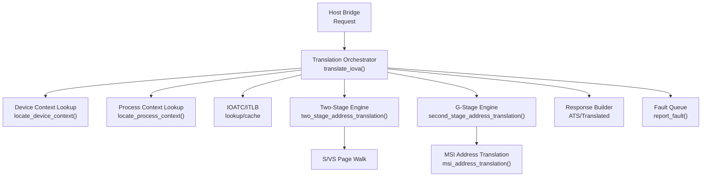
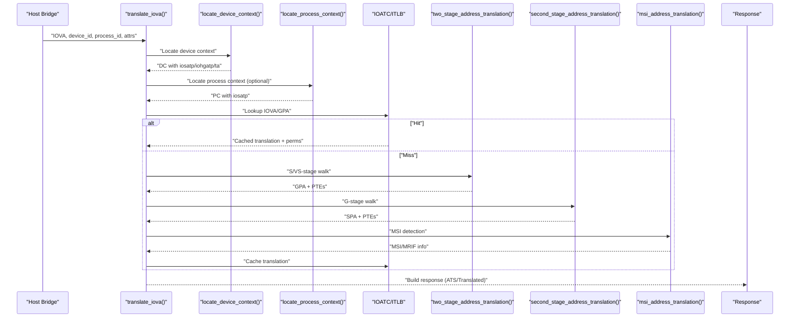
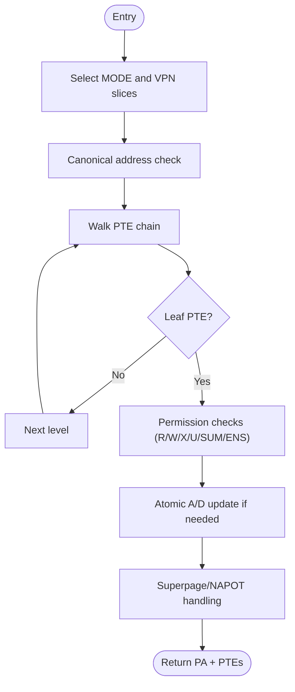
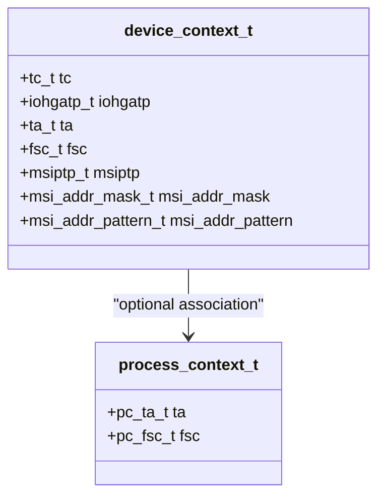
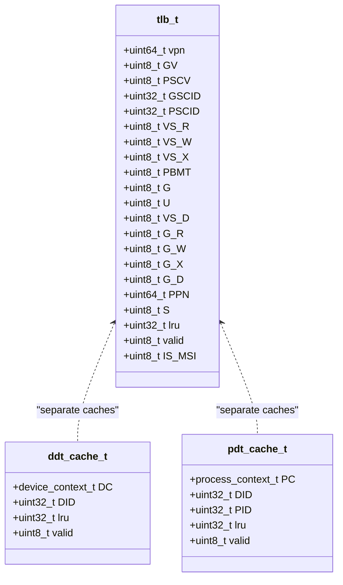
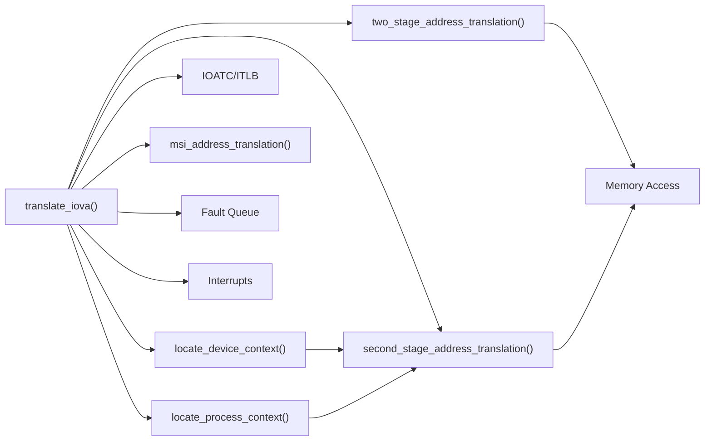

# Core IOMMU Functionality

<cite>
**Referenced Files in This Document**
- [iommu_translate.cc](file://iommu/iommu_translate.cc)
- [iommu_translate.hh](file://iommu/iommu_translate.hh)
- [iommu_two_stage_trans.cc](file://iommu/iommu_two_stage_trans.cc)
- [iommu_second_stage_trans.cc](file://iommu/iommu_second_stage_trans.cc)
- [iommu_device_context.cc](file://iommu/iommu_device_context.cc)
- [iommu_process_context.cc](file://iommu/iommu_process_context.cc)
- [iommu_atc.cc](file://iommu/iommu_atc.cc)
- [iommu_atc.hh](file://iommu/iommu_atc.hh)
- [iommu_struct.hh](file://iommu/iommu_struct.hh)
- [iommu_data_structures.hh](file://iommu/iommu_data_structures.hh)
- [iommu_registers.hh](file://iommu/iommu_registers.hh)
- [iommu_req_rsp.hh](file://iommu/iommu_req_rsp.hh)
- [iommu_fault.hh](file://iommu/iommu_fault.hh)
- [iommu_utils.hh](file://iommu/iommu_utils.hh)
- [iommu_interrupt.hh](file://iommu/iommu_interrupt.hh)
</cite>

## Table of Contents
1. [Introduction](#introduction)
2. [Project Structure](#project-structure)
3. [Core Components](#core-components)
4. [Architecture Overview](#architecture-overview)
5. [Detailed Component Analysis](#detailed-component-analysis)
6. [Dependency Analysis](#dependency-analysis)
7. [Performance Considerations](#performance-considerations)
8. [Troubleshooting Guide](#troubleshooting-guide)
9. [Conclusion](#conclusion)

## Introduction
This document explains the core IOMMU functionality implemented in the repository, focusing on:
- Address translation engine supporting two-stage translation (VS-stage and G-stage)
- Device and process context management with PASID support
- Translation cache systems (IOATC/ITLB)
- Multiple page size support (SV32/SV39/SV48/SV57 and SV32x4/SV39x4/SV48x4/SV57x4)
- MSI address translation and MRIF handling
- Context validation and fault reporting mechanisms
- Integration patterns among components and performance optimization techniques

## Project Structure
The IOMMU implementation is organized around a set of cohesive modules:
- Translation orchestration and policy enforcement
- Two-stage page table walk engines (S/VS and G)
- Device and process context lookup and validation
- Translation cache (IOATC/ITLB) with LRU replacement
- Data structures, registers, and request/response interfaces
- Fault reporting and interrupt generation

**Diagram sources**
- [iommu_translate.cc:1-694](file://iommu/iommu_translate.cc#L1-L694)
- [iommu_device_context.cc:1-415](file://iommu/iommu_device_context.cc#L1-L415)
- [iommu_process_context.cc:1-236](file://iommu/iommu_process_context.cc#L1-L236)
- [iommu_two_stage_trans.cc:1-600](file://iommu/iommu_two_stage_trans.cc#L1-L600)
- [iommu_second_stage_trans.cc:1-424](file://iommu/iommu_second_stage_trans.cc#L1-L424)
- [iommu_atc.cc:1-233](file://iommu/iommu_atc.cc#L1-L233)
- [iommu_fault.hh:1-90](file://iommu/iommu_fault.hh#L1-L90)

**Section sources**
- [iommu_struct.hh:1-102](file://iommu/iommu_struct.hh#L1-L102)
- [iommu_registers.hh:1-987](file://iommu/iommu_registers.hh#L1-L987)
- [iommu_req_rsp.hh:1-104](file://iommu/iommu_req_rsp.hh#L1-L104)

## Core Components
- Translation orchestrator: Classifies transaction type, validates IOMMU mode and device/process contexts, coordinates IOATC/ITLB lookup, invokes two-stage translation, handles MSI translation, and builds response.
- Two-stage translation engine: Implements S/VS-stage and G-stage page table walks with permission checks, A/D bit atomic updates, and superpage handling.
- Device and process context managers: Traverse DDT/PDT radix trees, validate context configuration, and cache results in IOATC.
- Translation cache (IOATC/ITLB): Stores tag and attributes for fast translation hits, with LRU replacement and permission validation.
- MSI translation: Detects and routes MSI writes to MRIF or flat MSI page tables.
- Fault reporting and interrupts: Reports faults to the fault queue and generates interrupts as configured.

**Section sources**
- [iommu_translate.cc:1-694](file://iommu/iommu_translate.cc#L1-L694)
- [iommu_translate.hh:1-132](file://iommu/iommu_translate.hh#L1-L132)
- [iommu_two_stage_trans.cc:1-600](file://iommu/iommu_two_stage_trans.cc#L1-L600)
- [iommu_second_stage_trans.cc:1-424](file://iommu/iommu_second_stage_trans.cc#L1-L424)
- [iommu_device_context.cc:1-415](file://iommu/iommu_device_context.cc#L1-L415)
- [iommu_process_context.cc:1-236](file://iommu/iommu_process_context.cc#L1-L236)
- [iommu_atc.cc:1-233](file://iommu/iommu_atc.cc#L1-L233)
- [iommu_atc.hh:1-98](file://iommu/iommu_atc.hh#L1-L98)
- [iommu_fault.hh:1-90](file://iommu/iommu_fault.hh#L1-L90)

## Architecture Overview
The IOMMU implements a unified translation pipeline:
- Input classification and policy checks
- Device context selection (DDT radix tree)
- Optional process context selection (PDT radix tree)
- IOATC/ITLB lookup for fast hit resolution
- Two-stage page table walk (S/VS → G)
- MSI detection and routing
- Response assembly and optional caching

**Diagram sources**
- [iommu_translate.cc:1-694](file://iommu/iommu_translate.cc#L1-L694)
- [iommu_device_context.cc:1-415](file://iommu/iommu_device_context.cc#L1-L415)
- [iommu_process_context.cc:1-236](file://iommu/iommu_process_context.cc#L1-L236)
- [iommu_two_stage_trans.cc:1-600](file://iommu/iommu_two_stage_trans.cc#L1-L600)
- [iommu_second_stage_trans.cc:1-424](file://iommu/iommu_second_stage_trans.cc#L1-L424)
- [iommu_atc.cc:1-233](file://iommu/iommu_atc.cc#L1-L233)

## Detailed Component Analysis

### Address Translation Engine (Two-Stage)
The translation engine performs:
- Canonical address checks and mode selection (Sv32/Sv39/Sv48/Sv57 for S/VS-stage; Sv32x4/Sv39x4/Sv48x4/Sv57x4 for G-stage)
- Multi-level page table walks with permission checks (R/W/X/U/SUM/ENS)
- A/D bit atomic updates (HW A/D update support)
- Superpage handling and NAPOT PTE semantics
- Combined PBMT resolution across S/VS and G stages

**Diagram sources**
- [iommu_two_stage_trans.cc:1-600](file://iommu/iommu_two_stage_trans.cc#L1-L600)
- [iommu_second_stage_trans.cc:1-424](file://iommu/iommu_second_stage_trans.cc#L1-L424)

**Section sources**
- [iommu_two_stage_trans.cc:1-600](file://iommu/iommu_two_stage_trans.cc#L1-L600)
- [iommu_second_stage_trans.cc:1-424](file://iommu/iommu_second_stage_trans.cc#L1-L424)
- [iommu_translate.hh:1-132](file://iommu/iommu_translate.hh#L1-L132)

### Device and Process Context Management
Device context (DC):
- Located via DDT radix tree using device_id partitions
- Validates DC configuration against capabilities and mode
- Supports base and extended formats with MSI page table pointer and address mask/pattern

Process context (PC):
- Located via PDT radix tree using process_id partitions
- Validates PC configuration against DC and capabilities
- Supports multiple PDT modes (PD8/PD17/PD20) and S-stage modes

**Diagram sources**
- [iommu_data_structures.hh:324-412](file://iommu/iommu_data_structures.hh#L324-L412)
- [iommu_device_context.cc:1-415](file://iommu/iommu_device_context.cc#L1-L415)
- [iommu_process_context.cc:1-236](file://iommu/iommu_process_context.cc#L1-L236)

**Section sources**
- [iommu_device_context.cc:1-415](file://iommu/iommu_device_context.cc#L1-L415)
- [iommu_process_context.cc:1-236](file://iommu/iommu_process_context.cc#L1-L236)
- [iommu_data_structures.hh:1-415](file://iommu/iommu_data_structures.hh#L1-L415)

### Translation Cache Systems (IOATC/ITLB)
The IOATC/ITLB stores:
- Tag fields: VPN, GV, PSCV, GSCID, PSCID
- S/VS-stage and G-stage permission and attribute bits
- PPN and size encoding
- MSI detection flag

Lookup validates permissions and triggers misses to page walks. Cache uses LRU replacement.

**Diagram sources**
- [iommu_atc.hh:9-51](file://iommu/iommu_atc.hh#L9-L51)
- [iommu_atc.cc:1-233](file://iommu/iommu_atc.cc#L1-L233)

**Section sources**
- [iommu_atc.cc:1-233](file://iommu/iommu_atc.cc#L1-L233)
- [iommu_atc.hh:1-98](file://iommu/iommu_atc.hh#L1-L98)

### MSI Address Translation and MRIF Support
The engine detects MSI writes based on address mask/pattern and routes to:
- Basic MSI page table (flat)
- MRIF mode (memory-resident interrupt file)

Caching behavior excludes MRIF-mode MSI PTEs in ATC to avoid unnecessary overhead.

**Section sources**
- [iommu_translate.cc:372-402](file://iommu/iommu_translate.cc#L372-L402)
- [iommu_translate.hh:61-92](file://iommu/iommu_translate.hh#L61-L92)
- [iommu_data_structures.hh:260-306](file://iommu/iommu_data_structures.hh#L260-L306)

### Request/Response and ATS Integration
The translation response includes:
- PPN and size encoding (S bit)
- Permission bits (R/W/X) and global/privileged flags
- CXL_IO and U bits for ATS
- PBMT propagation

**Section sources**
- [iommu_req_rsp.hh:1-104](file://iommu/iommu_req_rsp.hh#L1-L104)
- [iommu_translate.cc:478-575](file://iommu/iommu_translate.cc#L478-L575)

### Fault Reporting and Interrupts
Fault records capture:
- Cause, PID/PV/PRIV, TTYP, DID
- iotval and iotval2 for diagnostics

Interrupts are generated for command/fault/page queues and HPM counters.

**Section sources**
- [iommu_fault.hh:1-90](file://iommu/iommu_fault.hh#L1-L90)
- [iommu_interrupt.hh:1-26](file://iommu/iommu_interrupt.hh#L1-L26)
- [iommu_registers.hh:550-640](file://iommu/iommu_registers.hh#L550-L640)

## Dependency Analysis
Key dependencies and relationships:
- Translation orchestrator depends on device/process context managers, IOATC/ITLB, and two-stage engines
- Two-stage engines depend on page table structures and memory access helpers
- Context managers depend on G-stage translation for PDT traversal when G-stage is active
- Fault/reporting and interrupts depend on register interfaces and queue structures

**Diagram sources**
- [iommu_translate.cc:1-694](file://iommu/iommu_translate.cc#L1-L694)
- [iommu_device_context.cc:1-415](file://iommu/iommu_device_context.cc#L1-L415)
- [iommu_process_context.cc:1-236](file://iommu/iommu_process_context.cc#L1-L236)
- [iommu_two_stage_trans.cc:1-600](file://iommu/iommu_two_stage_trans.cc#L1-L600)
- [iommu_second_stage_trans.cc:1-424](file://iommu/iommu_second_stage_trans.cc#L1-L424)
- [iommu_atc.cc:1-233](file://iommu/iommu_atc.cc#L1-L233)
- [iommu_fault.hh:1-90](file://iommu/iommu_fault.hh#L1-L90)
- [iommu_interrupt.hh:1-26](file://iommu/iommu_interrupt.hh#L1-L26)

**Section sources**
- [iommu_struct.hh:1-102](file://iommu/iommu_struct.hh#L1-L102)
- [iommu_registers.hh:1-987](file://iommu/iommu_registers.hh#L1-L987)

## Performance Considerations
- IOATC/ITLB hit reduces page table walks and improves latency for repeated translations
- LRU replacement minimizes cache pollution; small cache sizes reduce complexity and power
- Atomic A/D updates reduce write amplification and improve throughput
- Endianness and mode selection are validated early to avoid redundant work
- Bare mode paths minimize translation overhead for passthrough scenarios
- Event counters and HPM support enable profiling of translation paths

[No sources needed since this section provides general guidance]

## Troubleshooting Guide
Common issues and diagnostics:
- Translation faults: Inspect cause, TTYP, iotval/iotval2 in fault records
- Permission faults: Verify U/SUM/ENS and privilege checks in S/VS and G stages
- Data corruption: Check memory access status and poison handling
- ATS-specific responses: Distinguish UR vs CA based on cause categories
- Configuration errors: Validate DC/PC fields against capabilities and mode constraints

**Section sources**
- [iommu_fault.hh:1-90](file://iommu/iommu_fault.hh#L1-L90)
- [iommu_translate.cc:582-693](file://iommu/iommu_translate.cc#L582-L693)
- [iommu_device_context.cc:226-414](file://iommu/iommu_device_context.cc#L226-L414)
- [iommu_process_context.cc:12-195](file://iommu/iommu_process_context.cc#L12-L195)

## Conclusion
The IOMMU implementation provides a robust, modular translation pipeline with:
- Comprehensive two-stage translation support and permission enforcement
- Efficient device and process context management with radix-tree traversal
- Practical translation caching with LRU and permission validation
- MSI and MRIF handling integrated into the translation flow
- Strong fault reporting and interrupt mechanisms for observability

These components work together to deliver secure, high-performance address translation suitable for modern I/O virtualization and device DMA scenarios.