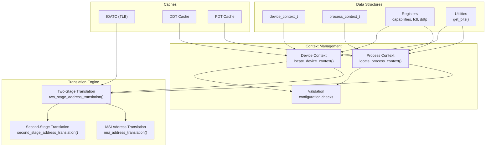
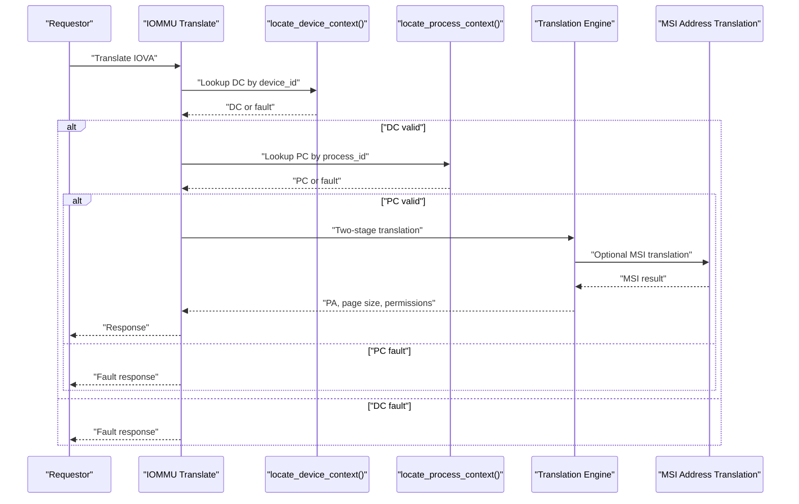
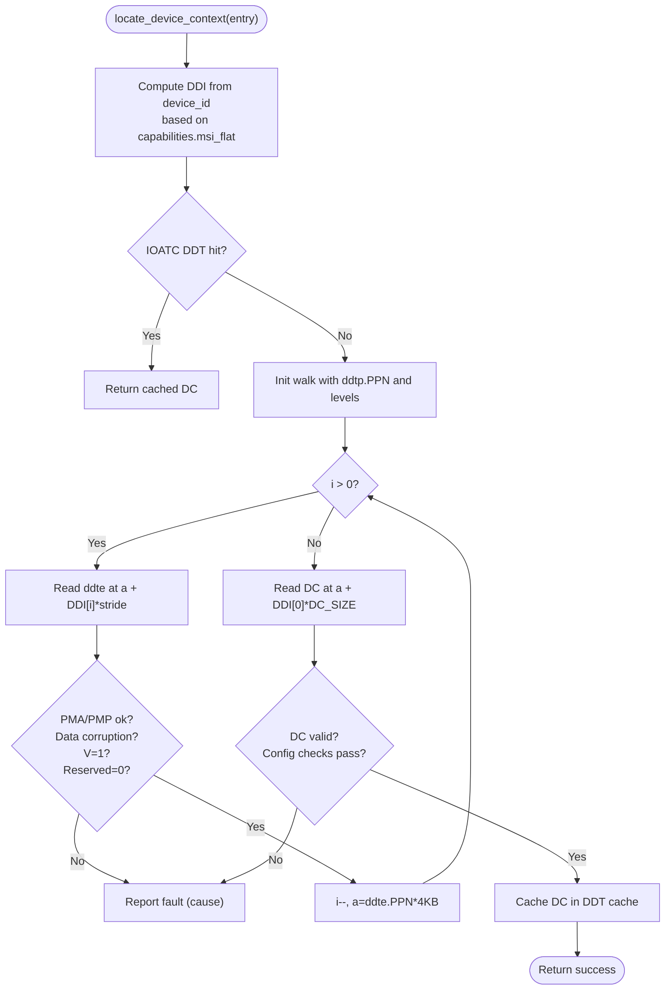
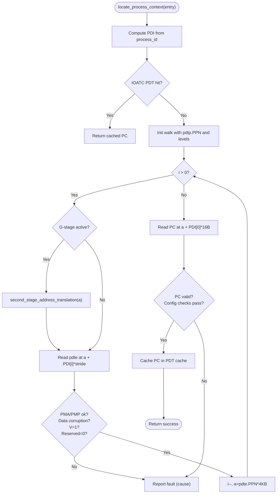
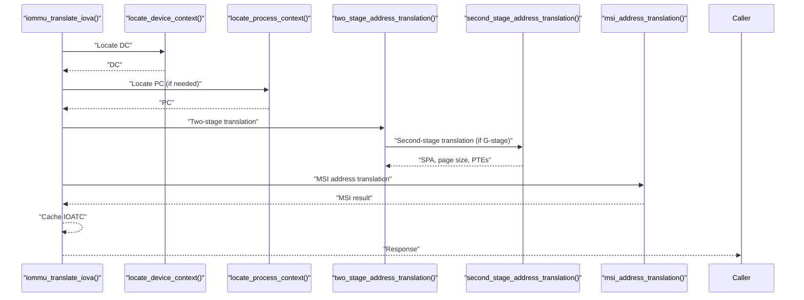
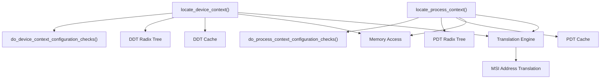

# Device and Process Context Management

<cite>
**Referenced Files in This Document**
- [iommu_device_context.cc](file://iommu/iommu_device_context.cc)
- [iommu_process_context.cc](file://iommu/iommu_process_context.cc)
- [iommu_data_structures.hh](file://iommu/iommu_data_structures.hh)
- [iommu_struct.hh](file://iommu/iommu_struct.hh)
- [iommu_translate.cc](file://iommu/iommu_translate.cc)
- [iommu_translate.hh](file://iommu/iommu_translate.hh)
- [iommu_atc.hh](file://iommu/iommu_atc.hh)
- [iommu_registers.hh](file://iommu/iommu_registers.hh)
- [iommu_utils.hh](file://iommu/iommu_utils.hh)
- [main.cpp](file://main.cpp)
</cite>

## Table of Contents
1. [Introduction](#introduction)
2. [Project Structure](#project-structure)
3. [Core Components](#core-components)
4. [Architecture Overview](#architecture-overview)
5. [Detailed Component Analysis](#detailed-component-analysis)
6. [Dependency Analysis](#dependency-analysis)
7. [Performance Considerations](#performance-considerations)
8. [Troubleshooting Guide](#troubleshooting-guide)
9. [Conclusion](#conclusion)

## Introduction
This document explains the device and process context management systems in the IOMMU model. It focuses on:
- Device context structure and configuration
- Process context management with PASID support
- Context lookup algorithms for device and process contexts
- Validation procedures and security attributes
- Context caching and switching mechanisms
- Integration with translation engine components

## Project Structure
The IOMMU subsystem is organized around core translation and context management modules:
- Context lookup and validation: device and process contexts
- Translation engine: two-stage address translation, MSI address translation, and second-stage translation
- Data structures: device context, process context, and related unions
- Caches: IOATC (IOMMU TLB), DDT/PDT caches
- Registers: capabilities, fctl, ddtp, and queue pointers
- Utilities: bit extraction helpers

**Diagram sources**
- [iommu_device_context.cc:10-225](file://iommu/iommu_device_context.cc#L10-L225)
- [iommu_process_context.cc:12-196](file://iommu/iommu_process_context.cc#L12-L196)
- [iommu_translate.cc:8-694](file://iommu/iommu_translate.cc#L8-L694)
- [iommu_data_structures.hh:29-412](file://iommu/iommu_data_structures.hh#L29-L412)
- [iommu_atc.hh:37-96](file://iommu/iommu_atc.hh#L37-L96)
- [iommu_registers.hh:172-330](file://iommu/iommu_registers.hh#L172-L330)
- [iommu_utils.hh:7-9](file://iommu/iommu_utils.hh#L7-L9)

**Section sources**
- [main.cpp:37-79](file://main.cpp#L37-L79)
- [iommu_struct.hh:42-99](file://iommu/iommu_struct.hh#L42-L99)

## Core Components
- Device Context (DC): Holds translation control, G-stage address translation, translation attributes, and first-stage context. Supports base and extended formats with different sizes and MSI-related fields.
- Process Context (PC): Holds translation attributes and first-stage context for a given device and process_id.
- Context Lookup: locate_device_context() and locate_process_context() traverse DDT/PDT radix trees to locate DC/PC.
- Validation: do_device_context_configuration_checks() and do_process_context_configuration_checks() enforce architectural constraints.
- Caching: IOATC (TLB), DDT cache, and PDT cache accelerate lookups and reduce memory traffic.
- Translation Engine: Integrates DC/PC into two-stage translation pipeline with MSI handling.

**Section sources**
- [iommu_data_structures.hh:324-412](file://iommu/iommu_data_structures.hh#L324-L412)
- [iommu_device_context.cc:10-225](file://iommu/iommu_device_context.cc#L10-L225)
- [iommu_process_context.cc:12-196](file://iommu/iommu_process_context.cc#L12-L196)

## Architecture Overview
The IOMMU orchestrates translation through a deterministic pipeline:
1. Device Context Lookup: locate_device_context() computes DDT indices from device_id and traverses the DDT radix tree to locate DC.
2. Process Context Lookup: locate_process_context() computes PDT indices from process_id and traverses the PDT radix tree to locate PC.
3. Validation: Both DC and PC undergo configuration checks to ensure supported modes and correct encoding.
4. Translation: The translation engine performs two-stage address translation using DC/PC page table pointers and G-stage translation when applicable.
5. MSI Handling: Optional MSI address translation is performed to detect and route MSI writes to virtual interrupt files.
6. Caching: Results are cached in IOATC and DDT/PDT caches to accelerate subsequent lookups.

**Diagram sources**
- [iommu_translate.cc:8-694](file://iommu/iommu_translate.cc#L8-L694)
- [iommu_device_context.cc:10-225](file://iommu/iommu_device_context.cc#L10-L225)
- [iommu_process_context.cc:12-196](file://iommu/iommu_process_context.cc#L12-L196)

## Detailed Component Analysis

### Device Context Management
- Structure: device_context_t includes translation control (tc), G-stage address translation (iohgatp), translation attributes (ta), first-stage context (fsc), and optional MSI fields in extended format.
- Lookup Algorithm (locate_device_context()):
  - Compute DDI indices from device_id based on capabilities.msi_flat.
  - Check IOATC DDT cache for hit; if hit, return DC.
  - Traverse DDT radix tree:
    - Read ddte at computed address; validate PMA/PMP, data corruption, V bit, and reserved fields.
    - Decrement level and update address to ddte.PPN until reaching leaf level.
  - Read DC at leaf address; validate DC validity and run configuration checks.
  - Cache DC in DDT cache.
- Validation (do_device_context_configuration_checks()):
  - Enforce reserved fields, ATS/PRI/T2GPA constraints, PDTP mode support, IOSATP mode support, G-stage mode support, MSI mode constraints, alignment, AMO/GXL/SBE/SXL/SBE legality, QoS ID width limits, and Bare mode restrictions.
- Security Attributes:
  - EN_ATS/EN_PRI/PRPR/T2GPA control ATS/PRI behavior and GPA exposure.
  - SADE/GADE control atomic A/D bit updates.
  - SBE controls endianness for implicit memory accesses.
  - SXL controls supported virtual-memory schemes and bit-width constraints.
  - QoS IDs (RCID/MCID) propagate to IOMMU-initiated accesses.

**Diagram sources**
- [iommu_device_context.cc:10-225](file://iommu/iommu_device_context.cc#L10-L225)

**Section sources**
- [iommu_device_context.cc:10-225](file://iommu/iommu_device_context.cc#L10-L225)
- [iommu_data_structures.hh:324-337](file://iommu/iommu_data_structures.hh#L324-L337)
- [iommu_registers.hh:172-249](file://iommu/iommu_registers.hh#L172-L249)

### Process Context Management with PASID Support
- Structure: process_context_t includes translation attributes (ta) and first-stage context (fsc) with IOSATP pointer and PSCID.
- Lookup Algorithm (locate_process_context()):
  - Compute PDI indices from process_id (fixed partitioning).
  - Check IOATC PDT cache for hit; if hit, return PC.
  - Traverse PDT radix tree:
    - If G-stage active, translate intermediate address using second-stage translation before reading pdte.
    - Read pdte; validate PMA/PMP, data corruption, V bit, reserved fields.
    - Decrement level and update address to pdte.PPN until reaching leaf level.
  - Read PC at leaf address; validate PC validity and run configuration checks.
  - Cache PC in PDT cache.
- Validation (do_process_context_configuration_checks()):
  - Enforce reserved fields and IOSATP mode support based on DC.tc.SXL and capabilities.
- Security Attributes:
  - ENS/SUM control supervisor privilege access and user memory access.
  - PSCID identifies address space for S/VS-stage translation.
  - SBE controls endianness for implicit memory accesses.

**Diagram sources**
- [iommu_process_context.cc:12-196](file://iommu/iommu_process_context.cc#L12-L196)

**Section sources**
- [iommu_process_context.cc:12-196](file://iommu/iommu_process_context.cc#L12-L196)
- [iommu_data_structures.hh:409-412](file://iommu/iommu_data_structures.hh#L409-L412)

### Context Validation Mechanisms
- Device Context Checks:
  - Reserved fields and encoding correctness enforced.
  - ATS/PRI/T2GPA constraints against capabilities.
  - PDTP mode selection and IOSATP mode selection constrained by capabilities.
  - G-stage mode selection constrained by fctl.GXL and capabilities.
  - MSI mode constraints and alignment requirements.
  - AMO/GXL/SBE/SXL/SBE legality and QoS ID width limits.
- Process Context Checks:
  - Reserved fields and IOSATP mode selection constrained by DC.tc.SXL and capabilities.

**Section sources**
- [iommu_device_context.cc:227-414](file://iommu/iommu_device_context.cc#L227-L414)
- [iommu_process_context.cc:198-235](file://iommu/iommu_process_context.cc#L198-L235)

### Context Caching and Switching
- IOATC (TLB): Stores IOVA-to-PA translations with VS-stage and G-stage metadata, page size, and MSI indication. Supports NAPOT ranges and LRU replacement.
- DDT Cache: Stores device contexts keyed by device_id for fast lookup.
- PDT Cache: Stores process contexts keyed by device_id and process_id for fast lookup.
- Switching: When a new device_id or process_id is encountered, the caches are checked first. On miss, the radix-tree lookup locates the context, validates it, and caches it for subsequent hits.

**Section sources**
- [iommu_atc.hh:37-96](file://iommu/iommu_atc.hh#L37-L96)
- [iommu_struct.hh:89-99](file://iommu/iommu_struct.hh#L89-L99)

### Integration with Translation Engine
- Two-Stage Translation: Uses DC/PC IOSATP and DC iohgatp to translate IOVA to GPA and then GPA to SPA. Handles implicit memory accesses and G-stage translation when required.
- MSI Address Translation: Detects MSI writes based on address mask/pattern and routes to MSI page tables or MRIF as configured.
- Response Generation: Builds translation responses with PPN, size, permissions, and special fields for ATS.

**Diagram sources**
- [iommu_translate.cc:8-694](file://iommu/iommu_translate.cc#L8-L694)
- [iommu_translate.hh:95-129](file://iommu/iommu_translate.hh#L95-L129)

**Section sources**
- [iommu_translate.cc:8-694](file://iommu/iommu_translate.cc#L8-L694)
- [iommu_translate.hh:95-129](file://iommu/iommu_translate.hh#L95-L129)

## Dependency Analysis
- locate_device_context() depends on:
  - DDT traversal primitives and memory access helpers
  - Configuration checks for DC
  - IOATC DDT cache lookup and insertion
- locate_process_context() depends on:
  - PDT traversal primitives and memory access helpers
  - Second-stage translation for GPA computation when G-stage is active
  - Configuration checks for PC
  - IOATC PDT cache lookup and insertion
- Translation engine integrates DC/PC into two-stage translation and MSI handling.

**Diagram sources**
- [iommu_device_context.cc:10-225](file://iommu/iommu_device_context.cc#L10-L225)
- [iommu_process_context.cc:12-196](file://iommu/iommu_process_context.cc#L12-L196)
- [iommu_translate.cc:8-694](file://iommu/iommu_translate.cc#L8-L694)

**Section sources**
- [iommu_device_context.cc:10-225](file://iommu/iommu_device_context.cc#L10-L225)
- [iommu_process_context.cc:12-196](file://iommu/iommu_process_context.cc#L12-L196)
- [iommu_translate.cc:8-694](file://iommu/iommu_translate.cc#L8-L694)

## Performance Considerations
- Caching:
  - IOATC caches translations with NAPOT ranges to reduce TLB pressure.
  - DDT/PDT caches minimize repeated DDT/PDT walks.
- Radix Tree Traversal:
  - Levels depend on device/process ID width and configuration (1LVL/2LVL/3LVL).
  - Endianness and PMA/PMP checks add minimal overhead compared to memory latency.
- G-stage Translation:
  - Implicit memory accesses for GPA computation incur extra memory traffic; caching helps mitigate this.
- MSI Handling:
  - MSI address translation is invoked conditionally; MRIF mode handling avoids caching MSI PTEs in MRIF mode.

[No sources needed since this section provides general guidance]

## Troubleshooting Guide
Common faults and their causes:
- DDT entry load access fault (cause 257)
- DDT entry not valid (cause 258)
- DDT entry misconfigured (cause 259)
- Transaction type disallowed (cause 260)
- PDT entry load access fault (cause 265)
- PDT entry not valid (cause 266)
- PDT entry misconfigured (cause 267)
- MSI PTE load access fault (cause 261)
- MSI PTE not valid (cause 262)
- MSI PTE misconfigured (cause 263)
- MSI PT data corruption (cause 270)
- MSI MRIF data corruption (cause 271)
- Internal data-path error (cause 272)
- First/second-stage PT data corruption (cause 274)
- Guest page faults (instruction/read/write/AMO) with iotval2 encoding

Resolution steps:
- Verify device_id/process_id widths against DDT/PDT modes.
- Confirm capabilities and fctl settings align with context modes.
- Ensure reserved fields are zero and encodings are valid.
- Check PMA/PMP access permissions and alignment constraints.
- Review ATS/PRI/T2GPA and QoS ID configurations.

**Section sources**
- [iommu_device_context.cc:128-218](file://iommu/iommu_device_context.cc#L128-L218)
- [iommu_process_context.cc:125-191](file://iommu/iommu_process_context.cc#L125-L191)
- [iommu_translate.cc:590-668](file://iommu/iommu_translate.cc#L590-L668)

## Conclusion
The IOMMU’s device and process context management provides robust, validated, and cache-accelerated lookup of DC/PC through radix-tree traversals. The translation engine integrates these contexts into a two-stage pipeline with MSI handling, while strict validation ensures compliance with architectural constraints. Proper configuration of capabilities, fctl, and context modes is essential for correct operation and security.