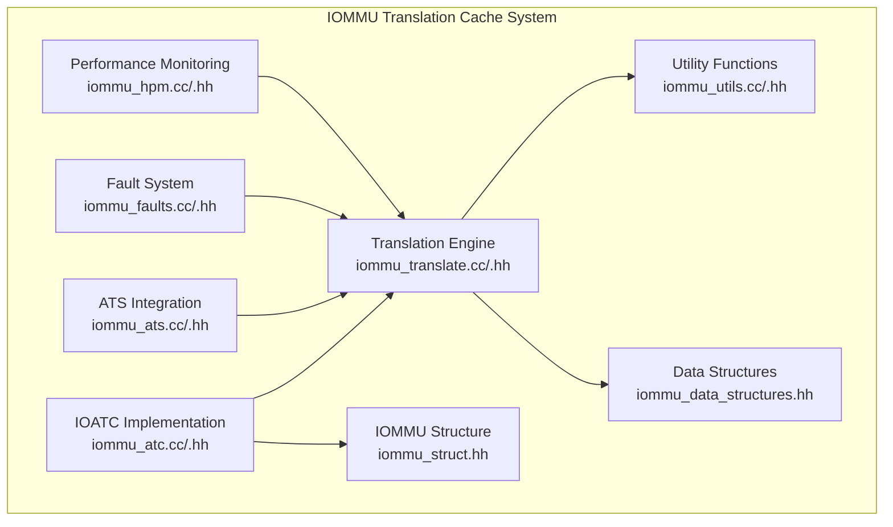
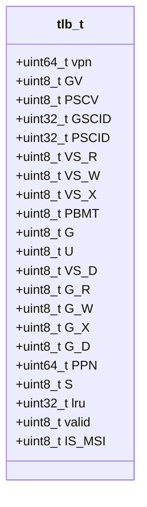
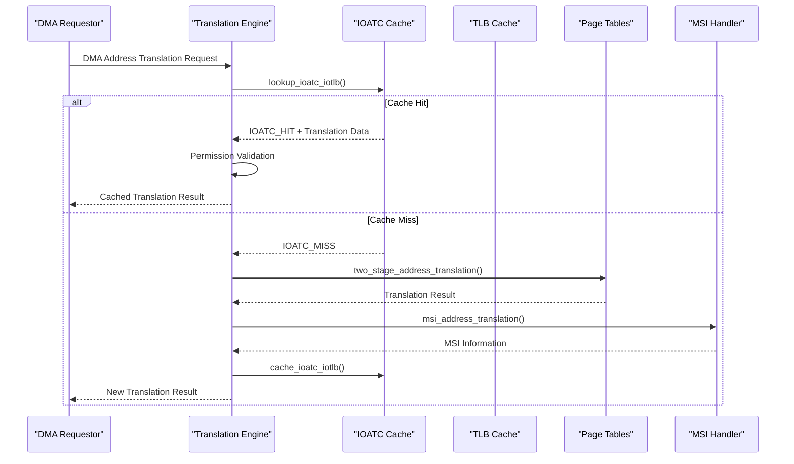
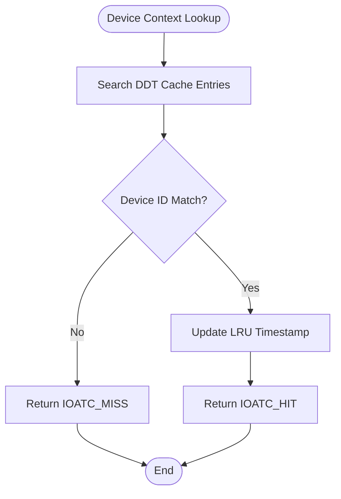
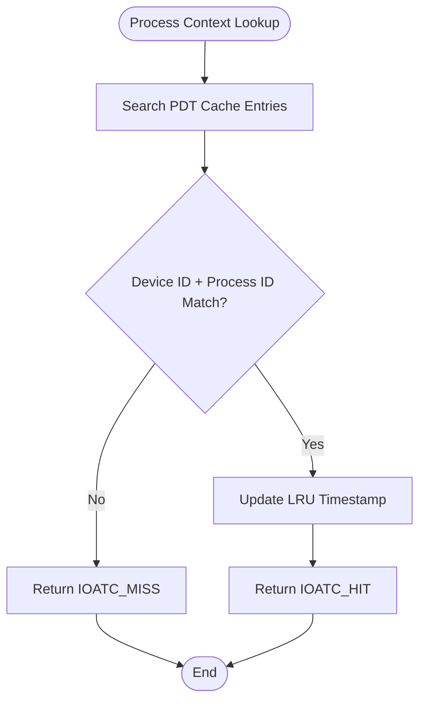
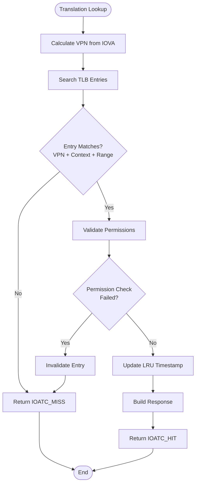
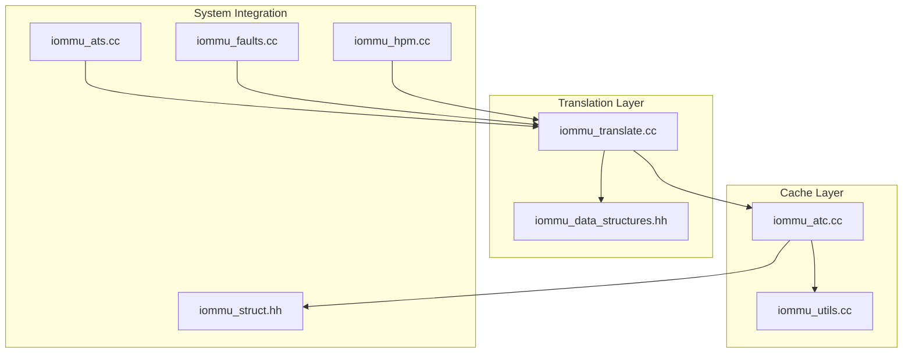

# Translation Cache System

<cite>
**Referenced Files in This Document**
- [iommu_atc.hh](file://iommu/iommu_atc.hh)
- [iommu_atc.cc](file://iommu/iommu_atc.cc)
- [iommu_translate.hh](file://iommu/iommu_translate.hh)
- [iommu_translate.cc](file://iommu/iommu_translate.cc)
- [iommu_data_structures.hh](file://iommu/iommu_data_structures.hh)
- [iommu_struct.hh](file://iommu/iommu_struct.hh)
- [iommu_utils.hh](file://iommu/iommu_utils.hh)
- [iommu_utils.cc](file://iommu/iommu_utils.cc)
- [iommu_ats.hh](file://iommu/iommu_ats.hh)
- [iommu_ats.cc](file://iommu/iommu_ats.cc)
- [iommu_fault.hh](file://iommu/iommu_fault.hh)
- [iommu_faults.cc](file://iommu/iommu_faults.cc)
- [iommu_hpm.hh](file://iommu/iommu_hpm.hh)
- [iommu_hpm.cc](file://iommu/iommu_hpm.cc)
</cite>

## Table of Contents
1. [Introduction](#introduction)
2. [Project Structure](#project-structure)
3. [Core Components](#core-components)
4. [Architecture Overview](#architecture-overview)
5. [Detailed Component Analysis](#detailed-component-analysis)
6. [Dependency Analysis](#dependency-analysis)
7. [Performance Considerations](#performance-considerations)
8. [Troubleshooting Guide](#troubleshooting-guide)
9. [Conclusion](#conclusion)

## Introduction
This document provides comprehensive documentation for the translation cache system within the IOMMU implementation, focusing on the Input-Output Address Translation Cache (IOATC) and its integration with the instruction translation lookaside buffer (ITLB) functionality. The IOATC serves as a high-performance cache for address translation results, significantly reducing the overhead of repeated page table walks during DMA operations. The system implements sophisticated caching strategies including NAPOT (Naturally Aligned Power-of-Two) range caching, LRU-based replacement, and comprehensive permission checking.

The translation cache system is designed to handle various translation scenarios including:
- Device context caching for fast device-to-context lookups
- Process context caching for multi-process environments  
- Instruction TLB (ITLB) caching for DMA address translations
- MSI (Message Signaled Interrupt) address translation caching
- ATS (Address Translation Services) translation request caching

## Project Structure
The translation cache system is implemented across several key modules within the IOMMU subsystem:

**Diagram sources**
- [iommu_atc.cc:1-233](file://iommu/iommu_atc.cc#L1-L233)
- [iommu_translate.cc:1-709](file://iommu/iommu_translate.cc#L1-L709)
- [iommu_struct.hh:42-102](file://iommu/iommu_struct.hh#L42-L102)

**Section sources**
- [iommu_atc.hh:1-98](file://iommu/iommu_atc.hh#L1-L98)
- [iommu_translate.hh:1-132](file://iommu/iommu_translate.hh#L1-L132)
- [iommu_struct.hh:1-102](file://iommu/iommu_struct.hh#L1-L102)

## Core Components

### IOATC Cache Architecture
The IOATC implements a unified cache system with three distinct cache types:

#### Device Directory Cache (DDT Cache)
- **Size**: Configurable constant (default: 2 entries)
- **Purpose**: Caches device context lookups to avoid repeated device directory table walks
- **Entry Format**: Contains device context, device ID, LRU counter, and validity flag
- **Replacement**: LRU-based eviction when cache is full

#### Process Directory Cache (PDT Cache)  
- **Size**: Configurable constant (default: 2 entries)
- **Purpose**: Caches process contexts for multi-process device environments
- **Entry Format**: Contains process context, device ID, process ID, LRU counter, and validity flag
- **Replacement**: LRU-based eviction when cache is full

#### Translation Lookaside Buffer (TLB)
- **Size**: Configurable constant (default: 2 entries)
- **Purpose**: Caches translation results for DMA address translations
- **Entry Format**: Comprehensive translation entry containing VPN, stage attributes, PPN, page size, and permission flags
- **Replacement**: LRU-based eviction with NAPOT range support

**Section sources**
- [iommu_atc.hh:38-51](file://iommu/iommu_atc.hh#L38-L51)
- [iommu_atc.cc:8-33](file://iommu/iommu_atc.cc#L8-L33)
- [iommu_atc.cc:51-94](file://iommu/iommu_atc.cc#L51-L94)
- [iommu_atc.cc:96-147](file://iommu/iommu_atc.cc#L96-L147)

### Cache Entry Formats

#### TLB Entry Structure
The TLB entry contains comprehensive translation metadata:

**Diagram sources**
- [iommu_atc.hh:9-36](file://iommu/iommu_atc.hh#L9-L36)

#### Cache Status Constants
- **IOATC_MISS**: 0 - Cache miss condition
- **IOATC_HIT**: 1 - Cache hit condition  
- **IOATC_FAULT**: 2 - Cache fault condition

**Section sources**
- [iommu_atc.hh:66-68](file://iommu/iommu_atc.hh#L66-L68)
- [iommu_atc.cc:162-232](file://iommu/iommu_atc.cc#L162-L232)

## Architecture Overview

### Translation Cache Integration Flow

**Diagram sources**
- [iommu_translate.cc:351-385](file://iommu/iommu_translate.cc#L351-L385)
- [iommu_atc.cc:150-232](file://iommu/iommu_atc.cc#L150-L232)

### Cache Policy Implementation

The IOATC implements the following cache policies:

#### LRU Replacement Policy
- Each cache entry maintains an LRU counter
- On access, entries are aged using global LRU timestamps
- Eviction selects the entry with the smallest LRU value
- LRU aging ensures fair replacement across cache entries

#### NAPOT Range Caching
- Supports naturally aligned power-of-two memory ranges
- Range matching uses NAPOT (Naturally Aligned Power-of-Two) encoding
- Enables caching of large memory regions efficiently
- Reduces cache fragmentation and improves hit rates

#### Permission-Based Caching
- Validates access permissions during cache lookup
- Enforces privilege checks (U/S mode) based on PSCV/U flags
- Performs G-stage permission validation for guest translations
- Invalidates entries on permission changes or D-bit modifications

**Section sources**
- [iommu_atc.cc:112-118](file://iommu/iommu_atc.cc#L112-L118)
- [iommu_atc.cc:174-209](file://iommu/iommu_atc.cc#L174-L209)
- [iommu_utils.cc:8-17](file://iommu/iommu_utils.cc#L8-L17)

## Detailed Component Analysis

### IOATC Lookup and Caching Operations

#### Device Context Cache Operations
The device context cache provides fast lookup for device-to-context mappings:

**Diagram sources**
- [iommu_atc.cc:36-49](file://iommu/iommu_atc.cc#L36-L49)

#### Process Context Cache Operations
The process context cache handles multi-process device environments:

**Diagram sources**
- [iommu_atc.cc:79-94](file://iommu/iommu_atc.cc#L79-L94)

#### Translation Cache Operations
The core translation cache implements comprehensive address translation caching:

**Diagram sources**
- [iommu_atc.cc:150-232](file://iommu/iommu_atc.cc#L150-L232)

**Section sources**
- [iommu_atc.cc:8-33](file://iommu/iommu_atc.cc#L8-L33)
- [iommu_atc.cc:51-94](file://iommu/iommu_atc.cc#L51-L94)
- [iommu_atc.cc:96-147](file://iommu/iommu_atc.cc#L96-L147)

### Permission Validation and Access Control

The translation cache enforces comprehensive permission validation:

#### Privilege Mode Checks
- Validates U/S privilege modes based on PSCV/U flags
- Enforces SUM (Supervisor User Memory) bit restrictions
- Handles privilege escalation scenarios for supervisor mode requests

#### Access Permission Validation
- Validates read, write, and execute permissions
- Checks G-stage permission faults and triggers cache invalidation
- Handles D-bit (Dirty) bit validation for store operations
- Implements atomic A/D bit updates based on SADE/GADE configuration

#### MSI Translation Handling
- Supports MSI address translation caching
- Handles MRIF (Memory-Resident Interrupt File) mode detection
- Prevents caching of MRIF-mode MSI translations
- Manages MSI-specific permission validation

**Section sources**
- [iommu_atc.cc:177-209](file://iommu/iommu_atc.cc#L177-L209)
- [iommu_translate.cc:457-491](file://iommu/iommu_translate.cc#L457-L491)

### Cache Sizing and Configuration

The IOATC system provides configurable cache sizes:

#### Cache Size Definitions
- **DDT_CACHE_SIZE**: 2 entries (device context cache)
- **PDT_CACHE_SIZE**: 2 entries (process context cache)  
- **TLB_SIZE**: 2 entries (translation cache)

#### Performance Implications
- Small cache sizes minimize memory footprint but increase miss rates
- LRU policy ensures optimal replacement for small cache sizes
- NAPOT range support maximizes cache utilization for memory-intensive workloads
- ATS translation caching provides significant performance benefits for device-to-device communication

**Section sources**
- [iommu_atc.hh:62-68](file://iommu/iommu_atc.hh#L62-L68)
- [iommu_struct.hh:89-96](file://iommu/iommu_struct.hh#L89-L96)

## Dependency Analysis

### Component Dependencies

**Diagram sources**
- [iommu_atc.cc:1-233](file://iommu/iommu_atc.cc#L1-L233)
- [iommu_translate.cc:1-709](file://iommu/iommu_translate.cc#L1-L709)
- [iommu_struct.hh:42-102](file://iommu/iommu_struct.hh#L42-L102)

### Cache Coherency Mechanisms

The IOATC implements several coherency mechanisms:

#### Automatic Invalidation
- Permission changes automatically invalidate cache entries
- D-bit modifications trigger immediate cache invalidation
- G-stage permission faults cause cache entry invalidation
- LRU aging prevents stale entry retention

#### ATS Integration
- Supports ATS translation request caching
- Handles ATS-specific cache invalidation scenarios
- Manages cache coherency across ATS translation requests
- Supports T2GPA (Translate-to-GPA) mode caching

#### Performance Monitoring Integration
- Counts TLB miss events for performance analysis
- Tracks cache hit/miss ratios through HPM counters
- Monitors cache utilization patterns
- Provides statistics for cache optimization

**Section sources**
- [iommu_translate.cc:370-371](file://iommu/iommu_translate.cc#L370-L371)
- [iommu_hpm.cc:7-84](file://iommu/iommu_hpm.cc#L7-L84)
- [iommu_ats.cc:35-55](file://iommu/iommu_ats.cc#L35-L55)

## Performance Considerations

### Cache Hit Rate Optimization

#### Workload-Specific Strategies
- **Sequential Access Patterns**: Benefit from small cache sizes with LRU policy
- **Random Access Patterns**: Require larger cache sizes or specialized replacement algorithms
- **Large Memory Regions**: NAPOT range caching significantly improves hit rates
- **Multi-process Environments**: Process context caching reduces directory table lookups

#### Cache Sizing Guidelines
- **Small Systems**: 2-entry caches provide adequate performance with minimal overhead
- **High-Throughput Systems**: Consider increasing cache sizes proportionally to memory bandwidth
- **Memory-Constrained Environments**: Prioritize TLB cache expansion over context caches

#### Performance Metrics
- **Cache Hit Ratio**: Monitor translation cache hit rates through HPM counters
- **TLB Miss Rate**: Track TLB miss rates to identify cache sizing requirements
- **Permission Validation Overhead**: Measure impact of permission checks on overall performance
- **Cache Replacement Efficiency**: Analyze LRU effectiveness for specific workloads

### Optimization Techniques

#### Prefetching Strategies
- Implement predictive caching for sequential memory access patterns
- Use historical access patterns to anticipate future translations
- Apply adaptive prefetching based on workload characteristics

#### Cache Partitioning
- Separate instruction and data translation caching for different access patterns
- Implement separate caches for different privilege modes
- Consider separate caches for different device contexts

#### Memory Access Optimization
- Optimize cache line utilization for frequent access patterns
- Minimize cache pollution through selective caching
- Implement write-back caching for frequently accessed translations

## Troubleshooting Guide

### Common Cache Issues

#### Cache Miss Patterns
- **Symptoms**: High TLB miss rates, increased translation latency
- **Causes**: Insufficient cache size, poor replacement policy fit, cache pollution
- **Solutions**: Increase cache sizes, adjust replacement policies, implement cache partitioning

#### Permission Validation Failures
- **Symptoms**: Frequent permission faults despite cache hits
- **Causes**: Permission changes during translation, D-bit modifications, privilege mode mismatches
- **Solutions**: Implement automatic cache invalidation, adjust permission validation timing, review privilege configurations

#### Cache Coherency Problems
- **Symptoms**: Stale translation results, inconsistent memory access
- **Causes**: ATS translation caching conflicts, MSI translation inconsistencies, cache invalidation timing issues
- **Solutions**: Review ATS configuration, implement proper cache invalidation sequences, verify MSI translation handling

### Diagnostic Procedures

#### Cache Statistics Analysis
- Monitor HPM counters for cache hit/miss ratios
- Analyze TLB miss patterns across different access types
- Track cache invalidation frequencies and causes

#### Performance Profiling
- Profile translation latency across different cache states
- Analyze permission validation overhead impact
- Measure cache replacement effectiveness for specific workloads

#### Integration Testing
- Test ATS translation caching with various device configurations
- Verify MSI translation caching behavior
- Validate cache coherency across different privilege modes

**Section sources**
- [iommu_faults.cc:35-160](file://iommu/iommu_faults.cc#L35-L160)
- [iommu_hpm.cc:7-84](file://iommu/iommu_hpm.cc#L7-L84)

## Conclusion

The IOATC translation cache system provides a robust foundation for high-performance DMA address translation in IOMMU implementations. The system's key strengths include:

- **Unified Cache Architecture**: Single cache system handles multiple translation types efficiently
- **NAPOT Range Support**: Enables efficient caching of large memory regions
- **Comprehensive Permission Validation**: Ensures security compliance while maintaining performance
- **Configurable Cache Sizes**: Allows optimization for different system requirements
- **ATS Integration**: Supports modern device communication patterns

The cache system demonstrates excellent balance between performance and security, with automatic invalidation mechanisms ensuring cache coherency. The modular design allows for easy extension and customization for specific use cases.

Future enhancements could include adaptive cache sizing, predictive caching based on workload analysis, and advanced replacement algorithms for specific workload patterns. The current implementation provides a solid foundation for high-performance IOMMU translation caching across diverse system configurations.