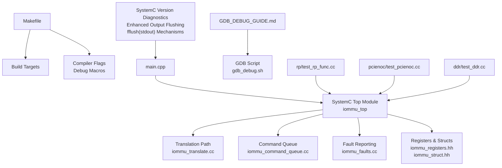
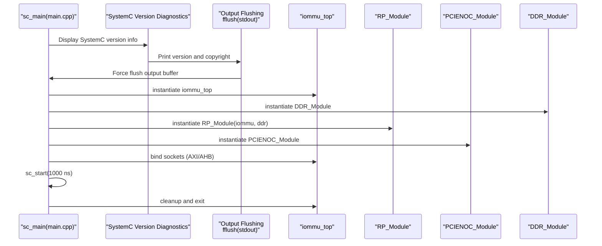
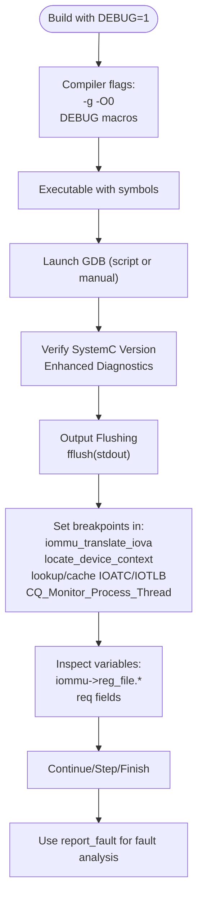
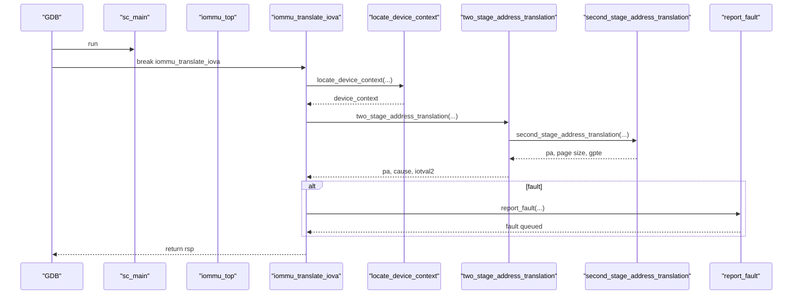
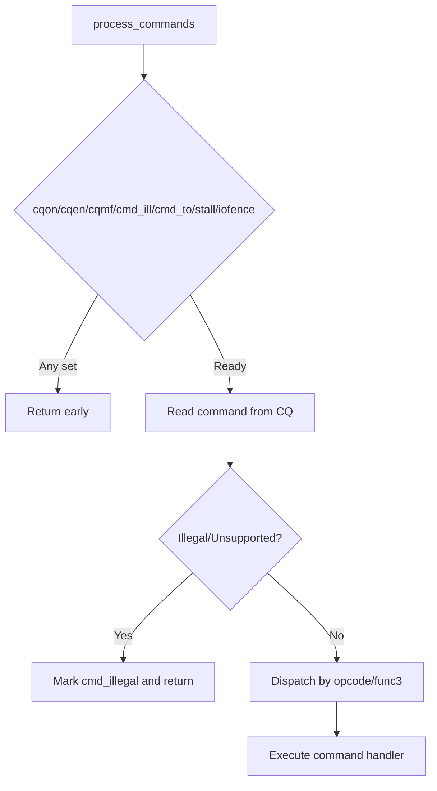
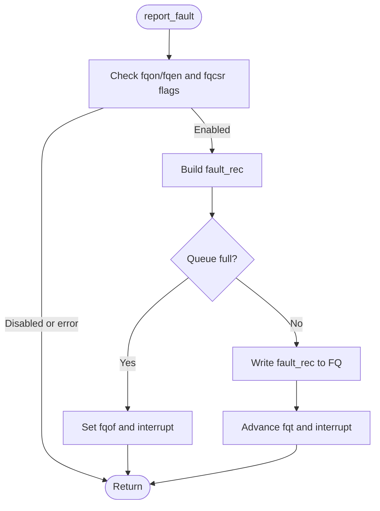
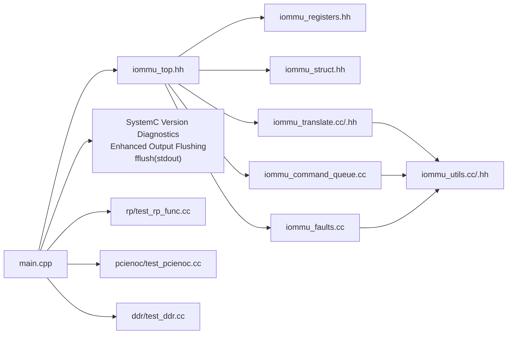

# Debugging and Development

<cite>
**Referenced Files in This Document**
- [GDB_DEBUG_GUIDE.md](file://GDB_DEBUG_GUIDE.md)
- [gdb_debug.sh](file://gdb_debug.sh)
- [Makefile](file://Makefile)
- [main.cpp](file://main.cpp)
- [iommu_struct.hh](file://iommu/iommu_struct.hh)
- [iommu_registers.hh](file://iommu/iommu_registers.hh)
- [iommu_top.hh](file://iommu/iommu_top.hh)
- [iommu_translate.hh](file://iommu/iommu_translate.hh)
- [iommu_translate.cc](file://iommu/iommu_translate.cc)
- [iommu_command_queue.cc](file://iommu/iommu_command_queue.cc)
- [iommu_faults.cc](file://iommu/iommu_faults.cc)
- [iommu_utils.hh](file://iommu/iommu_utils.hh)
- [iommu_utils.cc](file://iommu/iommu_utils.cc)
- [test_rp_func.cc](file://rp/test_rp_func.cc)
- [test_pcienoc.cc](file://pcienoc/test_pcienoc.cc)
- [test_ddr.cc](file://ddr/test_ddr.cc)
</cite>

## Update Summary
**Changes Made**
- Enhanced SystemC version diagnostics section in the introduction and architecture overview
- Added comprehensive SystemC version information display documentation with improved output flushing mechanisms
- Updated debugging workflow to include SystemC version verification with proper buffer flushing
- Improved output flushing mechanisms using fflush(stdout) for better debugging capabilities
- Documented comprehensive printf statements with proper buffer flushing for better debugging visibility

## Table of Contents
1. [Introduction](#introduction)
2. [Project Structure](#project-structure)
3. [Core Components](#core-components)
4. [Architecture Overview](#architecture-overview)
5. [Detailed Component Analysis](#detailed-component-analysis)
6. [Dependency Analysis](#dependency-analysis)
7. [Performance Considerations](#performance-considerations)
8. [Troubleshooting Guide](#troubleshooting-guide)
9. [Conclusion](#conclusion)
10. [Appendices](#appendices)

## Introduction
This document provides comprehensive debugging and development guidance for the RISC-V IOMMU SystemC model. It explains how to enable and use GDB for interactive debugging, how debug macros are defined and used across the codebase, and how to control debug output granularity. The model now includes enhanced SystemC version diagnostics with comprehensive version information display and improved output flushing for better debugging capabilities. It also documents the debugging workflow for breakpoints, variable inspection, and simulation state analysis, along with development guidelines covering coding standards, testing procedures, and performance optimization techniques. Practical examples demonstrate debugging common issues, profiling simulation performance, and extending the model with new features.

**Updated** Enhanced SystemC version diagnostics now provide comprehensive version information display with improved output flushing mechanisms using fflush(stdout) for better debugging visibility and comprehensive printf statements with proper buffer flushing.

## Project Structure
The repository organizes the IOMMU model by functional areas:
- Top-level build and debug scripts
- IOMMU core modules (translation, command queue, faults, interrupts, HPM, ATC/ATS)
- Test harnesses for RP (Root Complex), PCIENOC, and DDR
- SystemC integration and main simulation entry point with enhanced version diagnostics and improved output flushing

**Diagram sources**
- [Makefile:1-98](file://Makefile#L1-L98)
- [main.cpp:37-79](file://main.cpp#L37-L79)
- [iommu_translate.cc:1-200](file://iommu/iommu_translate.cc#L1-L200)
- [iommu_command_queue.cc:1-200](file://iommu/iommu_command_queue.cc#L1-L200)
- [iommu_faults.cc:1-160](file://iommu/iommu_faults.cc#L1-L160)
- [iommu_registers.hh:1-800](file://iommu/iommu_registers.hh#L1-L800)
- [iommu_struct.hh:1-102](file://iommu/iommu_struct.hh#L1-L102)
- [GDB_DEBUG_GUIDE.md:1-206](file://GDB_DEBUG_GUIDE.md#L1-L206)
- [gdb_debug.sh:1-37](file://gdb_debug.sh#L1-L37)
- [test_rp_func.cc:1-200](file://rp/test_rp_func.cc#L1-L200)
- [test_pcienoc.cc:1-3](file://pcienoc/test_pcienoc.cc#L1-L3)
- [test_ddr.cc:1-6](file://ddr/test_ddr.cc#L1-L6)

**Section sources**
- [Makefile:1-98](file://Makefile#L1-L98)
- [main.cpp:37-79](file://main.cpp#L37-L79)

## Core Components
- Build and Debug Control
  - Debug builds are controlled via the DEBUG flag in the Makefile, which injects -g -O0 and a comprehensive set of DEBUG_* macros for granular debug output.
  - The main.cpp also conditionally defines additional debug macros for selected subsystems when DEBUG is enabled.
- SystemC Version Diagnostics
  - Enhanced SystemC version information display with comprehensive version details including version information and copyright information.
  - Improved output flushing mechanisms using fflush(stdout) for better debugging visibility and immediate display of diagnostic information.
  - Comprehensive printf statements with proper buffer flushing ensure critical diagnostic information is displayed promptly during debugging sessions.
- SystemC Top Module
  - iommu_top encapsulates the IOMMU's TLM sockets, command queue monitoring thread, and the central iommu_t state container.
- Translation Engine
  - iommu_translate.cc implements the primary translation pipeline, guarded by DEBUG_TRANSLATION and related debug macros with extensive printf statements.
- Command Queue Processor
  - iommu_command_queue.cc implements command decoding and processing, guarded by DEBUG_COMMANDS with comprehensive status reporting.
- Fault Reporting
  - iommu_faults.cc implements fault detection and logging to the fault queue, guarded by DEBUG_FAULTS with detailed fault queue status reporting.
- Registers and Data Structures
  - iommu_registers.hh defines register unions and fields used across the model.
  - iommu_struct.hh defines the central iommu_t state, including register files, caches, and global parameters.

**Updated** Enhanced SystemC version diagnostics provide comprehensive version information display with improved output flushing mechanisms using fflush(stdout) for better debugging capabilities and comprehensive printf statements with proper buffer flushing.

**Section sources**
- [Makefile:16-24](file://Makefile#L16-L24)
- [main.cpp:14-31](file://main.cpp#L14-L31)
- [main.cpp:38-46](file://main.cpp#L38-L46)
- [iommu_top.hh:19-57](file://iommu/iommu_top.hh#L19-L57)
- [iommu_translate.cc:13-16](file://iommu/iommu_translate.cc#L13-L16)
- [iommu_command_queue.cc:11-13](file://iommu/iommu_command_queue.cc#L11-L13)
- [iommu_faults.cc:8-11](file://iommu/iommu_faults.cc#L8-L11)
- [iommu_registers.hh:172-800](file://iommu/iommu_registers.hh#L172-L800)
- [iommu_struct.hh:42-99](file://iommu/iommu_struct.hh#L42-L99)

## Architecture Overview
The IOMMU SystemC model integrates with test modules (RP, PCIENOC, DDR) and exposes a TLM interface for AXI/AHB traffic. The main simulation loop binds sockets and runs a fixed simulation time. The enhanced SystemC version diagnostics provide comprehensive version information display with improved output flushing mechanisms using fflush(stdout) for better debugging capabilities.

**Updated** Enhanced SystemC version diagnostics provide comprehensive version information display with improved output flushing mechanisms using fflush(stdout) for better debugging capabilities.

**Diagram sources**
- [main.cpp:38-46](file://main.cpp#L38-L46)
- [main.cpp:37-79](file://main.cpp#L37-L79)
- [iommu_top.hh:22-28](file://iommu/iommu_top.hh#L22-L28)

**Section sources**
- [main.cpp:38-46](file://main.cpp#L38-L46)
- [main.cpp:37-79](file://main.cpp#L37-L79)
- [iommu_top.hh:19-57](file://iommu/iommu_top.hh#L19-L57)

## Detailed Component Analysis

### GDB Integration and Debug Macro Usage
- Enabling Debug Builds
  - Use DEBUG=1 to compile with -g -O0 and define DEBUG_* macros for translation, command queue, faults, interrupts, HPM, utils, and ATC/ATS.
  - The main.cpp conditionally defines additional debug macros for MSI translation, translation, two-stage, second-stage, and commands when DEBUG is set.
- SystemC Version Verification
  - Enhanced diagnostics in main.cpp display comprehensive SystemC version information including version details and copyright information.
  - Improved output flushing ensures version information is displayed promptly during debugging sessions using fflush(stdout) mechanisms.
- GDB Script and Workflow
  - A convenience script checks prerequisites and launches GDB with pre-configured commands and a startup routine.
  - The guide provides common GDB commands, breakpoint management, stepping, variable inspection, and stack navigation tailored to the IOMMU model.
- Debug Output Control
  - Debug prints are wrapped in preprocessor guards (e.g., DEBUG_TRANSLATION, DEBUG_COMMANDS, DEBUG_FAULTS). These are enabled via Makefile and main.cpp when DEBUG=1.
  - Comprehensive printf statements with proper buffer flushing ensure critical debugging information is displayed immediately.

**Updated** Enhanced SystemC version diagnostics provide comprehensive version information display with improved output flushing mechanisms using fflush(stdout) for better debugging capabilities and comprehensive printf statements with proper buffer flushing.

**Diagram sources**
- [Makefile:16-24](file://Makefile#L16-L24)
- [main.cpp:14-31](file://main.cpp#L14-L31)
- [main.cpp:38-46](file://main.cpp#L38-L46)
- [GDB_DEBUG_GUIDE.md:21-206](file://GDB_DEBUG_GUIDE.md#L21-L206)
- [gdb_debug.sh:1-37](file://gdb_debug.sh#L1-L37)

**Section sources**
- [Makefile:16-24](file://Makefile#L16-L24)
- [main.cpp:14-31](file://main.cpp#L14-L31)
- [main.cpp:38-46](file://main.cpp#L38-L46)
- [GDB_DEBUG_GUIDE.md:21-206](file://GDB_DEBUG_GUIDE.md#L21-L206)
- [gdb_debug.sh:1-37](file://gdb_debug.sh#L1-L37)

### Translation Pipeline Debugging
- Key Functions and Guards
  - iommu_translate_iova is the primary entry for IOVA translation and is guarded by DEBUG_TRANSLATION with extensive printf statements.
  - Related functions guarded by DEBUG_TRANSLATION include device/process context lookup and two-stage translation helpers.
- Typical Debug Workflow
  - Set breakpoints at iommu_translate_iova and locate_device_context.
  - Inspect req fields (device_id, tr.iova, pid_valid, process_id) and iommu register fields (ddtp, capabilities).
  - Use step/next to trace control flow and examine intermediate variables (TTYP, is_read/write/exec, priv, causes).
  - Monitor comprehensive printf statements with proper buffer flushing for real-time debugging feedback.
- Example Commands
  - Breakpoints and printing are documented in the GDB guide for quick debugging of translation failures.

**Diagram sources**
- [iommu_translate.cc:8-131](file://iommu/iommu_translate.cc#L8-L131)
- [iommu_translate.hh:95-121](file://iommu/iommu_translate.hh#L95-L121)
- [iommu_faults.cc:8-159](file://iommu/iommu_faults.cc#L8-L159)
- [GDB_DEBUG_GUIDE.md:71-102](file://GDB_DEBUG_GUIDE.md#L71-L102)

**Section sources**
- [iommu_translate.cc:13-16](file://iommu/iommu_translate.cc#L13-L16)
- [iommu_translate.cc:175-186](file://iommu/iommu_translate.cc#L175-L186)
- [iommu_translate.hh:95-121](file://iommu/iommu_translate.hh#L95-L121)
- [GDB_DEBUG_GUIDE.md:71-102](file://GDB_DEBUG_GUIDE.md#L71-L102)

### Command Queue Debugging
- Key Functions and Guards
  - process_commands is guarded by DEBUG_COMMANDS and logs queue readiness, memory access status, and command decoding with comprehensive printf statements.
- Typical Debug Workflow
  - Set breakpoints at process_commands and monitor cqcsr, cqb, cqh, cqt with enhanced status reporting.
  - Inspect command opcodes and func3 fields; verify illegal/unsupported command handling.
  - Monitor comprehensive printf statements with proper buffer flushing for real-time command processing feedback.
- Example Commands
  - The GDB guide demonstrates conditional breakpoints and trace actions for command processing.

**Diagram sources**
- [iommu_command_queue.cc:7-112](file://iommu/iommu_command_queue.cc#L7-L112)
- [GDB_DEBUG_GUIDE.md:176-193](file://GDB_DEBUG_GUIDE.md#L176-L193)

**Section sources**
- [iommu_command_queue.cc:11-13](file://iommu/iommu_command_queue.cc#L11-L13)
- [iommu_command_queue.cc:53-64](file://iommu/iommu_command_queue.cc#L53-L64)
- [iommu_command_queue.cc:75-100](file://iommu/iommu_command_queue.cc#L75-L100)
- [GDB_DEBUG_GUIDE.md:176-193](file://GDB_DEBUG_GUIDE.md#L176-L193)

### Fault Reporting Debugging
- Key Functions and Guards
  - report_fault is guarded by DEBUG_FAULTS and logs fault queue status, overflow/mem-fault conditions, and writes fault records with comprehensive printf statements.
- Typical Debug Workflow
  - Set breakpoints at report_fault to inspect cause, TTYP, DID, PID, PRIV, iotval, iotval2 with enhanced status reporting.
  - Verify fqcsr flags (fqof, fqmf) and queue indices (fqh, fqt) to ensure proper fault logging.
  - Monitor comprehensive printf statements with proper buffer flushing for real-time fault reporting feedback.
- Example Commands
  - The GDB guide provides examples for printing register values and tracing fault conditions.

**Diagram sources**
- [iommu_faults.cc:8-159](file://iommu/iommu_faults.cc#L8-L159)
- [iommu_registers.hh:374-415](file://iommu/iommu_registers.hh#L374-L415)

**Section sources**
- [iommu_faults.cc:25-44](file://iommu/iommu_faults.cc#L25-L44)
- [iommu_faults.cc:126-157](file://iommu/iommu_faults.cc#L126-L157)
- [iommu_registers.hh:374-415](file://iommu/iommu_registers.hh#L374-L415)

### Interrupts and HPM Debugging
- Interrupts
  - Interrupt generation and status are handled via registers and flags (e.g., ipsr, cqcsr.fqcsr.pqcsr). Use GDB to inspect these registers during interrupt-driven flows.
- HPM (Hardware Performance Monitors)
  - HPM registers and counters are defined in iommu_registers.hh. Use GDB to read iohpmcycles and iohpmctr arrays to analyze performance metrics.

**Section sources**
- [iommu_registers.hh:580-640](file://iommu/iommu_registers.hh#L580-L640)
- [iommu_registers.hh:613-628](file://iommu/iommu_registers.hh#L613-L628)

### Utilities and Data Structures
- Address Range Matching
  - match_address_range utility supports NAPOT range matching and is useful for validating translation ranges.
- Central State Container
  - iommu_t aggregates register files, caches, TLBs, and global parameters. Use GDB to inspect this structure for debugging.

**Section sources**
- [iommu_utils.cc:7-17](file://iommu/iommu_utils.cc#L7-L17)
- [iommu_struct.hh:42-99](file://iommu/iommu_struct.hh#L42-L99)

## Dependency Analysis
The IOMMU core depends on shared headers for registers and structures, while the main.cpp ties everything together and binds test modules to the IOMMU. The enhanced SystemC version diagnostics provide comprehensive version information display with improved output flushing mechanisms using fflush(stdout) for better debugging capabilities.

**Updated** Enhanced SystemC version diagnostics provide comprehensive version information display with improved output flushing mechanisms using fflush(stdout) for better debugging capabilities.

**Diagram sources**
- [main.cpp:7-12](file://main.cpp#L7-L12)
- [main.cpp:38-46](file://main.cpp#L38-L46)
- [iommu_top.hh:9-15](file://iommu/iommu_top.hh#L9-L15)
- [iommu_translate.cc:6](file://iommu/iommu_translate.cc#L6)
- [iommu_command_queue.cc:5](file://iommu/iommu_command_queue.cc#L5)
- [iommu_faults.cc:6](file://iommu/iommu_faults.cc#L6)
- [iommu_utils.cc:5](file://iommu/iommu_utils.cc#L5)
- [test_rp_func.cc:1-6](file://rp/test_rp_func.cc#L1-L6)
- [test_pcienoc.cc:1-3](file://pcienoc/test_pcienoc.cc#L1-L3)
- [test_ddr.cc:1-6](file://ddr/test_ddr.cc#L1-L6)

**Section sources**
- [main.cpp:7-12](file://main.cpp#L7-L12)
- [main.cpp:38-46](file://main.cpp#L38-L46)
- [iommu_top.hh:9-15](file://iommu/iommu_top.hh#L9-L15)
- [iommu_translate.cc:6](file://iommu/iommu_translate.cc#L6)
- [iommu_command_queue.cc:5](file://iommu/iommu_command_queue.cc#L5)
- [iommu_faults.cc:6](file://iommu/iommu_faults.cc#L6)
- [iommu_utils.cc:5](file://iommu/iommu_utils.cc#L5)

## Performance Considerations
- Debug Mode Overhead
  - DEBUG=1 compiles with -O0 and extensive debug macros, which significantly reduces simulation speed. Use release builds (-O3, NDEBUG) for performance measurements.
- SystemC Version Diagnostics
  - Enhanced version diagnostics provide comprehensive SystemC version information but may add minimal overhead during initialization.
  - Improved output flushing ensures version information is displayed promptly without blocking the simulation startup using fflush(stdout) mechanisms.
- Profiling Simulation
  - Use HPM registers (iohpmcycles, iohpmctr[]) to profile translation and command processing latency. Read these registers via GDB during simulation to gather metrics.
- Optimization Techniques
  - Minimize unnecessary debug prints in hot paths.
  - Prefer selective debug macro usage (e.g., DEBUG_TRANSLATION only) instead of full DEBUG=1 for targeted analysis.
  - Profile using short simulation runs with focused workloads.
  - Leverage comprehensive printf statements with proper buffer flushing for efficient debugging without performance degradation.

**Updated** Enhanced SystemC version diagnostics provide comprehensive version information display with improved output flushing mechanisms using fflush(stdout) for better debugging capabilities and comprehensive printf statements with proper buffer flushing.

## Troubleshooting Guide
- Missing Symbols
  - Ensure DEBUG=1 is used and the executable is built without stripping symbols.
- Breakpoints Not Hit
  - Verify function names and that code paths are executed. Use the GDB script to launch with correct working directory and source paths.
- Translation Failures
  - Set breakpoints at iommu_translate_iova and locate_device_context; inspect req fields and iommu->reg_file.* registers.
  - Monitor comprehensive printf statements with proper buffer flushing for real-time debugging feedback.
- Command Queue Issues
  - Inspect cqcsr flags (cqmf, cmd_ill, cmd_to), cqb, cqh, cqt; use conditional breakpoints to catch problematic commands.
  - Monitor comprehensive printf statements with proper buffer flushing for real-time command processing feedback.
- Fault Logging Problems
  - Check fqcsr flags (fqof, fqmf), queue indices, and memory access status; ensure fault queue is enabled and not full.
  - Monitor comprehensive printf statements with proper buffer flushing for real-time fault reporting feedback.
- SystemC Version Issues
  - Verify SystemC version compatibility using the enhanced diagnostics output.
  - Check that output flushing works properly for version information display using fflush(stdout) mechanisms.
  - Ensure comprehensive printf statements with proper buffer flushing are functioning correctly.

**Updated** Enhanced SystemC version diagnostics provide comprehensive version information display with improved output flushing mechanisms using fflush(stdout) for better debugging capabilities and comprehensive printf statements with proper buffer flushing.

**Section sources**
- [GDB_DEBUG_GUIDE.md:160-173](file://GDB_DEBUG_GUIDE.md#L160-L173)
- [GDB_DEBUG_GUIDE.md:166-170](file://GDB_DEBUG_GUIDE.md#L166-L170)
- [iommu_command_queue.cc:48-64](file://iommu/iommu_command_queue.cc#L48-L64)
- [iommu_faults.cc:34-44](file://iommu/iommu_faults.cc#L34-L44)
- [main.cpp:38-46](file://main.cpp#L38-L46)

## Conclusion
The IOMMU SystemC model provides robust debug hooks via Makefile-controlled debug macros and a comprehensive GDB workflow. The enhanced SystemC version diagnostics offer comprehensive version information display with improved output flushing mechanisms using fflush(stdout) for better debugging capabilities. By leveraging targeted debug prints, strategic breakpoints, and register inspection, developers can effectively diagnose translation failures, command queue issues, and fault reporting problems. The comprehensive printf statements with proper buffer flushing ensure critical debugging information is displayed promptly. For performance analysis, use HPM registers and avoid DEBUG=1 in performance-critical scenarios. The included testing harnesses facilitate end-to-end verification and can be extended to cover new features.

**Updated** Enhanced SystemC version diagnostics provide comprehensive version information display with improved output flushing mechanisms using fflush(stdout) for better debugging capabilities and comprehensive printf statements with proper buffer flushing.

## Appendices

### Appendix A: Debug Macro Reference
- Translation: DEBUG_TRANSLATION
- Two-stage translation: DEBUG_TWOSTAGE
- Second-stage translation: DEBUG_SECONDSTAGE
- MSI translation: DEBUG_MSITRANS
- Command queue: DEBUG_COMMANDS
- Faults: DEBUG_FAULTS
- Interrupts: DEBUG_INTERRUPT
- HPM: DEBUG_HPM
- Utils: DEBUG_UTILS
- ATC/IOTLB: DEBUG_ATC

These are enabled by DEBUG=1 in the Makefile and conditionally in main.cpp.

**Section sources**
- [Makefile:18-20](file://Makefile#L18-L20)
- [main.cpp:16-31](file://main.cpp#L16-L31)

### Appendix B: Practical Debugging Examples
- Address Translation Failure
  - Set breakpoints at iommu_translate_iova and locate_device_context; print req->device_id, req->tr.iova, and iommu->reg_file.ddtp.raw.
  - Monitor comprehensive printf statements with proper buffer flushing for real-time debugging feedback.
- Single-step Specific Function
  - Use the GDB script to run and immediately break at iommu_translate_iova; step/next to trace control flow.
- Conditional Breakpoints and Trace Actions
  - Use conditional breakpoints and automatic commands to capture IOVA and device ID on each translation attempt.
- SystemC Version Verification
  - Use the enhanced diagnostics to verify SystemC version compatibility and ensure proper initialization.
  - Check that output flushing works properly for version information display using fflush(stdout) mechanisms.

**Updated** Enhanced SystemC version diagnostics provide comprehensive version information display with improved output flushing mechanisms using fflush(stdout) for better debugging capabilities and comprehensive printf statements with proper buffer flushing.

**Section sources**
- [GDB_DEBUG_GUIDE.md:123-156](file://GDB_DEBUG_GUIDE.md#L123-L156)
- [GDB_DEBUG_GUIDE.md:176-203](file://GDB_DEBUG_GUIDE.md#L176-L203)
- [main.cpp:38-46](file://main.cpp#L38-L46)

### Appendix C: Testing Procedures
- RP Module Tests
  - The RP test harness constructs TLM transactions, sends them to the IOMMU, and validates responses and fault records.
- Fault Record Validation
  - Use check_faults_rp and check_rsp_and_faults_rp to verify CAUSE, DID, PID, PRIV, iotval, iotval2, and TTYP.
- Extending Tests
  - Add new test cases by creating additional RP tests and integrating them into the main simulation loop.

**Section sources**
- [test_rp_func.cc:70-157](file://rp/test_rp_func.cc#L70-L157)
- [test_rp_func.cc:159-179](file://rp/test_rp_func.cc#L159-L179)

### Appendix D: SystemC Version Diagnostics
- Comprehensive Version Information
  - The main.cpp now displays detailed SystemC version information including version details and copyright information.
  - Enhanced output flushing ensures version information is displayed promptly during debugging sessions using fflush(stdout) mechanisms.
  - Comprehensive printf statements with proper buffer flushing ensure critical diagnostic information is displayed immediately.
- Debugging Benefits
  - Improved version verification helps identify compatibility issues early in the debugging process.
  - Better output flushing prevents version information from being buffered, ensuring timely display.
  - Comprehensive printf statements with proper buffer flushing provide real-time debugging feedback without performance degradation.

**Updated** Enhanced SystemC version diagnostics provide comprehensive version information display with improved output flushing mechanisms using fflush(stdout) for better debugging capabilities and comprehensive printf statements with proper buffer flushing.

**Section sources**
- [main.cpp:38-46](file://main.cpp#L38-L46)