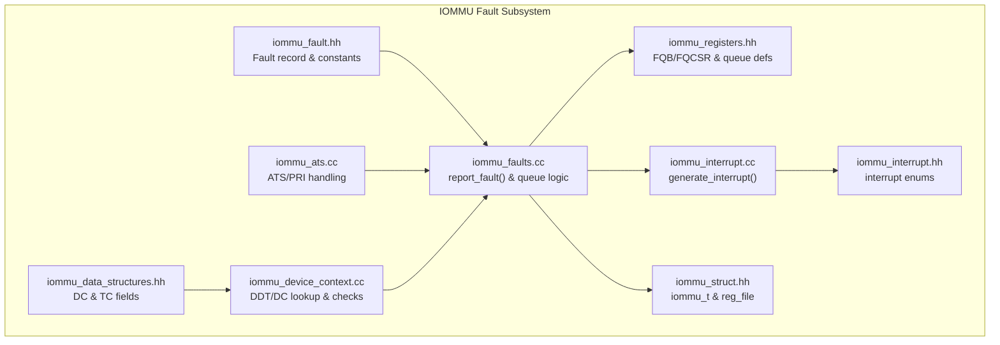
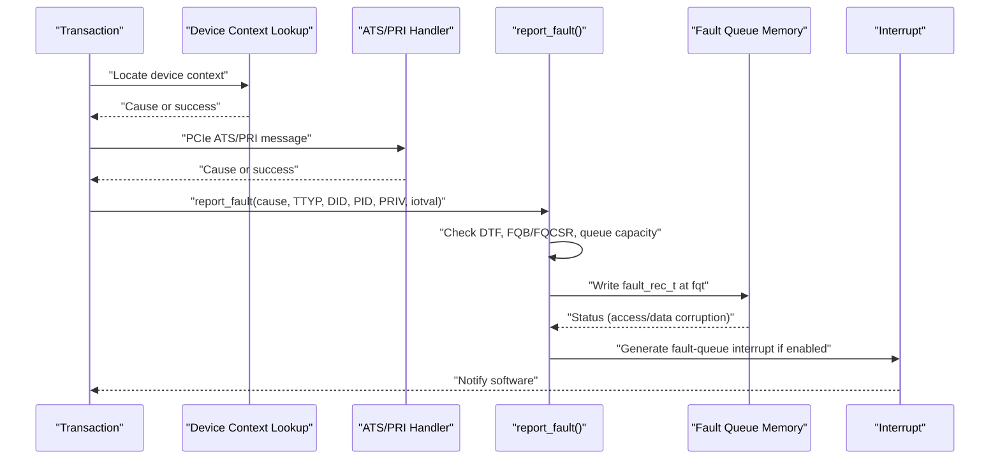
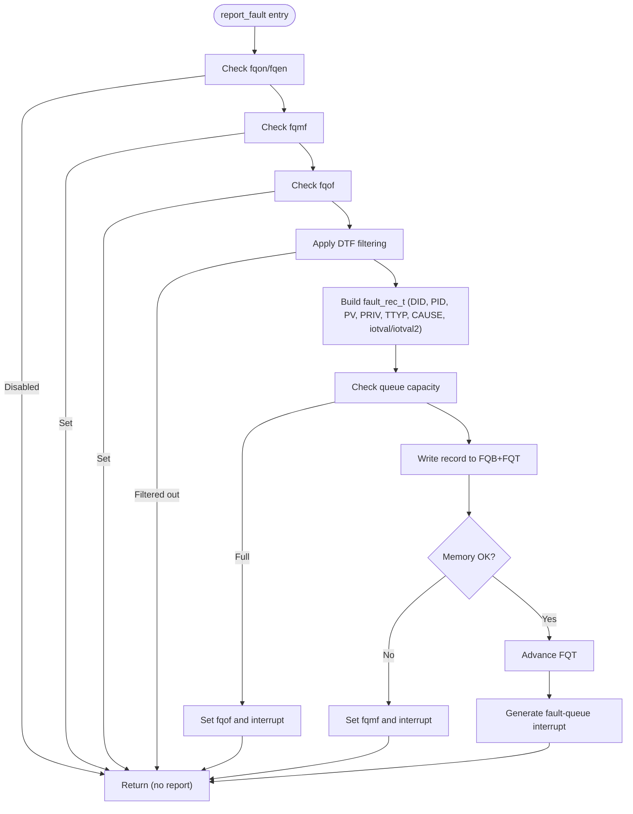
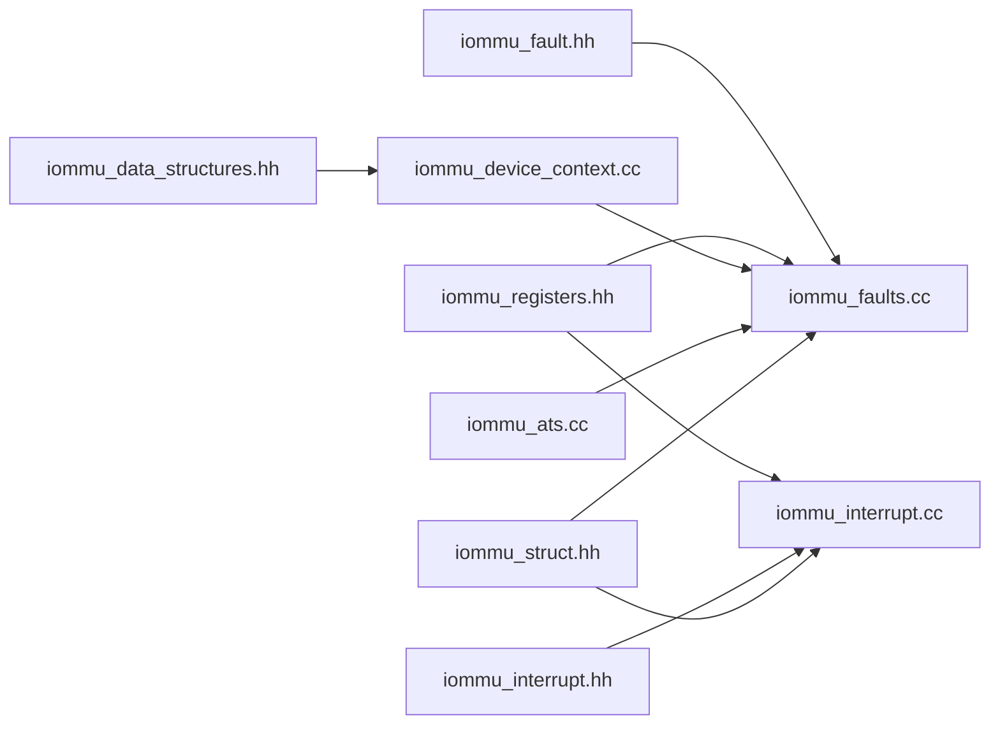

# Fault Detection and Classification

<cite>
**Referenced Files in This Document**
- [iommu_fault.hh](file://iommu/iommu_fault.hh)
- [iommu_faults.cc](file://iommu/iommu_faults.cc)
- [iommu_registers.hh](file://iommu/iommu_registers.hh)
- [iommu_interrupt.hh](file://iommu/iommu_interrupt.hh)
- [iommu_interrupt.cc](file://iommu/iommu_interrupt.cc)
- [iommu_data_structures.hh](file://iommu/iommu_data_structures.hh)
- [iommu_ats.cc](file://iommu/iommu_ats.cc)
- [iommu_device_context.cc](file://iommu/iommu_device_context.cc)
- [iommu_struct.hh](file://iommu/iommu_struct.hh)
</cite>

## Table of Contents
1. [Introduction](#introduction)
2. [Project Structure](#project-structure)
3. [Core Components](#core-components)
4. [Architecture Overview](#architecture-overview)
5. [Detailed Component Analysis](#detailed-component-analysis)
6. [Dependency Analysis](#dependency-analysis)
7. [Performance Considerations](#performance-considerations)
8. [Troubleshooting Guide](#troubleshooting-guide)
9. [Conclusion](#conclusion)

## Introduction
This document explains the IOMMU fault detection and classification mechanisms implemented in the codebase. It covers:
- Fault detection algorithms and the fault-queue reporting pipeline
- Fault type classifications and cause code assignments
- Fault record structure and bit-field layout
- Transaction type encodings for inbound transactions, PCIe ATS requests, and message requests
- The relationship between fault types and system states
- Examples of common fault scenarios and their classification outcomes

## Project Structure
The fault subsystem is primarily implemented in the iommu/ directory:
- Fault record definition and constants
- Fault reporting and queue management
- Register definitions for queue bases and status
- Interrupt generation for fault-queue events
- PCIe ATS and message handling that can trigger faults
- Device-context lookup and validation that can produce faults

**Diagram sources**
- [iommu_fault.hh:52-89](file://iommu/iommu_fault.hh#L52-L89)
- [iommu_faults.cc:8-159](file://iommu/iommu_faults.cc#L8-L159)
- [iommu_registers.hh:374-415](file://iommu/iommu_registers.hh#L374-L415)
- [iommu_interrupt.hh:8-25](file://iommu/iommu_interrupt.hh#L8-L25)
- [iommu_interrupt.cc:27-121](file://iommu/iommu_interrupt.cc#L27-L121)
- [iommu_data_structures.hh:29-130](file://iommu/iommu_data_structures.hh#L29-L130)
- [iommu_ats.cc:96-373](file://iommu/iommu_ats.cc#L96-L373)
- [iommu_device_context.cc:9-225](file://iommu/iommu_device_context.cc#L9-L225)
- [iommu_struct.hh:42-99](file://iommu/iommu_struct.hh#L42-L99)

**Section sources**
- [iommu_fault.hh:52-89](file://iommu/iommu_fault.hh#L52-L89)
- [iommu_faults.cc:8-159](file://iommu/iommu_faults.cc#L8-L159)
- [iommu_registers.hh:374-415](file://iommu/iommu_registers.hh#L374-L415)
- [iommu_interrupt.cc:27-121](file://iommu/iommu_interrupt.cc#L27-L121)
- [iommu_ats.cc:96-373](file://iommu/iommu_ats.cc#L96-L373)
- [iommu_device_context.cc:9-225](file://iommu/iommu_device_context.cc#L9-L225)
- [iommu_struct.hh:42-99](file://iommu/iommu_struct.hh#L42-L99)

## Core Components
- Fault record structure and fields:
  - CAUSE: 12-bit fault cause code
  - PID: 20-bit process identifier
  - PV: 1-bit process-id valid flag
  - PRIV: 1-bit privilege flag
  - TTYP: 6-bit inbound transaction type
  - DID: 24-bit device identifier
  - iotval/iotval2: 64-bit fault metadata
- Fault-queue base (FQB) and control/status (FQCSR) registers define the in-memory queue and its state
- DTF (Disable Translation Faults) policy controls which translation-related faults are reported
- Interrupt subsystem signals fault-queue events via MSI or wire interrupts

Key constants and encodings:
- Transaction types (TTYP): None, Untranslated read/exec/read/write-AMO, Translated read/exec/read/write-AMO, PCIe ATS Translation Request, Message Request
- Fault types: Access fault, Data corruption, Guest-stage page/access/corruption
- Cause codes include disallowed inbound transactions, DDT/DC load access fault, DDT entry not valid/misconfigured, MSI PT/data corruption, internal datapath error, IOMMU MSI write access fault, and S/VS/G-stage PT data corruption

**Section sources**
- [iommu_fault.hh:52-89](file://iommu/iommu_fault.hh#L52-L89)
- [iommu_faults.cc:86-90](file://iommu/iommu_faults.cc#L86-L90)
- [iommu_registers.hh:374-415](file://iommu/iommu_registers.hh#L374-L415)
- [iommu_interrupt.hh:16-25](file://iommu/iommu_interrupt.hh#L16-L25)

## Architecture Overview
The fault detection and reporting pipeline:
1. Transaction processing triggers a fault condition (e.g., DDT/DC lookup failure, ATS/PRI handling error, MSI write fault)
2. The IOMMU invokes the fault reporter with cause, TTYP, device/process info, and optional metadata
3. The reporter validates queue enablement and overflow/fault conditions
4. The fault record is written into the in-memory fault-queue at the current tail index
5. The tail index advances; overflow or memory access faults update FQCSR
6. An interrupt is generated if enabled and not already pending

**Diagram sources**
- [iommu_faults.cc:8-159](file://iommu/iommu_faults.cc#L8-L159)
- [iommu_ats.cc:96-373](file://iommu/iommu_ats.cc#L96-L373)
- [iommu_device_context.cc:9-225](file://iommu/iommu_device_context.cc#L9-L225)
- [iommu_interrupt.cc:27-121](file://iommu/iommu_interrupt.cc#L27-L121)

## Detailed Component Analysis

### Fault Record Structure and Bit Layout
The fault record is a 32-byte entry with the following bit-field layout:
- Bits 11:0: CAUSE (12-bit fault cause)
- Bits 31:12: PID (20-bit process ID)
- Bit 32: PV (1-bit process-id valid)
- Bit 33: PRIV (1-bit privilege)
- Bits 39:34: TTYP (6-bit inbound transaction type)
- Bits 63:40: DID (24-bit device ID)
- Bits 95:64: custom (32-bit custom use)
- Bits 127:96: reserved (32-bit reserved)
- Bits 191:128: iotval (64-bit fault metadata)
- Bits 255:192: iotval2 (64-bit secondary metadata)

The fault-queue base register (FQB) configures the base PPN and queue size; the tail index (FQT) points to the next record to be written; the head index (FQH) points to the next record for software consumption. Overflow and memory access fault conditions are tracked in FQCSR.

**Section sources**
- [iommu_fault.hh:52-77](file://iommu/iommu_fault.hh#L52-L77)
- [iommu_registers.hh:374-415](file://iommu/iommu_registers.hh#L374-L415)

### Fault Reporting Pipeline (report_fault)
The reporting function performs:
- Endianness selection based on fctl.be
- Early exit if fault-queue is disabled (fqon/fqen), or if memory fault (fqmf) or overflow (fqof) is set
- DTF filtering: when DTF=1, only specific non-translation faults are reported (e.g., inbound disallowed, DDT/DC faults, internal errors, MSI write access fault)
- PID/PRIV population based on pid_valid flag
- Writing the fault record to memory at address derived from FQB and FQT
- Handling memory access/data corruption by setting fqmf
- Advancing FQT on success; generating fault-queue interrupt

**Diagram sources**
- [iommu_faults.cc:8-159](file://iommu/iommu_faults.cc#L8-L159)

**Section sources**
- [iommu_faults.cc:8-159](file://iommu/iommu_faults.cc#L8-L159)

### Transaction Type Encodings (TTYP)
TTYP encodes the inbound transaction type that triggered the fault:
- None: 0
- Untranslated read for execute: 1
- Untranslated read: 2
- Untranslated write/AMO: 3
- Reserved: 4
- Translated read for execute: 5
- Translated read: 6
- Translated write/AMO: 7
- PCIe ATS Translation Request: 8
- Message Request: 9
- Reserved: 10–31
- Custom use: 31–63

These encodings are used to populate the TTYP field in the fault record.

**Section sources**
- [iommu_fault.hh:26-50](file://iommu/iommu_fault.hh#L26-L50)

### Fault Types and Cause Code Assignments
Fault types and representative cause codes:
- Access fault: generic memory access fault during fault-queue or MSI writes
- Data corruption: poisoned data detected during fault-queue or DDT/DC reads
- Guest-stage faults: guest page fault, guest access fault, guest data corruption
- Translation-related causes include instruction/read/write page faults and guest variants
- Non-translation faults include:
  - All inbound transactions disallowed
  - DDT entry load access fault
  - DDT entry not valid
  - DDT entry misconfigured
  - Transaction type disallowed
  - MSI PTE load access fault
  - MSI PTE not valid
  - MSI PTE misconfigured
  - MRIF access fault
  - PDT entry load access fault
  - PDT entry not valid
  - PDT entry misconfigured
  - DDT data corruption
  - MSI PT data corruption
  - MSI MRIF data corruption
  - Internal datapath error
  - IOMMU MSI write access fault
  - S/VS/G-stage PT data corruption

DTF filtering:
- When DTF=1, translation-related faults are suppressed except for a defined subset (e.g., inbound disallowed, DDT/DC faults, internal errors, MSI write access fault).

**Section sources**
- [iommu_fault.hh:78-85](file://iommu/iommu_fault.hh#L78-L85)
- [iommu_faults.cc:86-90](file://iommu/iommu_faults.cc#L86-L90)
- [iommu_ats.cc:117-130](file://iommu/iommu_ats.cc#L117-L130)
- [iommu_device_context.cc:136-161](file://iommu/iommu_device_context.cc#L136-L161)

### PCIe ATS Requests and Message Requests
- ATS/PRI handling:
  - Validates IOMMU mode and device ID width against DDT levels
  - Locates device context; if absent or misconfigured, reports appropriate cause
  - Enqueues page-request messages into the page-request queue (PQ) when enabled and not full/overflowing
  - Generates PRGR responses with status codes based on error conditions
- MSI write faults:
  - When MSI write fails due to access fault, triggers a fault with cause 273 and TTYP=0

**Section sources**
- [iommu_ats.cc:96-373](file://iommu/iommu_ats.cc#L96-L373)
- [iommu_interrupt.cc:8-26](file://iommu/iommu_interrupt.cc#L8-L26)

### Device Context Lookup and Validation
- DDT traversal and leaf DC read with PMA/PMP checks
- Data corruption detection (RAS-enabled)
- DC validity and configuration checks (reserved fields, QoS ID fields)
- Returns cause codes for load access fault, data corruption, not valid, misconfigured

**Section sources**
- [iommu_device_context.cc:9-225](file://iommu/iommu_device_context.cc#L9-L225)

### Interrupt Generation for Fault-Queue Events
- Fault-queue interrupt pending (fip) is set when a fault record is enqueued or an error bit changes state
- Interrupt generation respects per-source enable masks (fqcsr.fie) and pending bits (ipsr.fip)
- MSI or wire interrupts are generated based on fctl.wsi and MSI configuration table

**Section sources**
- [iommu_interrupt.cc:27-121](file://iommu/iommu_interrupt.cc#L27-L121)
- [iommu_registers.hh:550-564](file://iommu/iommu_registers.hh#L550-L564)
- [iommu_registers.hh:580-591](file://iommu/iommu_registers.hh#L580-L591)

## Dependency Analysis
The fault subsystem integrates several modules:
- Fault record definition and constants feed the reporting function
- Queue base and status registers govern memory access and capacity
- Interrupt subsystem consumes FQCSR state to generate events
- Device-context and ATS handlers produce causes that are reported via the same pipeline

**Diagram sources**
- [iommu_fault.hh:52-89](file://iommu/iommu_fault.hh#L52-L89)
- [iommu_faults.cc:8-159](file://iommu/iommu_faults.cc#L8-L159)
- [iommu_registers.hh:374-415](file://iommu/iommu_registers.hh#L374-L415)
- [iommu_interrupt.cc:27-121](file://iommu/iommu_interrupt.cc#L27-L121)
- [iommu_data_structures.hh:29-130](file://iommu/iommu_data_structures.hh#L29-L130)
- [iommu_device_context.cc:9-225](file://iommu/iommu_device_context.cc#L9-L225)
- [iommu_ats.cc:96-373](file://iommu/iommu_ats.cc#L96-L373)
- [iommu_struct.hh:42-99](file://iommu/iommu_struct.hh#L42-L99)

**Section sources**
- [iommu_fault.hh:52-89](file://iommu/iommu_fault.hh#L52-L89)
- [iommu_faults.cc:8-159](file://iommu/iommu_faults.cc#L8-L159)
- [iommu_registers.hh:374-415](file://iommu/iommu_registers.hh#L374-L415)
- [iommu_interrupt.cc:27-121](file://iommu/iommu_interrupt.cc#L27-L121)
- [iommu_data_structures.hh:29-130](file://iommu/iommu_data_structures.hh#L29-L130)
- [iommu_device_context.cc:9-225](file://iommu/iommu_device_context.cc#L9-L225)
- [iommu_ats.cc:96-373](file://iommu/iommu_ats.cc#L96-L373)
- [iommu_struct.hh:42-99](file://iommu/iommu_struct.hh#L42-L99)

## Performance Considerations
- Fault-queue depth and alignment constraints affect memory bandwidth and latency
- Frequent translation faults with DTF enabled reduce reporting overhead for translation-related faults
- MSI vs wire interrupt modes impact interrupt latency and power
- ATS/PRI message processing adds queueing overhead; ensure PQ is sized appropriately

## Troubleshooting Guide
Common symptoms and diagnostics:
- Fault-queue overflow (fqof):
  - Indicates the queue is full; software must advance FQH; consider increasing queue size or reducing fault rate
- Fault-queue memory fault (fqmf):
  - Indicates memory access failure to the fault-queue; investigate memory mapping and PMA/PMP policies
- DTF filtering:
  - If translation-related faults are missing, confirm DTF configuration and review the filtered cause list
- ATS/PRI errors:
  - Check IOMMU mode, device ID width, and DDT levels; validate device context presence and configuration
- MSI write failures:
  - Verify MSI address and data; ensure MSI configuration table is valid and not masked

Operational steps:
- Inspect FQCSR for fqof/fqmf and pending interrupt flags
- Drain the fault-queue by advancing FQH and reading records
- Reconfigure queue base and size via FQB; re-enable via fqen/fqon
- Review device context configuration and DDT entries for misconfigurations

**Section sources**
- [iommu_faults.cc:23-44](file://iommu/iommu_faults.cc#L23-L44)
- [iommu_faults.cc:129-133](file://iommu/iommu_faults.cc#L129-L133)
- [iommu_interrupt.cc:46-78](file://iommu/iommu_interrupt.cc#L46-L78)
- [iommu_ats.cc:117-130](file://iommu/iommu_ats.cc#L117-L130)
- [iommu_device_context.cc:136-161](file://iommu/iommu_device_context.cc#L136-L161)

## Conclusion
The IOMMU fault detection and classification system provides a robust, standardized mechanism for capturing and reporting faults across translation, ATS/PRI, and MSI pathways. The fault record structure cleanly separates cause, transaction type, device/process identity, and metadata, while the fault-queue and interrupt infrastructure ensures timely notification to software. DTF filtering and queue state management offer flexibility to balance observability and performance.