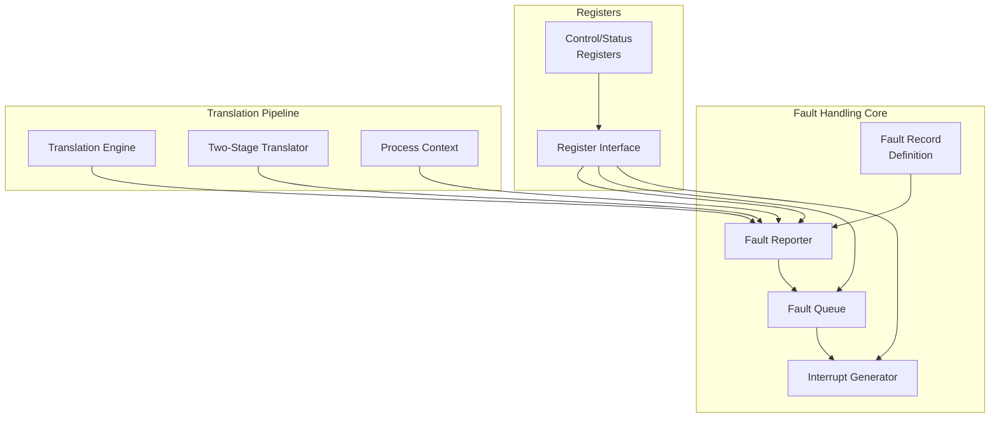
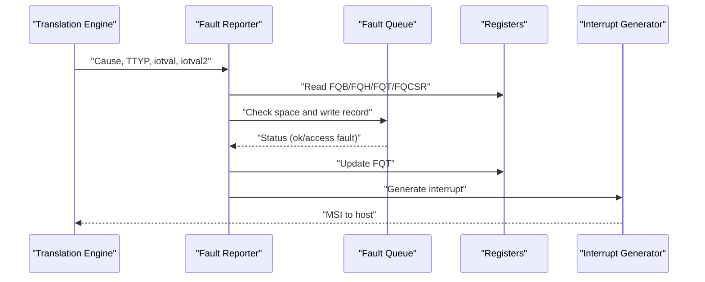
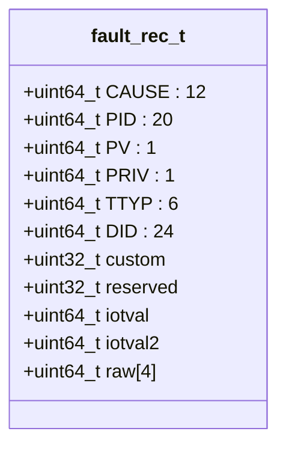
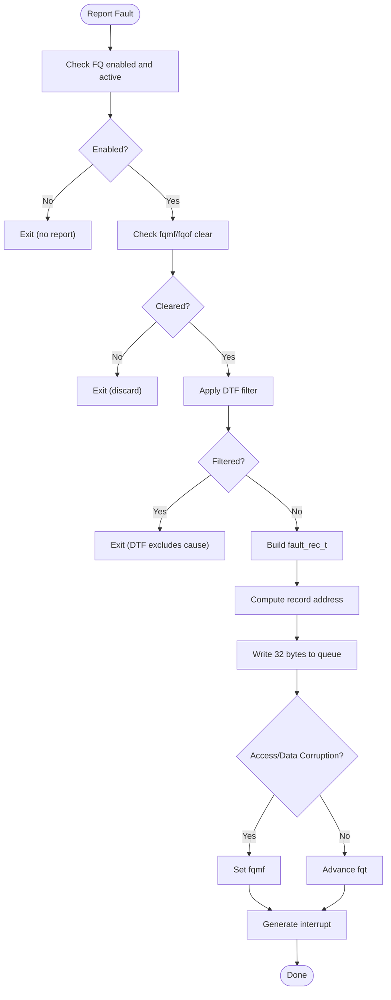
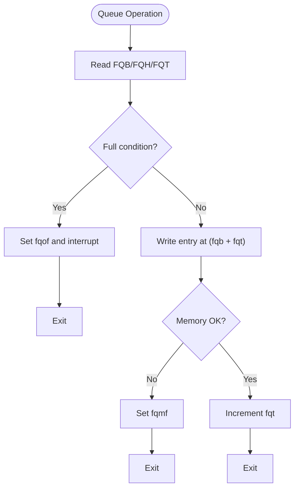
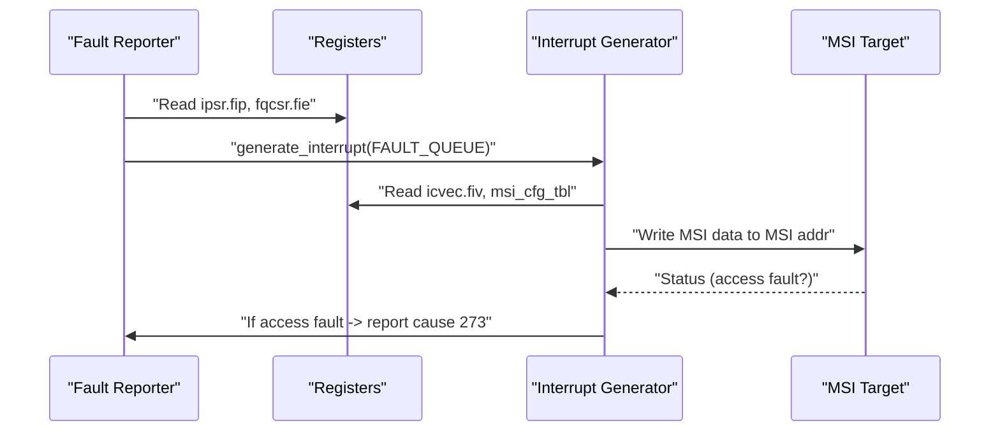
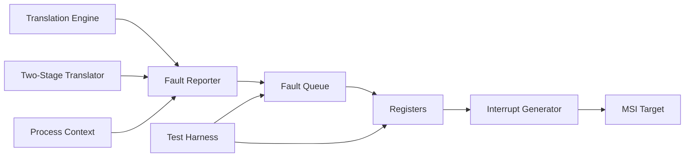

# Fault Handling System

<cite>
**Referenced Files in This Document**
- [iommu_fault.hh](file://iommu/iommu_fault.hh)
- [iommu_faults.cc](file://iommu/iommu_faults.cc)
- [iommu_interrupt.hh](file://iommu/iommu_interrupt.hh)
- [iommu_interrupt.cc](file://iommu/iommu_interrupt.cc)
- [iommu_registers.hh](file://iommu/iommu_registers.hh)
- [iommu_reg.cc](file://iommu/iommu_reg.cc)
- [iommu_struct.hh](file://iommu/iommu_struct.hh)
- [iommu_translate.cc](file://iommu/iommu_translate.cc)
- [iommu_two_stage_trans.cc](file://iommu/iommu_two_stage_trans.cc)
- [iommu_process_context.cc](file://iommu/iommu_process_context.cc)
- [test_rp_func.cc](file://rp/test_rp_func.cc)
</cite>

## Table of Contents
1. [Introduction](#introduction)
2. [Project Structure](#project-structure)
3. [Core Components](#core-components)
4. [Architecture Overview](#architecture-overview)
5. [Detailed Component Analysis](#detailed-component-analysis)
6. [Dependency Analysis](#dependency-analysis)
7. [Performance Considerations](#performance-considerations)
8. [Troubleshooting Guide](#troubleshooting-guide)
9. [Conclusion](#conclusion)

## Introduction
This document describes the IOMMU fault handling system in detail. It explains how faults are detected during address translation and device transactions, how fault records are classified by cause and type, and how fault information is reported via the fault queue and interrupts. It also covers fault queue operations, interrupt generation, recovery mechanisms, and system state management during faults. The document includes practical examples of common fault scenarios, diagnostic procedures, and troubleshooting approaches.

## Project Structure
The IOMMU fault handling system is implemented across several modules:
- Fault record definition and reporting API
- Fault queue management and overflow handling
- Interrupt generation and masking
- Register interface for queue control and status
- Translation pipeline that triggers faults
- Test harness validating fault record correctness

**Diagram sources**
- [iommu_fault.hh:52-89](file://iommu/iommu_fault.hh#L52-L89)
- [iommu_faults.cc:8-159](file://iommu/iommu_faults.cc#L8-L159)
- [iommu_interrupt.cc:27-106](file://iommu/iommu_interrupt.cc#L27-L106)
- [iommu_registers.hh:374-415](file://iommu/iommu_registers.hh#L374-L415)
- [iommu_reg.cc:296-321](file://iommu/iommu_reg.cc#L296-L321)
- [iommu_translate.cc:9-112](file://iommu/iommu_translate.cc#L9-L112)
- [iommu_two_stage_trans.cc:530-561](file://iommu/iommu_two_stage_trans.cc#L530-L561)
- [iommu_process_context.cc:102-114](file://iommu/iommu_process_context.cc#L102-L114)

**Section sources**
- [iommu_fault.hh:52-89](file://iommu/iommu_fault.hh#L52-L89)
- [iommu_faults.cc:8-159](file://iommu/iommu_faults.cc#L8-L159)
- [iommu_interrupt.cc:27-106](file://iommu/iommu_interrupt.cc#L27-L106)
- [iommu_registers.hh:374-415](file://iommu/iommu_registers.hh#L374-L415)
- [iommu_reg.cc:296-321](file://iommu/iommu_reg.cc#L296-L321)
- [iommu_translate.cc:9-112](file://iommu/iommu_translate.cc#L9-L112)
- [iommu_two_stage_trans.cc:530-561](file://iommu/iommu_two_stage_trans.cc#L530-L561)
- [iommu_process_context.cc:102-114](file://iommu/iommu_process_context.cc#L102-L114)

## Core Components
- Fault record format: A 256-bit record containing cause, device and process identifiers, transaction type, and optional diagnostic fields.
- Fault reporter: Validates queue state, constructs a fault record, writes it to the in-memory fault queue, and triggers an interrupt.
- Fault queue: A circular buffer with head/tail indices and a base address; tracks overflow and memory access faults.
- Interrupt controller: Generates MSI interrupts for fault conditions, honoring mask bits and pending status.
- Registers: Control and status registers for fault queue enable/interrupts, plus queue base and indices.
- Translation pipeline: Detects access faults and data corruption during translation, classifies causes, and invokes fault reporting.

**Section sources**
- [iommu_fault.hh:52-89](file://iommu/iommu_fault.hh#L52-L89)
- [iommu_faults.cc:8-159](file://iommu/iommu_faults.cc#L8-L159)
- [iommu_interrupt.hh:16-25](file://iommu/iommu_interrupt.hh#L16-L25)
- [iommu_interrupt.cc:27-106](file://iommu/iommu_interrupt.cc#L27-L106)
- [iommu_registers.hh:374-415](file://iommu/iommu_registers.hh#L374-L415)
- [iommu_translate.cc:9-112](file://iommu/iommu_translate.cc#L9-L112)

## Architecture Overview
The fault handling architecture integrates fault detection in the translation pipeline with a memory-mapped fault queue and MSI interrupt generation. The flow is:
- Translation engine detects a fault and determines the cause and transaction type.
- Fault reporter validates queue readiness and writes a fault record to the queue.
- Fault queue status and overflow conditions are tracked in control/status registers.
- Interrupt generator emits MSI when enabled and not masked.

**Diagram sources**
- [iommu_translate.cc:9-112](file://iommu/iommu_translate.cc#L9-L112)
- [iommu_faults.cc:8-159](file://iommu/iommu_faults.cc#L8-L159)
- [iommu_registers.hh:374-415](file://iommu/iommu_registers.hh#L374-L415)
- [iommu_interrupt.cc:27-106](file://iommu/iommu_interrupt.cc#L27-L106)

## Detailed Component Analysis

### Fault Record Format and Classification
- Fault record fields include:
  - Cause: 12-bit fault cause code.
  - PID/PV/PRIV: Process ID and validity/privilege.
  - TTYP: Transaction type.
  - DID: Device ID.
  - iotval/iotval2: Diagnostic values.
  - Custom/reserved fields for implementation-specific use.
- Transaction types classify inbound transactions (untranslated/read-for-execute, translated/read-for-execute, PCIe ATS translation, etc.).
- Causes include access faults, page faults, data corruption, guest-stage faults, and internal errors.

**Diagram sources**
- [iommu_fault.hh:63-77](file://iommu/iommu_fault.hh#L63-L77)

**Section sources**
- [iommu_fault.hh:52-89](file://iommu/iommu_fault.hh#L52-L89)

### Fault Reporting Workflow
- Validation:
  - Fault queue must be enabled and active.
  - Fault queue memory fault (fqmf) and overflow (fqof) bits must be clear.
  - DTF filtering: When DTF is set, only specific causes are reported.
- Record construction:
  - Populate DID, PID/PV/PRIV, TTYP, CAUSE, and diagnostic fields.
- Queue write:
  - Compute record address from base and index.
  - Write 32 bytes; on access fault or data corruption, set fqmf.
  - Advance fqt on success.
- Interrupt:
  - Set pending bit and generate MSI if enabled and not masked.

**Diagram sources**
- [iommu_faults.cc:8-159](file://iommu/iommu_faults.cc#L8-L159)
- [iommu_registers.hh:374-415](file://iommu/iommu_registers.hh#L374-L415)

**Section sources**
- [iommu_faults.cc:8-159](file://iommu/iommu_faults.cc#L8-L159)

### Fault Queue Operations
- Queue configuration:
  - Base address and size are set via FQB (log2szm1 and PPN).
  - Head (FQH) and Tail (FQT) indices control consumption and production.
- Full/Empty conditions:
  - Empty: FQH == FQT.
  - Full: FQT == (FQH - 1) modulo queue size.
- Overflow handling:
  - On full condition, fqof is set and interrupt is generated.
  - Subsequent fault records are discarded until fqof is cleared.
- Memory access faults:
  - If memory access fails, fqmf is set and interrupts are generated.

**Diagram sources**
- [iommu_faults.cc:126-156](file://iommu/iommu_faults.cc#L126-L156)
- [iommu_registers.hh:374-415](file://iommu/iommu_registers.hh#L374-L415)

**Section sources**
- [iommu_faults.cc:126-156](file://iommu/iommu_faults.cc#L126-L156)
- [iommu_reg.cc:296-321](file://iommu/iommu_reg.cc#L296-L321)

### Interrupt Generation for Fault Conditions
- Pending status:
  - ipsr.fip indicates fault-queue interrupt pending.
- Masking:
  - fqcsr.fie enables fault-queue interrupts.
  - MSI vector control masks per vector via msi_vec_ctrl.m.
- MSI delivery:
  - MSI address/data are read from configuration table indexed by vector.
  - On MSI write access fault, a specific cause is reported with diagnostic values.

**Diagram sources**
- [iommu_interrupt.cc:27-106](file://iommu/iommu_interrupt.cc#L27-L106)
- [iommu_interrupt.hh:16-25](file://iommu/iommu_interrupt.hh#L16-L25)
- [iommu_faults.cc:145-157](file://iommu/iommu_faults.cc#L145-L157)

**Section sources**
- [iommu_interrupt.cc:27-106](file://iommu/iommu_interrupt.cc#L27-L106)
- [iommu_faults.cc:145-157](file://iommu/iommu_faults.cc#L145-L157)

### Fault Handling Procedures and Recovery
- Immediate actions:
  - Clear fqof/fqmf by writing 1 to corresponding bits in fqcsr.
  - Advance fqh to consume fault records.
- Recovery steps:
  - Fix underlying memory or configuration causing access faults.
  - Re-enable fault queue if disabled.
  - Resume normal operation after diagnostics.
- System state:
  - ipsr.fip remains set until cleared by software.
  - Pending MSI delivery resumes when mask is cleared.

**Section sources**
- [iommu_reg.cc:433-493](file://iommu/iommu_reg.cc#L433-L493)
- [iommu_interrupt.cc:107-120](file://iommu/iommu_interrupt.cc#L107-L120)

### Common Fault Scenarios and Examples
- Instruction/Read/Write access faults:
  - Detected during translation; cause codes reflect access type.
  - TTYP reflects whether untranslated or translated, and read/execute intent.
- Data corruption in page tables:
  - Cause 274 for first/second-stage PT corruption; often indicates memory subsystem issues.
- Guest-stage faults:
  - Causes 0x21/0x22/0x23 for guest page/access/data corruption.
- MSI write access fault:
  - Cause 273 when MSI target address is inaccessible; iotval carries the MSI address.
- DDT/PDT faults:
  - Causes 257–259 and 265–269 for entry load/access/misconfiguration/data corruption.
- Internal datapath error:
  - Cause 272 indicates internal IOMMU error; requires deeper diagnostics.

**Section sources**
- [iommu_translate.cc:96-112](file://iommu/iommu_translate.cc#L96-L112)
- [iommu_two_stage_trans.cc:530-561](file://iommu/iommu_two_stage_trans.cc#L530-L561)
- [iommu_process_context.cc:102-114](file://iommu/iommu_process_context.cc#L102-L114)
- [iommu_faults.cc:86-90](file://iommu/iommu_faults.cc#L86-L90)

### Diagnostic Procedures and Troubleshooting
- Verify queue configuration:
  - Confirm FQB base and size, FQH/FQT indices, and fqcsr state.
- Inspect fault records:
  - Read entries via fqh and validate fields (CAUSE, TTYP, DID, PID/PV/PRIV, iotval, iotval2).
- Check interrupt status:
  - Clear ipsr.fip and ensure fqcsr.fie is set appropriately.
- Validate MSI:
  - Confirm MSI address/data and vector mask; retry MSI delivery if pending.
- Reproduce and isolate:
  - Narrow down by disabling DTF to capture translation-related faults, or keep DTF to suppress them.

**Section sources**
- [test_rp_func.cc:91-152](file://rp/test_rp_func.cc#L91-L152)
- [iommu_reg.cc:433-493](file://iommu/iommu_reg.cc#L433-L493)
- [iommu_interrupt.cc:107-120](file://iommu/iommu_interrupt.cc#L107-L120)

## Dependency Analysis
The fault handling system depends on:
- Translation pipeline to detect and classify faults.
- Register interface to configure queues and control interrupts.
- Interrupt controller to deliver MSI notifications.
- Test harness to validate fault record correctness.

**Diagram sources**
- [iommu_translate.cc:9-112](file://iommu/iommu_translate.cc#L9-L112)
- [iommu_two_stage_trans.cc:530-561](file://iommu/iommu_two_stage_trans.cc#L530-L561)
- [iommu_process_context.cc:102-114](file://iommu/iommu_process_context.cc#L102-L114)
- [iommu_faults.cc:8-159](file://iommu/iommu_faults.cc#L8-L159)
- [iommu_interrupt.cc:27-106](file://iommu/iommu_interrupt.cc#L27-L106)
- [test_rp_func.cc:91-152](file://rp/test_rp_func.cc#L91-L152)

**Section sources**
- [iommu_translate.cc:9-112](file://iommu/iommu_translate.cc#L9-L112)
- [iommu_faults.cc:8-159](file://iommu/iommu_faults.cc#L8-L159)
- [iommu_interrupt.cc:27-106](file://iommu/iommu_interrupt.cc#L27-L106)
- [test_rp_func.cc:91-152](file://rp/test_rp_func.cc#L91-L152)

## Performance Considerations
- Fault queue sizing: Larger queues reduce overflow risk but increase memory footprint.
- MSI latency: MSI delivery adds overhead; batching fault processing can improve throughput.
- DTF impact: Enabling DTF reduces fault volume by suppressing translation-related faults, easing diagnostics but potentially hiding issues.
- Endianness and alignment: Properly aligning queue base and entries avoids extra checks and improves memory access performance.

## Troubleshooting Guide
- Symptoms:
  - Frequent fqof: Increase queue size or reduce fault rate.
  - Persistent fqmf: Investigate memory subsystem or queue base alignment.
  - Unmasked interrupts: Review fqcsr.fie and MSI vector masks.
- Steps:
  - Clear fqcsr bits and advance fqh.
  - Validate MSI configuration and retry delivery.
  - Use DTF selectively to focus on non-translation faults.
  - Cross-check fault records against expected TTYP and DID.

**Section sources**
- [iommu_faults.cc:134-157](file://iommu/iommu_faults.cc#L134-L157)
- [iommu_interrupt.cc:89-106](file://iommu/iommu_interrupt.cc#L89-L106)
- [test_rp_func.cc:91-152](file://rp/test_rp_func.cc#L91-L152)

## Conclusion
The IOMMU fault handling system provides robust detection, classification, and reporting of address translation and device-related faults. Its memory-mapped fault queue, combined with MSI interrupts and clear control/status registers, enables efficient diagnostics and recovery. Understanding fault record fields, queue operations, and interrupt behavior is essential for effective troubleshooting and system stability.