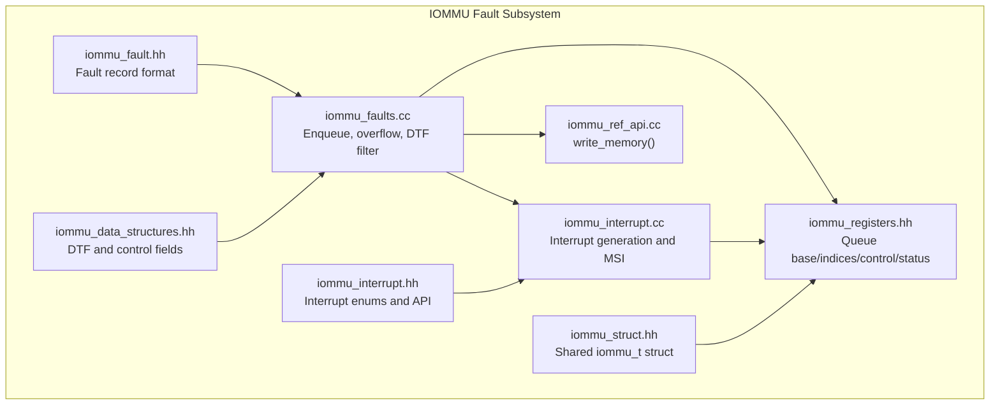
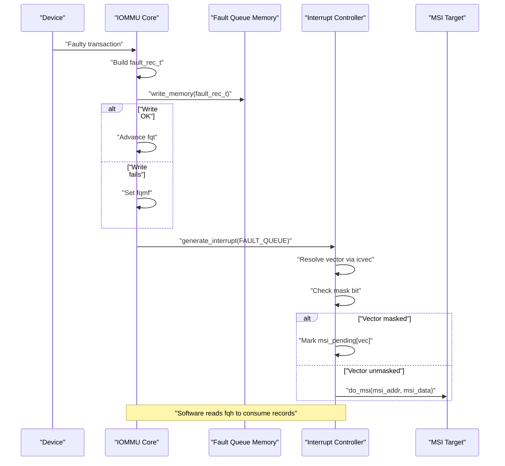
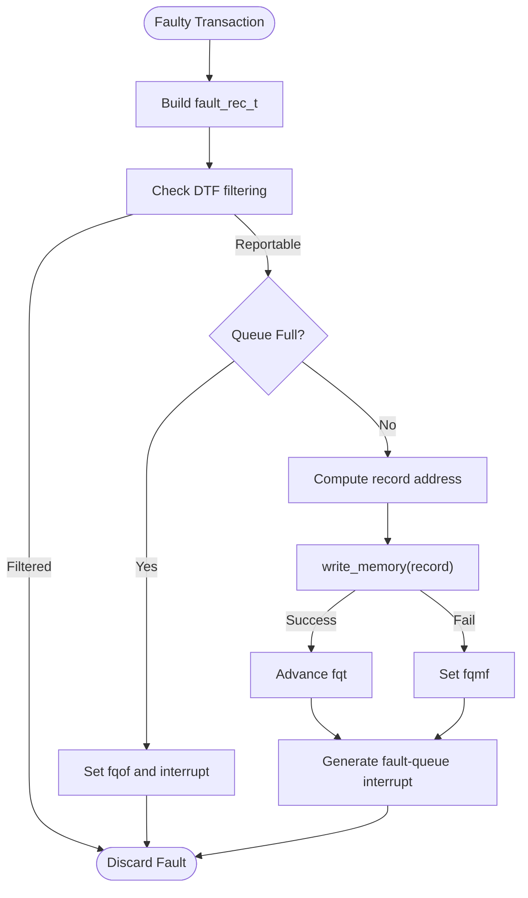
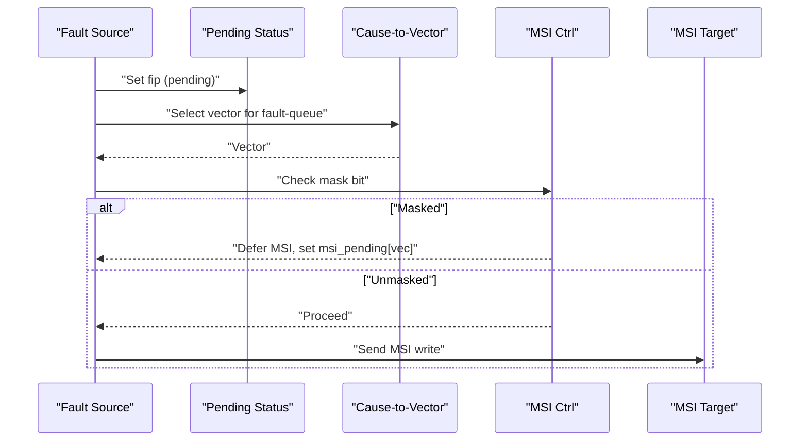
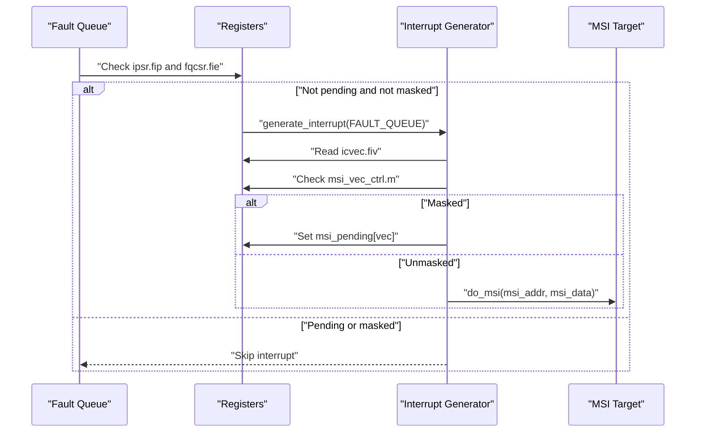
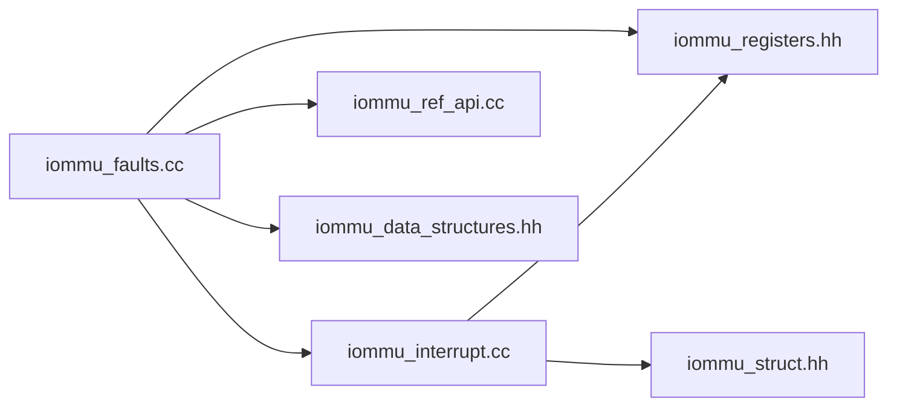

# Fault Reporting and Queue Management

<cite>
**Referenced Files in This Document**
- [iommu_fault.hh](file://iommu/iommu_fault.hh)
- [iommu_faults.cc](file://iommu/iommu_faults.cc)
- [iommu_interrupt.hh](file://iommu/iommu_interrupt.hh)
- [iommu_interrupt.cc](file://iommu/iommu_interrupt.cc)
- [iommu_registers.hh](file://iommu/iommu_registers.hh)
- [iommu_struct.hh](file://iommu/iommu_struct.hh)
- [iommu_data_structures.hh](file://iommu/iommu_data_structures.hh)
- [iommu_ref_api.cc](file://iommu/iommu_ref_api.cc)
- [main.cpp](file://main.cpp)
- [iommu_top.hh](file://iommu/iommu_top.hh)
</cite>

## Table of Contents
1. [Introduction](#introduction)
2. [Project Structure](#project-structure)
3. [Core Components](#core-components)
4. [Architecture Overview](#architecture-overview)
5. [Detailed Component Analysis](#detailed-component-analysis)
6. [Dependency Analysis](#dependency-analysis)
7. [Performance Considerations](#performance-considerations)
8. [Troubleshooting Guide](#troubleshooting-guide)
9. [Conclusion](#conclusion)

## Introduction
This document explains the fault reporting and queue management subsystem of the IOMMU model. It covers the fault queue architecture, fault record formatting, enqueue and dequeue semantics, interrupt generation and masking, vector control, depth management and overflow handling, and persistence of fault records in memory. It also provides end-to-end workflows for fault reporting and interrupt delivery, along with configuration and priority handling.

## Project Structure
The fault subsystem is implemented across several IOMMU source files:
- Fault record definition and reporting API
- Fault queue enqueue logic and overflow handling
- Interrupt generation and MSI delivery
- Register definitions for queue bases, indices, and control/status
- Shared structures and utilities for memory access and endianness

**Diagram sources**
- [iommu_fault.hh:63-77](file://iommu/iommu_fault.hh#L63-L77)
- [iommu_faults.cc:8-159](file://iommu/iommu_faults.cc#L8-L159)
- [iommu_interrupt.hh:8-25](file://iommu/iommu_interrupt.hh#L8-L25)
- [iommu_interrupt.cc:27-106](file://iommu/iommu_interrupt.cc#L27-L106)
- [iommu_registers.hh:374-415](file://iommu/iommu_registers.hh#L374-L415)
- [iommu_struct.hh:42-99](file://iommu/iommu_struct.hh#L42-L99)
- [iommu_data_structures.hh:67-73](file://iommu/iommu_data_structures.hh#L67-L73)
- [iommu_ref_api.cc:39](file://iommu/iommu_ref_api.cc#L39)

**Section sources**
- [iommu_fault.hh:1-90](file://iommu/iommu_fault.hh#L1-L90)
- [iommu_faults.cc:1-160](file://iommu/iommu_faults.cc#L1-L160)
- [iommu_interrupt.hh:1-26](file://iommu/iommu_interrupt.hh#L1-L26)
- [iommu_interrupt.cc:1-121](file://iommu/iommu_interrupt.cc#L1-L121)
- [iommu_registers.hh:374-415](file://iommu/iommu_registers.hh#L374-L415)
- [iommu_struct.hh:1-102](file://iommu/iommu_struct.hh#L1-L102)
- [iommu_data_structures.hh:67-73](file://iommu/iommu_data_structures.hh#L67-L73)
- [iommu_ref_api.cc:39](file://iommu/iommu_ref_api.cc#L39)

## Core Components
- Fault record format: Fixed-size 32-byte record containing cause, device/process identifiers, privilege, transaction type, and optional guest translation values.
- Fault queue: In-memory ring buffer defined by a base page and log2-sized field; managed by head (software) and tail (IOMMU) indices.
- Enqueue logic: Validates queue capacity, writes record to memory, advances tail, and triggers interrupt.
- Overflow handling: Sets overflow flag and interrupts when queue is full; faults are discarded until cleared.
- Interrupt generation: Selects vector via cause-to-vector mapping, checks masking, and sends MSI or wire interrupt.
- DTF filtering: Optional suppression of translation-related faults based on DTF bit.

**Section sources**
- [iommu_fault.hh:52-88](file://iommu/iommu_fault.hh#L52-L88)
- [iommu_faults.cc:113-159](file://iommu/iommu_faults.cc#L113-L159)
- [iommu_interrupt.cc:27-106](file://iommu/iommu_interrupt.cc#L27-L106)
- [iommu_data_structures.hh:67-73](file://iommu/iommu_data_structures.hh#L67-L73)

## Architecture Overview
The fault subsystem integrates tightly with the IOMMU register file and interrupt controller. Faults are enqueued into a memory-resident queue and reported via interrupts. The interrupt controller resolves vectors, checks masks, and emits MSI writes.

**Diagram sources**
- [iommu_faults.cc:8-159](file://iommu/iommu_faults.cc#L8-L159)
- [iommu_interrupt.cc:27-106](file://iommu/iommu_interrupt.cc#L27-L106)
- [iommu_registers.hh:374-415](file://iommu/iommu_registers.hh#L374-L415)

## Detailed Component Analysis

### Fault Record Format and Fields
The fault record is a 32-byte structure with the following key fields:
- Cause: 12-bit fault identifier
- Process/Virtualization: PID (20 bits), PV (valid), PRIV (privilege)
- Transaction Type: TTYP (6 bits)
- Device Identifier: DID (24 bits)
- Custom/reserved: 32-bit custom and reserved fields
- Guest translation values: iotval and iotval2 (64 bits each)

These fields are packed into a 4x64-bit array for efficient memory access and endianness handling.

**Section sources**
- [iommu_fault.hh:52-88](file://iommu/iommu_fault.hh#L52-L88)

### Fault Queue Architecture and Operations
- Queue base: Configured via a 64-bit register holding PPN and log2szm1 for capacity.
- Indices:
  - Head (fqh): Software-controlled index of next record to consume.
  - Tail (fqt): IOMMU-controlled index of next record to write.
- Depth and wrap-around: Capacity is 2^(log2szm1 + 1), with modulo arithmetic on indices.
- Empty/full detection: Queue is empty when fqh == fqt; full when fqt == (fqh - 1) mod capacity.

Enqueue steps:
1. Compute next tail index; if full, set overflow flag and interrupt.
2. Compute physical address of next record slot using base and index.
3. Perform memory write of the 32-byte record.
4. On success, advance fqt; on failure, set memory-fault flag.
5. Trigger fault-queue interrupt if not already pending and not masked.

Overflow handling:
- When full, the record is discarded; fqof is set and interrupt is generated.
- Until software clears fqof, no further fault records are enqueued.

Memory access faults:
- If the computed record address is outside physical address limits, a memory fault is recorded and fqmf is set.

**Section sources**
- [iommu_registers.hh:374-415](file://iommu/iommu_registers.hh#L374-L415)
- [iommu_faults.cc:113-159](file://iommu/iommu_faults.cc#L113-L159)

### Fault Reporting Workflow
End-to-end flow:
1. Device initiates a transaction that causes a fault.
2. IOMMU constructs a fault_rec_t with cause, device ID, process info, TTYP, and guest translation values.
3. IOMMU checks DTF filtering and queue availability.
4. If available, IOMMU writes the record to the fault queue and advances fqt.
5. IOMMU triggers a fault-queue interrupt.
6. Software polls or waits for interrupt, then reads records from the queue using fqh.

**Diagram sources**
- [iommu_faults.cc:8-159](file://iommu/iommu_faults.cc#L8-L159)

**Section sources**
- [iommu_faults.cc:8-159](file://iommu/iommu_faults.cc#L8-L159)

### Interrupt Generation and Vector Control
Interrupt pipeline:
- Pending status: Each source has a pending bit in the interrupt-pending status register; cleared by software after servicing.
- Cause-to-vector mapping: icvec maps causes to vectors per source.
- Masking: MSI vector control includes a mask bit; if set, the vector is masked and MSI is deferred until cleared.
- Delivery: If unmasked, MSI is sent to the configured address/data pair; if masked, the controller defers the MSI until the mask is cleared.

**Diagram sources**
- [iommu_interrupt.cc:27-106](file://iommu/iommu_interrupt.cc#L27-L106)
- [iommu_registers.hh:630-640](file://iommu/iommu_registers.hh#L630-L640)

**Section sources**
- [iommu_interrupt.hh:8-25](file://iommu/iommu_interrupt.hh#L8-L25)
- [iommu_interrupt.cc:27-106](file://iommu/iommu_interrupt.cc#L27-L106)
- [iommu_registers.hh:630-640](file://iommu/iommu_registers.hh#L630-L640)

### Fault Interrupt Generation Sequence
- The fault reporting routine checks pending and mask bits before proceeding.
- If conditions are met, it selects the vector from icvec, marks the pending bit, and invokes the generic interrupt generator.
- The interrupt generator resolves the MSI address/data and mask state, then performs the MSI write or defers it.

**Diagram sources**
- [iommu_interrupt.cc:27-106](file://iommu/iommu_interrupt.cc#L27-L106)
- [iommu_registers.hh:550-564](file://iommu/iommu_registers.hh#L550-L564)

**Section sources**
- [iommu_interrupt.cc:27-106](file://iommu/iommu_interrupt.cc#L27-L106)

### Fault Queue Depth Management and Overflow Handling
- Capacity: 2^(log2szm1 + 1) entries.
- Empty/full detection uses modulo arithmetic on indices.
- Overflow path:
  - Full check computes next tail and compares to head; if equal, set fqof and interrupt.
  - Once fqof is set, no further fault records are enqueued until cleared by software.
- Memory-fault path:
  - If the record address is out of bounds, set fqmf and treat as a memory fault; interrupt is still generated.

**Section sources**
- [iommu_registers.hh:374-415](file://iommu/iommu_registers.hh#L374-L415)
- [iommu_faults.cc:129-156](file://iommu/iommu_faults.cc#L129-L156)

### Fault Record Persistence
- Records are persisted in memory at a location derived from the fault-queue base and the current tail index.
- Endianness is determined by the fault control register and applied during memory writes.
- Access faults during persistence set the memory-fault bit and are reported as faults themselves.

**Section sources**
- [iommu_faults.cc:145-156](file://iommu/iommu_faults.cc#L145-L156)
- [iommu_ref_api.cc:39](file://iommu/iommu_ref_api.cc#L39)

### Fault Queue Configuration and Priority Handling
- Configuration:
  - fqb: base PPN and log2szm1 define queue capacity and alignment.
  - fqh/fqt: software and IOMMU indices.
  - fqcsr: enable, interrupt enable, overflow, memory-fault, and online status.
- Priority:
  - The fault-queue interrupt is one of several sources; pending bits prevent duplicate interrupts until cleared.
  - Vector selection via icvec allows prioritizing fault notifications on a per-source basis.

**Section sources**
- [iommu_registers.hh:374-415](file://iommu/iommu_registers.hh#L374-L415)
- [iommu_registers.hh:550-564](file://iommu/iommu_registers.hh#L550-L564)
- [iommu_registers.hh:630-640](file://iommu/iommu_registers.hh#L630-L640)

### Integration with the Interrupt System for Fault Notification Delivery
- The interrupt generator is shared across sources (command queue, page queue, fault queue, HPM).
- For fault-queue interrupts, the generator checks pending and mask bits, resolves the vector, and emits MSI or defers it.
- Software must clear pending bits and service the queue to allow further interrupts.

**Section sources**
- [iommu_interrupt.hh:8-25](file://iommu/iommu_interrupt.hh#L8-L25)
- [iommu_interrupt.cc:27-106](file://iommu/iommu_interrupt.cc#L27-L106)

## Dependency Analysis
The fault subsystem depends on:
- Register definitions for queue base, indices, and control/status.
- Interrupt controller for vector resolution and MSI emission.
- Memory access abstraction for record writes and MSI writes.
- Shared iommu_t structure for global state and pending MSI tracking.

**Diagram sources**
- [iommu_faults.cc:8-159](file://iommu/iommu_faults.cc#L8-L159)
- [iommu_interrupt.cc:27-106](file://iommu/iommu_interrupt.cc#L27-L106)
- [iommu_registers.hh:374-415](file://iommu/iommu_registers.hh#L374-L415)
- [iommu_struct.hh:42-99](file://iommu/iommu_struct.hh#L42-L99)
- [iommu_data_structures.hh:67-73](file://iommu/iommu_data_structures.hh#L67-L73)
- [iommu_ref_api.cc:39](file://iommu/iommu_ref_api.cc#L39)

**Section sources**
- [iommu_faults.cc:8-159](file://iommu/iommu_faults.cc#L8-L159)
- [iommu_interrupt.cc:27-106](file://iommu/iommu_interrupt.cc#L27-L106)
- [iommu_registers.hh:374-415](file://iommu/iommu_registers.hh#L374-L415)
- [iommu_struct.hh:42-99](file://iommu/iommu_struct.hh#L42-L99)
- [iommu_data_structures.hh:67-73](file://iommu/iommu_data_structures.hh#L67-L73)
- [iommu_ref_api.cc:39](file://iommu/iommu_ref_api.cc#L39)

## Performance Considerations
- Queue sizing: Choose log2szm1 to balance latency and throughput; larger queues reduce overflow risk but increase memory footprint.
- Endianness: Ensure fctl.endianness matches host expectations to avoid extra conversions.
- Interrupt coalescing: Use pending bits and vector control to minimize interrupt overhead.
- Memory bandwidth: Persisting 32-byte records per fault adds memory traffic; ensure queue base alignment and contiguous memory layout.

## Troubleshooting Guide
Common symptoms and resolutions:
- Frequent overflow interrupts:
  - Verify fqof is cleared after draining the queue; ensure fqh advances after consumption.
  - Increase queue capacity by adjusting log2szm1.
- No interrupts despite faults:
  - Check fqcsr.fie and pending bit; clear pending bit after servicing.
  - Verify icvec.fiv maps to an unmasked vector; inspect msi_vec_ctrl.m.
- Memory access faults on MSI or fault records:
  - Confirm addresses are within physical address limits; adjust base or alignment.
  - Review endianness configuration in fctl.
- DTF filtering unexpected:
  - Review DTF bit in translation control; confirm intended faults are filtered.

**Section sources**
- [iommu_faults.cc:23-44](file://iommu/iommu_faults.cc#L23-L44)
- [iommu_interrupt.cc:90-104](file://iommu/iommu_interrupt.cc#L90-L104)
- [iommu_registers.hh:550-564](file://iommu/iommu_registers.hh#L550-L564)

## Conclusion
The IOMMU fault reporting and queue management subsystem provides a robust, memory-resident mechanism for capturing and notifying faults. Its design balances reliability (overflow and memory-fault handling), configurability (queue size, vector mapping, masking), and integration with the interrupt controller for timely delivery of fault notifications. Proper configuration of queue depth, vector control, and DTF filtering ensures predictable system behavior under fault conditions.