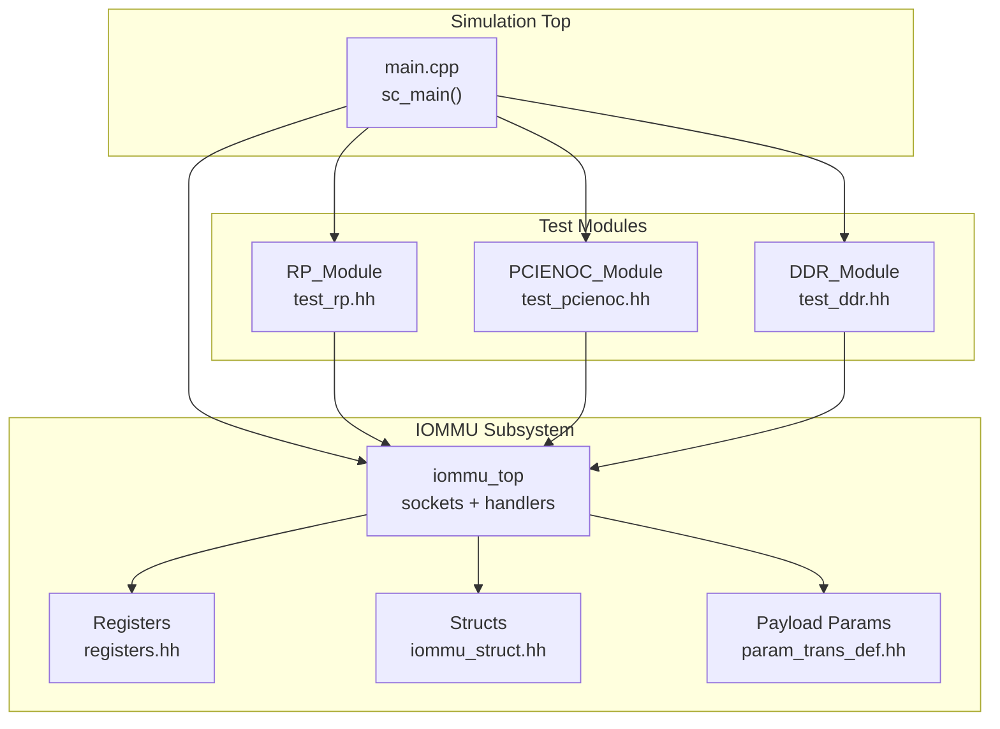
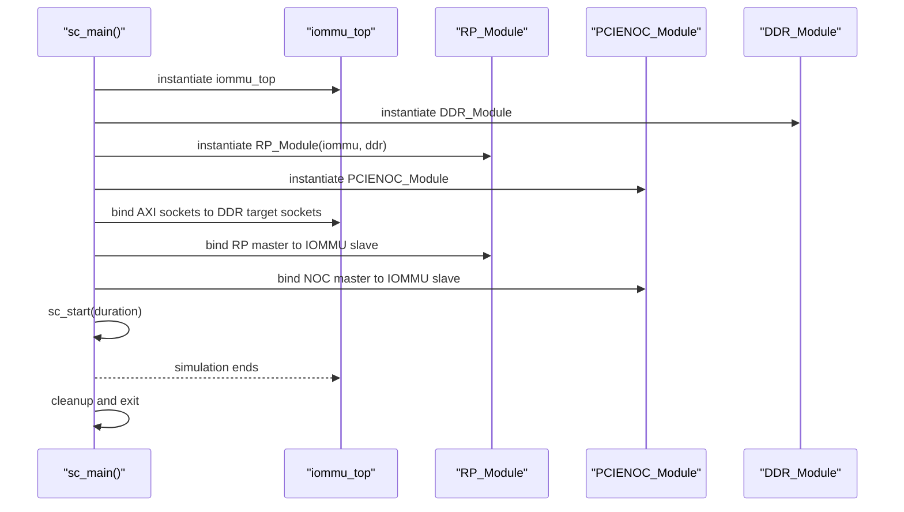
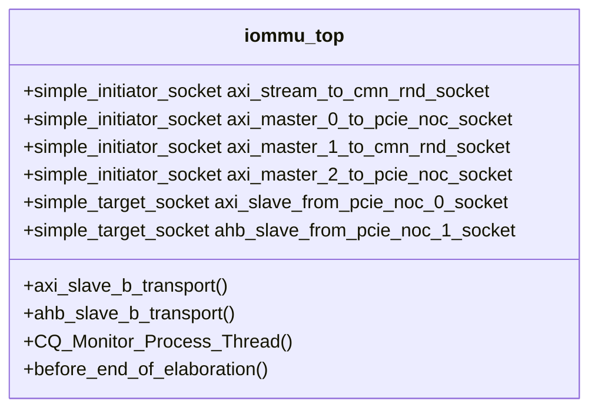
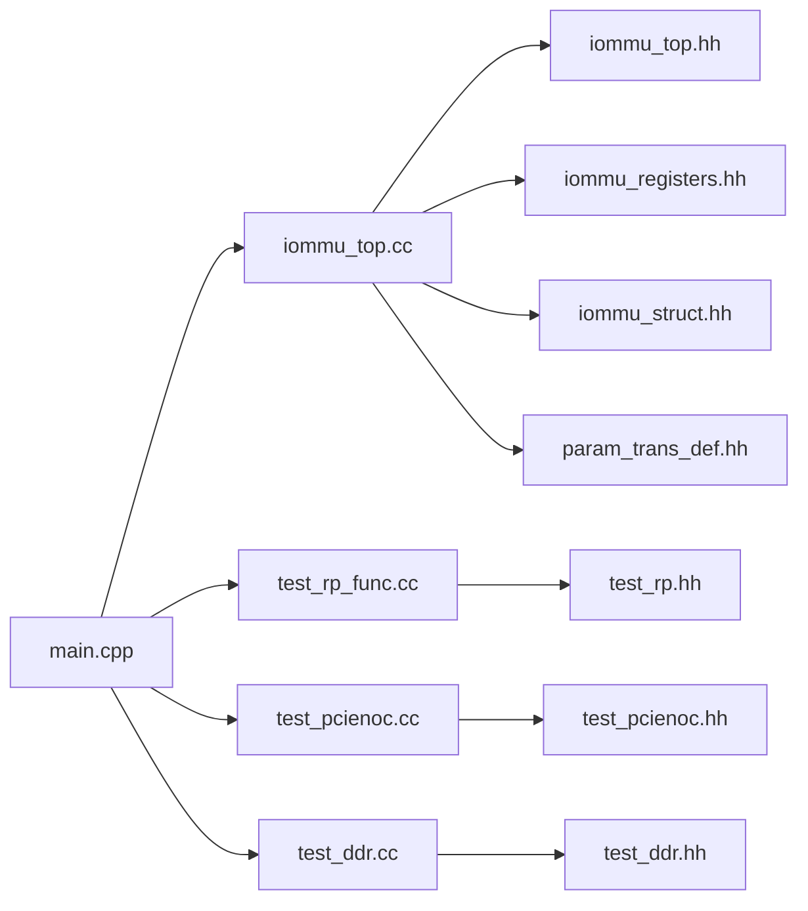

# Getting Started

<cite>
**Referenced Files in This Document**
- [Makefile](file://Makefile)
- [compile_systemc.bat](file://compile_systemc.bat)
- [main.cpp](file://main.cpp)
- [GDB_DEBUG_GUIDE.md](file://GDB_DEBUG_GUIDE.md)
- [gdb_debug.sh](file://gdb_debug.sh)
- [iommu_top.hh](file://iommu/iommu_top.hh)
- [iommu_top.cc](file://iommu/iommu_top.cc)
- [iommu_struct.hh](file://iommu/iommu_struct.hh)
- [param_trans_def.hh](file://iommu/param_trans_def.hh)
- [test_rp.hh](file://rp/test_rp.hh)
- [test_pcienoc.hh](file://pcienoc/test_pcienoc.hh)
- [test_ddr.hh](file://ddr/test_ddr.hh)
</cite>

## Table of Contents
1. [Introduction](#introduction)
2. [Project Structure](#project-structure)
3. [Prerequisites](#prerequisites)
4. [Installation and Build](#installation-and-build)
5. [First Simulation Run](#first-simulation-run)
6. [Architecture Overview](#architecture-overview)
7. [Detailed Component Analysis](#detailed-component-analysis)
8. [Dependency Analysis](#dependency-analysis)
9. [Performance Considerations](#performance-considerations)
10. [Troubleshooting Guide](#troubleshooting-guide)
11. [Conclusion](#conclusion)

## Introduction
This guide helps you quickly set up and run the RISC-V IOMMU SystemC model. It covers prerequisites, building on Linux and Windows, running your first simulation, understanding the sc_main entry point, interpreting results, and debugging with GDB.

## Project Structure
The model is organized around a SystemC top-level module that integrates an IOMMU unit with a Root Complex (RP), a PCIe NOC bridge, and a simulated DDR memory. The build system compiles all components and links against SystemC and pthread.

**Diagram sources**
- [main.cpp:37-79](file://main.cpp#L37-L79)
- [iommu_top.hh:19-56](file://iommu/iommu_top.hh#L19-L56)
- [iommu/iommu_registers.hh](file://iommu/iommu_registers.hh)
- [iommu/iommu_struct.hh:42-99](file://iommu/iommu_struct.hh#L42-L99)
- [iommu/param_trans_def.hh:12-97](file://iommu/param_trans_def.hh#L12-L97)
- [rp/test_rp.hh:54-112](file://rp/test_rp.hh#L54-L112)
- [pcienoc/test_pcienoc.hh:10-21](file://pcienoc/test_pcienoc.hh#L10-L21)
- [ddr/test_ddr.hh:15-61](file://ddr/test_ddr.hh#L15-L61)

**Section sources**
- [Makefile:29-60](file://Makefile#L29-L60)
- [main.cpp:37-79](file://main.cpp#L37-L79)

## Prerequisites
- SystemC 2.3.3
  - Linux: Install via package manager or build from source. The Makefile expects SystemC headers and libraries under standard locations.
  - Windows: Use the provided batch script to configure, build, and install SystemC 2.3.3 into a local directory and set environment variables.
- TLM utilities
  - Ensure TLM headers are available alongside SystemC headers.
- pthread
  - Required for linking; ensure libpthread development headers and libraries are installed.
- GDB debugging
  - Install GDB and use the included script and guide to debug the model.

Notes on environment variables and library paths:
- Linux: The Makefile defines SYSTEMC_INCLUDE and SYSTEMC_LIB defaults suitable for typical distributions.
- Windows: The batch script sets SYSTEMC_HOME, SYSTEMC_INCLUDE, and SYSTEMC_LIBDIR for a local installation.

**Section sources**
- [Makefile:8-11](file://Makefile#L8-L11)
- [Makefile:27](file://Makefile#L27)
- [compile_systemc.bat:5-48](file://compile_systemc.bat#L5-L48)
- [GDB_DEBUG_GUIDE.md:8-19](file://GDB_DEBUG_GUIDE.md#L8-L19)

## Installation and Build
Follow platform-specific instructions below. Both paths produce an executable named iommu_model.

### Linux
1. Ensure prerequisites are installed:
   - SystemC 2.3.3 headers and libraries
   - TLM utilities (part of SystemC distribution)
   - pthread development libraries
   - GNU Make and g++
2. Configure include/library paths if SystemC is not installed in standard locations:
   - Edit SYSTEMC_INCLUDE and SYSTEMC_LIB in the Makefile.
3. Build:
   - Debug build (recommended for development):
     - make DEBUG=1
   - Release build:
     - make DEBUG=0
4. Artifacts:
   - Executable: iommu_model
   - Object files: built under build/ with subfolders mirroring source tree

Build targets:
- make all: builds the executable
- make clean: removes build artifacts
- make rebuild: cleans then builds

**Section sources**
- [Makefile:14-24](file://Makefile#L14-L24)
- [Makefile:66-93](file://Makefile#L66-L93)

### Windows
1. Install prerequisites:
   - CMake
   - Visual Studio build tools
   - Git (for cloning SystemC source if needed)
2. Run the provided batch script:
   - compile_systemc.bat
   - This configures, builds, installs SystemC 2.3.3, and sets environment variables (SYSTEMC_HOME, SYSTEMC_INCLUDE, SYSTEMC_LIBDIR).
3. Build the model:
   - Open a new terminal (to inherit environment variables) and run:
     - make DEBUG=1
   - Or use the provided script to launch GDB if desired.

Notes:
- The script installs SystemC into a local directory and sets environment variables for the current session and system-wide using setx.
- Ensure the newly opened terminal has inherited the updated environment variables.

**Section sources**
- [compile_systemc.bat:1-50](file://compile_systemc.bat#L1-L50)
- [Makefile:8-11](file://Makefile#L8-L11)
- [Makefile:66-93](file://Makefile#L66-L93)

## First Simulation Run
After a successful build, run the simulation:

- From the repository root, execute:
  - ./iommu_model

What happens at runtime:
- The sc_main function constructs the IOMMU, DDR, RP, and PCIe NOC modules.
- It binds sockets between modules to connect the IOMMU to DDR and RP/PCIe NOC.
- It starts the SystemC simulation for a fixed duration (nanosecond scale).
- After simulation, it prints completion messages and exits.

Key entry point:
- sc_main initializes the top-level components and runs the simulation loop.

Verification steps:
- Confirm the executable exists after make completes.
- On Linux, run the binary directly.
- On Windows, ensure the environment variables are set and rerun make DEBUG=1 if needed.

**Section sources**
- [main.cpp:37-79](file://main.cpp#L37-L79)
- [Makefile:66-70](file://Makefile#L66-L70)

## Architecture Overview
The simulation integrates four major components connected via TLM sockets:

**Diagram sources**
- [main.cpp:41-75](file://main.cpp#L41-L75)
- [iommu/iommu_top.hh:22-28](file://iommu/iommu_top.hh#L22-L28)
- [rp/test_rp.hh:57-59](file://rp/test_rp.hh#L57-L59)
- [pcienoc/test_pcienoc.hh:13](file://pcienoc/test_pcienoc.hh#L13)
- [ddr/test_ddr.hh:22-24](file://ddr/test_ddr.hh#L22-L24)

## Detailed Component Analysis

### IOMMU Top-Level Module
The iommu_top module exposes TLM sockets for AXI and AHB interconnects, registers transport handlers, and manages a command queue monitoring thread. It also performs IOMMU initialization during elaboration.

Key responsibilities:
- Socket declarations for upstream/downstream connections
- Transport handlers for AXI and AHB
- Initialization of IOMMU capability and mode
- Command queue monitoring thread sensitivity

**Diagram sources**
- [iommu/iommu_top.hh:19-56](file://iommu/iommu_top.hh#L19-L56)
- [iommu/iommu_top.cc:6-36](file://iommu/iommu_top.cc#L6-L36)

**Section sources**
- [iommu/iommu_top.hh:19-56](file://iommu/iommu_top.hh#L19-L56)
- [iommu/iommu_top.cc:41-180](file://iommu/iommu_top.cc#L41-L180)

### RP (Root Complex) Module
The RP module simulates a PCIe root complex interface and interacts with the IOMMU and DDR. It provides helper functions to construct transactions and validate responses and faults.

Responsibilities:
- Socket bindings to IOMMU and DDR
- Transaction construction and dispatch
- Fault checking and response validation helpers

**Section sources**
- [rp/test_rp.hh:54-112](file://rp/test_rp.hh#L54-L112)

### PCIe NOC Module
The PCIe NOC module acts as a simple initiator for AHB traffic toward the IOMMU.

**Section sources**
- [pcienoc/test_pcienoc.hh:10-21](file://pcienoc/test_pcienoc.hh#L10-L21)

### DDR Memory Module
The DDR module simulates a flat memory region and handles TLM read/write operations with bounds checking.

**Section sources**
- [ddr/test_ddr.hh:15-61](file://ddr/test_ddr.hh#L15-L61)

## Dependency Analysis
The build system compiles a set of C++ sources and links against SystemC and pthread. The main source depends on IOMMU headers and test modules.

**Diagram sources**
- [Makefile:29-50](file://Makefile#L29-L50)
- [main.cpp:7-12](file://main.cpp#L7-L12)
- [iommu/iommu_top.cc:1](file://iommu/iommu_top.cc#L1)
- [rp/test_rp_func.cc:1-10](file://rp/test_rp_func.cc#L1-L10)
- [pcienoc/test_pcienoc.cc](file://pcienoc/test_pcienoc.cc)
- [ddr/test_ddr.cc](file://ddr/test_ddr.cc)

**Section sources**
- [Makefile:29-60](file://Makefile#L29-L60)
- [main.cpp:7-12](file://main.cpp#L7-L12)

## Performance Considerations
- Debug vs release builds:
  - Debug build enables verbose logging and disables optimizations for easier tracing.
  - Release build optimizes performance; useful for long-running simulations.
- Socket and payload overhead:
  - TLM transport handlers add minimal overhead; keep transaction sizes reasonable.
- Memory footprint:
  - The simulated DDR is a fixed-size buffer; ensure your tests fit within the allocated memory.

[No sources needed since this section provides general guidance]

## Troubleshooting Guide

Common build issues and fixes:
- SystemC not found
  - Linux: Adjust SYSTEMC_INCLUDE and SYSTEMC_LIB in the Makefile to match your installation paths.
  - Windows: Re-run compile_systemc.bat to reconfigure and reinstall SystemC, then open a new terminal to inherit environment variables.
- Missing pthread
  - Install pthread development package for your distribution and ensure linker can find it.
- Link errors with -lsystemc or -lpthread
  - Verify library paths and that the correct architecture (e.g., x86_64) matches your binaries.
- GDB debugging problems
  - Ensure DEBUG=1 is used to include symbols.
  - Use the provided GDB script to automate launching with proper settings.

Environment configuration tips:
- Linux: Confirm include and library paths in the Makefile align with your SystemC installation.
- Windows: After running compile_systemc.bat, restart your terminal to pick up environment variables set by the script.

Verification steps:
- After make completes, check for the presence of the iommu_model executable.
- Run the executable and observe console output indicating simulation start and completion.

**Section sources**
- [Makefile:8-11](file://Makefile#L8-L11)
- [Makefile:27](file://Makefile#L27)
- [compile_systemc.bat:44-49](file://compile_systemc.bat#L44-L49)
- [GDB_DEBUG_GUIDE.md:8-19](file://GDB_DEBUG_GUIDE.md#L8-L19)

## Conclusion
You now have the essentials to install, build, and run the RISC-V IOMMU SystemC model on Linux and Windows, understand the sc_main entry point, and interpret basic simulation output. Use the included GDB resources to debug and explore the model’s internals effectively.