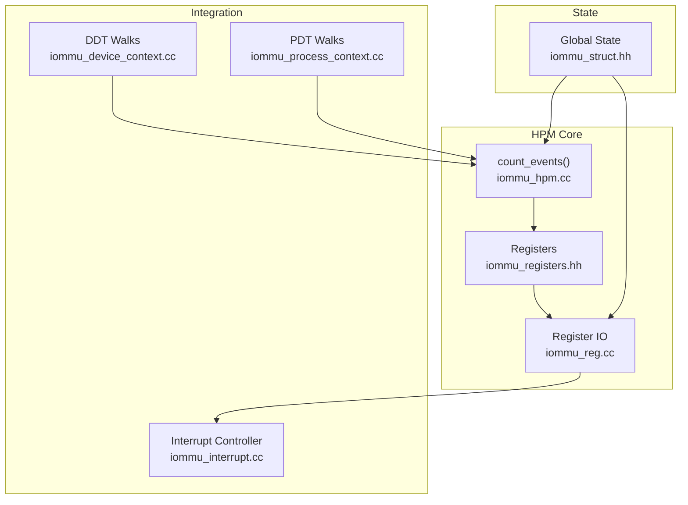
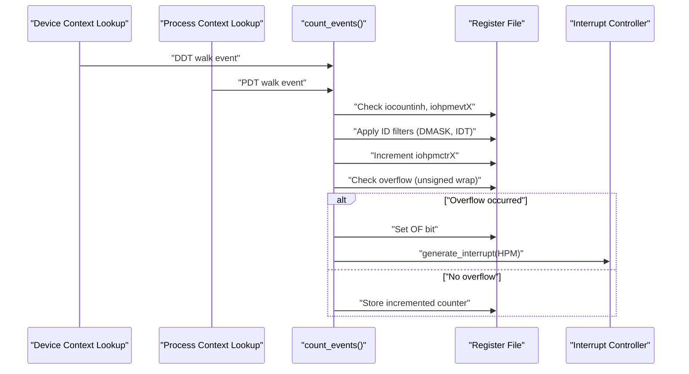
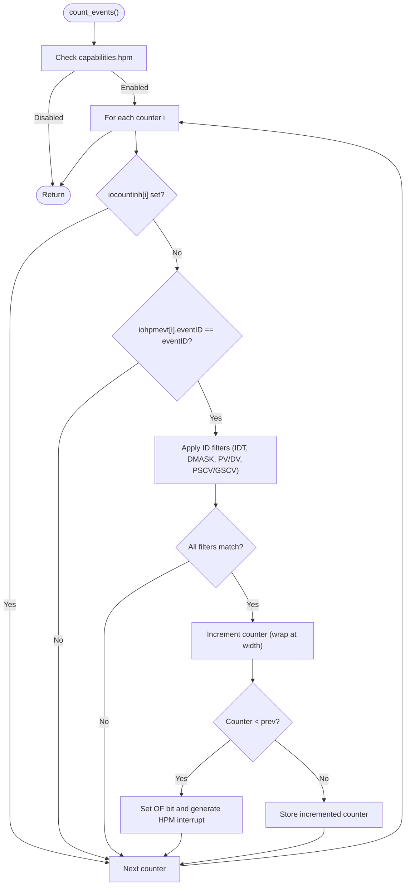
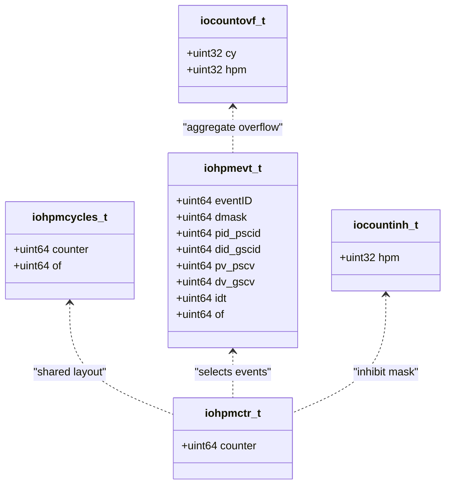
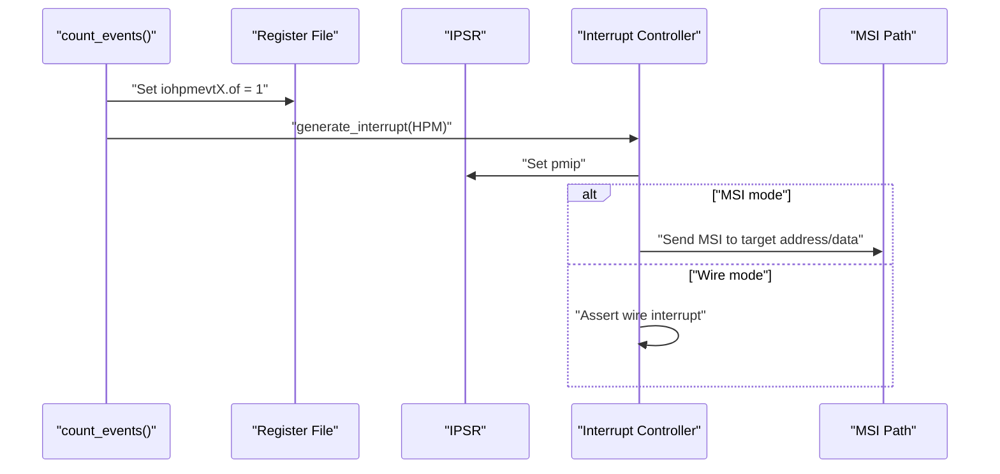
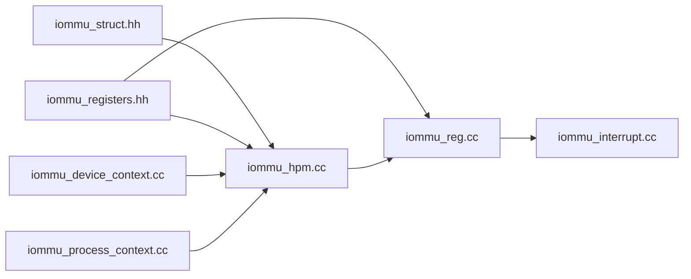

# Hardware Performance Monitoring (HPM)

<cite>
**Referenced Files in This Document**
- [iommu_hpm.hh](file://iommu/iommu_hpm.hh)
- [iommu_hpm.cc](file://iommu/iommu_hpm.cc)
- [iommu_registers.hh](file://iommu/iommu_registers.hh)
- [iommu_reg.cc](file://iommu/iommu_reg.cc)
- [iommu_interrupt.hh](file://iommu/iommu_interrupt.hh)
- [iommu_interrupt.cc](file://iommu/iommu_interrupt.cc)
- [iommu_struct.hh](file://iommu/iommu_struct.hh)
- [iommu_device_context.cc](file://iommu/iommu_device_context.cc)
- [iommu_process_context.cc](file://iommu/iommu_process_context.cc)
</cite>

## Table of Contents
1. [Introduction](#introduction)
2. [Project Structure](#project-structure)
3. [Core Components](#core-components)
4. [Architecture Overview](#architecture-overview)
5. [Detailed Component Analysis](#detailed-component-analysis)
6. [Dependency Analysis](#dependency-analysis)
7. [Performance Considerations](#performance-considerations)
8. [Troubleshooting Guide](#troubleshooting-guide)
9. [Conclusion](#conclusion)

## Introduction
This document describes the Hardware Performance Monitoring (HPM) subsystem within the IOMMU. It explains the performance counter architecture, register organization, event configuration, and overflow/interrupt handling. It also covers how counters are initialized, how events are selected and filtered, and how the system integrates with the interrupt controller to signal overflow conditions.

## Project Structure
The HPM implementation is distributed across several files:
- Event counting logic: [iommu_hpm.cc](file://iommu/iommu_hpm.cc), [iommu_hpm.hh](file://iommu/iommu_hpm.hh)
- Register definitions and layout: [iommu_registers.hh](file://iommu/iommu_registers.hh)
- Register read/write and overflow aggregation: [iommu_reg.cc](file://iommu/iommu_reg.cc)
- Interrupt generation and MSI delivery: [iommu_interrupt.hh](file://iommu/iommu_interrupt.hh), [iommu_interrupt.cc](file://iommu/iommu_interrupt.cc)
- Global IOMMU state and HPM parameters: [iommu_struct.hh](file://iommu/iommu_struct.hh)
- Event triggers from translation walks: [iommu_device_context.cc](file://iommu/iommu_device_context.cc), [iommu_process_context.cc](file://iommu/iommu_process_context.cc)

**Diagram sources**
- [iommu_hpm.cc:1-109](file://iommu/iommu_hpm.cc#L1-L109)
- [iommu_registers.hh:771-800](file://iommu/iommu_registers.hh#L771-L800)
- [iommu_reg.cc:38-717](file://iommu/iommu_reg.cc#L38-L717)
- [iommu_interrupt.cc:28-106](file://iommu/iommu_interrupt.cc#L28-L106)
- [iommu_struct.hh:42-99](file://iommu/iommu_struct.hh#L42-L99)
- [iommu_device_context.cc:116-173](file://iommu/iommu_device_context.cc#L116-L173)
- [iommu_process_context.cc:119-161](file://iommu/iommu_process_context.cc#L119-L161)

**Section sources**
- [iommu_hpm.cc:1-109](file://iommu/iommu_hpm.cc#L1-L109)
- [iommu_registers.hh:771-800](file://iommu/iommu_registers.hh#L771-L800)
- [iommu_reg.cc:38-717](file://iommu/iommu_reg.cc#L38-L717)
- [iommu_interrupt.cc:28-106](file://iommu/iommu_interrupt.cc#L28-L106)
- [iommu_struct.hh:42-99](file://iommu/iommu_struct.hh#L42-L99)
- [iommu_device_context.cc:116-173](file://iommu/iommu_device_context.cc#L116-L173)
- [iommu_process_context.cc:119-161](file://iommu/iommu_process_context.cc#L119-L161)

## Core Components
- Performance counter architecture:
  - A cycle counter (iohpmcycles) and N event counters (iohpmctr1..N) are supported.
  - Each counter is a 64-bit WARL register with configurable width.
  - A global overflow status register aggregates per-counter overflow flags.
- Event configuration:
  - Each counter has an event selector (iohpmevtX) that defines:
    - eventID: the event to count
    - ID filtering: device/GSCID and process/PID fields with a device mask (DMASK) for partial matching
    - ID type (IDT): selects whether to filter by device/GSCID or by GSCID/PSCID
    - Overflow flag (OF): sticky overflow indicator per counter
- Counter inhibition:
  - A 32-bit WARL inhibit register (iocountinh) masks specific counters from counting.
- Overflow handling and interrupts:
  - When a counter overflows, its OF bit is set and a sticky overflow occurs.
  - If the OF bit was previously zero, a HPM overflow interrupt is generated.
  - The OR of all counter overflows is reflected in the overflow status register and the IPSR bit for HPM.

**Section sources**
- [iommu_hpm.hh:20-43](file://iommu/iommu_hpm.hh#L20-L43)
- [iommu_hpm.cc:14-106](file://iommu/iommu_hpm.cc#L14-L106)
- [iommu_registers.hh:592-628](file://iommu/iommu_registers.hh#L592-L628)
- [iommu_reg.cc:28-36](file://iommu/iommu_reg.cc#L28-L36)
- [iommu_reg.cc:618-717](file://iommu/iommu_reg.cc#L618-L717)

## Architecture Overview
The HPM subsystem is integrated into the IOMMU’s translation and command processing pipeline. Events are counted during page table walks and translation requests. The counter logic checks event selectors and optional ID filters, increments the counter, handles overflow, and triggers interrupts when appropriate.

**Diagram sources**
- [iommu_device_context.cc:116-173](file://iommu/iommu_device_context.cc#L116-L173)
- [iommu_process_context.cc:119-161](file://iommu/iommu_process_context.cc#L119-L161)
- [iommu_hpm.cc:6-109](file://iommu/iommu_hpm.cc#L6-L109)
- [iommu_interrupt.cc:28-106](file://iommu/iommu_interrupt.cc#L28-L106)

## Detailed Component Analysis

### Event Counting Engine
The core function initializes counters, applies event and ID filters, increments counters, and manages overflow and interrupts.

Key behaviors:
- Capability gating: HPM is active only when capabilities.hpm is set.
- Inhibit mask: Each counter can be disabled via iocountinh.
- Event matching: Only counters whose eventID matches the current event are considered.
- ID filtering:
  - IDT=0: filter by device_id (DID_GSCID) and process_id (PID_PSCID)
  - IDT=1: filter by GSCID and PSCID
  - DMASK enables partial matching by masking out trailing bits in DID_GSCID/PID_PSCID.
- Overflow semantics:
  - Counters wrap on overflow (unsigned wrap).
  - Sticky OF bit set on overflow; interrupt generated only on OF transition from 0 to 1.
  - Overflow status aggregated in IPSR and the dedicated overflow register.

**Diagram sources**
- [iommu_hpm.cc:6-109](file://iommu/iommu_hpm.cc#L6-L109)

**Section sources**
- [iommu_hpm.cc:6-109](file://iommu/iommu_hpm.cc#L6-L109)

### Register Layout and Access
The HPM registers are defined in the IOMMU register file and accessed via the register interface.

- Cycle counter:
  - iohpmcycles: 64-bit counter with an overflow bit (OF).
- Event counters:
  - iohpmctr1..31: 64-bit WARL counters; writes are masked to the configured width.
- Event selectors:
  - iohpmevt1..31: 64-bit fields including eventID, DMASK, PID/GSCID, PV/DV, IDT, and OF.
- Control/status:
  - iocountinh: 32-bit WARL inhibit mask for counters.
  - iocntovf: aggregated overflow status (OR of per-counter OF bits).
- Access rules:
  - Reads/writes are validated by the register interface; partial writes to 8-byte registers are merged.
  - Writes to non-implemented counters are ignored.

**Diagram sources**
- [iommu_registers.hh:606-628](file://iommu/iommu_registers.hh#L606-L628)
- [iommu_reg.cc:618-717](file://iommu/iommu_reg.cc#L618-L717)

**Section sources**
- [iommu_registers.hh:606-628](file://iommu/iommu_registers.hh#L606-L628)
- [iommu_reg.cc:618-717](file://iommu/iommu_reg.cc#L618-L717)

### Overflow Aggregation and Interrupt Generation
- Overflow aggregation:
  - The iocntovf register ORs the OF bits from all counters and the cycle counter.
- Interrupt signaling:
  - When a counter overflows and its OF bit transitions from 0 to 1, a HPM interrupt is generated.
  - The interrupt is routed via the interrupt controller using the HPM vector from the interrupt cause-to-vector register.
  - MSI delivery is performed if MSI mode is active; otherwise wire interrupts are used depending on configuration.

**Diagram sources**
- [iommu_hpm.cc:93-103](file://iommu/iommu_hpm.cc#L93-L103)
- [iommu_reg.cc:28-36](file://iommu/iommu_reg.cc#L28-L36)
- [iommu_interrupt.cc:28-106](file://iommu/iommu_interrupt.cc#L28-L106)

**Section sources**
- [iommu_hpm.cc:93-103](file://iommu/iommu_hpm.cc#L93-L103)
- [iommu_reg.cc:28-36](file://iommu/iommu_reg.cc#L28-L36)
- [iommu_interrupt.cc:28-106](file://iommu/iommu_interrupt.cc#L28-L106)

### Event Selection and Filtering
- Supported standard events include:
  - No event, untranslated requests, translated requests, ATS translation requests, TLB misses, DDT walks, PDT walks, S/VS-stage PT walks, G-stage PT walks.
- Filtering logic:
  - IDT selects device vs. GSCID filtering.
  - DMASK enables partial matching by masking trailing bits.
  - PV/DV and PSCV/GSCV enable conditional matching based on presence of process/GSCID.

Practical examples of filtering:
- Partial device match: DMASK set to allow a range of function IDs for a given segment:bus:device.
- Process-scoped counting: filter by process_id when PV/DV is valid.

**Section sources**
- [iommu_hpm.hh:20-43](file://iommu/iommu_hpm.hh#L20-L43)
- [iommu_hpm.cc:36-82](file://iommu/iommu_hpm.cc#L36-L82)

### Integration with Translation Walks
HPM events are triggered during page table walks:
- DDT walks: counted when walking the device directory table.
- PDT walks: counted when walking the process directory table.

These triggers call the event counting function with appropriate event IDs and context.

**Section sources**
- [iommu_device_context.cc:116-173](file://iommu/iommu_device_context.cc#L116-L173)
- [iommu_process_context.cc:119-161](file://iommu/iommu_process_context.cc#L119-L161)

## Dependency Analysis
- Event counting depends on:
  - Global HPM parameters (number of counters, counter width) stored in the IOMMU state.
  - Register file layout and access rules.
  - Interrupt controller for overflow signaling.
- Translation walks depend on:
  - Device and process contexts to trigger DDT/PDT walk events.
  - Event IDs and filtering parameters to select which counters increment.

**Diagram sources**
- [iommu_struct.hh:42-99](file://iommu/iommu_struct.hh#L42-L99)
- [iommu_hpm.cc:6-109](file://iommu/iommu_hpm.cc#L6-L109)
- [iommu_registers.hh:771-800](file://iommu/iommu_registers.hh#L771-L800)
- [iommu_reg.cc:38-717](file://iommu/iommu_reg.cc#L38-L717)
- [iommu_interrupt.cc:28-106](file://iommu/iommu_interrupt.cc#L28-L106)
- [iommu_device_context.cc:116-173](file://iommu/iommu_device_context.cc#L116-L173)
- [iommu_process_context.cc:119-161](file://iommu/iommu_process_context.cc#L119-L161)

**Section sources**
- [iommu_struct.hh:42-99](file://iommu/iommu_struct.hh#L42-L99)
- [iommu_hpm.cc:6-109](file://iommu/iommu_hpm.cc#L6-L109)
- [iommu_registers.hh:771-800](file://iommu/iommu_registers.hh#L771-L800)
- [iommu_reg.cc:38-717](file://iommu/iommu_reg.cc#L38-L717)
- [iommu_interrupt.cc:28-106](file://iommu/iommu_interrupt.cc#L28-L106)
- [iommu_device_context.cc:116-173](file://iommu/iommu_device_context.cc#L116-L173)
- [iommu_process_context.cc:119-161](file://iommu/iommu_process_context.cc#L119-L161)

## Performance Considerations
- Counter width: Configurable up to 64 bits; wider counters reduce overflow frequency but increase storage overhead.
- Inhibit mask: Use iocountinh to selectively disable counters to reduce overhead when not needed.
- Event selection: Choose minimal event sets to reduce CPU overhead from frequent increments.
- Overflow handling: OF acts as a sticky flag; clear it by reading the overflow register or resetting the counter to avoid repeated interrupts.

[No sources needed since this section provides general guidance]

## Troubleshooting Guide
Common issues and resolutions:
- No interrupts on overflow:
  - Verify that iohpmevtX.of is 0 before overflow; OF prevents repeated interrupts until cleared.
  - Confirm that the HPM vector is configured and MSI/WIRED mode is set appropriately.
- Counters not incrementing:
  - Check iocountinh for the affected counter; a set bit inhibits counting.
  - Ensure eventID matches the intended event and filters (IDT, DMASK, PV/DV, PSCV/GSCV) are correctly set.
- Unexpected overflow:
  - Confirm counter width and that unsigned wrap semantics are expected.
  - Review event selection and filtering to avoid unintended matches.

**Section sources**
- [iommu_hpm.cc:86-106](file://iommu/iommu_hpm.cc#L86-L106)
- [iommu_reg.cc:618-717](file://iommu/iommu_reg.cc#L618-L717)
- [iommu_interrupt.cc:28-106](file://iommu/iommu_interrupt.cc#L28-L106)

## Conclusion
The IOMMU HPM subsystem provides flexible, programmable performance monitoring with per-counter event selection, ID-based filtering, and robust overflow handling with interrupt generation. By configuring event selectors, applying filters, and managing inhibit masks, users can tailor monitoring to specific workloads and translate performance insights into actionable tuning.