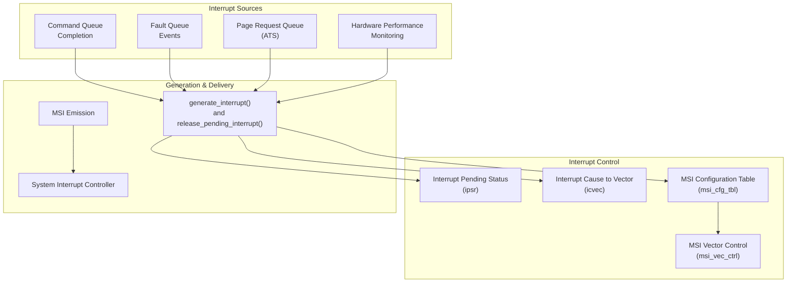
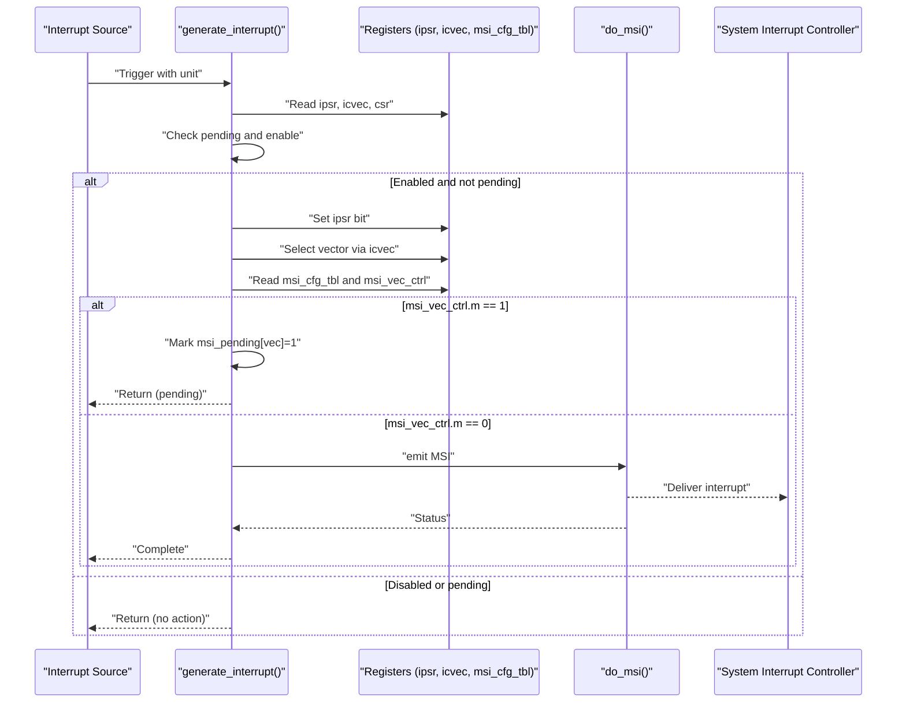
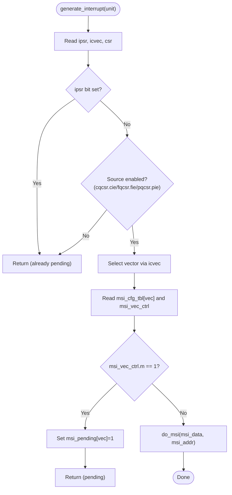
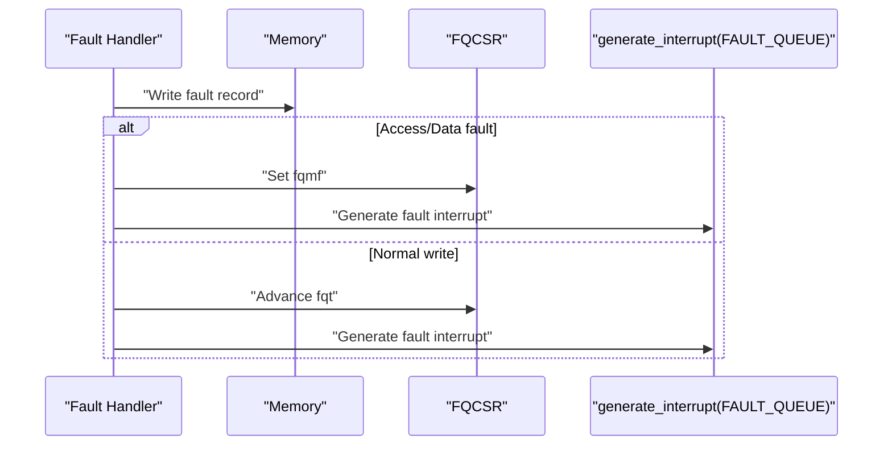
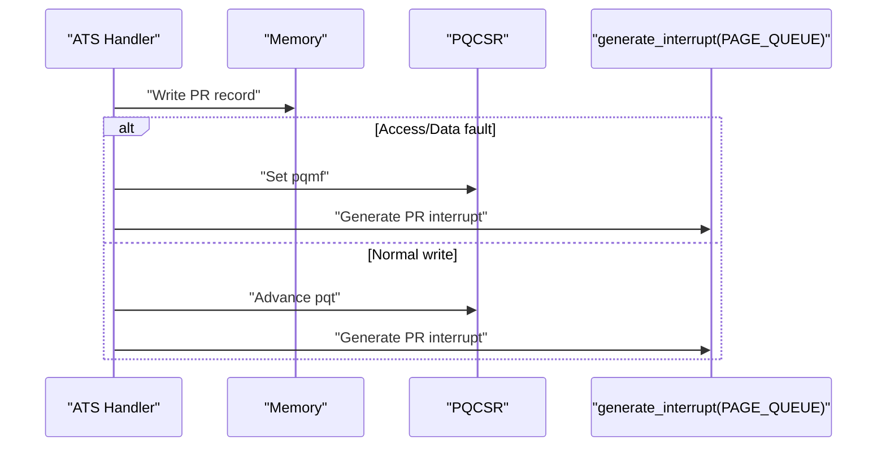
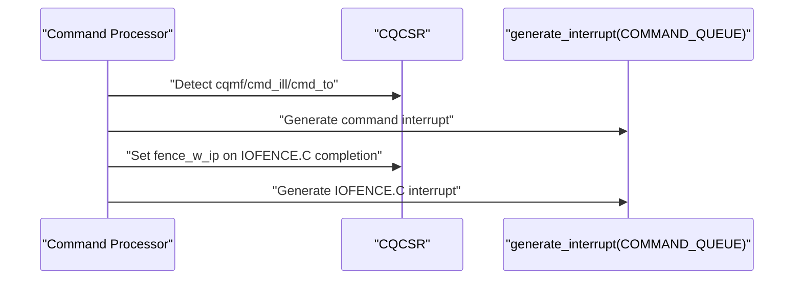
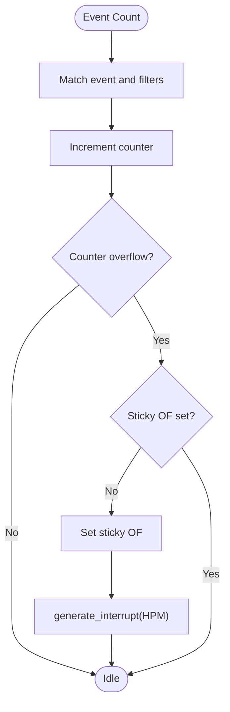
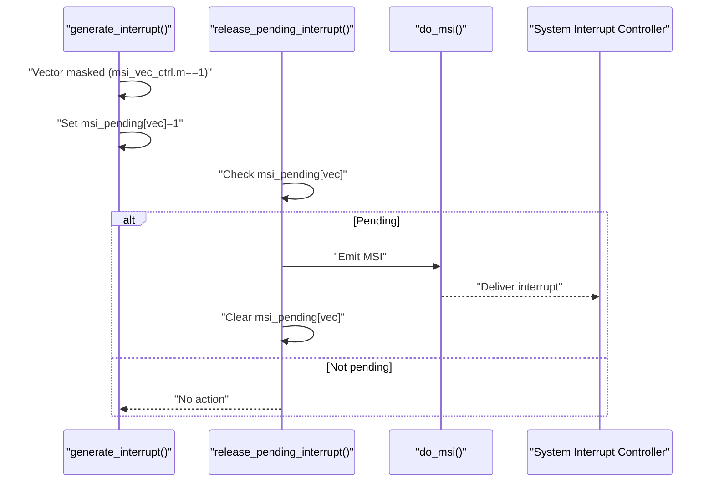
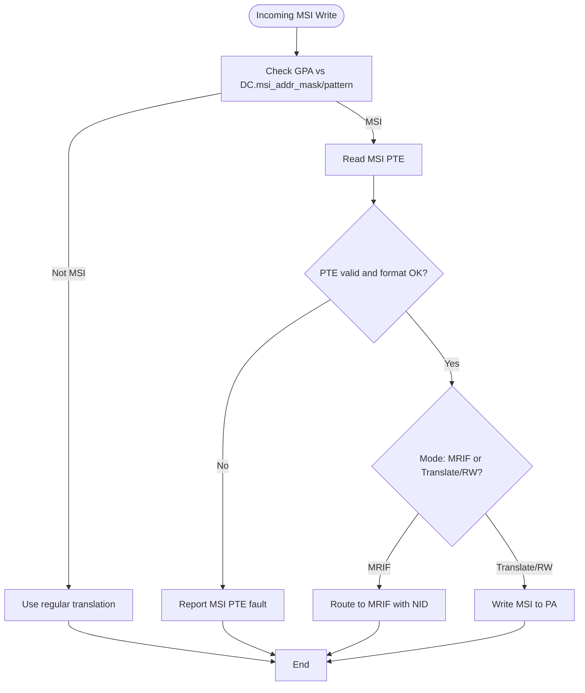
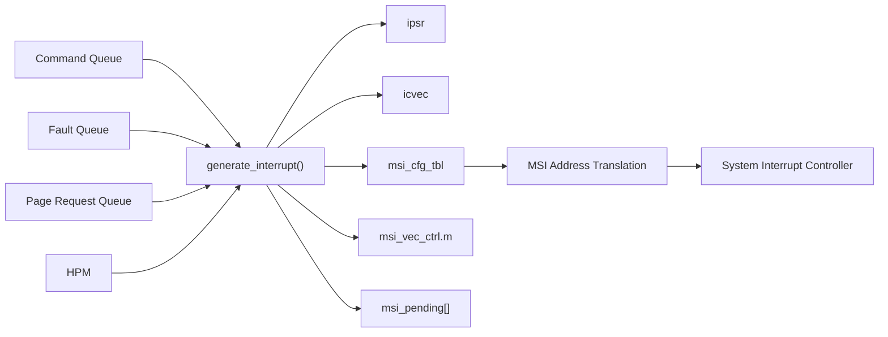

# Interrupt Generation and Management

<cite>
**Referenced Files in This Document**
- [iommu_interrupt.cc](file://iommu/iommu_interrupt.cc)
- [iommu_interrupt.hh](file://iommu/iommu_interrupt.hh)
- [iommu_faults.cc](file://iommu/iommu_faults.cc)
- [iommu_hpm.cc](file://iommu/iommu_hpm.cc)
- [iommu_ats.cc](file://iommu/iommu_ats.cc)
- [iommu_command_queue.cc](file://iommu/iommu_command_queue.cc)
- [iommu_struct.hh](file://iommu/iommu_struct.hh)
- [iommu_registers.hh](file://iommu/iommu_registers.hh)
- [iommu_msi_trans.cc](file://iommu/iommu_msi_trans.cc)
- [iommu_ref_api.cc](file://iommu/iommu_ref_api.cc)
</cite>

## Table of Contents
1. [Introduction](#introduction)
2. [Project Structure](#project-structure)
3. [Core Components](#core-components)
4. [Architecture Overview](#architecture-overview)
5. [Detailed Component Analysis](#detailed-component-analysis)
6. [Dependency Analysis](#dependency-analysis)
7. [Performance Considerations](#performance-considerations)
8. [Troubleshooting Guide](#troubleshooting-guide)
9. [Conclusion](#conclusion)

## Introduction
This document explains the IOMMU interrupt generation and management system. It covers interrupt sources (command queue completion, fault queue events, ATS page requests, and hardware performance monitoring), interrupt types and priorities, vector control mechanisms, and MSI vector control mask bit functionality. It documents the generate_interrupt function implementation, interrupt release procedures, and pending interrupt handling. Practical examples illustrate interrupt generation workflows and integration with system interrupt controllers.

## Project Structure
The interrupt subsystem is implemented across several modules:
- Interrupt generation and MSI emission: iommu_interrupt.cc
- Interrupt source handlers: iommu_faults.cc, iommu_ats.cc, iommu_command_queue.cc, iommu_hpm.cc
- Data structures and register definitions: iommu_struct.hh, iommu_registers.hh
- MSI address translation and routing: iommu_msi_trans.cc
- Reference API for memory operations: iommu_ref_api.cc

**Diagram sources**
- [iommu_interrupt.cc:27-121](file://iommu/iommu_interrupt.cc#L27-L121)
- [iommu_faults.cc:131-158](file://iommu/iommu_faults.cc#L131-L158)
- [iommu_ats.cc:270-298](file://iommu/iommu_ats.cc#L270-L298)
- [iommu_command_queue.cc:96-275](file://iommu/iommu_command_queue.cc#L96-L275)
- [iommu_hpm.cc:100-103](file://iommu/iommu_hpm.cc#L100-L103)
- [iommu_registers.hh:580-640](file://iommu/iommu_registers.hh#L580-L640)
- [iommu_msi_trans.cc:20-294](file://iommu/iommu_msi_trans.cc#L20-L294)

**Section sources**
- [iommu_interrupt.cc:1-121](file://iommu/iommu_interrupt.cc#L1-L121)
- [iommu_registers.hh:760-809](file://iommu/iommu_registers.hh#L760-L809)

## Core Components
- Interrupt sources and triggers:
  - Command queue completion and error conditions trigger interrupts via generate_interrupt.
  - Fault queue overflow/mem fault and event reporting trigger interrupts.
  - ATS page request queue overflow/mem fault triggers interrupts.
  - Hardware performance monitoring overflow triggers interrupts.
- Interrupt pending status and masking:
  - ipsr tracks pending interrupts per source and prevents duplicate signaling until cleared.
  - Per-source enable bits (e.g., cqcsr.cie, fqcsr.fie, pqcsr.pie) mask interrupts from specific sources.
- Vector control and MSI configuration:
  - icvec maps each interrupt cause to a vector index.
  - msi_cfg_tbl holds per-vector MSI address/data and control.
  - msi_vec_ctrl.m masks a specific vector; pending interrupts are queued and emitted when mask is cleared.

**Section sources**
- [iommu_interrupt.cc:27-121](file://iommu/iommu_interrupt.cc#L27-L121)
- [iommu_faults.cc:23-44](file://iommu/iommu_faults.cc#L23-L44)
- [iommu_ats.cc:228-232](file://iommu/iommu_ats.cc#L228-L232)
- [iommu_command_queue.cc:486-519](file://iommu/iommu_command_queue.cc#L486-L519)
- [iommu_hpm.cc:96-106](file://iommu/iommu_hpm.cc#L96-L106)
- [iommu_registers.hh:580-640](file://iommu/iommu_registers.hh#L580-L640)

## Architecture Overview
The interrupt pipeline:
1. A source (command queue, fault queue, page request queue, or HPM) detects an event and calls generate_interrupt with a unit identifier.
2. generate_interrupt checks:
   - Pending status (ipsr) to avoid duplicate signaling.
   - Per-source enable bits (cqcsr.cie, fqcsr.fie, pqcsr.pie).
   - Vector selection via icvec.
3. If enabled and not pending, generate_interrupt sets the corresponding ipsr bit and emits an MSI using msi_cfg_tbl and msi_vec_ctrl.
4. If msi_vec_ctrl.m is set, the interrupt is marked pending in iommu_t.msi_pending and delivered when the mask is cleared.

**Diagram sources**
- [iommu_interrupt.cc:27-121](file://iommu/iommu_interrupt.cc#L27-L121)
- [iommu_registers.hh:580-640](file://iommu/iommu_registers.hh#L580-L640)

**Section sources**
- [iommu_interrupt.cc:27-121](file://iommu/iommu_interrupt.cc#L27-L121)
- [iommu_struct.hh:98-99](file://iommu/iommu_struct.hh#L98-L99)

## Detailed Component Analysis

### Interrupt Generation and MSI Emission
- generate_interrupt selects the vector based on the unit:
  - COMMAND_QUEUE: uses icvec.civ
  - FAULT_QUEUE: uses icvec.fiv
  - PAGE_QUEUE: uses icvec.piv
  - HPM: uses icvec.pmiv
- It sets the corresponding ipsr bit (cip/fip/pip/pmip) to mark pending.
- If MSI is enabled (fctl.wsi == 0), it reads msi_cfg_tbl[vec] and msi_vec_ctrl and checks msi_vec_ctrl.m:
  - If masked, marks iommu_t.msi_pending[vec] = 1 and returns.
  - If unmasked, calls do_msi to write a 32-bit MSI payload to msi_addr.raw.
- do_msi validates the target address against physical address width and invokes write_memory; on access fault, it reports a dedicated fault (cause 273).

**Diagram sources**
- [iommu_interrupt.cc:27-121](file://iommu/iommu_interrupt.cc#L27-L121)

**Section sources**
- [iommu_interrupt.cc:27-121](file://iommu/iommu_interrupt.cc#L27-L121)
- [iommu_registers.hh:760-809](file://iommu/iommu_registers.hh#L760-L809)

### Fault Queue Interrupts
- Fault reporting writes fault records to the fault queue and sets fip via generate_interrupt when:
  - Fault queue overflow occurs (fqof).
  - Memory access fault occurs while writing fault record (fqmf).
  - Normal fault record write succeeds.
- Fault queue control/status bits (fqcsr) include:
  - fqon: queue active
  - fqen: queue enabled
  - fqof: overflow flag
  - fqmf: memory fault flag
  - fie: fault-queue interrupt enable
- DTF (disable-translation-fault) affects which translation-related faults are reported.

**Diagram sources**
- [iommu_faults.cc:131-158](file://iommu/iommu_faults.cc#L131-L158)

**Section sources**
- [iommu_faults.cc:23-44](file://iommu/iommu_faults.cc#L23-L44)
- [iommu_faults.cc:131-158](file://iommu/iommu_faults.cc#L131-L158)

### ATS Page Request Queue Interrupts
- ATS page request handling enqueues PR messages to the page-request queue and sets pip via generate_interrupt when:
  - Queue overflow occurs (pqof).
  - Memory access fault occurs while writing PR record (pqmf).
  - Normal PR record write succeeds.
- Page-request queue control/status bits (pqcsr) include:
  - pqon: queue active
  - pqen: queue enabled
  - pqof: overflow flag
  - pqmf: memory fault flag
  - pie: page-request-queue interrupt enable

**Diagram sources**
- [iommu_ats.cc:270-298](file://iommu/iommu_ats.cc#L270-L298)

**Section sources**
- [iommu_ats.cc:228-232](file://iommu/iommu_ats.cc#L228-L232)
- [iommu_ats.cc:270-298](file://iommu/iommu_ats.cc#L270-L298)

### Command Queue Completion and Error Interrupts
- Command processing sets cip via generate_interrupt when:
  - Command-queue memory fault occurs (cqmf).
  - Illegal/unrecognized command decoding occurs (cmd_ill).
  - Timeout occurs during command execution (cmd_to).
  - IOFENCE.C completion with wired-signaled-interrupt requested (fence_w_ip).
- Command-queue control/status bits (cqcsr) include:
  - cqon: queue active
  - cqen: queue enabled
  - cqmf: memory fault flag
  - cmd_ill: illegal command flag
  - cmd_to: timeout flag
  - fence_w_ip: IOFENCE.C completion interrupt flag
  - cie: command-queue interrupt enable

**Diagram sources**
- [iommu_command_queue.cc:96-100](file://iommu/iommu_command_queue.cc#L96-L100)
- [iommu_command_queue.cc:271-275](file://iommu/iommu_command_queue.cc#L271-L275)
- [iommu_command_queue.cc:602-608](file://iommu/iommu_command_queue.cc#L602-L608)
- [iommu_command_queue.cc:635-638](file://iommu/iommu_command_queue.cc#L635-L638)

**Section sources**
- [iommu_command_queue.cc:96-100](file://iommu/iommu_command_queue.cc#L96-L100)
- [iommu_command_queue.cc:271-275](file://iommu/iommu_command_queue.cc#L271-L275)
- [iommu_command_queue.cc:602-608](file://iommu/iommu_command_queue.cc#L602-L608)
- [iommu_command_queue.cc:635-638](file://iommu/iommu_command_queue.cc#L635-L638)

### Hardware Performance Monitoring Interrupts
- Performance counters increment on matching events and set per-counter overflow sticky bits (of).
- When a counter overflows and its sticky bit is clear, generate_interrupt(HPM) is invoked.
- HPM overflow is aggregated and indicated via ipsr.pmip.

**Diagram sources**
- [iommu_hpm.cc:96-106](file://iommu/iommu_hpm.cc#L96-L106)

**Section sources**
- [iommu_hpm.cc:96-106](file://iommu/iommu_hpm.cc#L96-L106)

### MSI Vector Control Mask and Pending Interrupt Release
- msi_vec_ctrl.m masks a specific vector; when set, interrupts targeting that vector are held in iommu_t.msi_pending[vec].
- release_pending_interrupt(vec) checks iommu_t.msi_pending[vec]:
  - If set, emits MSI immediately and clears the pending bit.
- This mechanism ensures delayed delivery when a vector is masked.

**Diagram sources**
- [iommu_interrupt.cc:97-120](file://iommu/iommu_interrupt.cc#L97-L120)
- [iommu_struct.hh:98-99](file://iommu/iommu_struct.hh#L98-L99)

**Section sources**
- [iommu_interrupt.cc:97-120](file://iommu/iommu_interrupt.cc#L97-L120)
- [iommu_struct.hh:98-99](file://iommu/iommu_struct.hh#L98-L99)

### MSI Address Translation and Routing
- MSI address translation recognizes writes to virtual interrupt files using device-context MSI address mask/pattern and MSI page table (flat or MRIF).
- For MRIF mode, the MSI is routed to a destination MRIF with a notice MSI carrying an NID.
- For translate/RW mode, the MSI is written to a physical address derived from the MSI PTE.

**Diagram sources**
- [iommu_msi_trans.cc:20-294](file://iommu/iommu_msi_trans.cc#L20-L294)

**Section sources**
- [iommu_msi_trans.cc:20-294](file://iommu/iommu_msi_trans.cc#L20-L294)

## Dependency Analysis
- generate_interrupt depends on:
  - Register state (ipsr, icvec, csr) to determine vector and enablement.
  - MSI configuration table (msi_cfg_tbl) and vector control (msi_vec_ctrl).
  - Pending vector tracking (msi_pending) in iommu_t.
- Interrupt sources depend on:
  - Queue control/status registers (cqcsr, fqcsr, pqcsr) for overflow/mem-fault conditions.
  - HPM event selectors and counters for overflow detection.
- MSI emission depends on:
  - Address translation and routing logic (msi_trans) to resolve destinations.

**Diagram sources**
- [iommu_interrupt.cc:27-121](file://iommu/iommu_interrupt.cc#L27-L121)
- [iommu_command_queue.cc:96-100](file://iommu/iommu_command_queue.cc#L96-L100)
- [iommu_faults.cc:131-158](file://iommu/iommu_faults.cc#L131-L158)
- [iommu_ats.cc:270-298](file://iommu/iommu_ats.cc#L270-L298)
- [iommu_hpm.cc:96-106](file://iommu/iommu_hpm.cc#L96-L106)
- [iommu_msi_trans.cc:20-294](file://iommu/iommu_msi_trans.cc#L20-L294)

**Section sources**
- [iommu_interrupt.cc:27-121](file://iommu/iommu_interrupt.cc#L27-L121)
- [iommu_command_queue.cc:96-100](file://iommu/iommu_command_queue.cc#L96-L100)
- [iommu_faults.cc:131-158](file://iommu/iommu_faults.cc#L131-L158)
- [iommu_ats.cc:270-298](file://iommu/iommu_ats.cc#L270-L298)
- [iommu_hpm.cc:96-106](file://iommu/iommu_hpm.cc#L96-L106)
- [iommu_msi_trans.cc:20-294](file://iommu/iommu_msi_trans.cc#L20-L294)

## Performance Considerations
- Pending interrupt queuing avoids unnecessary MSI emissions when vectors are masked, reducing interrupt storms.
- HPM overflow handling uses sticky bits to prevent repeated interrupts until software clears them.
- MSI address translation and routing are optimized through device-context configuration and MSI PTE formats.

[No sources needed since this section provides general guidance]

## Troubleshooting Guide
Common issues and resolutions:
- MSI write access fault:
  - Symptom: Access fault when emitting MSI to msi_addr_x.
  - Action: Report fault with cause 273 and iotval set to msi_addr_x; clear fault condition and retry.
- Fault queue overflow or memory fault:
  - Symptom: fqof or fqmf set; interrupts generated when not already pending.
  - Action: Clear flags via software; ensure fault queue capacity and memory accessibility.
- Page request queue overflow or memory fault:
  - Symptom: pqof or pqmf set; interrupts generated when not already pending.
  - Action: Clear flags via software; ensure page-request queue capacity and memory accessibility.
- Command queue illegal command or timeout:
  - Symptom: cmd_ill or cmd_to set; interrupts generated when not already pending.
  - Action: Correct command encoding or timing; clear flags via software.
- HPM counter overflow:
  - Symptom: Sticky OF bit set for a counter; HPM interrupt pending.
  - Action: Clear OF bit via software; reconfigure event selectors and filters.

**Section sources**
- [iommu_interrupt.cc:19-25](file://iommu/iommu_interrupt.cc#L19-L25)
- [iommu_faults.cc:34-44](file://iommu/iommu_faults.cc#L34-L44)
- [iommu_ats.cc:212-232](file://iommu/iommu_ats.cc#L212-L232)
- [iommu_command_queue.cc:96-100](file://iommu/iommu_command_queue.cc#L96-L100)
- [iommu_command_queue.cc:271-275](file://iommu/iommu_command_queue.cc#L271-L275)
- [iommu_hpm.cc:96-106](file://iommu/iommu_hpm.cc#L96-L106)

## Conclusion
The IOMMU interrupt system provides robust, source-specific signaling with per-vector masking and pending queuing. Interrupts are generated consistently across command completion, fault reporting, ATS page requests, and HPM overflow conditions. MSI emission is validated against physical address limits, and masked vectors are deferred until cleared. This design ensures reliable integration with system interrupt controllers while maintaining predictable behavior under error conditions.