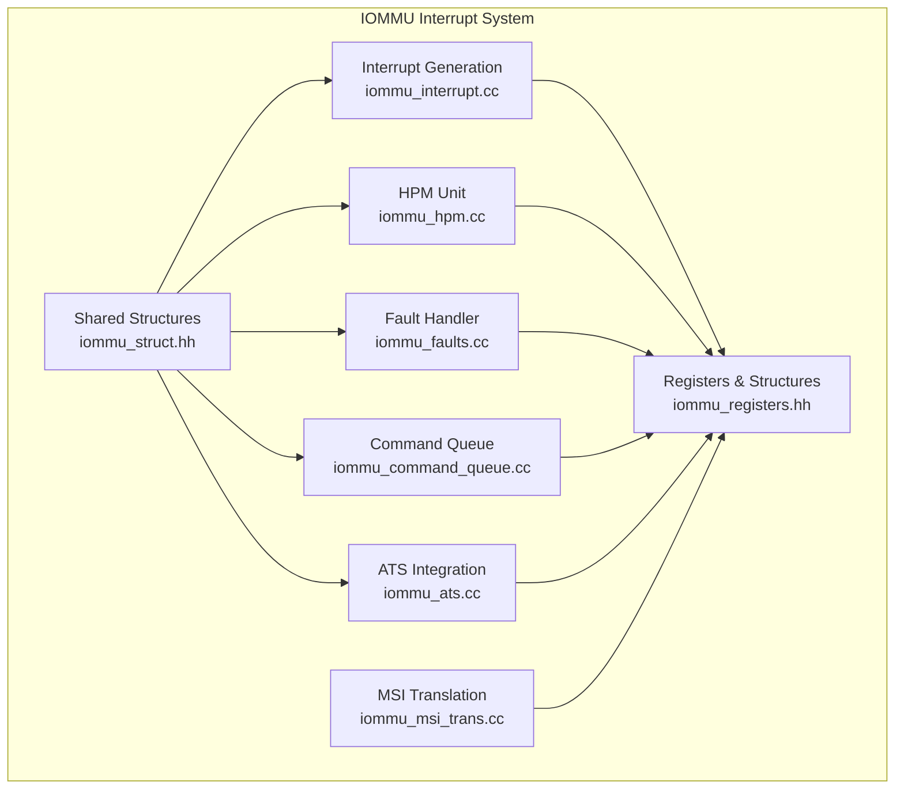
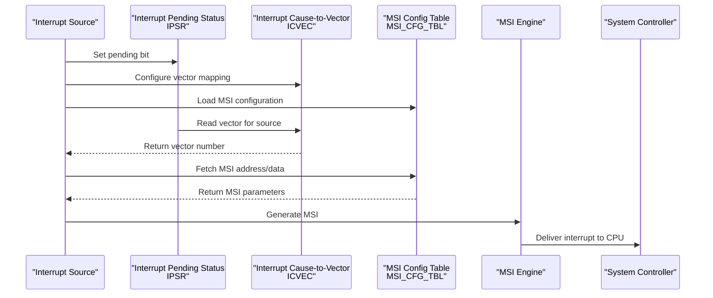
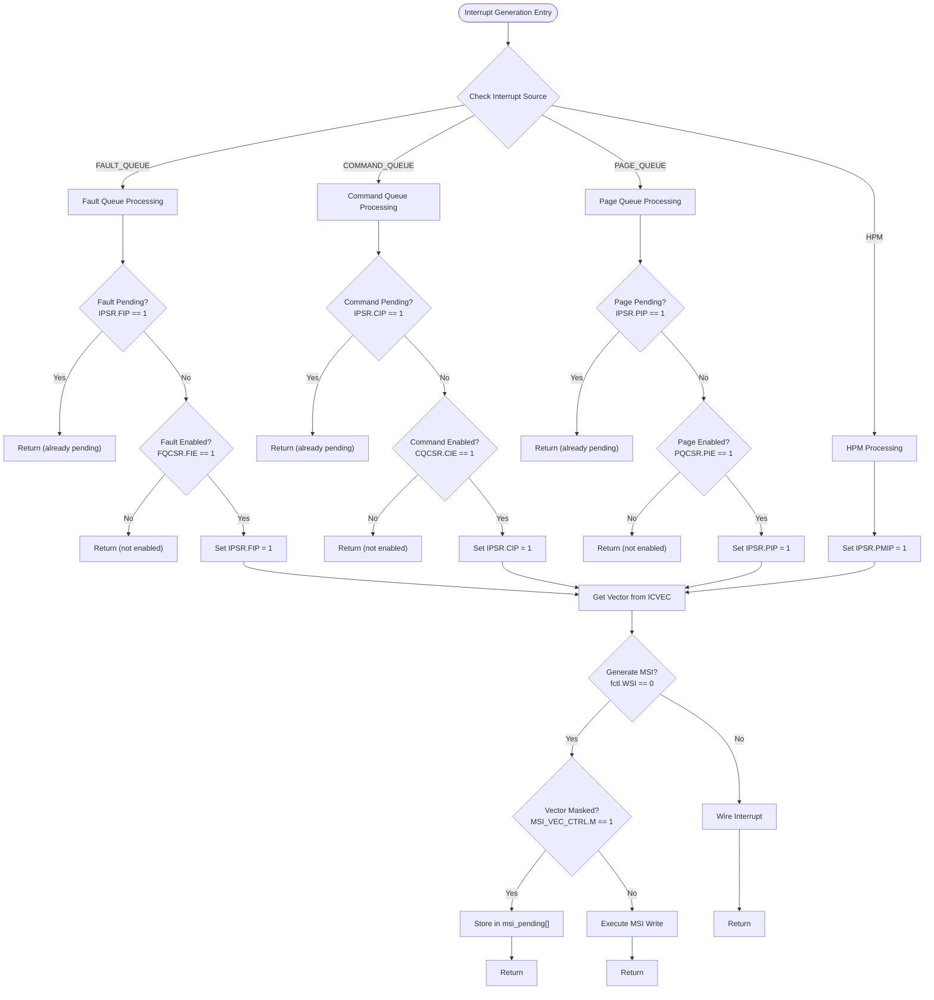
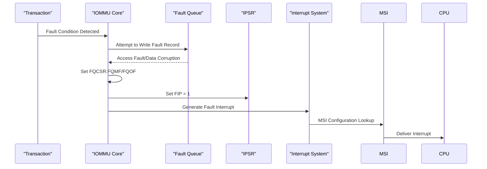
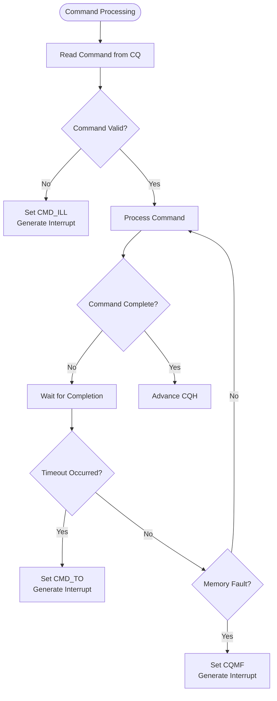
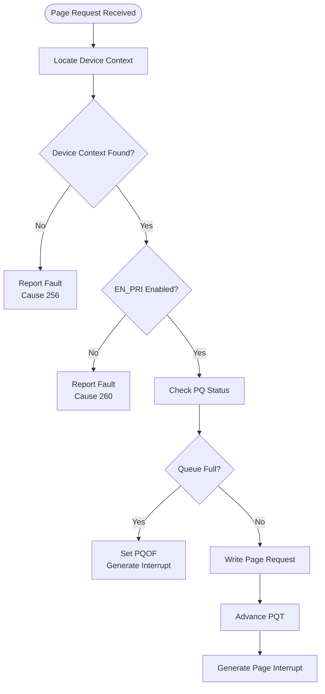
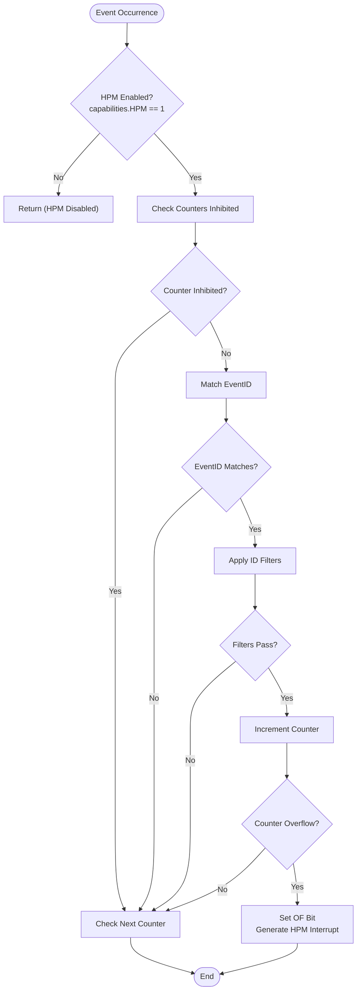
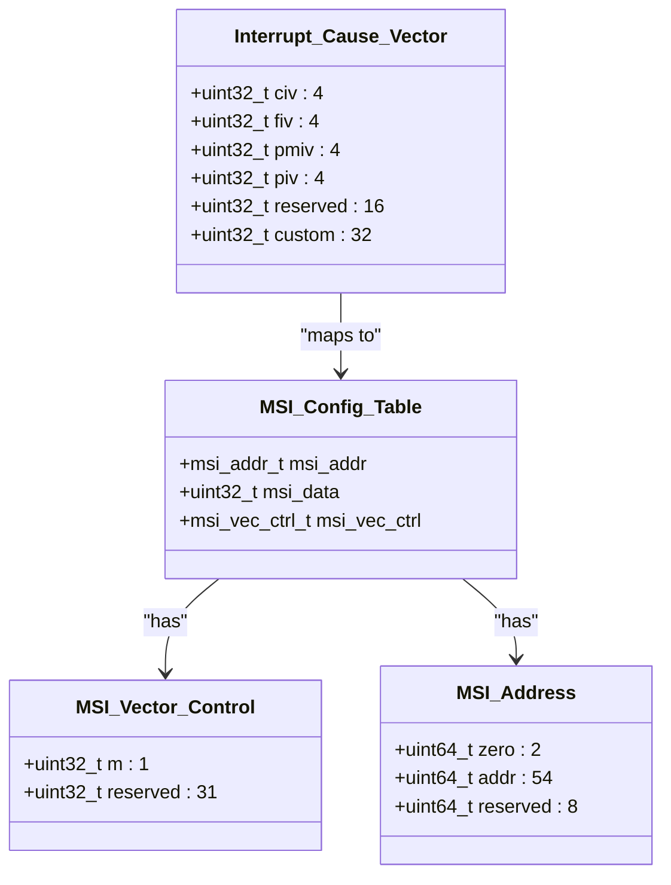
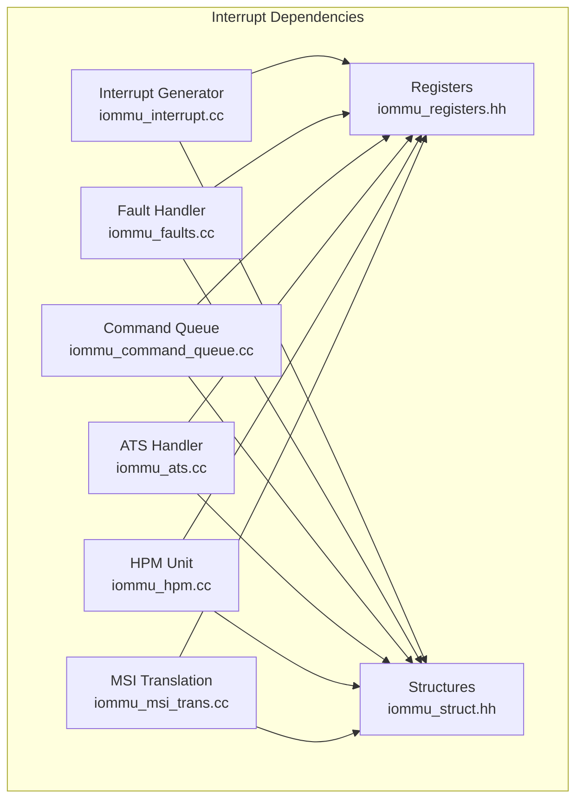

# Interrupt System

<cite>
**Referenced Files in This Document**
- [iommu_interrupt.hh](file://iommu/iommu_interrupt.hh)
- [iommu_interrupt.cc](file://iommu/iommu_interrupt.cc)
- [iommu_hpm.hh](file://iommu/iommu_hpm.hh)
- [iommu_hpm.cc](file://iommu/iommu_hpm.cc)
- [iommu_fault.hh](file://iommu/iommu_fault.hh)
- [iommu_faults.cc](file://iommu/iommu_faults.cc)
- [iommu_command_queue.hh](file://iommu/iommu_command_queue.hh)
- [iommu_command_queue.cc](file://iommu/iommu_command_queue.cc)
- [iommu_ats.hh](file://iommu/iommu_ats.hh)
- [iommu_ats.cc](file://iommu/iommu_ats.cc)
- [iommu_registers.hh](file://iommu/iommu_registers.hh)
- [iommu_msi_trans.cc](file://iommu/iommu_msi_trans.cc)
- [iommu_struct.hh](file://iommu/iommu_struct.hh)
</cite>

## Table of Contents
1. [Introduction](#introduction)
2. [Project Structure](#project-structure)
3. [Core Components](#core-components)
4. [Architecture Overview](#architecture-overview)
5. [Detailed Component Analysis](#detailed-component-analysis)
6. [Dependency Analysis](#dependency-analysis)
7. [Performance Considerations](#performance-considerations)
8. [Troubleshooting Guide](#troubleshooting-guide)
9. [Conclusion](#conclusion)

## Introduction
This document provides comprehensive documentation for the IOMMU interrupt system, covering interrupt generation sources, interrupt types and priority handling, interrupt masking mechanisms, interrupt vector control, pending interrupt handling, and integration with system interrupt controllers. It also documents the hardware performance monitoring (HPM) system, including counter registers, event configuration, and performance metrics tracking. Practical examples of interrupt handling workflows and performance monitoring scenarios are included to aid understanding and implementation.

## Project Structure
The IOMMU interrupt system is implemented across several modules within the iommu directory. The key components include:
- Interrupt generation and delivery: iommu_interrupt.cc/.hh
- Hardware Performance Monitoring (HPM): iommu_hpm.cc/.hh
- Fault handling: iommu_faults.cc/.hh
- Command queue processing: iommu_command_queue.cc/.hh
- ATS (Address Translation Services) integration: iommu_ats.cc/.hh
- Register definitions and structures: iommu_registers.hh
- MSI address translation: iommu_msi_trans.cc
- Shared data structures: iommu_struct.hh

**Diagram sources**
- [iommu_interrupt.cc:1-121](file://iommu/iommu_interrupt.cc#L1-121)
- [iommu_hpm.cc:1-110](file://iommu/iommu_hpm.cc#L1-110)
- [iommu_faults.cc:1-160](file://iommu/iommu_faults.cc#L1-160)
- [iommu_command_queue.cc:1-676](file://iommu/iommu_command_queue.cc#L1-676)
- [iommu_ats.cc:1-374](file://iommu/iommu_ats.cc#L1-374)
- [iommu_registers.hh:771-815](file://iommu/iommu_registers.hh#L771-815)
- [iommu_msi_trans.cc:1-294](file://iommu/iommu_msi_trans.cc#L1-294)
- [iommu_struct.hh:42-99](file://iommu/iommu_struct.hh#L42-99)

**Section sources**
- [iommu_interrupt.hh:1-26](file://iommu/iommu_interrupt.hh#L1-26)
- [iommu_hpm.hh:1-45](file://iommu/iommu_hpm.hh#L1-45)
- [iommu_fault.hh:1-90](file://iommu/iommu_fault.hh#L1-90)
- [iommu_command_queue.hh:1-125](file://iommu/iommu_command_queue.hh#L1-125)
- [iommu_ats.hh:1-98](file://iommu/iommu_ats.hh#L1-98)
- [iommu_registers.hh:771-815](file://iommu/iommu_registers.hh#L771-815)
- [iommu_msi_trans.cc:1-294](file://iommu/iommu_msi_trans.cc#L1-294)
- [iommu_struct.hh:42-99](file://iommu/iommu_struct.hh#L42-99)

## Core Components
The interrupt system consists of four primary interrupt sources:
- Fault Queue Interrupt (FAULT_QUEUE): Generated when fault records are placed in the fault queue or when fault queue conditions occur
- Command Queue Interrupt (COMMAND_QUEUE): Generated when command queue conditions occur, including illegal commands, timeouts, or memory faults
- Page Request Queue Interrupt (PAGE_QUEUE): Generated when page request messages are queued or when page request queue conditions occur
- Hardware Performance Monitor Interrupt (HPM): Generated when HPM counters overflow

Each interrupt source has associated control and status registers, interrupt pending status, and interrupt cause-to-vector mapping.

**Section sources**
- [iommu_interrupt.hh:16-21](file://iommu/iommu_interrupt.hh#L16-21)
- [iommu_registers.hh:580-591](file://iommu/iommu_registers.hh#L580-591)
- [iommu_registers.hh:630-640](file://iommu/iommu_registers.hh#L630-640)

## Architecture Overview
The interrupt architecture follows a standardized approach with interrupt pending status registers, interrupt cause-to-vector mapping, and MSI configuration tables.

**Diagram sources**
- [iommu_interrupt.cc:28-106](file://iommu/iommu_interrupt.cc#L28-106)
- [iommu_registers.hh:795-795](file://iommu/iommu_registers.hh#L795-795)
- [iommu_registers.hh:807-807](file://iommu/iommu_registers.hh#L807-807)
- [iommu_registers.hh:808-808](file://iommu/iommu_registers.hh#L808-808)

## Detailed Component Analysis

### Interrupt Generation and Delivery
The interrupt generation mechanism handles four distinct interrupt sources with specific pending status tracking and vector assignment.

**Diagram sources**
- [iommu_interrupt.cc:28-106](file://iommu/iommu_interrupt.cc#L28-106)
- [iommu_interrupt.cc:108-120](file://iommu/iommu_interrupt.cc#L108-120)

The interrupt generation process includes:
1. **Pending Status Tracking**: Each interrupt source maintains a pending bit in the IPSR register
2. **Enable Control**: Each source has an associated enable bit in its CSR register
3. **Vector Assignment**: Interrupt cause-to-vector mapping determines the interrupt vector
4. **MSI Generation**: MSI configuration table provides address and data for MSI delivery
5. **Masking Mechanism**: Individual vector masking prevents MSI generation when enabled

**Section sources**
- [iommu_interrupt.cc:28-106](file://iommu/iommu_interrupt.cc#L28-106)
- [iommu_interrupt.cc:108-120](file://iommu/iommu_interrupt.cc#L108-120)
- [iommu_registers.hh:580-591](file://iommu/iommu_registers.hh#L580-591)
- [iommu_registers.hh:630-640](file://iommu/iommu_registers.hh#L630-640)
- [iommu_registers.hh:746-750](file://iommu/iommu_registers.hh#L746-750)

### Fault Queue Interrupt System
The fault queue interrupt system manages fault reporting and interrupt generation for various fault conditions.

**Diagram sources**
- [iommu_faults.cc:145-157](file://iommu/iommu_faults.cc#L145-157)
- [iommu_faults.cc:157-159](file://iommu/iommu_faults.cc#L157-159)

Key characteristics of the fault queue interrupt system:
- **Fault Record Format**: 32-byte records with CAUSE, PID, PV, PRIV, TTYP, DID, and iotval fields
- **Queue Management**: In-memory queue with configurable base address and size
- **Overflow Handling**: Automatic overflow detection and interrupt generation
- **Memory Fault Handling**: Access faults during queue operations trigger interrupts
- **DTF Control**: Disable-translation-fault bit controls which faults are reported

**Section sources**
- [iommu_fault.hh:63-77](file://iommu/iommu_fault.hh#L63-77)
- [iommu_faults.cc:126-157](file://iommu/iommu_faults.cc#L126-157)

### Command Queue Interrupt System
The command queue interrupt system handles command processing errors and completion signals.

**Diagram sources**
- [iommu_command_queue.cc:75-100](file://iommu/iommu_command_queue.cc#L75-100)
- [iommu_command_queue.cc:261-276](file://iommu/iommu_command_queue.cc#L261-276)

The command queue interrupt system includes:
- **Command Validation**: Illegal command detection triggers interrupts
- **Timeout Handling**: ATS invalidation timeouts generate interrupts
- **Memory Fault Detection**: Command queue access faults trigger interrupts
- **IOFENCE Completion**: Wired interrupt signaling for IOFENCE.C completion
- **Queue State Management**: Busy and enable state tracking

**Section sources**
- [iommu_command_queue.cc:75-100](file://iommu/iommu_command_queue.cc#L75-100)
- [iommu_command_queue.cc:261-276](file://iommu/iommu_command_queue.cc#L261-276)
- [iommu_command_queue.hh:23-37](file://iommu/iommu_command_queue.hh#L23-37)

### Page Request Queue Interrupt System
The page request queue interrupt system manages PCIe ATS page request handling and interrupt generation.

**Diagram sources**
- [iommu_ats.cc:169-174](file://iommu/iommu_ats.cc#L169-174)
- [iommu_ats.cc:268-273](file://iommu/iommu_ats.cc#L268-273)

The page request queue system features:
- **Device Context Validation**: Proper device context lookup and validation
- **Priority Request Interface (PRI)**: ATS PRI functionality support
- **Queue Management**: In-memory queue with overflow detection
- **Auto-Response**: Automatic PRG response generation for certain conditions
- **Error Handling**: Comprehensive error detection and reporting

**Section sources**
- [iommu_ats.cc:169-174](file://iommu/iommu_ats.cc#L169-174)
- [iommu_ats.cc:268-297](file://iommu/iommu_ats.cc#L268-297)

### Hardware Performance Monitor (HPM) System
The HPM system provides hardware performance monitoring with configurable event counters and overflow handling.

**Diagram sources**
- [iommu_hpm.cc:7-109](file://iommu/iommu_hpm.cc#L7-109)

The HPM system includes:
- **Counter Registers**: Up to 31 configurable performance counters
- **Event Configuration**: 31 event selector registers with ID filtering
- **Overflow Handling**: Sticky overflow bits with interrupt generation
- **Filtering Capabilities**: Device ID, process ID, GSCID, and PSCID filtering
- **Partial Matching**: DMASK support for partial ID matching

**Section sources**
- [iommu_hpm.cc:7-109](file://iommu/iommu_hpm.cc#L7-109)
- [iommu_hpm.hh:20-43](file://iommu/iommu_hpm.hh#L20-43)
- [iommu_registers.hh:606-628](file://iommu/iommu_registers.hh#L606-628)

### Interrupt Vector Control and MSI Configuration
The interrupt vector control system manages MSI configuration and interrupt delivery mechanisms.

**Diagram sources**
- [iommu_registers.hh:739-750](file://iommu/iommu_registers.hh#L739-750)
- [iommu_registers.hh:630-640](file://iommu/iommu_registers.hh#L630-640)
- [iommu_registers.hh:731-738](file://iommu/iommu_registers.hh#L731-738)

**Section sources**
- [iommu_registers.hh:731-750](file://iommu/iommu_registers.hh#L731-750)
- [iommu_registers.hh:807-808](file://iommu/iommu_registers.hh#L807-808)

## Dependency Analysis
The interrupt system components have well-defined dependencies and interactions.

**Diagram sources**
- [iommu_interrupt.cc:6-6](file://iommu/iommu_interrupt.cc#L6-6)
- [iommu_faults.cc:6-6](file://iommu/iommu_faults.cc#L6-6)
- [iommu_command_queue.cc:5-5](file://iommu/iommu_command_queue.cc#L5-5)
- [iommu_ats.cc:5-5](file://iommu/iommu_ats.cc#L5-5)
- [iommu_hpm.cc:5-5](file://iommu/iommu_hpm.cc#L5-5)
- [iommu_msi_trans.cc:6-6](file://iommu/iommu_msi_trans.cc#L6-6)

The dependency analysis reveals:
- **Centralized Control**: All components depend on shared register structures
- **Shared State**: Interrupt pending status and MSI pending arrays are maintained in shared structures
- **Modular Design**: Each interrupt source maintains its own processing logic while sharing common infrastructure
- **Coordinated Access**: All components coordinate through the centralized register interface

**Section sources**
- [iommu_struct.hh:62-99](file://iommu/iommu_struct.hh#L62-99)

## Performance Considerations
The interrupt system is designed for efficient operation with minimal overhead:

- **Interrupt Pending Status**: Each source maintains a single pending bit to prevent duplicate interrupts
- **Enable Control**: Separate enable bits allow selective interrupt generation per source
- **Vector Mapping**: Efficient cause-to-vector mapping reduces interrupt handling overhead
- **MSI Configuration**: Pre-configured MSI tables eliminate runtime calculation overhead
- **HPM Efficiency**: Event filtering and counter inhibition minimize unnecessary processing
- **Queue Management**: Hardware-managed queue pointers reduce software overhead

## Troubleshooting Guide
Common interrupt system issues and their resolution:

### Interrupt Not Generated
**Symptoms**: Interrupt source generates error conditions but no interrupt is delivered
**Causes and Solutions**:
- **Interrupt Pending Bit**: Check IPSR bit for the source is set and cleared appropriately
- **Enable Bit**: Verify the corresponding CSR enable bit is set (FQCSR.FIE, CQCSR.CIE, PQCSR.PIE)
- **Vector Mask**: Check MSI vector control mask bit is not set
- **MSI Configuration**: Verify MSI address and data are properly configured in MSI_CFG_TBL

### Interrupt Flood Conditions
**Symptoms**: Continuous interrupt generation without software intervention
**Causes and Solutions**:
- **Pending Status**: Clear the corresponding IPSR pending bit after processing
- **Queue Full**: Process queue entries to clear overflow conditions
- **Memory Faults**: Address memory access faults causing repeated interrupts
- **HPM Overflow**: Check counter inhibition and event configuration

### MSI Delivery Issues
**Symptoms**: Interrupts not reaching the CPU despite successful MSI generation
**Causes and Solutions**:
- **MSI Address**: Verify MSI address is within physical address limits
- **MSI Data**: Check MSI data format and vector assignment
- **System Controller**: Validate system interrupt controller configuration
- **MSI Translation**: For MSI address translation, verify device context configuration

**Section sources**
- [iommu_interrupt.cc:14-26](file://iommu/iommu_interrupt.cc#L14-26)
- [iommu_faults.cc:34-44](file://iommu/iommu_faults.cc#L34-44)
- [iommu_command_queue.cc:94-99](file://iommu/iommu_command_queue.cc#L94-99)
- [iommu_ats.cc:212-215](file://iommu/iommu_ats.cc#L212-215)

## Conclusion
The IOMMU interrupt system provides a comprehensive and efficient framework for handling various interrupt sources including fault conditions, command processing errors, page request handling, and hardware performance monitoring. The system features robust error detection, configurable interrupt routing, and flexible MSI delivery mechanisms. The modular design allows for independent development and testing of each interrupt source while maintaining coordinated access through shared register structures. The HPM system adds valuable performance monitoring capabilities with configurable event counting and overflow handling. Together, these components provide a solid foundation for reliable IOMMU operation in complex system environments.