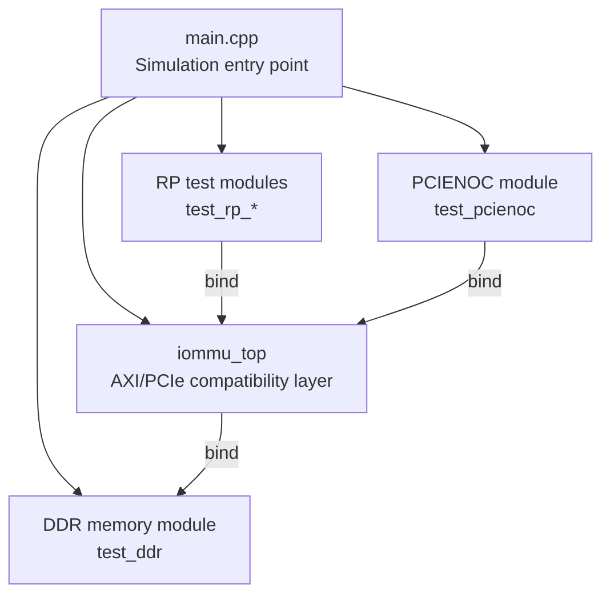
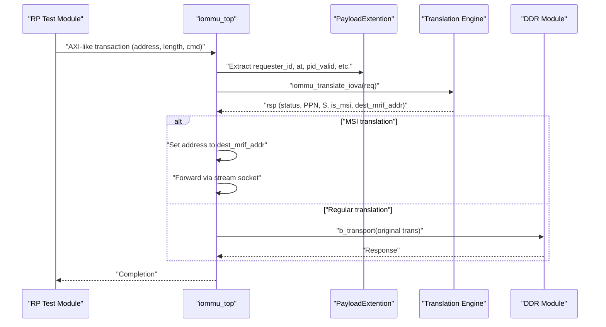
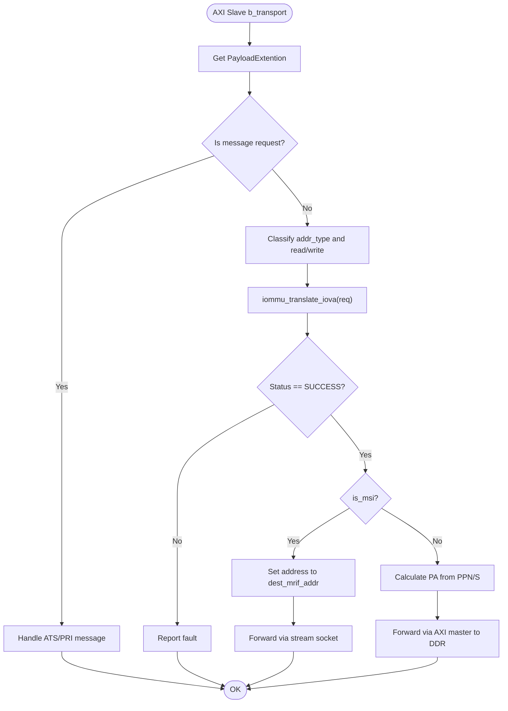
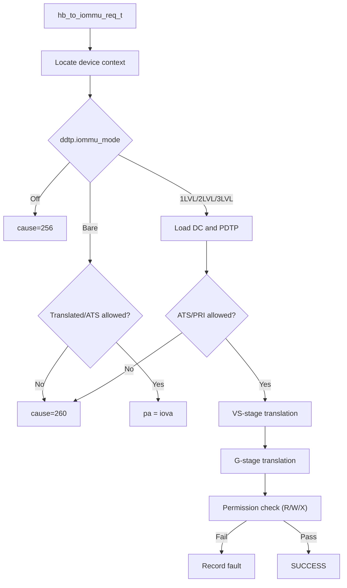
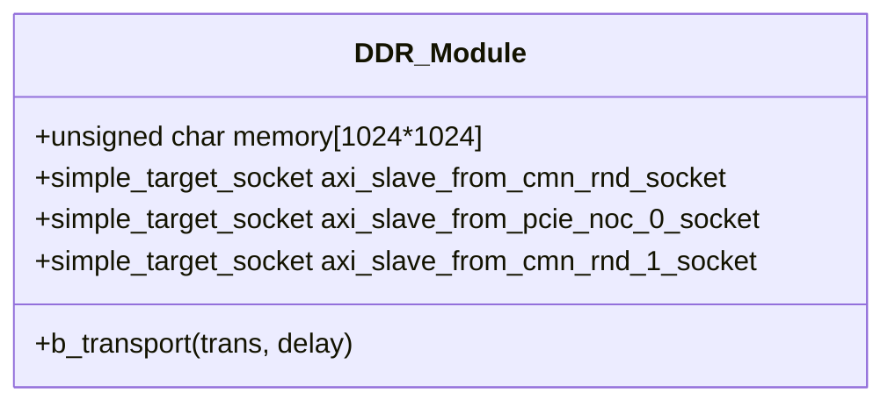
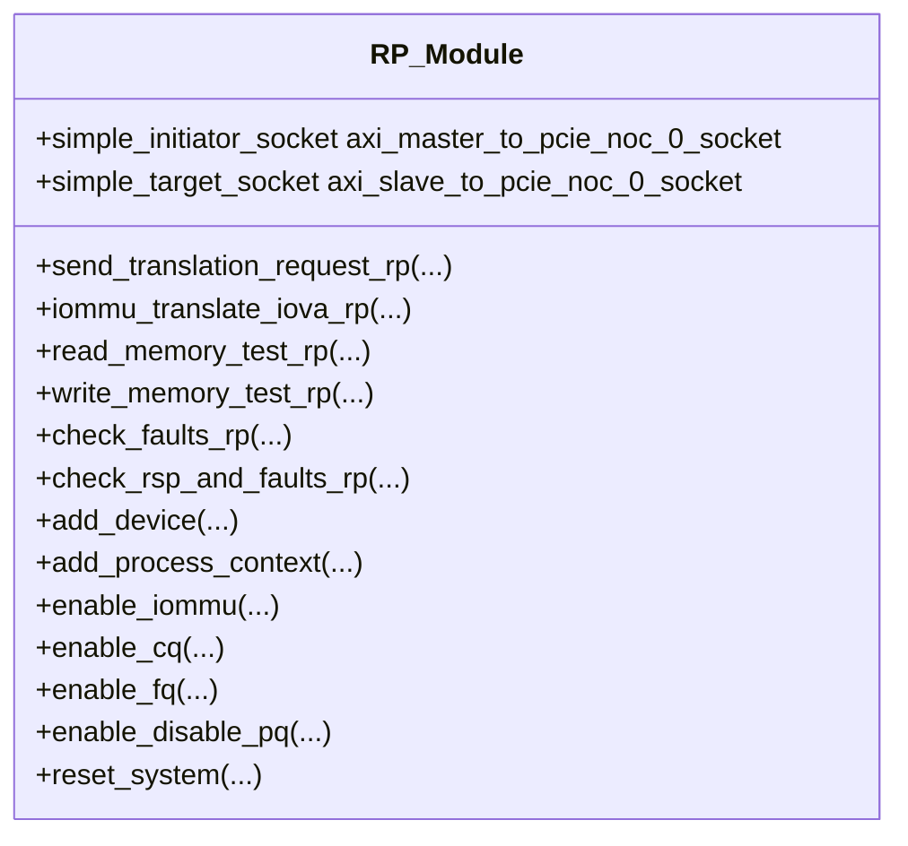
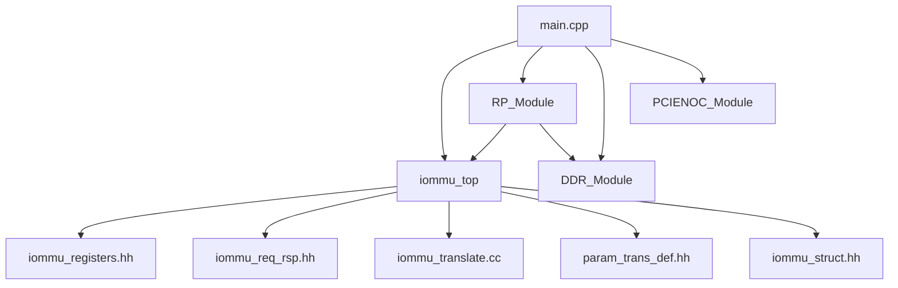

# Memory Interface and Testing

<cite>
**Referenced Files in This Document**
- [main.cpp](file://main.cpp)
- [iommu_top.hh](file://iommu/iommu_top.hh)
- [iommu_top.cc](file://iommu/iommu_top.cc)
- [iommu_req_rsp.hh](file://iommu/iommu_req_rsp.hh)
- [param_trans_def.hh](file://iommu/param_trans_def.hh)
- [iommu_registers.hh](file://iommu/iommu_registers.hh)
- [iommu_struct.hh](file://iommu/iommu_struct.hh)
- [iommu_translate.cc](file://iommu/iommu_translate.cc)
- [iommu_utils.cc](file://iommu/iommu_utils.cc)
- [test_ddr.hh](file://ddr/test_ddr.hh)
- [test_ddr.cc](file://ddr/test_ddr.cc)
- [test_rp.hh](file://rp/test_rp.hh)
- [test_rp_func.cc](file://rp/test_rp_func.cc)
- [test_rp_thread.cc](file://rp/test_rp_thread.cc)
- [test_pcienoc.hh](file://pcienoc/test_pcienoc.hh)
- [Makefile](file://Makefile)
</cite>

## Table of Contents
1. [Introduction](#introduction)
2. [Project Structure](#project-structure)
3. [Core Components](#core-components)
4. [Architecture Overview](#architecture-overview)
5. [Detailed Component Analysis](#detailed-component-analysis)
6. [Dependency Analysis](#dependency-analysis)
7. [Performance Considerations](#performance-considerations)
8. [Troubleshooting Guide](#troubleshooting-guide)
9. [Conclusion](#conclusion)
10. [Appendices](#appendices)

## Introduction
This document explains the memory interface and testing infrastructure of the IOMMU SystemC model. It covers:
- The AXI/PCIe compatibility layer and how inbound transactions are accepted via TLM sockets and translated to physical addresses.
- Memory access control mechanisms, including device/process contexts, permission checks, and fault handling.
- Endianness handling for register and memory-access operations.
- The test module architecture: RP test modules, comprehensive test case development, and test execution frameworks.
- The DDR memory simulation module and its integration with the main IOMMU simulation.
- Practical examples of test case implementation, memory transaction handling, and debugging techniques.

## Project Structure
The repository is organized around a SystemC-based IOMMU model with supporting modules for testing and memory simulation:
- Top-level simulation entry point and inter-module bindings
- IOMMU core modules implementing AXI/PCIe compatibility, translation, and control
- RP test modules for device and transaction testing
- DDR memory simulation module
- Makefile for building the model

**Diagram sources**
- [main.cpp:37-79](file://main.cpp#L37-L79)
- [iommu_top.hh:19-57](file://iommu/iommu_top.hh#L19-L57)
- [test_ddr.hh:15-61](file://ddr/test_ddr.hh#L15-L61)
- [test_rp.hh:54-112](file://rp/test_rp.hh#L54-L112)
- [test_pcienoc.hh:10-21](file://pcienoc/test_pcienoc.hh#L10-L21)

**Section sources**
- [main.cpp:37-79](file://main.cpp#L37-L79)
- [Makefile:29-50](file://Makefile#L29-L50)

## Core Components
- IOMMU top-level module: Provides AXI master and slave sockets, registers handlers for inbound transactions, and routes translation requests to the IOMMU core.
- Memory interface: Uses TLM generic payload with extensions to carry transaction metadata (device ID, PASID, privilege, ATS/PRI flags).
- Translation engine: Implements two-stage translation (VS/G-stage) with permission checks, MSI handling, and fault logging.
- Test modules: RP test modules encapsulate test harness logic, device/context setup, and verification routines.
- DDR simulation: Minimal TLM target module simulating 1 MB of memory for read/write operations.

Key responsibilities:
- AXI/PCIe compatibility: Accepts inbound transactions on AXI-like sockets and translates them to physical addresses or forwards to MSI destinations.
- Memory access control: Enforces permissions based on device/process contexts and transaction attributes.
- Endianness: Register and memory access endianness is controlled by a feature/control register.
- Testing: Comprehensive test harness with automated test case loops and verification helpers.

**Section sources**
- [iommu_top.hh:19-57](file://iommu/iommu_top.hh#L19-L57)
- [iommu_top.cc:77-180](file://iommu/iommu_top.cc#L77-L180)
- [param_trans_def.hh:12-97](file://iommu/param_trans_def.hh#L12-L97)
- [iommu_req_rsp.hh:13-104](file://iommu/iommu_req_rsp.hh#L13-L104)
- [iommu_translate.cc:8-200](file://iommu/iommu_translate.cc#L8-L200)
- [test_ddr.hh:15-61](file://ddr/test_ddr.hh#L15-L61)
- [test_rp.hh:54-112](file://rp/test_rp.hh#L54-L112)

## Architecture Overview
The IOMMU accepts inbound transactions via AXI-like target sockets and uses TLM extensions to carry transaction metadata. The translation engine resolves IOVA to PA according to device/process contexts and translation modes. Successful translations forward the original transaction to the DDR module, while special cases (e.g., MSI) are handled differently.

**Diagram sources**
- [iommu_top.cc:77-180](file://iommu/iommu_top.cc#L77-L180)
- [param_trans_def.hh:12-97](file://iommu/param_trans_def.hh#L12-L97)
- [iommu_translate.cc:8-200](file://iommu/iommu_translate.cc#L8-L200)
- [test_ddr.hh:38-60](file://ddr/test_ddr.hh#L38-L60)

## Detailed Component Analysis

### AXI/PCIe Compatibility Layer
- Socket configuration:
  - AXI master sockets connect to DDR for DMA/data access and to RP for ATS messaging.
  - AXI slave sockets accept inbound transactions from PCIe NOC.
  - AHB slave socket handles register access from PCIENOC.
- Transaction handling:
  - AXI slave handler extracts TLM extension fields and classifies transaction types (untranslated, ATS translation request, translated).
  - For non-ATS requests, it invokes the translation routine and either forwards to MSI destination or to DDR with calculated physical address.
- Endianness:
  - Endianness for memory access to internal data structures and in-memory queues is controlled by a feature/control register.

**Diagram sources**
- [iommu_top.cc:77-180](file://iommu/iommu_top.cc#L77-L180)
- [param_trans_def.hh:12-97](file://iommu/param_trans_def.hh#L12-L97)
- [iommu_registers.hh:255-271](file://iommu/iommu_registers.hh#L255-L271)

**Section sources**
- [iommu_top.hh:19-57](file://iommu/iommu_top.hh#L19-L57)
- [iommu_top.cc:77-180](file://iommu/iommu_top.cc#L77-L180)
- [iommu_registers.hh:255-271](file://iommu/iommu_registers.hh#L255-L271)

### Memory Access Control Mechanisms
- Device and process contexts:
  - Device contexts define per-device translation modes and optional MSI page tables.
  - Process contexts define per-process VS-stage translation and permissions.
- Permission checks:
  - Translation engine evaluates read/write/execute privileges against PTEs and device/process settings.
  - Faults are recorded in the fault queue with detailed fields (cause, TTYP, iotval, iotval2).
- Queue management:
  - Command queue, fault queue, and page-request queue are configured via registers and controlled by CSR-like registers.

**Diagram sources**
- [iommu_translate.cc:8-200](file://iommu/iommu_translate.cc#L8-L200)
- [iommu_req_rsp.hh:13-104](file://iommu/iommu_req_rsp.hh#L13-L104)
- [iommu_registers.hh:286-330](file://iommu/iommu_registers.hh#L286-L330)

**Section sources**
- [iommu_translate.cc:8-200](file://iommu/iommu_translate.cc#L8-L200)
- [iommu_req_rsp.hh:13-104](file://iommu/iommu_req_rsp.hh#L13-L104)
- [iommu_registers.hh:286-330](file://iommu/iommu_registers.hh#L286-L330)

### Endianness Handling
- The feature/control register defines whether memory access to internal data structures and in-memory queues is little-endian or big-endian.
- This affects register reads/writes and queue operations.

**Section sources**
- [iommu_registers.hh:255-271](file://iommu/iommu_registers.hh#L255-L271)

### DDR Memory Simulation Module
- Provides three AXI-like target sockets for different traffic paths.
- Implements a simple 1 MB memory array and handles TLM read/write transactions.
- Validates address bounds and sets response status accordingly.

**Diagram sources**
- [test_ddr.hh:15-61](file://ddr/test_ddr.hh#L15-L61)

**Section sources**
- [test_ddr.hh:15-61](file://ddr/test_ddr.hh#L15-L61)
- [test_ddr.cc:1-6](file://ddr/test_ddr.cc#L1-L6)

### RP Test Modules and Test Infrastructure
- RP test modules encapsulate:
  - Device and context setup helpers (add device, process context, page tables).
  - Translation request sending and response verification.
  - Fault queue inspection and page-request queue checks.
  - End-to-end test threads exercising various translation modes and transaction types.
- Test execution framework:
  - Macros for test numbering, failure detection, and loop generation across transaction types.
  - Threads continuously drive tests after initialization.

**Diagram sources**
- [test_rp.hh:54-112](file://rp/test_rp.hh#L54-L112)

**Section sources**
- [test_rp.hh:32-48](file://rp/test_rp.hh#L32-L48)
- [test_rp_func.cc:11-21](file://rp/test_rp_func.cc#L11-L21)
- [test_rp_func.cc:23-67](file://rp/test_rp_func.cc#L23-L67)
- [test_rp_func.cc:70-157](file://rp/test_rp_func.cc#L70-L157)
- [test_rp_func.cc:159-179](file://rp/test_rp_func.cc#L159-L179)
- [test_rp_func.cc:181-265](file://rp/test_rp_func.cc#L181-L265)
- [test_rp_func.cc:267-289](file://rp/test_rp_func.cc#L267-L289)
- [test_rp_func.cc:291-344](file://rp/test_rp_func.cc#L291-L344)
- [test_rp_func.cc:347-387](file://rp/test_rp_func.cc#L347-L387)
- [test_rp_func.cc:389-454](file://rp/test_rp_func.cc#L389-L454)
- [test_rp_func.cc:456-583](file://rp/test_rp_func.cc#L456-L583)
- [test_rp_func.cc:585-639](file://rp/test_rp_func.cc#L585-L639)
- [test_rp_func.cc:642-665](file://rp/test_rp_func.cc#L642-L665)
- [test_rp_func.cc:667-696](file://rp/test_rp_func.cc#L667-L696)
- [test_rp_func.cc:698-725](file://rp/test_rp_func.cc#L698-L725)
- [test_rp_func.cc:727-760](file://rp/test_rp_func.cc#L727-L760)
- [test_rp_func.cc:762-786](file://rp/test_rp_func.cc#L762-L786)
- [test_rp_func.cc:788-800](file://rp/test_rp_func.cc#L788-L800)
- [test_rp_thread.cc:61-189](file://rp/test_rp_thread.cc#L61-L189)

### Integration Patterns with Main IOMMU Simulation
- The main entry point constructs modules and binds sockets to form the simulation topology.
- Bindings ensure that:
  - IOMMU master sockets connect to DDR target sockets.
  - RP initiator socket connects to IOMMU slave socket.
  - PCIENOC initiator socket connects to IOMMU AHB slave socket.

**Section sources**
- [main.cpp:37-79](file://main.cpp#L37-L79)

## Dependency Analysis
The IOMMU core depends on register definitions, request/response structures, and translation logic. Test modules depend on IOMMU structures and the DDR module for memory operations.

**Diagram sources**
- [iommu_top.cc:1-192](file://iommu/iommu_top.cc#L1-L192)
- [iommu_registers.hh:1-800](file://iommu/iommu_registers.hh#L1-L800)
- [iommu_req_rsp.hh:1-104](file://iommu/iommu_req_rsp.hh#L1-L104)
- [iommu_translate.cc:1-200](file://iommu/iommu_translate.cc#L1-L200)
- [param_trans_def.hh:1-130](file://iommu/param_trans_def.hh#L1-L130)
- [iommu_struct.hh:1-102](file://iommu/iommu_struct.hh#L1-L102)
- [test_rp.hh:1-112](file://rp/test_rp.hh#L1-L112)
- [test_ddr.hh:1-61](file://ddr/test_ddr.hh#L1-L61)
- [main.cpp:37-79](file://main.cpp#L37-L79)

**Section sources**
- [iommu_top.cc:1-192](file://iommu/iommu_top.cc#L1-L192)
- [test_rp.hh:1-112](file://rp/test_rp.hh#L1-L112)
- [test_ddr.hh:1-61](file://ddr/test_ddr.hh#L1-L61)
- [main.cpp:37-79](file://main.cpp#L37-L79)

## Performance Considerations
- Queue sizing: Command, fault, and page-request queues are configured via registers; ensure adequate queue depth to avoid stalls.
- Translation cache: Device/process TLBs and caches reduce repeated translation overhead.
- Endianness control: Configure endianness appropriately for target memory systems to minimize byte-swapping overhead.
- Thread scheduling: Test threads should wait appropriately to allow proper initialization and avoid race conditions.

[No sources needed since this section provides general guidance]

## Troubleshooting Guide
Common issues and techniques:
- Address errors: Verify address bounds in the DDR module and ensure IOVA falls within simulated memory.
- Fault logging: Use fault queue helpers to inspect recorded faults and confirm expected causes and TTYP.
- Translation failures: Confirm device/process contexts are properly configured and ATS/PRI enable flags match transaction types.
- Endianness mismatches: Check the feature/control register for endianness and ensure register access alignment.

**Section sources**
- [test_ddr.hh:38-60](file://ddr/test_ddr.hh#L38-L60)
- [test_rp_func.cc:70-110](file://rp/test_rp_func.cc#L70-L110)
- [test_rp_func.cc:112-157](file://rp/test_rp_func.cc#L112-L157)
- [iommu_registers.hh:255-271](file://iommu/iommu_registers.hh#L255-L271)

## Conclusion
The IOMMU model integrates a robust AXI/PCIe compatibility layer with comprehensive memory access control and testing infrastructure. The DDR simulation module provides a minimal yet effective backend for memory transactions, while the RP test modules exercise translation logic across diverse scenarios. Proper configuration of device/process contexts, queue parameters, and endianness ensures reliable operation and facilitates thorough validation.

[No sources needed since this section summarizes without analyzing specific files]

## Appendices

### Practical Examples Index
- Test case implementation:
  - Device and context setup: [test_rp_func.cc:181-265](file://rp/test_rp_func.cc#L181-L265)
  - Translation request sending: [test_rp_func.cc:159-179](file://rp/test_rp_func.cc#L159-L179)
  - Fault verification: [test_rp_func.cc:70-110](file://rp/test_rp_func.cc#L70-L110)
- Memory transaction handling:
  - DDR read/write: [test_ddr.hh:38-60](file://ddr/test_ddr.hh#L38-L60)
  - IOMMU AXI slave handling: [iommu_top.cc:77-180](file://iommu/iommu_top.cc#L77-L180)
- Debugging techniques:
  - Translation tracing: [iommu_translate.cc:13-16](file://iommu/iommu_translate.cc#L13-L16)
  - Queue enable helpers: [test_rp_func.cc:667-696](file://rp/test_rp_func.cc#L667-L696)

**Section sources**
- [test_rp_func.cc:159-179](file://rp/test_rp_func.cc#L159-L179)
- [test_rp_func.cc:181-265](file://rp/test_rp_func.cc#L181-L265)
- [test_rp_func.cc:70-110](file://rp/test_rp_func.cc#L70-L110)
- [test_ddr.hh:38-60](file://ddr/test_ddr.hh#L38-L60)
- [iommu_top.cc:77-180](file://iommu/iommu_top.cc#L77-L180)
- [iommu_translate.cc:13-16](file://iommu/iommu_translate.cc#L13-L16)
- [test_rp_func.cc:667-696](file://rp/test_rp_func.cc#L667-L696)