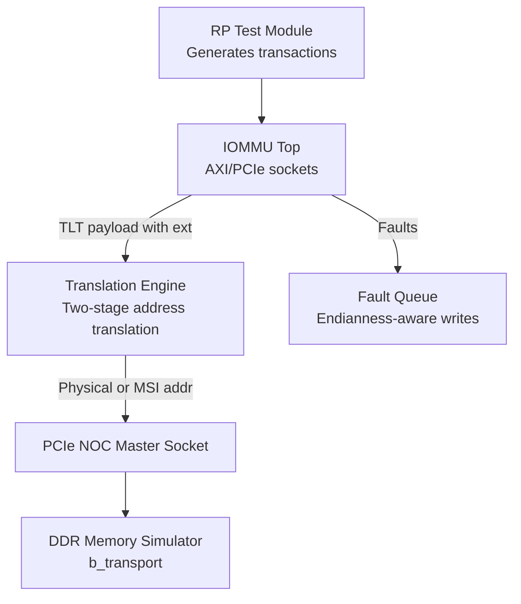
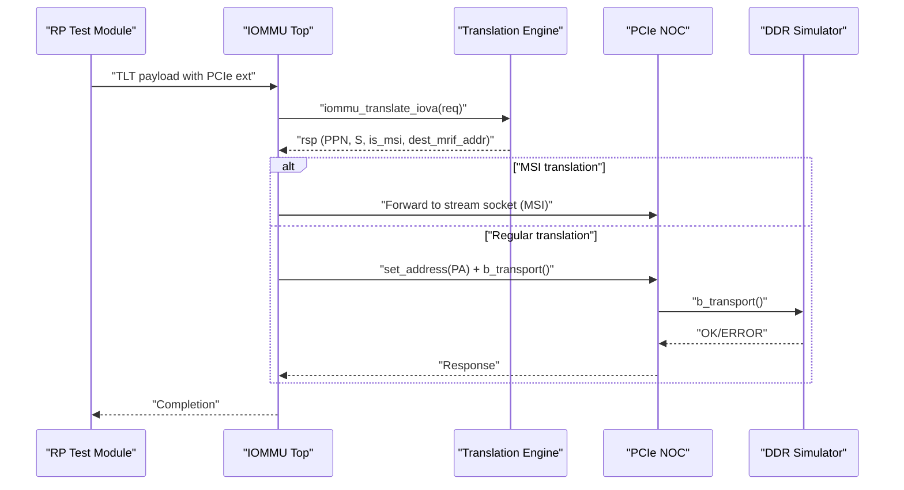
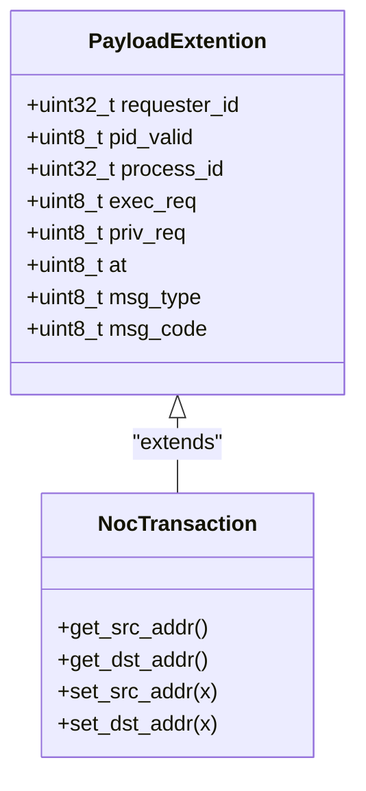
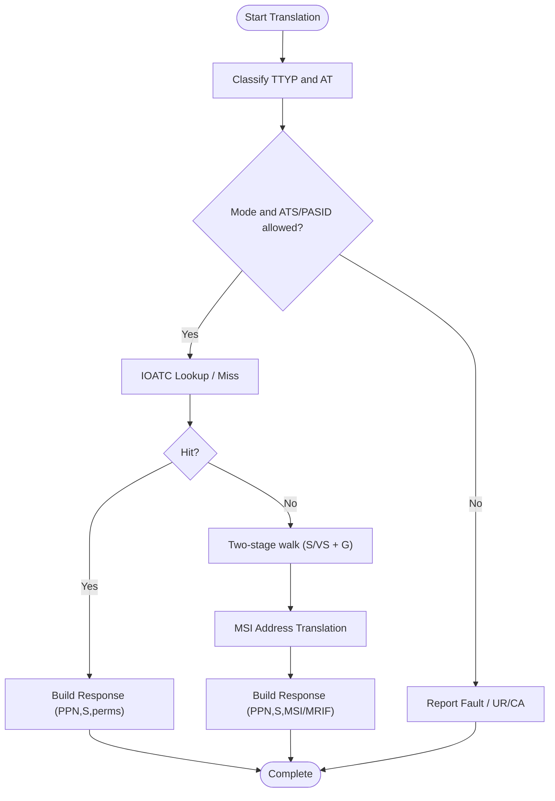
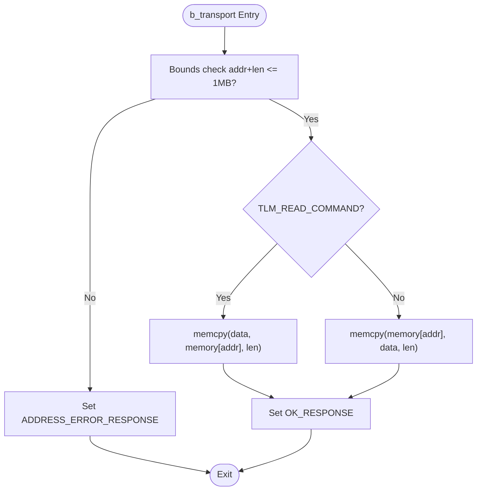
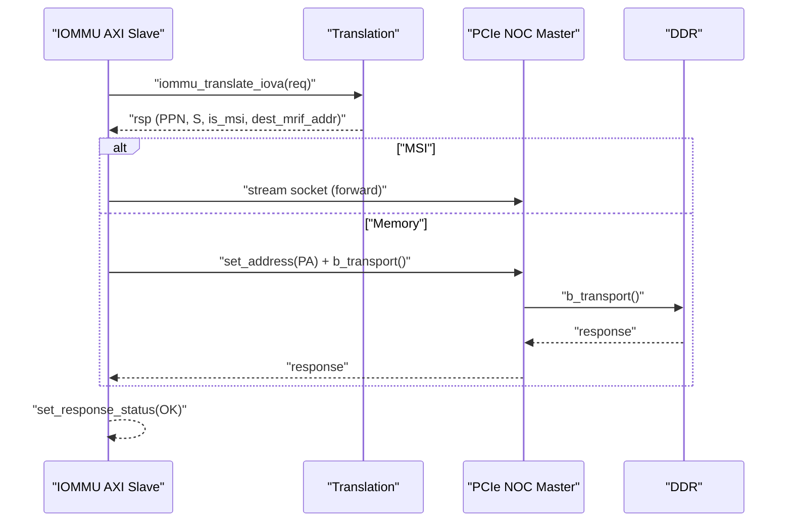
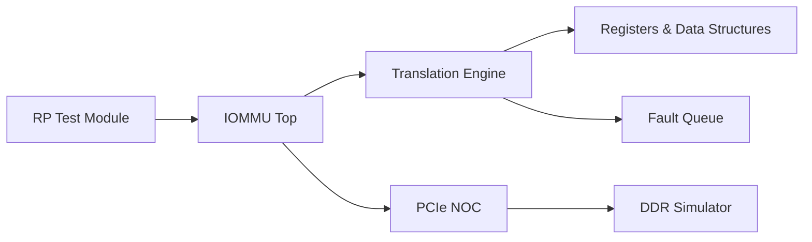

# Memory Interface

<cite>
**Referenced Files in This Document**
- [ddr/test_ddr.hh](file://ddr/test_ddr.hh)
- [ddr/test_ddr.cc](file://ddr/test_ddr.cc)
- [iommu/iommu_top.hh](file://iommu/iommu_top.hh)
- [iommu/iommu_top.cc](file://iommu/iommu_top.cc)
- [iommu/iommu_req_rsp.hh](file://iommu/iommu_req_rsp.hh)
- [iommu/iommu_translate.hh](file://iommu/iommu_translate.hh)
- [iommu/iommu_translate.cc](file://iommu/iommu_translate.cc)
- [iommu/iommu_data_structures.hh](file://iommu/iommu_data_structures.hh)
- [iommu/iommu_registers.hh](file://iommu/iommu_registers.hh)
- [iommu/param_trans_def.hh](file://iommu/param_trans_def.hh)
- [iommu/iommu_faults.cc](file://iommu/iommu_faults.cc)
- [iommu/iommu_utils.cc](file://iommu/iommu_utils.cc)
- [pcienoc/test_pcienoc.hh](file://pcienoc/test_pcienoc.hh)
- [pcienoc/test_pcienoc.cc](file://pcienoc/test_pcienoc.cc)
- [rp/test_rp_func.cc](file://rp/test_rp_func.cc)
</cite>

## Table of Contents
1. [Introduction](#introduction)
2. [Project Structure](#project-structure)
3. [Core Components](#core-components)
4. [Architecture Overview](#architecture-overview)
5. [Detailed Component Analysis](#detailed-component-analysis)
6. [Dependency Analysis](#dependency-analysis)
7. [Performance Considerations](#performance-considerations)
8. [Troubleshooting Guide](#troubleshooting-guide)
9. [Conclusion](#conclusion)
10. [Appendices](#appendices)

## Introduction
This document explains the memory interface implementation in the IOMMU model, focusing on:
- AXI/PCIe compatibility via TLM sockets and payload extensions
- Memory access control and address translation for IOVA to SPA/GPA resolution
- Endianness handling for page table and queue memory accesses
- DDR memory simulation module and transaction handling
- Transaction processing workflows and integration with the main IOMMU simulation
- Practical examples, validation, error handling, performance considerations, and debugging techniques

## Project Structure
The memory interface spans several modules:
- IOMMU top-level module with AXI/PCIe-compatible sockets and translation orchestration
- Translation engine implementing two-stage address translation and ATS/MSI handling
- DDR memory simulator implementing TLM b_transport for read/write
- PCIe NOC and RP test modules for end-to-end transaction testing
- Register and data structure definitions for endianness, page tables, and queues

**Diagram sources**
- [iommu/iommu_top.cc:77-180](file://iommu/iommu_top.cc#L77-L180)
- [iommu/iommu_translate.cc:9-694](file://iommu/iommu_translate.cc#L9-L694)
- [ddr/test_ddr.hh:15-61](file://ddr/test_ddr.hh#L15-L61)
- [pcienoc/test_pcienoc.hh:10-21](file://pcienoc/test_pcienoc.hh#L10-L21)
- [iommu/iommu_faults.cc:1-160](file://iommu/iommu_faults.cc#L1-L160)

**Section sources**
- [iommu/iommu_top.hh:19-57](file://iommu/iommu_top.hh#L19-L57)
- [iommu/iommu_top.cc:6-36](file://iommu/iommu_top.cc#L6-L36)
- [ddr/test_ddr.hh:15-61](file://ddr/test_ddr.hh#L15-L61)
- [pcienoc/test_pcienoc.hh:10-21](file://pcienoc/test_pcienoc.hh#L10-L21)
- [rp/test_rp_func.cc:23-67](file://rp/test_rp_func.cc#L23-L67)

## Core Components
- IOMMU Top: Provides AXI/PCIe-compatible target sockets, routes transactions to translation engine, and forwards translated addresses to PCIe NOC or handles MSI routing.
- Translation Engine: Implements two-stage address translation, ATS/PRI handling, MSI address translation, and IOATC caching.
- DDR Simulator: Implements TLM b_transport for read/write with bounds checking and OK/ERROR response signaling.
- PCIe NOC: Master socket adapter for forwarding translated transactions to the NOC interconnect.
- RP Test Module: Constructs TLM payloads with PCIe-style extensions and initiates translation requests.
- Registers and Data Structures: Define endianness control, page table formats, and queue layouts used by translation and fault handling.

**Section sources**
- [iommu/iommu_top.cc:77-180](file://iommu/iommu_top.cc#L77-L180)
- [iommu/iommu_translate.cc:9-694](file://iommu/iommu_translate.cc#L9-L694)
- [ddr/test_ddr.hh:38-59](file://ddr/test_ddr.hh#L38-L59)
- [pcienoc/test_pcienoc.hh:10-21](file://pcienoc/test_pcienoc.hh#L10-L21)
- [rp/test_rp_func.cc:23-67](file://rp/test_rp_func.cc#L23-L67)
- [iommu/iommu_registers.hh:255-271](file://iommu/iommu_registers.hh#L255-L271)
- [iommu/iommu_data_structures.hh:406-412](file://iommu/iommu_data_structures.hh#L406-L412)

## Architecture Overview
The memory interface integrates PCIe/AXI transactions with IOMMU translation and DDR access:
- Transactions arrive via AXI target sockets with PCIe-style payload extensions
- IOMMU decodes address type (Untranslated/Translated/ATS) and PASID/privilege attributes
- Translation engine resolves IOVA to SPA/GPA, handles MSI and ATS responses
- Translated transactions are forwarded to PCIe NOC master socket; MSI destinations are handled locally
- Faults are recorded in endianness-aware fault queues

**Diagram sources**
- [iommu/iommu_top.cc:77-180](file://iommu/iommu_top.cc#L77-L180)
- [iommu/iommu_translate.cc:9-694](file://iommu/iommu_translate.cc#L9-L694)
- [ddr/test_ddr.hh:38-59](file://ddr/test_ddr.hh#L38-L59)
- [pcienoc/test_pcienoc.hh:10-21](file://pcienoc/test_pcienoc.hh#L10-L21)

## Detailed Component Analysis

### AXI/PCIe Compatibility Layer
- Target sockets accept TLM generic payloads with optional PCIe-style extensions
- Payload extension carries requester ID, PASID validity, process ID, privilege/exec flags, and address type
- IOMMU distinguishes ATS translation requests from regular memory transactions and routes accordingly

**Diagram sources**
- [iommu/param_trans_def.hh:12-97](file://iommu/param_trans_def.hh#L12-L97)
- [iommu/param_trans_def.hh:104-128](file://iommu/param_trans_def.hh#L104-L128)

**Section sources**
- [iommu/iommu_top.cc:77-118](file://iommu/iommu_top.cc#L77-L118)
- [iommu/param_trans_def.hh:12-97](file://iommu/param_trans_def.hh#L12-L97)

### Memory Access Control and Address Translation
- Translation engine classifies transaction types and validates against IOMMU mode and device/process contexts
- Two-stage translation resolves IOVA to SPA/GPA; supports ATS translation responses with permission fields
- MSI address translation and MRIF handling are integrated; IOATC caching improves performance

**Diagram sources**
- [iommu/iommu_translate.cc:9-694](file://iommu/iommu_translate.cc#L9-L694)
- [iommu/iommu_req_rsp.hh:29-101](file://iommu/iommu_req_rsp.hh#L29-L101)

**Section sources**
- [iommu/iommu_translate.cc:9-694](file://iommu/iommu_translate.cc#L9-L694)
- [iommu/iommu_req_rsp.hh:13-101](file://iommu/iommu_req_rsp.hh#L13-L101)

### Endianness Handling
- Endianness for memory-resident data structures and queues is controlled by the fctl register
- Fault queue entries and page table entries are written respecting endianness
- Device context and process context layouts reflect endianness selection

**Section sources**
- [iommu/iommu_registers.hh:255-271](file://iommu/iommu_registers.hh#L255-L271)
- [iommu/iommu_faults.cc:21-21](file://iommu/iommu_faults.cc#L21-L21)
- [iommu/iommu_data_structures.hh:406-412](file://iommu/iommu_data_structures.hh#L406-L412)

### DDR Memory Simulation Module
- Simulates 1 MB of memory with bounds checking
- Implements TLM b_transport for read/write with OK/ERROR responses
- Supports multiple AXI slave sockets from different upstream components

**Diagram sources**
- [ddr/test_ddr.hh:38-59](file://ddr/test_ddr.hh#L38-L59)

**Section sources**
- [ddr/test_ddr.hh:15-61](file://ddr/test_ddr.hh#L15-L61)
- [ddr/test_ddr.cc:1-6](file://ddr/test_ddr.cc#L1-L6)

### Transaction Processing Workflows
- IOMMU AXI slave receives transaction, extracts PCIe extension, and decides ATS vs. translation
- Translation produces PPN/S and permission fields; IOMMU computes physical address or forwards MSI
- PCIe NOC master socket sends translated transaction to DDR; response propagated back

**Diagram sources**
- [iommu/iommu_top.cc:77-180](file://iommu/iommu_top.cc#L77-L180)
- [ddr/test_ddr.hh:38-59](file://ddr/test_ddr.hh#L38-L59)

**Section sources**
- [iommu/iommu_top.cc:77-180](file://iommu/iommu_top.cc#L77-L180)

### Integration with Main IOMMU Simulation
- IOMMU top wires AXI target sockets to translation and PCIe NOC master sockets
- RP test module constructs payloads with PCIe extensions and invokes translation
- End-to-end tests validate disallowed transactions, fault logging, and response handling

**Section sources**
- [iommu/iommu_top.hh:19-57](file://iommu/iommu_top.hh#L19-L57)
- [rp/test_rp_func.cc:23-67](file://rp/test_rp_func.cc#L23-L67)

## Dependency Analysis
Key dependencies:
- IOMMU Top depends on translation engine and PCIe NOC sockets
- Translation engine depends on device/process contexts, page table formats, and endianness control
- Fault handling depends on endianness and queue configuration
- RP test module depends on IOMMU top and constructs payloads with PCIe extensions

**Diagram sources**
- [rp/test_rp_func.cc:23-67](file://rp/test_rp_func.cc#L23-L67)
- [iommu/iommu_top.cc:77-180](file://iommu/iommu_top.cc#L77-L180)
- [iommu/iommu_translate.cc:9-694](file://iommu/iommu_translate.cc#L9-L694)
- [iommu/iommu_registers.hh:255-271](file://iommu/iommu_registers.hh#L255-L271)
- [iommu/iommu_faults.cc:1-160](file://iommu/iommu_faults.cc#L1-L160)
- [pcienoc/test_pcienoc.hh:10-21](file://pcienoc/test_pcienoc.hh#L10-L21)
- [ddr/test_ddr.hh:15-61](file://ddr/test_ddr.hh#L15-L61)

**Section sources**
- [iommu/iommu_top.hh:19-57](file://iommu/iommu_top.hh#L19-L57)
- [iommu/iommu_translate.hh:95-132](file://iommu/iommu_translate.hh#L95-L132)
- [iommu/iommu_registers.hh:255-271](file://iommu/iommu_registers.hh#L255-L271)

## Performance Considerations
- IOATC caching reduces translation latency for repeated IOVA ranges
- NAPOT encoding in ATC improves range matching efficiency
- Endianness selection affects memory access performance for page tables and queues
- MSI MRIF mode avoids caching to reduce complexity and improve correctness for infrequent MSI traffic
- Queue sizing and alignment impact throughput; ensure natural alignment and appropriate log2szm1 values

[No sources needed since this section provides general guidance]

## Troubleshooting Guide
Common issues and diagnostics:
- Address errors: Bounds checks in DDR simulator trigger ADDRESS_ERROR_RESPONSE
- Fault logging: Endianness-aware fault queue writes capture DID/PID/CAUSE/TTYP; verify fqcsr flags and queue configuration
- Disallowed transactions: Validate IOMMU mode, ATS enablement, and PASID/process context settings
- Translation failures: Inspect cause codes and ATS-specific UR/CA responses

**Section sources**
- [ddr/test_ddr.hh:44-48](file://ddr/test_ddr.hh#L44-L48)
- [iommu/iommu_faults.cc:13-21](file://iommu/iommu_faults.cc#L13-L21)
- [iommu/iommu_translate.cc:616-668](file://iommu/iommu_translate.cc#L616-L668)

## Conclusion
The memory interface integrates AXI/PCIe transactions with robust address translation, endianness-aware memory access, and MSI handling. The IOMMU orchestrates translation, caches results, and forwards transactions to the NOC/DDR while recording faults consistently. The RP and PCIe NOC modules provide realistic test coverage for validation.

[No sources needed since this section summarizes without analyzing specific files]

## Appendices

### Practical Examples
- Untranslated read/write with optional execute and privilege attributes
- Translated read/write with permission checks and range encoding
- ATS translation requests returning PPN/S and permission fields
- MSI address translation and MRIF handling

**Section sources**
- [rp/test_rp_func.cc:159-179](file://rp/test_rp_func.cc#L159-L179)
- [iommu/iommu_req_rsp.hh:29-101](file://iommu/iommu_req_rsp.hh#L29-L101)

### Transaction Validation and Error Handling
- Validate address type and PASID/process context before translation
- Check ATS enablement and IOMMU mode constraints
- Log faults with correct endianness and queue configuration
- Handle UR/CA responses for ATS and unsupported requests

**Section sources**
- [iommu/iommu_translate.cc:96-141](file://iommu/iommu_translate.cc#L96-L141)
- [iommu/iommu_faults.cc:1-160](file://iommu/iommu_faults.cc#L1-L160)