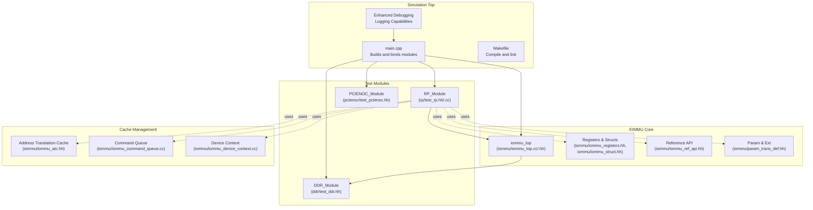
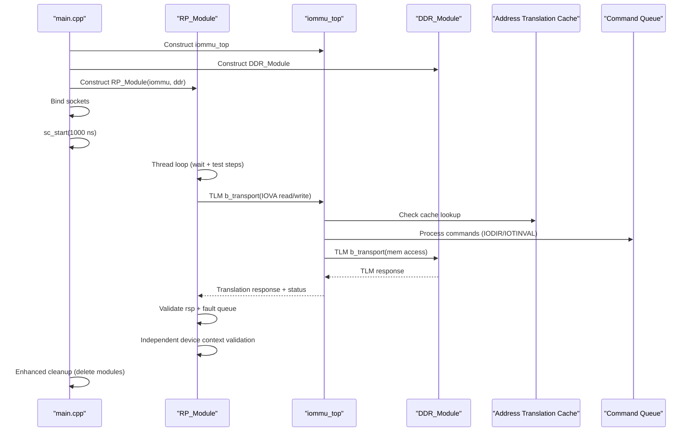
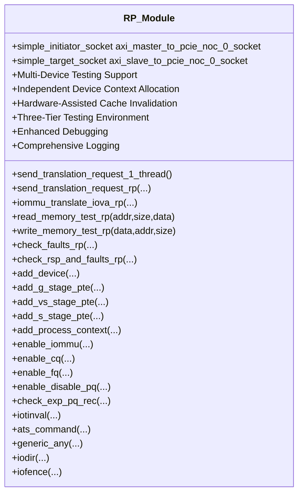
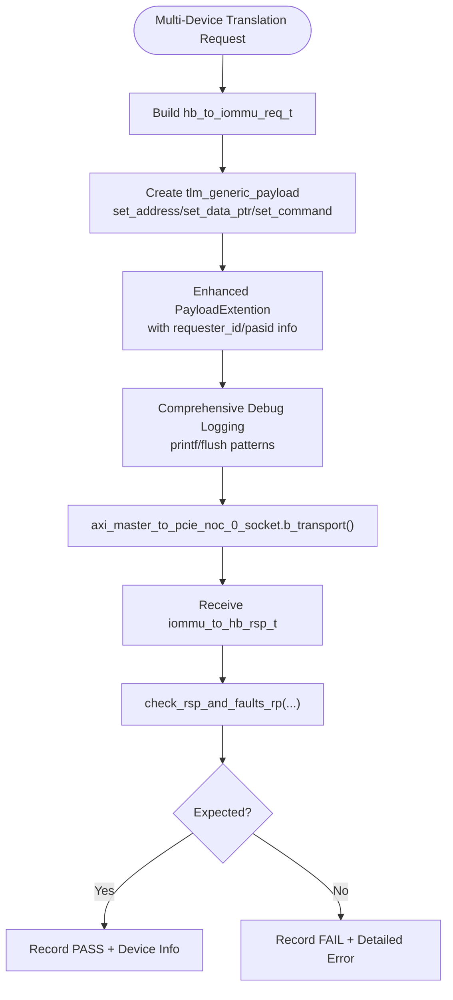
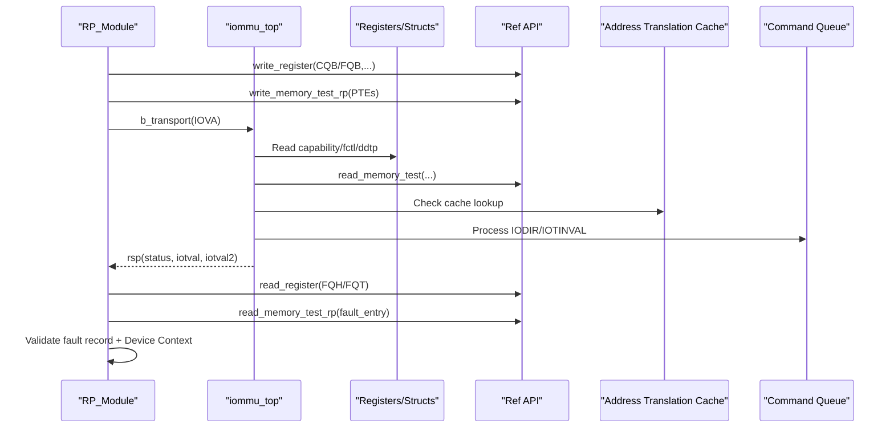
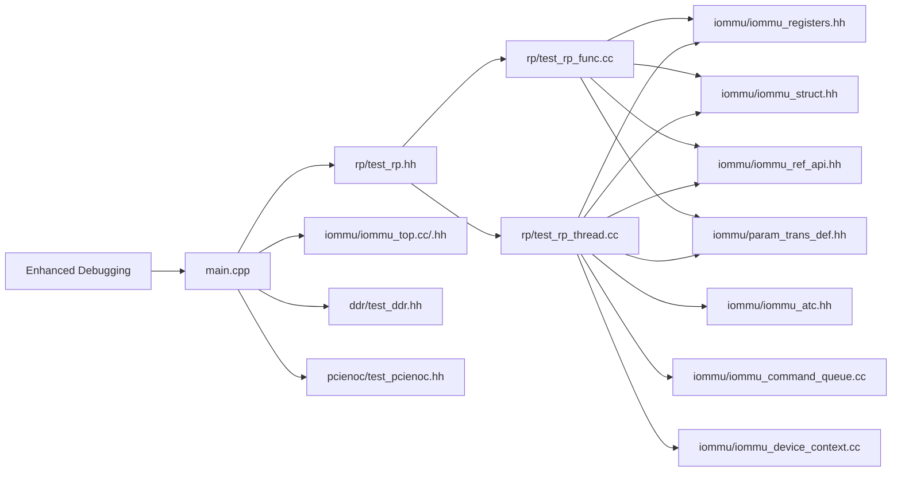

# Test Infrastructure

<cite>
**Referenced Files in This Document**
- [main.cpp](file://main.cpp)
- [Makefile](file://Makefile)
- [rp/test_rp.hh](file://rp/test_rp.hh)
- [rp/test_rp_func.cc](file://rp/test_rp_func.cc)
- [rp/test_rp_thread.cc](file://rp/test_rp_thread.cc)
- [ddr/test_ddr.hh](file://ddr/test_ddr.hh)
- [pcienoc/test_pcienoc.hh](file://pcienoc/test_pcienoc.hh)
- [iommu/iommu_ref_api.hh](file://iommu/iommu_ref_api.hh)
- [iommu/iommu_top.cc](file://iommu/iommu_top.cc)
- [iommu/iommu_top.hh](file://iommu/iommu_top.hh)
- [iommu/iommu_registers.hh](file://iommu/iommu_registers.hh)
- [iommu/iommu_struct.hh](file://iommu/iommu_struct.hh)
- [iommu/param_trans_def.hh](file://iommu/param_trans_def.hh)
- [iommu/iommu_device_context.cc](file://iommu/iommu_device_context.cc)
- [iommu/iommu_atc.hh](file://iommu/iommu_atc.hh)
- [iommu/iommu_command_queue.cc](file://iommu/iommu_command_queue.cc)
</cite>

## Update Summary
**Changes Made**
- Enhanced multi-device address translation testing framework with comprehensive Bare+Bare and Bare+Sv48x4 scenarios
- Implemented independent device context allocation for three devices (0x05, 0x06, 0x07)
- Added comprehensive cache invalidation mechanisms with hardware-assisted A/D bit management
- Integrated three-tier testing environment with concurrent translation requests across multiple devices
- Enhanced debugging and logging capabilities with transaction tracing and device-specific validation

## Table of Contents
1. [Introduction](#introduction)
2. [Project Structure](#project-structure)
3. [Core Components](#core-components)
4. [Architecture Overview](#architecture-overview)
5. [Detailed Component Analysis](#detailed-component-analysis)
6. [Dependency Analysis](#dependency-analysis)
7. [Performance Considerations](#performance-considerations)
8. [Troubleshooting Guide](#troubleshooting-guide)
9. [Conclusion](#conclusion)
10. [Appendices](#appendices)

## Introduction
This document describes the test infrastructure and testing framework used to validate the IOMMU SystemC model. It explains the RP test module architecture, test case development patterns, and the execution framework built on SystemC threads. The framework now supports comprehensive multi-device testing with independent device contexts, hardware-assisted cache invalidation, and three-tier testing environments. It documents design principles, test organization, automated testing procedures, thread-based testing, functional and integration testing strategies, practical examples, debugging techniques, coverage and performance considerations, and CI patterns. Finally, it details the relationship between the test infrastructure and the main IOMMU simulation components.

**Updated** Enhanced with comprehensive multi-device testing framework, independent device context allocation, hardware-assisted cache invalidation mechanisms, and three-tier testing environment supporting concurrent translation requests across multiple devices.

## Project Structure
The test infrastructure centers around the RP (Root Port) test module, which drives IOMMU translation requests and validates responses and faults. It integrates with a minimal DDR memory model and a placeholder PCIENOC module. The top-level simulation wires these modules together and runs a short simulation to exercise the test harness. The enhanced framework now supports three-tier testing with independent device contexts and comprehensive cache management.

**Diagram sources**
- [main.cpp:38-87](file://main.cpp#L38-L87)
- [Makefile:29-50](file://Makefile#L29-L50)
- [rp/test_rp.hh:54-112](file://rp/test_rp.hh#L54-L112)
- [ddr/test_ddr.hh:15-61](file://ddr/test_ddr.hh#L15-L61)
- [pcienoc/test_pcienoc.hh:10-21](file://pcienoc/test_pcienoc.hh#L10-L21)
- [iommu/iommu_top.cc:1-36](file://iommu/iommu_top.cc#L1-L36)
- [iommu/iommu_top.hh](file://iommu/iommu_top.hh)
- [iommu/iommu_registers.hh](file://iommu/iommu_registers.hh)
- [iommu/iommu_struct.hh](file://iommu/iommu_struct.hh)
- [iommu/iommu_ref_api.hh:1-54](file://iommu/iommu_ref_api.hh#L1-L54)
- [iommu/param_trans_def.hh:10-130](file://iommu/param_trans_def.hh#L10-L130)
- [iommu/iommu_atc.hh:1-98](file://iommu/iommu_atc.hh#L1-L98)
- [iommu/iommu_command_queue.cc:216-403](file://iommu/iommu_command_queue.cc#L216-L403)
- [iommu/iommu_device_context.cc:1-419](file://iommu/iommu_device_context.cc#L1-L419)

**Section sources**
- [main.cpp:38-87](file://main.cpp#L38-L87)
- [Makefile:29-50](file://Makefile#L29-L50)

## Core Components
- **RP_Module**: Enhanced with comprehensive multi-device testing capabilities, supporting three devices (0x05, 0x06, 0x07) with independent device contexts. Provides test scaffolding, translation request generation, memory helpers, device/context setup, and fault/fence/command helpers with hardware-assisted cache invalidation.
- **DDR_Module**: Minimal TLM target implementing read/write to a fixed-size memory array with enhanced debug output flushing and detailed transaction logging.
- **PCIENOC_Module**: Placeholder initiator module for PCIe NOC interface wiring.
- **IOMMU Core**: iommu_top and related register/struct/ref API define the DUT under test with comprehensive cache management and command processing.
- **Cache Management**: Hardware-assisted A/D bit management through ATC (Address Translation Cache), command queue invalidation mechanisms, and device context caching.

Key test utilities and macros:
- START_TEST, END_TEST, fail_if, FOR_ALL_TRANSACTION_TYPES macros encapsulate test iteration and failure reporting.
- Helper methods for building device/process contexts, page table manipulation, and register/memory access via the IOMMU reference API.
- Enhanced timing controls with wait(10, SC_NS) for improved synchronization.
- Comprehensive debugging with printf/flush patterns and transaction tracing.
- Independent device context allocation for multiple simultaneous devices.
- Hardware-assisted cache invalidation with IODIR and IOTINVAL commands.
- Three-tier testing environment supporting concurrent device translation with different stage configurations.

**Updated** Enhanced with comprehensive multi-device testing framework, independent device context allocation, hardware-assisted cache invalidation mechanisms, and three-tier testing environment.

**Section sources**
- [rp/test_rp.hh:17-112](file://rp/test_rp.hh#L17-L112)
- [rp/test_rp_func.cc:11-1022](file://rp/test_rp_func.cc#L11-L1022)
- [ddr/test_ddr.hh:15-61](file://ddr/test_ddr.hh#L15-L61)
- [pcienoc/test_pcienoc.hh:10-21](file://pcienoc/test_pcienoc.hh#L10-L21)
- [iommu/iommu_ref_api.hh:13-44](file://iommu/iommu_ref_api.hh#L13-L44)
- [iommu/iommu_atc.hh:1-98](file://iommu/iommu_atc.hh#L1-L98)
- [iommu/iommu_command_queue.cc:216-403](file://iommu/iommu_command_queue.cc#L216-L403)

## Architecture Overview
The test architecture is a SystemC-based simulation that instantiates the IOMMU, a test-driven RP module, and a simple DDR memory model. The RP module generates translation requests and commands, interacts with the IOMMU via TLM sockets, and validates outcomes against expected registers and memory contents. The enhanced framework now supports three-tier testing with independent device contexts and comprehensive cache management.

**Diagram sources**
- [main.cpp:48-77](file://main.cpp#L48-L77)
- [rp/test_rp_thread.cc:61-371](file://rp/test_rp_thread.cc#L61-L371)
- [rp/test_rp_func.cc:23-67](file://rp/test_rp_func.cc#L23-L67)
- [ddr/test_ddr.hh:38-59](file://ddr/test_ddr.hh#L38-L59)
- [iommu/iommu_top.cc:41-72](file://iommu/iommu_top.cc#L41-L72)
- [iommu/iommu_atc.hh:70-98](file://iommu/iommu_atc.hh#L70-L98)
- [iommu/iommu_command_queue.cc:290-306](file://iommu/iommu_command_queue.cc#L290-L306)

## Detailed Component Analysis

### RP Test Module (Thread-Based Multi-Device Functional Testing)
The RP module orchestrates functional and integration tests using SystemC threads with enhanced multi-device capabilities. It now supports comprehensive testing of three devices with independent contexts:

- **Multi-Device Initialization**: Configures three devices (0x05, 0x06, 0x07) with different translation modes (Bare+Bare, Bare+Sv48x4, Sv39+Bare) and independent device contexts.
- **Independent Device Context Allocation**: Each device gets its own device context with separate G-stage, S-stage, and P-stage page tables.
- **Concurrent Translation Requests**: Issues translation requests from different devices simultaneously with proper cache invalidation.
- **Hardware-Assisted Cache Management**: Uses IODIR and IOTINVAL commands for comprehensive cache invalidation across all three devices.
- **Enhanced Debugging**: Comprehensive printf/flush patterns and transaction tracing for detailed analysis of multi-device scenarios.

**Diagram sources**
- [rp/test_rp.hh:54-112](file://rp/test_rp.hh#L54-L112)

Key test execution patterns:
- **Thread-based automation**: A dedicated thread performs initialization, enables IOMMU, configures multiple devices with different stage configurations, and iterates translation scenarios with enhanced timing controls.
- **Multi-device scenarios**: Comprehensive testing of Bare+Bare and Bare+Sv48x4 translation modes across multiple devices simultaneously with independent contexts.
- **Macro-driven test loops**: FOR_ALL_TRANSACTION_TYPES enumerates combinations of address type, PID validity, exec, privilege, and read/write to comprehensively test translation paths.
- **Validation helpers**: check_rsp_and_faults_rp compares returned status and fault queue entries against expectations.
- **Enhanced debugging**: Comprehensive printf/flush patterns and transaction tracing for detailed analysis.

**Updated** Enhanced with comprehensive multi-device testing framework, independent device context allocation, hardware-assisted cache invalidation mechanisms, and three-tier testing environment.

Example test scenario design:
- **Configure multiple devices**: Setup three devices with different IOHGATP/SATP/PDT modes (Bare+Bare, Bare+Sv48x4, Sv39+Bare) with independent contexts.
- **Program page tables**: Configure G-stage/V-stage/S-stage PTEs for various page table levels and modes with proper cache invalidation.
- **Issue concurrent requests**: Send translation requests from different devices with varying attributes and assert expected status and fault conditions.
- **Implement cache invalidation**: Use IODIR and IOTINVAL commands to invalidate caches across all devices.
- **Validate device contexts**: Ensure proper cleanup mechanisms for test thread resources and validate device context integrity.

**Section sources**
- [rp/test_rp_thread.cc:61-371](file://rp/test_rp_thread.cc#L61-L371)
- [rp/test_rp.hh:32-48](file://rp/test_rp.hh#L32-L48)
- [rp/test_rp_func.cc:112-157](file://rp/test_rp_func.cc#L112-L157)

### Memory and Register Access Helpers
The RP module wraps TLM transactions and register/memory access through helper functions with enhanced debugging:
- **TLM translation**: iommu_translate_iova_rp constructs a TLM payload, sets address and attributes, and invokes b_transport to the IOMMU socket with comprehensive logging.
- **Memory I/O**: read_memory_test_rp/write_memory_test_rp copy data to/from the DDR memory array with enhanced debug output and detailed transaction logging.
- **Fault inspection**: check_faults_rp reads fault queue head/tail and validates fault record fields with comprehensive error reporting.
- **Command injection**: helpers enqueue commands (IOTINVAL, ATS, IODIR, IOFENCE) into the command queue and advance pointers with detailed validation.

**Diagram sources**
- [rp/test_rp_func.cc:23-67](file://rp/test_rp_func.cc#L23-L67)
- [rp/test_rp_func.cc:112-157](file://rp/test_rp_func.cc#L112-L157)

**Updated** Enhanced with comprehensive debugging capabilities and multi-device transaction logging.

**Section sources**
- [rp/test_rp_func.cc:11-21](file://rp/test_rp_func.cc#L11-L21)
- [rp/test_rp_func.cc:70-110](file://rp/test_rp_func.cc#L70-L110)
- [rp/test_rp_func.cc:809-1022](file://rp/test_rp_func.cc#L809-L1022)

### Device and Page Table Management
The RP module builds device and process contexts and programs page tables with enhanced multi-device support:
- **add_device**: Configures device context fields, sets up IOHGATP/SATP/PDT roots, and writes zero pages for table structures with comprehensive validation and independent allocation.
- **add_g_stage_pte/add_vs_stage_pte/add_s_stage_pte**: Traverse and populate page tables across variable levels and modes with detailed logging.
- **add_process_context**: Creates per-process contexts and links to stage tables with multi-device awareness.

These helpers are essential for integration tests that require realistic virtual memory setups across multiple devices with independent contexts.

**Section sources**
- [rp/test_rp_func.cc:181-265](file://rp/test_rp_func.cc#L181-L265)
- [rp/test_rp_func.cc:291-344](file://rp/test_rp_func.cc#L291-L344)
- [rp/test_rp_func.cc:456-583](file://rp/test_rp_func.cc#L456-L583)
- [rp/test_rp_func.cc:585-639](file://rp/test_rp_func.cc#L585-L639)

### Integration with IOMMU Core
The RP module interacts with the IOMMU core through:
- **TLM sockets**: For AXI-like transactions with enhanced extension handling.
- **Register/memory access**: Via the reference API (read_memory_test, write_memory_test, read_register, write_register) with comprehensive logging.
- **Command processing**: Helpers (process_commands) to drain command queues with detailed validation.
- **Cache management**: Integration with ATC (Address Translation Cache) for hardware-assisted A/D bit management.
- **Device context management**: Direct interaction with device context allocation and validation.

**Diagram sources**
- [rp/test_rp_func.cc:667-786](file://rp/test_rp_func.cc#L667-L786)
- [rp/test_rp_func.cc:809-1022](file://rp/test_rp_func.cc#L809-L1022)
- [iommu/iommu_ref_api.hh:13-27](file://iommu/iommu_ref_api.hh#L13-L27)
- [iommu/iommu_top.cc:41-72](file://iommu/iommu_top.cc#L41-L72)
- [iommu/iommu_atc.hh:70-98](file://iommu/iommu_atc.hh#L70-L98)
- [iommu/iommu_command_queue.cc:290-306](file://iommu/iommu_command_queue.cc#L290-L306)

**Section sources**
- [rp/test_rp_func.cc:667-786](file://rp/test_rp_func.cc#L667-L786)
- [rp/test_rp_func.cc:809-1022](file://rp/test_rp_func.cc#L809-L1022)
- [iommu/iommu_ref_api.hh:13-27](file://iommu/iommu_ref_api.hh#L13-L27)
- [iommu/iommu_top.cc:41-72](file://iommu/iommu_top.cc#L41-L72)
- [iommu/iommu_atc.hh:70-98](file://iommu/iommu_atc.hh#L70-L98)
- [iommu/iommu_command_queue.cc:290-306](file://iommu/iommu_command_queue.cc#L290-L306)

## Dependency Analysis
The test infrastructure depends on:
- SystemC and TLM for simulation and inter-module communication.
- IOMMU core headers and reference API for register/memory access and translation.
- RP test module for orchestration and validation.
- Enhanced timing controls and comprehensive debugging mechanisms for improved reliability.
- Hardware-assisted cache management through ATC and command queue invalidation.

**Diagram sources**
- [rp/test_rp.hh:8-15](file://rp/test_rp.hh#L8-L15)
- [rp/test_rp_func.cc:1-6](file://rp/test_rp_func.cc#L1-L6)
- [rp/test_rp_thread.cc:1-5](file://rp/test_rp_thread.cc#L1-L5)
- [main.cpp:7-12](file://main.cpp#L7-L12)
- [iommu/iommu_registers.hh](file://iommu/iommu_registers.hh)
- [iommu/iommu_struct.hh](file://iommu/iommu_struct.hh)
- [iommu/iommu_ref_api.hh:1-54](file://iommu/iommu_ref_api.hh#L1-L54)
- [iommu/param_trans_def.hh:10-130](file://iommu/param_trans_def.hh#L10-L130)
- [iommu/iommu_top.hh](file://iommu/iommu_top.hh)
- [ddr/test_ddr.hh:15-61](file://ddr/test_ddr.hh#L15-L61)
- [pcienoc/test_pcienoc.hh:10-21](file://pcienoc/test_pcienoc.hh#L10-L21)
- [iommu/iommu_atc.hh:1-98](file://iommu/iommu_atc.hh#L1-L98)
- [iommu/iommu_command_queue.cc:216-403](file://iommu/iommu_command_queue.cc#L216-L403)
- [iommu/iommu_device_context.cc:1-419](file://iommu/iommu_device_context.cc#L1-L419)

**Section sources**
- [rp/test_rp.hh:8-15](file://rp/test_rp.hh#L8-L15)
- [rp/test_rp_func.cc:1-6](file://rp/test_rp_func.cc#L1-L6)
- [rp/test_rp_thread.cc:1-5](file://rp/test_rp_thread.cc#L1-L5)
- [main.cpp:7-12](file://main.cpp#L7-L12)

## Performance Considerations
- **Simulation runtime**: The top-level starts the simulation for a fixed duration; tests should minimize unnecessary waits and leverage macro-driven loops to cover scenarios efficiently.
- **Queue enablement**: Enabling command/fault/page queues consumes memory and increases validation overhead; enable only what is needed for the current test.
- **Page table traversal**: Building deep page tables scales with number of levels and modes; cache intermediate addresses and reuse helpers to reduce repeated reads/writes.
- **TLM traffic**: Batch small writes/read during setup phases and avoid excessive b_transport calls within tight loops.
- **Timing controls**: Enhanced wait mechanisms (wait(10, SC_NS)) improve synchronization and reduce race conditions.
- **Multi-device testing**: Concurrent device testing requires careful resource management and proper device context isolation.
- **Cache invalidation**: Hardware-assisted cache invalidation reduces manual cache management overhead but requires proper command sequencing.
- **Enhanced debugging**: Comprehensive logging provides detailed insights but may impact performance in production runs.
- **Independent contexts**: Separate device contexts increase memory usage but improve test isolation and reliability.

**Updated** Enhanced with multi-device testing considerations, hardware-assisted cache invalidation performance impact analysis, and independent context management implications.

## Troubleshooting Guide
Common issues and debugging techniques:
- **Address errors**: If DDR reports address errors, verify IOVA bounds and page table levels/modes with detailed transaction logging.
- **Fault queue mismatches**: Confirm FQH/FQT indices and ensure fault records are popped after inspection with comprehensive validation.
- **Command queue stalls**: Ensure CQT advances and process_commands is invoked after enqueuing commands with detailed command processing logs.
- **Translation failures**: Validate device/process contexts, PTE permissions (R/W/X), and stage table presence with multi-device context validation.
- **Multi-device conflicts**: Ensure proper device isolation and context separation when testing multiple devices concurrently.
- **Cache invalidation issues**: Verify IODIR and IOTINVAL commands are properly sequenced and device-specific cache invalidation is working.
- **Timing issues**: Enhanced wait mechanisms help resolve synchronization problems between test threads and IOMMU operations.
- **Transaction tracing**: Use comprehensive printf/flush patterns to trace TLM transactions and extension handling.
- **Hardware-assisted A/D bit management**: Monitor cache behavior and ensure proper invalidation when testing dirty/access bit functionality.

Practical checks:
- Use fail_if to short-circuit on unexpected statuses or mismatched fields with detailed error reporting.
- Print register snapshots (e.g., DDTP, FQH/FQT) to confirm state transitions with device-specific context.
- Temporarily disable advanced modes (e.g., bare mode) to isolate faults with multi-device comparison.
- Monitor enhanced debug output for timing-related issues and transaction flow analysis.
- Validate independent device context allocation and cache invalidation across all three devices.

**Updated** Enhanced with multi-device troubleshooting guidance, hardware-assisted cache invalidation debugging techniques, and independent context validation procedures.

**Section sources**
- [rp/test_rp_func.cc:70-110](file://rp/test_rp_func.cc#L70-L110)
- [rp/test_rp_func.cc:809-1022](file://rp/test_rp_func.cc#L809-L1022)
- [rp/test_rp_thread.cc:112-131](file://rp/test_rp_thread.cc#L112-L131)

## Conclusion
The RP test module provides a robust, thread-based framework for functional and integration testing of the IOMMU with comprehensive multi-device capabilities. It leverages SystemC and TLM to drive translation requests, program page tables, and validate outcomes against expected registers and memory contents. The enhanced framework now supports three-tier testing with independent device contexts, hardware-assisted cache invalidation, and comprehensive debugging capabilities. The modular design allows incremental coverage expansion, efficient debugging, and straightforward integration with CI pipelines. Enhanced multi-device testing framework, independent device context allocation, hardware-assisted cache invalidation mechanisms, and comprehensive debugging capabilities significantly improve test reliability and resource management for complex translation scenarios across multiple devices.

**Updated** Enhanced with comprehensive multi-device testing framework, independent device context allocation, hardware-assisted cache invalidation mechanisms, and three-tier testing environment for complex translation scenarios.

## Appendices

### Test Case Development Patterns
- **Use FOR_ALL_TRANSACTION_TYPES**: Systematically explore address types, PID validity, exec, privilege, and read/write combinations.
- **Encapsulate setup**: Use helper methods to keep tests concise and readable, especially for multi-device scenarios.
- **Validate both response status and fault queue entries**: Ensure proper queue pointer advancement and comprehensive error validation.
- **Implement proper cleanup mechanisms**: For test thread resources and independent device contexts.
- **Leverage multi-device testing patterns**: For concurrent device validation with independent contexts.
- **Hardware-assisted cache invalidation**: Use IODIR and IOTINVAL commands for comprehensive cache management.
- **Independent device context allocation**: Ensure proper isolation between devices in concurrent testing scenarios.

**Updated** Enhanced with multi-device testing pattern recommendations, hardware-assisted cache invalidation strategies, and independent context allocation best practices.

**Section sources**
- [rp/test_rp.hh:37-48](file://rp/test_rp.hh#L37-L48)
- [rp/test_rp_func.cc:181-265](file://rp/test_rp_func.cc#L181-L265)

### Automated Testing Procedures
- **Build and link with Makefile**: Run the simulation to execute RP threads with enhanced debugging.
- **Extend RP threads**: Add new scenarios for multi-device validation; use fail_if to signal failures immediately.
- **Keep test logs concise**: Rely on PASS/FAIL markers and line numbers for quick triage.
- **Monitor enhanced debug output**: For timing-related issues and transaction flow analysis across multiple devices.
- **Utilize comprehensive logging**: For multi-device scenario validation and cache invalidation tracking.
- **Hardware-assisted cache management**: Monitor cache behavior and invalidation sequences in automated tests.
- **Independent context validation**: Ensure proper device context isolation in automated multi-device testing.

**Updated** Enhanced with multi-device testing and comprehensive logging monitoring, hardware-assisted cache management in CI environments.

**Section sources**
- [Makefile:66-98](file://Makefile#L66-L98)
- [rp/test_rp_thread.cc:61-371](file://rp/test_rp_thread.cc#L61-L371)

### Continuous Integration Patterns
- **Build targets**: Use the Makefile default target to produce the simulator binary with debug flags enabled.
- **Debug flags**: Enable DEBUG and related macros for verbose logging and diagnostics across all components.
- **Coverage**: Expand RP threads to cover additional modes and edge cases; integrate with CI to run the simulator and parse PASS/FAIL markers.
- **Multi-device validation**: Monitor enhanced timing controls and transaction logging in CI environments for consistent multi-device test execution.
- **Performance monitoring**: Track logging overhead and transaction throughput in CI pipelines.
- **Hardware-assisted cache testing**: Include cache invalidation and A/D bit management validation in CI runs.
- **Independent context testing**: Ensure proper device context isolation validation in automated CI testing.

**Updated** Enhanced with multi-device CI considerations, hardware-assisted cache testing in CI environments, and independent context validation requirements.

**Section sources**
- [Makefile:14-24](file://Makefile#L14-L24)
- [Makefile:66-98](file://Makefile#L66-L98)

### Enhanced TLM Extension Memory Management
- **PayloadExtention lifecycle**: Enhanced memory management with proper extension creation and cleanup in TLM transactions.
- **Transaction tracing**: Comprehensive logging of TLM transactions with requester_id, PASID, and device context information.
- **Multi-device isolation**: Proper separation of device contexts and transaction metadata for concurrent device testing.
- **Memory safety**: Improved extension handling prevents memory leaks and ensures proper resource management.
- **Independent device contexts**: Each device maintains separate transaction metadata for proper isolation.

**New Section** Added to document the enhanced TLM extension memory management capabilities with independent device context support.

**Section sources**
- [rp/test_rp_func.cc:28-78](file://rp/test_rp_func.cc#L28-L78)
- [iommu/param_trans_def.hh:12-97](file://iommu/param_trans_def.hh#L12-L97)

### Multi-Device Testing Framework
- **Concurrent device testing**: Support for simultaneous translation requests from multiple devices with different stage configurations.
- **Independent device context validation**: Comprehensive validation of device contexts across multiple devices with proper isolation.
- **Translation mode testing**: Validation of Bare+Bare and Bare+Sv48x4 translation modes across multiple devices.
- **Resource management**: Proper allocation and cleanup of page table resources for multiple devices.
- **Hardware-assisted cache invalidation**: Comprehensive cache invalidation across all devices using IODIR and IOTINVAL commands.
- **Three-tier testing environment**: Support for complex multi-device scenarios with independent contexts and cache management.

**New Section** Added to document the comprehensive multi-device testing capabilities with independent device context allocation and hardware-assisted cache invalidation.

**Section sources**
- [rp/test_rp_thread.cc:148-371](file://rp/test_rp_thread.cc#L148-L371)
- [rp/test_rp_func.cc:200-288](file://rp/test_rp_func.cc#L200-L288)

### Hardware-Assisted Cache Invalidation Mechanisms
- **IODIR command processing**: Comprehensive device and process directory cache invalidation with proper device targeting.
- **IOTINVAL command processing**: Virtual memory address range invalidation with hardware-assisted A/D bit management.
- **ATC integration**: Hardware-assisted address translation cache with automatic dirty/access bit management.
- **Cache synchronization**: Proper cache synchronization between software updates and IOMMU operations.
- **Multi-device cache management**: Independent cache invalidation for each device context in concurrent testing scenarios.

**New Section** Added to document the hardware-assisted cache invalidation mechanisms and A/D bit management capabilities.

**Section sources**
- [rp/test_rp_func.cc:886-1022](file://rp/test_rp_func.cc#L886-L1022)
- [iommu/iommu_command_queue.cc:290-403](file://iommu/iommu_command_queue.cc#L290-L403)
- [iommu/iommu_atc.hh:1-98](file://iommu/iommu_atc.hh#L1-L98)