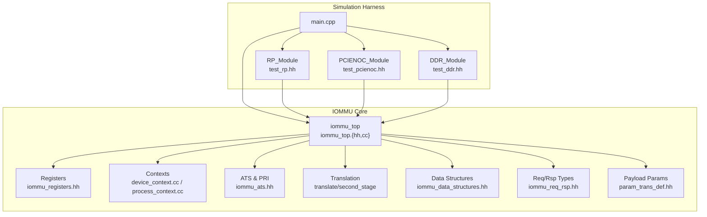
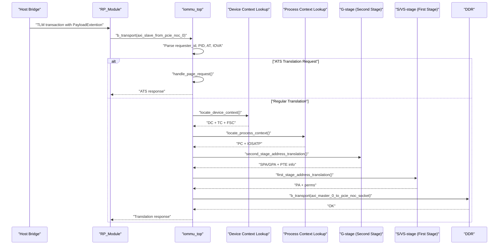
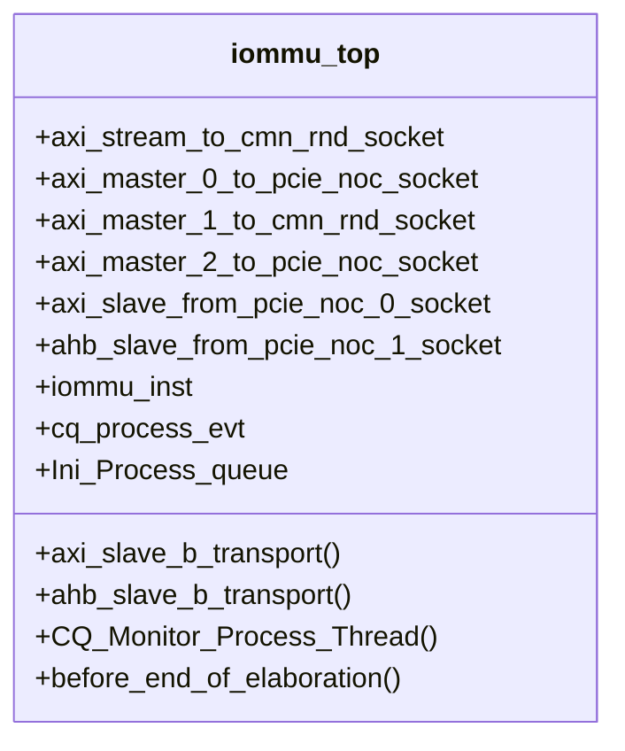
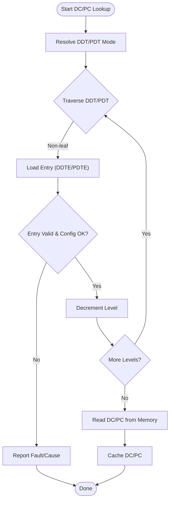
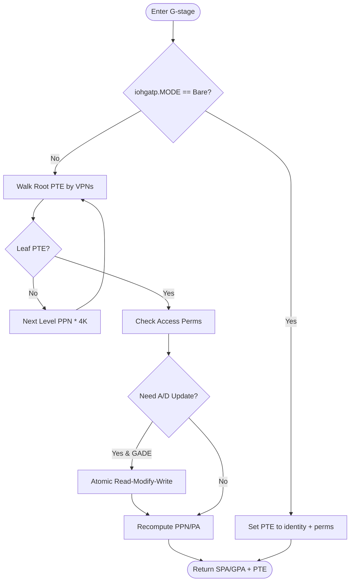
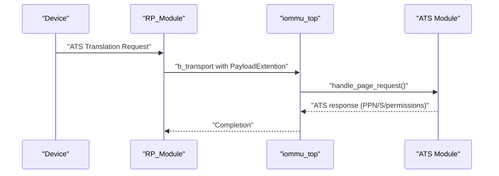
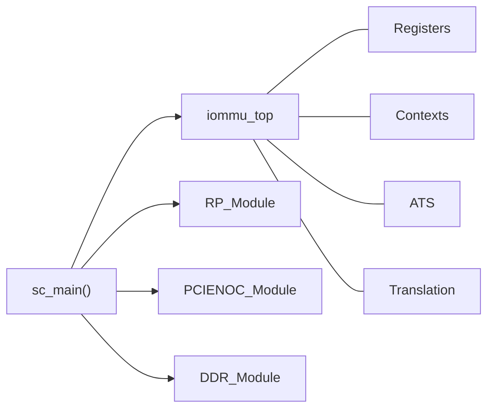
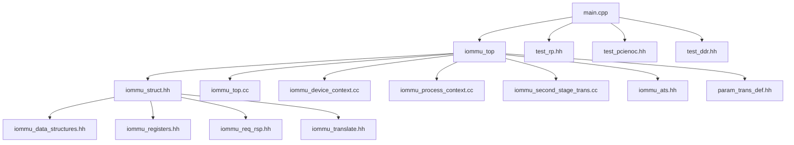

# Project Overview

<cite>
**Referenced Files in This Document**
- [main.cpp](file://main.cpp)
- [iommu_top.hh](file://iommu/iommu_top.hh)
- [iommu_top.cc](file://iommu/iommu_top.cc)
- [iommu_struct.hh](file://iommu/iommu_struct.hh)
- [iommu_data_structures.hh](file://iommu/iommu_data_structures.hh)
- [iommu_translate.hh](file://iommu/iommu_translate.hh)
- [iommu_ats.hh](file://iommu/iommu_ats.hh)
- [iommu_device_context.cc](file://iommu/iommu_device_context.cc)
- [iommu_process_context.cc](file://iommu/iommu_process_context.cc)
- [iommu_second_stage_trans.cc](file://iommu/iommu_second_stage_trans.cc)
- [iommu_registers.hh](file://iommu/iommu_registers.hh)
- [iommu_req_rsp.hh](file://iommu/iommu_req_rsp.hh)
- [param_trans_def.hh](file://iommu/param_trans_def.hh)
- [test_rp.hh](file://rp/test_rp.hh)
- [test_pcienoc.hh](file://pcienoc/test_pcienoc.hh)
- [test_ddr.hh](file://ddr/test_ddr.hh)
- [Makefile](file://Makefile)
</cite>

## Table of Contents
1. [Introduction](#introduction)
2. [Project Structure](#project-structure)
3. [Core Components](#core-components)
4. [Architecture Overview](#architecture-overview)
5. [Detailed Component Analysis](#detailed-component-analysis)
6. [Dependency Analysis](#dependency-analysis)
7. [Performance Considerations](#performance-considerations)
8. [Troubleshooting Guide](#troubleshooting-guide)
9. [Conclusion](#conclusion)
10. [Appendices](#appendices)

## Introduction
This project is a hardware simulation framework for the RISC-V Input-Output Memory Management Unit (IOMMU) built with SystemC and TLM. It models the IOMMU’s two-stage address translation pipeline, device and process context management, ATS (Address Translation Services) support, and comprehensive testing infrastructure. The model targets hardware engineers and system architects who need to validate IOMMU behavior in SoC platforms, evaluate performance and correctness of DMA translation flows, and exercise advanced features such as ATS, MSI translation, and performance monitoring.

Key capabilities demonstrated by the model:
- Two-stage address translation (G-stage guest and S/VS-stage device/protection)
- Device context (DC) and process context (PC) lookup and caching via DDT/PDT
- PCIe ATS translation requests and page-request interface (PRI)
- MSI address translation and MRIF (Memory-Resident Interrupt File) support
- Command, fault, and page-request queues with control/status registers
- Performance monitoring and event counters
- End-to-end simulation harness with RP (Root Port), PCIe NOC, and DDR modules

## Project Structure
The repository is organized around a SystemC-based simulation with a clear separation of concerns:
- Top-level simulation entry point and inter-module connections
- IOMMU core modules implementing translation, context management, ATS, and registers
- Test harness modules for RP, PCIe NOC, and DDR memory
- Build system via Makefile

**Diagram sources**
- [main.cpp:37-79](file://main.cpp#L37-L79)
- [iommu_top.hh:19-55](file://iommu/iommu_top.hh#L19-L55)
- [test_rp.hh:54-112](file://rp/test_rp.hh#L54-L112)
- [test_pcienoc.hh:10-21](file://pcienoc/test_pcienoc.hh#L10-L21)
- [test_ddr.hh:15-61](file://ddr/test_ddr.hh#L15-L61)

**Section sources**
- [Makefile:1-98](file://Makefile#L1-L98)
- [main.cpp:37-79](file://main.cpp#L37-L79)

## Core Components
- iommu_top: Top-level SystemC module exposing AXI and AHB sockets, orchestrating register access, translation requests, and binding to test modules.
- Device Context (DC) and Process Context (PC): Hierarchical lookup and validation of device and per-process translation contexts.
- Translation Engine: Two-stage translation (G-stage and S/VS-stage), MSI translation, and ATS handling.
- Registers and Control: Memory-mapped register interface including capabilities, DDTP, queues, and performance monitors.
- Test Infrastructure: RP, PCIe NOC, and DDR modules to simulate real-world traffic and memory behavior.

**Section sources**
- [iommu_top.hh:19-55](file://iommu/iommu_top.hh#L19-L55)
- [iommu_top.cc:6-36](file://iommu/iommu_top.cc#L6-L36)
- [iommu_device_context.cc:9-225](file://iommu/iommu_device_context.cc#L9-L225)
- [iommu_process_context.cc:11-196](file://iommu/iommu_process_context.cc#L11-L196)
- [iommu_translate.hh:95-130](file://iommu/iommu_translate.hh#L95-L130)
- [iommu_registers.hh:172-800](file://iommu/iommu_registers.hh#L172-L800)
- [test_rp.hh:54-112](file://rp/test_rp.hh#L54-L112)
- [test_ddr.hh:15-61](file://ddr/test_ddr.hh#L15-L61)

## Architecture Overview
The IOMMU operates as a SystemC module with TLM sockets for AXI and AHB interconnects. Transactions enter via target sockets, are parsed for ATS or translation requests, and then routed through the translation engine. Device and process contexts are resolved from DDT/PDT, and two-stage translation produces a physical address or handles MSI routing.

**Diagram sources**
- [iommu_top.cc:77-180](file://iommu/iommu_top.cc#L77-L180)
- [iommu_device_context.cc:9-225](file://iommu/iommu_device_context.cc#L9-L225)
- [iommu_process_context.cc:11-196](file://iommu/iommu_process_context.cc#L11-L196)
- [iommu_second_stage_trans.cc:7-424](file://iommu/iommu_second_stage_trans.cc#L7-L424)
- [test_rp.hh:73-85](file://rp/test_rp.hh#L73-L85)
- [test_ddr.hh:38-60](file://ddr/test_ddr.hh#L38-L60)

## Detailed Component Analysis

### iommu_top: Top-Level Orchestration
- Provides AXI initiator sockets to memory and PCIe NOC, and AHB target socket for ATS/MSI.
- Implements register read/write over AHB and translation request handling over AXI.
- Integrates with SystemC event mechanisms for command queue monitoring.

**Diagram sources**
- [iommu_top.hh:19-55](file://iommu/iommu_top.hh#L19-L55)
- [iommu_top.cc:6-36](file://iommu/iommu_top.cc#L6-L36)

**Section sources**
- [iommu_top.hh:19-55](file://iommu/iommu_top.hh#L19-L55)
- [iommu_top.cc:41-180](file://iommu/iommu_top.cc#L41-L180)

### Device Context (DC) and Process Context (PC)
- DC lookup traverses DDT radix tree based on device_id and capabilities, validates entries, and caches results.
- PC lookup traverses PDT based on process_id, translates intermediate addresses via G-stage when needed, validates entries, and caches results.

**Diagram sources**
- [iommu_device_context.cc:100-225](file://iommu/iommu_device_context.cc#L100-L225)
- [iommu_process_context.cc:64-196](file://iommu/iommu_process_context.cc#L64-L196)

**Section sources**
- [iommu_device_context.cc:9-225](file://iommu/iommu_device_context.cc#L9-L225)
- [iommu_process_context.cc:11-196](file://iommu/iommu_process_context.cc#L11-L196)

### Translation Engine: Two-Stage Pipeline
- G-stage translation converts guest physical addresses to system physical addresses using iohgatp and PTEs, with optional atomic A/D bit updates.
- S/VS-stage translation resolves IOVA to PA using iosatp or iovsatp, enforcing permissions and handling superpages/NAPOT.

**Diagram sources**
- [iommu_second_stage_trans.cc:7-424](file://iommu/iommu_second_stage_trans.cc#L7-L424)

**Section sources**
- [iommu_translate.hh:105-121](file://iommu/iommu_translate.hh#L105-L121)
- [iommu_second_stage_trans.cc:7-424](file://iommu/iommu_second_stage_trans.cc#L7-L424)

### ATS Support and Page Request Interface
- Parses incoming ATS messages, validates requester and process identifiers, and responds with PRG or translation results.
- Manages itag tracking for pending invalidations and coordinates with the host bridge.

**Diagram sources**
- [iommu_top.cc:96-118](file://iommu/iommu_top.cc#L96-L118)
- [iommu_ats.hh:47-96](file://iommu/iommu_ats.hh#L47-L96)

**Section sources**
- [iommu_ats.hh:1-98](file://iommu/iommu_ats.hh#L1-L98)
- [iommu_top.cc:96-118](file://iommu/iommu_top.cc#L96-L118)

### MSI Translation and MRIF
- Identifies MSI writes via address mask/pattern and routes to MRIF or flat MSI page table.
- Supports MSI vector configuration and memory-resident interrupt file modes.

**Section sources**
- [iommu_translate.hh:123-129](file://iommu/iommu_translate.hh#L123-L129)
- [iommu_registers.hh:730-770](file://iommu/iommu_registers.hh#L730-L770)

### Registers and Queue Control
- Memory-mapped registers expose capabilities, DDTP, queue bases/indices, and control/status bits.
- Queues (CQ/FQ/PQ) are programmable and managed via dedicated CSR fields.

**Section sources**
- [iommu_registers.hh:172-800](file://iommu/iommu_registers.hh#L172-L800)
- [iommu_top.cc:41-72](file://iommu/iommu_top.cc#L41-L72)

### Simulation Harness and Testing Infrastructure
- RP_Module drives translation requests and validates responses and faults.
- PCIENOC_Module and DDR_Module provide connectivity and memory behavior for AXI/AHB traffic.
- Makefile compiles the SystemC model with debug flags and links against libsystemc.

**Diagram sources**
- [main.cpp:37-79](file://main.cpp#L37-L79)
- [test_rp.hh:54-112](file://rp/test_rp.hh#L54-L112)
- [test_pcienoc.hh:10-21](file://pcienoc/test_pcienoc.hh#L10-L21)
- [test_ddr.hh:15-61](file://ddr/test_ddr.hh#L15-L61)

**Section sources**
- [test_rp.hh:54-112](file://rp/test_rp.hh#L54-L112)
- [test_ddr.hh:15-61](file://ddr/test_ddr.hh#L15-L61)
- [Makefile:14-24](file://Makefile#L14-L24)

## Dependency Analysis
The IOMMU core depends on shared data structures and translation APIs. The top-level module binds to test modules via TLM sockets, enabling end-to-end simulation.

**Diagram sources**
- [iommu_struct.hh:42-99](file://iommu/iommu_struct.hh#L42-L99)
- [iommu_top.cc:1-2](file://iommu/iommu_top.cc#L1-L2)
- [iommu_device_context.cc:6](file://iommu/iommu_device_context.cc#L6)
- [iommu_process_context.cc:6](file://iommu/iommu_process_context.cc#L6)
- [iommu_second_stage_trans.cc:6](file://iommu/iommu_second_stage_trans.cc#L6)
- [iommu_ats.hh:1-6](file://iommu/iommu_ats.hh#L1-L6)
- [param_trans_def.hh:12-97](file://iommu/param_trans_def.hh#L12-L97)
- [main.cpp:37-79](file://main.cpp#L37-L79)

**Section sources**
- [iommu_struct.hh:24-38](file://iommu/iommu_struct.hh#L24-L38)
- [iommu_top.cc:1-2](file://iommu/iommu_top.cc#L1-L2)

## Performance Considerations
- Translation performance benefits from cached DC/PC lookups and TLB-like structures in the IOMMU state.
- G-stage and S/VS-stage page walks scale with page table levels; minimizing PDT/DDT levels reduces latency.
- Atomic A/D updates (GADE/SADE) introduce memory traffic; ensure appropriate PTE reuse to reduce updates.
- Queue sizes and alignment impact memory bandwidth; configure CQB/FQB/PQB appropriately for workload.

[No sources needed since this section provides general guidance]

## Troubleshooting Guide
Common issues and diagnostics:
- Translation failures: Inspect cause codes and iotval/iotval2 fields populated during context and stage translation routines.
- ATS/PRI errors: Verify requester_id, PID, and AT fields in PayloadExtention; confirm DC/PC enable bits (EN_ATS, EN_PRI).
- Memory access faults: Check PMA/PMP violations and address alignment; ensure page table roots are properly aligned.
- Queue stalls: Review CQCSR/FQCSR/PQCSR status bits (cqmf, fqmf, pqmf, cmd_to, cmd_ill) and re-enable queues after clearing flags.

**Section sources**
- [iommu_device_context.cc:128-225](file://iommu/iommu_device_context.cc#L128-L225)
- [iommu_process_context.cc:125-196](file://iommu/iommu_process_context.cc#L125-L196)
- [iommu_second_stage_trans.cc:149-191](file://iommu/iommu_second_stage_trans.cc#L149-L191)
- [iommu_registers.hh:456-580](file://iommu/iommu_registers.hh#L456-L580)

## Conclusion
This SystemC-based RISC-V IOMMU model provides a comprehensive simulation environment for validating two-stage address translation, device/process context management, ATS/PRI, and MSI routing. Its modular design and extensive testing harness enable both beginner-friendly exploration and deep verification for experienced developers.

[No sources needed since this section summarizes without analyzing specific files]

## Appendices

### Practical Examples
- Running the simulation: Build with the provided Makefile and execute the resulting binary to start the SystemC simulation.
- Adding a device context: Configure DDTP, program DDT entries, and populate DC with appropriate TC/FSC/TA fields.
- Enabling ATS: Set DC.tc.EN_ATS and optionally DC.tc.T2GPA; ensure capabilities.ATS is supported.
- Validating translation: Use RP test helpers to issue translation requests and inspect iommu_to_hb_rsp_t.

**Section sources**
- [Makefile:69-70](file://Makefile#L69-L70)
- [test_rp.hh:86-96](file://rp/test_rp.hh#L86-L96)
- [iommu_registers.hh:172-250](file://iommu/iommu_registers.hh#L172-L250)