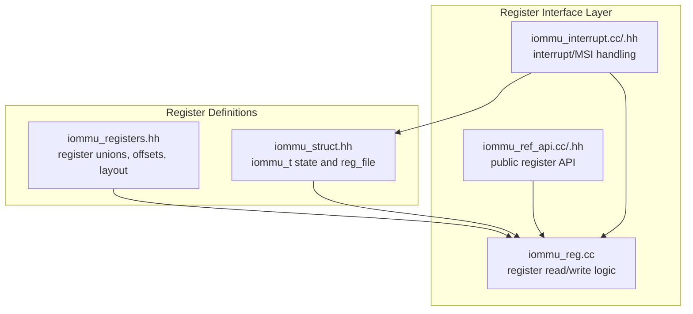
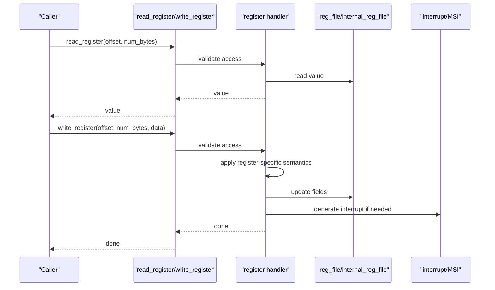
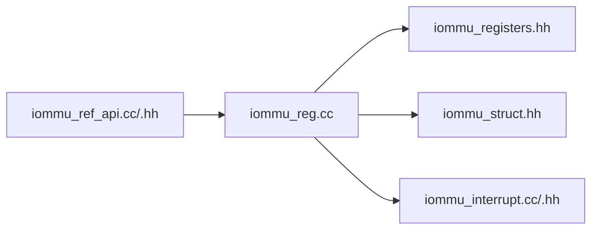

# Register Interface

<cite>
**Referenced Files in This Document**
- [iommu_reg.cc](file://iommu/iommu_reg.cc)
- [iommu_registers.hh](file://iommu/iommu_registers.hh)
- [iommu_ref_api.cc](file://iommu/iommu_ref_api.cc)
- [iommu_ref_api.hh](file://iommu/iommu_ref_api.hh)
- [iommu_struct.hh](file://iommu/iommu_struct.hh)
- [iommu_interrupt.cc](file://iommu/iommu_interrupt.cc)
- [iommu_interrupt.hh](file://iommu/iommu_interrupt.hh)
- [GDB_DEBUG_GUIDE.md](file://GDB_DEBUG_GUIDE.md)
</cite>

## Table of Contents
1. [Introduction](#introduction)
2. [Project Structure](#project-structure)
3. [Core Components](#core-components)
4. [Architecture Overview](#architecture-overview)
5. [Detailed Component Analysis](#detailed-component-analysis)
6. [Dependency Analysis](#dependency-analysis)
7. [Performance Considerations](#performance-considerations)
8. [Troubleshooting Guide](#troubleshooting-guide)
9. [Conclusion](#conclusion)

## Introduction
This document describes the register interface of the IOMMU model, focusing on the register file organization, access patterns, and configuration parameter management. It explains how registers are laid out, how read/write operations are handled, how status registers update, and how configuration registers are managed. Practical examples demonstrate register programming, configuration workflows, and register-based debugging techniques.

## Project Structure
The register interface is implemented primarily in the IOMMU core files:
- Register definitions and layout: iommu/iommu_registers.hh
- Register read/write logic: iommu/iommu_reg.cc
- Public register API: iommu/iommu_ref_api.hh and iommu/iommu_ref_api.cc
- Runtime configuration and reset: iommu/iommu_reg.cc (reset_iommu)
- Interrupt handling and MSI: iommu/iommu_interrupt.cc and iommu/iommu_interrupt.hh
- Data structures and global state: iommu/iommu_struct.hh

**Diagram sources**
- [iommu_reg.cc:1-1057](file://iommu/iommu_reg.cc#L1-L1057)
- [iommu_registers.hh:1-987](file://iommu/iommu_registers.hh#L1-L987)
- [iommu_ref_api.cc:1-278](file://iommu/iommu_ref_api.cc#L1-L278)
- [iommu_ref_api.hh:1-54](file://iommu/iommu_ref_api.hh#L1-L54)
- [iommu_struct.hh:1-102](file://iommu/iommu_struct.hh#L1-L102)
- [iommu_interrupt.cc:1-121](file://iommu/iommu_interrupt.cc#L1-L121)
- [iommu_interrupt.hh:1-26](file://iommu/iommu_interrupt.hh#L1-L26)

**Section sources**
- [iommu_reg.cc:1-1057](file://iommu/iommu_reg.cc#L1-L1057)
- [iommu_registers.hh:1-987](file://iommu/iommu_registers.hh#L1-L987)
- [iommu_ref_api.cc:1-278](file://iommu/iommu_ref_api.cc#L1-L278)
- [iommu_ref_api.hh:1-54](file://iommu/iommu_ref_api.hh#L1-L54)
- [iommu_struct.hh:1-102](file://iommu/iommu_struct.hh#L1-L102)
- [iommu_interrupt.cc:1-121](file://iommu/iommu_interrupt.cc#L1-L121)
- [iommu_interrupt.hh:1-26](file://iommu/iommu_interrupt.hh#L1-L26)

## Core Components
- Register file layout and unions: Defines all registers, their bit fields, and sizes. Includes capability flags, control/status registers, queue base/tail/head registers, performance monitoring registers, MSI configuration table, and debug registers.
- Access validation and read/write handlers: Validates alignment and size, merges partial 64-bit writes to 8-byte registers, and implements register-specific semantics (busy bits, enable/disable sequences, RW1C behavior).
- Public register API: Provides read_register and write_register wrappers for external callers.
- Reset and configuration: Initializes register defaults, validates configuration parameters, and builds the offset-to-size mapping for access validation.
- Interrupt/MSI: Uses icvec and MSI configuration table to generate interrupts; integrates with register updates.

Key responsibilities:
- Enforce alignment and size constraints for register accesses.
- Implement register-specific write semantics (enable/disable, busy, RW1C).
- Aggregate overflow and status across multiple counters.
- Manage MSI generation and masking.

**Section sources**
- [iommu_registers.hh:172-815](file://iommu/iommu_registers.hh#L172-L815)
- [iommu_reg.cc:11-908](file://iommu/iommu_reg.cc#L11-L908)
- [iommu_ref_api.hh:26-27](file://iommu/iommu_ref_api.hh#L26-L27)
- [iommu_reg.cc:909-1057](file://iommu/iommu_reg.cc#L909-L1057)

## Architecture Overview
The register interface is a memory-mapped programming interface within a 4-KiB aligned region. Reads and writes are validated for alignment and size, then dispatched to register-specific handlers. Certain registers are WARL (Write-Any-Read-legal) and have implementation-defined reset values except where explicitly stated.

**Diagram sources**
- [iommu_ref_api.cc:25-27](file://iommu/iommu_ref_api.cc#L25-L27)
- [iommu_reg.cc:38-908](file://iommu/iommu_reg.cc#L38-L908)
- [iommu_interrupt.cc:27-106](file://iommu/iommu_interrupt.cc#L27-L106)

## Detailed Component Analysis

### Register File Organization and Layout
- The register file is a packed union of all registers, organized into standard and internal regions.
- Standard registers include capabilities, feature control, device directory table pointer, queue base/tail/head registers, control/status registers, interrupt pending status, performance monitoring registers, debug registers, QoS ID, interrupt cause-to-vector, and MSI configuration table.
- Internal registers include resource controller bus range and segment ID arrays, and WARL head/tail pointers.

Bit field definitions and sizes are defined via unions for each register type. For example:
- capabilities_t: 64-bit read-only register indicating supported features.
- fctl_t: 32-bit feature control with endianness and interrupt mode fields.
- ddtp_t: 64-bit device directory table pointer with mode and busy fields.
- Queue base registers (cqb_t, fqb_t, pqb_t): 64-bit with log2szm1 and PPN fields.
- Control/status registers (cqcsr_t, fqcsr_t, pqcsr_t): 32-bit with enable, interrupt enable, busy, and RW1C bits.
- Status registers (ipsr_t): 32-bit RW1C indicating pending interrupts.
- Performance monitoring: iocountovf, iocountinh, iohpmcycles, iohpmctr[], iohpmevt[].
- Debug registers: tr_req_iova, tr_req_ctrl, tr_response.
- QoS ID: iommu_qosid_t.
- Interrupt cause-to-vector: icvec_t.
- MSI configuration table: msi_cfg_tbl[16].

Access control and reset values:
- Many registers are read-only or WARL. Specific registers have defined reset defaults (e.g., ddtp.iommu_mode reset to Off or Bare).
- Implementation-defined reset values for other registers.

**Section sources**
- [iommu_registers.hh:172-815](file://iommu/iommu_registers.hh#L172-L815)
- [iommu_registers.hh:817-987](file://iommu/iommu_registers.hh#L817-L987)

### Register Access Patterns and Validation
- Alignment and size validation: Only 4-byte and 8-byte accesses are supported. Offsets must be aligned to the access size and cannot span multiple registers.
- Partial 64-bit writes: When writing 4 bytes to an 8-byte register, the handler merges the new data with existing register content and aligns the offset to an 8-byte boundary.
- Internal vs standard registers: The handler distinguishes between standard registers (offset < IOMMU_INTERNAL_REG_OFFSET) and internal registers (offset >= IOMMU_INTERNAL_REG_OFFSET).

Overflow aggregation:
- IOCNTOVF is a read-only register that aggregates overflow bits from the cycle counter and per-counter event counters.

**Section sources**
- [iommu_reg.cc:11-26](file://iommu/iommu_reg.cc#L11-L26)
- [iommu_reg.cc:38-73](file://iommu/iommu_reg.cc#L38-L73)
- [iommu_reg.cc:28-36](file://iommu/iommu_reg.cc#L28-L36)

### Register Read/Write Semantics and Status Updates
- DDTP: Busy field prevents subsequent writes; mode transitions are constrained by supported modes and current mode. Writes with illegal values are ignored.
- Command/Fault/Page Queue Base registers: Writes are discarded if the queue is busy or enabled; on successful write, queue indices are reset to zero.
- Queue Control/Status Registers (cqcsr, fqcsr, pqcsr): Busy bit is set during control updates; enable transitions trigger index resets and status clear; RW1C bits are cleared on write of 1.
- IPSR: RW1C; writing 1 clears the corresponding pending bit and may re-pend interrupts if conditions persist and interrupts are enabled.
- Performance Monitoring: IOCNTINH masks per-counter inhibit bits; IOHPMCYCLES updates counter and overflow; per-counter writes are WARL and limited by implemented counter count.
- Debug Translation Request: TR_REQ_IOVA and TR_REQ_CTRL are WARL; on transitioning go_busy from 0 to 1, translation is executed and results are placed in TR_RESPONSE.
- MSI Configuration Table: Indexed by interrupt vector; MSI address is masked to physical address width; MSI vector control mask bit can defer pending MSI.

**Section sources**
- [iommu_reg.cc:234-271](file://iommu/iommu_reg.cc#L234-L271)
- [iommu_reg.cc:272-288](file://iommu/iommu_reg.cc#L272-L288)
- [iommu_reg.cc:296-314](file://iommu/iommu_reg.cc#L296-L314)
- [iommu_reg.cc:322-343](file://iommu/iommu_reg.cc#L322-L343)
- [iommu_reg.cc:354-432](file://iommu/iommu_reg.cc#L354-L432)
- [iommu_reg.cc:433-493](file://iommu/iommu_reg.cc#L433-L493)
- [iommu_reg.cc:494-560](file://iommu/iommu_reg.cc#L494-L560)
- [iommu_reg.cc:561-614](file://iommu/iommu_reg.cc#L561-L614)
- [iommu_reg.cc:618-673](file://iommu/iommu_reg.cc#L618-L673)
- [iommu_reg.cc:719-776](file://iommu/iommu_reg.cc#L719-L776)
- [iommu_reg.cc:808-905](file://iommu/iommu_reg.cc#L808-L905)

### Interrupt Generation and MSI Handling
- Interrupt pending status (IPSR) is updated by register writes (e.g., clearing pending bits).
- Interrupt cause-to-vector (ICVEC) maps causes to vectors; MSI configuration table selects MSI address/data and mask.
- MSI generation: If masked, pending MSI is stored and released when mask is cleared.

**Section sources**
- [iommu_interrupt.cc:27-106](file://iommu/iommu_interrupt.cc#L27-L106)
- [iommu_interrupt.hh:16-24](file://iommu/iommu_interrupt.hh#L16-L24)
- [iommu_reg.cc:808-905](file://iommu/iommu_reg.cc#L808-L905)

### Reset and Configuration Parameter Management
- reset_iommu initializes register defaults, validates configuration parameters, and builds the offset-to-size mapping.
- Resets:
  - Registers initialized to 0 by default.
  - capabilities and fctl initialized from provided values.
  - ddtp.iommu_mode reset to Off or Bare.
- Parameters:
  - num_hpm, hpmctr_bits, eventID_limit, num_vec_bits, max_iommu_mode, max_devid_mask, gxl_writeable, fctl_be_writeable, fill_ats_trans_in_ioatc.
  - Bare page sizes for various stages.

**Section sources**
- [iommu_reg.cc:909-1057](file://iommu/iommu_reg.cc#L909-L1057)

### Public Register API
- read_register and write_register provide a unified interface for external callers.
- These functions delegate to the internal validation and handler logic.

**Section sources**
- [iommu_ref_api.cc:25-27](file://iommu/iommu_ref_api.cc#L25-L27)
- [iommu_ref_api.hh:26-27](file://iommu/iommu_ref_api.hh#L26-L27)

## Dependency Analysis
The register interface depends on:
- Register definitions (iommu_registers.hh) for bit-field layouts and offsets.
- Global state (iommu_struct.hh) for the register file and runtime parameters.
- Interrupt subsystem for updating pending status and generating MSI.

**Diagram sources**
- [iommu_reg.cc:1-1057](file://iommu/iommu_reg.cc#L1-L1057)
- [iommu_registers.hh:1-987](file://iommu/iommu_registers.hh#L1-L987)
- [iommu_struct.hh:1-102](file://iommu/iommu_struct.hh#L1-L102)
- [iommu_interrupt.cc:1-121](file://iommu/iommu_interrupt.cc#L1-L121)
- [iommu_ref_api.cc:1-278](file://iommu/iommu_ref_api.cc#L1-L278)

**Section sources**
- [iommu_reg.cc:1-1057](file://iommu/iommu_reg.cc#L1-L1057)
- [iommu_registers.hh:1-987](file://iommu/iommu_registers.hh#L1-L987)
- [iommu_struct.hh:1-102](file://iommu/iommu_struct.hh#L1-L102)
- [iommu_interrupt.cc:1-121](file://iommu/iommu_interrupt.cc#L1-L121)
- [iommu_ref_api.cc:1-278](file://iommu/iommu_ref_api.cc#L1-L278)

## Performance Considerations
- Register access validation is constant-time and uses a precomputed offset-to-size mapping.
- Partial 64-bit writes are merged efficiently without extra copies.
- Interrupt generation checks are lightweight and short-circuit when masked or already pending.
- Performance monitoring counters are updated in-place with minimal overhead.

## Troubleshooting Guide
Common issues and techniques:
- Invalid register access: Misaligned or spanning accesses are ignored. Verify alignment to 4 or 8 bytes and ensure the access does not cross register boundaries.
- Busy register updates: Writes to DDTP, queue bases, and queue control/status registers are ignored while busy or when queues are enabled. Disable queues and wait for busy to clear before reprogramming.
- Interrupts not firing: Check IPSR pending bits and interrupt enable bits in the queue CSR registers. Clear pending bits via IPSR and ensure ICVEC vectors are configured.
- MSI not delivered: Verify MSI address/data/mask in the MSI configuration table and ensure the vector is not masked.
- Debug translation request not completing: Ensure TR_REQ_CTRL go_busy transitions from 0 to 1 and that TR_REQ_IOVA is valid. Check TR_RESPONSE for faults.
- Register-based debugging: Use GDB to inspect iommu->reg_file fields and step through register handlers.

Practical debugging steps:
- Set breakpoints at register handlers and translation functions.
- Inspect capability flags to confirm supported features.
- Monitor IPSR and CSR busy bits to understand queue states.
- Use GDB to print register unions and individual fields.

**Section sources**
- [iommu_reg.cc:11-26](file://iommu/iommu_reg.cc#L11-L26)
- [iommu_reg.cc:234-271](file://iommu/iommu_reg.cc#L234-L271)
- [iommu_reg.cc:354-432](file://iommu/iommu_reg.cc#L354-L432)
- [iommu_interrupt.cc:27-106](file://iommu/iommu_interrupt.cc#L27-L106)
- [GDB_DEBUG_GUIDE.md:69-120](file://GDB_DEBUG_GUIDE.md#L69-L120)

## Conclusion
The IOMMU register interface provides a robust, validated, and semantically rich programming model. It enforces strict alignment and size constraints, implements register-specific write semantics, aggregates status across multiple counters, and integrates with interrupt and MSI handling. The provided reset and configuration management ensures predictable initialization, while the public API and debugging guide facilitate reliable development and diagnostics.