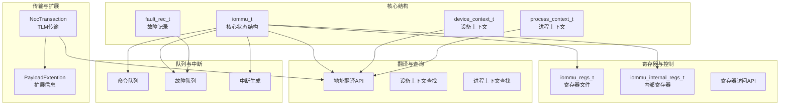
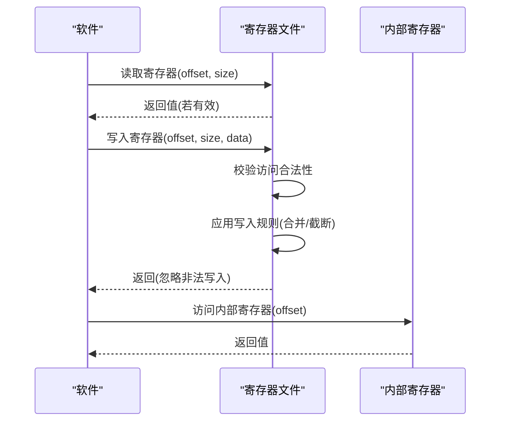
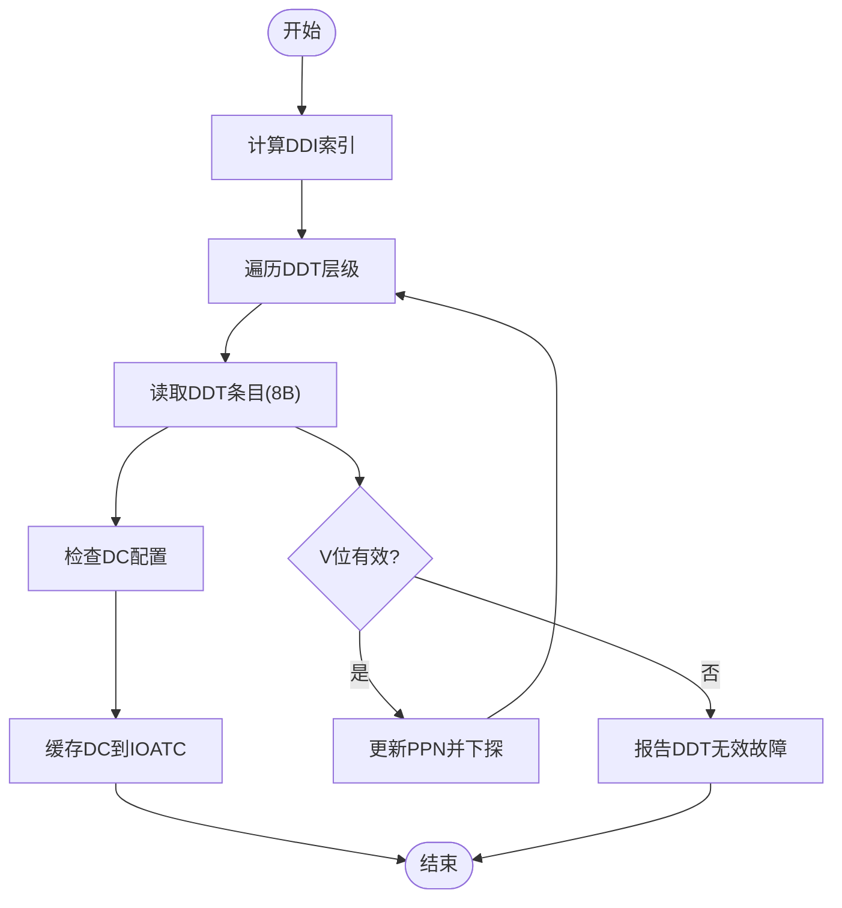
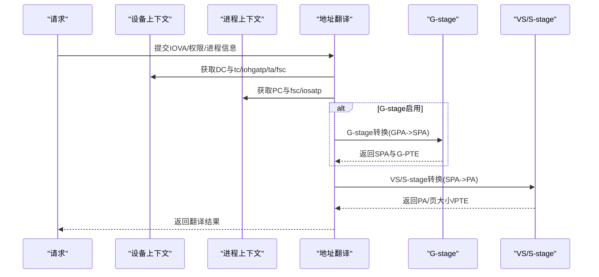
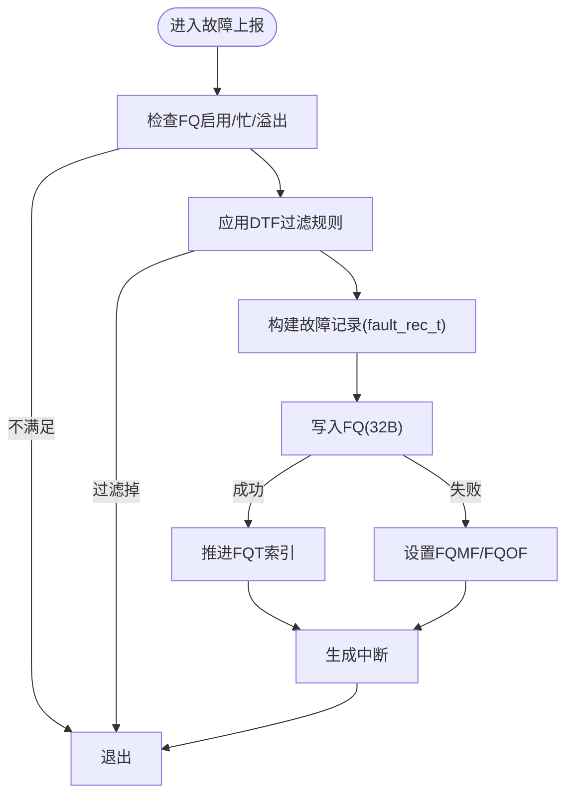
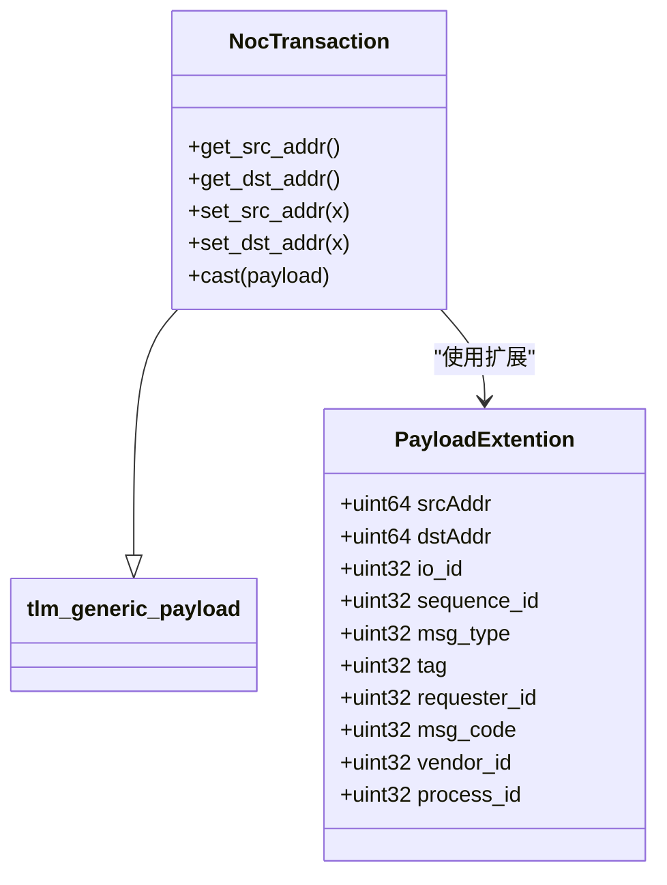
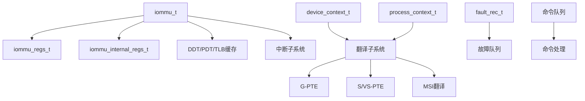

# API参考手册

<cite>
**本文档引用的文件**
- [iommu_struct.hh](file://iommu/iommu_struct.hh)
- [iommu_data_structures.hh](file://iommu/iommu_data_structures.hh)
- [param_trans_def.hh](file://iommu/param_trans_def.hh)
- [iommu_req_rsp.hh](file://iommu/iommu_req_rsp.hh)
- [iommu_registers.hh](file://iommu/iommu_registers.hh)
- [iommu_fault.hh](file://iommu/iommu_fault.hh)
- [iommu_ref_api.hh](file://iommu/iommu_ref_api.hh)
- [iommu_translate.hh](file://iommu/iommu_translate.hh)
- [iommu_utils.hh](file://iommu/iommu_utils.hh)
- [iommu_reg.cc](file://iommu/iommu_reg.cc)
- [iommu_device_context.cc](file://iommu/iommu_device_context.cc)
- [iommu_process_context.cc](file://iommu/iommu_process_context.cc)
- [iommu_faults.cc](file://iommu/iommu_faults.cc)
- [iommu_interrupt.hh](file://iommu/iommu_interrupt.hh)
- [iommu_command_queue.hh](file://iommu/iommu_command_queue.hh)
- [iommu_ats.hh](file://iommu/iommu_ats.hh)
- [iommu_atc.hh](file://iommu/iommu_atc.hh)
</cite>

## 目录
1. [简介](#简介)
2. [项目结构](#项目结构)
3. [核心组件](#核心组件)
4. [架构概览](#架构概览)
5. [详细组件分析](#详细组件分析)
6. [依赖关系分析](#依赖关系分析)
7. [性能考虑](#性能考虑)
8. [故障排除指南](#故障排除指南)
9. [结论](#结论)
10. [附录](#附录)

## 简介
本API参考手册面向IOMMU（I/O内存管理单元）模型的使用者与集成者，系统性地梳理了公共接口与数据结构定义，涵盖以下核心主题：
- 核心状态结构：iommu_t，包含寄存器文件、内部状态、缓存与中断等
- 设备上下文：device_context_t，描述设备级地址翻译控制与属性
- 进程上下文：process_context_t，描述进程级地址翻译控制与属性
- 故障记录：fault_rec_t，描述故障队列中的故障条目
- 寄存器映射API：寄存器访问、状态查询与配置参数设置
- 传输参数与扩展信息：param_trans_def.hh中定义的TLM传输扩展
- 请求/响应数据结构：消息格式、字段含义与序列化方法
- API参数说明、返回值定义、使用示例与注意事项
- 版本兼容性与迁移指南

## 项目结构
该IOMMU模型采用模块化设计，按功能域划分头文件与实现文件：
- 结构与数据：iommu_struct.hh、iommu_data_structures.hh、iommu_req_rsp.hh、iommu_fault.hh
- 寄存器与控制：iommu_registers.hh、iommu_reg.cc
- 翻译与查询：iommu_translate.hh、iommu_device_context.cc、iommu_process_context.cc
- 队列与中断：iommu_command_queue.hh、iommu_interrupt.hh、iommu_faults.cc
- 扩展与传输：param_trans_def.hh、iommu_ats.hh、iommu_atc.hh
- 工具函数：iommu_utils.hh



**图表来源**
- [iommu_struct.hh:42-99](file://iommu/iommu_struct.hh#L42-L99)
- [iommu_registers.hh:777-828](file://iommu/iommu_registers.hh#L777-L828)
- [iommu_data_structures.hh:324-412](file://iommu/iommu_data_structures.hh#L324-L412)
- [iommu_fault.hh:63-77](file://iommu/iommu_fault.hh#L63-L77)
- [param_trans_def.hh:104-128](file://iommu/param_trans_def.hh#L104-L128)

**章节来源**
- [iommu_struct.hh:1-102](file://iommu/iommu_struct.hh#L1-L102)
- [iommu_registers.hh:1-120](file://iommu/iommu_registers.hh#L1-L120)

## 核心组件

### iommu_t 核心状态结构
- 作用：承载IOMMU运行时状态，包括寄存器文件、内部状态、缓存、指针与全局参数
- 关键字段：
  - 命令队列与失效相关标志位（如等待ITAG失效、IOFENCE待处理等）
  - 指向SystemC顶层模块的指针
  - 寄存器文件与内部寄存器
  - 寄存器偏移到大小映射表
  - 全局参数（HPM计数器数量、事件ID上限、向量位宽、模式支持等）
  - 缓存结构（DDT/PDT/TLB）、LRU时间戳
  - ITAG跟踪器与挂起MSI数组

**章节来源**
- [iommu_struct.hh:42-99](file://iommu/iommu_struct.hh#L42-L99)

### device_context_t 设备上下文
- 作用：描述设备级地址翻译控制与属性，决定第一/第二阶段页表选择与MSI处理
- 关键字段：
  - tc：翻译控制（EN_ATS、EN_PRI、T2GPA、DTF、PDTV、SBE、SXL等）
  - iohgatp：G-stage页表根与虚拟机软上下文ID
  - ta：翻译属性（PSCID、RCID、MCID）
  - fsc：第一阶段上下文（iosatp或pdtp）
  - msiptp、msi_addr_mask、msi_addr_pattern：MSI页表与识别掩码/模式
  - reserved：扩展格式保留字段

**章节来源**
- [iommu_data_structures.hh:324-335](file://iommu/iommu_data_structures.hh#L324-L335)
- [iommu_data_structures.hh:310-338](file://iommu/iommu_data_structures.hh#L310-L338)

### process_context_t 进程上下文
- 作用：描述进程级地址翻译控制与属性，用于多进程场景下的地址空间隔离
- 关键字段：
  - ta：进程上下文属性（V、ENS、SUM、PSCID等）
  - fsc：进程级页表选择（iosatp）

**章节来源**
- [iommu_data_structures.hh:409-412](file://iommu/iommu_data_structures.hh#L409-L412)

### fault_rec_t 故障记录
- 作用：故障队列中的单条故障记录，携带故障原因、设备/进程信息与iotval/iotval2
- 关键字段：
  - CAUSE：故障原因编码
  - PID/PV/PRIV：进程ID与特权位
  - TTYP：事务类型
  - DID：设备ID
  - iotval/iotval2：故障相关寄存器值

**章节来源**
- [iommu_fault.hh:63-77](file://iommu/iommu_fault.hh#L63-L77)

## 架构概览

```mermaid
graph TB
HB[主机桥接(HB)] --> API[IOMMU参考API]
API --> REG[寄存器接口]
API --> DC[设备上下文查找]
API --> PC[进程上下文查找]
API --> TX[地址翻译]
TX --> GPT[G-stage页表]
TX --> SPT[VS/S-stage页表]
TX --> MSI[MSI地址翻译]
DC --> DCACHE[DDT缓存]
PC --> PCACHE[PDT缓存]
TX --> TLB[TLB缓存]
API --> FQ[故障队列]
API --> CQ[命令队列]
API --> INT[中断生成]
```

**图表来源**
- [iommu_ref_api.hh:39-47](file://iommu/iommu_ref_api.hh#L39-L47)
- [iommu_device_context.cc:9-229](file://iommu/iommu_device_context.cc#L9-L229)
- [iommu_process_context.cc:11-196](file://iommu/iommu_process_context.cc#L11-L196)
- [iommu_translate.hh:95-130](file://iommu/iommu_translate.hh#L95-L130)

## 详细组件分析

### 寄存器映射API

#### 寄存器布局与访问
- 寄存器文件布局：capabilities、fctl、ddtp、队列基址与索引、CSR、中断状态、HPM计数器与事件选择器、调试接口、QoS ID、MSI配置表等
- 访问规则：
  - 仅支持4字节与8字节对齐访问
  - 跨寄存器访问行为未指定
  - 内部寄存器位于独立偏移段
- 读写语义：
  - 只读寄存器禁止写入
  - 写入可能触发BUSY状态与异步完成
  - 某些寄存器在特定模式下不可写



**图表来源**
- [iommu_reg.cc:11-73](file://iommu/iommu_reg.cc#L11-L73)
- [iommu_reg.cc:74-159](file://iommu/iommu_reg.cc#L74-L159)

**章节来源**
- [iommu_registers.hh:777-828](file://iommu/iommu_registers.hh#L777-L828)
- [iommu_reg.cc:11-73](file://iommu/iommu_reg.cc#L11-L73)

#### 状态查询与配置参数
- 状态查询：
  - 通过只读寄存器查询能力、端序、HPM溢出等
  - 通过队列CSR查询队列启用/忙/错误状态
- 配置参数设置：
  - fctl：端序、中断模式等可写字段
  - ddtp：IOMMU模式、根页表PPN
  - 队列基址与索引：cqb/cqt、fqb/fqt、pqb/pqt
  - HPM计数器与事件选择器
  - 调试接口与QoS ID

**章节来源**
- [iommu_registers.hh:185-271](file://iommu/iommu_registers.hh#L185-L271)
- [iommu_reg.cc:234-271](file://iommu/iommu_reg.cc#L234-L271)

### 设备上下文与进程上下文

#### 设备上下文查找流程
- 步骤：
  1) 根据ddtp模式与设备ID计算DDI索引
  2) 逐级遍历DDT（非叶子节点为8字节，叶子节点为DC）
  3) 读取DC并进行配置检查（模式、端序、QoS ID等）
  4) 成功后缓存DC到IOATC



**图表来源**
- [iommu_device_context.cc:10-229](file://iommu/iommu_device_context.cc#L10-L229)

**章节来源**
- [iommu_device_context.cc:9-229](file://iommu/iommu_device_context.cc#L9-L229)

#### 进程上下文查找流程
- 步骤：
  1) 使用DC中的pdtp确定PDT根PPN
  2) 若G-stage启用，先将a转换为SPA
  3) 遍历PDT（非叶子节点为8字节，叶子节点为16字PC）
  4) 读取PC并进行配置检查
  5) 成功后缓存PC到IOATC

**章节来源**
- [iommu_process_context.cc:11-196](file://iommu/iommu_process_context.cc#L11-L196)

### 地址翻译API

#### 两阶段地址翻译
- 接口：two_stage_address_translation(...)
- 输入：IOVA、事务类型、设备ID、读/写/执行、进程ID/软上下文、权限位、页表模式、QoS ID等
- 输出：物理地址、页大小、VS/G-stage PTE、故障原因与iotval2

#### 第二阶段地址翻译（G-stage）
- 接口：second_stage_address_translation(...)
- 用途：将GPA转换为SPA，用于PDT/MSI等间接寻址

#### MSI地址翻译
- 接口：msi_address_translation(...)
- 用途：识别MSI写入并定位MRIF或生成MSI



**图表来源**
- [iommu_translate.hh:105-130](file://iommu/iommu_translate.hh#L105-L130)

**章节来源**
- [iommu_translate.hh:95-130](file://iommu/iommu_translate.hh#L95-L130)

### 故障处理API

#### 故障上报流程
- 条件检查：FQ启用、无内存故障、无队列溢出
- DTF过滤：根据DTF位决定是否上报翻译过程故障
- 写入故障队列：按FQ基址与索引计算地址，写入32字节记录
- 中断生成：根据FQCSR状态生成中断



**图表来源**
- [iommu_faults.cc:8-159](file://iommu/iommu_faults.cc#L8-L159)

**章节来源**
- [iommu_faults.cc:8-159](file://iommu/iommu_faults.cc#L8-L159)

### 传输参数与扩展信息

#### NocTransaction与PayloadExtention
- NocTransaction：基于tlm::tlm_generic_payload的扩展，提供源/目的地址、IO ID、序列号等
- PayloadExtention：扩展载荷，包含消息类型、标签、请求者ID、TC、首尾字节使能、消息码、PCIe参数等



**图表来源**
- [param_trans_def.hh:12-97](file://iommu/param_trans_def.hh#L12-L97)
- [param_trans_def.hh:104-128](file://iommu/param_trans_def.hh#L104-L128)

**章节来源**
- [param_trans_def.hh:12-128](file://iommu/param_trans_def.hh#L12-L128)

### 请求/响应数据结构

#### 请求结构
- hb_to_iommu_req_t：主机桥接到IOMMU的请求，包含设备ID、进程ID、读写/执行/私有属性、翻译请求等

#### 响应结构
- iommu_to_hb_rsp_t：IOMMU到主机桥接的响应，包含状态与翻译结果
- iommu_trans_rsp_t：翻译结果，包含PPN、权限位、MSI/MRIF标识、目标MRIF地址等

**章节来源**
- [iommu_req_rsp.hh:36-102](file://iommu/iommu_req_rsp.hh#L36-L102)

## 依赖关系分析



**图表来源**
- [iommu_struct.hh:42-99](file://iommu/iommu_struct.hh#L42-L99)
- [iommu_atc.hh:37-96](file://iommu/iommu_atc.hh#L37-L96)
- [iommu_command_queue.hh:38-109](file://iommu/iommu_command_queue.hh#L38-L109)

**章节来源**
- [iommu_atc.hh:37-96](file://iommu/iommu_atc.hh#L37-L96)
- [iommu_command_queue.hh:38-109](file://iommu/iommu_command_queue.hh#L38-L109)

## 性能考虑
- 缓存优化：DDT/PDT/TLB缓存减少重复查找与内存访问
- HPM计数器：支持硬件性能监控，注意计数器宽度与溢出处理
- 队列管理：命令/故障/页面请求队列的启用/禁用与索引更新需遵循CSR状态
- 端序与原子操作：根据fctl与能力位配置端序与原子位更新策略

## 故障排除指南
- 寄存器访问异常：
  - 检查对齐与尺寸（仅支持4B/8B）
  - 确认跨寄存器访问未发生
- DDTP写入被忽略：
  - 检查busy位与模式切换条件
  - 确保在Off/Bare模式间切换
- 队列写入失败：
  - 检查FQCSR的fqmf/fqof状态
  - 确认队列未满且内存访问合法
- DDT/PC配置错误：
  - 核对模式编码与能力位匹配
  - 检查端序与QoS ID宽度限制

**章节来源**
- [iommu_reg.cc:234-271](file://iommu/iommu_reg.cc#L234-L271)
- [iommu_faults.cc:23-44](file://iommu/iommu_faults.cc#L23-L44)
- [iommu_device_context.cc:231-418](file://iommu/iommu_device_context.cc#L231-L418)
- [iommu_process_context.cc:197-235](file://iommu/iommu_process_context.cc#L197-L235)

## 结论
本API参考手册系统梳理了IOMMU模型的核心数据结构与接口，明确了寄存器映射、上下文查找、地址翻译与故障处理的关键流程，并提供了依赖关系与性能考量。建议在集成时严格遵循寄存器访问规则与上下文配置约束，合理利用缓存与HPM功能以获得最佳性能。

## 附录

### API清单与签名摘要

- 寄存器访问
  - 读寄存器：read_register(iommu_t*, uint16_t, uint8_t) → uint64_t
  - 写寄存器：write_register(iommu_t*, uint16_t, uint8_t, uint64_t)
  - 示例路径：[iommu_reg.cc:38-73](file://iommu/iommu_reg.cc#L38-L73)

- 上下文查找
  - 定位设备上下文：locate_device_context(...)
  - 定位进程上下文：locate_process_context(...)
  - 示例路径：[iommu_device_context.cc:9-229](file://iommu/iommu_device_context.cc#L9-L229)，[iommu_process_context.cc:11-196](file://iommu/iommu_process_context.cc#L11-L196)

- 地址翻译
  - 两阶段翻译：two_stage_address_translation(...)
  - 第二阶段翻译：second_stage_address_translation(...)
  - MSI翻译：msi_address_translation(...)
  - 示例路径：[iommu_translate.hh:95-130](file://iommu/iommu_translate.hh#L95-L130)

- 故障上报
  - 故障上报：report_fault(...)
  - 示例路径：[iommu_faults.cc:8-159](file://iommu/iommu_faults.cc#L8-L159)

- 中断与队列
  - 生成中断：generate_interrupt(iommu_t*, uint8_t)
  - 命令处理：process_commands(iommu_t*)
  - 示例路径：[iommu_interrupt.hh:23-24](file://iommu/iommu_interrupt.hh#L23-L24)，[iommu_ref_api.hh:44-44](file://iommu/iommu_ref_api.hh#L44-L44)

- 传输扩展
  - NocTransaction/NocTransaction::cast
  - PayloadExtention扩展字段与克隆/复制
  - 示例路径：[param_trans_def.hh:104-128](file://iommu/param_trans_def.hh#L104-L128)

### 版本兼容性与迁移指南
- 能力位与模式：
  - fctl.gxl与dc.iohgatp.MODE需匹配
  - capabilities.SvNx与SXL约束需一致
- 端序与原子位：
  - fctl.be与dc.tc.SBE需一致（当能力允许）
  - AMO相关位（SADE/GADE）需与能力匹配
- 队列与CSR：
  - 修改cqb/fqb/pqb前需确保busy与启用状态
  - 写入CSR时注意RW1C位的清零语义
- 迁移建议：
  - 从Off/Bare迁移到多级目录时，先禁用队列再修改
  - 新增能力时，优先在Off/Bare模式下验证配置正确性

**章节来源**
- [iommu_registers.hh:185-271](file://iommu/iommu_registers.hh#L185-L271)
- [iommu_device_context.cc:231-418](file://iommu/iommu_device_context.cc#L231-L418)
- [iommu_process_context.cc:197-235](file://iommu/iommu_process_context.cc#L197-L235)