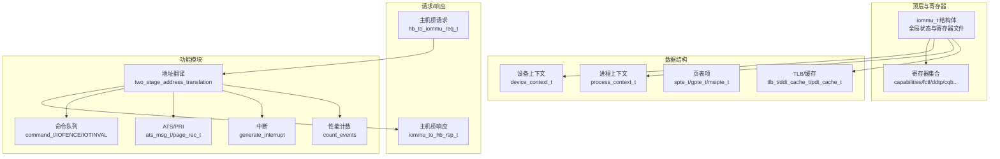
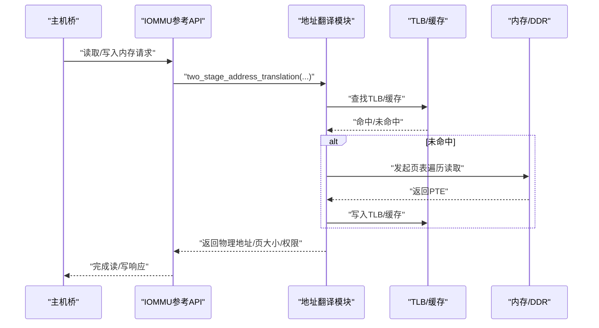
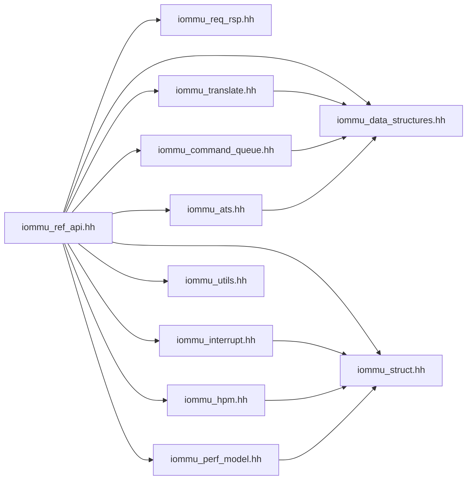

# API参考手册

<cite>
**本文档引用的文件**
- [iommu_ref_api.hh](file://iommu/include/iommu_ref_api.hh)
- [iommu_data_structures.hh](file://iommu/include/iommu_data_structures.hh)
- [iommu_struct.hh](file://iommu/include/iommu_struct.hh)
- [iommu_req_rsp.hh](file://iommu/include/iommu_req_rsp.hh)
- [iommu_translate.hh](file://iommu/include/iommu_translate.hh)
- [iommu_registers.hh](file://iommu/include/iommu_registers.hh)
- [iommu_fault.hh](file://iommu/include/iommu_fault.hh)
- [iommu_interrupt.hh](file://iommu/include/iommu_interrupt.hh)
- [iommu_command_queue.hh](file://iommu/include/iommu_command_queue.hh)
- [iommu_ats.hh](file://iommu/include/iommu_ats.hh)
- [iommu_atc.hh](file://iommu/include/iommu_atc.hh)
- [iommu_hpm.hh](file://iommu/include/iommu_hpm.hh)
- [iommu_utils.hh](file://iommu/include/iommu_utils.hh)
- [iommu_perf_model.hh](file://iommu/include/iommu_perf_model.hh)
- [iommu_task.hh](file://iommu/include/iommu_task.hh)
</cite>

## 目录
1. [简介](#简介)
2. [项目结构](#项目结构)
3. [核心组件](#核心组件)
4. [架构概览](#架构概览)
5. [详细组件分析](#详细组件分析)
6. [依赖关系分析](#依赖关系分析)
7. [性能考虑](#性能考虑)
8. [故障排查指南](#故障排查指南)
9. [结论](#结论)
10. [附录](#附录)

## 简介
本参考手册面向IOMMU功能模型的使用者与集成者，系统性梳理公共接口、数据结构与函数原型，覆盖内存访问、寄存器编程、地址翻译、ATS/PRI、中断与性能监控等能力。文档提供接口语义、参数与返回值说明、使用示例路径与最佳实践，并对版本兼容性、变更历史、性能特征与使用限制进行说明，同时给出接口索引与交叉引用，便于快速定位与正确使用。

## 项目结构
IOMMU功能模型采用分层与模块化组织：顶层结构体承载全局状态与寄存器文件；数据结构定义设备上下文、进程上下文、页表项与TLB缓存；请求/响应结构描述主机桥与IOMMU之间的消息格式；翻译与命令队列模块实现地址转换与命令处理；ATS模块支持PCIe ATS/PRI；中断与性能计数模块提供事件统计与中断生成；工具与性能建模模块提供通用辅助与性能估算。

**图表来源**
- [iommu_struct.hh:42-99](file://iommu/include/iommu_struct.hh#L42-L99)
- [iommu_registers.hh:777-800](file://iommu/include/iommu_registers.hh#L777-L800)
- [iommu_data_structures.hh:324-412](file://iommu/include/iommu_data_structures.hh#L324-L412)
- [iommu_req_rsp.hh:37-103](file://iommu/include/iommu_req_rsp.hh#L37-L103)
- [iommu_translate.hh:105-129](file://iommu/include/iommu_translate.hh#L105-L129)
- [iommu_command_queue.hh:38-109](file://iommu/include/iommu_command_queue.hh#L38-L109)
- [iommu_ats.hh:47-91](file://iommu/include/iommu_ats.hh#L47-L91)
- [iommu_interrupt.hh:16-24](file://iommu/include/iommu_interrupt.hh#L16-L24)
- [iommu_hpm.hh:42-43](file://iommu/include/iommu_hpm.hh#L42-L43)

**章节来源**
- [iommu_struct.hh:42-99](file://iommu/include/iommu_struct.hh#L42-L99)
- [iommu_registers.hh:777-800](file://iommu/include/iommu_registers.hh#L777-L800)

## 核心组件
本节概述公共API与关键数据结构，包括内存访问接口、寄存器读写、地址翻译、ATS/PRI处理、命令队列、中断与性能计数等。

- 内存访问接口
  - 读取/写入内存（含AMO）
  - 测试用读写接口（无上下文）
- 寄存器编程接口
  - 读寄存器/写寄存器
- 地址翻译与ATS
  - 设备上下文定位
  - 进程上下文定位
  - 两级地址翻译
  - 第二阶段翻译
  - MSI地址翻译
  - ATS消息处理与超时
- 命令队列与控制
  - DDT/PDT失效
  - VMA/GVMA失效
  - ATS消息发送
  - IOFENCE命令执行
- 中断与可观测性
  - 中断生成与释放
  - 全局可观测同步
- 性能与事件计数
  - 事件计数
- 工具与辅助
  - 位域提取
  - 地址范围匹配

**章节来源**
- [iommu_ref_api.hh:13-47](file://iommu/include/iommu_ref_api.hh#L13-L47)
- [iommu_translate.hh:95-129](file://iommu/include/iommu_translate.hh#L95-L129)
- [iommu_command_queue.hh:113-122](file://iommu/include/iommu_command_queue.hh#L113-L122)
- [iommu_interrupt.hh:23-24](file://iommu/include/iommu_interrupt.hh#L23-L24)
- [iommu_hpm.hh:42-43](file://iommu/include/iommu_hpm.hh#L42-L43)
- [iommu_utils.hh:7-10](file://iommu/include/iommu_utils.hh#L7-L10)

## 架构概览
IOMMU功能模型通过统一的顶层结构体承载全局状态，寄存器文件提供配置与控制，数据结构描述设备/进程上下文与页表项，请求/响应结构定义主机桥交互协议。地址翻译模块贯穿两阶段（S/VS与G），结合TLB/缓存提升性能；ATS模块处理PCIe ATS/PRI；命令队列模块实现设备目录与页表失效、IOFENCE等；中断与性能模块提供事件统计与中断生成。

**图表来源**
- [iommu_ref_api.hh:13-47](file://iommu/include/iommu_ref_api.hh#L13-L47)
- [iommu_translate.hh:105-121](file://iommu/include/iommu_translate.hh#L105-L121)
- [iommu_atc.hh:70-95](file://iommu/include/iommu_atc.hh#L70-L95)

## 详细组件分析

### 内存访问接口
- read_memory
  - 功能：以指定RCID/MCID/PMA属性读取设备地址空间数据
  - 参数：iommu指针、目标地址、数据长度、输出缓冲、RCID、MCID、PMA、端序
  - 返回：成功/失败状态
  - 使用场景：设备DMA读取、调试读取
- read_memory_for_AMO
  - 功能：支持原子操作的内存读取
  - 参数：与read_memory类似，额外端序参数
- write_memory
  - 功能：以指定RCID/MCID/PMA属性写入设备地址空间
  - 参数：iommu指针、输入缓冲、目标地址、长度、RCID、MCID、PMA、端序
  - 返回：成功/失败状态
- read_memory_test / write_memory_test
  - 功能：简化测试接口（可选重载）
  - 参数：根据具体重载形式传入
  - 返回：成功/失败状态

最佳实践
- 严格校验地址对齐与长度，避免跨页或越界访问
- 对于AMO场景使用专用读取接口确保原子性
- 在多设备/多进程环境下合理设置RCID/MCID以区分QoS

**章节来源**
- [iommu_ref_api.hh:13-24](file://iommu/include/iommu_ref_api.hh#L13-L24)

### 寄存器编程接口
- read_register
  - 功能：按偏移与字节数读取寄存器
  - 参数：iommu指针、寄存器偏移、字节数
  - 返回：寄存器值
- write_register
  - 功能：按偏移与字节数写入寄存器
  - 参数：iommu指针、偏移、字节数、数据
- reset_iommu
  - 功能：复位IOMMU并初始化能力、模式与页大小
  - 参数：iommu指针、HPM计数器数量与位宽、事件ID上限、向量位宽、复位模式、最大IOMMU模式、最大设备ID掩码、GXL可写、fctl.BE可写、ATS填充策略、能力集、fctl、各页大小配置
  - 返回：0表示成功，其他值表示错误码

注意
- 寄存器访问需满足对齐要求，越界或跨寄存器访问行为未定义
- 某些字段仅在特定模式下有效，需先切换到Off再修改关键字段

**章节来源**
- [iommu_ref_api.hh:26-39](file://iommu/include/iommu_ref_api.hh#L26-L39)
- [iommu_registers.hh:777-800](file://iommu/include/iommu_registers.hh#L777-L800)

### 地址翻译与ATS
- iommu_translate_iova
  - 功能：处理PCIe ATS翻译请求
  - 参数：iommu指针、主机桥请求、IOMMU响应
- handle_page_request
  - 功能：处理PCIe Page Request消息
  - 参数：iommu指针、ATS消息
- handle_invalidation_completion
  - 功能：处理ATS失效完成消息
  - 参数：iommu指针、ATS消息
  - 返回：处理结果
- do_ats_timer_expiry
  - 功能：ATS定时器到期处理
  - 参数：iommu指针、itag向量
- process_commands
  - 功能：处理命令队列中的命令
  - 参数：iommu指针

地址翻译函数族
- locate_device_context
  - 功能：根据设备ID与进程ID定位设备上下文
  - 返回：成功/失败
- locate_process_context
  - 功能：定位进程上下文（含权限检查）
  - 返回：成功/失败
- two_stage_address_translation
  - 功能：执行两级地址翻译（S/VS与G）
  - 返回：成功/失败
- second_stage_address_translation
  - 功能：第二阶段翻译（G-stage）
  - 返回：成功/失败
- msi_address_translation
  - 功能：MSI地址识别与翻译
  - 返回：成功/失败

ATS消息结构
- ats_msg_t：包含消息类型、TAG、RID、PV/PID、PRIV、EXEC_REQ、DSV/DSEG、PAYLOAD
- page_rec_t：页请求记录（payload双字）

最佳实践
- ATS翻译请求可选择返回GPA或SPA，取决于T2GPA策略
- 处理ATS失效时需维护itag跟踪，避免重复请求
- MSI地址识别基于掩码与模式匹配，需确保MSI页表配置正确

**章节来源**
- [iommu_ref_api.hh:40-43](file://iommu/include/iommu_ref_api.hh#L40-L43)
- [iommu_translate.hh:95-129](file://iommu/include/iommu_translate.hh#L95-L129)
- [iommu_ats.hh:47-91](file://iommu/include/iommu_ats.hh#L47-L91)

### 命令队列与控制
命令类型与结构
- IOTINVAL：VMA/GVMA失效
- IOFENCE：内存屏障/失效
- IODIR：设备目录刷新
- ATS：ATS消息
- 命令结构：command_t，包含opcode、func3、AV/GV/PSCID/GSCID/ADDR/S等字段

命令处理函数
- do_inval_ddt：失效设备目录
- do_inval_pdt：失效进程目录
- do_iotinval_vma/do_iotinval_gvma：VMA/GVMA失效
- do_ats_msg：发送ATS消息
- do_iofence_c：执行IOFENCE.C命令
- do_pending_iofence：处理挂起的IOFENCE
- queue_any_blocked_ats_inval_req：排队被阻塞的ATS失效请求

最佳实践
- 执行IOFENCE前确保无未完成隐式加载
- 命令队列启用后需等待cqon变为1再继续
- ATS消息需设置正确的TAG与RID，避免冲突

**章节来源**
- [iommu_command_queue.hh:23-122](file://iommu/include/iommu_command_queue.hh#L23-L122)

### 中断与可观测性
- generate_interrupt
  - 功能：生成指定单元的中断
  - 参数：iommu指针、中断单元标识
- release_pending_interrupt
  - 功能：释放挂起中断
  - 参数：iommu指针、中断向量
- iommu_to_hb_do_global_observability_sync
  - 功能：全局可观测同步（PR/PW）
  - 参数：PR/PW标志

中断单元枚举
- COMMAND_QUEUE、FAULT_QUEUE、HPM、PAGE_QUEUE

最佳实践
- 中断向量需与ICVEC配置一致
- 释放中断前确认对应事件已处理完毕

**章节来源**
- [iommu_interrupt.hh:16-24](file://iommu/include/iommu_interrupt.hh#L16-L24)

### 性能与事件计数
- count_events
  - 功能：对指定事件进行计数
  - 参数：iommu指针、PV/PID、PSCV/PSCID、DID、GSCV/GSCID、事件ID
- 事件ID定义
  - NO_EVENT、UNTRANSLATED_REQUEST、TRANSLATED_REQUEST、TRANSLATION_REQUEST、IOATC_TLB_MISS、DDT_WALKS、PDT_WALKS、S_VS_PT_WALKS、G_PT_WALKS

最佳实践
- 合理配置事件选择器，避免过多事件导致计数开销
- 注意IDT设置对计数粒度的影响

**章节来源**
- [iommu_hpm.hh:20-43](file://iommu/include/iommu_hpm.hh#L20-L43)

### 数据结构与类型定义
- 设备上下文 device_context_t
  - 字段：tc（翻译控制）、iohgatp（G-stage控制）、ta（翻译属性）、fsc（第一阶段上下文）、msiptp（MSI页表指针）、msi_addr_mask/pattern、保留字段
  - 大小：基础格式32字节，扩展格式64字节
- 进程上下文 process_context_t
  - 字段：ta（PC翻译属性）、fsc（VS-stage控制）
- 页表项 spte_t/gpte_t/msipte_t
  - 字段：V/R/W/X/U/G/A/D/RSW/PPN/reserved/rsw60t59b/PBMT/N等
- 请求/响应 hb_to_iommu_req_t / iommu_to_hb_rsp_t
  - 字段：设备ID、进程ID、读写/AMO、执行请求、特权级别、CXL设备标记、地址类型、IOVA、长度、状态、翻译结果等
- TLB/缓存 tlb_t、ddt_cache_t、pdt_cache_t
  - 字段：标签、属性、PPN、页大小、LRU、有效位、MSI标志等

最佳实践
- 根据能力集选择合适的页表模式（Sv39/Sv48/Sv57及x4变种）
- 正确设置PDTV/PD8/PD17/PD20以支持多进程上下文
- MSI地址识别需配置MSI页表与掩码/模式

**章节来源**
- [iommu_data_structures.hh:324-412](file://iommu/include/iommu_data_structures.hh#L324-L412)
- [iommu_req_rsp.hh:29-103](file://iommu/include/iommu_req_rsp.hh#L29-L103)
- [iommu_atc.hh:9-95](file://iommu/include/iommu_atc.hh#L9-L95)

### 工具与辅助
- get_bits：位域提取宏
- match_address_range：地址范围匹配
- 性能建模辅助：VPN提取、页表级数判断、规范地址检查、MSI地址识别、故障原因设置、MSI位提取等

最佳实践
- 使用位域提取宏时注意边界与掩码
- 规范地址检查有助于提前发现非法地址

**章节来源**
- [iommu_utils.hh:7-10](file://iommu/include/iommu_utils.hh#L7-L10)
- [iommu_perf_model.hh:9-194](file://iommu/include/iommu_perf_model.hh#L9-L194)

## 依赖关系分析
IOMMU参考API对外暴露高层接口，内部依赖数据结构、翻译模块、命令队列、ATS与中断模块；寄存器文件与全局状态由顶层结构体统一管理；性能与工具模块提供辅助能力。

**图表来源**
- [iommu_ref_api.hh:13-47](file://iommu/include/iommu_ref_api.hh#L13-L47)
- [iommu_translate.hh:95-129](file://iommu/include/iommu_translate.hh#L95-L129)
- [iommu_command_queue.hh:113-122](file://iommu/include/iommu_command_queue.hh#L113-L122)
- [iommu_ats.hh:93-96](file://iommu/include/iommu_ats.hh#L93-L96)
- [iommu_interrupt.hh:23-24](file://iommu/include/iommu_interrupt.hh#L23-L24)
- [iommu_hpm.hh:42-43](file://iommu/include/iommu_hpm.hh#L42-L43)
- [iommu_utils.hh:7-10](file://iommu/include/iommu_utils.hh#L7-L10)
- [iommu_perf_model.hh:170-171](file://iommu/include/iommu_perf_model.hh#L170-L171)
- [iommu_struct.hh:42-99](file://iommu/include/iommu_struct.hh#L42-L99)

**章节来源**
- [iommu_ref_api.hh:13-47](file://iommu/include/iommu_ref_api.hh#L13-L47)
- [iommu_struct.hh:42-99](file://iommu/include/iommu_struct.hh#L42-L99)

## 性能考虑
- TLB/缓存命中率直接影响延迟与吞吐，建议合理配置缓存大小与替换策略
- 两级地址翻译涉及多次内存访问，应尽量减少页表遍历次数
- ATS/PRI路径存在超时与阻塞风险，需设置合理的超时与重试机制
- 命令队列启用后需等待cqon稳定，避免频繁启停造成额外开销
- MSI地址识别与MRIF路径需平衡识别精度与性能

[本节为通用指导，无需列出具体文件来源]

## 故障排查指南
- 故障记录与上报
  - report_fault：上报故障，包含原因、iotval/iotval2、事务类型、设备ID、进程ID、特权级别等
  - 故障队列记录结构：fault_rec_t，包含CAUSE、PID、PV、PRIV、TTYP、DID、自定义字段、保留字段、iotval、iotval2
- 常见问题定位
  - 地址非法：检查SXL与页表模式下的规范地址
  - 权限不足：核对PTE权限位与SUM/Priv设置
  - ATS超时：检查itag分配与消息路由，必要时调高超时阈值
  - 命令队列停滞：检查cqmf/cmd_to/cmd_ill标志并清理

**章节来源**
- [iommu_fault.hh:63-88](file://iommu/include/iommu_fault.hh#L63-L88)

## 结论
本参考手册系统梳理了IOMMU功能模型的公共接口与数据结构，明确了内存访问、寄存器编程、地址翻译、ATS/PRI、命令队列、中断与性能计数等关键能力的使用方式与约束。遵循最佳实践与性能建议，可在保证正确性的前提下获得更优的系统表现。

[本节为总结性内容，无需列出具体文件来源]

## 附录

### 接口索引与交叉引用
- 内存访问
  - read_memory / read_memory_for_AMO / write_memory
  - read_memory_test / write_memory_test
- 寄存器编程
  - read_register / write_register / reset_iommu
- 地址翻译
  - iommu_translate_iova / handle_page_request / handle_invalidation_completion / do_ats_timer_expiry / process_commands
  - locate_device_context / locate_process_context / two_stage_address_translation / second_stage_address_translation / msi_address_translation
- 命令队列
  - do_inval_ddt / do_inval_pdt / do_iotinval_vma / do_iotinval_gvma / do_ats_msg / do_iofence_c / do_pending_iofence / queue_any_blocked_ats_inval_req
- 中断与可观测性
  - generate_interrupt / release_pending_interrupt / iommu_to_hb_do_global_observability_sync
- 性能与事件计数
  - count_events
- 数据结构
  - device_context_t / process_context_t / spte_t / gpte_t / msipte_t / hb_to_iommu_req_t / iommu_to_hb_rsp_t / tlb_t / ddt_cache_t / pdt_cache_t
- 工具与辅助
  - get_bits / match_address_range / 性能建模辅助函数

**章节来源**
- [iommu_ref_api.hh:13-47](file://iommu/include/iommu_ref_api.hh#L13-L47)
- [iommu_translate.hh:95-129](file://iommu/include/iommu_translate.hh#L95-L129)
- [iommu_command_queue.hh:113-122](file://iommu/include/iommu_command_queue.hh#L113-L122)
- [iommu_interrupt.hh:23-24](file://iommu/include/iommu_interrupt.hh#L23-L24)
- [iommu_hpm.hh:42-43](file://iommu/include/iommu_hpm.hh#L42-L43)
- [iommu_data_structures.hh:324-412](file://iommu/include/iommu_data_structures.hh#L324-L412)
- [iommu_req_rsp.hh:29-103](file://iommu/include/iommu_req_rsp.hh#L29-L103)
- [iommu_atc.hh:9-95](file://iommu/include/iommu_atc.hh#L9-L95)
- [iommu_utils.hh:7-10](file://iommu/include/iommu_utils.hh#L7-L10)
- [iommu_perf_model.hh:9-194](file://iommu/include/iommu_perf_model.hh#L9-L194)