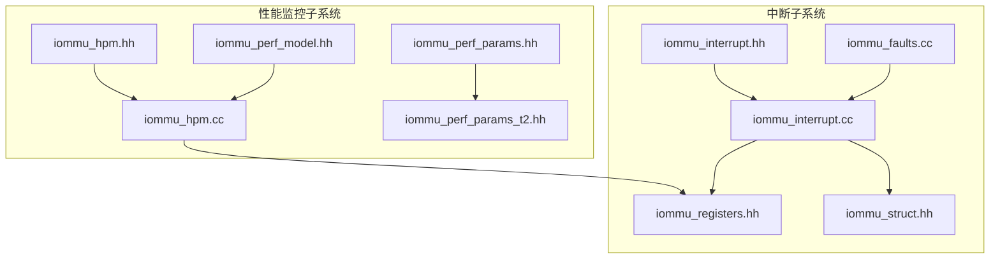
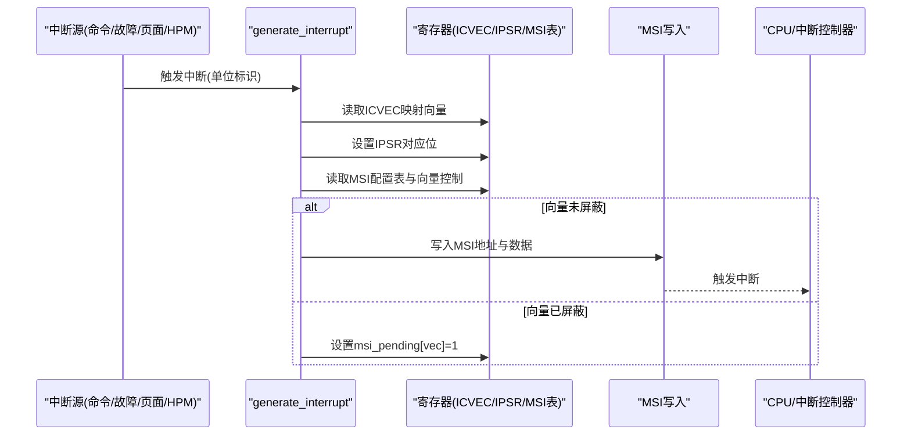
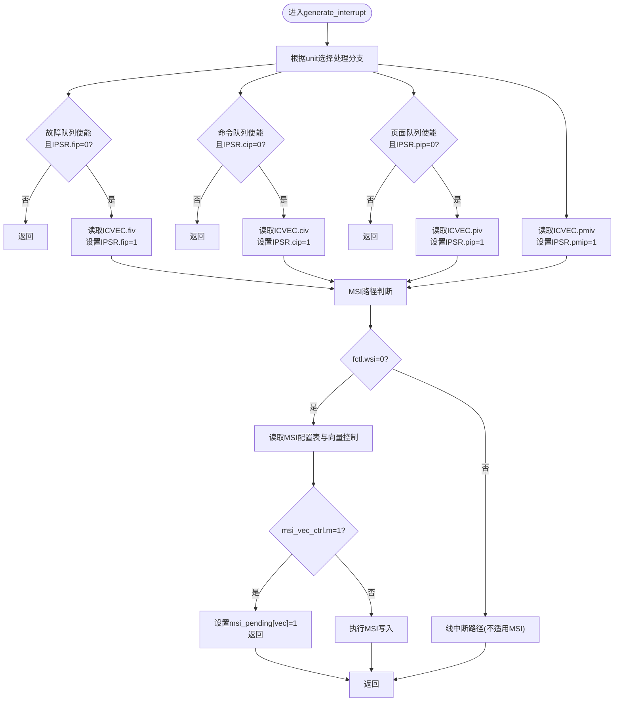
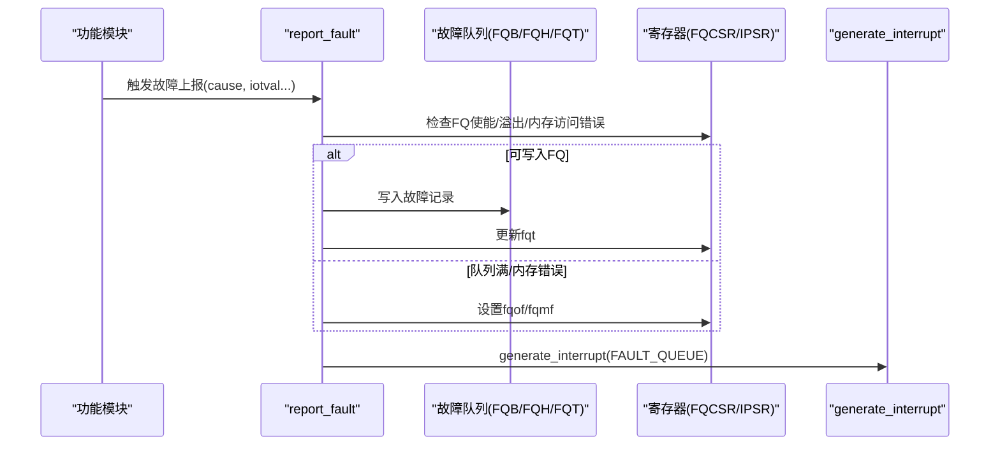
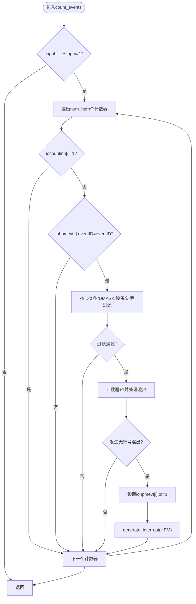
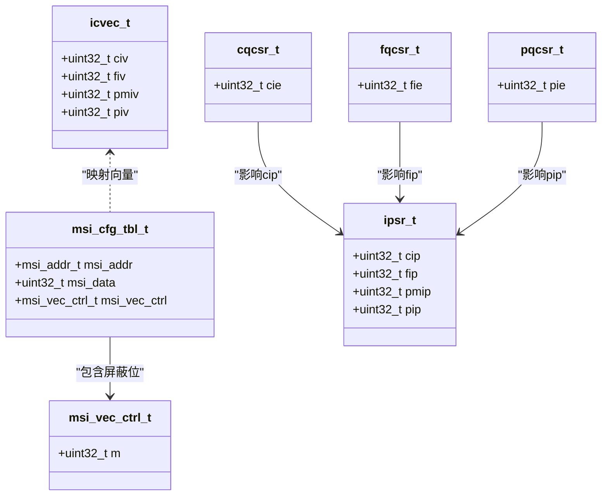
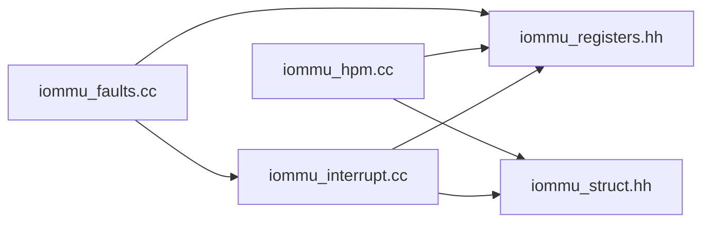

# 中断和性能监控接口

<cite>
**本文档引用的文件**
- [iommu_interrupt.hh](file://iommu/include/iommu_interrupt.hh)
- [iommu_hpm.hh](file://iommu/include/iommu_hpm.hh)
- [iommu_interrupt.cc](file://iommu/iommu_fun_model/iommu_interrupt.cc)
- [iommu_hpm.cc](file://iommu/iommu_perf_model/iommu_hpm.cc)
- [iommu_faults.cc](file://iommu/iommu_fun_model/iommu_faults.cc)
- [iommu_perf_model.hh](file://iommu/include/iommu_perf_model.hh)
- [iommu_registers.hh](file://iommu/include/iommu_registers.hh)
- [iommu_struct.hh](file://iommu/include/iommu_struct.hh)
- [iommu_perf_params.hh](file://iommu/iommu_perf_model/iommu_perf_params.hh)
- [iommu_perf_params_t2.hh](file://iommu/iommu_perf_model/iommu_perf_params_t2.hh)
</cite>

## 目录
1. [简介](#简介)
2. [项目结构](#项目结构)
3. [核心组件](#核心组件)
4. [架构概览](#架构概览)
5. [详细组件分析](#详细组件分析)
6. [依赖关系分析](#依赖关系分析)
7. [性能考虑](#性能考虑)
8. [故障排查指南](#故障排查指南)
9. [结论](#结论)
10. [附录](#附录)

## 简介
本文件面向IOMMU中断与性能监控接口的完整API文档，聚焦以下目标：
- 中断生成、处理与屏蔽接口
- HPM（硬件性能监视器）计数器的配置与读取
- 中断向量分配与优先级管理机制
- 性能事件的配置与统计接口
- 中断处理程序的注册与回调机制
- 性能分析与监控的最佳实践与示例

通过并行分析中断与性能监控相关源码，结合寄存器定义与数据结构，形成从接口到实现的完整说明。

## 项目结构
围绕中断与性能监控的关键目录与文件如下：
- 接口头文件：iommu/include/iommu_interrupt.hh、iommu/include/iommu_hpm.hh
- 功能实现：iommu/iommu_fun_model/iommu_interrupt.cc、iommu/iommu_perf_model/iommu_hpm.cc、iommu/iommu_fun_model/iommu_faults.cc
- 寄存器与数据结构：iommu/include/iommu_registers.hh、iommu/include/iommu_struct.hh
- 性能建模辅助：iommu/include/iommu_perf_model.hh、iommu/iommu_perf_model/iommu_perf_params.hh、iommu/iommu_perf_model/iommu_perf_params_t2.hh

**图表来源**
- [iommu_interrupt.hh:1-26](file://iommu/include/iommu_interrupt.hh#L1-L26)
- [iommu_hpm.hh:1-45](file://iommu/include/iommu_hpm.hh#L1-L45)
- [iommu_interrupt.cc:1-121](file://iommu/iommu_fun_model/iommu_interrupt.cc#L1-L121)
- [iommu_hpm.cc:1-110](file://iommu/iommu_perf_model/iommu_hpm.cc#L1-L110)
- [iommu_faults.cc:1-160](file://iommu/iommu_fun_model/iommu_faults.cc#L1-L160)
- [iommu_registers.hh:1-800](file://iommu/include/iommu_registers.hh#L1-L800)
- [iommu_struct.hh:1-102](file://iommu/include/iommu_struct.hh#L1-L102)
- [iommu_perf_model.hh:1-197](file://iommu/include/iommu_perf_model.hh#L1-L197)
- [iommu_perf_params.hh:1-161](file://iommu/iommu_perf_model/iommu_perf_params.hh#L1-L161)
- [iommu_perf_params_t2.hh:1-154](file://iommu/iommu_perf_model/iommu_perf_params_t2.hh#L1-L154)

**章节来源**
- [iommu_interrupt.hh:1-26](file://iommu/include/iommu_interrupt.hh#L1-L26)
- [iommu_hpm.hh:1-45](file://iommu/include/iommu_hpm.hh#L1-L45)
- [iommu_interrupt.cc:1-121](file://iommu/iommu_fun_model/iommu_interrupt.cc#L1-L121)
- [iommu_hpm.cc:1-110](file://iommu/iommu_perf_model/iommu_hpm.cc#L1-L110)
- [iommu_faults.cc:1-160](file://iommu/iommu_fun_model/iommu_faults.cc#L1-L160)
- [iommu_registers.hh:1-800](file://iommu/include/iommu_registers.hh#L1-L800)
- [iommu_struct.hh:1-102](file://iommu/include/iommu_struct.hh#L1-L102)
- [iommu_perf_model.hh:1-197](file://iommu/include/iommu_perf_model.hh#L1-L197)
- [iommu_perf_params.hh:1-161](file://iommu/iommu_perf_model/iommu_perf_params.hh#L1-L161)
- [iommu_perf_params_t2.hh:1-154](file://iommu/iommu_perf_model/iommu_perf_params_t2.hh#L1-L154)

## 核心组件
- 中断接口
  - 生成中断：generate_interrupt(iommu_t*, uint8_t)
  - 释放挂起中断：release_pending_interrupt(iommu_t*, uint8_t)
  - 中断类型枚举：COMMAND_QUEUE、FAULT_QUEUE、HPM、PAGE_QUEUE
  - MSI向量控制掩码：MSI_VEC_CTRL_MASK_BIT
- 性能监控接口
  - 事件计数：count_events(iommu_t*, PV, PID, PSCV, PSCID, DID, GSCV, GSCID, eventID)
  - 标准事件ID：NO_EVENT、UNTRANSLATED_REQUEST、TRANSLATED_REQUEST、TRANSLATION_REQUEST、IOATC_TLB_MISS、DDT_WALKS、PDT_WALKS、S_VS_PT_WALKS、G_PT_WALKS
- 寄存器与数据结构
  - 中断挂起状态寄存器IPSR、中断原因到向量映射ICVEC、MSI配置表MSI_CFG_TBL
  - HPM计数器IOHPMCYCLES、IOHPMCTR1..31、事件选择器IOHPMEVT1..31
  - 结构体iommu_t包含reg_file、num_hpm、hpmctr_bits等字段

**章节来源**
- [iommu_interrupt.hh:16-25](file://iommu/include/iommu_interrupt.hh#L16-L25)
- [iommu_hpm.hh:20-43](file://iommu/include/iommu_hpm.hh#L20-L43)
- [iommu_interrupt.cc:27-120](file://iommu/iommu_fun_model/iommu_interrupt.cc#L27-L120)
- [iommu_hpm.cc:6-109](file://iommu/iommu_perf_model/iommu_hpm.cc#L6-L109)
- [iommu_registers.hh:580-750](file://iommu/include/iommu_registers.hh#L580-L750)
- [iommu_struct.hh:62-99](file://iommu/include/iommu_struct.hh#L62-L99)

## 架构概览
中断与性能监控在IOMMU中通过统一的寄存器接口协同工作：
- 中断路径：各子系统触发条件满足后调用generate_interrupt，根据ICVEC映射向量，检查MSI向量掩码，必要时写入MSI地址并上报IPSR；软件处理后可调用release_pending_interrupt以补发被屏蔽的中断。
- 性能监控路径：事务完成后调用count_events，依据IOHPMEVT配置的事件ID与过滤条件匹配，更新IOHPMCTR计数器，溢出时设置OF并生成HPM中断。

**图表来源**
- [iommu_interrupt.cc:27-106](file://iommu/iommu_fun_model/iommu_interrupt.cc#L27-L106)
- [iommu_registers.hh:630-750](file://iommu/include/iommu_registers.hh#L630-L750)

**章节来源**
- [iommu_interrupt.cc:27-120](file://iommu/iommu_fun_model/iommu_interrupt.cc#L27-L120)
- [iommu_registers.hh:580-750](file://iommu/include/iommu_registers.hh#L580-L750)

## 详细组件分析

### 中断生成与处理接口
- generate_interrupt
  - 输入：iommu上下文指针、中断单元标识
  - 行为：根据单元类型检查对应CSR使能位与IPSR挂起位；从ICVEC读取向量；设置IPSR对应位；若为MSI模式且向量未屏蔽，则写入MSI地址与数据；若向量被屏蔽则置msi_pending并在解除屏蔽后由release_pending_interrupt补发。
- release_pending_interrupt
  - 输入：iommu上下文指针、向量号
  - 行为：若该向量存在挂起MSI则重新执行MSI写入并清除挂起标志。
- 中断类型与掩码
  - 单元类型：COMMAND_QUEUE、FAULT_QUEUE、HPM、PAGE_QUEUE
  - MSI向量控制掩码：MSI_VEC_CTRL_MASK_BIT用于屏蔽特定向量

**图表来源**
- [iommu_interrupt.cc:27-120](file://iommu/iommu_fun_model/iommu_interrupt.cc#L27-L120)
- [iommu_registers.hh:255-271](file://iommu/include/iommu_registers.hh#L255-L271)
- [iommu_struct.hh:97-99](file://iommu/include/iommu_struct.hh#L97-L99)

**章节来源**
- [iommu_interrupt.hh:16-25](file://iommu/include/iommu_interrupt.hh#L16-L25)
- [iommu_interrupt.cc:27-120](file://iommu/iommu_fun_model/iommu_interrupt.cc#L27-L120)
- [iommu_struct.hh:97-99](file://iommu/include/iommu_struct.hh#L97-L99)

### 故障上报与中断生成
- report_fault
  - 在满足队列使能、无内存访问错误、未溢出等前提下，构造故障记录并写入FQ；若写入成功则推进fqt，否则设置fqof或fqmf；最后调用generate_interrupt(FAULT_QUEUE)生成故障中断。
- 与HPM的关系
  - HPM计数器溢出时同样会通过generate_interrupt(HPM)上报中断。

**图表来源**
- [iommu_faults.cc:8-159](file://iommu/iommu_fun_model/iommu_faults.cc#L8-L159)
- [iommu_interrupt.cc:27-55](file://iommu/iommu_fun_model/iommu_interrupt.cc#L27-L55)

**章节来源**
- [iommu_faults.cc:8-159](file://iommu/iommu_fun_model/iommu_faults.cc#L8-L159)

### HPM计数器配置与读取
- count_events
  - 若IOMMU支持HPM（capabilities.hpm），遍历所有计数器，跳过被iocountinh抑制的计数器；比较事件ID与过滤条件（设备ID、进程ID、GSCID/PSCID、ID类型、部分匹配DMASK）；匹配成功则递增计数器，若发生无符号溢出则设置OF并生成HPM中断。
- 关键寄存器
  - iohpmcycles：64位周期计数器
  - iohpmctr1..31：64位事件计数器
  - iohpmevt1..31：事件选择器，包含eventID、dmask、PID/DID、ID类型、精确/部分匹配掩码、溢出标志OF等

**图表来源**
- [iommu_hpm.cc:6-109](file://iommu/iommu_perf_model/iommu_hpm.cc#L6-L109)
- [iommu_registers.hh:606-640](file://iommu/include/iommu_registers.hh#L606-L640)

**章节来源**
- [iommu_hpm.hh:20-43](file://iommu/include/iommu_hpm.hh#L20-L43)
- [iommu_hpm.cc:6-109](file://iommu/iommu_perf_model/iommu_hpm.cc#L6-L109)
- [iommu_registers.hh:606-640](file://iommu/include/iommu_registers.hh#L606-L640)

### 中断向量分配与优先级管理
- 向量分配
  - ICVEC寄存器提供civ/fiv/pmiv/piv四个向量字段，分别映射命令/故障/HPM/页面队列中断。
- 优先级与屏蔽
  - 各队列CSR中的cie/fie/pie等使能位决定是否允许中断；MSI向量控制的掩码位m用于屏蔽特定向量；IPSR的cip/fip/pmip/pip位表示挂起状态，需软件清零以允许重复中断。
- MSI路径
  - 当fctl.wsi=0时使用MSI；MSI地址与数据来自MSI配置表，写入失败将触发“MSI写入访问错误”故障。

**图表来源**
- [iommu_registers.hh:630-640](file://iommu/include/iommu_registers.hh#L630-L640)
- [iommu_registers.hh:730-750](file://iommu/include/iommu_registers.hh#L730-L750)
- [iommu_registers.hh:580-591](file://iommu/include/iommu_registers.hh#L580-L591)
- [iommu_registers.hh:548-579](file://iommu/include/iommu_registers.hh#L548-L579)

**章节来源**
- [iommu_registers.hh:630-640](file://iommu/include/iommu_registers.hh#L630-L640)
- [iommu_registers.hh:730-750](file://iommu/include/iommu_registers.hh#L730-L750)
- [iommu_registers.hh:580-591](file://iommu/include/iommu_registers.hh#L580-L591)
- [iommu_registers.hh:548-579](file://iommu/include/iommu_registers.hh#L548-L579)

### 性能事件配置与统计
- 事件ID与过滤
  - 支持NO_EVENT、UNTRANSLATED_REQUEST、TRANSLATED_REQUEST、TRANSLATION_REQUEST、IOATC_TLB_MISS、DDT_WALKS、PDT_WALKS、S_VS_PT_WALKS、G_PT_WALKS等标准事件。
  - 过滤包括：ID类型（设备ID或GSCID）、进程ID（PID或PSCID）、部分匹配DMASK、精确匹配。
- 计数与溢出
  - 计数器宽度由hpmctr_bits决定，溢出时设置OF并生成HPM中断；OF作为溢出中断屏蔽位，避免重复中断。
- 事务分类与属性提取
  - 提供TTYP分类与访问属性提取工具函数，便于在性能统计中区分不同类型的事务。

**章节来源**
- [iommu_hpm.hh:20-43](file://iommu/include/iommu_hpm.hh#L20-L43)
- [iommu_hpm.cc:6-109](file://iommu/iommu_perf_model/iommu_hpm.cc#L6-L109)
- [iommu_perf_model.hh:9-41](file://iommu/include/iommu_perf_model.hh#L9-L41)

### 中断处理程序注册与回调机制
- 注册方式
  - 通过MSI配置表与ICVEC映射实现向量到处理程序的绑定；软件在初始化阶段配置MSI地址/数据与向量控制，并设置ICVEC将特定中断源映射到相应向量。
- 回调机制
  - CPU侧收到MSI后，驱动程序根据向量号分派到对应的中断处理函数；处理完成后需清除对应IPSR挂起位以允许后续中断。
- 屏蔽与恢复
  - 通过msi_vec_ctrl.m屏蔽向量；当msi_pending[vec]置位时，解除屏蔽后调用release_pending_interrupt补发MSI。

**章节来源**
- [iommu_interrupt.cc:90-120](file://iommu/iommu_fun_model/iommu_interrupt.cc#L90-L120)
- [iommu_struct.hh:97-99](file://iommu/include/iommu_struct.hh#L97-L99)

## 依赖关系分析
- 组件耦合
  - generate_interrupt依赖寄存器文件（ICVEC、MSI配置表、fctl）与结构体iommu_t中的msi_pending数组。
  - count_events依赖寄存器文件（IOHPMEVT、IOHPMCTR、IOCNTINH、IOCNTOVF）与iommu_t中的num_hpm、hpmctr_bits。
  - report_fault在写入FQ失败时同样会调用generate_interrupt(FAULT_QUEUE)。
- 外部依赖
  - 内存写入接口write_memory用于MSI写入与FQ写入，受fctl.be与capabilities.pas约束。

**图表来源**
- [iommu_interrupt.cc:1-121](file://iommu/iommu_fun_model/iommu_interrupt.cc#L1-L121)
- [iommu_hpm.cc:1-110](file://iommu/iommu_perf_model/iommu_hpm.cc#L1-L110)
- [iommu_faults.cc:1-160](file://iommu/iommu_fun_model/iommu_faults.cc#L1-L160)
- [iommu_registers.hh:1-800](file://iommu/include/iommu_registers.hh#L1-L800)
- [iommu_struct.hh:1-102](file://iommu/include/iommu_struct.hh#L1-L102)

**章节来源**
- [iommu_interrupt.cc:1-121](file://iommu/iommu_fun_model/iommu_interrupt.cc#L1-L121)
- [iommu_hpm.cc:1-110](file://iommu/iommu_perf_model/iommu_hpm.cc#L1-L110)
- [iommu_faults.cc:1-160](file://iommu/iommu_fun_model/iommu_faults.cc#L1-L160)
- [iommu_registers.hh:1-800](file://iommu/include/iommu_registers.hh#L1-L800)
- [iommu_struct.hh:1-102](file://iommu/include/iommu_struct.hh#L1-L102)

## 性能考虑
- 计数器宽度与溢出
  - hpmctr_bits决定计数器位宽，溢出时设置OF并生成中断；建议合理配置计数器位宽以平衡精度与溢出频率。
- 过滤开销
  - DMASK与ID类型过滤增加匹配逻辑复杂度，应根据实际需求选择精确匹配或部分匹配。
- 中断负载
  - MSI写入失败将触发故障并可能产生额外中断；应确保MSI地址对齐与权限正确，减少写入失败。
- 参数化配置
  - 性能参数文件提供了FIFO深度、缓存大小、并发限制等关键参数，建议结合系统带宽与延迟进行调优。

**章节来源**
- [iommu_hpm.cc:18-109](file://iommu/iommu_perf_model/iommu_hpm.cc#L18-L109)
- [iommu_perf_params.hh:1-161](file://iommu/iommu_perf_model/iommu_perf_params.hh#L1-L161)
- [iommu_perf_params_t2.hh:1-154](file://iommu/iommu_perf_model/iommu_perf_params_t2.hh#L1-L154)

## 故障排查指南
- MSI写入失败
  - 现象：generate_interrupt中检测到MSI写入访问故障，上报“MSI写入访问故障”故障。
  - 排查：检查MSI地址对齐、权限、物理地址范围(capabilities.pas)；确认fctl.be与目标端点字节序一致。
- 故障队列溢出
  - 现象：report_fault设置fqof并生成故障中断。
  - 排查：检查FQB基址与队列大小配置，提升软件消费速度或增大队列容量。
- HPM中断风暴
  - 现象：频繁溢出导致大量HPM中断。
  - 排查：降低计数频率、扩大计数器位宽、启用iocountinh抑制非关键计数器。
- 向量屏蔽导致中断丢失
  - 现象：msi_pending[vec]=1且m=1时中断未触发。
  - 排查：解除屏蔽后调用release_pending_interrupt补发MSI。

**章节来源**
- [iommu_interrupt.cc:8-26](file://iommu/iommu_fun_model/iommu_interrupt.cc#L8-L26)
- [iommu_faults.cc:130-159](file://iommu/iommu_fun_model/iommu_faults.cc#L130-L159)
- [iommu_hpm.cc:84-106](file://iommu/iommu_perf_model/iommu_hpm.cc#L84-L106)

## 结论
本文档梳理了IOMMU中断与性能监控接口的完整实现路径：通过generate_interrupt与release_pending_interrupt实现中断的生成、屏蔽与恢复；通过count_events实现HPM事件的过滤与计数；借助ICVEC、MSI配置表与寄存器状态实现向量分配与优先级管理。配合性能参数文件与寄存器规范，可在保证正确性的前提下优化系统性能与稳定性。

## 附录
- API清单
  - generate_interrupt(iommu_t*, uint8_t)
  - release_pending_interrupt(iommu_t*, uint8_t)
  - count_events(iommu_t*, PV, PID, PSCV, PSCID, DID, GSCV, GSCID, eventID)
- 关键寄存器
  - ICVEC、MSI_ADDR_n、MSI_DATA_n、MSI_VEC_CTRL_n、IPSR、IOCNTINH、IOCNTOVF、IOHPMCYCLES、IOHPMCTR1..31、IOHPMEVT1..31
- 数据结构
  - iommu_t、icvec_t、msi_cfg_tbl_t、msi_vec_ctrl_t、ipsr_t、iohpmcycles_t、iohpmctr_t、iohpmevt_t

**章节来源**
- [iommu_interrupt.hh:23-25](file://iommu/include/iommu_interrupt.hh#L23-L25)
- [iommu_hpm.hh:42-43](file://iommu/include/iommu_hpm.hh#L42-L43)
- [iommu_registers.hh:630-750](file://iommu/include/iommu_registers.hh#L630-L750)
- [iommu_struct.hh:62-99](file://iommu/include/iommu_struct.hh#L62-L99)