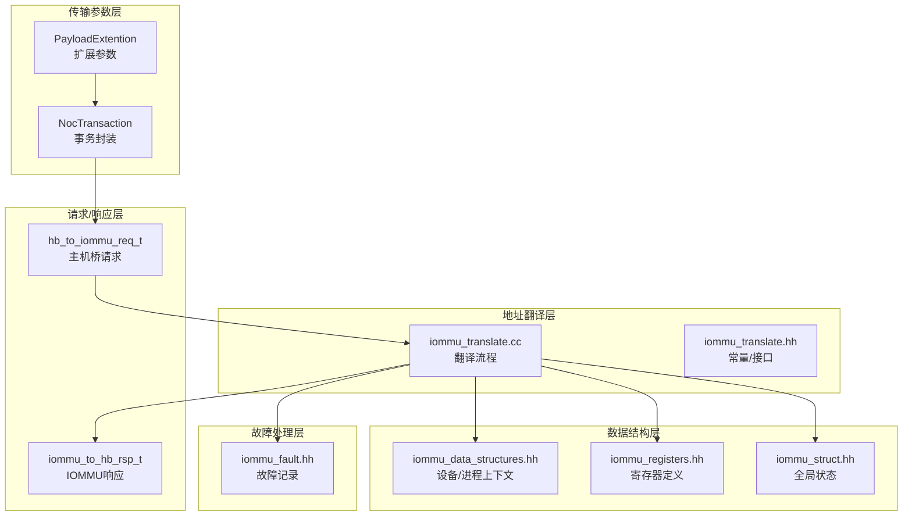
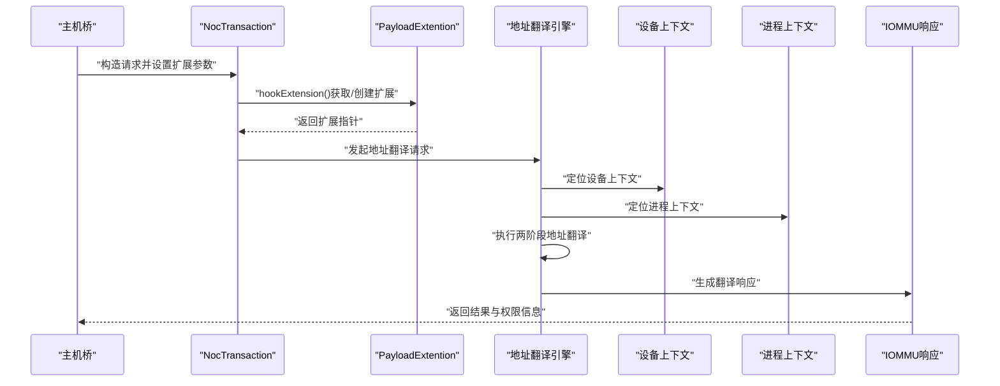
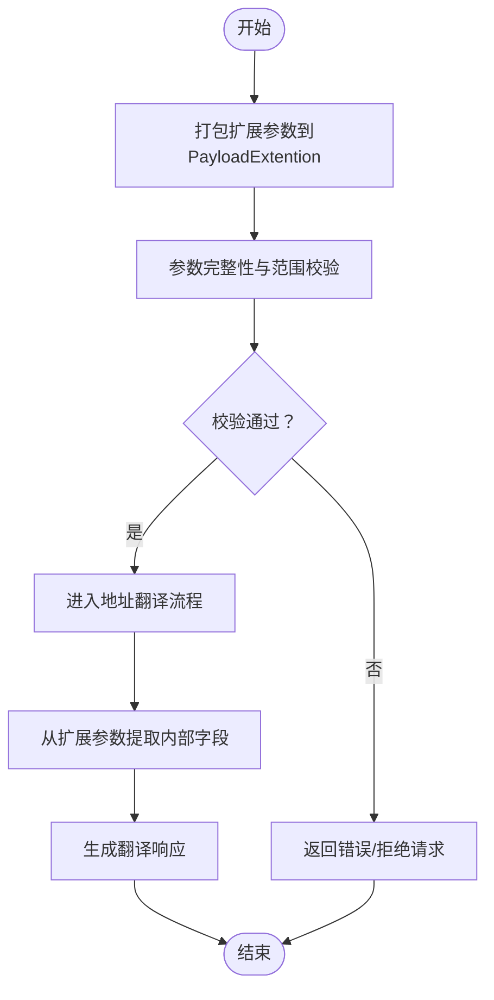
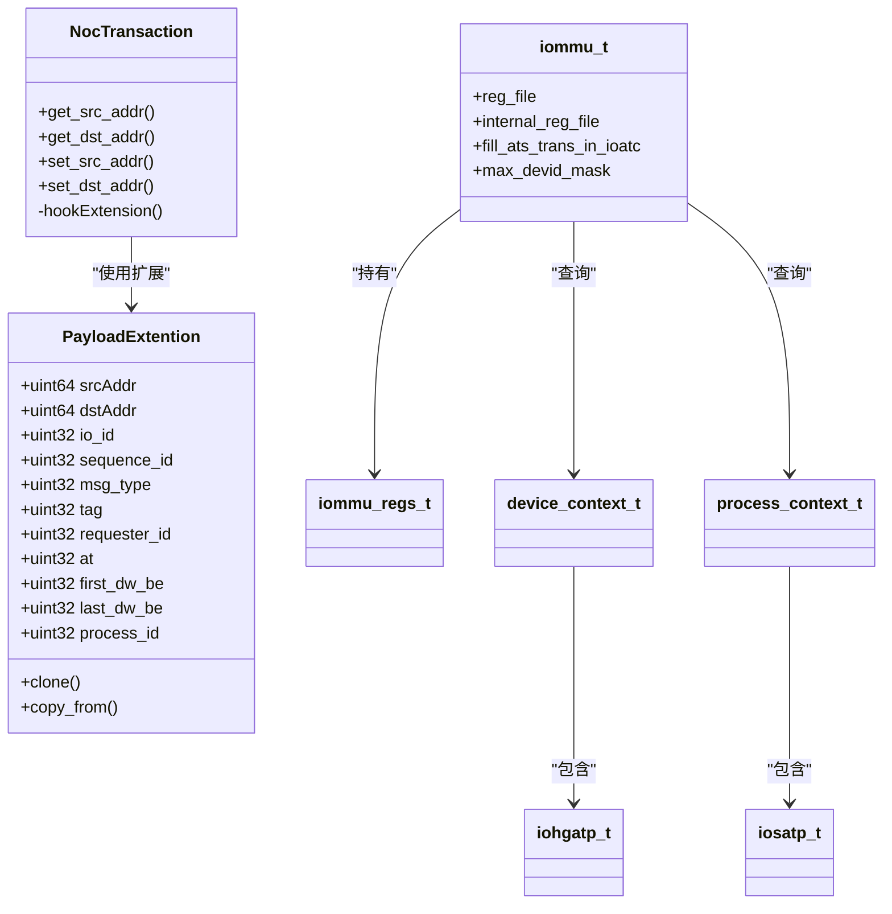

# 传输参数API

<cite>
**本文档引用的文件**
- [param_trans_def.hh](file://iommu/param_trans_def.hh)
- [iommu_translate.hh](file://iommu/iommu_translate.hh)
- [iommu_translate.cc](file://iommu/iommu_translate.cc)
- [iommu_req_rsp.hh](file://iommu/iommu_req_rsp.hh)
- [iommu_struct.hh](file://iommu/iommu_struct.hh)
- [iommu_registers.hh](file://iommu/iommu_registers.hh)
- [iommu_data_structures.hh](file://iommu/iommu_data_structures.hh)
- [iommu_fault.hh](file://iommu/iommu_fault.hh)
</cite>

## 目录
1. [简介](#简介)
2. [项目结构](#项目结构)
3. [核心组件](#核心组件)
4. [架构概览](#架构概览)
5. [详细组件分析](#详细组件分析)
6. [依赖关系分析](#依赖关系分析)
7. [性能考量](#性能考量)
8. [故障排查指南](#故障排查指南)
9. [结论](#结论)

## 简介
本文件面向IOMMU传输参数API，系统化阐述param_trans_def.hh中定义的传输参数类型、枚举值与常量，涵盖地址转换参数、缓存参数与性能参数。文档同时解释扩展信息（PayloadExtention）的格式与编码规则，包括参数打包、解包与验证方法；提供参数配置最佳实践、性能调优建议与兼容性考虑；并通过实际使用场景与常见错误处理方法帮助开发者正确应用这些参数。

## 项目结构
IOMMU传输参数API主要由以下模块组成：
- 参数定义与扩展：param_trans_def.hh
- 地址翻译接口与常量：iommu_translate.hh、iommu_translate.cc
- 请求/响应数据结构：iommu_req_rsp.hh
- IOMMU全局结构与寄存器：iommu_struct.hh、iommu_registers.hh
- 数据结构与上下文：iommu_data_structures.hh
- 故障报告机制：iommu_fault.hh

图表来源
- [param_trans_def.hh:12-128](file://iommu/param_trans_def.hh#L12-L128)
- [iommu_req_rsp.hh:29-102](file://iommu/iommu_req_rsp.hh#L29-L102)
- [iommu_translate.cc:8-731](file://iommu/iommu_translate.cc#L8-L731)
- [iommu_translate.hh:17-131](file://iommu/iommu_translate.hh#L17-L131)
- [iommu_data_structures.hh:29-414](file://iommu/iommu_data_structures.hh#L29-L414)
- [iommu_registers.hh:172-800](file://iommu/iommu_registers.hh#L172-L800)
- [iommu_struct.hh:42-99](file://iommu/iommu_struct.hh#L42-L99)
- [iommu_fault.hh:26-88](file://iommu/iommu_fault.hh#L26-L88)

章节来源
- [param_trans_def.hh:1-130](file://iommu/param_trans_def.hh#L1-L130)
- [iommu_req_rsp.hh:1-105](file://iommu/iommu_req_rsp.hh#L1-L105)
- [iommu_translate.cc:1-732](file://iommu/iommu_translate.cc#L1-L732)
- [iommu_translate.hh:1-132](file://iommu/iommu_translate.hh#L1-L132)
- [iommu_data_structures.hh:1-415](file://iommu/iommu_data_structures.hh#L1-L415)
- [iommu_registers.hh:1-987](file://iommu/iommu_registers.hh#L1-L987)
- [iommu_struct.hh:1-102](file://iommu/iommu_struct.hh#L1-L102)
- [iommu_fault.hh:1-90](file://iommu/iommu_fault.hh#L1-L90)

## 核心组件
本节聚焦param_trans_def.hh中的关键类型与参数，解释其用途、取值范围与编码方式。

- 扩展参数结构体PayloadExtention
  - 作用：在TLM扩展机制下为事务携带额外的传输参数，如源/目的地址、请求者ID、序列号等。
  - 关键字段：
    - 源/目的地址：srcAddr/dstAddr（uint64）
    - 请求者ID与序列号：io_id、sequence_id（uint32）
    - 通用信息：msg_type（8位）、tag（10位）、保留位_rsvd0（14位）
    - 请求者ID：requester_id（16位）、保留位_rsvd1（16位）
    - 访问属性：tc（3位）、ido（1位）、ep（1位）、ro（1位）、ns（1位）、at（2位）、pf_num（3位）、first_dw_be/last_dw_be（各4位）、np（1位）、cplsts（3位）、保留位_rsvd2（8位）
    - 消息类型信息：msg_code（8位）、vdm_def（16位）、保留位_rsvd3（8位）
    - 总线/功能/设备信息：bus_num（8位）、func_num（3位）、device_num（5位）、vendor_id（16位）
    - PASID前缀：pid_valid（1位）、no_write（1位）、exec_req（1位）、priv_req（1位）、process_id（28位）
    - 段信息：segment_num（16位）、ds_valid（8位）、dsegmemt（8位）

- 事务封装类NocTransaction
  - 作用：基于tlm_generic_payload扩展，提供便捷的源/目的地址访问与扩展参数挂载。
  - 关键行为：
    - get_src_addr/get_dst_addr：通过扩展参数读取地址
    - set_src_addr/set_dst_addr：设置扩展参数中的地址
    - hookExtension：惰性创建并挂载PayloadExtention扩展

- 常量定义
  - BUS_WIDTH：总线宽度（64位），用于确定数据宽度与带宽相关计算的基础单位

章节来源
- [param_trans_def.hh:12-97](file://iommu/param_trans_def.hh#L12-L97)
- [param_trans_def.hh:104-128](file://iommu/param_trans_def.hh#L104-L128)
- [param_trans_def.hh:10-10](file://iommu/param_trans_def.hh#L10-L10)

## 架构概览
传输参数API在IOMMU地址翻译流程中的位置如下：

图表来源
- [param_trans_def.hh:104-128](file://iommu/param_trans_def.hh#L104-L128)
- [iommu_translate.cc:8-731](file://iommu/iommu_translate.cc#L8-L731)
- [iommu_data_structures.hh:324-335](file://iommu/iommu_data_structures.hh#L324-L335)

## 详细组件分析

### 参数打包与解包
- 打包
  - 在NocTransaction中通过hookExtension确保PayloadExtention存在，并将请求参数写入扩展字段
  - 参数按位域组织，需注意字节序与对齐要求
- 解包
  - 通过NocTransaction的get_src_addr/get_dst_addr读取扩展参数
  - 在地址翻译过程中，参数被解析为内部结构（如requester_id、process_id、访问属性等）
- 验证
  - 参数完整性检查：确保必需字段（如io_id、sequence_id、requester_id）有效
  - 取值范围检查：如tag（10位）、at（2位）、first_dw_be/last_dw_be（4位）等
  - 兼容性检查：根据设备/进程上下文的模式（Bare/1LVL/2LVL等）调整参数有效性

图表来源
- [param_trans_def.hh:12-97](file://iommu/param_trans_def.hh#L12-L97)
- [iommu_translate.cc:38-90](file://iommu/iommu_translate.cc#L38-L90)

章节来源
- [param_trans_def.hh:12-97](file://iommu/param_trans_def.hh#L12-L97)
- [iommu_translate.cc:38-90](file://iommu/iommu_translate.cc#L38-L90)

### 地址转换参数详解
- 通用信息（msg_type、tag、requester_id等）
  - 用途：标识事务类型、关联请求者、携带标签与保留字段
  - 取值范围：msg_type（8位）、tag（10位）、requester_id（16位）
- 访问属性（tc、ido、ep、ro、ns、at、first_dw_be/last_dw_be等）
  - 用途：描述内存访问类型（读/写/AMO/执行）、事务控制（IDO、EP、RO、NS）与数据边界（首/尾字节使能）
  - 取值范围：tc（3位）、at（2位）、first_dw_be/last_dw_be（4位）
- 消息类型信息（msg_code、vdm_def）
  - 用途：区分PCIe ATS消息类型与VDM定义
  - 取值范围：msg_code（8位）、vdm_def（16位）
- 总线/功能/设备信息（bus_num、func_num、device_num、vendor_id）
  - 用途：PCIe拓扑识别与厂商信息
  - 取值范围：bus_num（8位）、func_num（3位）、device_num（5位）、vendor_id（16位）
- PASID前缀（pid_valid、no_write、exec_req、priv_req、process_id）
  - 用途：进程隔离与权限控制，支持特权模式请求
  - 取值范围：process_id（28位）

章节来源
- [param_trans_def.hh:56-96](file://iommu/param_trans_def.hh#L56-L96)

### 缓存参数与性能参数
- 缓存参数
  - ATS缓存策略：根据fill_ats_trans_in_ioatc配置决定是否缓存T2GPA模式下的最终GPA->SPA映射或Untranslated请求的IOVA->SPA映射
  - IOATC命中/缺失：通过lookup_ioatc_iotlb判断缓存状态，miss时触发页表遍历
- 性能参数
  - 页面大小选择：根据VS/G阶段页表选择较小的页面尺寸，影响缓存命中率与带宽利用
  - PPN格式：采用NAPOT格式存储以支持大页缓存
  - 端到端性能：通过RCID/MCID配置IOMMU发起的内存访问QoS，提升吞吐

章节来源
- [iommu_translate.cc:352-404](file://iommu/iommu_translate.cc#L352-L404)
- [iommu_translate.cc:458-492](file://iommu/iommu_translate.cc#L458-L492)
- [iommu_struct.hh:68-87](file://iommu/iommu_struct.hh#L68-L87)

### 参数与硬件特性对应关系
- 设备目录表（DDT）模式
  - 支持Off/Bare/1LVL/2LVL/3LVL，不同模式对设备ID宽度与事务类型有约束
- 进程目录表（PDT）模式
  - 支持Bare/PD20/PD17/PD8，影响process_id位宽与目录层级
- 第一/第二阶段地址翻译
  - iosatp/iohgatp.MODE决定S/VS/G阶段页表格式，影响地址空间与权限控制
- MSI地址翻译
  - msiptp.MODE支持Off/Flat，决定是否识别MSI写入并路由至虚拟中断文件

章节来源
- [iommu_data_structures.hh:139-156](file://iommu/iommu_data_structures.hh#L139-L156)
- [iommu_data_structures.hh:187-200](file://iommu/iommu_data_structures.hh#L187-L200)
- [iommu_data_structures.hh:206-258](file://iommu/iommu_data_structures.hh#L206-L258)
- [iommu_data_structures.hh:270-278](file://iommu/iommu_data_structures.hh#L270-L278)

## 依赖关系分析
- 组件耦合
  - NocTransaction依赖PayloadExtention进行参数扩展
  - 地址翻译引擎依赖设备/进程上下文、寄存器配置与全局状态
- 外部依赖
  - SystemC与TLM库用于建模与通信
  - 寄存器定义与数据结构定义为翻译流程提供基础配置

图表来源
- [param_trans_def.hh:12-128](file://iommu/param_trans_def.hh#L12-L128)
- [iommu_struct.hh:42-99](file://iommu/iommu_struct.hh#L42-L99)
- [iommu_data_structures.hh:139-156](file://iommu/iommu_data_structures.hh#L139-L156)
- [iommu_data_structures.hh:187-200](file://iommu/iommu_data_structures.hh#L187-L200)
- [iommu_data_structures.hh:324-335](file://iommu/iommu_data_structures.hh#L324-L335)

章节来源
- [param_trans_def.hh:12-128](file://iommu/param_trans_def.hh#L12-L128)
- [iommu_struct.hh:42-99](file://iommu/iommu_struct.hh#L42-L99)
- [iommu_data_structures.hh:139-156](file://iommu/iommu_data_structures.hh#L139-L156)
- [iommu_data_structures.hh:187-200](file://iommu/iommu_data_structures.hh#L187-L200)
- [iommu_data_structures.hh:324-335](file://iommu/iommu_data_structures.hh#L324-L335)

## 性能考量
- 缓存策略
  - ATS缓存：根据fill_ats_trans_in_ioatc配置决定缓存时机，避免频繁页表遍历
  - IOATC命中：优先命中可显著降低延迟，miss时触发两阶段翻译
- 页面大小与带宽
  - 选择较小的页面尺寸可提高缓存命中率，但会增加页表项数量
  - PPN采用NAPOT格式支持大页缓存，减少TLB压力
- QoS与资源分配
  - 通过RCID/MCID配置IOMMU发起的内存访问QoS，平衡吞吐与延迟
- 端到端路径优化
  - 减少不必要的页表遍历与权限检查，合理设置PASID与进程上下文

[本节为通用指导，无需特定文件来源]

## 故障排查指南
- 常见错误码与处理
  - 事务类型不被允许：检查设备/进程上下文模式与事务类型匹配
  - 访问权限不足：核对R/W/X权限与特权模式请求
  - 页表数据损坏：检查PTE一致性与原子更新（SADE/GADE）
  - MSI相关错误：确认MSI地址掩码/模式配置与目标中断文件
- ATS翻译请求特殊处理
  - Off模式下ATS请求返回Unsupported Request
  - 配置错误导致Completer Abort，需检查设备上下文与页表配置
- 故障记录
  - 使用fault_rec_t记录CAUSE、PID、PV、PRIV、TTYP、DID、iotval/iotval2等字段
  - DTF控制是否上报翻译过程中的故障

章节来源
- [iommu_translate.cc:620-731](file://iommu/iommu_translate.cc#L620-L731)
- [iommu_fault.hh:26-88](file://iommu/iommu_fault.hh#L26-L88)

## 结论
传输参数API通过PayloadExtention与NocTransaction实现了对IOMMU地址翻译流程的参数化控制，涵盖地址转换、缓存与性能关键参数。结合设备/进程上下文与寄存器配置，开发者可以灵活地实现安全、高效且兼容的地址翻译。建议在实际部署中遵循参数范围与兼容性约束，合理配置缓存策略与QoS参数，以获得最佳性能与稳定性。