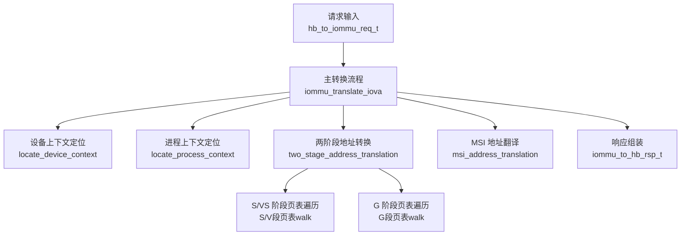
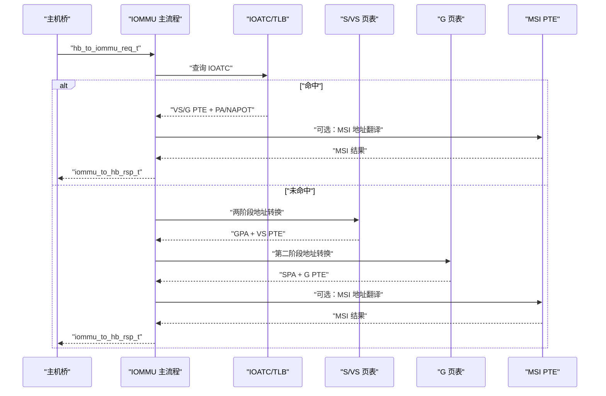
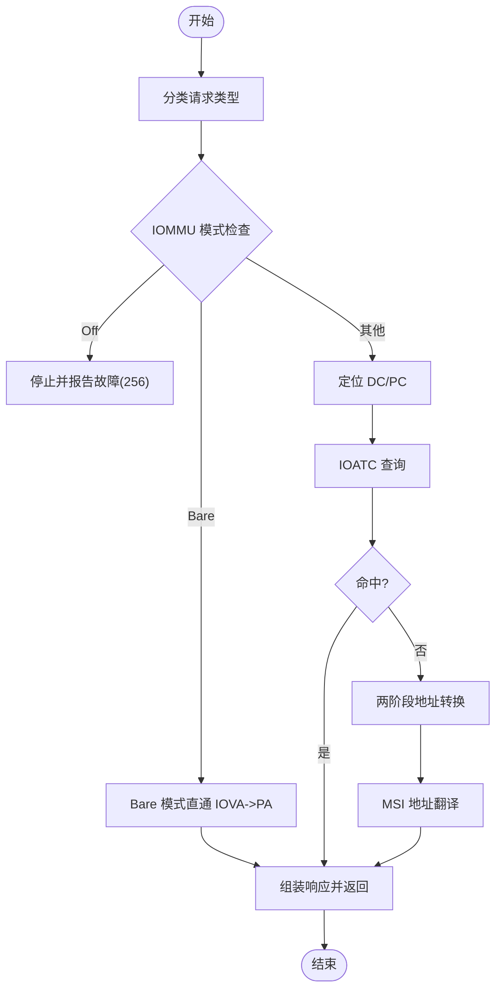
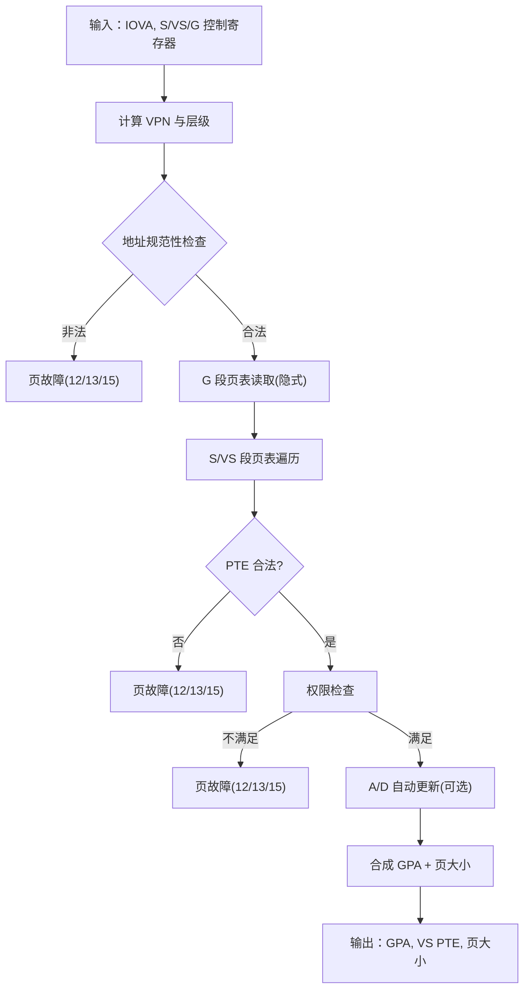
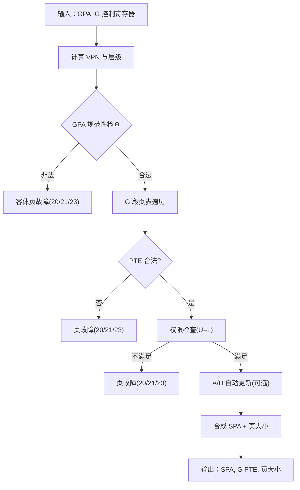
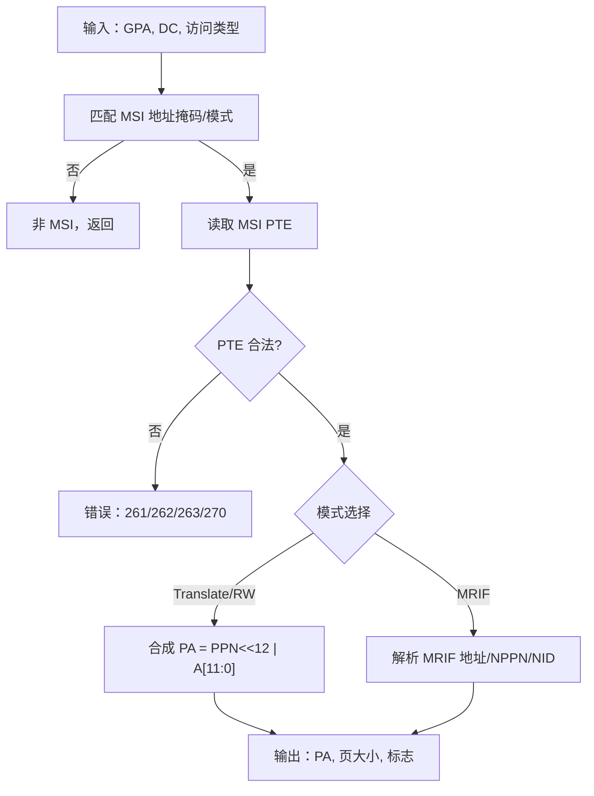
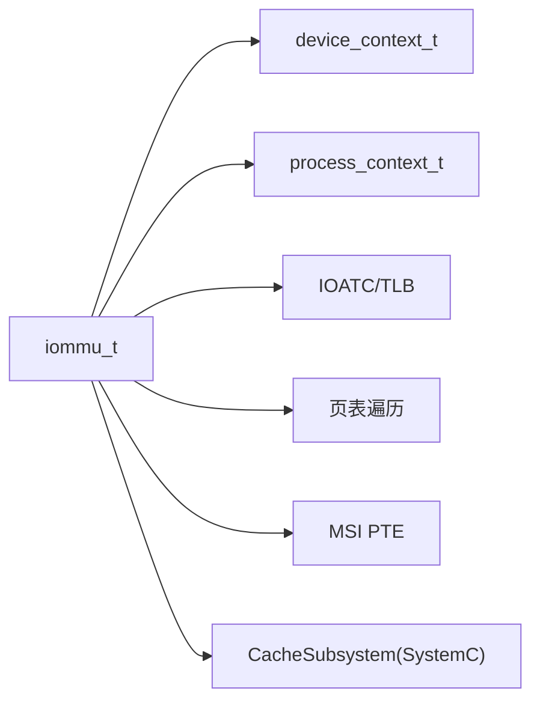

# 地址转换函数

<cite>
**本文档引用的文件**
- [iommu_translate.hh](file://iommu/include/iommu_translate.hh)
- [iommu_translate.cc](file://iommu/iommu_fun_model/iommu_translate.cc)
- [iommu_two_stage_trans.cc](file://iommu/iommu_fun_model/iommu_two_stage_trans.cc)
- [iommu_second_stage_trans.cc](file://iommu/iommu_fun_model/iommu_second_stage_trans.cc)
- [iommu_msi_trans.cc](file://iommu/iommu_fun_model/iommu_msi_trans.cc)
- [iommu_req_rsp.hh](file://iommu/include/iommu_req_rsp.hh)
- [iommu_data_structures.hh](file://iommu/include/iommu_data_structures.hh)
- [iommu_struct.hh](file://iommu/include/iommu_struct.hh)
- [cache_subsystem.h](file://iommu/cache_src/subsystem/cache_subsystem.h)
- [iommu_utils.hh](file://iommu/include/iommu_utils.hh)
</cite>

## 目录
1. [简介](#简介)
2. [项目结构](#项目结构)
3. [核心组件](#核心组件)
4. [架构总览](#架构总览)
5. [详细组件分析](#详细组件分析)
6. [依赖关系分析](#依赖关系分析)
7. [性能考虑](#性能考虑)
8. [故障排查指南](#故障排查指南)
9. [结论](#结论)
10. [附录](#附录)

## 简介
本文件为 IOMMU 地址转换函数的完整 API 文档，覆盖从请求进入 IOMMU 到生成最终物理地址与权限信息的全流程。内容包括：
- 地址转换算法的实现接口、输入参数与输出格式
- 不同地址转换模式（Bare、Sv32/Sv39/Sv48/Sv57 及其 x4 变体）的支持与切换机制
- 转换过程中的中间状态与缓存查询接口
- 调用约定、返回值含义与错误处理策略
- 性能优化建议与调试接口
- 典型转换场景的流程图与最佳实践

## 项目结构
IOMMU 地址转换相关代码主要分布在以下模块：
- 接口声明：iommu/include/iommu_translate.hh
- 主流程实现：iommu/iommu_fun_model/iommu_translate.cc
- 两阶段地址转换（S/VS → G）：iommu/iommu_fun_model/iommu_two_stage_trans.cc
- 第二阶段地址转换（G）：iommu/iommu_fun_model/iommu_second_stage_trans.cc
- MSI 地址翻译：iommu/iommu_fun_model/iommu_msi_trans.cc
- 请求/响应数据结构：iommu/include/iommu_req_rsp.hh
- 数据结构与寄存器上下文：iommu/include/iommu_data_structures.hh、iommu/include/iommu_struct.hh
- 缓存子系统（SystemC）：iommu/cache_src/subsystem/cache_subsystem.h
- 工具函数：iommu/include/iommu_utils.hh

图表来源
- [iommu_translate.cc:8-731](file://iommu/iommu_fun_model/iommu_translate.cc#L8-L731)
- [iommu_two_stage_trans.cc:8-599](file://iommu/iommu_fun_model/iommu_two_stage_trans.cc#L8-L599)
- [iommu_second_stage_trans.cc:8-423](file://iommu/iommu_fun_model/iommu_second_stage_trans.cc#L8-L423)
- [iommu_msi_trans.cc:19-293](file://iommu/iommu_fun_model/iommu_msi_trans.cc#L19-L293)

章节来源
- [iommu_translate.cc:8-731](file://iommu/iommu_fun_model/iommu_translate.cc#L8-L731)
- [iommu_req_rsp.hh:29-103](file://iommu/include/iommu_req_rsp.hh#L29-L103)

## 核心组件
- 主转换入口：iommu_translate_iova
  - 输入：主机桥请求 hb_to_iommu_req_t
  - 输出：IOMMU 响应 iommu_to_hb_rsp_t
  - 功能：根据 IOMMU 模式、设备/进程上下文、ATS/PCIe 配置等，执行完整地址转换链路，并填充权限与内存类型信息
- 两阶段地址转换：two_stage_address_translation
  - 输入：IOVA、设备/进程上下文、S/VS 与 G-stage 控制寄存器
  - 输出：GPA、页大小、VS 段 PTE、页故障原因
  - 功能：按 Sv32/Sv39/Sv48/Sv57 及 x4 变体进行页表遍历，支持 NAPOT、A/D 自动更新（SADE/GADE）
- 第二阶段地址转换：second_stage_address_translation
  - 输入：GPA、G-stage 控制寄存器
  - 输出：SPA、页大小、G 段 PTE、页故障原因
  - 功能：G-stage 页表遍历，校验权限与对齐，支持 NAPOT、A/D 自动更新（GADE）
- MSI 地址翻译：msi_address_translation
  - 输入：GPA、设备上下文、访问类型
  - 输出：是否 MSI、MSI 模式（Translate/RW 或 MRIF）、目标地址/MRIF 参数
  - 功能：识别虚拟中断文件写入，解析 MSI PTE 并生成相应翻译结果
- 请求/响应结构：iommu_req_rsp.hh
  - 定义请求类型、状态码、响应字段（PPN、S、R/W/X、PBMT、MSI 标志等）

章节来源
- [iommu_translate.hh:95-129](file://iommu/include/iommu_translate.hh#L95-L129)
- [iommu_translate.cc:8-731](file://iommu/iommu_fun_model/iommu_translate.cc#L8-L731)
- [iommu_two_stage_trans.cc:8-599](file://iommu/iommu_fun_model/iommu_two_stage_trans.cc#L8-L599)
- [iommu_second_stage_trans.cc:8-423](file://iommu/iommu_fun_model/iommu_second_stage_trans.cc#L8-L423)
- [iommu_msi_trans.cc:19-293](file://iommu/iommu_fun_model/iommu_msi_trans.cc#L19-L293)
- [iommu_req_rsp.hh:29-103](file://iommu/include/iommu_req_rsp.hh#L29-L103)

## 架构总览
IOMMU 地址转换采用“主流程 + 多级页表遍历 + MSI 特殊路径”的分层设计。主流程负责：
- 解析请求类型（未翻译、已翻译、PCIe ATS 翻译请求）
- 定位设备/进程上下文，提取页表根指针与软上下文 ID
- 执行 IOATC 查询（命中则直接返回），否则进入两阶段转换
- 若非 ATS 请求，进一步执行 MSI 地址翻译
- 组装响应（PPN、S、权限、PBMT、MSI/MRIF 标志等）

图表来源
- [iommu_translate.cc:352-492](file://iommu/iommu_fun_model/iommu_translate.cc#L352-L492)
- [iommu_two_stage_trans.cc:8-599](file://iommu/iommu_fun_model/iommu_two_stage_trans.cc#L8-L599)
- [iommu_second_stage_trans.cc:8-423](file://iommu/iommu_fun_model/iommu_second_stage_trans.cc#L8-L423)
- [iommu_msi_trans.cc:19-293](file://iommu/iommu_fun_model/iommu_msi_trans.cc#L19-L293)

## 详细组件分析

### 主转换流程 iommu_translate_iova
- 输入参数
  - iommu_t*：IOMMU 全局状态与寄存器
  - hb_to_iommu_req_t* req：请求结构，包含设备 ID、进程 ID、访问属性（读/写/执行/特权）、请求类型（未翻译/已翻译/PCIe ATS）
  - iommu_to_hb_rsp_t* rsp_msg：输出响应，包含 PPN、S、权限位、PBMT、MSI/MRIF 标志等
- 关键步骤
  - 请求分类与计数
  - IOMMU 模式检查（Off/Bare/1LVL/2LVL）
  - 设备/进程上下文定位（locate_device_context、locate_process_context）
  - IOATC 查询（命中则直接返回；未命中则进入两阶段转换）
  - 两阶段地址转换（S/VS → G）
  - MSI 地址翻译（若启用且命中）
  - 响应组装与缓存写入（NAPOT 格式）
- 返回值与错误
  - 成功：SUCCESS；失败：根据 ATS/普通请求返回 UNSUPPORTED_REQUEST 或 COMPLETER_ABORT
  - 错误原因码：见“故障排查指南”

图表来源
- [iommu_translate.cc:8-731](file://iommu/iommu_fun_model/iommu_translate.cc#L8-L731)

章节来源
- [iommu_translate.cc:8-731](file://iommu/iommu_fun_model/iommu_translate.cc#L8-L731)

### 两阶段地址转换 two_stage_address_translation
- 支持模式
  - S/VS 阶段：IOSATP_Bare、IOSATP_Sv32、IOSATP_Sv39、IOSATP_Sv48、IOSATP_Sv57
  - G 阶段：IOHGATP_Bare、IOHGATP_Sv32x4、IOHGATP_Sv39x4、IOHGATP_Sv48x4、IOHGATP_Sv57x4
- 关键逻辑
  - 计算 VPN 序列与层级（Sv32/Sv39/Sv48/Sv57 及 x4 变体）
  - 校验地址规范性（SXL 规则、上界位清零）
  - 逐级读取 PTE，校验 V/R/W/PBMT/保留位
  - 支持 NAPOT PTE 与超页（2MiB/1GiB/512GiB/256TiB）
  - A/D 位自动更新（SADE/GADE）与原子写回
  - 权限检查（执行/读/写、U 位、SUM、ENS）
- 输出
  - GPA、页大小、VS 段 PTE、故障原因码

图表来源
- [iommu_two_stage_trans.cc:8-599](file://iommu/iommu_fun_model/iommu_two_stage_trans.cc#L8-L599)

章节来源
- [iommu_two_stage_trans.cc:8-599](file://iommu/iommu_fun_model/iommu_two_stage_trans.cc#L8-L599)

### 第二阶段地址转换 second_stage_address_translation
- 支持模式：IOHGATP_Bare、IOHGATP_Sv32x4、IOHGATP_Sv39x4、IOHGATP_Sv48x4、IOHGATP_Sv57x4
- 关键逻辑
  - 计算 VPN 序列与层级（x4 变体）
  - 校验 GPA 上界位（SXL 规则）
  - 逐级读取 G 段 PTE，校验合法性与对齐
  - 支持 NAPOT 与超页
  - A/D 自动更新（GADE）与原子写回
  - 权限检查（U 位恒需为 1）
- 输出
  - SPA、页大小、G 段 PTE、故障原因码

图表来源
- [iommu_second_stage_trans.cc:8-423](file://iommu/iommu_fun_model/iommu_second_stage_trans.cc#L8-L423)

章节来源
- [iommu_second_stage_trans.cc:8-423](file://iommu/iommu_fun_model/iommu_second_stage_trans.cc#L8-L423)

### MSI 地址翻译 msi_address_translation
- 功能概述
  - 基于设备上下文的 MSI 地址掩码/模式匹配 GPA 是否为虚拟中断文件写入
  - 解析 MSI PTE（Translate/RW 模式或 MRIF 模式）
  - 返回翻译结果（PA、MRIF 参数、NID）或设置错误原因码
- 关键点
  - Translate/RW 模式：按 PPN<<12 组合得到 PA
  - MRIF 模式：解析 MRIF 地址、notice MSI 的 NPPN 与 NID
  - 权限限制：执行类访问在 MSI 路径下禁止

图表来源
- [iommu_msi_trans.cc:19-293](file://iommu/iommu_fun_model/iommu_msi_trans.cc#L19-L293)

章节来源
- [iommu_msi_trans.cc:19-293](file://iommu/iommu_fun_model/iommu_msi_trans.cc#L19-L293)

### 数据结构与接口定义
- 请求/响应结构
  - 请求：hb_to_iommu_req_t（设备 ID、进程 ID、访问属性、请求类型）
  - 响应：iommu_to_hb_rsp_t（状态、PPN、S、权限位、PBMT、MSI/MRIF 标志等）
- 上下文与控制寄存器
  - 设备上下文 device_context_t：包含 tc/iohgatp/ta/fsc/msi 字段
  - 进程上下文 process_context_t：包含 ta/fsc
  - 控制寄存器：iosatp/iohgatp/pdtp/msiptp 等
- 工具函数
  - get_bits：位域提取
  - match_address_range：地址范围匹配（用于缓存命中判断）

章节来源
- [iommu_req_rsp.hh:29-103](file://iommu/include/iommu_req_rsp.hh#L29-L103)
- [iommu_data_structures.hh:324-412](file://iommu/include/iommu_data_structures.hh#L324-L412)
- [iommu_utils.hh:7-10](file://iommu/include/iommu_utils.hh#L7-L10)

## 依赖关系分析
- 主流程依赖
  - locate_device_context / locate_process_context：定位上下文
  - two_stage_address_translation：两阶段转换
  - second_stage_address_translation：G 段转换
  - msi_address_translation：MSI 路径
  - IOATC 查询/缓存：减少页表遍历开销
- 数据结构依赖
  - iommu_t：全局寄存器、能力位、缓存数组
  - 设备/进程上下文：页表根、软上下文 ID、权限控制位
- 缓存子系统
  - SystemC CacheSubsystem：管理 DC/PC/PT/MSIPT/Walker Cache，提供 lookup/update/invalidation 接口与统计

图表来源
- [iommu_struct.hh:42-99](file://iommu/include/iommu_struct.hh#L42-L99)
- [cache_subsystem.h:21-189](file://iommu/cache_src/subsystem/cache_subsystem.h#L21-L189)

章节来源
- [iommu_struct.hh:42-99](file://iommu/include/iommu_struct.hh#L42-L99)
- [cache_subsystem.h:21-189](file://iommu/cache_src/subsystem/cache_subsystem.h#L21-L189)

## 性能考虑
- 缓存优先策略
  - IOATC 命中可跳过页表遍历，显著降低延迟
  - ATS 翻译请求可配置缓存策略（T2GPA 模式下缓存 GPA->SPA）
- 页表遍历优化
  - NAPOT PTE 与超页可扩大翻译范围，减少后续访问的页表命中成本
  - A/D 自动更新（SADE/GADE）减少多次写回，提高吞吐
- 内存访问顺序
  - 优先使用原子 AMO 读写更新 PTE，避免重复遍历
- SystemC 缓存子系统
  - 提供 PT 去重缓冲与调度分析接口，便于评估调度间隙与去重收益

章节来源
- [iommu_translate.cc:458-492](file://iommu/iommu_fun_model/iommu_translate.cc#L458-L492)
- [cache_subsystem.h:78-90](file://iommu/cache_src/subsystem/cache_subsystem.h#L78-L90)

## 故障排查指南
- 常见错误原因码
  - 256：IOMMU 模式 Off
  - 260：事务类型不允许（Bare 模式不支持某些请求）
  - 261：MSI PTE 加载访问故障
  - 262：MSI PTE 无效
  - 263：MSI PTE 配置错误
  - 266：PDT 条目无效
  - 268/269/270/271/272/274：数据路径/页表/MSI 数据损坏
- ATS 特殊处理
  - 配置错误（如 256/257/258/259/260/261/263/265/267/268/269/270/271/272/274）返回 Completer Abort
  - 其他错误返回 Unsupported Request
- 页故障与访问故障
  - 指令/读/写对应的页故障与访问故障原因码分别映射
  - 客体页故障时，iotval2 会携带 GPA 低位信息

章节来源
- [iommu_translate.cc:628-730](file://iommu/iommu_fun_model/iommu_translate.cc#L628-L730)

## 结论
IOMMU 地址转换函数以清晰的分层设计实现了从 IOVA 到 SPA 的完整转换链路，支持多种页表模式与 MSI 特殊路径。通过 IOATC 缓存、NAPOT/超页、A/D 自动更新等机制，在保证正确性的前提下兼顾了性能与可维护性。配合 SystemC 缓存子系统的统计与去重能力，可进一步优化整体吞吐。

## 附录

### API 参考

- 主转换入口
  - 名称：iommu_translate_iova
  - 输入：iommu_t*, hb_to_iommu_req_t*, iommu_to_hb_rsp_t*
  - 输出：无（通过响应结构返回）
  - 返回：无（状态码在响应中体现）

- 两阶段地址转换
  - 名称：two_stage_address_translation
  - 输入：iommu_t*, uint64_t IOVA, uint8_t 检查权限, uint32_t DID, uint8_t/is_read/is_write/is_exec, uint8_t PV/PID/PSCV/PSCID, iosatp_t, uint8_t priv/SUM/SADE, uint8_t GV/GSCID/iohgatp/GADE/SXL, uint32_t* rcid/mcid/SBE
  - 输出：uint64_t* pa, uint64_t* page_sz, spte_t* pte, uint32_t* cause, uint64_t* iotval2
  - 返回：0 成功，非 0 表示页故障/访问故障/数据损坏

- 第二阶段地址转换
  - 名称：second_stage_address_translation
  - 输入：iommu_t*, uint64_t GPA, uint8_t 检查权限, uint32_t DID, uint8_t/is_read/is_write/is_exec/is_implicit, uint8_t PV/PID/PSCV/PSCID/GV/GSCID/iohgatp/GADE/SADE/SXL
  - 输出：uint64_t* pa, uint64_t* gst_page_sz, gpte_t* gpte, uint32_t* cause, uint64_t* iotval2
  - 返回：0 成功，非 0 表示页故障/访问故障/数据损坏

- MSI 地址翻译
  - 名称：msi_address_translation
  - 输入：iommu_t*, uint64_t GPA, uint8_t is_exec, device_context_t*, uint8_t* is_msi/is_mrif, uint32_t* mrif_nid, uint64_t* dest_mrif_addr, uint32_t* cause, uint64_t* iotval2, uint64_t* pa, uint64_t* page_sz, gpte_t* g_pte, uint8_t check_access_perms, uint32_t rcid, uint32_t mcid
  - 输出：0 成功，非 0 表示错误原因码

- 请求/响应结构
  - 请求：hb_to_iommu_req_t（包含设备 ID、进程 ID、访问属性、请求类型）
  - 响应：iommu_to_hb_rsp_t（包含 PPN、S、权限位、PBMT、MSI/MRIF 标志、状态）

章节来源
- [iommu_translate.hh:95-129](file://iommu/include/iommu_translate.hh#L95-L129)
- [iommu_req_rsp.hh:29-103](file://iommu/include/iommu_req_rsp.hh#L29-L103)

### 调试与统计接口
- 调试宏
  - DEBUG_TRANSLATION、DEBUG_TWOSTAGE、DEBUG_SECONDSTAGE、DEBUG_MSITRANS：开启各阶段调试日志
- 统计事件
  - IOATC 命中/缺失、S/VS/G 段页表遍历次数、MSI PTE 访问等
- SystemC 缓存统计
  - PT 去重缓冲、调度间隙分析、失效流水线统计

章节来源
- [iommu_translate.cc:13-16](file://iommu/iommu_fun_model/iommu_translate.cc#L13-L16)
- [cache_subsystem.h:83-90](file://iommu/cache_src/subsystem/cache_subsystem.h#L83-L90)

### 典型场景与最佳实践
- 场景一：PCIe ATS 翻译请求（未翻译）
  - 使用 IOATC 查询，若未命中则执行两阶段转换，最后根据配置决定是否缓存 GPA->SPA
- 场景二：设备直连内存（Bare 模式）
  - IOVA 即 PA，无需页表遍历；注意权限与 PBMT 设置
- 场景三：MSI 写入（MRIF 模式）
  - 识别 MSI 地址后解析 MSI PTE，生成 MRIF 地址与通知 MSI 的 NID
- 最佳实践
  - 启用 IOATC 缓存以降低页表遍历开销
  - 合理配置 SADE/GADE 以减少 A/D 更新带来的写回
  - 使用 NAPOT/超页提升缓存命中率
  - 在 SystemC 模型中利用去重缓冲与调度分析优化 PT Cache 性能

章节来源
- [iommu_translate.cc:352-492](file://iommu/iommu_fun_model/iommu_translate.cc#L352-L492)
- [cache_subsystem.h:78-90](file://iommu/cache_src/subsystem/cache_subsystem.h#L78-L90)