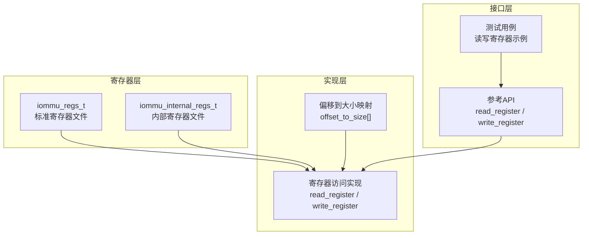
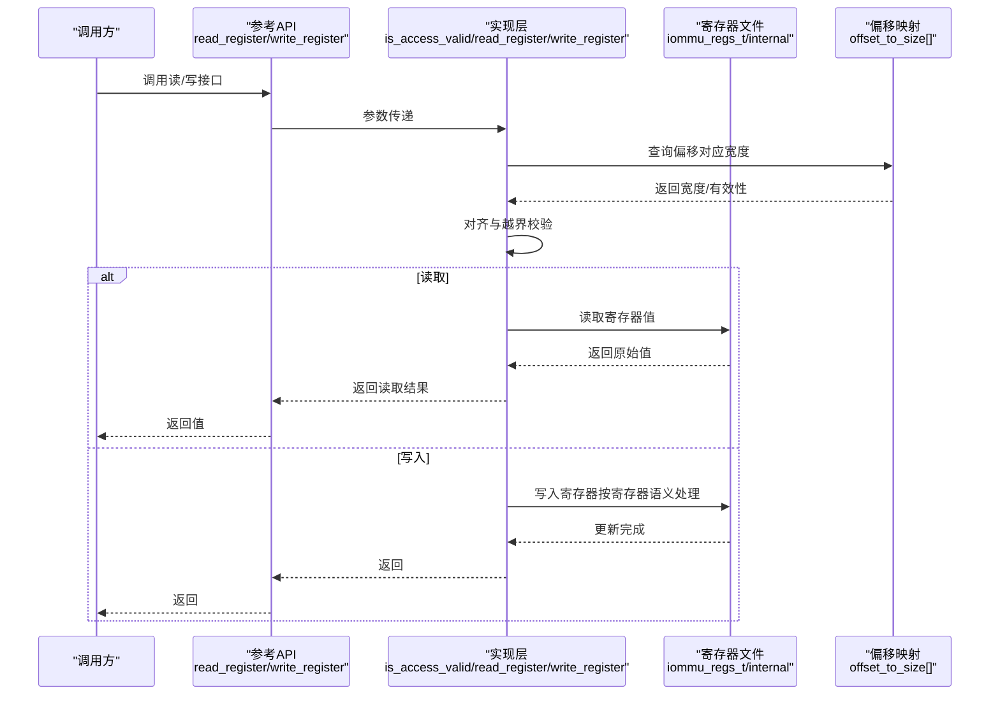
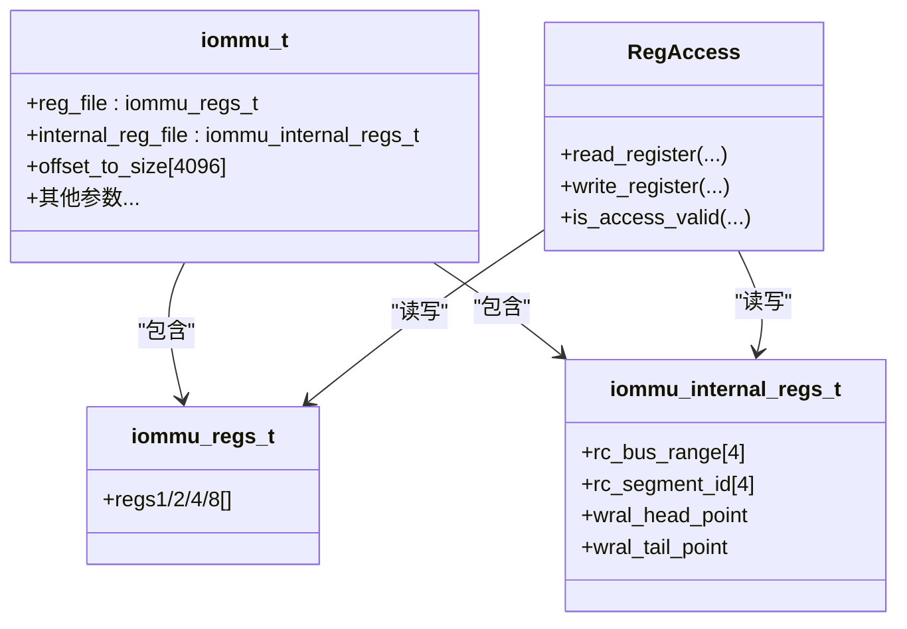

# 寄存器API

<cite>
**本文档引用的文件**
- [iommu_registers.hh](file://iommu/iommu_registers.hh)
- [iommu_reg.cc](file://iommu/iommu_reg.cc)
- [iommu_ref_api.hh](file://iommu/iommu_ref_api.hh)
- [iommu_ref_api.cc](file://iommu/iommu_ref_api.cc)
- [iommu_struct.hh](file://iommu/iommu_struct.hh)
- [test_rp_func.cc](file://rp/test_rp_func.cc)
</cite>

## 目录
1. [简介](#简介)
2. [项目结构](#项目结构)
3. [核心组件](#核心组件)
4. [架构总览](#架构总览)
5. [详细组件分析](#详细组件分析)
6. [依赖关系分析](#依赖关系分析)
7. [性能考量](#性能考量)
8. [故障排查指南](#故障排查指南)
9. [结论](#结论)
10. [附录](#附录)

## 简介
本文件系统化梳理 IOMMU 寄存器访问 API，聚焦以下目标：
- 明确 iommu_regs_t 与 iommu_internal_regs_t 的结构定义、用途与布局。
- 规范寄存器访问方法（读取、写入、状态查询），并解释偏移到大小的映射机制。
- 给出寄存器文件组织结构、配置参数（位字段、默认值、可选值范围）。
- 提供错误处理、并发访问控制与性能优化建议。
- 提供典型寄存器操作示例与常见配置场景。

## 项目结构
与寄存器 API 相关的关键文件与职责如下：
- iommu_registers.hh：寄存器结构体、偏移宏、能力与模式定义。
- iommu_reg.cc：寄存器访问实现（读写、有效性校验、状态更新、中断生成）。
- iommu_ref_api.hh / iommu_ref_api.cc：对外参考 API（读写寄存器、内存访问、复位等）。
- iommu_struct.hh：顶层结构 iommu_t，包含寄存器文件与全局参数。
- test_rp_func.cc：测试用例中对寄存器读写的实际调用示例。

图表来源
- [iommu_registers.hh:771-828](file://iommu/iommu_registers.hh#L771-L828)
- [iommu_reg.cc:11-26](file://iommu/iommu_reg.cc#L11-L26)
- [iommu_reg.cc:38-73](file://iommu/iommu_reg.cc#L38-L73)
- [iommu_ref_api.hh:26-27](file://iommu/iommu_ref_api.hh#L26-L27)
- [test_rp_func.cc:88-104](file://rp/test_rp_func.cc#L88-L104)

章节来源
- [iommu_registers.hh:771-828](file://iommu/iommu_registers.hh#L771-L828)
- [iommu_reg.cc:11-26](file://iommu/iommu_reg.cc#L11-L26)
- [iommu_ref_api.hh:26-27](file://iommu/iommu_ref_api.hh#L26-L27)
- [test_rp_func.cc:88-104](file://rp/test_rp_func.cc#L88-L104)

## 核心组件
- iommu_regs_t：标准寄存器文件，覆盖能力、控制、队列基址与索引、中断状态、性能监控、调试接口、QoS 与 MSI 配置表等。
- iommu_internal_regs_t：内部寄存器文件，包含 RC bus range/segment id 与 WARL 指针等。
- 访问接口：对外通过参考 API 提供 read_register / write_register；内部通过寄存器访问实现完成具体逻辑。
- 偏移映射：通过 offset_to_size[] 数组记录每个偏移对应的寄存器宽度，确保对齐与越界保护。

章节来源
- [iommu_registers.hh:771-828](file://iommu/iommu_registers.hh#L771-L828)
- [iommu_reg.cc:990-1056](file://iommu/iommu_reg.cc#L990-L1056)
- [iommu_ref_api.hh:26-27](file://iommu/iommu_ref_api.hh#L26-L27)

## 架构总览
寄存器访问路径从上层调用到实现层，再到寄存器文件，遵循严格的对齐与越界检查，同时根据寄存器特性执行写后动作（如启用队列、清零 RW1C 位、生成中断等）。

图表来源
- [iommu_ref_api.hh:26-27](file://iommu/iommu_ref_api.hh#L26-L27)
- [iommu_reg.cc:11-26](file://iommu/iommu_reg.cc#L11-L26)
- [iommu_reg.cc:38-73](file://iommu/iommu_reg.cc#L38-L73)
- [iommu_reg.cc:74-907](file://iommu/iommu_reg.cc#L74-L907)

## 详细组件分析

### 寄存器文件组织与布局
- 标准寄存器文件 iommu_regs_t
  - 覆盖能力寄存器、特性控制寄存器、设备目录表指针、命令/故障/页面请求队列基址与索引、队列控制与状态、中断挂起状态、性能计数器与事件选择、调试接口、QoS ID、中断向量映射、MSI 配置表等。
  - 采用紧凑打包布局，支持按 1/2/4/8 字节访问，但访问必须对齐且不可跨越寄存器边界。
- 内部寄存器文件 iommu_internal_regs_t
  - 包含 RC bus range 与 segment id 数组、WARL head/tail 指针等，位于独立的内部寄存器空间。

章节来源
- [iommu_registers.hh:771-828](file://iommu/iommu_registers.hh#L771-L828)
- [iommu_registers.hh:817-828](file://iommu/iommu_registers.hh#L817-L828)

### 偏移到大小映射机制
- 实现通过静态数组 offset_to_size[] 记录每个偏移的“最大可写宽度”，用于：
  - 判断访问是否对齐（num_bytes 必须为 4 或 8，且 offset 对 num_bytes 对齐）。
  - 判断访问是否跨寄存器（offset_to_size[offset] < num_bytes）。
- 初始化在复位流程中完成，覆盖标准寄存器、性能监控、MSI 表等所有有效偏移。

章节来源
- [iommu_reg.cc:9-26](file://iommu/iommu_reg.cc#L9-L26)
- [iommu_reg.cc:990-1056](file://iommu/iommu_reg.cc#L990-L1056)

### 读取接口
- 输入：iommu_t 指针、偏移、字节数（4 或 8）。
- 流程：
  - 校验访问合法性（对齐、越界、不跨寄存器）。
  - 若合法，根据偏移选择标准或内部寄存器文件，按 4B/8B 读取。
  - 特殊寄存器（如 IOCNTOVF）会聚合多个计数器状态。
- 返回：读取值（非法访问返回 0）。

章节来源
- [iommu_reg.cc:38-73](file://iommu/iommu_reg.cc#L38-L73)
- [iommu_ref_api.hh:26](file://iommu/iommu_ref_api.hh#L26)

### 写入接口
- 输入：iommu_t 指针、偏移、字节数（4 或 8）、数据。
- 流程：
  - 校验访问合法性。
  - 若为 4B 写入 8B 寄存器，先读取旧值再合并新值。
  - 分派到具体寄存器处理逻辑（如启用/禁用队列、清零 RW1C 位、更新索引、生成中断等）。
  - 对于只读寄存器直接忽略写入。
- 返回：无（非法访问丢弃写入）。

章节来源
- [iommu_reg.cc:74-907](file://iommu/iommu_reg.cc#L74-L907)
- [iommu_ref_api.hh:27](file://iommu/iommu_ref_api.hh#L27)

### 关键寄存器与位字段说明

#### 能力寄存器（capabilities）
- 用途：报告 IOMMU 支持的功能集合。
- 位字段要点：版本、Sv32/Sv39/Sv48/Sv57、Sv32x4/Sv39x4/Sv48x4/Sv57x4、MSI 支持、ATS/PRI、端序支持、HPM、DBG、物理地址位宽、进程 ID 层级、QoS、非叶子无效化、地址范围无效化、自定义域等。
- 默认值：实现定义；参考模型在复位时按输入 capabilities 初始化。

章节来源
- [iommu_registers.hh:172-249](file://iommu/iommu_registers.hh#L172-L249)
- [iommu_reg.cc:983](file://iommu/iommu_reg.cc#L983)

#### 特性控制寄存器（fctl）
- 用途：控制端序、中断方式等可配置特性。
- 位字段要点：端序（be）、无线中断使能（wsi）、GXL 控制等；是否可写取决于 capabilities 中的端序与中断支持能力。
- 默认值：复位时清零，后续由软件按需配置。

章节来源
- [iommu_registers.hh:255-271](file://iommu/iommu_registers.hh#L255-L271)
- [iommu_reg.cc:212-233](file://iommu/iommu_reg.cc#L212-L233)

#### 设备目录表指针（ddtp）
- 用途：设置 IOMMU 模式与根页帧号（PPN）。
- 位字段要点：iommu_mode（Off/Bare/1LVL/2LVL/3LVL 及自定义）、busy（写入期间忙）、PPN。
- 语义：写入前需检查 busy 与模式合法性；非法写入会被丢弃。

章节来源
- [iommu_registers.hh:286-330](file://iommu/iommu_registers.hh#L286-L330)
- [iommu_reg.cc:234-271](file://iommu/iommu_reg.cc#L234-L271)

#### 队列基址与索引
- 命令队列（CQB/CQH/CQT）、故障队列（FQB/FQH/FQT）、页面请求队列（PQB/PQH/PQT）。
- 语义：基址包含 log2szm1 与 PPN；索引受队列容量限制；启用/禁用队列时会重置索引并更新状态位。

章节来源
- [iommu_registers.hh:333-454](file://iommu/iommu_registers.hh#L333-L454)
- [iommu_reg.cc:272-295](file://iommu/iommu_reg.cc#L272-L295)
- [iommu_reg.cc:296-321](file://iommu/iommu_reg.cc#L296-L321)
- [iommu_reg.cc:322-353](file://iommu/iommu_reg.cc#L322-L353)

#### 队列控制与状态（cqcsr/fqcsr/pqcsr）
- 用途：启用/禁用队列、中断使能、RW1C 清除位（cmd_ill/cmd_to/cqmf/fence_w_ip/fqof/pqof 等）。
- 语义：写入 busy 期间丢弃；启用/禁用时更新 cqon/fqon/pqon 与索引；RW1C 位写 1 清除。

章节来源
- [iommu_registers.hh:457-579](file://iommu/iommu_registers.hh#L457-L579)
- [iommu_reg.cc:354-432](file://iommu/iommu_reg.cc#L354-L432)
- [iommu_reg.cc:433-493](file://iommu/iommu_reg.cc#L433-L493)
- [iommu_reg.cc:494-560](file://iommu/iommu_reg.cc#L494-L560)

#### 中断挂起状态（ipsr）
- 用途：报告待处理中断源；写 1 清除对应位并重新触发中断（若条件满足）。
- 语义：RW1C 语义；写入后根据各队列 CSR 状态决定是否再次触发中断。

章节来源
- [iommu_registers.hh:580-591](file://iommu/iommu_registers.hh#L580-L591)
- [iommu_reg.cc:561-614](file://iommu/iommu_reg.cc#L561-L614)

#### 性能监控（iocountovf/iocountinh/iohpmcycles/iohpmctr/iohpmevt）
- 用途：溢出状态聚合、计数抑制、周期计数器、事件选择与计数器数组。
- 语义：HPM 可选；计数器为 WARL；事件选择受限于 eventID_limit；溢出状态按寄存器聚合。

章节来源
- [iommu_registers.hh:592-628](file://iommu/iommu_registers.hh#L592-L628)
- [iommu_reg.cc:28-36](file://iommu/iommu_reg.cc#L28-L36)
- [iommu_reg.cc:615-717](file://iommu/iommu_reg.cc#L615-L717)

#### 调试接口（tr_req_iova/tr_req_ctrl/tr_response）
- 用途：调试翻译请求接口；capabilities.DBG 为 1 时可用。
- 语义：Go/Busy 位控制请求提交与完成；完成后写入 tr_response。

章节来源
- [iommu_registers.hh:642-728](file://iommu/iommu_registers.hh#L642-L728)
- [iommu_reg.cc:719-776](file://iommu/iommu_reg.cc#L719-L776)

#### QoS 与中断向量（iommu_qosid/icvec）
- 用途：IOMMU 主动请求使用的 RCID/MCID；HPM/队列中断向量映射。
- 语义：RCID/MCID 为 WARL；向量位数受限于 num_vec_bits。

章节来源
- [iommu_registers.hh:761-769](file://iommu/iommu_registers.hh#L761-L769)
- [iommu_registers.hh:630-640](file://iommu/iommu_registers.hh#L630-L640)
- [iommu_reg.cc:777-807](file://iommu/iommu_reg.cc#L777-L807)

#### MSI 配置表（msi_cfg_tbl）
- 用途：为每个向量配置 MSI 地址、数据与向量控制。
- 语义：仅在支持 MSI 时可写；索引由 icvec 向量决定；写入时进行掩码与范围检查。

章节来源
- [iommu_registers.hh:730-750](file://iommu/iommu_registers.hh#L730-L750)
- [iommu_registers.hh:808](file://iommu/iommu_registers.hh#L808)
- [iommu_reg.cc:808-905](file://iommu/iommu_reg.cc#L808-L905)

### 访问方法与状态查询接口
- 读取：read_register(iommu_t*, offset, num_bytes) → uint64_t
- 写入：write_register(iommu_t*, offset, num_bytes, data) → void
- 状态查询：通过读取相应寄存器（如 ipsr、cqcsr/fqcsr/pqcsr、fqt/cqt 等）获取当前状态。

章节来源
- [iommu_ref_api.hh:26-27](file://iommu/iommu_ref_api.hh#L26-L27)

### 寄存器配置参数详解
- iommu_mode（ddtp.iommu_mode）：Off/Bare/1LVL/2LVL/3LVL 及自定义；写入需满足模式合法性与 busy 条件。
- log2szm1（队列基址寄存器）：决定队列容量（2^(log2szm1+1)）；基址对齐规则与容量相关。
- busy（ddtp/cqcsr/fqcsr/pqcsr）：写入期间置位；需等待为 0 再进行后续写入。
- RW1C 位：cmd_ill/cmd_to/cqmf/fence_w_ip/fqof/pqof 等写 1 清除。
- HPM：num_hpm、hpmctr_bits、eventID_limit、num_vec_bits；HPM 不可用时相关寄存器为只读 0。
- MSI：igs 支持 MSI/WSI/Both；向量数受限于 num_vec_bits；MSI 表项按向量索引。

章节来源
- [iommu_reg.cc:234-271](file://iommu/iommu_reg.cc#L234-L271)
- [iommu_reg.cc:272-295](file://iommu/iommu_reg.cc#L272-L295)
- [iommu_reg.cc:354-432](file://iommu/iommu_reg.cc#L354-L432)
- [iommu_reg.cc:615-717](file://iommu/iommu_reg.cc#L615-L717)
- [iommu_reg.cc:808-905](file://iommu/iommu_reg.cc#L808-L905)

### 错误处理与并发控制
- 访问合法性检查：仅允许 4B/8B 访问，且对齐；禁止跨寄存器访问；非法访问丢弃写入并返回 0。
- Busy 保护：多处寄存器写入期间 busy 置位，需轮询 busy 为 0 后再写入。
- 未定义行为：越界、非对齐、跨寄存器访问的行为未定义（参考模型丢弃写入/返回 0）。
- 中断处理：IPSR 为 RW1C，写 1 清除并按条件重新触发。

章节来源
- [iommu_reg.cc:11-26](file://iommu/iommu_reg.cc#L11-L26)
- [iommu_reg.cc:234-271](file://iommu/iommu_reg.cc#L234-L271)
- [iommu_reg.cc:561-614](file://iommu/iommu_reg.cc#L561-L614)

### 性能优化建议
- 批量访问：尽量以 8B 访问连续寄存器，减少多次 4B 写入。
- 队列管理：启用队列前先确保 busy 与 cqon/fqon/pqon 为 0；启用后及时处理中断。
- HPM：合理设置 eventID_limit 与 num_vec_bits，避免无效写入。
- MSI：仅在需要时启用 MSI，减少向量映射开销。

## 依赖关系分析
- iommu_regs_t 与 iommu_internal_regs_t 作为数据容器，被 iommu_t 引用。
- iommu_reg.cc 依赖 iommu_registers.hh 的结构定义与偏移宏。
- iommu_ref_api.hh 暴露对外 API，内部调用 iommu_reg.cc 的实现。
- 测试用例 test_rp_func.cc 通过参考 API 读写寄存器，验证队列状态与故障记录。

图表来源
- [iommu_struct.hh:62-67](file://iommu/iommu_struct.hh#L62-L67)
- [iommu_struct.hh:42-99](file://iommu/iommu_struct.hh#L42-L99)
- [iommu_reg.cc:38-907](file://iommu/iommu_reg.cc#L38-L907)

章节来源
- [iommu_struct.hh:42-99](file://iommu/iommu_struct.hh#L42-L99)
- [iommu_reg.cc:38-907](file://iommu/iommu_reg.cc#L38-L907)

## 性能考量
- 访问对齐与越界检查带来少量 CPU 开销，但显著提升稳定性。
- 8B 访问优于多次 4B 写入，尤其在批量配置队列时。
- 合理利用 RW1C 位一次性清除多个状态位，减少写回次数。
- HPM 与 MSI 的向量数量应与平台需求匹配，避免冗余配置。

## 故障排查指南
- 读取返回 0：
  - 检查偏移与访问宽度是否对齐。
  - 确认访问未跨越寄存器边界。
- 写入无效：
  - 检查寄存器是否只读。
  - 检查 busy 是否为 1。
  - 检查模式合法性（如 ddtp）。
- 队列不生效：
  - 确认 cqen/fqen/pqen 从 0→1 后 cqon/fqon/pqon 已置位。
  - 检查中断使能与 pending 状态。
- MSI 未触发：
  - 检查 icvec 向量映射与 num_vec_bits。
  - 检查 msi_vec_ctrl.m 是否被清零导致释放中断。

章节来源
- [iommu_reg.cc:11-26](file://iommu/iommu_reg.cc#L11-L26)
- [iommu_reg.cc:354-432](file://iommu/iommu_reg.cc#L354-L432)
- [iommu_reg.cc:808-905](file://iommu/iommu_reg.cc#L808-L905)

## 结论
本文档系统化梳理了 IOMMU 寄存器访问 API 的结构、实现与使用方法，明确了标准与内部寄存器文件的组织、偏移到大小的映射机制、读写语义与状态查询接口，并提供了错误处理、并发控制与性能优化建议。结合测试用例中的实际调用，可快速定位与解决常见问题。

## 附录

### 典型寄存器操作示例（基于测试用例）
- 读取故障队列状态与弹出记录
  - 读取 FQH、FQT 并比较；若存在故障则读取 FQB 获取记录地址，读取故障记录并递增 FQH。
- 队列启用与状态检查
  - 写入 CQB/PQB/FQB 设置基址与容量；写入 CQCSR/FQCSR/PQCSR 启用队列；轮询 cqon/fqon/pqon 与 busy。

章节来源
- [test_rp_func.cc:88-104](file://rp/test_rp_func.cc#L88-L104)
- [test_rp_func.cc:155-167](file://rp/test_rp_func.cc#L155-L167)