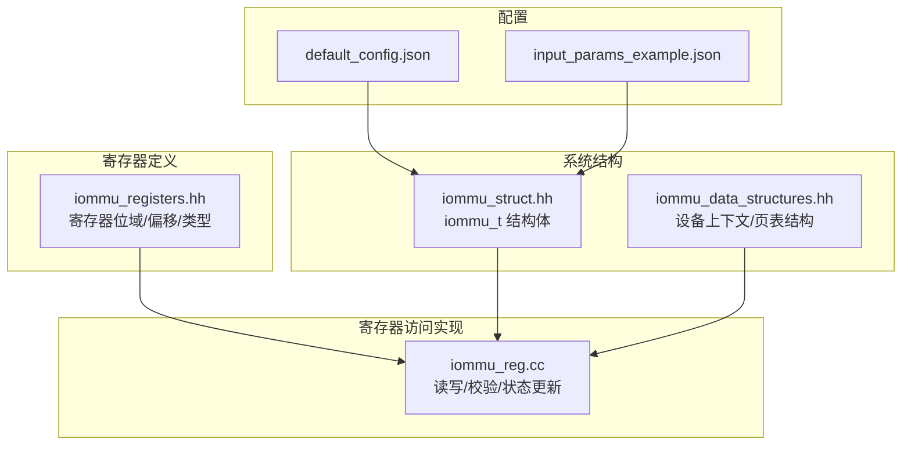
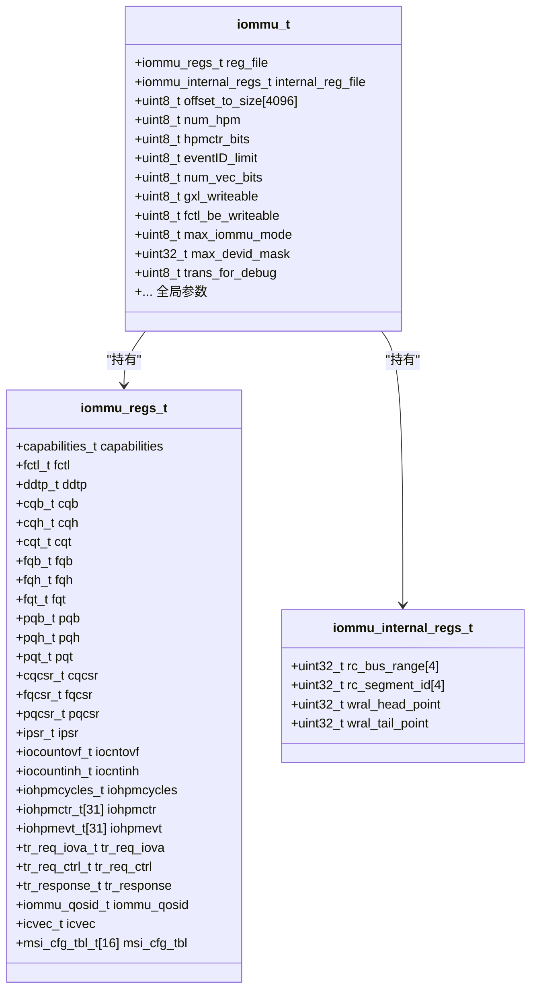
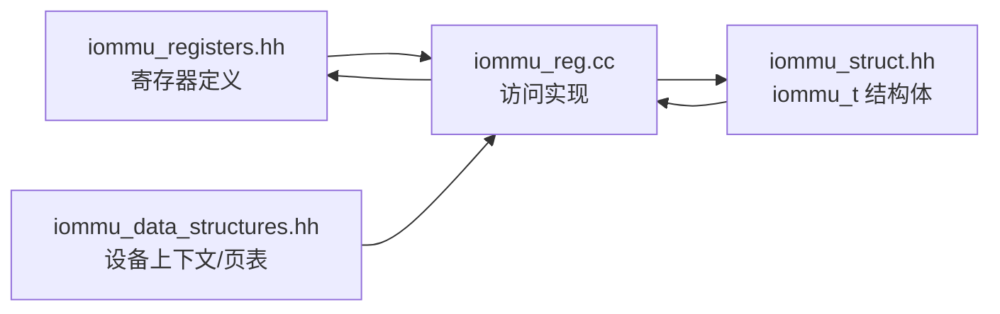
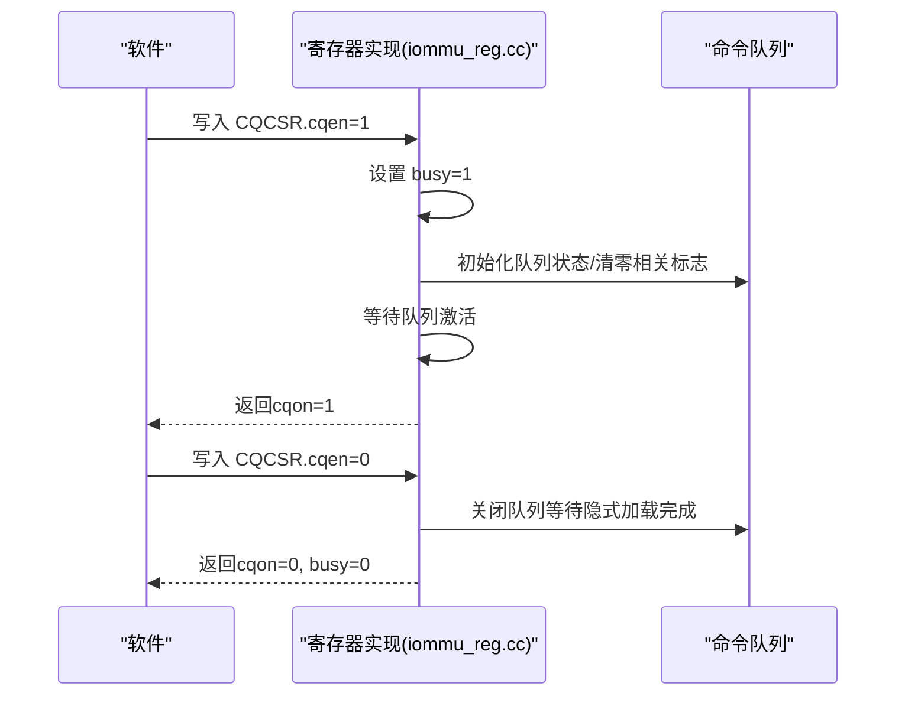
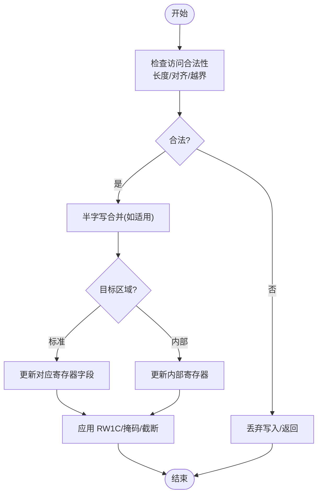

# 寄存器接口

<cite>
**本文引用的文件**
- [iommu_registers.hh](file://iommu/include/iommu_registers.hh)
- [iommu_reg.cc](file://iommu/iommu_perf_model/iommu_reg.cc)
- [iommu_struct.hh](file://iommu/include/iommu_struct.hh)
- [iommu_data_structures.hh](file://iommu/include/iommu_data_structures.hh)
- [default_config.json](file://iommu/cache_config/default_config.json)
- [input_params_example.json](file://iommu/cache_config/input_params_example.json)
- [README.md](file://README.md)
</cite>

## 目录
1. [简介](#简介)
2. [项目结构](#项目结构)
3. [核心组件](#核心组件)
4. [架构总览](#架构总览)
5. [详细组件分析](#详细组件分析)
6. [依赖关系分析](#依赖关系分析)
7. [性能考量](#性能考量)
8. [故障排查指南](#故障排查指南)
9. [结论](#结论)
10. [附录](#附录)

## 简介
本文件为 IOMMU 寄存器接口的完整 API 文档，覆盖寄存器地址映射、位域定义、访问权限与行为、读写规则、原子性与竞态处理、复位值与默认状态、推荐配置与边界条件、以及访问示例与错误处理策略。内容基于仓库中的寄存器头文件与寄存器访问实现，确保与实际代码一致。

## 项目结构
IOMMU 寄存器接口位于 iommu/include/iommu_registers.hh，寄存器读写逻辑位于 iommu/iommu_perf_model/iommu_reg.cc，全局结构体与寄存器文件组织定义于 iommu/include/iommu_struct.hh，设备上下文与页表结构定义于 iommu/include/iommu_data_structures.hh。

图表来源
- [iommu_registers.hh:830-987](file://iommu/include/iommu_registers.hh#L830-L987)
- [iommu_reg.cc:1-1057](file://iommu/iommu_perf_model/iommu_reg.cc#L1-L1057)
- [iommu_struct.hh:42-102](file://iommu/include/iommu_struct.hh#L42-L102)
- [iommu_data_structures.hh:1-415](file://iommu/include/iommu_data_structures.hh#L1-L415)
- [default_config.json:1-69](file://iommu/cache_config/default_config.json#L1-L69)
- [input_params_example.json:1-69](file://iommu/cache_config/input_params_example.json#L1-L69)

章节来源
- [iommu_registers.hh:830-987](file://iommu/include/iommu_registers.hh#L830-L987)
- [iommu_reg.cc:1-1057](file://iommu/iommu_perf_model/iommu_reg.cc#L1-L1057)
- [iommu_struct.hh:42-102](file://iommu/include/iommu_struct.hh#L42-L102)
- [iommu_data_structures.hh:1-415](file://iommu/include/iommu_data_structures.hh#L1-L415)

## 核心组件
- 寄存器位域与类型：通过联合体与结构体定义各寄存器字段，包含只读、只写、读改写（RW1C）、写零清零（RW1C）等语义。
- 寄存器文件布局：标准寄存器区与内部寄存器区，分别对应 IOMMU 标准内存映射与扩展内部用途。
- 访问接口：统一的读写函数，包含对齐与越界检查、半字写合并、状态标志更新与中断生成。
- 复位与默认值：reset 接口初始化寄存器文件，设置能力位、特性控制位及部分寄存器默认值。

章节来源
- [iommu_registers.hh:172-815](file://iommu/include/iommu_registers.hh#L172-L815)
- [iommu_reg.cc:38-1057](file://iommu/iommu_perf_model/iommu_reg.cc#L38-L1057)
- [iommu_struct.hh:62-102](file://iommu/include/iommu_struct.hh#L62-L102)

## 架构总览
寄存器接口采用“定义 + 实现 + 结构体”的分层设计：
- 定义层：寄存器名称、偏移、位域、类型与访问属性。
- 实现层：访问合法性检查、半字写合并、状态更新、RW1C 写清零、中断生成。
- 结构体层：iommu_t 持有 reg_file 与 internal_reg_file，承载寄存器状态与全局参数。

图表来源
- [iommu_registers.hh:777-828](file://iommu/include/iommu_registers.hh#L777-L828)
- [iommu_struct.hh:42-102](file://iommu/include/iommu_struct.hh#L42-L102)

章节来源
- [iommu_registers.hh:777-828](file://iommu/include/iommu_registers.hh#L777-L828)
- [iommu_struct.hh:42-102](file://iommu/include/iommu_struct.hh#L42-L102)

## 详细组件分析

### 标准寄存器区（IOMMU_RISCV_STANDARD_REG_OFFSET）
- 寄存器布局与偏移：从 0x0 到 0x1000（4KB 页面），包含能力寄存器、特性控制寄存器、设备目录表指针、命令/故障/页面请求队列基址与索引、队列控制状态寄存器、中断挂起状态寄存器、性能监控计数器与事件选择器、调试翻译请求接口、QoS ID、中断向量分配、MSI 配置表等。
- 访问规则：仅支持 4 字节与 8 字节访问；越界、非对齐或跨寄存器访问被拒绝；读返回 0 或按实现行为处理。

章节来源
- [iommu_registers.hh:830-987](file://iommu/include/iommu_registers.hh#L830-L987)
- [iommu_reg.cc:11-26](file://iommu/iommu_perf_model/iommu_reg.cc#L11-L26)

### 设备目录表指针（DDTP）
- 功能：设置 IOMMU 工作模式与根页 PPN，支持 Off、Bare、1/2/3 级目录表模式。
- 位域：iommu_mode（4 位）、busy（1 位）、PPN（44 位）。
- 行为与约束：
  - 写入时若 busy 为 1，则丢弃写入。
  - iommu_mode 必须为合法枚举值且不超过实现上限；非法值保留当前值。
  - PPN 按物理地址大小掩码截断。
- 原子性与竞态：写入可能异步生效，busy 期间禁止再次写入；建议先确认 busy 与 cqon/fqon/pqon 均为 0 后再变更。

章节来源
- [iommu_registers.hh:286-330](file://iommu/include/iommu_registers.hh#L286-L330)
- [iommu_reg.cc:234-271](file://iommu/iommu_perf_model/iommu_reg.cc#L234-L271)

### 命令队列（CQB/CQH/CQT/CQCSR）
- CQB：设置命令队列基址与容量（log2szm1 控制，每命令 16 字节）。
- CQH：只读，IOMMU 下一次取指位置。
- CQT：软件写入位置，仅允许写入有效索引位。
- CQCSR：控制使能、中断、RW1C 清零位（cqmf/cmd_to/cmd_ill/fence_w_ip），busy 标志。
- 行为与约束：
  - 修改 cqb 时若 busy 或 cqon 为 1，丢弃写入；推荐先禁用队列并等待 busy/cqon 清零。
  - 写入 cqt 时仅允许写入有效索引位。
  - 写入 cqcsr 的 RW1C 位时，写 1 清零。
- 原子性与竞态：busy 期间禁止写入 cqcsr；cqen 由 0->1 时会清零若干状态位并延迟激活；cqen 由 1->0 时可能保持活跃直到隐式加载完成。

章节来源
- [iommu_registers.hh:333-373](file://iommu/include/iommu_registers.hh#L333-L373)
- [iommu_registers.hh:457-549](file://iommu/include/iommu_registers.hh#L457-L549)
- [iommu_reg.cc:272-432](file://iommu/iommu_perf_model/iommu_reg.cc#L272-L432)

### 故障队列（FQB/FQH/FQT/FQCSR）
- FQB：故障记录队列基址与容量（每记录 32 字节）。
- FQH：只读，软件读取位置。
- FQT：只读，IOMMU 写入位置。
- FQCSR：控制使能、中断、RW1C（fqmf/fqof），busy。
- 行为与约束：
  - 修改 fqb 时若 busy 或 fqon 为 1，丢弃写入；推荐先禁用并等待。
  - 写入 fqh 时仅允许写入有效索引位。
- 原子性与竞态：busy 期间禁止写入 fqcsr；关闭时保证无隐式写入进行。

章节来源
- [iommu_registers.hh:376-415](file://iommu/include/iommu_registers.hh#L376-L415)
- [iommu_registers.hh:550-564](file://iommu/include/iommu_registers.hh#L550-L564)
- [iommu_reg.cc:296-493](file://iommu/iommu_perf_model/iommu_reg.cc#L296-L493)

### 页面请求队列（PQB/PQH/PQT/PQCSR）
- PQB：页面请求消息队列基址与容量（每消息 16 字节）。
- PQH：只读，软件读取位置。
- PQT：只读，IOMMU 写入位置。
- PQCSR：控制使能、中断、RW1C（pqmf/pqof），busy。
- 行为与约束：
  - 若 capabilities.ats 为 0，PQB/PQH/PQT 为只读 0。
  - 修改 pqb 时若 busy 或 pqon 为 1，丢弃写入。
- 原子性与竞态：busy 期间禁止写入 pqcsr；关闭时保证无隐式写入。

章节来源
- [iommu_registers.hh:419-454](file://iommu/include/iommu_registers.hh#L419-L454)
- [iommu_registers.hh:565-579](file://iommu/include/iommu_registers.hh#L565-L579)
- [iommu_reg.cc:322-560](file://iommu/iommu_perf_model/iommu_reg.cc#L322-L560)

### 中断挂起状态（IPSR）
- 位：cip（命令队列）、fip（故障队列）、pmip（性能监控）、pip（页面请求队列）。
- 行为：写 1 清零对应位；若条件仍满足则重新置位；若中断已启用则触发中断。

章节来源
- [iommu_registers.hh:580-591](file://iommu/include/iommu_registers.hh#L580-L591)
- [iommu_reg.cc:561-614](file://iommu/iommu_perf_model/iommu_reg.cc#L561-L614)

### 性能监控（IOCNTOVF/IOCNTINH/IOHPMCYCLES/IOHPMCTR/IOHPMEVT）
- IOCNTOVF：汇总计数器溢出状态（只读）。
- IOCNTINH：性能计数器抑制位（只读 0 若不支持 HPM）。
- IOHPMCYCLES：周期计数器（只读 0 若不支持 HPM）。
- IOHPMCTR1..31：计数器（只读 0 若不支持 HPM）。
- IOHPMEVT1..31：事件选择器（只读 0 若不支持 HPM）。
- 行为：写入 WARL，超出实现位宽的部分被截断；事件 ID 被限制在实现范围内。

章节来源
- [iommu_registers.hh:592-628](file://iommu/include/iommu_registers.hh#L592-L628)
- [iommu_reg.cc:615-717](file://iommu/iommu_perf_model/iommu_reg.cc#L615-L717)

### 调试翻译请求（TR_REQ_IOVA/TR_REQ_CTRL/TR_RESPONSE）
- TR_REQ_IOVA：调试用 IOVA（VPN）。
- TR_REQ_CTRL：调试用控制位（go_busy、Priv、Exe、NW、PID/PV、DID 等）。
- TR_RESPONSE：翻译结果（fault、PBMT、S、PPN）。
- 行为：capabilities.dbg 为 1 时可用；修改时若 go_busy 为 1 则忽略写入；go_busy 0->1 触发翻译并填充响应。

章节来源
- [iommu_registers.hh:642-728](file://iommu/include/iommu_registers.hh#L642-L728)
- [iommu_reg.cc:719-776](file://iommu/iommu_perf_model/iommu_reg.cc#L719-L776)

### QoS ID（IOMMU_QOSID）
- 功能：为 IOMMU 发起的访问关联 RCID/MCID。
- 行为：capabilities.qosid 为 1 时可写，否则只读 0；写入受掩码限制。

章节来源
- [iommu_registers.hh:761-769](file://iommu/include/iommu_registers.hh#L761-L769)
- [iommu_reg.cc:777-783](file://iommu/iommu_perf_model/iommu_reg.cc#L777-L783)

### 中断向量分配（ICVEC）
- 功能：为不同中断源分配向量号（命令队列、故障队列、性能监控、页面请求队列）。
- 行为：若实现仅支持单向量或多受限向量，则相应位可能为只读 0；写入受 num_vec_bits 限制。

章节来源
- [iommu_registers.hh:630-640](file://iommu/include/iommu_registers.hh#L630-L640)
- [iommu_reg.cc:784-807](file://iommu/iommu_perf_model/iommu_reg.cc#L784-L807)

### MSI 配置表（MSI_ADDR/DATA/VEC_CTRL）
- 功能：为每个向量提供 MSI 地址、数据与向量控制。
- 行为：若 capabilities.igs 为 WSI 则该表只读 0；写入地址受 PA 掩码限制；释放中断时处理 m 位变化。

章节来源
- [iommu_registers.hh:731-750](file://iommu/include/iommu_registers.hh#L731-L750)
- [iommu_reg.cc:808-907](file://iommu/iommu_perf_model/iommu_reg.cc#L808-L907)

### 特性控制（FCTRL）
- 功能：端序（be）、线中断（wsi）、GXL 控制等。
- 行为：仅当硬件支持双端序或双中断方式时才可写；写入前需确保 IOMMU 处于 Off/Bare 且队列未启用。

章节来源
- [iommu_registers.hh:255-271](file://iommu/include/iommu_registers.hh#L255-L271)
- [iommu_reg.cc:195-233](file://iommu/iommu_perf_model/iommu_reg.cc#L195-L233)

### 内部寄存器区（IOMMU_INTERNAL_REG_OFFSET）
- 功能：RC bus range、segment id、WARL head/tail point 等内部用途。
- 行为：仅 4 字节写入，越界或非法偏移被忽略。

章节来源
- [iommu_registers.hh:817-828](file://iommu/include/iommu_registers.hh#L817-L828)
- [iommu_reg.cc:126-158](file://iommu/iommu_perf_model/iommu_reg.cc#L126-L158)

## 依赖关系分析

图表来源
- [iommu_registers.hh:1-10](file://iommu/include/iommu_registers.hh#L1-L10)
- [iommu_reg.cc:1-100](file://iommu/iommu_perf_model/iommu_reg.cc#L1-L100)
- [iommu_struct.hh:42-102](file://iommu/include/iommu_struct.hh#L42-L102)
- [iommu_data_structures.hh:1-415](file://iommu/include/iommu_data_structures.hh#L1-L415)

章节来源
- [iommu_registers.hh:1-10](file://iommu/include/iommu_registers.hh#L1-L10)
- [iommu_reg.cc:1-100](file://iommu/iommu_perf_model/iommu_reg.cc#L1-L100)
- [iommu_struct.hh:42-102](file://iommu/include/iommu_struct.hh#L42-L102)
- [iommu_data_structures.hh:1-415](file://iommu/include/iommu_data_structures.hh#L1-L415)

## 性能考量
- 访问合法性检查：仅 4/8 字节访问，对齐检查与跨寄存器检查，越界或非对齐访问被丢弃。
- 半字写合并：对 8 字节寄存器进行 4 字节写入时，按低/高半区合并后再写回。
- 状态延迟：队列启用/关闭存在延迟，busy 标志指示异步完成状态。
- 性能计数器：支持多计数器与事件选择，写入受位宽限制；溢出状态汇总寄存器只读。

章节来源
- [iommu_reg.cc:11-26](file://iommu/iommu_perf_model/iommu_reg.cc#L11-L26)
- [iommu_reg.cc:108-122](file://iommu/iommu_perf_model/iommu_reg.cc#L108-L122)
- [iommu_reg.cc:354-432](file://iommu/iommu_perf_model/iommu_reg.cc#L354-L432)
- [iommu_reg.cc:615-717](file://iommu/iommu_perf_model/iommu_reg.cc#L615-L717)

## 故障排查指南
- 访问异常：
  - 读写返回 0 或无效值：检查对齐、长度与越界；确认偏移是否落在 4KB 页面内。
  - 写入被忽略：检查目标寄存器是否只读、是否处于 busy 状态、是否在启用队列时修改了基址寄存器。
- 队列问题：
  - 队列无法启动：确认 cqen/fqen/pqen 由 0->1 时是否清零相关状态位；等待 busy 与 cqon/fqon/pqon 变为 0。
  - 中断未触发：检查 ipsr 对应位是否被清零、IE 是否启用、条件是否仍满足。
- MSI 问题：
  - MSI 不生效：检查 capabilities.igs 是否支持 MSI；检查向量表项是否被正确写入；检查 m 位是否被清除导致释放中断。
- 调试翻译请求：
  - go_busy 一直为 1：检查 capabilities.dbg 是否启用、ddtp 配置是否稳定、请求参数是否合法。

章节来源
- [iommu_reg.cc:11-26](file://iommu/iommu_perf_model/iommu_reg.cc#L11-L26)
- [iommu_reg.cc:272-295](file://iommu/iommu_perf_model/iommu_reg.cc#L272-L295)
- [iommu_reg.cc:354-432](file://iommu/iommu_perf_model/iommu_reg.cc#L354-L432)
- [iommu_reg.cc:561-614](file://iommu/iommu_perf_model/iommu_reg.cc#L561-L614)
- [iommu_reg.cc:808-907](file://iommu/iommu_perf_model/iommu_reg.cc#L808-L907)
- [iommu_reg.cc:719-776](file://iommu/iommu_perf_model/iommu_reg.cc#L719-L776)

## 结论
IOMMU 寄存器接口以严格的位域定义与访问规则为基础，结合实现层的状态机与 RW1C 语义，提供了可靠的队列控制、中断管理与性能监控能力。遵循本文的访问规范、竞态规避策略与推荐配置，可在多数场景下获得稳定的行为表现。

## 附录

### 寄存器访问序列图（命令队列启用）

图表来源
- [iommu_reg.cc:354-432](file://iommu/iommu_perf_model/iommu_reg.cc#L354-L432)

### 寄存器访问流程图（通用写入）

图表来源
- [iommu_reg.cc:103-122](file://iommu/iommu_perf_model/iommu_reg.cc#L103-L122)
- [iommu_reg.cc:124-159](file://iommu/iommu_perf_model/iommu_reg.cc#L124-L159)
- [iommu_reg.cc:160-907](file://iommu/iommu_perf_model/iommu_reg.cc#L160-L907)

### 复位与默认状态
- reset 接口负责初始化寄存器文件与全局参数，设置能力位与特性控制位，并将部分寄存器清零。
- 默认值与限制：
  - ddtp.iommu_mode 复位值必须为 Off 或 Bare。
  - fctl、cqcsr、fqcsr、pqcsr 等寄存器复位值为 0（实现定义的其他寄存器除外）。
  - HPM 相关寄存器仅在 capabilities.hpm 为 1 时有效。
  - 向量数 num_vec_bits 限制在 1..4；事件 ID 限制在实现范围内。

章节来源
- [iommu_reg.cc:909-1057](file://iommu/iommu_perf_model/iommu_reg.cc#L909-L1057)

### 推荐配置与边界条件
- 队列容量：命令/故障/页面请求队列容量由 log2szm1 决定，需满足对齐要求；超过阈值时基址需按容量自然对齐。
- PPN 截断：所有 PPN 字段按物理地址大小掩码截断，避免越界。
- 端序与中断：仅在硬件支持双端序或双中断方式时允许写入 fctl；否则写入将被忽略。
- HPM：事件 ID 与计数器位宽受实现限制；写入时注意截断与无效范围。

章节来源
- [iommu_registers.hh:333-353](file://iommu/include/iommu_registers.hh#L333-L353)
- [iommu_registers.hh:376-394](file://iommu/include/iommu_registers.hh#L376-L394)
- [iommu_registers.hh:419-438](file://iommu/include/iommu_registers.hh#L419-L438)
- [iommu_reg.cc:615-717](file://iommu/iommu_perf_model/iommu_reg.cc#L615-L717)

### 错误处理策略
- 访问非法：丢弃写入并返回 0（读）。
- busy 状态：禁止写入相关寄存器，直至 busy 清零。
- 队列启用/关闭：严格遵循延迟与状态机，避免竞态。
- MSI 释放：检测 m 位下降沿以释放挂起中断。

章节来源
- [iommu_reg.cc:11-26](file://iommu/iommu_perf_model/iommu_reg.cc#L11-L26)
- [iommu_reg.cc:234-271](file://iommu/iommu_perf_model/iommu_reg.cc#L234-L271)
- [iommu_reg.cc:354-432](file://iommu/iommu_perf_model/iommu_reg.cc#L354-L432)
- [iommu_reg.cc:897-907](file://iommu/iommu_perf_model/iommu_reg.cc#L897-L907)