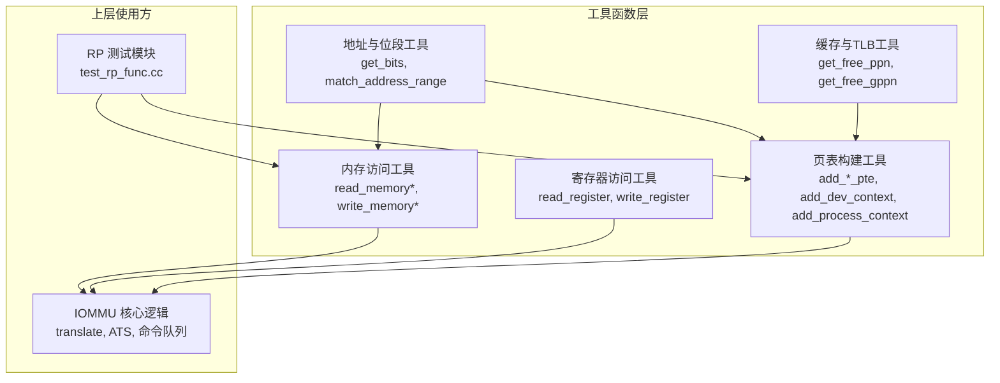
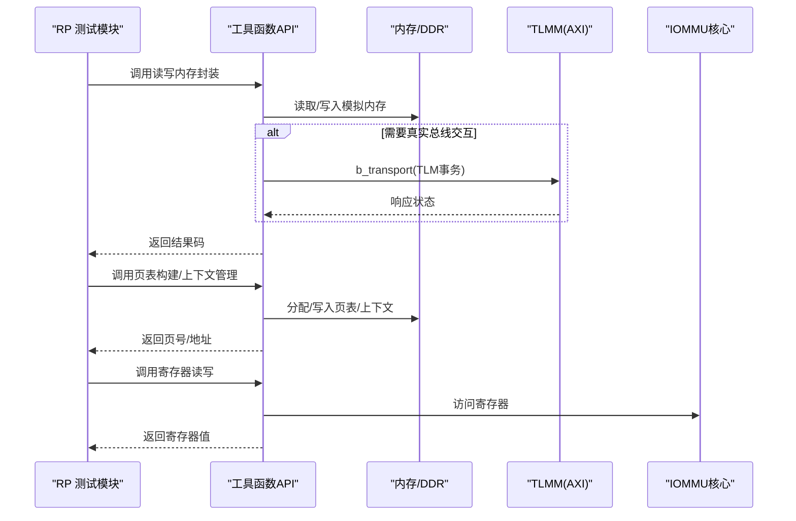
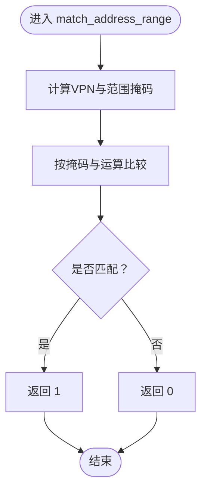
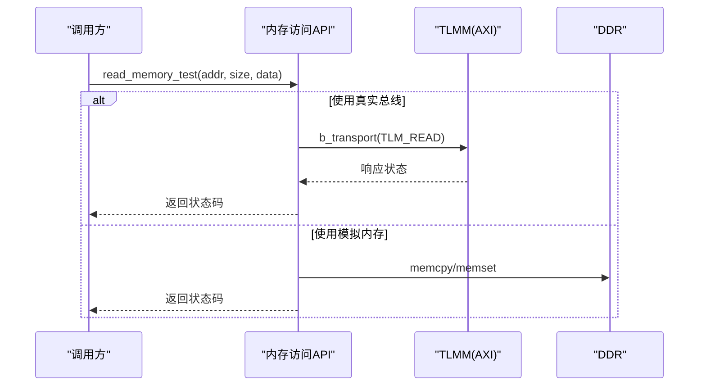
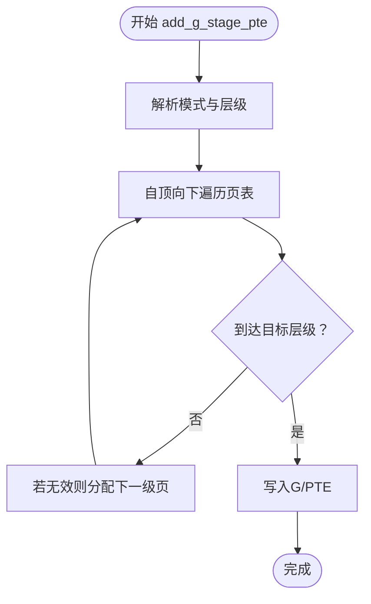
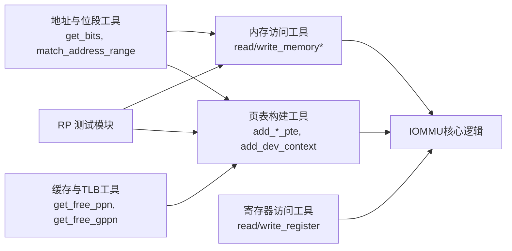

# 工具函数API

<cite>
**本文档引用的文件**
- [iommu_utils.hh](file://iommu/iommu_utils.hh)
- [iommu_utils.cc](file://iommu/iommu_utils.cc)
- [iommu_ref_api.hh](file://iommu/iommu_ref_api.hh)
- [iommu_ref_api.cc](file://iommu/iommu_ref_api.cc)
- [iommu_data_structures.hh](file://iommu/iommu_data_structures.hh)
- [iommu_struct.hh](file://iommu/iommu_struct.hh)
- [iommu_registers.hh](file://iommu/iommu_registers.hh)
- [iommu_req_rsp.hh](file://iommu/iommu_req_rsp.hh)
- [test_rp_func.cc](file://rp/test_rp_func.cc)
</cite>

## 目录
1. [简介](#简介)
2. [项目结构](#项目结构)
3. [核心组件](#核心组件)
4. [架构总览](#架构总览)
5. [详细组件分析](#详细组件分析)
6. [依赖关系分析](#依赖关系分析)
7. [性能考虑](#性能考虑)
8. [故障排查指南](#故障排查指南)
9. [结论](#结论)
10. [附录](#附录)

## 简介
本文件系统性梳理 IOMMU 模型中的工具函数 API，覆盖地址计算、页表操作、缓存管理、内存访问与寄存器读写等辅助能力。文档面向不同技术背景的读者，既提供高层概览，也给出代码级细节与调用约定，帮助开发者正确使用这些工具函数进行集成与优化。

## 项目结构
工具函数API主要分布在以下模块：
- 地址与位段操作：位段提取宏与地址范围匹配函数
- 内存访问工具：读写内存封装（支持 TLM 事务与模拟内存）
- 寄存器访问工具：读写寄存器封装
- 设备上下文与页表构建：设备上下文、进程上下文、页表项增补与遍历
- 缓存与TLB管理：页表缓存与TLB访问辅助
- 测试与集成：RP 测试模块对工具函数的使用示例

**图表来源**
- [iommu_utils.hh:7-10](file://iommu/iommu_utils.hh#L7-L10)
- [iommu_utils.cc:7-17](file://iommu/iommu_utils.cc#L7-L17)
- [iommu_ref_api.hh:13-27](file://iommu/iommu_ref_api.hh#L13-L27)
- [iommu_ref_api.cc:25-46](file://iommu/iommu_ref_api.cc#L25-L46)
- [test_rp_func.cc:290-312](file://rp/test_rp_func.cc#L290-L312)

**章节来源**
- [iommu_utils.hh:7-10](file://iommu/iommu_utils.hh#L7-L10)
- [iommu_ref_api.hh:13-27](file://iommu/iommu_ref_api.hh#L13-L27)
- [test_rp_func.cc:290-312](file://rp/test_rp_func.cc#L290-L312)

## 核心组件
本节概述工具函数API的职责与能力边界，并明确其在系统中的定位。

- 地址与位段工具
  - 提供位段提取宏，用于从寄存器或地址中抽取指定范围的字段
  - 提供地址范围匹配函数，判断VPN/GPA是否落入NAPOT范围
- 内存访问工具
  - 封装读写内存接口，支持 TLM 事务与模拟内存路径
  - 支持 AMO 场景下的读取封装
- 寄存器访问工具
  - 提供寄存器读写封装，屏蔽底层寄存器布局细节
- 页表构建与上下文管理
  - 提供设备上下文、进程上下文、G/S/V 页表项增补与遍历
  - 提供页号分配工具（物理页与Guest页）
- 缓存与TLB管理
  - 提供TLB/页表缓存访问辅助，支持范围匹配与地址对齐

**章节来源**
- [iommu_utils.hh:7-10](file://iommu/iommu_utils.hh#L7-L10)
- [iommu_utils.cc:7-17](file://iommu/iommu_utils.cc#L7-L17)
- [iommu_ref_api.hh:13-27](file://iommu/iommu_ref_api.hh#L13-L27)
- [iommu_ref_api.cc:25-46](file://iommu/iommu_ref_api.cc#L25-L46)
- [test_rp_func.cc:290-312](file://rp/test_rp_func.cc#L290-L312)

## 架构总览
工具函数API围绕“地址计算—页表操作—缓存管理—错误处理”的主线展开，向上支撑 IOMMU 核心逻辑与测试模块。

**图表来源**
- [iommu_ref_api.cc:48-86](file://iommu/iommu_ref_api.cc#L48-L86)
- [iommu_ref_api.cc:88-115](file://iommu/iommu_ref_api.cc#L88-L115)
- [test_rp_func.cc:290-312](file://rp/test_rp_func.cc#L290-L312)

## 详细组件分析

### 组件A：地址与位段工具
- 功能
  - 位段提取宏：从字段中抽取指定范围的位段，便于解析寄存器与地址
  - 地址范围匹配：判断VPN/GPA是否落入NAPOT连续范围，用于TLB/页表命中判定
- 参数与返回
  - 位段提取宏：起止位、目标字段；返回对应位段值
  - 地址范围匹配：VPN、VPN_S、基页号、S；返回匹配布尔值
- 使用场景
  - 解析页表项索引、设备ID分段、ATS消息载荷
  - TLB/页表命中判断与范围无效化
- 性能特征
  - 常数时间复杂度，无动态分配
- 调用约定
  - 位段提取宏为纯编译期/内联宏，无额外开销
  - 地址范围匹配函数为O(1)，适合高频路径
- 线程安全与资源管理
  - 无全局状态，线程安全
- 最佳实践
  - 在解析寄存器/消息载荷时统一使用位段提取宏
  - 对于频繁比较的TLB/页表项，可结合S位段与NAPOT掩码优化
- 常见陷阱
  - 忘记考虑S位段导致的范围掩码差异
  - VPN/GPA掩码计算时忽略NAPOT特性

**图表来源**
- [iommu_utils.cc:11-16](file://iommu/iommu_utils.cc#L11-L16)

**章节来源**
- [iommu_utils.hh:7-10](file://iommu/iommu_utils.hh#L7-L10)
- [iommu_utils.cc:7-17](file://iommu/iommu_utils.cc#L7-L17)

### 组件B：内存访问工具
- 功能
  - 读写内存封装：支持 TLM 事务与模拟内存两种路径
  - AMO专用读取封装：针对原子内存操作场景
  - 寄存器读写封装：屏蔽寄存器偏移与字节宽度
- 参数与返回
  - 读写内存封装：IOMMU句柄、地址、长度、数据缓冲、RCID/MCID/PMA、端序；返回错误码
  - 读写寄存器：IOMMU句柄、寄存器偏移、字节数；返回值或执行写入
- 使用场景
  - 初始化页表/上下文、读取/写入设备目录、处理故障记录
  - 通过总线发起真实内存访问（TLM）或使用模拟内存
- 性能特征
  - TLM路径受总线延迟影响；模拟内存路径为本地内存拷贝
  - 读写路径均采用memcpy/memset，避免不必要的拷贝
- 调用约定
  - 数据缓冲需保证足够长度，端序参数需与fctl一致
  - 错误码约定：0表示成功，非0表示访问异常
- 线程安全与资源管理
  - 全局内存指针与游标需外部同步；TLM事务由SystemC框架管理
- 最佳实践
  - 优先使用封装接口以屏蔽端序与TLM细节
  - 对大块内存操作建议批量处理，减少系统调用次数
- 常见陷阱
  - 忘记设置TLM事务的streaming_width与response_status
  - 混淆模拟内存与真实总线路径导致行为不一致

**图表来源**
- [iommu_ref_api.cc:48-86](file://iommu/iommu_ref_api.cc#L48-L86)
- [iommu_ref_api.cc:88-115](file://iommu/iommu_ref_api.cc#L88-L115)

**章节来源**
- [iommu_ref_api.hh:13-27](file://iommu/iommu_ref_api.hh#L13-L27)
- [iommu_ref_api.cc:25-46](file://iommu/iommu_ref_api.cc#L25-L46)
- [iommu_ref_api.cc:48-86](file://iommu/iommu_ref_api.cc#L48-L86)
- [iommu_ref_api.cc:88-115](file://iommu/iommu_ref_api.cc#L88-L115)

### 组件C：页表构建与上下文管理
- 功能
  - 设备上下文（DC）增补：根据DDT层级与设备ID分段写入DC
  - 进程上下文（PC）增补：根据PDT层级与进程ID分段写入PC
  - G/S/V 页表项增补：按模式与层级递归创建中间页
  - 页号分配：物理页与Guest页分配，支持对齐与清零
- 参数与返回
  - add_dev_context：IOMMU句柄、DC指针、设备ID；返回DC地址
  - add_process_context：IOMMU句柄、DC指针、PC指针、进程ID；返回PC地址
  - add_g_stage_pte/add_vs_stage_pte/add_s_stage_pte：SATP/IOHGATP、VA/GPA、PTE、层级；返回PTE地址
  - get_free_ppn/get_free_gppn：页数量；返回起始页号
- 使用场景
  - 启动阶段初始化设备上下文与页表
  - ATS/PRI/翻译请求处理过程中的页表增补
- 性能特征
  - 递归遍历页表时按层级访问，时间复杂度与页表深度成正比
  - 分配函数支持对齐与清零，避免碎片
- 调用约定
  - 需先启用相应队列（CQ/FQ/PQ），再写入命令或上下文
  - 模式选择需与fctl/gxl保持一致
- 线程安全与资源管理
  - 分配函数依赖全局游标，需外部加锁
- 最佳实践
  - 先创建根页，再逐级创建中间页，最后写入叶子PTE
  - 对齐分配以提升缓存命中率
- 常见陷阱
  - 模式与层级不匹配导致访问失败
  - 忘记清空中间页导致脏数据

**图表来源**
- [test_rp_func.cc:314-388](file://rp/test_rp_func.cc#L314-L388)

**章节来源**
- [test_rp_func.cc:200-288](file://rp/test_rp_func.cc#L200-L288)
- [test_rp_func.cc:314-388](file://rp/test_rp_func.cc#L314-L388)
- [test_rp_func.cc:466-531](file://rp/test_rp_func.cc#L466-L531)
- [test_rp_func.cc:533-606](file://rp/test_rp_func.cc#L533-L606)
- [test_rp_func.cc:608-660](file://rp/test_rp_func.cc#L608-L660)
- [test_rp_func.cc:662-716](file://rp/test_rp_func.cc#L662-L716)

### 组件D：缓存与TLB管理
- 功能
  - TLB/页表缓存访问辅助：范围匹配、地址对齐检查
  - MSI虚拟中断文件（MRIF）地址重叠处理：调整页大小与对齐
- 参数与返回
  - handle_virtual_interrupt_file_overlap：设备上下文、GPA、页大小指针；无返回
- 使用场景
  - ATS/翻译请求处理中的TLB命中与范围匹配
  - MRIF地址识别与页大小调整
- 性能特征
  - O(N)遍历不同页大小，N为页大小级数
- 调用约定
  - 页大小调整需与硬件配置一致
- 线程安全与资源管理
  - 无全局状态，线程安全
- 最佳实践
  - 在MRIF检测前先检查模式与初始页大小
- 常见陷阱
  - 忽略地址对齐导致MRIF识别失败

**章节来源**
- [iommu_ref_api.cc:243-257](file://iommu/iommu_ref_api.cc#L243-L257)

## 依赖关系分析
工具函数API之间的耦合与协作如下：

**图表来源**
- [iommu_utils.hh:7-10](file://iommu/iommu_utils.hh#L7-L10)
- [iommu_ref_api.hh:13-27](file://iommu/iommu_ref_api.hh#L13-L27)
- [test_rp_func.cc:290-312](file://rp/test_rp_func.cc#L290-L312)

**章节来源**
- [iommu_utils.hh:7-10](file://iommu/iommu_utils.hh#L7-L10)
- [iommu_ref_api.hh:13-27](file://iommu/iommu_ref_api.hh#L13-L27)
- [test_rp_func.cc:290-312](file://rp/test_rp_func.cc#L290-L312)

## 性能考虑
- 位段提取宏为纯编译期/内联宏，开销极低，适合高频路径
- 内存访问封装在模拟路径下为本地拷贝，在真实总线路径下受延迟影响
- 页表构建递归遍历的时间复杂度与页表深度成正比，建议批量创建中间页
- 分配函数支持对齐与清零，减少碎片并提升缓存命中
- 寄存器访问封装屏蔽了字节宽度差异，避免重复计算

## 故障排查指南
- 访问异常
  - 检查内存访问封装返回的状态码，区分访问违规与数据损坏
  - 确认端序参数与fctl一致
- 页表无效
  - 确认模式与层级匹配，先创建根页再逐级创建中间页
  - 检查PTE V位与权限位
- MRIF识别失败
  - 检查MSI地址掩码与模式配置
  - 确保GPA对齐至4KB页边界
- 寄存器读写异常
  - 确认寄存器偏移与尺寸映射，避免越界访问

**章节来源**
- [iommu_ref_api.cc:118-142](file://iommu/iommu_ref_api.cc#L118-L142)
- [iommu_ref_api.cc:243-257](file://iommu/iommu_ref_api.cc#L243-L257)

## 结论
工具函数API提供了地址计算、页表操作、缓存管理与内存访问的核心能力，具备良好的模块化与可复用性。通过统一的封装接口，开发者可以快速集成IOMMU功能，同时在性能与可靠性之间取得平衡。建议在实际使用中遵循调用约定、注意线程安全与资源管理，并结合测试模块的最佳实践进行集成。

## 附录
- 调用约定与线程安全
  - 位段提取宏与地址范围匹配函数为纯函数，线程安全
  - 内存访问封装依赖全局内存指针与游标，需外部同步
  - 寄存器访问封装屏蔽底层细节，调用方无需关心偏移与尺寸
- 资源管理要求
  - 分配函数负责清零新分配页，避免脏数据
  - TLM事务由SystemC框架管理生命周期，调用方不应手动释放
- 使用示例与集成指南
  - 参考RP测试模块中的页表构建与上下文管理流程
  - 在启动阶段初始化设备上下文与页表，确保模式与硬件配置一致

**章节来源**
- [test_rp_func.cc:200-288](file://rp/test_rp_func.cc#L200-L288)
- [test_rp_func.cc:314-388](file://rp/test_rp_func.cc#L314-L388)
- [test_rp_func.cc:466-531](file://rp/test_rp_func.cc#L466-L531)
- [test_rp_func.cc:533-606](file://rp/test_rp_func.cc#L533-L606)
- [test_rp_func.cc:608-660](file://rp/test_rp_func.cc#L608-L660)
- [test_rp_func.cc:662-716](file://rp/test_rp_func.cc#L662-L716)