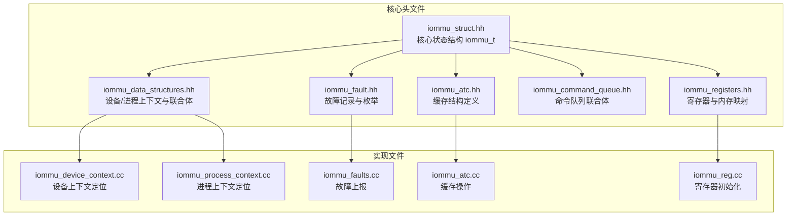
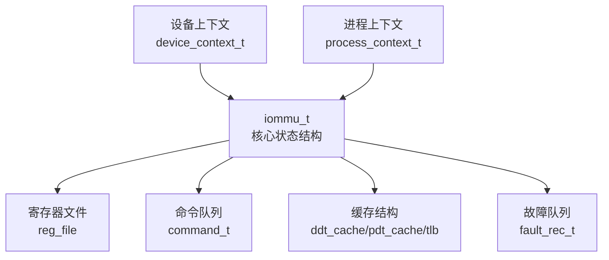
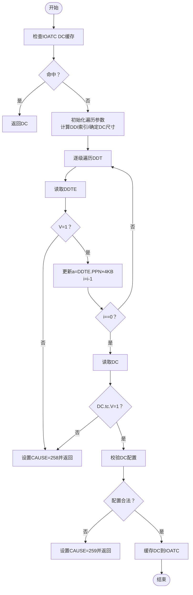
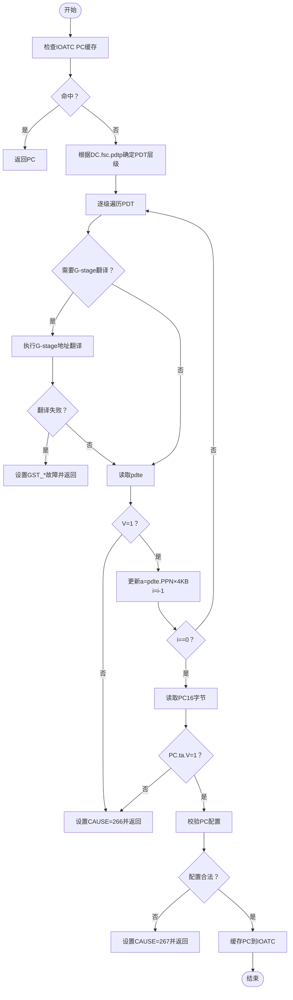
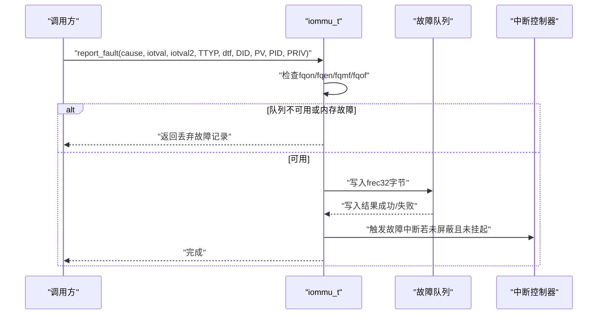
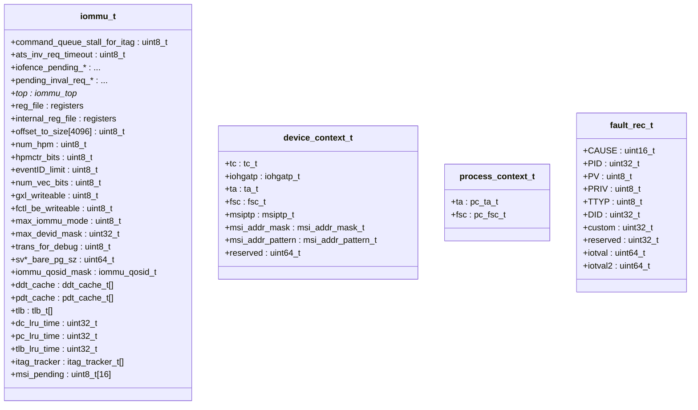
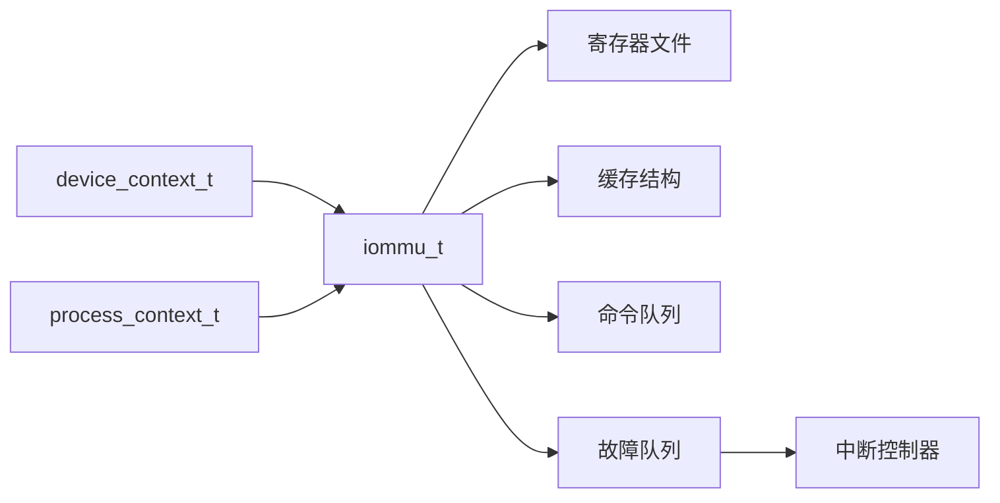

# 核心数据结构

<cite>
**本文档引用的文件**
- [iommu_struct.hh](file://iommu/iommu_struct.hh)
- [iommu_data_structures.hh](file://iommu/iommu_data_structures.hh)
- [iommu_device_context.cc](file://iommu/iommu_device_context.cc)
- [iommu_process_context.cc](file://iommu/iommu_process_context.cc)
- [iommu_fault.hh](file://iommu/iommu_fault.hh)
- [iommu_faults.cc](file://iommu/iommu_faults.cc)
- [iommu_command_queue.hh](file://iommu/iommu_command_queue.hh)
- [iommu_registers.hh](file://iommu/iommu_registers.hh)
- [iommu_atc.hh](file://iommu/iommu_atc.hh)
- [iommu_atc.cc](file://iommu/iommu_atc.cc)
- [iommu_reg.cc](file://iommu/iommu_reg.cc)
</cite>

## 目录
1. [简介](#简介)
2. [项目结构](#项目结构)
3. [核心组件](#核心组件)
4. [架构总览](#架构总览)
5. [详细组件分析](#详细组件分析)
6. [依赖关系分析](#依赖关系分析)
7. [性能考量](#性能考量)
8. [故障排查指南](#故障排查指南)
9. [结论](#结论)
10. [附录](#附录)

## 简介
本文件聚焦于IOMMU模型中的核心数据结构API文档，系统性阐述以下关键结构体的字段语义、数据类型、用途与内存布局，并给出初始化、访问与使用建议：
- iommu_t：IOMMU核心状态结构，涵盖命令队列状态、寄存器文件、缓存结构与全局参数
- device_context_t：设备上下文信息结构，涵盖设备ID映射、权限控制与上下文状态管理
- process_context_t：进程上下文信息结构，涵盖进程ID、访问权限与内存管理
- fault_rec_t：故障记录结构，涵盖故障类型、时间戳与错误详情

同时，结合源码路径定位，提供流程图与序列图以帮助理解工作流与交互。

## 项目结构
该IOMMU实现采用模块化组织，核心数据结构定义位于头文件中，业务逻辑（如设备/进程上下文查找、故障上报、命令队列处理）分布在对应源文件中；寄存器定义与内存映射在独立头文件中。

**图表来源**
- [iommu_struct.hh:42-99](file://iommu/iommu_struct.hh#L42-L99)
- [iommu_data_structures.hh:324-412](file://iommu/iommu_data_structures.hh#L324-L412)
- [iommu_registers.hh:777-800](file://iommu/iommu_registers.hh#L777-L800)
- [iommu_fault.hh:63-89](file://iommu/iommu_fault.hh#L63-L89)
- [iommu_command_queue.hh:38-121](file://iommu/iommu_command_queue.hh#L38-L121)
- [iommu_atc.hh:9-64](file://iommu/iommu_atc.hh#L9-L64)

**章节来源**
- [iommu_struct.hh:42-99](file://iommu/iommu_struct.hh#L42-L99)
- [iommu_data_structures.hh:324-412](file://iommu/iommu_data_structures.hh#L324-L412)
- [iommu_registers.hh:777-800](file://iommu/iommu_registers.hh#L777-L800)

## 核心组件

### iommu_t：IOMMU核心状态结构
- 职责：承载IOMMU运行时状态，包括命令队列控制位、待处理失效请求、指向SystemC顶层模块指针、寄存器文件、寄存器偏移到大小映射表、全局参数以及缓存结构等。
- 关键字段说明（节选）
  - 命令队列与失效控制
    - command_queue_stall_for_itag：命令队列因ITAG阻塞标志
    - ats_inv_req_timeout：ATS失效请求超时标志
    - iofence_pending_*：IOFENCE挂起状态（PR/PW/AV/WSI位与地址、数据）
    - pending_inval_req_*：待处理失效请求（DSV/DSEG/RID/PV/PID/Payload）
  - 寄存器文件与全局参数
    - reg_file：公共寄存器集合（capabilities/fctl/ddtp/cqb/cqh/cqt/fqb/fqh/fqt/pqb/pqh/pqt等）
    - internal_reg_file：内部寄存器集合
    - offset_to_size[4096]：4KB页内寄存器偏移到大小映射
    - num_hpm/hpmctr_bits/eventID_limit/num_vec_bits/gxl_writeable/fctl_be_writeable/max_iommu_mode/max_devid_mask/trans_for_debug/sv* bare页大小掩码、QoS ID掩码等
  - 缓存结构
    - ddt_cache/pdt_cache/tlb：设备目录缓存、进程目录缓存、IOATC TLB
    - itag_tracker：ITAG追踪器数组
    - msi_pending：MSI挂起向量
    - lru计数器：dc_lru_time/pc_lru_time/tlb_lru_time
  - 其他
    - top：指向SystemC顶层模块的指针

- 初始化与内存布局
  - 初始化：通过寄存器初始化函数设置offset_to_size映射、清空寄存器区、写入capabilities/fctl默认值、设置ddtp.iommu_mode复位值等
  - 内存布局：结构体紧凑布局，包含定长数组与固定大小的缓存结构，便于按页对齐访问

- 使用建议
  - 在系统启动阶段调用寄存器初始化函数完成基础配置
  - 访问寄存器前检查offset_to_size映射，确保对齐访问
  - 合理利用缓存结构减少DDT/PDT遍历开销

**章节来源**
- [iommu_struct.hh:42-99](file://iommu/iommu_struct.hh#L42-L99)
- [iommu_reg.cc:958-1057](file://iommu/iommu_reg.cc#L958-L1057)

### device_context_t：设备上下文信息结构
- 定义：描述单个设备的地址翻译与保护上下文，支持基础格式（32字节）与扩展格式（64字节）
- 字段组成
  - tc：翻译控制（tc_t），含V/EN_ATS/EN_PRI/T2GPA/DTF/PDTV/PRPR/GADE/SADE/DPE/SBE/SXL/custom等位
  - iohgatp：G-stage根页表指针与虚拟机软上下文ID（GSCID），含PPN/MODE
  - ta：翻译属性（ta_t），含PSCID/rcid/mcid等
  - fsc：一阶段上下文（fsc_t），含iosatp或pdtp（当PDTV为0/1时）
  - 扩展字段（仅扩展格式）
    - msiptp：MSI页表指针（含MODE/PPN）
    - msi_addr_mask/msi_addr_pattern：MSI地址掩码与模式
    - reserved：保留字段

- 设备上下文定位流程
  - 根据capabilities.MSI_FLAT选择DC尺寸（32/64字节）
  - 按DDT层级（1/2/3级）分解device_id得到DDI索引
  - 逐级读取DDTE，若非叶子则更新a=DDTE.PPN×4KB；到达叶层后读取DC并校验有效性
  - 校验DC配置合法性（do_device_context_configuration_checks）

- 权限与状态管理
  - V位决定DC是否有效
  - EN_ATS/EN_PRI/PRPR/T2GPA等位控制ATS/PRI/返回GPA等能力
  - PDTV决定fsc是pdtp还是iosatp
  - SBE/SXL/GXL等位影响端序与地址转换方案

- 初始化与使用建议
  - 在添加设备时先构建DC，再写入DDT叶节点
  - 写入后立即读回验证，避免脏读
  - 配置MSI相关字段需满足iohgatp.MODE约束

**章节来源**
- [iommu_data_structures.hh:324-335](file://iommu/iommu_data_structures.hh#L324-L335)
- [iommu_device_context.cc:9-229](file://iommu/iommu_device_context.cc#L9-L229)

### process_context_t：进程上下文信息结构
- 定义：描述特定进程ID对应的地址翻译与保护上下文，长度为16字节
- 字段组成
  - ta：进程上下文翻译属性（pc_ta_t），含V/ENS/SUM/PSCID等
  - fsc：进程一阶段上下文（pc_fsc_t），含iosatp（VS-stage根页表指针与MODE）

- 进程上下文定位流程
  - 从DC.fsc.pdtp获取PDT根PPN，按PD20/PD17/PD8层级分解process_id得到PDI索引
  - 若DC.iohgatp.MODE非Bare，需先进行G-stage地址翻译（second_stage_address_translation）
  - 逐级读取pdte，若非叶则更新a=pdte.PPN×4KB；到达叶层后读取PC并校验有效性
  - 校验PC配置合法性（do_process_context_configuration_checks）

- 权限与内存管理
  - ENS/SUM控制监督态访问与U位行为
  - iosatp.MODE与SXL共同决定支持的地址转换方案
  - 端序由DC.tc.SBE决定

- 初始化与使用建议
  - 在添加进程上下文前，确保PDT各级页表存在且有效
  - 写入PC后可缓存至IOATC，后续命中可直接返回

**章节来源**
- [iommu_data_structures.hh:409-412](file://iommu/iommu_data_structures.hh#L409-L412)
- [iommu_process_context.cc:11-196](file://iommu/iommu_process_context.cc#L11-L196)

### fault_rec_t：故障记录结构
- 定义：用于故障队列的32字节记录，描述一次故障事件
- 字段组成（位宽）
  - CAUSE（12）：故障原因编码
  - PID（20）：进程ID（当PV=1时有效）
  - PV（1）：PID有效标志
  - PRIV（1）：特权级别（监督态标志）
  - TTYP（6）：事务类型
  - DID（24）：设备ID
  - custom/reserved（各32位）：自定义与保留字段
  - iotval（64）：iotval寄存器值
  - iotval2（64）：iotval2寄存器值

- 故障上报流程
  - 检查fqon/fqen与fqmf/fqof状态
  - 若启用DTF且某些故障不报告，则跳过
  - 将frec写入fqb基址+索引×32字节，更新fqt
  - 触发中断（若未屏蔽且未挂起）

- 故障类型与事务类型
  - 事务类型TTYP涵盖未翻译/已翻译读写执行、PCIe ATS请求、消息请求等
  - 故障原因CAUSE覆盖访问故障、页面故障、数据损坏、队列溢出/内存故障等

**章节来源**
- [iommu_fault.hh:63-89](file://iommu/iommu_fault.hh#L63-L89)
- [iommu_faults.cc:8-159](file://iommu/iommu_faults.cc#L8-L159)

## 架构总览
下图展示IOMMU核心状态结构与关键子系统的交互关系，包括寄存器文件、缓存、命令队列与故障上报。

**图表来源**
- [iommu_struct.hh:42-99](file://iommu/iommu_struct.hh#L42-L99)
- [iommu_command_queue.hh:38-121](file://iommu/iommu_command_queue.hh#L38-L121)
- [iommu_fault.hh:63-89](file://iommu/iommu_fault.hh#L63-L89)
- [iommu_atc.hh:37-64](file://iommu/iommu_atc.hh#L37-L64)

## 详细组件分析

### iommu_t：字段与初始化
- 字段分类
  - 命令队列与失效控制：command_queue_stall_for_itag、ats_inv_req_timeout、iofence_pending_*、pending_inval_req_*
  - 寄存器文件：reg_file/internal_reg_file、offset_to_size映射
  - 全局参数：num_hpm/hpmctr_bits/eventID_limit/num_vec_bits/gxl_writeable/fctl_be_writeable/max_iommu_mode/max_devid_mask/trans_for_debug/sv*掩码、iommu_qosid_mask
  - 缓存结构：ddt_cache/pdt_cache/tlb、itag_tracker、msi_pending、lru计数器
  - 其他：top指针

- 初始化流程
  - 设置全局参数（事件ID上限、向量位数、HPM计数器位宽、最大IOMMU模式、最大设备ID掩码、是否填充ATS转换到IOATC）
  - 清空寄存器区，写入capabilities与fctl默认值
  - 设置ddtp.iommu_mode复位值（Off/Bare）
  - 初始化offset_to_size映射表，建立寄存器偏移到大小的对应关系

- 最佳实践
  - 在系统上电后立即调用初始化函数，确保寄存器映射正确
  - 对齐访问寄存器，避免越界或跨页访问导致未定义行为

**章节来源**
- [iommu_struct.hh:42-99](file://iommu/iommu_struct.hh#L42-L99)
- [iommu_reg.cc:958-1057](file://iommu/iommu_reg.cc#L958-L1057)

### 设备上下文定位流程（locate_device_context）

**图表来源**
- [iommu_device_context.cc:9-229](file://iommu/iommu_device_context.cc#L9-L229)

**章节来源**
- [iommu_device_context.cc:9-229](file://iommu/iommu_device_context.cc#L9-L229)

### 进程上下文定位流程（locate_process_context）

**图表来源**
- [iommu_process_context.cc:11-196](file://iommu/iommu_process_context.cc#L11-L196)

**章节来源**
- [iommu_process_context.cc:11-196](file://iommu/iommu_process_context.cc#L11-L196)

### 故障上报序列（report_fault）

**图表来源**
- [iommu_faults.cc:8-159](file://iommu/iommu_faults.cc#L8-L159)
- [iommu_fault.hh:63-89](file://iommu/iommu_fault.hh#L63-L89)

**章节来源**
- [iommu_faults.cc:8-159](file://iommu/iommu_faults.cc#L8-L159)
- [iommu_fault.hh:63-89](file://iommu/iommu_fault.hh#L63-L89)

### 类型与字段关系图（核心联合体与结构）

**图表来源**
- [iommu_struct.hh:42-99](file://iommu/iommu_struct.hh#L42-L99)
- [iommu_data_structures.hh:324-412](file://iommu/iommu_data_structures.hh#L324-L412)
- [iommu_fault.hh:63-89](file://iommu/iommu_fault.hh#L63-L89)

**章节来源**
- [iommu_struct.hh:42-99](file://iommu/iommu_struct.hh#L42-L99)
- [iommu_data_structures.hh:324-412](file://iommu/iommu_data_structures.hh#L324-L412)
- [iommu_fault.hh:63-89](file://iommu/iommu_fault.hh#L63-L89)

## 依赖关系分析
- 组件耦合
  - iommu_t聚合寄存器文件、缓存结构与命令队列接口
  - 设备/进程上下文定位依赖寄存器文件中的capabilities/ddtp/iohgatp等
  - 故障上报依赖寄存器文件中的fqb/fqh/fqt/fqcsr及中断机制
- 外部依赖
  - SystemC顶层模块指针top用于桥接仿真环境
  - 读写内存接口（read_memory/write_memory）用于访问DDT/PDT/DC/PC/FQ等内存结构

**图表来源**
- [iommu_struct.hh:42-99](file://iommu/iommu_struct.hh#L42-L99)
- [iommu_registers.hh:777-800](file://iommu/iommu_registers.hh#L777-800)
- [iommu_faults.cc:8-159](file://iommu/iommu_faults.cc#L8-L159)

**章节来源**
- [iommu_struct.hh:42-99](file://iommu/iommu_struct.hh#L42-L99)
- [iommu_registers.hh:777-800](file://iommu/iommu_registers.hh#L777-800)
- [iommu_faults.cc:8-159](file://iommu/iommu_faults.cc#L8-L159)

## 性能考量
- 缓存优化
  - IOATC DC/PC缓存可显著降低DDT/PDT遍历次数，建议在高频访问场景启用
  - TLB缓存可加速已翻译的IOVA到PPN映射
- 命令队列
  - 合理设置命令队列容量与对齐要求，避免频繁内存访问
  - 使用cqcsr.cqon与busy位监控队列状态，避免在队列关闭或忙时提交命令
- 故障队列
  - 控制fqon/fqen/fie/fqmf/fqof状态，避免故障风暴导致队列溢出
  - DTF位可用于抑制部分翻译过程故障的上报，降低中断频率

[本节为通用指导，无需具体文件引用]

## 故障排查指南
- 常见故障原因与定位
  - DDT/PDT条目无效（CAUSE=258/266）：检查DDTE/pdte.V位与索引分解是否正确
  - DDT/PDT配置错误（CAUSE=259/267）：核对MODE/端序/SXL等字段与能力位一致性
  - 访问故障（CAUSE=257/265/访问故障）：检查物理地址对齐与PMA/PMP限制
  - 数据损坏（CAUSE=268/269/274）：启用RAS检测，检查内存一致性与总线完整性
  - 队列溢出/内存故障（CAUSE=fqof/fqmf）：检查FQ配置与内存访问
- 调试建议
  - 启用DEBUG宏输出（如DEBUG_TRANSLATION/DEBUG_TWOSTAGE），观察遍历步骤与中间状态
  - 使用tr_req_*寄存器进行调试翻译请求，验证IOVA到PPN映射

**章节来源**
- [iommu_device_context.cc:231-418](file://iommu/iommu_device_context.cc#L231-L418)
- [iommu_process_context.cc:198-235](file://iommu/iommu_process_context.cc#L198-L235)
- [iommu_faults.cc:8-159](file://iommu/iommu_faults.cc#L8-L159)

## 结论
本文档系统梳理了IOMMU核心数据结构的字段语义、初始化流程、访问接口与内存布局，并结合源码路径提供了关键流程的可视化说明。通过合理配置寄存器、利用缓存与命令队列、规范故障上报，可在保证功能正确性的前提下提升系统性能与可维护性。

[本节为总结性内容，无需具体文件引用]

## 附录

### 字段访问接口与使用示例（路径指引）
- 初始化与寄存器映射
  - [寄存器初始化与映射:958-1057](file://iommu/iommu_reg.cc#L958-L1057)
- 设备上下文定位
  - [locate_device_context:9-229](file://iommu/iommu_device_context.cc#L9-L229)
  - [do_device_context_configuration_checks:231-418](file://iommu/iommu_device_context.cc#L231-L418)
- 进程上下文定位
  - [locate_process_context:11-196](file://iommu/iommu_process_context.cc#L11-L196)
  - [do_process_context_configuration_checks:198-235](file://iommu/iommu_process_context.cc#L198-L235)
- 故障上报
  - [report_fault:8-159](file://iommu/iommu_faults.cc#L8-L159)
- 缓存操作
  - [IOATC DC/PC缓存与查找:7-94](file://iommu/iommu_atc.cc#L7-L94)
  - [TLB缓存:95-103](file://iommu/iommu_atc.cc#L95-L103)

**章节来源**
- [iommu_reg.cc:958-1057](file://iommu/iommu_reg.cc#L958-L1057)
- [iommu_device_context.cc:9-229](file://iommu/iommu_device_context.cc#L9-L229)
- [iommu_process_context.cc:11-196](file://iommu/iommu_process_context.cc#L11-L196)
- [iommu_faults.cc:8-159](file://iommu/iommu_faults.cc#L8-L159)
- [iommu_atc.cc:7-94](file://iommu/iommu_atc.cc#L7-L94)
- [iommu_atc.cc:95-103](file://iommu/iommu_atc.cc#L95-L103)