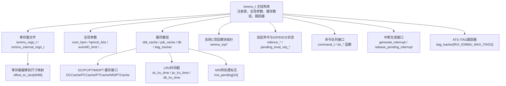
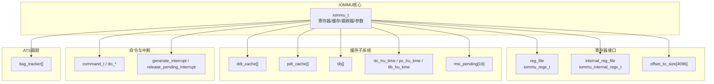
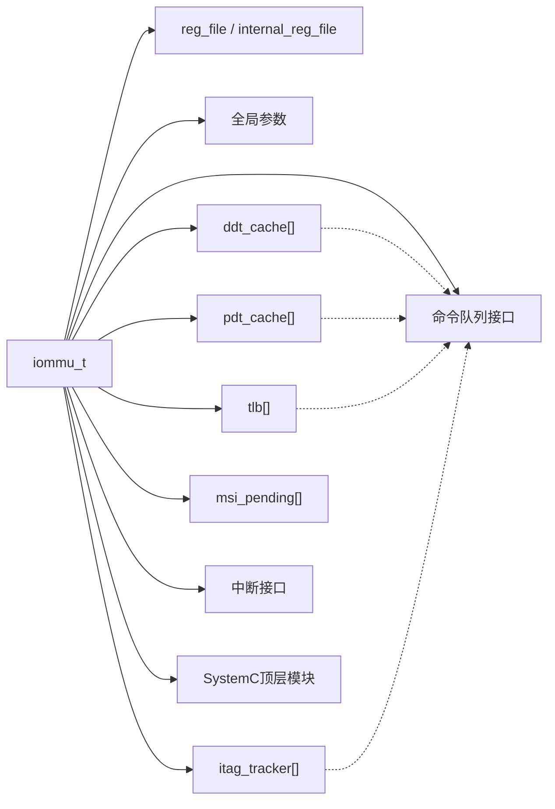

# 核心数据结构

<cite>
**本文引用的文件**
- [iommu_struct.hh](file://iommu/include/iommu_struct.hh)
- [iommu_data_structures.hh](file://iommu/include/iommu_data_structures.hh)
- [iommu_registers.hh](file://iommu/include/iommu_registers.hh)
- [types.h](file://iommu/cache_src/common/types.h)
- [dc_cache.h](file://iommu/cache_src/cache/dc_cache.h)
- [pc_cache.h](file://iommu/cache_src/cache/pc_cache.h)
- [pt_cache.h](file://iommu/cache_src/cache/pt_cache.h)
- [msipt_cache.h](file://iommu/cache_src/cache/msipt_cache.h)
- [json_config.h](file://iommu/cache_src/common/json_config.h)
- [iommu_command_queue.hh](file://iommu/include/iommu_command_queue.hh)
- [iommu_interrupt.hh](file://iommu/include/iommu_interrupt.hh)
- [iommu_ats.cc](file://iommu/iommu_fun_model/iommu_ats.cc)
- [iommu_perf_params.hh](file://iommu/iommu_perf_model/iommu_perf_params.hh)
- [iommu_perf_params_t2.hh](file://iommu/iommu_perf_model/iommu_perf_params_t2.hh)
</cite>

## 目录
1. [简介](#简介)
2. [项目结构](#项目结构)
3. [核心组件](#核心组件)
4. [架构总览](#架构总览)
5. [详细组件分析](#详细组件分析)
6. [依赖分析](#依赖分析)
7. [性能考量](#性能考量)
8. [故障排查指南](#故障排查指南)
9. [结论](#结论)
10. [附录](#附录)

## 简介
本文件面向IOMMU核心数据结构iommu_t，提供系统化、可操作的API文档与设计说明。内容覆盖主结构体字段、寄存器文件、缓存数组、跟踪器、枚举与联合体、常量定义、初始化与内存布局、字段关系与依赖、使用示例与最佳实践。目标是帮助开发者快速理解并正确使用IOMMU核心状态与数据组织。

## 项目结构
围绕iommu_t主结构体，IOMMU相关代码按“寄存器接口”“数据结构与枚举”“缓存子系统”“命令队列与中断”“ATS与ITAG跟踪器”等模块组织。下图给出与本API文档直接相关的模块关系映射。

图表来源
- [iommu_struct.hh:42-99](file://iommu/include/iommu_struct.hh#L42-L99)
- [iommu_registers.hh:827-828](file://iommu/include/iommu_registers.hh#L827-L828)
- [types.h:8-38](file://iommu/cache_src/common/types.h#L8-L38)
- [dc_cache.h:8-31](file://iommu/cache_src/cache/dc_cache.h#L8-L31)
- [pc_cache.h:8-33](file://iommu/cache_src/cache/pc_cache.h#L8-L33)
- [pt_cache.h:8-80](file://iommu/cache_src/cache/pt_cache.h#L8-L80)
- [msipt_cache.h:8-27](file://iommu/cache_src/cache/msipt_cache.h#L8-L27)
- [iommu_command_queue.hh:38-109](file://iommu/include/iommu_command_queue.hh#L38-L109)
- [iommu_interrupt.hh:23-24](file://iommu/include/iommu_interrupt.hh#L23-L24)
- [iommu_ats.cc:7-33](file://iommu/iommu_fun_model/iommu_ats.cc#L7-L33)

章节来源
- [iommu_struct.hh:42-99](file://iommu/include/iommu_struct.hh#L42-L99)
- [iommu_registers.hh:827-828](file://iommu/include/iommu_registers.hh#L827-L828)

## 核心组件
本节聚焦iommu_t主结构体及其直接关联的寄存器、缓存与跟踪器。字段按功能域分组说明，并标注数据类型、取值范围与使用约束。

- 寄存器文件与内部寄存器
  - reg_file: iommu_regs_t
    - 类型: 结构体（寄存器集合）
    - 用途: 存放IOMMU标准寄存器视图（能力、控制、队列基址、状态等）
    - 约束: 通过寄存器偏移访问，遵循对齐规则；部分字段可写/只读由寄存器定义决定
  - internal_reg_file: iommu_internal_regs_t
    - 类型: 结构体（内部寄存器）
    - 用途: 保存IOMMU内部状态或调试/仿真专用寄存器
  - offset_to_size[4096]: uint8_t
    - 类型: 数组
    - 用途: 将寄存器偏移映射到访问尺寸（字节数），用于访问一致性与边界检查
    - 约束: 仅在寄存器访问路径中使用，避免跨寄存器越界

- 全局参数
  - num_hpm: uint8（硬件性能监控计数器数量）
  - hpmctr_bits: uint8（HPM计数器位宽）
  - eventID_limit: uint8（事件选择上限）
  - num_vec_bits: uint8（中断向量宽度）
  - gxl_writeable: uint8（fctl.gxl可写性）
  - fctl_be_writeable: uint8（fctl.end可写性）
  - max_iommu_mode: uint8（支持的最大IOMMU模式编码）
  - fill_ats_trans_in_ioatc: uint8（是否在IOATC中填充ATS转换）
  - max_devid_mask: uint32（最大设备ID掩码）
  - trans_for_debug: uint8（调试用的翻译请求使能）
  - sv57_bare_sv32x4_bare_pg_sz...: uint64[]（不同页/模式下的裸页大小）
  - iommu_qosid_mask: iommu_qosid_t（QoS ID掩码）

- 缓存数组
  - ddt_cache[RVI_IOMMU_DDT_CACHE_SIZE]: ddt_cache_t[]
    - 类型: 数组（设备目录缓存项）
    - 用途: 缓存设备上下文（DC）相关元数据
  - pdt_cache[RVI_IOMMU_PDT_CACHE_SIZE]: pdt_cache_t[]
    - 类型: 数组（进程目录缓存项）
    - 用途: 缓存进程上下文（PC）相关元数据
  - tlb[RVI_IOMMU_TLB_SIZE]: tlb_t[]
    - 类型: 数组（TLB条目）
    - 用途: 缓存页表转换结果（G-stage/Virt-stage）
  - dc_lru_time / pc_lru_time / tlb_lru_time: uint32
    - 类型: 时间戳
    - 用途: LRU替换策略的时间基准

- ITAG跟踪器与挂起命令
  - itag_tracker[RVI_IOMMU_MAX_ITAGS]: itag_tracker_t[]
    - 类型: 数组（ATS ITAG跟踪）
    - 用途: 追踪未完成的ATS失效请求，管理等待响应计数与参数
  - msi_pending[16]: uint8
    - 类型: 数组（MSI待处理位图）
    - 用途: 标记特定向量的MSI待处理状态
  - iofence_* 与 pending_inval_req_*: 挂起的IOFENCE与失效命令状态
    - 用途: 记录当前挂起的IOFENCE与失效请求，确保顺序与一致性

- 指针与系统C集成
  - top: iommu_top*
    - 类型: 指针
    - 用途: 指向SystemC顶层模块，便于仿真/验证环境交互

章节来源
- [iommu_struct.hh:42-99](file://iommu/include/iommu_struct.hh#L42-L99)
- [types.h:8-38](file://iommu/cache_src/common/types.h#L8-L38)

## 架构总览
下图展示iommu_t与寄存器、缓存、命令队列、中断、ATS跟踪器之间的交互关系。

图表来源
- [iommu_struct.hh:42-99](file://iommu/include/iommu_struct.hh#L42-L99)
- [iommu_command_queue.hh:38-109](file://iommu/include/iommu_command_queue.hh#L38-L109)
- [iommu_interrupt.hh:23-24](file://iommu/include/iommu_interrupt.hh#L23-L24)
- [types.h:8-38](file://iommu/cache_src/common/types.h#L8-L38)

## 详细组件分析

### 寄存器文件与全局参数
- 寄存器文件
  - reg_file: iommu_regs_t
    - 作用: 提供IOMMU标准寄存器视图，包括能力、功能控制、队列基址与状态等
    - 访问: 通过寄存器偏移与size映射进行访问，遵循对齐与越界约束
  - internal_reg_file: iommu_internal_regs_t
    - 作用: 内部状态/调试寄存器，非标准寄存器接口的一部分
- 全局参数
  - 用途: 控制IOMMU行为（如HPM计数器、端序、模式支持、页大小等）
  - 影响: 在初始化阶段设定，运行期通常只读或受控写入

章节来源
- [iommu_registers.hh:827-828](file://iommu/include/iommu_registers.hh#L827-L828)
- [iommu_struct.hh:66-88](file://iommu/include/iommu_struct.hh#L66-L88)

### 缓存数组与数据结构
- 设备上下文缓存（DC）
  - ddt_cache[]: ddt_cache_t[]
    - 接口: DCCache类封装查找/填充/失效
    - 关键方法: lookup_dc / fill_dc / invalidate_ddt / invalidate_global
- 进程上下文缓存（PC）
  - pdt_cache[]: pdt_cache_t[]
    - 接口: PCCache类封装查找/填充/失效
    - 关键方法: lookup_pc / fill_pc / invalidate_pdt / invalidate_global
- 页表缓存（PT）
  - tlb[]: tlb_t[]
    - 作用: 缓存页表转换结果，包含权限、GSCID/PSCID、页大小、PPN等
    - 接口: PTCache类封装查找/填充/失效与占位CL管理
- MSI页表缓存（MSIPT）
  - 接口: MSIPTCache类封装查找/填充/失效
- LRU时间戳
  - 作用: 替换策略的时间基准，避免竞态与回绕问题
- MSI待处理位图
  - 作用: 标记MSI向量的待处理状态，配合中断生成

章节来源
- [dc_cache.h:8-31](file://iommu/cache_src/cache/dc_cache.h#L8-L31)
- [pc_cache.h:8-33](file://iommu/cache_src/cache/pc_cache.h#L8-L33)
- [pt_cache.h:8-80](file://iommu/cache_src/cache/pt_cache.h#L8-L80)
- [msipt_cache.h:8-27](file://iommu/cache_src/cache/msipt_cache.h#L8-L27)
- [types.h:242-264](file://iommu/cache_src/common/types.h#L242-L264)

### ATS ITAG跟踪器
- itag_tracker[]
  - 作用: 追踪未完成的ATS失效请求，记录DSV/DSEG/RID/响应计数等
  - 生命周期: 分配（allocate_itag）、查询（any_ats_invalidation_requests_pending）、收尾（do_pending_iofence）
  - 约束: 最大ITAG数由宏RVI_IOMMU_MAX_ITAGS限定

章节来源
- [iommu_ats.cc:7-33](file://iommu/iommu_fun_model/iommu_ats.cc#L7-L33)
- [iommu_struct.hh:97-98](file://iommu/include/iommu_struct.hh#L97-L98)

### 命令队列与中断
- 命令格式
  - command_t: 联合体，包含iotinval/iofence/iodir/ats等命令字段
  - 用途: 命令队列条目，描述失效、IOFENCE、目录写入、ATS消息等
- 处理函数
  - do_inval_ddt / do_inval_pdt / do_iotinval_vma / do_iotinval_gvma / do_ats_msg / do_iofence_c
  - 用途: 解析并执行命令，更新挂起状态与跟踪器
- 中断
  - generate_interrupt / release_pending_interrupt
  - 用途: 生成/释放中断，通知软件处理结果

章节来源
- [iommu_command_queue.hh:38-109](file://iommu/include/iommu_command_queue.hh#L38-L109)
- [iommu_command_queue.hh:113-123](file://iommu/include/iommu_command_queue.hh#L113-L123)
- [iommu_interrupt.hh:23-24](file://iommu/include/iommu_interrupt.hh#L23-L24)

### 数据结构与枚举（联合体、常量、类型）
- 联合体与结构体
  - tc_t / iohgatp_t / ta_t / iosatp_t / fsc_t / msiptp_t / msi_addr_mask_t / msi_addr_pattern_t
  - device_context_t / process_context_t / tlb_t / pt_cache_data_t / MSIPTData
- 常量与模式
  - IOHGATP/IOSATP/IOSATP模式常量（Bare/Sv32/Sv39/Sv48/Sv57/Sv32x4/Sv39x4/Sv48x4/Sv57x4）
  - MSI页表模式（Off/Flat）
  - 设备上下文大小（基础/扩展）
- 类型别名
  - device_id_t / process_id_t / gscid_t / pscid_t / iova_t / spa_t / ppn_t
  - TransStage / CacheMsgType / WalkerUpdateKind / InvalidCmdType / CacheInvalidateMode

章节来源
- [iommu_data_structures.hh:29-130](file://iommu/include/iommu_data_structures.hh#L29-L130)
- [iommu_data_structures.hh:139-200](file://iommu/include/iommu_data_structures.hh#L139-L200)
- [iommu_data_structures.hh:159-185](file://iommu/include/iommu_data_structures.hh#L159-L185)
- [iommu_data_structures.hh:187-200](file://iommu/include/iommu_data_structures.hh#L187-L200)
- [iommu_data_structures.hh:206-258](file://iommu/include/iommu_data_structures.hh#L206-L258)
- [iommu_data_structures.hh:261-282](file://iommu/include/iommu_data_structures.hh#L261-L282)
- [iommu_data_structures.hh:289-335](file://iommu/include/iommu_data_structures.hh#L289-L335)
- [types.h:20-38](file://iommu/cache_src/common/types.h#L20-L38)
- [types.h:64-69](file://iommu/cache_src/common/types.h#L64-L69)
- [types.h:78-99](file://iommu/cache_src/common/types.h#L78-L99)
- [types.h:119-125](file://iommu/cache_src/common/types.h#L119-L125)
- [types.h:127-131](file://iommu/cache_src/common/types.h#L127-L131)

### 初始化与内存布局
- 初始化要点
  - 寄存器文件: 通过寄存器写入初始化ddtp/cqb/fqb/pqb等，设置cqcsr/fqcsr/pqcsr状态
  - 缓存数组: 通过fill_*接口写入初始DC/PC/PT/MSIPT数据
  - 全局参数: 依据能力寄存器与平台配置设置num_hpm/hpmctr_bits/eventID_limit等
  - ITAG跟踪器: allocate_itag分配ITAG，记录DSV/DSEG/RID
  - 挂起命令: do_iofence_c/do_iotinval_*设置挂起状态，等待完成
- 内存布局
  - iommu_t集中存放寄存器视图、全局参数、缓存数组、跟踪器与指针
  - offset_to_size[4096]用于寄存器访问一致性校验
  - 缓存数组采用固定大小数组，配合LRU时间戳进行替换

章节来源
- [iommu_struct.hh:42-99](file://iommu/include/iommu_struct.hh#L42-L99)
- [iommu_command_queue.hh:113-123](file://iommu/include/iommu_command_queue.hh#L113-L123)
- [types.h:54-62](file://iommu/cache_src/common/types.h#L54-L62)

### 字段关系与依赖
- 寄存器与缓存
  - reg_file中的ddtp/cqb/fqb/pqb等决定缓存数组的根页与容量
  - offset_to_size用于访问合法性检查
- 缓存与跟踪器
  - ddt_cache/pdt_cache/tlb与itag_tracker共同支撑翻译流程
  - msi_pending与中断生成接口协同
- 命令与状态
  - iofence_*与pending_inval_req_*用于保证命令顺序与一致性
  - do_pending_iofence在无ITAG占用时继续处理挂起的IOFENCE

章节来源
- [iommu_struct.hh:42-99](file://iommu/include/iommu_struct.hh#L42-L99)
- [iommu_command_queue.hh:38-109](file://iommu/include/iommu_command_queue.hh#L38-L109)
- [iommu_ats.cc:34-46](file://iommu/iommu_fun_model/iommu_ats.cc#L34-L46)

### 使用示例与最佳实践
- 示例场景
  - 初始化IOMMU：写入ddtp/cqb/fqb/pqb，设置cqcsr/fqcsr/pqcsr，准备队列
  - 配置DC/PC：通过fill_dc/fill_pc写入初始上下文，随后通过lookup_dc/lookup_pc加速
  - 发送IOFENCE：调用do_iofence_c，设置挂起状态，等待完成
  - ATS失效：调用do_ats_msg，分配ITAG，等待响应
- 最佳实践
  - 严格遵守寄存器对齐与越界约束，使用offset_to_size进行访问校验
  - 在多级目录/页表场景下，优先利用DC/PC/PT缓存减少内存访问
  - ATS失效与IOFENCE需考虑挂起状态，避免并发冲突
  - MSI待处理位图与中断向量协同，确保中断有序释放

章节来源
- [iommu_command_queue.hh:113-123](file://iommu/include/iommu_command_queue.hh#L113-L123)
- [iommu_ats.cc:7-33](file://iommu/iommu_fun_model/iommu_ats.cc#L7-L33)
- [iommu_interrupt.hh:23-24](file://iommu/include/iommu_interrupt.hh#L23-L24)

## 依赖分析
- 组件耦合
  - iommu_t强依赖寄存器文件与全局参数，弱依赖SystemC顶层模块指针
  - 缓存数组相互独立，但共享LRU时间戳；与命令队列/中断存在间接依赖
  - ATS跟踪器与命令队列紧密耦合，用于保证失效顺序
- 外部依赖
  - SystemC模块（iommu_top*）
  - JSON配置（load_config/parse_config）用于缓存参数注入

图表来源
- [iommu_struct.hh:42-99](file://iommu/include/iommu_struct.hh#L42-L99)
- [json_config.h:9-14](file://iommu/cache_src/common/json_config.h#L9-L14)

章节来源
- [iommu_struct.hh:42-99](file://iommu/include/iommu_struct.hh#L42-L99)
- [json_config.h:9-14](file://iommu/cache_src/common/json_config.h#L9-L14)

## 性能考量
- 缓存参数
  - 缓存配置（num_sets/num_ways/replacement/srrip_m_bits等）通过GlobalConfig注入
  - 不同缓存（DC/PC/PT/MSIPT/Walker）具有独立配置与延迟参数
- 性能建模参数
  - 处理延迟（Parser/Collector/DC/PC/PT/MSIPT/XDTW/PTW/MSIPTW）
  - Walker/PTW/Collector Outstanding限制
  - VA去重与预取深度（PT_CACHE_VA_DEDUP_ENABLED/PT_DEDUP_PREFETCH_DEPTH）

章节来源
- [types.h:584-623](file://iommu/cache_src/common/types.h#L584-L623)
- [iommu_perf_params.hh:118-136](file://iommu/iommu_perf_model/iommu_perf_params.hh#L118-L136)
- [iommu_perf_params_t2.hh:100-119](file://iommu/iommu_perf_model/iommu_perf_params_t2.hh#L100-L119)

## 故障排查指南
- 命令队列错误
  - cqcsr/fqcsr/pqcsr中的错误位（如cmd_ill/cmd_to/cqmf/fqmf/pqmf等）指示命令执行异常
  - 处理：清除对应错误位并重试；必要时禁用/重启队列
- ATS失效未完成
  - any_ats_invalidation_requests_pending为真，表示仍有ITAG忙
  - 处理：等待响应或超时处理，再继续IOFENCE
- MSI中断未释放
  - msi_pending与中断向量状态不一致
  - 处理：确认release_pending_interrupt调用时机

章节来源
- [iommu_command_queue.hh:547-564](file://iommu/include/iommu_command_queue.hh#L547-L564)
- [iommu_ats.cc:27-33](file://iommu/iommu_fun_model/iommu_ats.cc#L27-L33)
- [iommu_interrupt.hh:23-24](file://iommu/include/iommu_interrupt.hh#L23-L24)

## 结论
iommu_t作为IOMMU的核心状态容器，整合了寄存器视图、全局参数、缓存数组、跟踪器与系统C集成点。通过明确字段职责、访问约束与依赖关系，并结合命令队列、中断与ATS跟踪器，可实现高效、可靠、可维护的IOMMU功能。建议在初始化阶段严格校验寄存器与缓存配置，在运行期关注命令顺序与状态一致性，并利用性能建模参数指导缓存与流水线优化。

## 附录
- 关键枚举与常量
  - 模式常量：IOHGATP_Bare/Sv32x4/Sv39x4/Sv48x4/Sv57x4；IOSATP_Bare/Sv32/Sv39/Sv48/Sv57；PDTP_Bare/PD8/PD17/PD20；MSIPTP_Off/Flat
  - 命令类型：IOTINVAL/IOFENCE/IODIR/ATS；VMA/GVMA；INVAL_DDT/INVAL_PDT；IOFENCE_C；INVAL/PRGR
  - 中断源：COMMAND_QUEUE/FAULT_QUEUE/HPM/PAGE_QUEUE；MSI向量掩码位
- 关键类型别名
  - device_id_t/process_id_t/gscid_t/pscid_t/iova_t/spa_t/ppn_t
  - TransStage/CacheMsgType/WalkerUpdateKind/InvalidCmdType/CacheInvalidateMode

章节来源
- [iommu_data_structures.hh:141-148](file://iommu/include/iommu_data_structures.hh#L141-L148)
- [iommu_data_structures.hh:187-191](file://iommu/include/iommu_data_structures.hh#L187-L191)
- [iommu_data_structures.hh:202-255](file://iommu/include/iommu_data_structures.hh#L202-L255)
- [iommu_data_structures.hh:280-282](file://iommu/include/iommu_data_structures.hh#L280-L282)
- [iommu_command_queue.hh:23-37](file://iommu/include/iommu_command_queue.hh#L23-L37)
- [iommu_interrupt.hh:16-21](file://iommu/include/iommu_interrupt.hh#L16-L21)
- [types.h:20-26](file://iommu/cache_src/common/types.h#L20-L26)