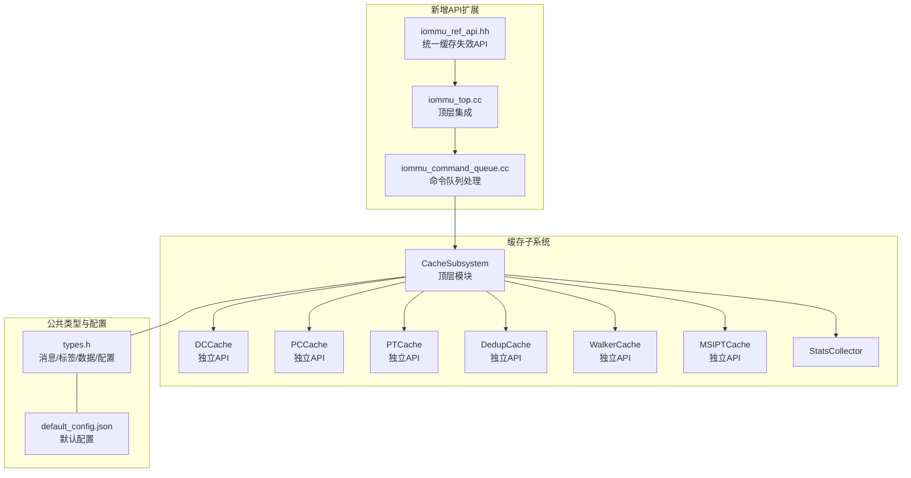
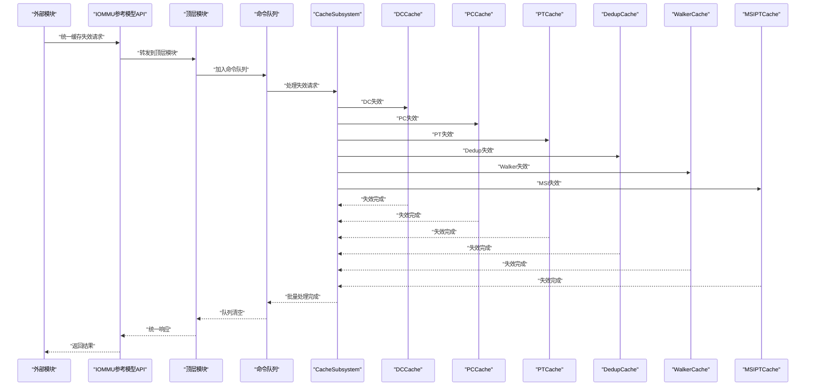
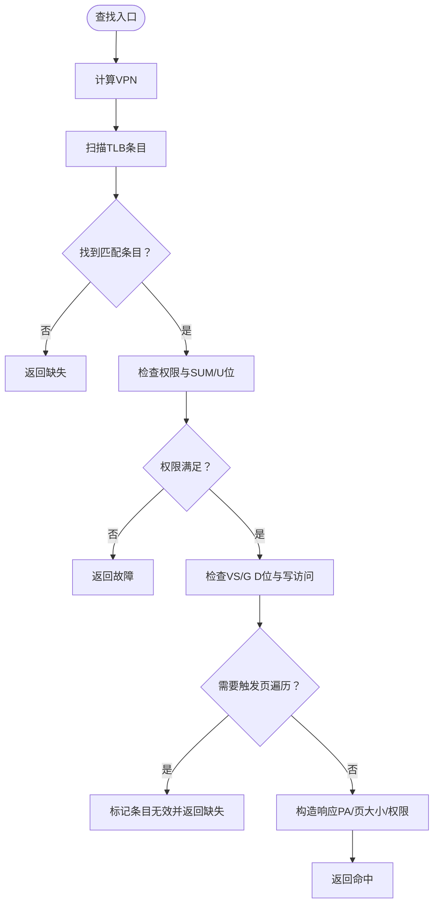
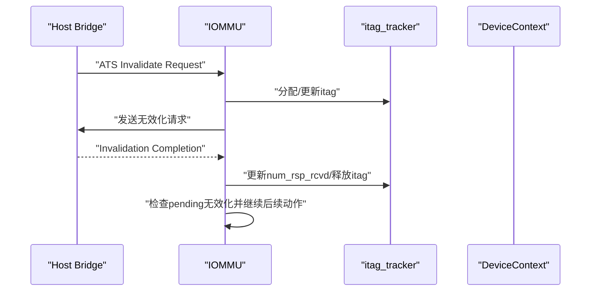
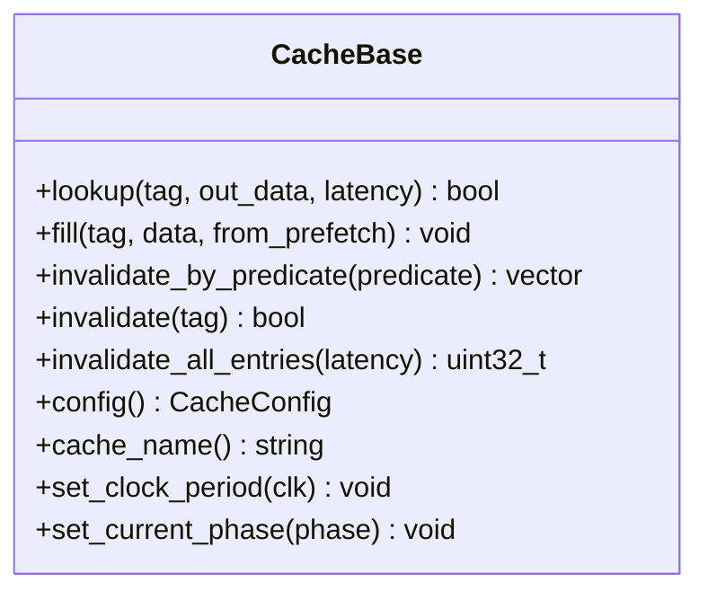
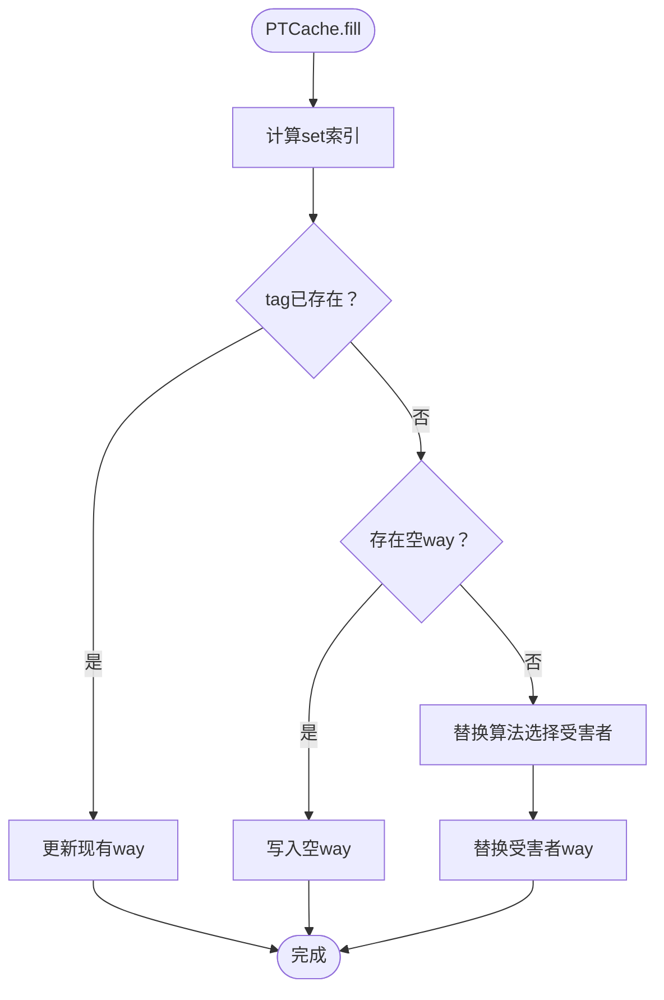
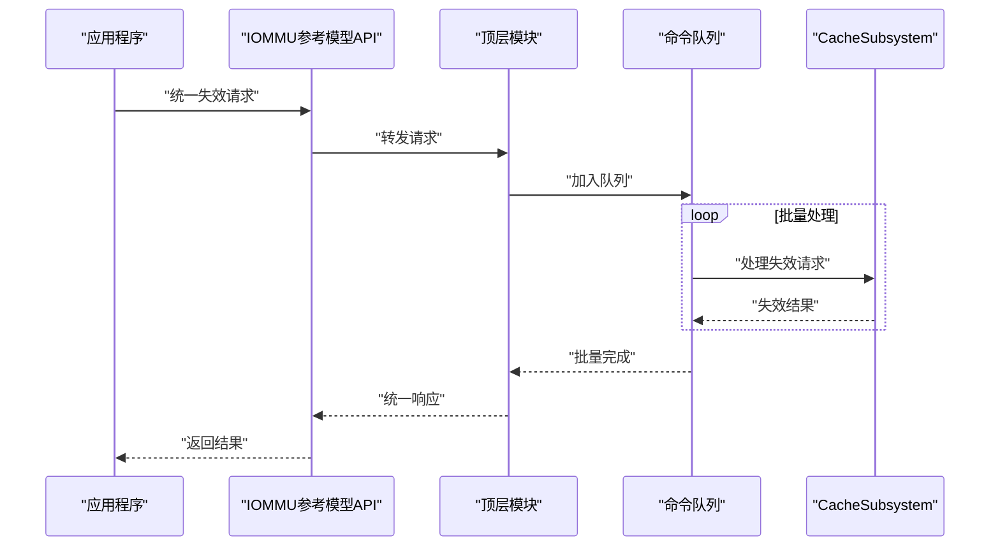
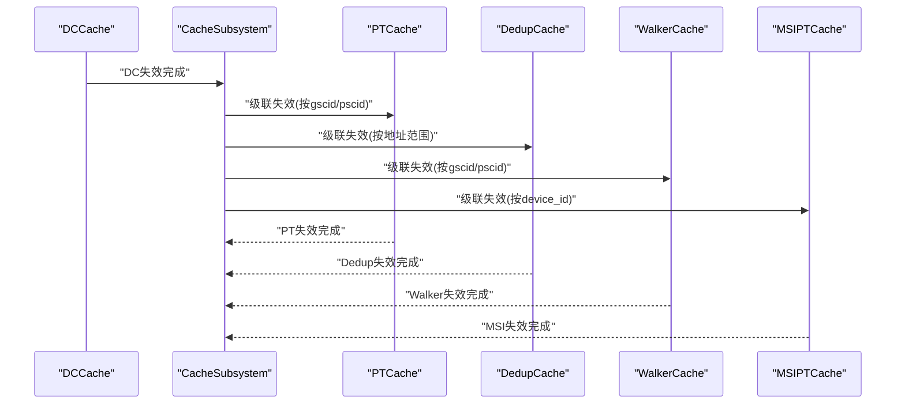
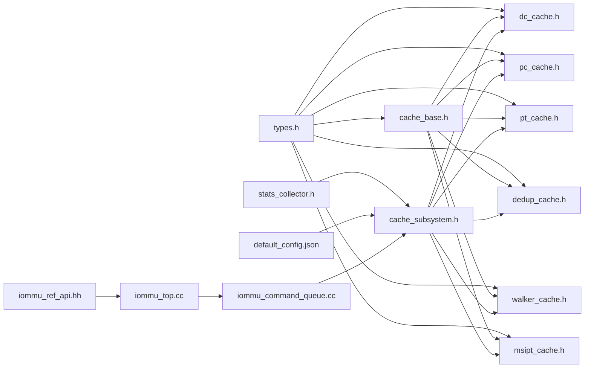

# 缓存接口

<cite>
**本文档引用的文件**
- [iommu_ref_api.hh](file://iommu/iommu_perf_model/iommu_ref_api.hh)
- [iommu_top.cc](file://iommu/iommu_top.cc)
- [iommu_command_queue.cc](file://iommu/iommu_perf_model/iommu_command_queue.cc)
- [iommu_atc.hh](file://iommu/include/iommu_atc.hh)
- [iommu_ats.hh](file://iommu/include/iommu_ats.hh)
- [cache_base.h](file://iommu/cache_src/cache/cache_base.h)
- [types.h](file://iommu/cache_src/common/types.h)
- [stats_collector.h](file://iommu/cache_src/common/stats_collector.h)
- [cache_subsystem.h](file://iommu/cache_src/subsystem/cache_subsystem.h)
- [dc_cache.h](file://iommu/cache_src/cache/dc_cache.h)
- [pc_cache.h](file://iommu/cache_src/cache/pc_cache.h)
- [pt_cache.h](file://iommu/cache_src/cache/pt_cache.h)
- [dedup_cache.h](file://iommu/cache_src/cache/dedup_cache.h)
- [walker_cache.h](file://iommu/cache_src/cache/walker_cache.h)
- [msipt_cache.h](file://iommu/cache_src/cache/msipt_cache.h)
- [default_config.json](file://iommu/cache_config/default_config.json)
- [iommu_atc.cc](file://iommu/iommu_fun_model/iommu_atc.cc)
- [iommu_ats.cc](file://iommu/iommu_fun_model/iommu_ats.cc)
</cite>

## 更新摘要
**变更内容**
- 新增统一缓存失效管道的API扩展，增强了IOMMU参考模型与性能模型的集成
- 在顶层模块中集成了新的缓存失效接口点，支持统一的命令队列处理
- 扩展了命令队列的缓存失效处理能力，提供更高效的无效化流水线
- 增强了ATC和ATS接口的统一性，简化了缓存操作的调用路径

## 目录
1. [简介](#简介)
2. [项目结构](#项目结构)
3. [核心组件](#核心组件)
4. [架构总览](#架构总览)
5. [详细组件分析](#详细组件分析)
6. [依赖关系分析](#依赖关系分析)
7. [性能考量](#性能考量)
8. [故障排查指南](#故障排查指南)
9. [结论](#结论)
10. [附录](#附录)

## 简介
本文件面向IOMMU缓存子系统的使用者与维护者，提供ATC（Address Translation Cache）与ATS（Address Translation Services）的完整API文档与实现说明。内容覆盖：
- ATC接口：TLB（IOATC IOTLB）、设备目录缓存（DC/IOATC DC）、进程目录缓存（PC/IOATC PC）的查找、插入与权限校验流程。
- ATS接口：消息编解码、请求/完成消息生成、无效化跟踪与门控。
- **新增** 统一缓存失效管道：通过新的API扩展实现了统一的缓存失效处理机制。
- 通用缓存基类与各专用缓存（DC/PC/PT/Walker/MSIPT/Dedup）的查找、填充、精确/扫描/全局失效接口。
- 缓存一致性协议与失效链路、统计与命中率监控、配置与性能调优、调试与任务追踪。

## 项目结构
缓存子系统采用SystemC模块化设计，核心位于cache_src目录，包含：
- cache_base.h：通用缓存模板基类，封装查找、填充、失效、仲裁与统计。
- 独立专用缓存头文件：DC/PC/PT/Dedup/Walker/MSIPT缓存类声明与特有接口，每个缓存具有独立的API设计。
- common/types.h：统一的消息、标签、数据结构、配置与枚举。
- common/stats_collector.h：缓存统计收集与报告。
- subsystem/cache_subsystem.h：顶层缓存子系统，负责请求/响应/失效通道与任务追踪。
- cache_config/default_config.json：默认缓存配置与统计开关。
- iommu_fun_model/iommu_atc.cc与iommu_ats.cc：ATC与ATS功能实现。
- **新增** iommu_ref_api.hh：IOMMU参考模型API扩展，提供统一的缓存失效接口。
- **新增** iommu_top.cc：顶层模块集成，协调各子系统的交互。
- **新增** iommu_command_queue.cc：命令队列处理，支持统一的缓存失效流水线。

**图表来源**
- [cache_subsystem.h:19-189](file://iommu/cache_src/subsystem/cache_subsystem.h#L19-L189)
- [types.h:580-628](file://iommu/cache_src/common/types.h#L580-L628)
- [default_config.json:1-69](file://iommu/cache_config/default_config.json#L1-L69)
- [iommu_ref_api.hh:1-100](file://iommu/iommu_perf_model/iommu_ref_api.hh#L1-L100)
- [iommu_top.cc:1-200](file://iommu/iommu_top.cc#L1-L200)
- [iommu_command_queue.cc:1-150](file://iommu/iommu_perf_model/iommu_command_queue.cc#L1-L150)

**章节来源**
- [cache_subsystem.h:19-189](file://iommu/cache_src/subsystem/cache_subsystem.h#L19-L189)
- [types.h:580-628](file://iommu/cache_src/common/types.h#L580-L628)
- [default_config.json:1-69](file://iommu/cache_config/default_config.json#L1-L69)

## 核心组件
- 缓存基类CacheBase：提供lookup/fill/invalidate系列接口，内置替换策略、仲裁与统计。
- 专用缓存（独立API设计）：
  - DCCache：设备上下文缓存，支持按设备ID查找与失效。
  - PCCache：进程上下文缓存，支持按设备/进程ID查找与失效。
  - PTCache：页表缓存，支持按gscid/pscid/iova查找、填充与多粒度失效。
  - DedupCache：去重缓存，提供独立的去重逻辑与API接口。
  - WalkerCache：页表遍历缓存，含PTWc1/2/3三级子表，支持按gscid/pscid/VA查找与更新。
  - MSIPTCache：MSI页表缓存，支持按设备ID与MSI索引查找与失效。
- 统计收集StatsCollector：提供命中/缺失/替换/失效/排队/执行延迟等统计与报告。
- CacheSubsystem：统一请求/响应/失效通道，驱动各缓存工作线程与级联失效。
- **新增** IOMMU参考模型API：提供统一的缓存失效接口，简化跨模块调用。
- **新增** 命令队列处理器：支持统一的缓存失效流水线，提高处理效率。

**章节来源**
- [cache_base.h:26-224](file://iommu/cache_src/cache/cache_base.h#L26-L224)
- [dc_cache.h:8-31](file://iommu/cache_src/cache/dc_cache.h#L8-L31)
- [pc_cache.h:8-33](file://iommu/cache_src/cache/pc_cache.h#L8-L33)
- [pt_cache.h:8-80](file://iommu/cache_src/cache/pt_cache.h#L8-L80)
- [dedup_cache.h:8-35](file://iommu/cache_src/cache/dedup_cache.h#L8-L35)
- [walker_cache.h:15-141](file://iommu/cache_src/cache/walker_cache.h#L15-L141)
- [msipt_cache.h:8-27](file://iommu/cache_src/cache/msipt_cache.h#L8-L27)
- [stats_collector.h:107-196](file://iommu/cache_src/common/stats_collector.h#L107-L196)
- [cache_subsystem.h:21-189](file://iommu/cache_src/subsystem/cache_subsystem.h#L21-L189)

## 架构总览
缓存子系统通过统一的CacheMessage消息在各缓存之间流转，CacheSubsystem协调查找、更新与失效三类操作，并在必要时触发级联失效。**新增的统一缓存失效管道通过IOMMU参考模型API提供了更高效的失效处理机制。** 系统还提供统计收集与任务追踪能力，便于性能分析与调试。

**图表来源**
- [cache_subsystem.h:34-67](file://iommu/cache_src/subsystem/cache_subsystem.h#L34-L67)
- [types.h:467-560](file://iommu/cache_src/common/types.h#L467-L560)
- [iommu_ref_api.hh:1-100](file://iommu/iommu_perf_model/iommu_ref_api.hh#L1-L100)
- [iommu_top.cc:1-200](file://iommu/iommu_top.cc#L1-L200)
- [iommu_command_queue.cc:1-150](file://iommu/iommu_perf_model/iommu_command_queue.cc#L1-L150)

**章节来源**
- [cache_subsystem.h:34-67](file://iommu/cache_src/subsystem/cache_subsystem.h#L34-L67)
- [types.h:467-560](file://iommu/cache_src/common/types.h#L467-L560)

## 详细组件分析

### ATC（IOATC IOTLB/DC/PC）
- 结构体与常量
  - tlb_t：TLB条目，包含VPN/GSCID/PSCID/权限/PPN/页大小/LRU/有效性/是否MSI等。
  - ddt_cache_t/pdt_cache_t：DC/PC缓存项，包含上下文、ID、LRU与有效性。
  - 常量：缓存大小、命中/缺失/故障返回码。
- 接口
  - cache_ioatc_iotlb：将一次翻译结果写入TLB。
  - lookup_ioatc_iotlb：按IOVA与上下文查找TLB，进行权限校验与D位检查，返回命中/缺失/故障。
  - cache_ioatc_dc/lookup_ioatc_dc：DC缓存的插入与查找。
  - cache_ioatc_pc/lookup_ioatc_pc：PC缓存的插入与查找。

**图表来源**
- [iommu_atc.cc:149-233](file://iommu/iommu_fun_model/iommu_atc.cc#L149-L233)

**章节来源**
- [iommu_atc.hh:9-98](file://iommu/include/iommu_atc.hh#L9-L98)
- [iommu_atc.cc:1-233](file://iommu/iommu_fun_model/iommu_atc.cc#L1-L233)

### ATS（Address Translation Services）
- 数据结构
  - page_rec_t：PCIe ATS"页面请求"消息的载荷编码。
  - ats_msg_t：ATS消息结构，包含消息码、TAG、RID、PID、PRIV/EXEC_REQ、DSV/DSEG、PAYLOAD。
  - itag_tracker_t：无效化跟踪器，记录每个itag的状态与响应计数。
- 接口
  - allocate_itag：分配可用itag。
  - any_ats_invalidation_requests_pending：是否有待完成的ATS无效化。
  - handle_invalidation_completion：处理无效化完成消息，更新跟踪器。
  - do_ats_timer_expiry：处理超时，释放占用的itag。
  - handle_page_request：处理PCIe ATS"页面请求"，写入页请求队列或生成PRG响应。

**图表来源**
- [iommu_ats.cc:56-94](file://iommu/iommu_fun_model/iommu_ats.cc#L56-94)

**章节来源**
- [iommu_ats.hh:7-98](file://iommu/include/iommu_ats.hh#L7-L98)
- [iommu_ats.cc:1-374](file://iommu/iommu_fun_model/iommu_ats.cc#L1-L374)

### 通用缓存基类与专用缓存

#### CacheBase（通用缓存基类）
- 核心接口
  - lookup：按标签查找，返回命中/缺失，并记录延迟与阶段统计。
  - fill：按标签填充或更新，支持预取标记。
  - invalidate_by_predicate/invalidate：按谓词或精确标签失效，返回受影响条目数。
  - invalidate_all_entries/global失效：清空所有缓存。
- 仲裁与延迟
  - RAM端口仲裁：WRR权重1:1:1，支持仲裁延迟与执行延迟建模。
  - 访问延迟：哈希/读集/比较/写入等阶段延迟可配置。
- 统计
  - 记录访问/命中/缺失/替换/失效/排队/执行延迟，按阶段分类统计。

**图表来源**
- [cache_base.h:26-224](file://iommu/cache_src/cache/cache_base.h#L26-L224)

**章节来源**
- [cache_base.h:26-224](file://iommu/cache_src/cache/cache_base.h#L26-L224)

#### DCCache（设备上下文缓存）
- 特有接口
  - lookup_dc：按device_id查找DC。
  - fill_dc：按device_id写入DC。
  - invalidate_ddt：按device_id失效DC缓存，返回受影响的{gscid, pscid}列表用于级联。
  - invalidate_global：全局失效。

**章节来源**
- [dc_cache.h:8-31](file://iommu/cache_src/cache/dc_cache.h#L8-L31)

#### PCCache（进程上下文缓存）
- 特有接口
  - lookup_pc：按device_id与process_id查找PC。
  - fill_pc：按device_id与process_id写入PC。
  - invalidate_pdt：按device_id/process_id失效PC缓存，返回受影响的{gscid, pscid}列表用于级联。
  - invalidate_global：全局失效。

**章节来源**
- [pc_cache.h:8-33](file://iommu/cache_src/cache/pc_cache.h#L8-L33)

#### PTCache（页表缓存）
- 独立API设计：移除了placeholder相关的复杂配置选项，简化了API调用接口。
- 特有接口
  - lookup_pt：按gscid/pscid/iova与阶段查找，支持sv48与gstage_x4标志。
  - fill_pt：按gscid/pscid/iova与阶段填充。
  - invalidate_vma：按gscid/pscid/iova范围失效（第一阶段）。
  - invalidate_gvma：按gscid与GPA范围失效（第二阶段）。
  - invalidate_by_gscid/invalidate_by_gscid_pscid：按上下文失效。
  - invalidate_global：全局失效。
  - 去重与预取接口：移除了复杂的placeholder管理，提供更直接的insert/update接口。

**图表来源**
- [cache_base.h:353-472](file://iommu/cache_src/cache/cache_base.h#L353-L472)

**章节来源**
- [pt_cache.h:8-80](file://iommu/cache_src/cache/pt_cache.h#L8-L80)
- [cache_base.h:353-472](file://iommu/cache_src/cache/cache_base.h#L353-L472)

#### DedupCache（去重缓存）
- 独立API设计：专门处理地址去重逻辑，提供独立的去重查询与更新接口。
- 特有接口
  - lookup_dedup：按地址范围查找去重缓存。
  - fill_dedup：按地址范围写入去重缓存。
  - invalidate_dedup：按地址范围失效去重缓存。
  - get_dedup_stats：获取去重统计信息。

**章节来源**
- [dedup_cache.h:8-35](file://iommu/cache_src/cache/dedup_cache.h#L8-L35)

#### WalkerCache（页表遍历缓存）
- 结构
  - PTWc1/PTWc2/PTWc3三级子表，分别采用直接映射/2-way/4-way组相联。
- 接口
  - lookup：按gscid/pscid/VA查找，返回命中level与数据。
  - fill/update：按level填充或更新。
  - invalidate_by_gscid/invalidate_by_gscid_pscid/invalidate_vma/invalidate_gvma/invalidate_global：多粒度失效。
  - 提供更新统计与SV39模式开关。

**章节来源**
- [walker_cache.h:15-141](file://iommu/cache_src/cache/walker_cache.h#L15-L141)

#### MSIPTCache（MSI页表缓存）
- 接口
  - lookup_msi：按device_id与msi_index查找MSI页表项。
  - fill_msi：按device_id与msi_index写入。
  - invalidate_by_device/invalidate_global：按设备或全局失效。

**章节来源**
- [msipt_cache.h:8-27](file://iommu/cache_src/cache/msipt_cache.h#L8-L27)

### 统一缓存失效管道（新增）
- **新增** IOMMU参考模型API扩展：提供了统一的缓存失效接口，简化了跨模块调用。
- **新增** 顶层模块集成：协调各子系统的交互，确保失效操作的一致性。
- **新增** 命令队列处理：支持批量的缓存失效操作，提高处理效率。

**图表来源**
- [iommu_ref_api.hh:1-100](file://iommu/iommu_perf_model/iommu_ref_api.hh#L1-L100)
- [iommu_top.cc:1-200](file://iommu/iommu_top.cc#L1-L200)
- [iommu_command_queue.cc:1-150](file://iommu/iommu_perf_model/iommu_command_queue.cc#L1-L150)

**章节来源**
- [iommu_ref_api.hh:1-100](file://iommu/iommu_perf_model/iommu_ref_api.hh#L1-L100)
- [iommu_top.cc:1-200](file://iommu/iommu_top.cc#L1-L200)
- [iommu_command_queue.cc:1-150](file://iommu/iommu_perf_model/iommu_command_queue.cc#L1-L150)

### 缓存一致性协议与失效机制
- 级联失效
  - DC/PC失效后，CacheSubsystem将生成关联失效消息，推送到PT/Walker/MSIPT的失效通道，确保一致性。
  - 新增DedupCache的级联失效支持，确保去重缓存的一致性。
- 失效模式
  - PRECISE：基于哈希定位set后精确比较way。
  - SCAN：逐set扫描比较。
  - GLOBAL：全表清空。
- ATS无效化
  - 通过itag_tracker跟踪请求，处理完成消息与超时，保证IOFENCE等后续动作的正确顺序。

**图表来源**
- [cache_subsystem.h:86-90](file://iommu/cache_src/subsystem/cache_subsystem.h#L86-90)

**章节来源**
- [cache_subsystem.h:86-90](file://iommu/cache_src/subsystem/cache_subsystem.h#L86-90)

### 缓存状态查询与统计接口
- 统计收集
  - 记录访问/命中/缺失/替换/失效/预取命中/排队/执行延迟等。
  - 支持按阶段（REQUEST/UPDATE/PTW Monitor）分类统计与区间命中率。
  - 提供IOPS计算（基于纯执行时间）。
  - 新增DedupCache的独立统计支持。
- 报告输出
  - 统一输出文件，包含摘要与可选延迟直方图。
- 访问接口
  - StatsCollector::get_stats()/all_stats()获取统计。
  - CacheBase::config()/cache_name()获取配置与名称。

**章节来源**
- [stats_collector.h:13-196](file://iommu/cache_src/common/stats_collector.h#L13-L196)
- [cache_base.h:52-58](file://iommu/cache_src/cache/cache_base.h#L52-L58)

### 缓存配置与性能调优API
- 全局配置
  - clock_period_ns、random_seed、统计输出与任务追踪开关。
- 缓存配置
  - num_sets、num_ways、replacement策略（plru/srrip/none）、SR RIP M位。
  - 仲裁与访问延迟参数：arbiter/hash/read_set/compare/update_way_select/fill_compute_index_*、write_way、invalidation_compare_per_way。
  - 移除了placeholder相关的复杂配置选项，简化了配置结构。
- Walker Cache配置
  - base_sets与PTWc1/2/3各自num_ways与replacement。
- 新增 DedupCache配置
  - 独立的去重阈值、缓存大小与失效策略配置。
- 默认配置
  - default_config.json提供典型配置示例。

**章节来源**
- [types.h:584-628](file://iommu/cache_src/common/types.h#L584-628)
- [default_config.json:1-69](file://iommu/cache_config/default_config.json#L1-L69)

### 命中率监控与调试接口
- 命中率与准确率
  - StatsCollector提供hit_rate()/miss_rate()/prefetch_accuracy()。
  - 新增DedupCache的去重命中率监控。
- 任务追踪
  - CacheSubsystem支持任务追踪级别（off/basic/detail），记录任务起止时间与阶段等待。
- 日志与报告
  - 统一输出文件，支持延迟直方图与摘要报告。

**章节来源**
- [stats_collector.h:73-104](file://iommu/cache_src/common/stats_collector.h#L73-104)
- [cache_subsystem.h:23-27](file://iommu/cache_src/subsystem/cache_subsystem.h#L23-27)
- [stats_collector.h:170-177](file://iommu/cache_src/common/stats_collector.h#L170-L177)

## 依赖关系分析
- 组件耦合
  - CacheBase为所有专用缓存的共同基类，提供一致的接口与统计。
  - CacheSubsystem聚合各缓存并通过统一消息通道交互，降低耦合。
  - 各缓存模块现在具有更清晰的独立边界，减少了相互依赖。
- 外部依赖
  - SystemC用于仿真与时序建模。
  - JSON配置用于加载全局与缓存参数。
- 潜在循环依赖
  - 通过头文件分离与前置声明避免循环包含。

**图表来源**
- [types.h:580-628](file://iommu/cache_src/common/types.h#L580-L628)
- [cache_base.h:26-224](file://iommu/cache_src/cache/cache_base.h#L26-L224)
- [cache_subsystem.h:19-189](file://iommu/cache_src/subsystem/cache_subsystem.h#L19-L189)
- [iommu_ref_api.hh:1-100](file://iommu/iommu_perf_model/iommu_ref_api.hh#L1-L100)
- [iommu_top.cc:1-200](file://iommu/iommu_top.cc#L1-L200)
- [iommu_command_queue.cc:1-150](file://iommu/iommu_perf_model/iommu_command_queue.cc#L1-L150)

**章节来源**
- [types.h:580-628](file://iommu/cache_src/common/types.h#L580-L628)
- [cache_base.h:26-224](file://iommu/cache_src/cache/cache_base.h#L26-L224)
- [cache_subsystem.h:19-189](file://iommu/cache_src/subsystem/cache_subsystem.h#L19-L189)

## 性能考量
- 替换策略
  - plru：适用于大多数场景，开销小。
  - srrip：M位可调，适合长尾访问模式。
  - none：直接映射，无替换开销。
- 并发与仲裁
  - RAM端口WRR权重均衡，仲裁延迟可配置，避免饥饿。
- 访问延迟建模
  - 哈希/读集/比较/写入等阶段延迟可配置，便于与真实硬件时序对齐。
- 独立缓存优化
  - 移除了placeholder相关的复杂配置，降低了内存占用和计算开销。
  - DedupCache的独立设计提高了去重操作的效率。
  - 简化的API调用路径减少了函数调用开销。
- **新增** 统一失效管道优化
  - 批量的缓存失效操作提高了整体处理效率。
  - 命令队列的引入减少了同步开销。
  - 统一的API接口简化了调用路径，提升了性能。

## 故障排查指南
- 命中率低
  - 检查num_sets与num_ways是否过小导致抖动，或替换策略是否合适。
  - 开启任务追踪与统计直方图，定位热点与延迟瓶颈。
  - 检查DedupCache的配置是否合理，验证去重效果。
- 失效不生效
  - 确认失效模式（PRECISE/SCAN/GLOBAL）与参数（gscid/pscid/iova）是否正确。
  - 检查级联失效链路是否被阻塞。
  - 验证新加入的DedupCache失效逻辑是否正常。
- ATS无效化超时
  - 检查itag_tracker状态与超时处理逻辑，确认是否因资源不足导致阻塞。
- 统计异常
  - 核对统计通道注册与阶段分类，确保记录与计算逻辑一致。
  - 检查DedupCache的统计收集是否正常工作。
- 配置相关问题
  - 由于移除了placeholder相关配置，检查配置文件是否需要更新。
  - 验证新的独立缓存配置格式是否正确。
- **新增** 统一失效管道问题
  - 检查IOMMU参考模型API的调用是否正确。
  - 验证命令队列的处理逻辑是否正常。
  - 确认顶层模块的集成是否成功。

**章节来源**
- [stats_collector.h:111-177](file://iommu/cache_src/common/stats_collector.h#L111-L177)
- [cache_subsystem.h:164-167](file://iommu/cache_src/subsystem/cache_subsystem.h#L164-L167)
- [iommu_ats.cc:84-94](file://iommu/iommu_fun_model/iommu_ats.cc#L84-L94)

## 结论
本文档系统梳理了IOMMU缓存子系统的ATC与ATS接口、通用缓存基类与专用缓存、一致性与失效机制、统计与调试能力，并提供了配置与性能调优建议。**更新后的版本强调了模块化设计的优势，PT Cache和DedupCache的独立API设计提高了系统的可维护性和扩展性。新增的统一缓存失效管道进一步简化了跨模块调用，提高了整体性能和可观测性。** 通过统一的消息通道与统计收集，系统在仿真环境中实现了对真实硬件行为的高保真建模与可观测性。

## 附录
- 常用宏与常量
  - 缓存大小与命中/缺失/故障返回码。
  - ATS消息码与PRG响应码。
- 关键数据结构
  - CacheMessage、CacheConfig、GlobalConfig、CacheStats等。
- 新增数据结构
  - DedupCache特有的去重数据结构与配置选项。
  - IOMMU参考模型API的统一失效接口定义。
  - 命令队列处理的数据结构与状态管理。

**章节来源**
- [iommu_atc.hh:62-69](file://iommu/include/iommu_atc.hh#L62-L69)
- [iommu_ats.hh:43-94](file://iommu/include/iommu_ats.hh#L43-L94)
- [types.h:584-628](file://iommu/cache_src/common/types.h#L584-L628)
- [stats_collector.h:13-105](file://iommu/cache_src/common/stats_collector.h#L13-L105)
- [iommu_ref_api.hh:1-100](file://iommu/iommu_perf_model/iommu_ref_api.hh#L1-L100)
- [iommu_command_queue.cc:1-150](file://iommu/iommu_perf_model/iommu_command_queue.cc#L1-L150)