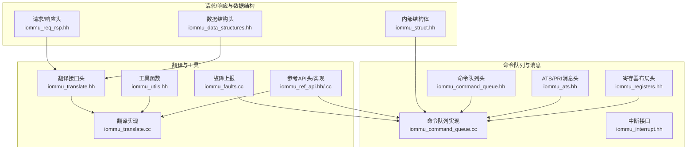
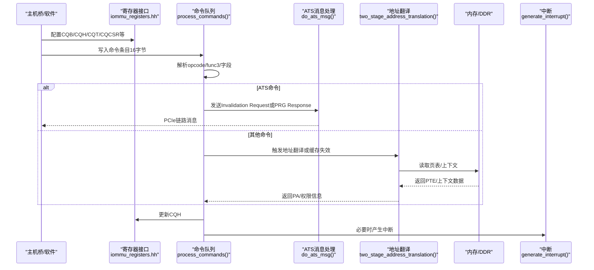
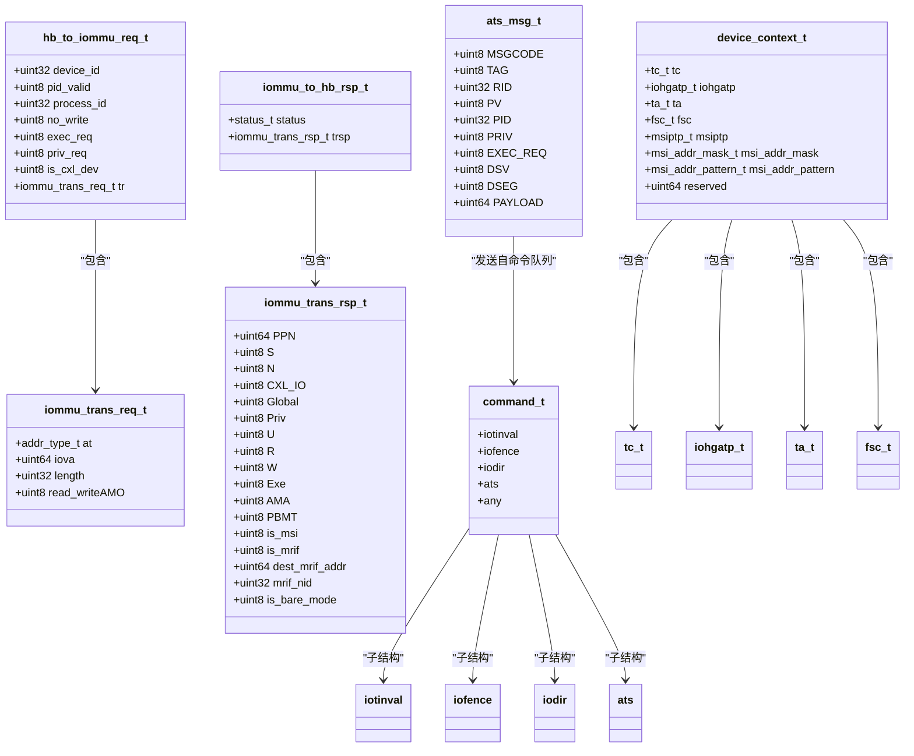

# 请求响应API

<cite>
**本文引用的文件**
- [iommu_req_rsp.hh](file://iommu/iommu_req_rsp.hh)
- [iommu_data_structures.hh](file://iommu/iommu_data_structures.hh)
- [iommu_struct.hh](file://iommu/iommu_struct.hh)
- [iommu_command_queue.hh](file://iommu/iommu_command_queue.hh)
- [iommu_command_queue.cc](file://iommu/iommu_command_queue.cc)
- [iommu_ats.hh](file://iommu/iommu_ats.hh)
- [iommu_atc.hh](file://iommu/iommu_atc.hh)
- [iommu_translate.hh](file://iommu/iommu_translate.hh)
- [iommu_translate.cc](file://iommu/iommu_translate.cc)
- [iommu_interrupt.hh](file://iommu/iommu_interrupt.hh)
- [iommu_registers.hh](file://iommu/iommu_registers.hh)
- [iommu_ref_api.hh](file://iommu/iommu_ref_api.hh)
- [iommu_ref_api.cc](file://iommu/iommu_ref_api.cc)
- [iommu_faults.cc](file://iommu/iommu_faults.cc)
- [iommu_utils.hh](file://iommu/iommu_utils.hh)
</cite>

## 目录
1. [简介](#简介)
2. [项目结构](#项目结构)
3. [核心组件](#核心组件)
4. [架构总览](#架构总览)
5. [详细组件分析](#详细组件分析)
6. [依赖关系分析](#依赖关系分析)
7. [性能考量](#性能考量)
8. [故障排查指南](#故障排查指南)
9. [结论](#结论)
10. [附录](#附录)

## 简介
本文件面向IOMMU模型中的“请求/响应数据结构API”，系统性梳理以下内容：
- 请求消息与响应消息的数据格式、字段定义与序列化方式
- PCIe ATS请求、PCIe PRI请求与IOMMU命令请求的生成与处理流程
- 响应消息的构造与解析机制（成功、错误、状态反馈）
- 字节序、对齐与边界检查策略
- 生命周期管理、超时与重试机制
- 实际消息交换示例与调试方法

## 项目结构
IOMMU相关实现主要集中在iommu目录，围绕“请求/响应数据结构”“命令队列”“地址翻译”“ATS/PRI消息”“中断与寄存器接口”等模块协同工作。

图示来源
- [iommu_req_rsp.hh:1-105](file://iommu/iommu_req_rsp.hh#L1-L105)
- [iommu_data_structures.hh:1-415](file://iommu/iommu_data_structures.hh#L1-L415)
- [iommu_struct.hh:1-102](file://iommu/iommu_struct.hh#L1-L102)
- [iommu_command_queue.hh:1-125](file://iommu/iommu_command_queue.hh#L1-L125)
- [iommu_command_queue.cc:1-676](file://iommu/iommu_command_queue.cc#L1-L676)
- [iommu_ats.hh:1-98](file://iommu/iommu_ats.hh#L1-L98)
- [iommu_interrupt.hh:1-26](file://iommu/iommu_interrupt.hh#L1-L26)
- [iommu_registers.hh:1-987](file://iommu/iommu_registers.hh#L1-L987)
- [iommu_translate.hh:1-132](file://iommu/iommu_translate.hh#L1-L132)
- [iommu_translate.cc:1-732](file://iommu/iommu_translate.cc#L1-L732)
- [iommu_faults.cc:1-160](file://iommu/iommu_faults.cc#L1-L160)
- [iommu_ref_api.hh:1-54](file://iommu/iommu_ref_api.hh#L1-L54)
- [iommu_ref_api.cc:1-282](file://iommu/iommu_ref_api.cc#L1-L282)
- [iommu_utils.hh:1-11](file://iommu/iommu_utils.hh#L1-L11)

章节来源
- [iommu_req_rsp.hh:1-105](file://iommu/iommu_req_rsp.hh#L1-L105)
- [iommu_command_queue.hh:1-125](file://iommu/iommu_command_queue.hh#L1-L125)
- [iommu_command_queue.cc:1-676](file://iommu/iommu_command_queue.cc#L1-L676)
- [iommu_ats.hh:1-98](file://iommu/iommu_ats.hh#L1-L98)
- [iommu_translate.hh:1-132](file://iommu/iommu_translate.hh#L1-L132)
- [iommu_translate.cc:1-732](file://iommu/iommu_translate.cc#L1-L732)
- [iommu_registers.hh:1-987](file://iommu/iommu_registers.hh#L1-L987)
- [iommu_ref_api.hh:1-54](file://iommu/iommu_ref_api.hh#L1-L54)
- [iommu_ref_api.cc:1-282](file://iommu/iommu_ref_api.cc#L1-L282)
- [iommu_faults.cc:1-160](file://iommu/iommu_faults.cc#L1-L160)
- [iommu_utils.hh:1-11](file://iommu/iommu_utils.hh#L1-L11)

## 核心组件
- 请求/响应数据结构
  - 主机桥到IOMMU请求：设备ID、进程ID、访问属性、长度、地址类型与IOVA等
  - IOMMU到主机桥响应：物理页号、权限位、MSI/MRIF标志、目标MRIF地址与NID等
- 设备上下文与进程上下文
  - 设备上下文包含TC、G-stage控制、TA、一阶段上下文（含IOSATP或PDT指针）
  - 进程上下文包含TA与一阶段上下文（IOSATP）
- 命令队列与消息
  - 命令格式（IOTINVAL、IOFENCE、IODIR、ATS等）与字段编码
  - ATS消息（Invalidation Request/Completion、Page Request、PRG Response）
- 地址翻译与缓存
  - 两阶段地址翻译、MSI地址翻译、TLB/DC/PC缓存
- 寄存器与中断
  - 命令队列控制/状态寄存器、故障队列、页面请求队列、功能控制寄存器、中断生成

章节来源
- [iommu_req_rsp.hh:29-102](file://iommu/iommu_req_rsp.hh#L29-L102)
- [iommu_data_structures.hh:324-335](file://iommu/iommu_data_structures.hh#L324-L335)
- [iommu_command_queue.hh:38-109](file://iommu/iommu_command_queue.hh#L38-L109)
- [iommu_ats.hh:47-91](file://iommu/iommu_ats.hh#L47-L91)
- [iommu_translate.hh:95-130](file://iommu/iommu_translate.hh#L95-L130)
- [iommu_registers.hh:455-549](file://iommu/iommu_registers.hh#L455-L549)

## 架构总览
IOMMU通过寄存器接口接收命令与配置，命令队列驱动各类IOMMU操作；地址翻译模块完成从IOVA/GPA到SPA的转换，并维护TLB/DC/PC缓存；ATS子系统负责PCIe ATS/PRI消息的生成与处理；故障队列用于记录与上报异常事件；中断模块在必要时触发中断。

图示来源
- [iommu_command_queue.cc:7-276](file://iommu/iommu_command_queue.cc#L7-L276)
- [iommu_ats.hh:541-573](file://iommu/iommu_ats.hh#L541-L573)
- [iommu_translate.cc:8-200](file://iommu/iommu_translate.cc#L8-L200)
- [iommu_interrupt.hh:23-24](file://iommu/iommu_interrupt.hh#L23-L24)

## 详细组件分析

### 请求消息数据结构与序列化
- 主机桥到IOMMU请求（hb_to_iommu_req_t）
  - 字段：device_id、pid_valid、process_id、no_write、exec_req、priv_req、is_cxl_dev、translation_req（at/iova/length/read_writeAMO）
  - 序列化：按结构体成员顺序打包，无显式对齐注解，遵循编译器默认对齐规则
- 地址类型（addr_type_t）
  - Untranslated、PCIe ATS Translation Request、Translated三种模式
- 读写/AMO标识（RVI_IOMMU_READ/WRITE）

章节来源
- [iommu_req_rsp.hh:36-49](file://iommu/iommu_req_rsp.hh#L36-L49)
- [iommu_req_rsp.hh:13-26](file://iommu/iommu_req_rsp.hh#L13-L26)
- [iommu_req_rsp.hh:27-28](file://iommu/iommu_req_rsp.hh#L27-L28)

### 响应消息数据结构与序列化
- IOMMU到主机桥响应（iommuto_hb_rsp_t）
  - 字段：status（SUCCESS/UNSUPPORTED_REQUEST/COMPLETER_ABORT）、translation_rsp（PPN/S/N/CXL_IO/Global/Priv/U/R/W/Exe/AMA/PBMT/is_msi/is_mrif/dest_mrif_addr/mrif_nid/is_bare_mode）
  - 序列化：按结构体成员顺序打包，无显式对齐注解，遵循编译器默认对齐规则

章节来源
- [iommu_req_rsp.hh:98-102](file://iommu/iommu_req_rsp.hh#L98-L102)
- [iommu_req_rsp.hh:77-96](file://iommu/iommu_req_rsp.hh#L77-L96)

### 设备/进程上下文与页表指针
- 设备上下文（device_context_t）
  - 包含tc、iohgatp、ta、fsc（含iosatp或pdtp），扩展格式还包含msiptp、msi_addr_mask、msi_addr_pattern
- 进程上下文（process_context_t）
  - 包含pc_ta与pc_fsc（iosatp）
- 页表指针（iosatp_t、pdtp_t、msiptp_t）
  - 含MODE与PPN字段，支持多种分页模式

章节来源
- [iommu_data_structures.hh:324-335](file://iommu/iommu_data_structures.hh#L324-L335)
- [iommu_data_structures.hh:193-200](file://iommu/iommu_data_structures.hh#L193-L200)
- [iommu_data_structures.hh:206-258](file://iommu/iommu_data_structures.hh#L206-L258)
- [iommu_data_structures.hh:270-278](file://iommu/iommu_data_structures.hh#L270-L278)

### 命令队列与消息格式
- 命令格式（command_t）
  - IOTINVAL（VMA/GVMA）、IOFENCE（C）、IODIR（INVAL_DDT/INVAL_PDT）、ATS（INVAL/PRGR）
  - 各子结构体字段覆盖功能域、地址、PID、DID、TAG、负载等
- ATS消息（ats_msg_t）
  - MSGCODE、TAG、RID、PV、PID、PRIV、EXEC_REQ、DSV、DSEG、PAYLOAD
- PRG响应状态（PRGR_SUCCESS/INVALID_REQUEST/RESPONSE_FAILURE）

章节来源
- [iommu_command_queue.hh:38-109](file://iommu/iommu_command_queue.hh#L38-L109)
- [iommu_ats.hh:47-91](file://iommu/iommu_ats.hh#L47-L91)
- [iommu_ats.hh:81-83](file://iommu/iommu_ats.hh#L81-L83)

### 地址翻译与缓存
- 两阶段地址翻译（two_stage_address_translation）
  - 输入：IOVA、TTYP、DID、访问类型、PV/PID、PSCID/GSCID、iosatp、iohgatp、SADE/GADE、SXL等
  - 输出：PA、页大小、权限位、是否MSI/MRIF
- 缓存接口（TLB/DC/PC）
  - cache_ioatc_iotlb、lookup_ioatc_iotlb、lookup/ cache_ioatc_dc、lookup/cache_ioatc_pc

章节来源
- [iommu_translate.hh:105-113](file://iommu/iommu_translate.hh#L105-L113)
- [iommu_atc.hh:70-96](file://iommu/iommu_atc.hh#L70-L96)

### 字节序、对齐与边界检查
- 字节序
  - 由fctl.be决定：0为小端，1为大端；命令队列读取时根据fctl.be选择端序
- 对齐与边界
  - 寄存器访问要求地址对齐，越界行为未定义
  - 队列基址与大小满足特定对齐约束（见寄存器描述）
  - 访问队列/页表/上下文时使用物理地址掩码进行边界检查
- 结构体对齐
  - 数据结构未使用显式对齐属性，遵循编译器默认对齐

章节来源
- [iommu_command_queue.cc:20-84](file://iommu/iommu_command_queue.cc#L20-L84)
- [iommu_registers.hh:774-776](file://iommu/iommu_registers.hh#L774-L776)
- [iommu_registers.hh:331-353](file://iommu/iommu_registers.hh#L331-L353)

### 生命周期管理、超时与重试
- 命令队列状态
  - cqen/cqon/cqmf/cmd_ill/cmd_to/fence_w_ip/busy等位控制启用、内存故障、非法命令、超时、完成中断等
- ATS命令与ITAG
  - ATS.INVAL需分配ITAG；若无可用ITAG则阻塞命令队列直至释放或超时
  - ATS定时到期触发超时处理，设置cmd_to并产生中断
- IOFENCE.C
  - 等待所有ATS失效请求完成或超时；若内存写入失败设置cqmf并产生中断
  - 支持全局可观测同步（PR/PW）
- 故障上报
  - 故障队列满/内存访问故障时设置fqof/fqmf并产生中断

章节来源
- [iommu_command_queue.cc:53-64](file://iommu/iommu_command_queue.cc#L53-L64)
- [iommu_command_queue.cc:214-246](file://iommu/iommu_command_queue.cc#L214-L246)
- [iommu_command_queue.cc:574-640](file://iommu/iommu_command_queue.cc#L574-L640)
- [iommu_command_queue.cc:658-675](file://iommu/iommu_command_queue.cc#L658-L675)
- [iommu_faults.cc:23-44](file://iommu/iommu_faults.cc#L23-L44)

### 实际消息交换示例与调试方法
- ATS失效请求（ATS.INVAL）
  - 步骤：命令队列解析命令，分配ITAG，发送Invalidation Request至PCIe设备；等待Invalidate Completion或超时；更新CQH
- PRG响应（ATS.PRGR）
  - 步骤：命令队列解析命令，构造PRG Response消息，通过send_msg_iommu_to_hb发送
- 地址翻译请求
  - 步骤：iommu_translate_iova解析请求类型，定位DC/PC，执行两阶段翻译，填充响应字段，必要时上报故障
- 调试
  - 参考API提供read_memory/write_memory测试封装，便于验证内存访问路径
  - 关键路径打印（DEBUG_*宏）可用于跟踪命令、翻译、ATS、故障等流程

章节来源
- [iommu_command_queue.cc:541-573](file://iommu/iommu_command_queue.cc#L541-L573)
- [iommu_ref_api.cc:48-115](file://iommu/iommu_ref_api.cc#L48-L115)
- [iommu_translate.cc:8-200](file://iommu/iommu_translate.cc#L8-L200)

## 依赖关系分析

图示来源
- [iommu_req_rsp.hh:29-102](file://iommu/iommu_req_rsp.hh#L29-L102)
- [iommu_data_structures.hh:324-335](file://iommu/iommu_data_structures.hh#L324-L335)
- [iommu_command_queue.hh:38-109](file://iommu/iommu_command_queue.hh#L38-L109)
- [iommu_ats.hh:47-58](file://iommu/iommu_ats.hh#L47-L58)

章节来源
- [iommu_req_rsp.hh:29-102](file://iommu/iommu_req_rsp.hh#L29-L102)
- [iommu_data_structures.hh:324-335](file://iommu/iommu_data_structures.hh#L324-L335)
- [iommu_command_queue.hh:38-109](file://iommu/iommu_command_queue.hh#L38-L109)
- [iommu_ats.hh:47-58](file://iommu/iommu_ats.hh#L47-L58)

## 性能考量
- 缓存命中与TLB替换
  - IOATC/TLB/DC/PC缓存减少页表/上下文访问延迟；命令队列提供缓存失效指令以保证一致性
- 命令乱序执行与顺序语义
  - 命令可乱序执行，但IOFENCE.C提供全局顺序保证；PR/PW用于全局可观测同步
- 队列容量与对齐
  - 队列大小与基址对齐影响内存访问效率；建议按寄存器描述对齐

## 故障排查指南
- 命令队列问题
  - cqmf/cmd_ill/cmd_to：检查命令合法性、内存访问、超时；清除对应位并重新启用
- 故障队列问题
  - fqof/fqmf：检查队列满/内存访问故障；清理溢出/内存故障位
- ATS超时
  - 检查设备响应；确认ITAG分配与定时器到期逻辑
- 内存访问
  - 使用参考API的read_memory/write_memory测试封装验证访问路径

章节来源
- [iommu_command_queue.cc:53-64](file://iommu/iommu_command_queue.cc#L53-L64)
- [iommu_faults.cc:23-44](file://iommu/iommu_faults.cc#L23-L44)
- [iommu_ref_api.cc:48-115](file://iommu/iommu_ref_api.cc#L48-L115)

## 结论
本文档系统梳理了IOMMU模型中请求/响应数据结构API，覆盖请求与响应格式、PCIe ATS/PRI消息、IOMMU命令请求、地址翻译、字节序与对齐、生命周期与超时重试、以及调试方法。基于统一的数据结构与严格的寄存器/队列接口，IOMMU实现了可扩展且可调试的请求/响应处理框架。

## 附录
- 常用字段与枚举
  - 地址类型：Untranslated、PCIe ATS Translation Request、Translated
  - 状态：SUCCESS、UNSUPPORTED_REQUEST、COMPLETER_ABORT
  - ATS消息码：Invalidation Request、Invalidation Completion、Page Request、PRG Response
  - 命令类型：IOTINVAL、IOFENCE、IODIR、ATS

章节来源
- [iommu_req_rsp.hh:13-26](file://iommu/iommu_req_rsp.hh#L13-L26)
- [iommu_req_rsp.hh:52-75](file://iommu/iommu_req_rsp.hh#L52-L75)
- [iommu_ats.hh:43-46](file://iommu/iommu_ats.hh#L43-L46)
- [iommu_command_queue.hh:23-38](file://iommu/iommu_command_queue.hh#L23-L38)