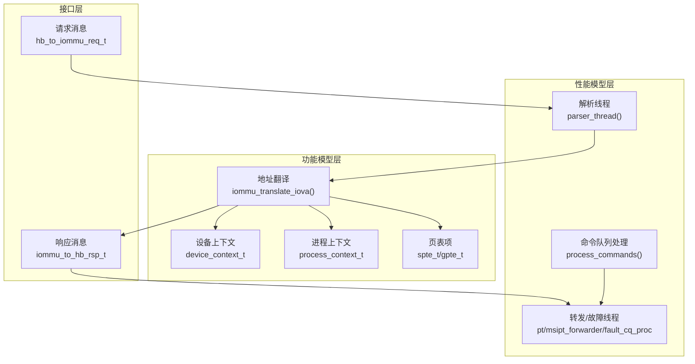
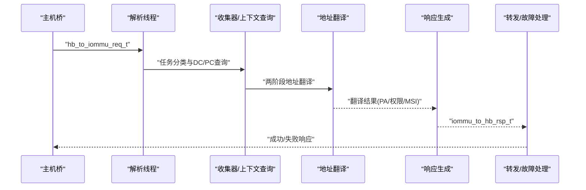
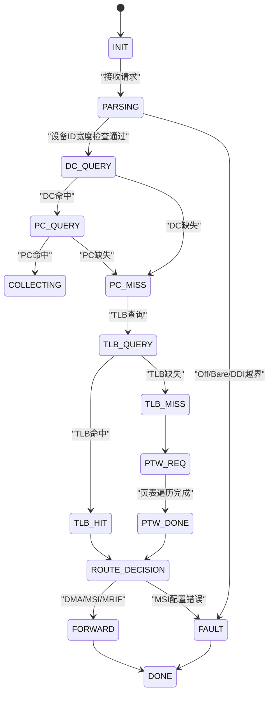
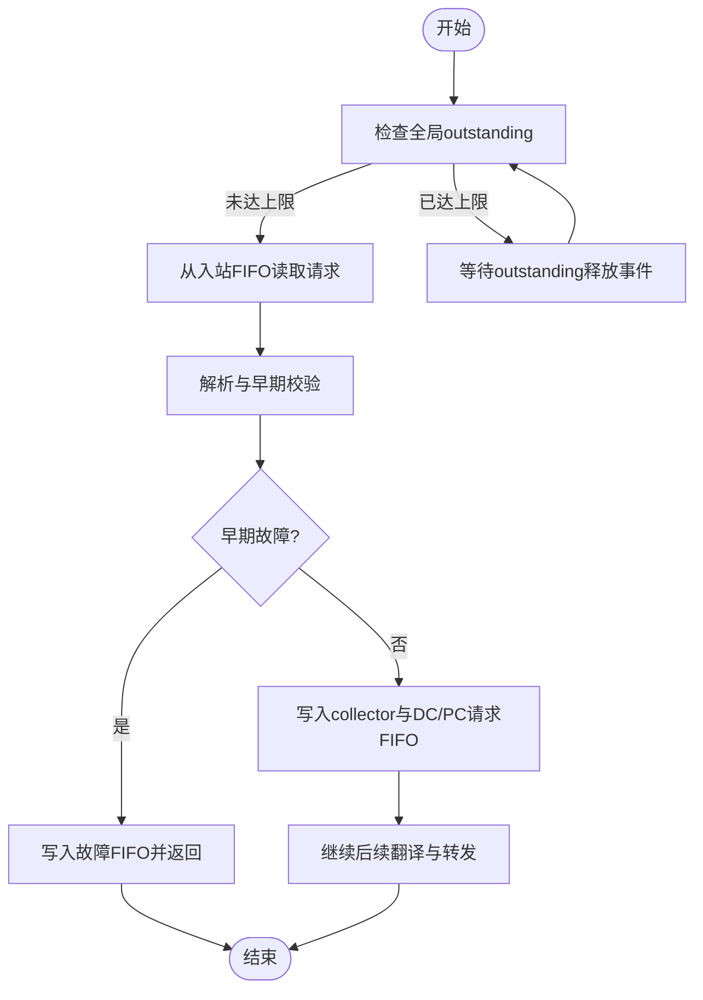
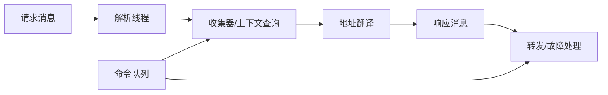

# 请求响应接口

<cite>
**本文引用的文件**
- [iommu_req_rsp.hh](file://iommu/include/iommu_req_rsp.hh)
- [iommu_task.hh](file://iommu/include/iommu_task.hh)
- [iommu_data_structures.hh](file://iommu/include/iommu_data_structures.hh)
- [iommu_struct.hh](file://iommu/include/iommu_struct.hh)
- [iommu_command_queue.hh](file://iommu/include/iommu_command_queue.hh)
- [iommu_command_queue.cc](file://iommu/iommu_perf_model/iommu_command_queue.cc)
- [iommu_translate.cc](file://iommu/iommu_fun_model/iommu_translate.cc)
- [iommu_perf_parser.cc](file://iommu/iommu_perf_model/iommu_perf_parser.cc)
- [iommu_perf_forwarder_fault_cq.cc](file://iommu/iommu_perf_model/iommu_perf_forwarder_fault_cq.cc)
- [iommu_fault.hh](file://iommu/include/iommu_fault.hh)
- [iommu_utils.hh](file://iommu/include/iommu_utils.hh)
- [iommu_utils.cc](file://iommu/iommu_fun_model/iommu_utils.cc)
</cite>

## 目录
1. [简介](#简介)
2. [项目结构](#项目结构)
3. [核心组件](#核心组件)
4. [架构总览](#架构总览)
5. [详细组件分析](#详细组件分析)
6. [依赖关系分析](#依赖关系分析)
7. [性能考量](#性能考量)
8. [故障排查指南](#故障排查指南)
9. [结论](#结论)
10. [附录](#附录)

## 简介
本文件面向IOMMU请求响应接口，提供从请求消息格式、响应消息结构到任务调度机制的完整API文档。内容覆盖请求类型、参数编码、响应格式、生命周期管理、优先级与超时机制、任务队列与调度策略，并给出请求构造、发送与响应处理的参考路径与流程图示。同时，整理了错误码定义与异常处理流程，帮助开发者快速集成与调试。

## 项目结构
IOMMU请求响应接口主要由以下层次构成：
- 接口层：请求/响应数据结构定义（请求消息、响应消息）
- 功能模型层：地址翻译与响应生成（解析、查询、翻译、缓存、回填）
- 性能模型层：任务解析、转发、故障与命令队列处理线程
- 数据结构层：设备上下文、进程上下文、页表项等
- 命令队列层：软件命令入队与执行（ATS、FENCE、DIR等）

图表来源
- [iommu_req_rsp.hh:36-103](file://iommu/include/iommu_req_rsp.hh#L36-L103)
- [iommu_translate.cc:8-731](file://iommu/iommu_fun_model/iommu_translate.cc#L8-L731)
- [iommu_perf_parser.cc:9-122](file://iommu/iommu_perf_model/iommu_perf_parser.cc#L9-L122)
- [iommu_perf_forwarder_fault_cq.cc:13-178](file://iommu/iommu_perf_model/iommu_perf_forwarder_fault_cq.cc#L13-L178)
- [iommu_command_queue.cc:7-276](file://iommu/iommu_perf_model/iommu_command_queue.cc#L7-L276)

章节来源
- [iommu_req_rsp.hh:1-106](file://iommu/include/iommu_req_rsp.hh#L1-L106)
- [iommu_translate.cc:8-731](file://iommu/iommu_fun_model/iommu_translate.cc#L8-L731)
- [iommu_perf_parser.cc:9-122](file://iommu/iommu_perf_model/iommu_perf_parser.cc#L9-L122)
- [iommu_perf_forwarder_fault_cq.cc:13-178](file://iommu/iommu_perf_model/iommu_perf_forwarder_fault_cq.cc#L13-L178)
- [iommu_command_queue.cc:7-276](file://iommu/iommu_perf_model/iommu_command_queue.cc#L7-L276)

## 核心组件
- 请求消息结构
  - 设备标识与进程标识：device_id、process_id、pid_valid
  - 访问属性：no_write、exec_req、priv_req、is_cxl_dev
  - 地址类型与IOVA：at、iova、length、read_writeAMO
- 响应消息结构
  - 状态：status（SUCCESS、UNSUPPORTED_REQUEST、COMPLETER_ABORT）
  - 翻译结果：PPN、S、N、CXL_IO、Global、Priv、R/W/X/Exe、AMA、PBMT
  - MSI/MRIF：is_msi、is_mrif、dest_mrif_addr、mrif_nid
  - Bare模式标志：is_bare_mode
  - 调试用物理地址：pa
- 任务与状态机
  - 任务状态：解析、DC查询/命中/缺失、PC查询/命中/缺失、收集、路由决策、TLB/PTW、转发、故障、完成
  - 任务上下文：包含请求元信息、分类信息、上下文、翻译结果、管道状态、行走上下文等
- 错误码与故障
  - 故障记录：cause、TTYP、DID、PID、iotval/iotval2
  - ATS响应分类：UR/CA/Success(R=W=0)

章节来源
- [iommu_req_rsp.hh:29-103](file://iommu/include/iommu_req_rsp.hh#L29-L103)
- [iommu_task.hh:20-280](file://iommu/include/iommu_task.hh#L20-L280)
- [iommu_fault.hh:52-88](file://iommu/include/iommu_fault.hh#L52-L88)

## 架构总览
IOMMU请求响应接口采用“请求解析—上下文查询—地址翻译—响应生成—转发/故障处理”的流水线架构。解析线程负责将外部请求转换为内部任务并进行早期校验；翻译线程完成两阶段地址翻译与权限裁剪；转发线程根据结果选择路径（DMA或MSI）并生成响应；故障线程负责记录故障并按ATS规则返回UR/CA或Success(R=W=0)。

图表来源
- [iommu_perf_parser.cc:9-122](file://iommu/iommu_perf_model/iommu_perf_parser.cc#L9-L122)
- [iommu_translate.cc:8-731](file://iommu/iommu_fun_model/iommu_translate.cc#L8-L731)
- [iommu_perf_forwarder_fault_cq.cc:13-178](file://iommu/iommu_perf_model/iommu_perf_forwarder_fault_cq.cc#L13-L178)

## 详细组件分析

### 请求消息格式与参数编码
- 请求类型与地址类型
  - ADDR_TYPE_UNTRANSLATED：未翻译请求（支持读、写/AMO、读-执行）
  - ADDR_TYPE_PCIE_ATS_TRANSLATION_REQUEST：PCIe ATS翻译请求
  - ADDR_TYPE_TRANSLATED：已翻译请求（SPA/GPA）
- 关键字段
  - device_id：设备标识
  - pid_valid/process_id：进程上下文有效位与PASID
  - no_write/exec_req/priv_req/is_cxl_dev：访问属性与设备类型
  - tr.at/iova/length/read_writeAMO：地址类型、IOVA、长度、读写/AMO
- 参数编码要点
  - DDI提取：根据能力寄存器选择不同宽度的设备ID分段
  - ATS/T2GPA：当EN_ATS/T2GPA生效时，翻译路径与返回值不同
  - Bare模式：ddtp.iommu_mode=Bare时，直接IOVA=PA，不进行页表遍历

章节来源
- [iommu_req_rsp.hh:13-49](file://iommu/include/iommu_req_rsp.hh#L13-L49)
- [iommu_translate.cc:46-142](file://iommu/iommu_fun_model/iommu_translate.cc#L46-L142)
- [iommu_utils.hh:7-10](file://iommu/include/iommu_utils.hh#L7-L10)

### 响应消息结构与编码
- 状态字段
  - SUCCESS：成功
  - UNSUPPORTED_REQUEST：不支持的请求（UR）
  - COMPLETER_ABORT：完成器中止（CA）
- 翻译结果字段
  - PPN/S/N/CXL_IO/Global/Priv/R/W/X/Exe/AMA/PBMT：权限与内存属性
  - is_msi/is_mrif/mrif_nid/dest_mrif_addr：MSI/MRIF识别
  - is_bare_mode：Bare模式标志
  - pa：调试用物理地址
- ATS响应规则
  - 成功但无权限：返回Success且R/W置0（不计入故障队列）
  - 访问/页故障类：返回CA
  - 配置错误类：返回UR
  - 其他永久性错误：返回UR

章节来源
- [iommu_req_rsp.hh:52-103](file://iommu/include/iommu_req_rsp.hh#L52-L103)
- [iommu_translate.cc:533-613](file://iommu/iommu_fun_model/iommu_translate.cc#L533-L613)

### 请求生命周期与任务状态机
- 生命周期阶段
  - 解析（TASK_PARSING）：设备ID宽度检查、DDI提取、早期故障判定
  - 上下文查询（TASK_DC_QUERY/TASK_PC_QUERY）：DC/PC缓存查询
  - 收集与分类（TASK_COLLECTING）：权限、特权、访问类型
  - 路由决策（TASK_ROUTE_DECISION）：MSI/MRIF/普通DMA
  - 翻译（TASK_TLB_QUERY/TASK_PTW_*）：TLB命中/缺失、PTW遍历
  - 转发（TASK_FORWARD）：DMA/MSI路径输出
  - 故障（TASK_FAULT）：故障记录与响应
  - 完成（TASK_DONE）
- 重排序与并发
  - 全局outstanding反压，超过阈值阻塞新请求
  - 重排序缓冲统一管理写保序、读乱序

图表来源
- [iommu_task.hh:20-48](file://iommu/include/iommu_task.hh#L20-L48)
- [iommu_perf_parser.cc:9-122](file://iommu/iommu_perf_model/iommu_perf_parser.cc#L9-L122)
- [iommu_perf_forwarder_fault_cq.cc:13-178](file://iommu/iommu_perf_model/iommu_perf_forwarder_fault_cq.cc#L13-L178)

章节来源
- [iommu_task.hh:20-280](file://iommu/include/iommu_task.hh#L20-L280)
- [iommu_perf_parser.cc:9-122](file://iommu/iommu_perf_model/iommu_perf_parser.cc#L9-L122)

### 任务调度机制与队列管理
- 解析线程
  - 从入站FIFO读取请求，进行全局outstanding反压
  - 分类与早期校验，命中后写入collector与DC/PC缓存请求FIFO
- 转发/故障线程
  - PT Cache路径：直接设置响应状态与地址，标记ready
  - MSIPT Cache路径：根据MSI/MRIF选择IMSIC或常规DMA路径
  - 故障路径：调用故障记录函数，按ATS规则返回UR/CA/Success(R=W=0)
- 命令队列
  - 软件通过命令队列提交ATS/FENCE/DIR等命令
  - 处理器线程在满足条件时执行命令，必要时设置超时/非法位并中断

图表来源
- [iommu_perf_parser.cc:9-122](file://iommu/iommu_perf_model/iommu_perf_parser.cc#L9-L122)
- [iommu_perf_forwarder_fault_cq.cc:13-178](file://iommu/iommu_perf_model/iommu_perf_forwarder_fault_cq.cc#L13-L178)

章节来源
- [iommu_perf_parser.cc:9-122](file://iommu/iommu_perf_model/iommu_perf_parser.cc#L9-L122)
- [iommu_command_queue.cc:7-276](file://iommu/iommu_perf_model/iommu_command_queue.cc#L7-L276)

### 错误码定义与异常处理流程
- 故障记录字段
  - CAUSE：故障原因码
  - TTYP：事务类型
  - DID/PID/PV/PRIV：设备/进程/有效位/特权
  - iotval/iotval2：异常信息
- ATS响应分类
  - Success(R=W=0)：页表缺失/权限不足等，不计入故障队列
  - CA：访问/页故障、MSI/目录项配置错误、数据损坏等
  - UR：配置禁用、DDT/PDT加载/配置错误、类型不允许等
- 命令队列异常
  - 非法命令：cmd_ill
  - 内存故障：cqmf
  - 超时：cmd_to（如ATS失效请求超时）

章节来源
- [iommu_fault.hh:52-88](file://iommu/include/iommu_fault.hh#L52-L88)
- [iommu_translate.cc:654-731](file://iommu/iommu_fun_model/iommu_translate.cc#L654-L731)
- [iommu_command_queue.cc:34-64](file://iommu/iommu_perf_model/iommu_command_queue.cc#L34-L64)

### 代码示例（路径）
- 请求构造与发送（参考路径）
  - 构造请求：填充hb_to_iommu_req_t（设备ID、进程ID、IOVA、长度、读写/AMO、地址类型）
  - 发送请求：写入入站FIFO（解析线程消费）
  - 参考实现位置：[iommu_perf_parser.cc:16-20](file://iommu/iommu_perf_model/iommu_perf_parser.cc#L16-L20)
- 响应处理（参考路径）
  - DMA路径：PT Cache转发线程设置响应状态与地址
  - MSI路径：MSIPT Cache转发线程根据MSI/MRIF选择IMSIC或常规DMA
  - 故障路径：故障线程调用report_fault并按ATS规则返回UR/CA/Success(R=W=0)
  - 参考实现位置：[iommu_perf_forwarder_fault_cq.cc:13-178](file://iommu/iommu_perf_model/iommu_perf_forwarder_fault_cq.cc#L13-L178)
- 命令队列处理（参考路径）
  - 命令读取与解码：process_commands
  - ATS/FENCE/DIR执行：do_ats_msg/do_iofence_c/do_inval_*等
  - 参考实现位置：[iommu_command_queue.cc:7-276](file://iommu/iommu_perf_model/iommu_command_queue.cc#L7-L276)

章节来源
- [iommu_perf_parser.cc:16-20](file://iommu/iommu_perf_model/iommu_perf_parser.cc#L16-L20)
- [iommu_perf_forwarder_fault_cq.cc:13-178](file://iommu/iommu_perf_model/iommu_perf_forwarder_fault_cq.cc#L13-L178)
- [iommu_command_queue.cc:7-276](file://iommu/iommu_perf_model/iommu_command_queue.cc#L7-L276)

## 依赖关系分析
- 接口层依赖数据结构层提供的上下文与页表项
- 功能模型层依赖性能模型层的任务状态与重排序机制
- 命令队列层独立于翻译路径，但可能影响FENCE/ATS的可见性与时序

图表来源
- [iommu_req_rsp.hh:36-103](file://iommu/include/iommu_req_rsp.hh#L36-L103)
- [iommu_translate.cc:8-731](file://iommu/iommu_fun_model/iommu_translate.cc#L8-L731)
- [iommu_command_queue.cc:7-276](file://iommu/iommu_perf_model/iommu_command_queue.cc#L7-L276)

章节来源
- [iommu_req_rsp.hh:36-103](file://iommu/include/iommu_req_rsp.hh#L36-L103)
- [iommu_translate.cc:8-731](file://iommu/iommu_fun_model/iommu_translate.cc#L8-L731)
- [iommu_command_queue.cc:7-276](file://iommu/iommu_perf_model/iommu_command_queue.cc#L7-L276)

## 性能考量
- 并发与反压
  - 全局outstanding上限控制整体并发，避免内存带宽与缓存拥塞
  - 重排序缓冲确保写保序、读乱序，降低尾延迟
- 缓存与命中
  - IOATC/TLB/PT Cache命中可跳过页表遍历，显著降低延迟
  - MSI/MRIF路径特殊处理，避免不必要的缓存污染
- 命令队列
  - 命令执行可能因ATS失效请求等待而阻塞，需合理设置超时

## 故障排查指南
- 常见UR场景
  - iommu_mode=Off或Bare模式下出现不支持的请求类型
  - 设备ID宽度超出ddtp.iommu_mode支持范围
  - EN_ATS/T2GPA配置导致请求被拒绝
- 常见CA场景
  - 访问/页故障、MSI/目录项配置错误、数据损坏
- 常见超时场景
  - ATS失效请求等待完成超时
  - FENCE命令等待先前失效请求完成超时
- 调试建议
  - 查看故障记录（cause、TTYP、iotval/iotval2）
  - 检查命令队列状态寄存器（cmd_ill/cqmf/cmd_to）
  - 使用is_bare_mode与pa字段辅助定位Bare模式下的地址映射问题

章节来源
- [iommu_translate.cc:654-731](file://iommu/iommu_fun_model/iommu_translate.cc#L654-L731)
- [iommu_command_queue.cc:34-64](file://iommu/iommu_perf_model/iommu_command_queue.cc#L34-L64)
- [iommu_fault.hh:52-88](file://iommu/include/iommu_fault.hh#L52-L88)

## 结论
IOMMU请求响应接口通过清晰的请求/响应数据结构、严格的错误码分类与完善的命令队列机制，实现了高性能、可扩展的地址翻译与响应生成。解析、翻译、转发与故障处理的流水线设计配合重排序与并发控制，既保证了时序正确性，又提升了吞吐量。开发者可依据本文档的结构化说明与参考路径，快速集成与优化IOMMU请求响应功能。

## 附录
- 地址匹配工具
  - NAPOT范围匹配：用于TLB/缓存命中判断
  - 参考实现位置：[iommu_utils.cc:7-17](file://iommu/iommu_fun_model/iommu_utils.cc#L7-L17)

章节来源
- [iommu_utils.cc:7-17](file://iommu/iommu_fun_model/iommu_utils.cc#L7-L17)