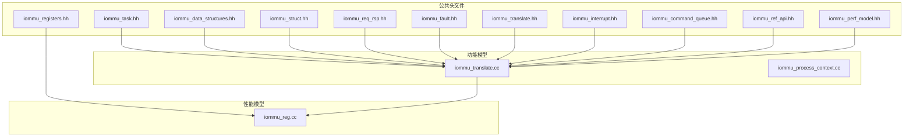
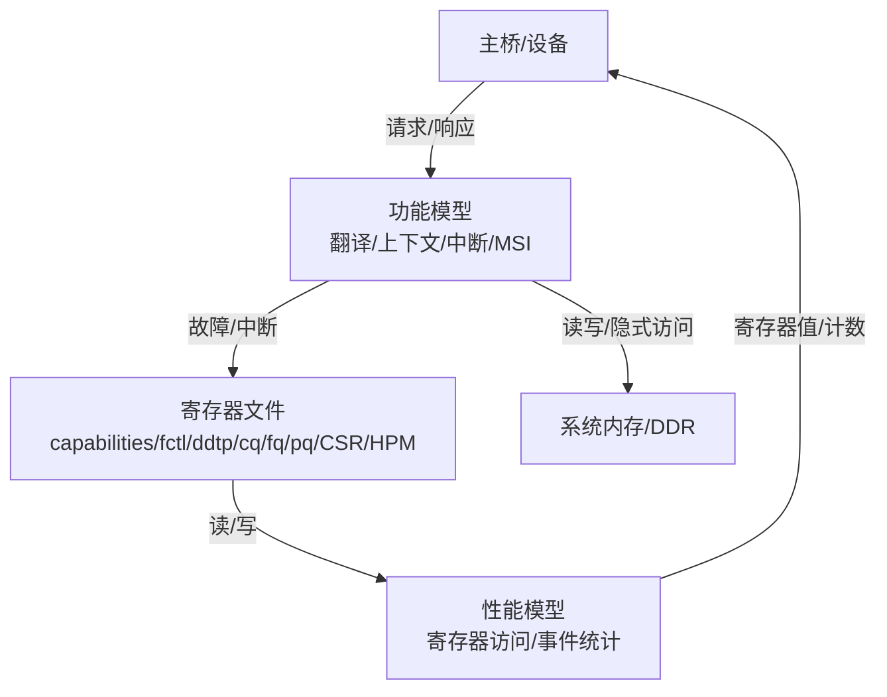
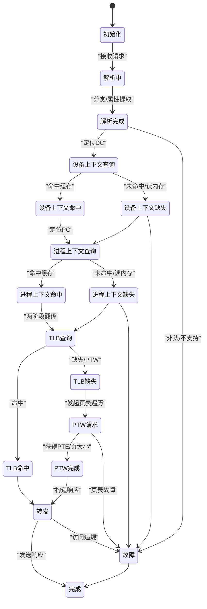
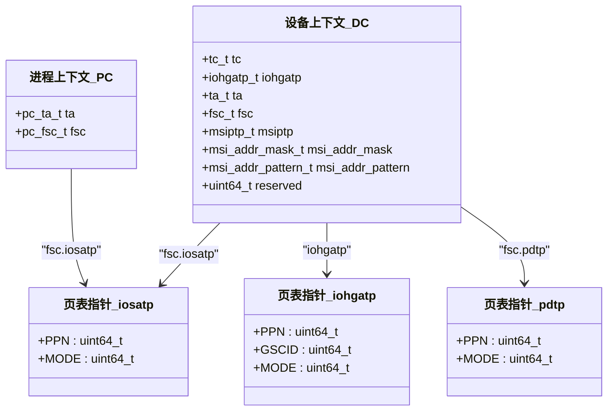
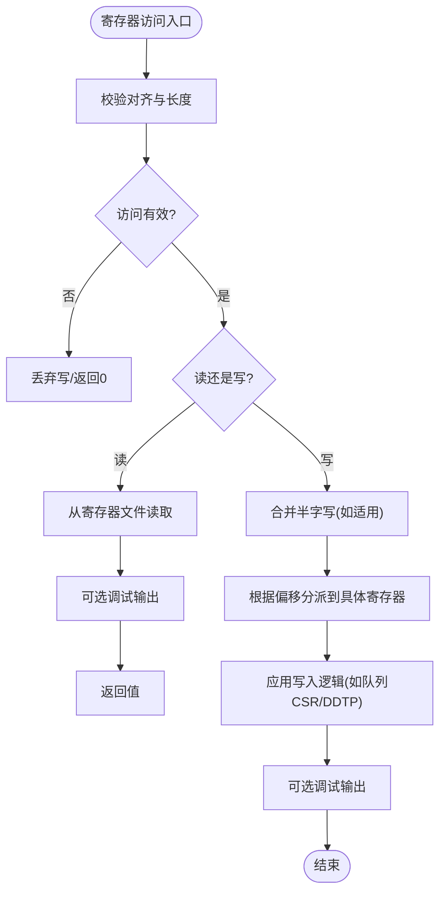
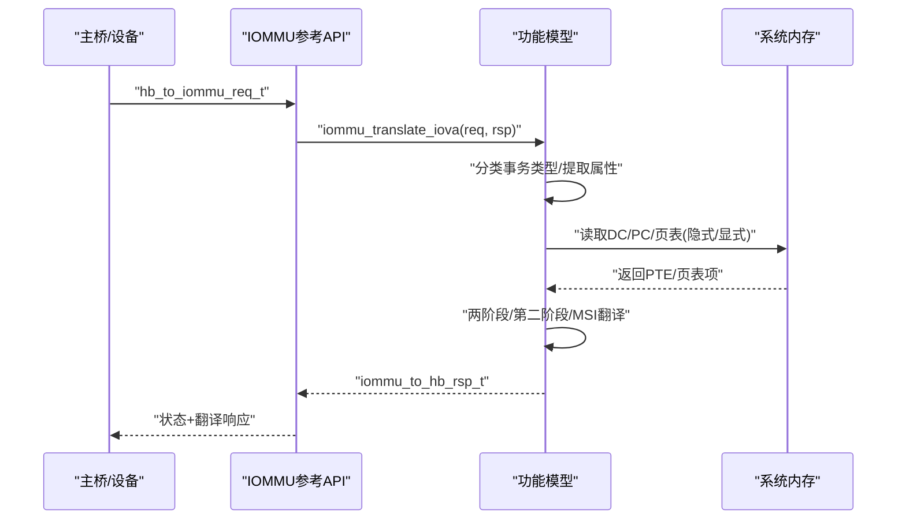
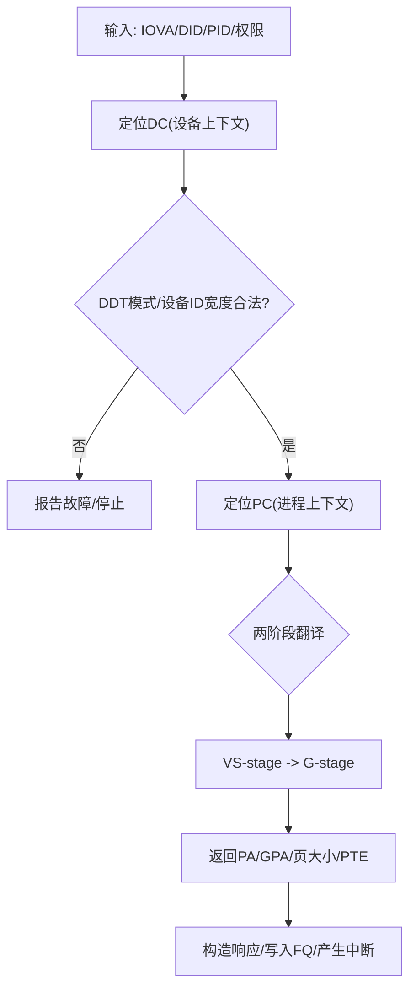
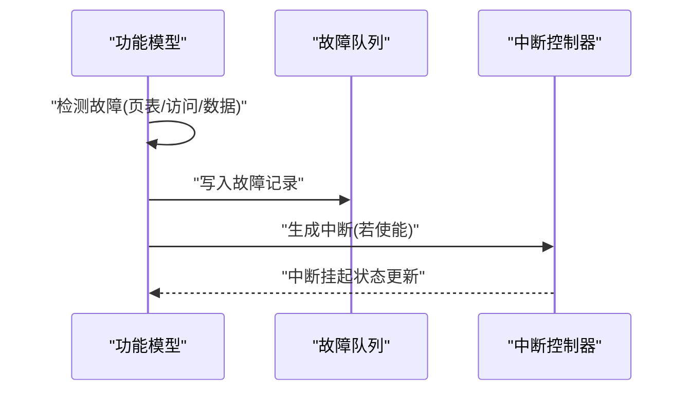
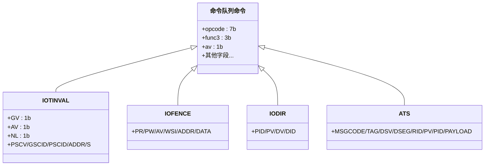
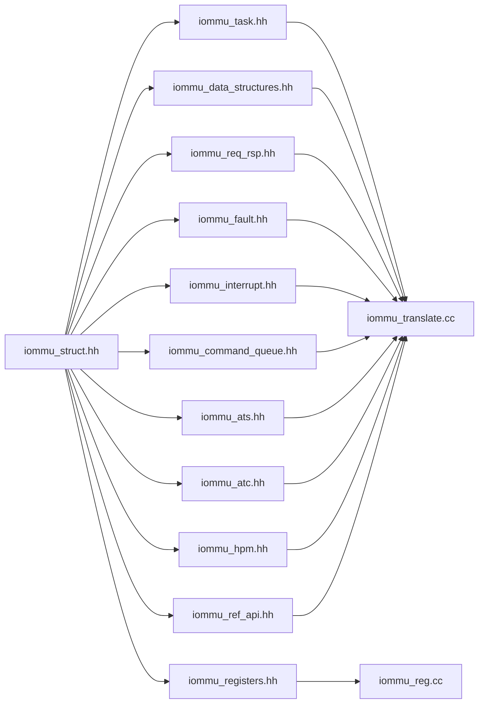

# API参考文档

<cite>
**本文档引用的文件**
- [iommu_task.hh](file://iommu/include/iommu_task.hh)
- [iommu_data_structures.hh](file://iommu/include/iommu_data_structures.hh)
- [iommu_struct.hh](file://iommu/include/iommu_struct.hh)
- [iommu_registers.hh](file://iommu/include/iommu_registers.hh)
- [iommu_req_rsp.hh](file://iommu/include/iommu_req_rsp.hh)
- [iommu_fault.hh](file://iommu/include/iommu_fault.hh)
- [iommu_translate.hh](file://iommu/include/iommu_translate.hh)
- [iommu_utils.hh](file://iommu/include/iommu_utils.hh)
- [iommu_interrupt.hh](file://iommu/include/iommu_interrupt.hh)
- [iommu_command_queue.hh](file://iommu/include/iommu_command_queue.hh)
- [iommu_ref_api.hh](file://iommu/include/iommu_ref_api.hh)
- [iommu_perf_model.hh](file://iommu/include/iommu_perf_model.hh)
- [iommu_translate.cc](file://iommu/iommu_fun_model/iommu_translate.cc)
- [iommu_process_context.cc](file://iommu/iommu_fun_model/iommu_process_context.cc)
- [iommu_reg.cc](file://iommu/iommu_perf_model/iommu_reg.cc)
</cite>

## 目录
1. [简介](#简介)
2. [项目结构](#项目结构)
3. [核心组件](#核心组件)
4. [架构总览](#架构总览)
5. [详细组件分析](#详细组件分析)
6. [依赖关系分析](#依赖关系分析)
7. [性能考量](#性能考量)
8. [故障排查指南](#故障排查指南)
9. [结论](#结论)
10. [附录](#附录)

## 简介
本文件为RISC-V IOMMU的完整API参考文档，覆盖以下主题：
- 核心数据结构：iommu_task_t任务数据结构、设备/进程上下文结构、页表项结构等字段定义、数据类型与使用规则
- 寄存器接口：寄存器定义、访问权限控制、状态查询方法
- 请求/响应接口：消息格式、协议规范与数据传输机制
- 接口规范：函数签名、参数说明、返回值定义与异常处理
- 实际使用模式与示例（以路径形式给出）
- 版本兼容性、废弃功能迁移指南与性能优化建议

## 项目结构
该仓库采用按功能域分层的组织方式：
- include：对外公开的头文件，定义数据结构、寄存器、接口声明
- iommu_fun_model：功能模型实现（翻译、上下文定位、中断、MSI等）
- iommu_perf_model：性能模型与寄存器访问实现
- iommu：顶层模块与测试用例

**图表来源**
- [iommu_task.hh](file://iommu/include/iommu_task.hh)
- [iommu_data_structures.hh](file://iommu/include/iommu_data_structures.hh)
- [iommu_struct.hh](file://iommu/include/iommu_struct.hh)
- [iommu_registers.hh](file://iommu/include/iommu_registers.hh)
- [iommu_req_rsp.hh](file://iommu/include/iommu_req_rsp.hh)
- [iommu_fault.hh](file://iommu/include/iommu_fault.hh)
- [iommu_translate.hh](file://iommu/include/iommu_translate.hh)
- [iommu_interrupt.hh](file://iommu/include/iommu_interrupt.hh)
- [iommu_command_queue.hh](file://iommu/include/iommu_command_queue.hh)
- [iommu_ref_api.hh](file://iommu/include/iommu_ref_api.hh)
- [iommu_perf_model.hh](file://iommu/include/iommu_perf_model.hh)
- [iommu_translate.cc](file://iommu/iommu_fun_model/iommu_translate.cc)
- [iommu_process_context.cc](file://iommu/iommu_fun_model/iommu_process_context.cc)
- [iommu_reg.cc](file://iommu/iommu_perf_model/iommu_reg.cc)

**章节来源**
- [iommu_task.hh](file://iommu/include/iommu_task.hh)
- [iommu_data_structures.hh](file://iommu/include/iommu_data_structures.hh)
- [iommu_struct.hh](file://iommu/include/iommu_struct.hh)
- [iommu_registers.hh](file://iommu/include/iommu_registers.hh)
- [iommu_req_rsp.hh](file://iommu/include/iommu_req_rsp.hh)
- [iommu_fault.hh](file://iommu/include/iommu_fault.hh)
- [iommu_translate.hh](file://iommu/include/iommu_translate.hh)
- [iommu_interrupt.hh](file://iommu/include/iommu_interrupt.hh)
- [iommu_command_queue.hh](file://iommu/include/iommu_command_queue.hh)
- [iommu_ref_api.hh](file://iommu/include/iommu_ref_api.hh)
- [iommu_perf_model.hh](file://iommu/include/iommu_perf_model.hh)
- [iommu_translate.cc](file://iommu/iommu_fun_model/iommu_translate.cc)
- [iommu_process_context.cc](file://iommu/iommu_fun_model/iommu_process_context.cc)
- [iommu_reg.cc](file://iommu/iommu_perf_model/iommu_reg.cc)

## 核心组件
本节聚焦于IOMMU的关键数据结构与接口，帮助快速建立对系统的整体认知。

- 任务状态机与行走阶段
  - 任务状态枚举：任务解析、上下文查询、TLB/PTW/MSIPTW行走、转发、故障、完成等
  - 行走类型：DDT/PDT/VS-PT/G-PT/MSI-PT
  - xDTW/PTW/MSIPTW行走阶段：非叶子、读DC/PC、隐式GS等
  - 参考路径：[任务状态与行走阶段定义](file://iommu/include/iommu_task.hh)

- 任务上下文与流水线
  - iommu_task_t：包含设备/进程标识、分类字段、上下文、翻译结果、管道状态、行走上下文等
  - 收集器条目、DDR请求/响应/挂起队列条目、控制路径DDR请求等
  - 参考路径：[任务与收集器结构](file://iommu/include/iommu_task.hh)

- 设备/进程上下文与页表控制
  - 设备上下文：tc/iohgatp/ta/fsc/msi相关字段
  - 进程上下文：ta/fsc
  - 页表指针：iosatp/iohgatp/pdtp/msiptp及掩码/模式
  - 参考路径：[设备/进程上下文与页表控制](file://iommu/include/iommu_data_structures.hh)

- 寄存器与寄存器文件
  - 能力寄存器、特性控制寄存器、DDTP、命令/故障/页面请求队列基址与指针、CSR、中断状态、性能计数器等
  - 参考路径：[寄存器定义与布局](file://iommu/include/iommu_registers.hh)

- 请求/响应消息格式
  - 主桥到IOMMU请求：设备ID、进程ID、读写/AMO/执行/特权/是否CXL等
  - 翻译响应：PPN/S/N/Priv/U/R/W/Exe/PBMT/MSI/MRIF等
  - 参考路径：[请求/响应接口](file://iommu/include/iommu_req_rsp.hh)

- 故障记录与报告
  - 故障类型编码、故障队列记录字段、报告接口
  - 参考路径：[故障接口](file://iommu/include/iommu_fault.hh)

- 翻译与地址转换
  - PTE结构（S/VS/G/MSI）、定位设备/进程上下文、两阶段/第二阶段/MSI地址翻译
  - 参考路径：[翻译接口](file://iommu/include/iommu_translate.hh)

- 中断与命令队列
  - 中断源类型、生成/释放中断、命令类型（IOFENCE/IOTINVAL/IODIR/ATS等）与字段
  - 参考路径：[中断与命令队列](file://iommu/include/iommu_interrupt.hh)、[命令队列](file://iommu/include/iommu_command_queue.hh)

- 性能模型辅助
  - 事务类型分类、DDI提取、VPN提取、规范地址检查、裸模式页大小、MSI地址判定、故障原因设置等
  - 参考路径：[性能模型辅助](file://iommu/include/iommu_perf_model.hh)

**章节来源**
- [iommu_task.hh](file://iommu/include/iommu_task.hh)
- [iommu_data_structures.hh](file://iommu/include/iommu_data_structures.hh)
- [iommu_registers.hh](file://iommu/include/iommu_registers.hh)
- [iommu_req_rsp.hh](file://iommu/include/iommu_req_rsp.hh)
- [iommu_fault.hh](file://iommu/include/iommu_fault.hh)
- [iommu_translate.hh](file://iommu/include/iommu_translate.hh)
- [iommu_interrupt.hh](file://iommu/include/iommu_interrupt.hh)
- [iommu_command_queue.hh](file://iommu/include/iommu_command_queue.hh)
- [iommu_perf_model.hh](file://iommu/include/iommu_perf_model.hh)

## 架构总览
IOMMU通过内存映射寄存器接口对外暴露能力与配置；功能模型负责请求解析、上下文定位、地址翻译与故障上报；性能模型负责寄存器访问与事件统计。

**图表来源**
- [iommu_registers.hh](file://iommu/include/iommu_registers.hh)
- [iommu_translate.cc](file://iommu/iommu_fun_model/iommu_translate.cc)
- [iommu_process_context.cc](file://iommu/iommu_fun_model/iommu_process_context.cc)
- [iommu_reg.cc](file://iommu/iommu_perf_model/iommu_reg.cc)

## 详细组件分析

### 任务数据结构与状态机
- iommu_task_t字段族
  - 身份字段：task_id/device_id/process_id/pid_valid/iova/length/at/exec_req/priv_req/no_write/is_cxl_dev/read_writeAMO/timestamp
  - 分类字段：TTYP/is_read/is_write/is_exec/priv/SUM/DDI
  - 上下文字段：DC/PC/iosatp/iohgatp/PSCV/GV/PSCID/GSCID/DID/PID/PV/DTF/check_access_perms/SXL/SADE/GADE
  - 翻译结果：pa/gpa/page_sz/gst_page_sz/vs_pte/g_pte/is_msi/is_mrif/mrif_nid/dest_mrif_addr/cause/iotval/iotval2/is_bare_translation/is_b_transport
  - 流水线状态：state/dc_valid/dc_hit/pc_valid/pc_hit/need_pc/tlm_trans_ptr
  - 行走上下文：walk_ctx（含walk_type/walk_phase/level/max_levels/base_addr/indexes/read_*等）
- 状态机与行走阶段
  - 任务状态涵盖解析、DC/PC查询/命中/缺失、TLB/PTW/MSIPTW、转发、故障、完成
  - 行走上下文支持多级页表索引、中间PPN缓存、AD位更新上下文、DDR读计数
- 使用规则
  - 任务生命周期由状态机驱动，各阶段需满足上下文有效性与页表一致性
  - 行走上下文在PTW中用于缓存中间结果，减少重复访问

**图表来源**
- [iommu_task.hh](file://iommu/include/iommu_task.hh)
- [iommu_translate.cc](file://iommu/iommu_fun_model/iommu_translate.cc)

**章节来源**
- [iommu_task.hh](file://iommu/include/iommu_task.hh)
- [iommu_translate.cc](file://iommu/iommu_fun_model/iommu_translate.cc)

### 设备/进程上下文与页表控制
- 设备上下文（DC）
  - tc：控制位（EN_ATS/EN_PRI/T2GPA/DTF/PDTV/PRPR/GADE/SADE/DPE/SBE/SXL/custom等）
  - iohgatp：G-stage根页表与GSCID
  - ta：PSCID/rcid/mcid
  - fsc：iosatp或pdtp（Bare/目录表）
  - msi扩展：msiptp/msi_addr_mask/msi_addr_pattern/reserved
- 进程上下文（PC）
  - ta：V/ENS/SUM/PSCID/reserved
  - fsc：iosatp（VS-stage根页表）
- 页表指针与模式
  - iosatp/iovsatp：S/VS-stage模式
  - iohgatp：G-stage模式
  - pdtp：目录表模式（PD8/PD17/PD20/Bare）
  - msiptp：MSI页表模式（Off/Flat）

**图表来源**
- [iommu_data_structures.hh](file://iommu/include/iommu_data_structures.hh)

**章节来源**
- [iommu_data_structures.hh](file://iommu/include/iommu_data_structures.hh)

### 寄存器接口与访问控制
- 寄存器布局与偏移
  - 能力寄存器（只读）、特性控制寄存器（fctl）、DDTP（设备目录表指针）
  - 命令/故障/页面请求队列基址与指针、CSR、中断状态、HPM计数器与事件选择器
- 访问权限与对齐约束
  - 仅支持4字节与8字节访问；偏移必须按访问宽度对齐；不可越界或跨寄存器访问
  - DDTP写入可能触发异步操作，busy位指示忙状态
- 状态查询
  - 通过cqcsr/fqcsr/pqcsr查询队列启用、中断使能、内存故障、超时、非法命令等
  - 通过ipsr查询中断挂起状态
  - 通过iocntovf汇总HPM溢出状态

**图表来源**
- [iommu_registers.hh](file://iommu/include/iommu_registers.hh)
- [iommu_reg.cc](file://iommu/iommu_perf_model/iommu_reg.cc)

**章节来源**
- [iommu_registers.hh](file://iommu/include/iommu_registers.hh)
- [iommu_reg.cc](file://iommu/iommu_perf_model/iommu_reg.cc)

### 请求/响应接口与协议
- 请求格式
  - 主桥到IOMMU：device_id/pid_valid/process_id/no_write/exec_req/priv_req/is_cxl_dev + iommu_trans_req_t（at/iova/length/read_writeAMO）
- 响应格式
  - 状态：SUCCESS/UNSUPPORTED_REQUEST/COMPLETER_ABORT
  - 翻译响应：PPN/S/N/Priv/U/R/W/Exe/PBMT/is_msi/is_mrif/dest_mrif_addr/mrif_nid/is_bare_mode/pa
- 协议要点
  - ATS翻译请求、已翻译请求、未翻译请求三类地址类型
  - 执行/读/写/AMO语义由read_writeAMO与exec_req组合决定
  - Bare模式下仅允许未翻译请求，且pa=iova

**图表来源**
- [iommu_req_rsp.hh](file://iommu/include/iommu_req_rsp.hh)
- [iommu_ref_api.hh](file://iommu/include/iommu_ref_api.hh)
- [iommu_translate.cc](file://iommu/iommu_fun_model/iommu_translate.cc)

**章节来源**
- [iommu_req_rsp.hh](file://iommu/include/iommu_req_rsp.hh)
- [iommu_ref_api.hh](file://iommu/include/iommu_ref_api.hh)
- [iommu_translate.cc](file://iommu/iommu_fun_model/iommu_translate.cc)

### 地址翻译与上下文定位
- 定位设备上下文
  - 根据device_id与PASID（pid_valid/process_id）在设备目录表中查找DC
  - 检查设备ID宽度与当前DDT模式匹配性
- 定位进程上下文
  - 依据DC中的pdtp与process_id在PDT中定位PC
  - 支持1/2/3级目录，隐式G-stage翻译根地址
- 两阶段地址翻译
  - VS-stage（S/VS）+ G-stage（Guest）两层页表
  - 支持原子更新A/D位（SADE/GADE），SXL控制虚拟地址范围
- 第二阶段翻译
  - 针对GPA进行G-stage翻译，返回G-PTE与页大小
- MSI地址翻译
  - 基于msi_addr_mask与msi_addr_pattern识别MSI写入
  - 支持Flat/Off模式，MRIF模式可直接路由至虚拟中断文件

**图表来源**
- [iommu_translate.cc](file://iommu/iommu_fun_model/iommu_translate.cc)
- [iommu_process_context.cc](file://iommu/iommu_fun_model/iommu_process_context.cc)
- [iommu_translate.hh](file://iommu/include/iommu_translate.hh)

**章节来源**
- [iommu_translate.cc](file://iommu/iommu_fun_model/iommu_translate.cc)
- [iommu_process_context.cc](file://iommu/iommu_fun_model/iommu_process_context.cc)
- [iommu_translate.hh](file://iommu/include/iommu_translate.hh)

### 故障处理与中断
- 故障类型
  - 访问故障、数据损坏、G-stage页/访问/数据损坏、MSI相关等
  - 故障队列记录包含cause/pid/pv/priv/ttyp/did/iotval/iotval2
- 中断生成
  - 命令队列/故障队列/HPM/页面请求队列中断源
  - 通过generate_interrupt/release_pending_interrupt管理
- 异常处理流程
  - 翻译过程中检测到故障即停止并上报，必要时写入FQ并产生中断

**图表来源**
- [iommu_fault.hh](file://iommu/include/iommu_fault.hh)
- [iommu_interrupt.hh](file://iommu/include/iommu_interrupt.hh)
- [iommu_translate.cc](file://iommu/iommu_fun_model/iommu_translate.cc)

**章节来源**
- [iommu_fault.hh](file://iommu/include/iommu_fault.hh)
- [iommu_interrupt.hh](file://iommu/include/iommu_interrupt.hh)
- [iommu_translate.cc](file://iommu/iommu_fun_model/iommu_translate.cc)

### 命令队列与ATS
- 命令类型
  - IOTINVAL（VMA/GVMA无效化）、IOFENCE（全局/地址范围/设备/功能/工作集无效化）、IODIR（目录无效化）、ATS（地址转换服务）
- ATS消息
  - 支持无效化与PRGR（Page Request Group Response）消息
- 阻塞与排队
  - ATS无效化请求可能被阻塞，需排队处理

**图表来源**
- [iommu_command_queue.hh](file://iommu/include/iommu_command_queue.hh)

**章节来源**
- [iommu_command_queue.hh](file://iommu/include/iommu_command_queue.hh)

## 依赖关系分析
- 头文件依赖
  - iommu_struct.hh前置包含寄存器、数据结构、请求/响应、故障、中断、命令队列、ATS、性能模型等头文件
  - iommu_task.hh依赖数据结构、翻译、请求/响应、性能参数
  - iommu_translate.hh对外提供翻译接口，内部依赖数据结构与工具
- 实现文件依赖
  - iommu_translate.cc依赖结构体、寄存器、故障、中断、命令队列、ATS、工具等
  - iommu_process_context.cc依赖结构体、寄存器、工具、翻译接口
  - iommu_reg.cc依赖寄存器定义与结构体

**图表来源**
- [iommu_struct.hh](file://iommu/include/iommu_struct.hh)
- [iommu_task.hh](file://iommu/include/iommu_task.hh)
- [iommu_registers.hh](file://iommu/include/iommu_registers.hh)
- [iommu_data_structures.hh](file://iommu/include/iommu_data_structures.hh)
- [iommu_req_rsp.hh](file://iommu/include/iommu_req_rsp.hh)
- [iommu_fault.hh](file://iommu/include/iommu_fault.hh)
- [iommu_interrupt.hh](file://iommu/include/iommu_interrupt.hh)
- [iommu_command_queue.hh](file://iommu/include/iommu_command_queue.hh)
- [iommu_ref_api.hh](file://iommu/include/iommu_ref_api.hh)
- [iommu_translate.cc](file://iommu/iommu_fun_model/iommu_translate.cc)
- [iommu_reg.cc](file://iommu/iommu_perf_model/iommu_reg.cc)

**章节来源**
- [iommu_struct.hh](file://iommu/include/iommu_struct.hh)
- [iommu_task.hh](file://iommu/include/iommu_task.hh)
- [iommu_registers.hh](file://iommu/include/iommu_registers.hh)
- [iommu_data_structures.hh](file://iommu/include/iommu_data_structures.hh)
- [iommu_req_rsp.hh](file://iommu/include/iommu_req_rsp.hh)
- [iommu_fault.hh](file://iommu/include/iommu_fault.hh)
- [iommu_interrupt.hh](file://iommu/include/iommu_interrupt.hh)
- [iommu_command_queue.hh](file://iommu/include/iommu_command_queue.hh)
- [iommu_ref_api.hh](file://iommu/include/iommu_ref_api.hh)
- [iommu_translate.cc](file://iommu/iommu_fun_model/iommu_translate.cc)
- [iommu_reg.cc](file://iommu/iommu_perf_model/iommu_reg.cc)

## 性能考量
- 事件计数与HPM
  - 通过HPM计数器与事件选择器统计各类访问与行走事件
  - 可通过iocntovf汇总溢出状态
- 缓存与命中率
  - DDT/PDT/TLB/PC缓存降低内存访问次数
  - 性能模型提供VPN提取、裸页大小、MSI地址判定等辅助
- 写入合并与对齐
  - 4B写入8B寄存器时进行半字合并，避免部分更新导致的不确定性
- 读写路径优化
  - 通过QoS ID（rcid/mcid）与端到端一致性，减少不必要的内存屏障

**章节来源**
- [iommu_perf_model.hh](file://iommu/include/iommu_perf_model.hh)
- [iommu_reg.cc](file://iommu/iommu_perf_model/iommu_reg.cc)

## 故障排查指南
- 常见故障原因
  - 事务类型不支持（Off/Bare模式限制）
  - 设备ID宽度超出DDT模式支持范围
  - DC/PC未命中或配置错误（V位、保留位、PDT条目合法性）
  - 页表访问故障（访问/数据损坏/页故障）
  - ATS/PRG相关超时或不一致
- 定位步骤
  - 检查寄存器访问是否对齐与越界
  - 查看cqcsr/fqcsr/pqcsr状态位（cqmf/cmd_to/cmd_ill/fqof/pqof等）
  - 读取FQ记录（cause/pid/pv/priv/ttyp/did/iotval/iotval2）
  - 触发调试输出（DDTP读写调试打印）
- 建议
  - 在修改ddtp/cqcsr等寄存器前确认busy/cqon状态
  - 合理配置fctl.end与fctl.gxl以适配目标平台

**章节来源**
- [iommu_translate.cc](file://iommu/iommu_fun_model/iommu_translate.cc)
- [iommu_fault.hh](file://iommu/include/iommu_fault.hh)
- [iommu_reg.cc](file://iommu/iommu_perf_model/iommu_reg.cc)

## 结论
本API参考文档系统梳理了RISC-V IOMMU的核心数据结构、寄存器接口、请求/响应协议与翻译流程，并提供了接口规范、使用模式与性能优化建议。通过明确的任务状态机、严格的上下文与页表控制以及完善的故障与中断机制，IOMMU能够稳定地支撑两阶段地址翻译与MSI处理。

## 附录

### 接口规范与示例路径
- 翻译入口
  - 函数：iommu_translate_iova
  - 参数：iommu_t*、hb_to_iommu_req_t*、iommu_to_hb_rsp_t*
  - 示例路径：[翻译入口实现](file://iommu/iommu_fun_model/iommu_translate.cc)
- 上下文定位
  - locate_device_context / locate_process_context
  - 示例路径：[上下文定位实现](file://iommu/iommu_fun_model/iommu_process_context.cc)
- 寄存器访问
  - read_register / write_register
  - 示例路径：[寄存器访问实现](file://iommu/iommu_perf_model/iommu_reg.cc)
- 故障上报
  - report_fault
  - 示例路径：[故障上报声明](file://iommu/include/iommu_fault.hh)
- 中断管理
  - generate_interrupt / release_pending_interrupt
  - 示例路径：[中断接口声明](file://iommu/include/iommu_interrupt.hh)
- 命令处理
  - process_commands / do_iofence_c / do_iotinval_vma 等
  - 示例路径：[命令队列接口声明](file://iommu/include/iommu_command_queue.hh)

**章节来源**
- [iommu_ref_api.hh](file://iommu/include/iommu_ref_api.hh)
- [iommu_translate.cc](file://iommu/iommu_fun_model/iommu_translate.cc)
- [iommu_process_context.cc](file://iommu/iommu_fun_model/iommu_process_context.cc)
- [iommu_reg.cc](file://iommu/iommu_perf_model/iommu_reg.cc)
- [iommu_fault.hh](file://iommu/include/iommu_fault.hh)
- [iommu_interrupt.hh](file://iommu/include/iommu_interrupt.hh)
- [iommu_command_queue.hh](file://iommu/include/iommu_command_queue.hh)

### 版本兼容性与迁移指南
- 版本字段
  - capabilities.version：记录实现遵循的规范版本（高4位为主版本，低4位为次版本）
- 兼容性建议
  - 当ddtp.iommu_mode处于非Off状态时，不建议动态切换特性（如fctl.be/gxl），否则行为未指定
  - 若需变更ddtp，应等待busy与cqon均为0后再进行
- 迁移提示
  - 从旧实现升级时，优先验证DDT模式与设备ID宽度匹配
  - ATS相关功能（EN_ATS/T2GPA）需与宿主/固件配合配置

**章节来源**
- [iommu_registers.hh](file://iommu/include/iommu_registers.hh)