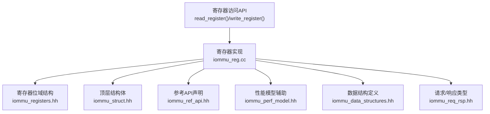
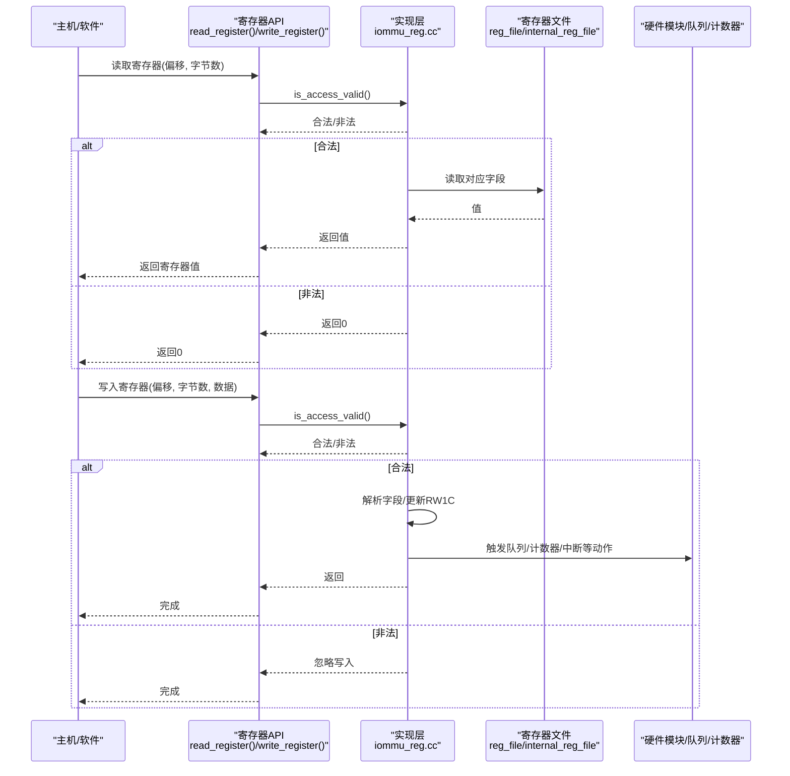
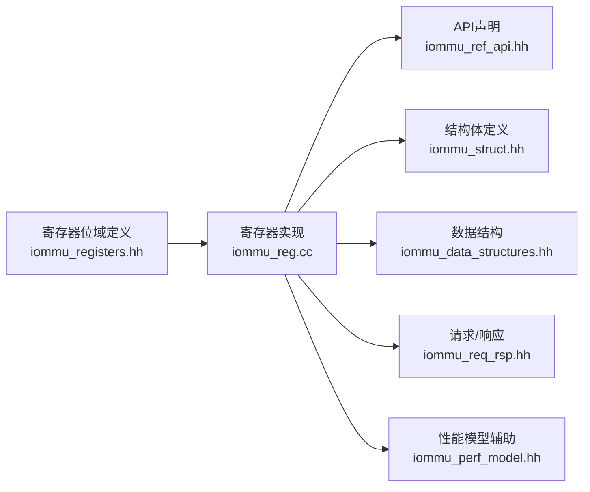
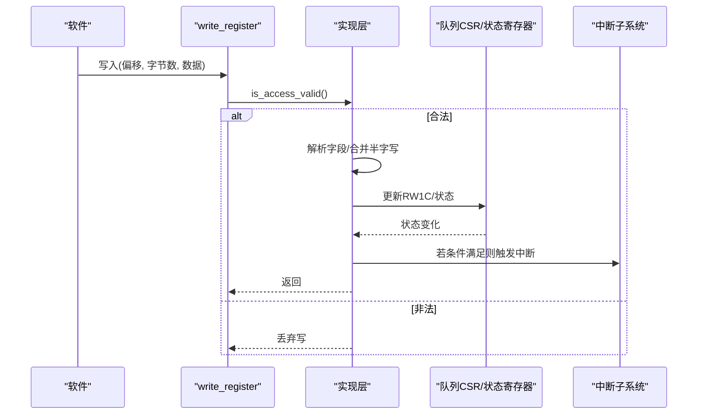

# 寄存器接口

<cite>
**本文引用的文件**
- [iommu_registers.hh](file://iommu/include/iommu_registers.hh)
- [iommu_reg.cc](file://iommu/iommu_perf_model/iommu_reg.cc)
- [iommu_ref_api.hh](file://iommu/include/iommu_ref_api.hh)
- [iommu_ref_api.cc](file://iommu/iommu_perf_model/iommu_ref_api.cc)
- [iommu_struct.hh](file://iommu/include/iommu_struct.hh)
- [iommu_data_structures.hh](file://iommu/include/iommu_data_structures.hh)
- [iommu_req_rsp.hh](file://iommu/include/iommu_req_rsp.hh)
- [iommu_perf_model.hh](file://iommu/iommu_perf_model/iommu_perf_model.hh)
</cite>

## 目录
1. [简介](#简介)
2. [项目结构](#项目结构)
3. [核心组件](#核心组件)
4. [架构总览](#架构总览)
5. [详细组件分析](#详细组件分析)
6. [依赖关系分析](#依赖关系分析)
7. [性能考量](#性能考量)
8. [故障排查指南](#故障排查指南)
9. [结论](#结论)
10. [附录](#附录)

## 简介
本文件面向IOMMU寄存器接口的完整API文档，覆盖寄存器定义与布局、位域与功能说明、访问方法（读写、权限与状态查询）、初始化与复位流程、配置参数以及与硬件模块的交互与时序要求。文档同时提供可直接定位到源码的路径，便于开发者在实际工程中快速查阅与实现。

## 项目结构
IOMMU寄存器接口由以下层次构成：
- 接口层：对外暴露的寄存器访问API（读写、复位）
- 数据结构层：寄存器位域与队列/计数器等数据结构
- 实现层：寄存器读写逻辑、校验与状态机更新
- 结构体层：顶层状态与寄存器文件组织

图表来源
- [iommu_reg.cc:38-73](file://iommu/iommu_perf_model/iommu_reg.cc#L38-L73)
- [iommu_registers.hh:172-800](file://iommu/include/iommu_registers.hh#L172-L800)
- [iommu_struct.hh:42-99](file://iommu/include/iommu_struct.hh#L42-L99)
- [iommu_ref_api.hh:26-39](file://iommu/include/iommu_ref_api.hh#L26-L39)
- [iommu_perf_model.hh:1-197](file://iommu/iommu_perf_model/iommu_perf_model.hh#L1-L197)
- [iommu_data_structures.hh:1-415](file://iommu/include/iommu_data_structures.hh#L1-L415)
- [iommu_req_rsp.hh:1-106](file://iommu/include/iommu_req_rsp.hh#L1-L106)

章节来源
- [iommu_reg.cc:1-1057](file://iommu/iommu_perf_model/iommu_reg.cc#L1-L1057)
- [iommu_registers.hh:1-987](file://iommu/include/iommu_registers.hh#L1-L987)
- [iommu_struct.hh:1-102](file://iommu/include/iommu_struct.hh#L1-L102)
- [iommu_ref_api.hh:1-54](file://iommu/include/iommu_ref_api.hh#L1-L54)
- [iommu_perf_model.hh:1-197](file://iommu/iommu_perf_model/iommu_perf_model.hh#L1-L197)
- [iommu_data_structures.hh:1-415](file://iommu/include/iommu_data_structures.hh#L1-L415)
- [iommu_req_rsp.hh:1-106](file://iommu/include/iommu_req_rsp.hh#L1-L106)

## 核心组件
- 寄存器位域与布局：通过联合体定义各寄存器字段，涵盖能力、控制、队列基址与索引、状态与中断、性能监控、MSI配置表、调试接口等。
- 访问接口：统一的读写入口，支持4字节与8字节访问，内部进行对齐与越界校验，并根据偏移选择标准或内部寄存器空间。
- 初始化与复位：reset_iommu完成寄存器文件清零、能力与特性控制初始化、队列基址与索引复位、偏移到尺寸映射表构建等。
- 状态与中断：IPSR中断挂起状态寄存器配合RW1C写1清零语义；命令/故障/页面请求队列CSR提供启用、忙、中断使能与错误标志。
- 性能监控：HPM计数器与事件选择器，溢出状态汇总寄存器。
- MSI与中断：MSI配置表（地址/数据/向量控制），中断向量分配寄存器。

章节来源
- [iommu_registers.hh:172-800](file://iommu/include/iommu_registers.hh#L172-L800)
- [iommu_reg.cc:38-73](file://iommu/iommu_perf_model/iommu_reg.cc#L38-L73)
- [iommu_reg.cc:909-1057](file://iommu/iommu_perf_model/iommu_reg.cc#L909-L1057)
- [iommu_ref_api.hh:26-39](file://iommu/include/iommu_ref_api.hh#L26-L39)

## 架构总览
寄存器接口采用“统一偏移 + 位域联合体”的设计，所有寄存器按自然页对齐布局，支持4B/8B原子访问。实现层负责：
- 访问合法性校验（对齐、越界、跨寄存器写）
- 标准寄存器与内部寄存器空间区分
- 队列基址/索引更新与RW1C写1清零
- 中断生成与向量控制
- 性能监控计数器与事件选择器管理

图表来源
- [iommu_reg.cc:11-26](file://iommu/iommu_perf_model/iommu_reg.cc#L11-L26)
- [iommu_reg.cc:38-73](file://iommu/iommu_perf_model/iommu_reg.cc#L38-L73)
- [iommu_reg.cc:74-908](file://iommu/iommu_perf_model/iommu_reg.cc#L74-L908)

章节来源
- [iommu_reg.cc:1-1057](file://iommu/iommu_perf_model/iommu_reg.cc#L1-L1057)

## 详细组件分析

### 寄存器布局与地址映射
- 标准寄存器空间：从0x0开始，按自然页对齐布局，包含能力、控制、队列基址与索引、状态与中断、性能监控、调试接口等。
- 内部寄存器空间：从0x1000开始，包含RC段/总线范围、WARL头尾指针等内部使用寄存器。
- 对齐与越界：仅支持4B/8B访问，且必须按访问宽度对齐；跨寄存器写被拒绝；非法访问返回0或丢弃写。

章节来源
- [iommu_registers.hh:9-11](file://iommu/include/iommu_registers.hh#L9-L11)
- [iommu_registers.hh:771-800](file://iommu/include/iommu_registers.hh#L771-L800)
- [iommu_reg.cc:11-26](file://iommu/iommu_perf_model/iommu_reg.cc#L11-L26)

### 位域与功能说明（节选）
- 能力寄存器(capabilities)：版本、Sv32/Sv39/Sv48/Sv57支持、PTE保留位、PBMT、G-stage扩展、AMO/MRI、MSI模式、ATS/PRI、端序、中断生成方式、HPM、调试接口、物理地址位宽、进程ID粒度、QoS ID、非叶子无效化、地址范围无效化等。
- 功能控制(fctl)：端序、无线中断、G-stage转换方案控制、保留与自定义字段。
- 设备目录表指针(ddtp)：模式、忙标志、根PPN。
- 队列基址/索引：命令队列(cqb/cqh/cqt)、故障队列(fqb/fqh/fqt)、页面请求队列(pqb/pqh/pqt)。
- 队列CSR：命令/故障/页面请求队列CSR，含启用、中断使能、忙、内存故障、超时、非法命令、IOFENCE完成等RW1C标志。
- 中断挂起状态(IPSR)：命令/故障/页面请求/HPM中断挂起，写1清零。
- 性能监控：溢出状态汇总、计数抑制、周期计数器、事件计数器与事件选择器。
- 调试接口(tr_req_iova/tr_req_ctrl/tr_response)：调试用的翻译请求接口。
- MSI配置表(msi_addr/data/vec_ctrl)与中断向量(icvec)。

章节来源
- [iommu_registers.hh:172-800](file://iommu/include/iommu_registers.hh#L172-L800)

### 访问方法与权限控制
- 读取：read_register(偏移, 字节数) -> 返回值。非法访问返回0。
- 写入：write_register(偏移, 字节数, 数据)。非法访问丢弃写。
- 权限与状态：
  - 队列CSR写入需遵循RW1C规则，写1清零对应标志。
  - IPSR写1清零对应中断挂起位，若条件仍满足则重新触发中断。
  - fctl仅在支持双端序或双中断方式时可写，且IOMMU处于Off/Bare且队列未启用时才允许写。
  - ddtp写入需检查busy位，非法模式值保留当前值。
  - 队列基址写入需在队列未启用且非busy时进行，否则丢弃写。

章节来源
- [iommu_ref_api.hh:26-27](file://iommu/include/iommu_ref_api.hh#L26-L27)
- [iommu_reg.cc:74-908](file://iommu/iommu_perf_model/iommu_reg.cc#L74-L908)

### 初始化与复位流程
- reset_iommu：完成寄存器文件清零、能力与fctl初始化、ddtp模式复位为Off/Bare、构建偏移到尺寸映射表、设置HPM参数与页大小等。
- 复位约束：能力中的IGS必须为MSI/WSI/Both之一；HPM计数器位宽与数量需符合能力；向量位数限制；ddtp模式必须为Off或Bare。

章节来源
- [iommu_reg.cc:909-1057](file://iommu/iommu_perf_model/iommu_reg.cc#L909-L1057)

### 配置参数与寄存器关系
- 能力(capabilities)决定寄存器可用性与行为，如HPM、ATS、MSI模式、端序、物理地址位宽等。
- fctl影响端序与中断方式，且受capabilities限制。
- 队列基址/索引决定队列容量与对齐要求，log2szm1决定队列大小，PPN决定基址。
- IPSR与各队列CSR共同决定中断状态与触发时机。
- 性能监控参数由reset_iommu传入，影响计数器位宽、事件ID上限、向量位数等。

章节来源
- [iommu_reg.cc:909-1057](file://iommu/iommu_perf_model/iommu_reg.cc#L909-L1057)
- [iommu_data_structures.hh:1-415](file://iommu/include/iommu_data_structures.hh#L1-L415)

### 代码示例（路径指引）
- 读取寄存器值：[read_register:38-73](file://iommu/iommu_perf_model/iommu_reg.cc#L38-L73)
- 设置寄存器位（以命令队列CSR为例）：[write_register -> CQCSR分支:354-432](file://iommu/iommu_perf_model/iommu_reg.cc#L354-L432)
- 检查寄存器状态（以IPSR为例）：[write_register -> IPSR分支:561-614](file://iommu/iommu_perf_model/iommu_reg.cc#L561-L614)
- 初始化IOMMU：[reset_iommu:909-1057](file://iommu/iommu_perf_model/iommu_reg.cc#L909-L1057)

章节来源
- [iommu_reg.cc:38-908](file://iommu/iommu_perf_model/iommu_reg.cc#L38-L908)

### 与硬件模块的交互与时序
- 队列启用/关闭：命令/故障/页面请求队列CSR写入后，可能经历短暂busy期，随后cqon/fqon/pqon变为1或0，期间禁止修改基址。
- 中断生成：队列CSR写入RW1C标志或状态变化时，若中断使能且未挂起，则触发中断；IPSR写1清零后若条件仍满足会再次触发。
- 性能监控：计数器溢出状态汇总至iocntovf，周期计数器与事件计数器受capabilities与reset参数控制。
- MSI：MSI配置表按向量索引，写入msi_addr/data/vec_ctrl后，vec_ctrl.m=0->1时释放挂起中断。

章节来源
- [iommu_reg.cc:354-908](file://iommu/iommu_perf_model/iommu_reg.cc#L354-L908)

## 依赖关系分析
- 位域定义依赖于寄存器布局与能力字段，能力字段决定某些寄存器的存在性与可写性。
- 访问API依赖实现层的合法性校验与字段解析。
- reset_iommu依赖能力与性能监控参数，确保寄存器初始状态符合规范。
- 请求/响应类型与设备上下文结构为寄存器接口与功能模型之间的桥梁。

图表来源
- [iommu_registers.hh:172-800](file://iommu/include/iommu_registers.hh#L172-L800)
- [iommu_reg.cc:1-1057](file://iommu/iommu_perf_model/iommu_reg.cc#L1-L1057)
- [iommu_ref_api.hh:1-54](file://iommu/include/iommu_ref_api.hh#L1-L54)
- [iommu_struct.hh:1-102](file://iommu/include/iommu_struct.hh#L1-L102)
- [iommu_data_structures.hh:1-415](file://iommu/include/iommu_data_structures.hh#L1-L415)
- [iommu_req_rsp.hh:1-106](file://iommu/include/iommu_req_rsp.hh#L1-L106)
- [iommu_perf_model.hh:1-197](file://iommu/iommu_perf_model/iommu_perf_model.hh#L1-L197)

章节来源
- [iommu_reg.cc:1-1057](file://iommu/iommu_perf_model/iommu_reg.cc#L1-L1057)
- [iommu_ref_api.hh:1-54](file://iommu/include/iommu_ref_api.hh#L1-L54)
- [iommu_struct.hh:1-102](file://iommu/include/iommu_struct.hh#L1-L102)
- [iommu_data_structures.hh:1-415](file://iommu/include/iommu_data_structures.hh#L1-L415)
- [iommu_req_rsp.hh:1-106](file://iommu/include/iommu_req_rsp.hh#L1-L106)
- [iommu_perf_model.hh:1-197](file://iommu/iommu_perf_model/iommu_perf_model.hh#L1-L197)

## 性能考量
- 访问合法性检查开销极低，主要为常量时间判断。
- 队列CSR写入涉及RW1C与状态机切换，需避免在busy状态下频繁写入。
- 性能监控计数器位宽与数量由能力与reset参数决定，过大计数器会增加存储与比较成本。
- MSI配置表按向量位数索引，向量位数越多占用空间越大。

[本节为通用指导，无需特定文件来源]

## 故障排查指南
- 读写异常：
  - 非法访问：返回0或丢弃写，检查对齐与越界。
  - 队列基址写失败：确认队列未启用且非busy。
  - ddtp写失败：检查busy位与模式合法性。
- 中断不触发：
  - 检查IPSR对应位是否被写1清零，且中断使能与条件仍满足。
  - 检查队列CSR的RW1C标志是否被正确清零。
- 性能监控异常：
  - 检查capabilities.hpm与reset参数，确认计数器位宽与事件ID上限。
  - 溢出状态需通过iocntovf汇总寄存器读取。
- MSI异常：
  - 检查MSI配置表索引与向量位数，确认vec_ctrl.m=0->1时已释放中断。

章节来源
- [iommu_reg.cc:11-26](file://iommu/iommu_perf_model/iommu_reg.cc#L11-L26)
- [iommu_reg.cc:354-908](file://iommu/iommu_perf_model/iommu_reg.cc#L354-L908)

## 结论
IOMMU寄存器接口通过清晰的位域定义与严格的访问控制，提供了稳定可靠的寄存器编程模型。配合完善的初始化与复位流程、队列CSR的状态机与中断机制、以及性能监控与MSI配置表，能够满足复杂平台的DMA保护与中断需求。建议在实际集成中严格遵循对齐与越界约束，并在队列启用/关闭与CSR写入时遵循RW1C与busy状态规则。

[本节为总结，无需特定文件来源]

## 附录

### 寄存器访问序列图（写入流程）

图表来源
- [iommu_reg.cc:74-908](file://iommu/iommu_perf_model/iommu_reg.cc#L74-L908)