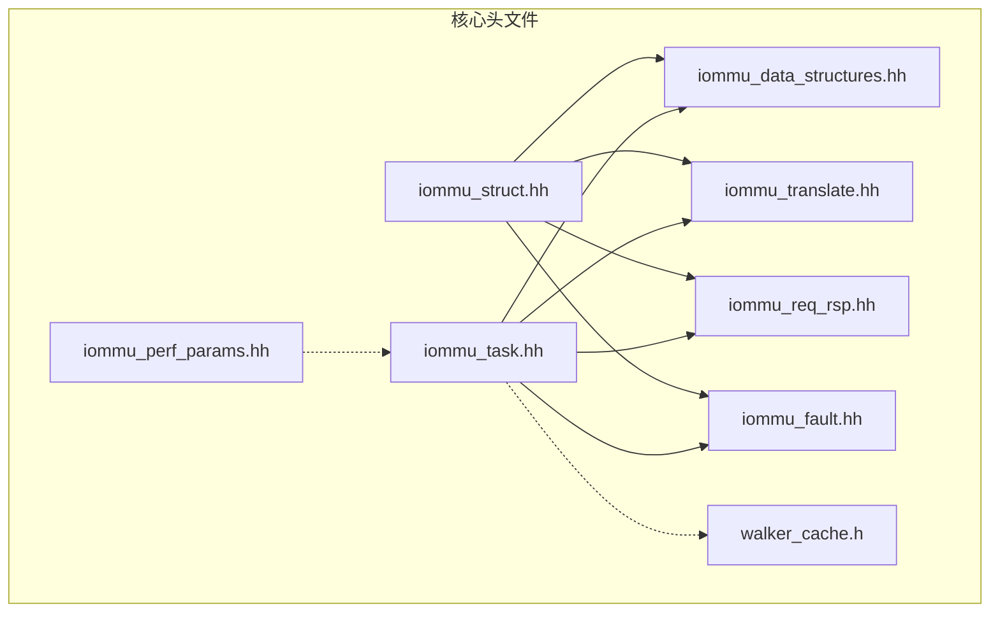
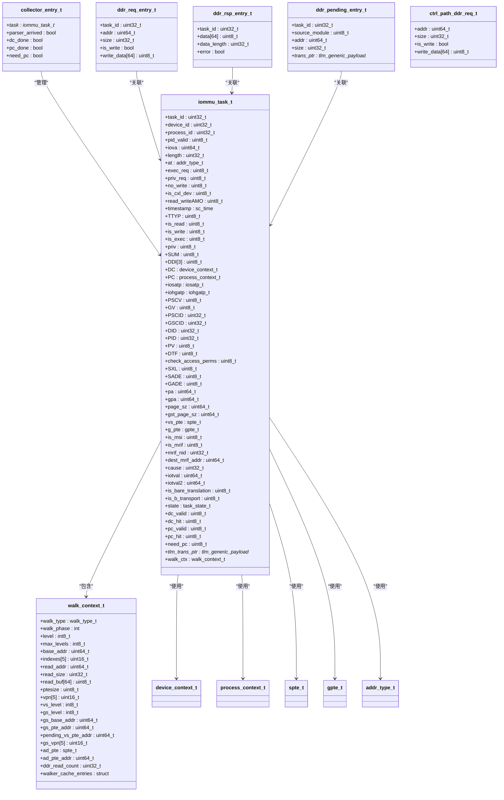
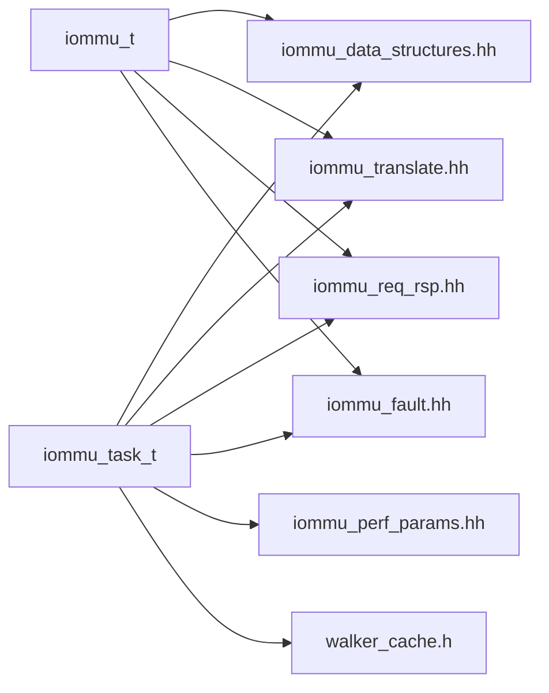

# 核心数据结构

<cite>
**本文引用的文件**
- [iommu_task.hh](file://iommu/include/iommu_task.hh)
- [iommu_struct.hh](file://iommu/include/iommu_struct.hh)
- [iommu_data_structures.hh](file://iommu/include/iommu_data_structures.hh)
- [iommu_req_rsp.hh](file://iommu/include/iommu_req_rsp.hh)
- [iommu_translate.hh](file://iommu/include/iommu_translate.hh)
- [iommu_fault.hh](file://iommu/include/iommu_fault.hh)
- [iommu_perf_params.hh](file://iommu/iommu_perf_model/iommu_perf_params.hh)
- [walker_cache.h](file://iommu/cache_src/cache/walker_cache.h)
</cite>

## 目录
1. [简介](#简介)
2. [项目结构](#项目结构)
3. [核心组件](#核心组件)
4. [架构总览](#架构总览)
5. [详细组件分析](#详细组件分析)
6. [依赖分析](#依赖分析)
7. [性能考量](#性能考量)
8. [故障排查指南](#故障排查指南)
9. [结论](#结论)

## 简介
本文件聚焦于RISC-V IOMMU模型中的核心数据结构，系统性地文档化以下关键结构体与枚举：
- iommu_task_t：统一的任务上下文，承载身份标识、分类、上下文、转换结果与流水线状态等信息
- walk_context_t：页表遍历上下文，描述遍历类型、阶段与中间状态
- collector_entry_t：收集器条目，用于跟踪任务在收集阶段的状态
- ddr_req_entry_t / ddr_rsp_entry_t：内存请求/响应条目，用于与DDR接口交互
- 相关枚举：任务状态、遍历类型、xDTW/PTW/MSIPTW阶段等

文档同时给出字段定义、数据类型、默认值、使用规则与典型用法，并通过图示展示结构间的关系与内存布局要点。

## 项目结构
围绕核心数据结构的相关头文件组织如下：
- iommu/include：核心数据结构与接口定义
  - iommu_task.hh：任务上下文、遍历上下文、收集器条目、DDR请求/响应条目
  - iommu_data_structures.hh：设备上下文、进程上下文、页表项等基础数据结构
  - iommu_translate.hh：页表项类型（spte_t/gpte_t/msipte_t）与翻译接口
  - iommu_req_rsp.hh：请求/响应类型与地址类型枚举
  - iommu_fault.hh：故障记录与故障类型编码
  - iommu_struct.hh：顶层结构体iommu_t（系统级容器）
- iommu/iommu_perf_model：性能参数与FIFO深度配置
- iommu/cache_src/cache：Walker Cache实现（与walk_context_t的中间结果字段配合）

图表来源
- [iommu_task.hh](file://iommu/include/iommu_task.hh)
- [iommu_data_structures.hh](file://iommu/include/iommu_data_structures.hh)
- [iommu_translate.hh](file://iommu/include/iommu_translate.hh)
- [iommu_req_rsp.hh](file://iommu/include/iommu_req_rsp.hh)
- [iommu_fault.hh](file://iommu/include/iommu_fault.hh)
- [iommu_struct.hh](file://iommu/include/iommu_struct.hh)
- [iommu_perf_params.hh](file://iommu/iommu_perf_model/iommu_perf_params.hh)
- [walker_cache.h](file://iommu/cache_src/cache/walker_cache.h)

章节来源
- [iommu_task.hh](file://iommu/include/iommu_task.hh)
- [iommu_data_structures.hh](file://iommu/include/iommu_data_structures.hh)
- [iommu_translate.hh](file://iommu/include/iommu_translate.hh)
- [iommu_req_rsp.hh](file://iommu/include/iommu_req_rsp.hh)
- [iommu_fault.hh](file://iommu/include/iommu_fault.hh)
- [iommu_struct.hh](file://iommu/include/iommu_struct.hh)
- [iommu_perf_params.hh](file://iommu/iommu_perf_model/iommu_perf_params.hh)
- [walker_cache.h](file://iommu/cache_src/cache/walker_cache.h)

## 核心组件
本节对关键数据结构进行逐项说明，涵盖字段定义、数据类型、默认值与使用规则。

- iommu_task_t（统一任务上下文）
  - 身份标识字段（来自PayloadExtension）
    - task_id：任务唯一标识（uint32_t）
    - device_id：设备ID（uint32_t）
    - process_id：进程ID（uint32_t），结合pid_valid判断有效性
    - pid_valid：进程ID有效标志（uint8_t）
    - iova：输入IOVA（uint64_t）
    - length：访问长度（uint32_t）
    - at：地址类型（addr_type_t）
    - exec_req/no_write/read_writeAMO/is_cxl_dev：访问属性标志（uint8_t）
    - timestamp：时间戳（sc_time）
  - 分类字段（Parser）
    - TTYP：事务类型（uint8_t）
    - is_read/is_write/is_exec/priv/SUM/DDI[3]：访问语义与特权/用户位等（uint8_t）
  - 上下文字段（Collector）
    - DC：设备上下文（device_context_t）
    - PC：进程上下文（process_context_t）
    - iosatp/iohgatp：S/VS/G阶段页表指针（iosatp_t/iohgatp_t）
    - PSCV/GV/PSCID/GSCID/DID/PID/PV/DTF/check_access_perms/SXL/SADE/GADE：上下文控制与能力位（uint8_t/uint32_t）
  - 转换结果字段（PTW/Forwarder）
    - pa/gpa/page_sz/gst_page_sz：物理地址、GPA与页大小（uint64_t）
    - vs_pte/g_pte：VS/G阶段页表项（spte_t/gpte_t）
    - is_msi/is_mrif/mrif_nid/dest_mrif_addr：MSI识别与MRIF相关（uint8_t/uint32_t/uint64_t）
    - cause：故障原因码（uint32_t）
    - iotval/iotval2：故障寄存器值（uint64_t）
    - is_bare_translation：裸模式标志（uint8_t）
    - is_b_transport：是否由b_transport创建（uint8_t）
  - 流水线状态
    - state：任务状态（task_state_t）
    - dc_valid/dc_hit/pc_valid/pc_hit/need_pc：缓存命中与需求标志（uint8_t）
    - tlm_trans_ptr：TLM传输指针（tlm::tlm_generic_payload*）
  - 遍历上下文
    - walk_ctx：walk_context_t（见下节）
  - 默认构造与初始化
    - 提供默认构造函数，将关键字段初始化为0或默认值；部分复合字段调用其默认构造

- walk_context_t（页表遍历上下文）
  - 遍历类型与阶段
    - walk_type：遍历类型（walk_type_t）
    - walk_phase：当前阶段（int，实际取值为xdtw_walk_phase_t/ptw_walk_phase_t/msiptw_walk_phase_t）
  - 基本遍历参数
    - level/max_levels：当前/最大层级（int8_t）
    - base_addr：根表基址（uint64_t）
    - indexes[5]：索引数组（uint16_t[5]）
    - read_addr/read_size/read_buf[64]：读取地址、大小与缓冲（uint64_t/uint32_t/uint8_t[64]）
    - ptesize：PTE大小（uint8_t）
  - VS阶段（PTW）
    - vpn[5]/vs_level：虚拟页号与VS层级（uint16_t[5]/int8_t）
  - G阶段（嵌套PTW）
    - gs_level/gs_base_addr/gs_pte_addr/pending_vs_pte_addr/gs_vpn[5]：G阶段参数（int8_t/uint64_t/uint16_t[5]）
  - A/D位更新上下文
    - ad_pte：待更新的spte_t（spte_t）
    - ad_pte_addr：A/D更新PTE地址（uint64_t）
  - DDR读计数
    - ddr_read_count：遍历过程中DDR读次数（uint32_t）
  - Walker Cache中间结果
    - walker_cache_entries：保存中间PPN与有效性（ppn_level2/level1/level0 + 对应valid）
  - 默认构造
    - 默认构造函数，字段初始化为0或默认值

- collector_entry_t（收集器条目）
  - task：指向iommu_task_t（iommu_task_t*）
  - parser_arrived/dc_done/pc_done/need_pc：收集阶段状态（bool）
  - 默认构造：初始化为nullptr/false/false/false/false

- ddr_req_entry_t（DDR请求条目）
  - task_id：任务ID（uint32_t）
  - addr/size：地址与大小（uint64_t/uint32_t）
  - is_write：是否写（bool）
  - write_data[64]：写入数据缓冲（uint8_t[64]）
  - 默认构造：初始化为0/false，并清零write_data

- ddr_rsp_entry_t（DDR响应条目）
  - task_id：任务ID（uint32_t）
  - data[64]：响应数据（uint8_t[64]）
  - data_length：数据长度（uint32_t）
  - error：错误标志（bool）
  - 默认构造：初始化为0/false，并清零data

- ddr_pending_entry_t（DDR待处理队列条目）
  - task_id：任务ID（uint32_t）
  - source_module：源模块（0=XDTW, 1=PTW, 2=MSIPTW, 3=CTRL_PATH）（uint8_t）
  - addr/size：地址与大小（uint64_t/uint32_t）
  - trans_ptr：TLM传输指针（tlm::tlm_generic_payload*）
  - 默认构造：初始化为0/0/0/0/空指针

- ctrl_path_ddr_req_t（控制路径DDR请求）
  - addr/size/is_write/write_data[64]：地址、大小、写标志与写缓冲（uint64_t/uint32_t/bool/uint8_t[64]）
  - 默认构造：初始化为0/false，并清零write_data

- 枚举与类型
  - task_state_t：任务状态机（TASK_INIT..TASK_DONE）
  - walk_type_t：遍历类型（WALK_DDT/PDT/VS_PT/G_PT/MSI_PT）
  - xdtw_walk_phase_t：xDTW阶段（DDT非叶子/读DC/PDT非叶子/GS隐式/读PC）
  - ptw_walk_phase_t：PTW阶段（VS/GS隐式/GS显式/AD更新）
  - msiptw_walk_phase_t：MSIPTW阶段（读MSIPTE）
  - addr_type_t：地址类型（未翻译/ATS请求/已翻译）
  - spte_t/gpte_t：S/VS与G阶段页表项（联合体，包含V/R/W/X/U/G/A/D/RSW/PPN/PBMT/N等位域）
  - device_context_t/process_context_t：设备/进程上下文（包含tc/iohgatp/ta/fsc等字段）

章节来源
- [iommu_task.hh](file://iommu/include/iommu_task.hh)
- [iommu_data_structures.hh](file://iommu/include/iommu_data_structures.hh)
- [iommu_translate.hh](file://iommu/include/iommu_translate.hh)
- [iommu_req_rsp.hh](file://iommu/include/iommu_req_rsp.hh)

## 架构总览
下图展示了核心数据结构之间的关系与交互要点，突出任务上下文与遍历上下文、页表项、请求/响应以及Walker Cache中间结果的关联。

图表来源
- [iommu_task.hh](file://iommu/include/iommu_task.hh)
- [iommu_data_structures.hh](file://iommu/include/iommu_data_structures.hh)
- [iommu_translate.hh](file://iommu/include/iommu_translate.hh)
- [iommu_req_rsp.hh](file://iommu/include/iommu_req_rsp.hh)

## 详细组件分析

### iommu_task_t 任务上下文
- 字段说明与使用规则
  - 身份标识：用于唯一识别请求来源与上下文，通常由解析器填充；at字段决定是否需要翻译
  - 分类字段：TTYP与访问标志用于确定权限检查与故障类型
  - 上下文字段：DC/PC提供页表根与控制位；iosatp/iohgatp决定S/VS/G阶段的页表格式；PSCID/GSCID用于缓存与FENCE粒度
  - 转换结果：PA/GPA/页大小与PTE内容用于转发与性能统计；MSI/MRIF相关字段用于中断处理
  - 流水线状态：state驱动状态机推进；dc_valid/pc_valid/need_pc影响缓存查询与PC选择
  - 遍历上下文：walk_ctx承载PTW/MSIPTW的中间状态，便于Walker Cache更新
- 默认值与初始化
  - 默认构造函数将数值型字段置0，布尔/指针置默认值；复合字段调用其默认构造
- 使用示例（路径）
  - 任务创建与初始化：[iommu_task_t默认构造](file://iommu/include/iommu_task.hh)
  - 任务状态推进与上下文配置：[收集器逻辑](file://iommu/iommu_perf_model/iommu_perf_collector.cc)

章节来源
- [iommu_task.hh](file://iommu/include/iommu_task.hh)
- [iommu_perf_collector.cc](file://iommu/iommu_perf_model/iommu_perf_collector.cc)

### walk_context_t 页表遍历上下文
- 字段说明与使用规则
  - 遍历类型与阶段：根据walk_type与walk_phase选择具体遍历策略（xDTW/PTW/MSIPTW）
  - 基本参数：base_addr/indexes/read_*用于定位与读取PTE；ptesize指示PTE宽度
  - VS/G阶段：vpn与vs_level用于VS阶段walk；gs_*用于嵌套G阶段walk
  - A/D更新：ad_pte/ad_pte_addr用于隐式访问时的原子更新
  - Walker Cache中间结果：walker_cache_entries保存各级中间PPN，便于最终批量更新
- 默认值与初始化
  - 默认构造函数初始化所有字段为0或默认值
- 使用示例（路径）
  - 遍历上下文初始化与更新：[walk_context_t默认构造](file://iommu/include/iommu_task.hh)
  - Walker Cache中间结果字段：[walker_cache_entries](file://iommu/include/iommu_task.hh)

章节来源
- [iommu_task.hh](file://iommu/include/iommu_task.hh)

### collector_entry_t 收集器条目
- 字段说明与使用规则
  - task：指向当前任务，便于收集器统一管理
  - parser_arrived/dc_done/pc_done/need_pc：跟踪收集阶段进度，决定后续动作
- 默认值与初始化
  - 默认构造函数初始化为nullptr/false/false/false/false

章节来源
- [iommu_task.hh](file://iommu/include/iommu_task.hh)

### ddr_req_entry_t / ddr_rsp_entry_t / ddr_pending_entry_t / ctrl_path_ddr_req_t
- 字段说明与使用规则
  - ddr_req_entry_t：描述一次DDR请求，包含任务ID、地址、大小、写标志与写缓冲
  - ddr_rsp_entry_t：描述一次DDR响应，包含任务ID、数据缓冲、长度与错误标志
  - ddr_pending_entry_t：描述待处理的DDR请求，包含源模块标识与TLM传输指针
  - ctrl_path_ddr_req_t：控制路径发起的DDR请求，用于内部操作
- 默认值与初始化
  - 所有默认构造函数将数值字段置0，布尔字段置默认值，并清零数据缓冲

章节来源
- [iommu_task.hh](file://iommu/include/iommu_task.hh)

### 页表项类型 spte_t / gpte_t / msipte_t
- 字段说明与使用规则
  - spte_t/gpte_t：包含V/R/W/X/U/G/A/D/RSW/PPN/PBMT/N等位域，用于S/VS与G阶段的页表项
  - msipte_t：MSI页表项，支持普通与MRIF两种格式，包含V/M/C/PPN等字段
- 使用示例（路径）
  - 页表项定义与翻译接口：[spte_t/gpte_t/msipte_t](file://iommu/include/iommu_translate.hh)

章节来源
- [iommu_translate.hh](file://iommu/include/iommu_translate.hh)

### 地址类型与请求/响应
- addr_type_t：未翻译/ATS请求/已翻译三种类型
- hb_to_iommu_req_t：主机桥到IOMMU的请求，包含设备ID、进程ID、访问属性与翻译请求
- iommu_trans_req_t/iommu_trans_rsp_t：翻译请求/响应结构
- iommu_to_hb_rsp_t：IOMMU到主机桥的响应，包含状态与翻译结果

章节来源
- [iommu_req_rsp.hh](file://iommu/include/iommu_req_rsp.hh)

### 故障记录与故障类型
- fault_rec_t：故障队列记录，包含CAUSE/PID/PV/PRIV/TTYP/DID/iotval/iotval2等字段
- 故障类型编码：访问故障、数据损坏、GST页故障等

章节来源
- [iommu_fault.hh](file://iommu/include/iommu_fault.hh)

## 依赖分析
- iommu_task_t依赖
  - iommu_data_structures.hh：设备/进程上下文、页表指针与模式定义
  - iommu_translate.hh：页表项类型与翻译接口
  - iommu_req_rsp.hh：地址类型与请求/响应结构
  - iommu_fault.hh：故障类型与记录
  - iommu_perf_params.hh：处理延迟与FIFO深度等性能参数
  - walker_cache.h：Walker Cache中间结果字段（walk_context_t中的walker_cache_entries）
- iommu_struct.hh
  - 顶层结构体iommu_t，包含寄存器文件、缓存数组与全局参数，作为系统级容器

图表来源
- [iommu_task.hh](file://iommu/include/iommu_task.hh)
- [iommu_data_structures.hh](file://iommu/include/iommu_data_structures.hh)
- [iommu_translate.hh](file://iommu/include/iommu_translate.hh)
- [iommu_req_rsp.hh](file://iommu/include/iommu_req_rsp.hh)
- [iommu_fault.hh](file://iommu/include/iommu_fault.hh)
- [iommu_perf_params.hh](file://iommu/iommu_perf_model/iommu_perf_params.hh)
- [walker_cache.h](file://iommu/cache_src/cache/walker_cache.h)
- [iommu_struct.hh](file://iommu/include/iommu_struct.hh)

章节来源
- [iommu_task.hh](file://iommu/include/iommu_task.hh)
- [iommu_data_structures.hh](file://iommu/include/iommu_data_structures.hh)
- [iommu_translate.hh](file://iommu/include/iommu_translate.hh)
- [iommu_req_rsp.hh](file://iommu/include/iommu_req_rsp.hh)
- [iommu_fault.hh](file://iommu/include/iommu_fault.hh)
- [iommu_perf_params.hh](file://iommu/iommu_perf_model/iommu_perf_params.hh)
- [walker_cache.h](file://iommu/cache_src/cache/walker_cache.h)
- [iommu_struct.hh](file://iommu/include/iommu_struct.hh)

## 性能考量
- 处理延迟参数
  - 各模块处理延迟（Parser/Collector/Cache/PTW/MSIPTW/Forwarder）与DDR访问延迟（XDTW/PTW/MSIPTW每访问延迟）在性能参数文件中集中定义
- FIFO深度与并发
  - 各路径FIFO深度、最大并发任务数、AXI ID池、DDR outstanding上限等参数集中配置，确保流水线稳定
- Walker Cache集成
  - PTW_WALKER_CACHE_ENABLED开关控制Walker Cache启用；walk_context_t中的walker_cache_entries用于保存中间结果，便于批量更新
- 缓存命中率与VA去重
  - PT_CACHE_VA_DEDUP_ENABLED控制VA去重；各类Cache尺寸与相联度在性能参数中定义

章节来源
- [iommu_perf_params.hh](file://iommu/iommu_perf_model/iommu_perf_params.hh)
- [iommu_task.hh](file://iommu/include/iommu_task.hh)
- [WALKER_CACHE_INTEGRATION_PLAN.md](file://WALKER_CACHE_INTEGRATION_PLAN.md)

## 故障排查指南
- 常见问题定位
  - 任务状态异常：检查task_state_t状态推进逻辑，确认各阶段（DC/PC/PTW/MSIPTW/Forwarder）是否正确流转
  - 上下文无效：检查DC/PC的V位与PDTV/模式匹配，确保process_id宽度与pdtp.MODE一致
  - 故障记录：通过fault_rec_t的CAUSE/TTYP/DID/PID等字段定位故障来源与类型
- 排查步骤
  - 核对任务上下文字段（DC/PC/iosatp/iohgatp/PSCID/GSCID）是否正确配置
  - 检查walk_context_t的遍历参数（base_addr/indexes/vpn等）与阶段（walk_phase）
  - 关注DDR请求/响应队列与pending队列的一致性，避免错配
- 相关接口
  - 故障上报接口：report_fault
  - 状态推进与上下文配置：收集器逻辑

章节来源
- [iommu_fault.hh](file://iommu/include/iommu_fault.hh)
- [iommu_perf_collector.cc](file://iommu/iommu_perf_model/iommu_perf_collector.cc)

## 结论
本文系统梳理了RISC-V IOMMU模型中的核心数据结构，明确了各字段的定义、类型、默认值与使用规则，并通过图示展示了结构间的依赖关系与Walker Cache集成点。结合性能参数与故障排查指南，可帮助开发者在实现与调试中快速定位问题、优化性能并正确使用这些数据结构。