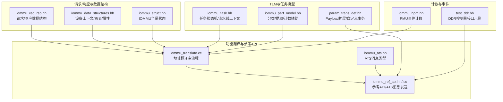
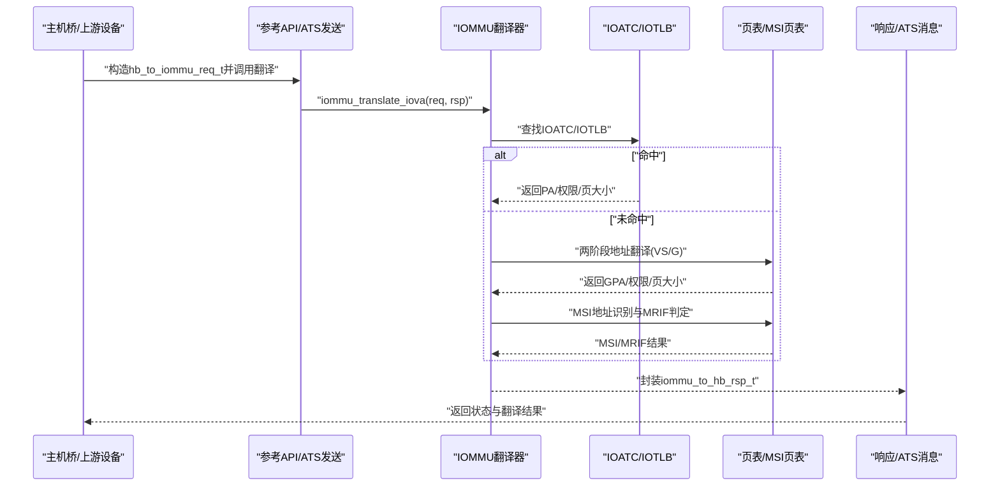
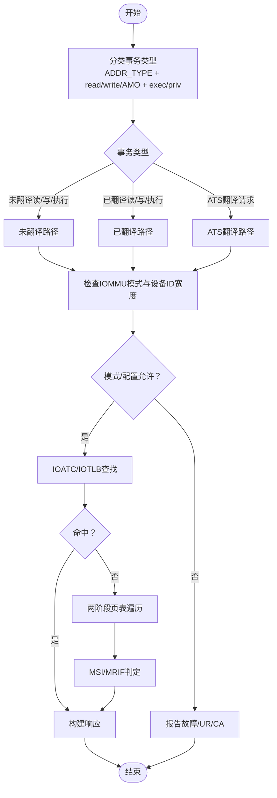
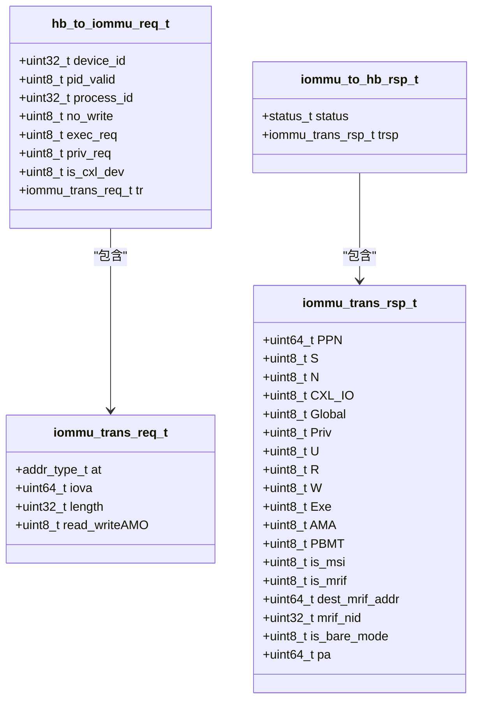
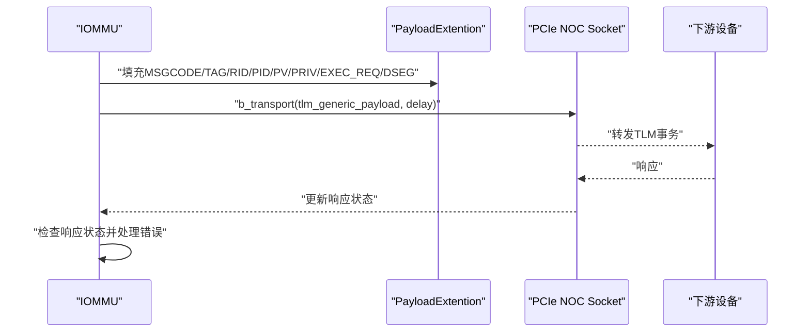
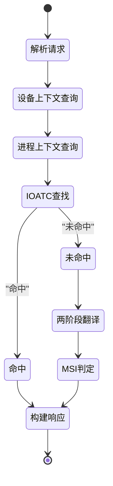
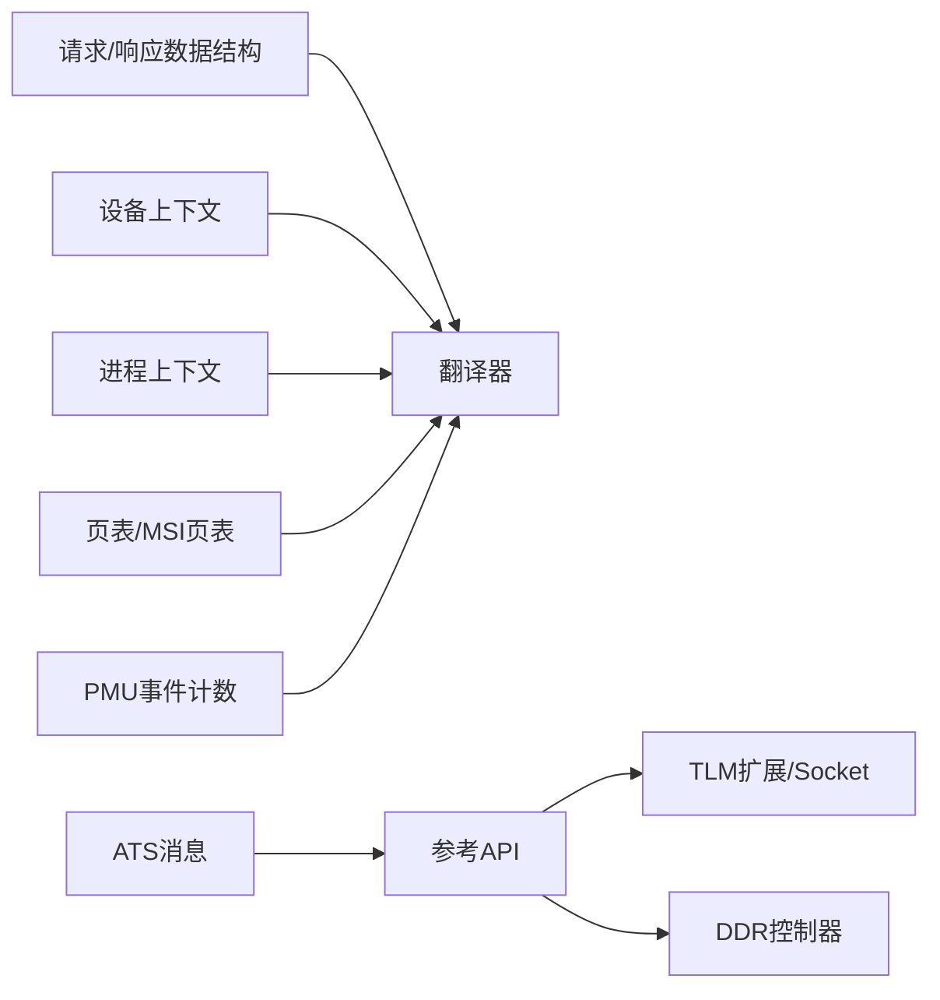

# 请求响应接口

<cite>
**本文引用的文件**
- [iommu_req_rsp.hh](file://iommu/include/iommu_req_rsp.hh)
- [iommu_struct.hh](file://iommu/include/iommu_struct.hh)
- [iommu_data_structures.hh](file://iommu/include/iommu_data_structures.hh)
- [iommu_translate.cc](file://iommu/iommu_fun_model/iommu_translate.cc)
- [iommu_ref_api.hh](file://iommu/include/iommu_ref_api.hh)
- [iommu_ref_api.cc](file://iommu/iommu_perf_model/iommu_ref_api.cc)
- [iommu_ats.hh](file://iommu/include/iommu_ats.hh)
- [param_trans_def.hh](file://iommu/include/param_trans_def.hh)
- [iommu_task.hh](file://iommu/include/iommu_task.hh)
- [iommu_perf_model.hh](file://iommu/include/iommu_perf_model.hh)
- [iommu_hpm.hh](file://iommu/include/iommu_hpm.hh)
- [test_ddr.hh](file://ddr/test_ddr.hh)
</cite>

## 目录
1. [简介](#简介)
2. [项目结构](#项目结构)
3. [核心组件](#核心组件)
4. [架构总览](#架构总览)
5. [详细组件分析](#详细组件分析)
6. [依赖关系分析](#依赖关系分析)
7. [性能考虑](#性能考虑)
8. [故障排查指南](#故障排查指南)
9. [结论](#结论)
10. [附录](#附录)

## 简介
本文件面向IOMMU请求响应接口的使用者与维护者，系统化阐述以下内容：
- 请求消息格式与字段语义
- 响应消息格式与状态码
- 协议规范与错误处理策略
- TLM事务接口的使用方法（tlm_generic_payload的构造、配置与传输）
- 请求分类机制、消息路由规则与优先级处理
- 接口规范（函数签名、参数说明、返回值定义）
- 典型使用场景与时序图、状态转换图
- 性能参数配置与优化建议

## 项目结构
IOMMU请求响应接口由“请求/响应数据结构 + 功能翻译器 + 参考API + ATS消息 + TLM扩展 + 性能模型 + 计数事件”等模块协同实现。下图展示与本文相关的核心文件与模块关系。

**图表来源**
- [iommu_req_rsp.hh:13-103](file://iommu/include/iommu_req_rsp.hh#L13-L103)
- [iommu_data_structures.hh:324-335](file://iommu/include/iommu_data_structures.hh#L324-L335)
- [iommu_struct.hh:42-99](file://iommu/include/iommu_struct.hh#L42-L99)
- [iommu_translate.cc:8-731](file://iommu/iommu_fun_model/iommu_translate.cc#L8-L731)
- [iommu_ref_api.hh:13-51](file://iommu/include/iommu_ref_api.hh#L13-L51)
- [iommu_ref_api.cc:118-169](file://iommu/iommu_perf_model/iommu_ref_api.cc#L118-L169)
- [iommu_ats.hh:47-58](file://iommu/include/iommu_ats.hh#L47-L58)
- [param_trans_def.hh:11-117](file://iommu/include/param_trans_def.hh#L11-L117)
- [iommu_task.hh:14-42](file://iommu/include/iommu_task.hh#L14-L42)
- [iommu_perf_model.hh:9-41](file://iommu/include/iommu_perf_model.hh#L9-L41)
- [iommu_hpm.hh:20-43](file://iommu/include/iommu_hpm.hh#L20-L43)
- [test_ddr.hh:33-59](file://ddr/test_ddr.hh#L33-L59)

**章节来源**
- [iommu_req_rsp.hh:13-103](file://iommu/include/iommu_req_rsp.hh#L13-L103)
- [iommu_struct.hh:42-99](file://iommu/include/iommu_struct.hh#L42-L99)
- [iommu_translate.cc:8-731](file://iommu/iommu_fun_model/iommu_translate.cc#L8-L731)
- [iommu_ref_api.hh:13-51](file://iommu/include/iommu_ref_api.hh#L13-L51)
- [iommu_ref_api.cc:118-169](file://iommu/iommu_perf_model/iommu_ref_api.cc#L118-L169)
- [iommu_ats.hh:47-58](file://iommu/include/iommu_ats.hh#L47-L58)
- [param_trans_def.hh:11-117](file://iommu/include/param_trans_def.hh#L11-L117)
- [iommu_task.hh:14-42](file://iommu/include/iommu_task.hh#L14-L42)
- [iommu_perf_model.hh:9-41](file://iommu/include/iommu_perf_model.hh#L9-L41)
- [iommu_hpm.hh:20-43](file://iommu/include/iommu_hpm.hh#L20-L43)
- [test_ddr.hh:33-59](file://ddr/test_ddr.hh#L33-L59)

## 核心组件
- 请求消息格式
  - 设备标识与进程信息：设备ID、进程ID有效性、进程ID、只读标志、执行请求、特权请求、CXL设备标记
  - 地址类型与访问属性：地址类型（未翻译/ATS翻译请求/已翻译）、IOVA、长度、读/写/AMO标志
- 响应消息格式
  - 状态码：成功、不支持请求、完成器中止
  - 翻译结果：物理页号、范围标志、无缓存标志、CXL IO、全局位、特权位、读/写/执行权限、原子/多路复用能力、页基内存类型、是否MSI、是否MRIF、目标MRIF地址、MRIF节点ID、裸模式标志、完整物理地址（调试）
- ATS消息格式
  - 消息代码、标签、请求者ID、进程ID有效位、进程ID、特权请求、执行请求、段/域相关标志、载荷
- TLM扩展与事务
  - 扩展头：消息代码、标签、请求者ID、进程ID有效/进程ID、特权请求、执行请求、段/域标志
  - 自定义事务：源/目的地址查询接口

**章节来源**
- [iommu_req_rsp.hh:13-103](file://iommu/include/iommu_req_rsp.hh#L13-L103)
- [iommu_ats.hh:47-58](file://iommu/include/iommu_ats.hh#L47-L58)
- [param_trans_def.hh:11-117](file://iommu/include/param_trans_def.hh#L11-L117)

## 架构总览
IOMMU请求响应接口在功能层由“请求解析 → 设备/进程上下文定位 → 两级地址翻译 → MSI/MRIF判定 → 结果封装与缓存”的流水线构成；在系统集成层通过TLM事务承载ATS消息，并通过参考API进行非阻塞内存访问与事件上报。

**图表来源**
- [iommu_translate.cc:8-731](file://iommu/iommu_fun_model/iommu_translate.cc#L8-L731)
- [iommu_ref_api.cc:118-169](file://iommu/iommu_perf_model/iommu_ref_api.cc#L118-L169)
- [iommu_req_rsp.hh:36-103](file://iommu/include/iommu_req_rsp.hh#L36-L103)

## 详细组件分析

### 请求消息格式与分类
- 字段说明
  - 设备ID：唯一标识发起方
  - 进程ID相关：进程ID有效性、进程ID、特权请求
  - 访问属性：只读、执行请求、CXL设备标记
  - 地址类型：未翻译、PCIe ATS翻译请求、已翻译
  - IOVA/长度/读写AMO
- 分类机制
  - 依据地址类型与读写AMO组合确定事务类型（未翻译读/写/执行、已翻译读/写/执行、ATS翻译请求）
  - 对ATS请求，特权位与执行位影响权限授予与CXL IO标志
- 路由与优先级
  - ATS翻译请求在特定配置下可直接返回GPA或SPA
  - IOATC命中优先于页表遍历
  - MSI/MRIF路径在普通地址翻译前评估，避免重复遍历

**图表来源**
- [iommu_translate.cc:38-142](file://iommu/iommu_fun_model/iommu_translate.cc#L38-L142)
- [iommu_perf_model.hh:9-41](file://iommu/include/iommu_perf_model.hh#L9-L41)

**章节来源**
- [iommu_req_rsp.hh:13-49](file://iommu/include/iommu_req_rsp.hh#L13-L49)
- [iommu_perf_model.hh:9-41](file://iommu/include/iommu_perf_model.hh#L9-L41)
- [iommu_translate.cc:38-142](file://iommu/iommu_fun_model/iommu_translate.cc#L38-L142)

### 响应消息格式与状态码
- 状态码
  - 成功：nominal成功
  - 不支持请求：请求类型不受支持或配置不允许
  - 完成器中止：内部致命错误或配置性错误
- 翻译结果
  - PPN/范围标志/权限位/页基内存类型/MSI/MRIF标志/CXL IO/全局位/特权位/执行位等
  - 裸模式标志：当两级均为裸模式时启用
  - 调试用途的完整物理地址
- ATS翻译请求的特殊字段
  - Priv/N/CXL.IO/AMA/Global/U/R/W/Exe按规范设置

**图表来源**
- [iommu_req_rsp.hh:13-103](file://iommu/include/iommu_req_rsp.hh#L13-L103)

**章节来源**
- [iommu_req_rsp.hh:51-103](file://iommu/include/iommu_req_rsp.hh#L51-L103)
- [iommu_translate.cc:500-618](file://iommu/iommu_fun_model/iommu_translate.cc#L500-L618)

### TLM事务接口与ATS消息发送
- tlm_generic_payload构造要点
  - 命令类型：写命令
  - 地址：由ATS消息中的RID映射得到的PCIe NOC地址
  - 数据指针：ATS消息PAYLOAD
  - 数据长度：固定长度（示例中为8字节）
  - 流宽：等于数据长度
  - 字节使能：空
  - DMI允许：关闭
  - 响应状态：初始设为未完成，等待b_transport完成后检查
- 扩展头PayloadExtention
  - 包含消息代码、标签、请求者ID、进程ID有效/进程ID、特权请求、执行请求、段/域标志
- 发送流程
  - 构造事务与扩展头
  - 调用b_transport至PCIe NOC Socket
  - 检查响应状态并处理错误

**图表来源**
- [iommu_ref_api.cc:118-169](file://iommu/iommu_perf_model/iommu_ref_api.cc#L118-L169)
- [param_trans_def.hh:11-117](file://iommu/include/param_trans_def.hh#L11-L117)
- [iommu_ats.hh:47-58](file://iommu/include/iommu_ats.hh#L47-L58)

**章节来源**
- [iommu_ref_api.cc:118-169](file://iommu/iommu_perf_model/iommu_ref_api.cc#L118-L169)
- [param_trans_def.hh:11-117](file://iommu/include/param_trans_def.hh#L11-L117)
- [iommu_ats.hh:47-58](file://iommu/include/iommu_ats.hh#L47-L58)

### 请求分类机制、消息路由与优先级
- 分类逻辑
  - 依据ADDR_TYPE与读写AMO组合确定事务类型
  - 提取访问属性（读/写/执行/特权），用于权限判定与响应字段生成
- 路由规则
  - IOATC命中优先，避免页表遍历
  - ATS翻译请求在T2GPA模式下可缓存最终GPA→SPA映射
  - MSI/MRIF路径独立评估，命中则跳过G阶段翻译
- 优先级处理
  - 配置性错误（如禁用ATS仍发已翻译请求）优先返回UR/CA
  - 访问性错误（缺页/权限不足）次之
  - 其余按正常流程返回成功或部分权限授予

**章节来源**
- [iommu_perf_model.hh:9-41](file://iommu/include/iommu_perf_model.hh#L9-L41)
- [iommu_translate.cc:352-492](file://iommu/iommu_fun_model/iommu_translate.cc#L352-L492)

### 接口规范与错误处理
- 主要接口
  - 翻译入口：iommu_translate_iova(iommu_t*, hb_to_iommu_req_t*, iommu_to_hb_rsp_t*)
  - ATS消息发送：send_msg_iommu_to_hb(iommu_t*, ats_msg_t*)
  - 属性提取：get_attribs_from_req(hb_to_iommu_req_t*, uint8_t*, uint8_t*, uint8_t*, uint8_t*)
  - 内存访问（测试）：read_memory_test/write_memory_test
- 参数说明
  - iommu_t*：IOMMU全局状态与寄存器文件
  - 请求/响应结构体：见上文数据结构
  - ats_msg_t*：ATS消息结构
- 返回值与错误处理
  - 状态码：SUCCESS/UNSUPPORTED_REQUEST/COMPLETER_ABORT
  - ATS翻译请求的UR/CA分支与配置性错误处理
  - 访问性/页故障与客体页故障分别映射不同原因码

**章节来源**
- [iommu_ref_api.hh:13-51](file://iommu/include/iommu_ref_api.hh#L13-L51)
- [iommu_translate.cc:620-731](file://iommu/iommu_fun_model/iommu_translate.cc#L620-L731)

### 典型使用场景与时序
- 场景一：未翻译读请求（裸模式）
  - 输入：ADDR_TYPE_UNTRANSLATED + READ
  - 输出：is_bare_mode置位，PPN=PA>>12，权限位按页表授予
- 场景二：ATS翻译请求（T2GPA=1）
  - 输入：ADDR_TYPE_PCIE_ATS_TRANSLATION_REQUEST
  - 输出：返回GPA作为翻译结果，CXL_IO根据PBMT/MSI/T2GPA设置
- 场景三：已翻译写请求（仅SPA）
  - 输入：ADDR_TYPE_TRANSLATED + WRITE
  - 输出：直接使用IOVA作为SPA，权限按页表授予

**图表来源**
- [iommu_translate.cc:352-492](file://iommu/iommu_fun_model/iommu_translate.cc#L352-L492)
- [iommu_task.hh:14-42](file://iommu/include/iommu_task.hh#L14-L42)

**章节来源**
- [iommu_translate.cc:352-492](file://iommu/iommu_fun_model/iommu_translate.cc#L352-L492)
- [iommu_task.hh:14-42](file://iommu/include/iommu_task.hh#L14-L42)

## 依赖关系分析
- 组件耦合
  - iommu_translate.cc依赖请求/响应数据结构、设备/进程上下文、页表/MSI页表、ATS消息、PMU事件计数
  - 参考API依赖SystemC/Socket与TLM扩展，负责非阻塞内存访问与ATS消息发送
- 外部依赖
  - DDR控制器通过FIFO与事件同步进行非阻塞访问
  - PCIe NOC Socket承载ATS消息

**图表来源**
- [iommu_translate.cc:8-731](file://iommu/iommu_fun_model/iommu_translate.cc#L8-L731)
- [iommu_ref_api.cc:48-84](file://iommu/iommu_perf_model/iommu_ref_api.cc#L48-L84)
- [test_ddr.hh:33-59](file://ddr/test_ddr.hh#L33-L59)

**章节来源**
- [iommu_translate.cc:8-731](file://iommu/iommu_fun_model/iommu_translate.cc#L8-L731)
- [iommu_ref_api.cc:48-84](file://iommu/iommu_perf_model/iommu_ref_api.cc#L48-L84)
- [test_ddr.hh:33-59](file://ddr/test_ddr.hh#L33-L59)

## 性能考虑
- 缓存与命中
  - IOATC/IOTLB命中可显著降低页表遍历开销
  - ATS翻译请求在T2GPA模式下可缓存GPA→SPA映射
- 页表遍历与MRIF
  - MSI/MRIF判定在普通地址翻译前进行，减少重复遍历
  - MRIF模式下的MSI PTE不缓存以降低复杂度
- 计数与观测
  - 通过PMU事件计数统计未翻译/已翻译/ATS请求、TLB缺失、页表遍历次数
- 内存访问
  - 控制路径通过FIFO与事件同步实现非阻塞DDR访问，避免阻塞主流程

**章节来源**
- [iommu_translate.cc:458-492](file://iommu/iommu_fun_model/iommu_translate.cc#L458-L492)
- [iommu_hpm.hh:20-43](file://iommu/include/iommu_hpm.hh#L20-L43)
- [iommu_ref_api.cc:48-84](file://iommu/iommu_perf_model/iommu_ref_api.cc#L48-L84)

## 故障排查指南
- 常见原因码
  - 配置性错误：禁用ATS仍发已翻译请求、设备ID宽度不符、事务类型不允许
  - 访问性错误：指令/读/写访问故障
  - 客体页故障：指令/读/写客体页故障
  - 数据损坏：页表数据损坏、MSI页表/MRIF数据损坏
- ATS翻译请求的特殊处理
  - 配置性错误返回CA
  - 其他错误返回UR
- 建议排查步骤
  - 检查IOMMU模式与设备ID宽度
  - 核对DC/PC配置与权限位
  - 关注PMU事件计数定位瓶颈
  - 校验TLM事务构造与Socket连接

**章节来源**
- [iommu_translate.cc:620-731](file://iommu/iommu_fun_model/iommu_translate.cc#L620-L731)
- [iommu_hpm.hh:20-43](file://iommu/include/iommu_hpm.hh#L20-L43)

## 结论
本文档从数据结构、翻译流程、TLM接口、分类与路由、错误处理到性能优化给出了IOMMU请求响应接口的完整视图。遵循本文规范可确保请求消息格式正确、响应状态清晰、ATS消息可靠传输，并在高并发场景下保持良好性能与可观测性。

## 附录
- 关键函数与文件映射
  - iommu_translate_iova → [iommu_translate.cc:8-731](file://iommu/iommu_fun_model/iommu_translate.cc#L8-L731)
  - send_msg_iommu_to_hb → [iommu_ref_api.cc:118-169](file://iommu/iommu_perf_model/iommu_ref_api.cc#L118-L169)
  - get_attribs_from_req → [iommu_ref_api.cc:171-203](file://iommu/iommu_perf_model/iommu_ref_api.cc#L171-L203)
  - PayloadExtention/NocTransaction → [param_trans_def.hh:11-117](file://iommu/include/param_trans_def.hh#L11-L117)
  - 任务状态机与流水线上下文 → [iommu_task.hh:14-307](file://iommu/include/iommu_task.hh#L14-L307)
  - 分类/提取/计数辅助 → [iommu_perf_model.hh:9-197](file://iommu/include/iommu_perf_model.hh#L9-L197)
  - PMU事件计数 → [iommu_hpm.hh:20-43](file://iommu/include/iommu_hpm.hh#L20-L43)
  - DDR控制器接口示例 → [test_ddr.hh:33-59](file://ddr/test_ddr.hh#L33-L59)