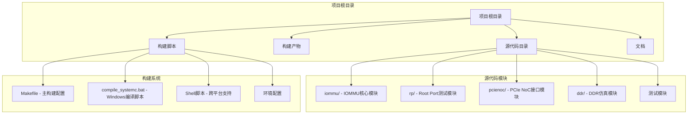
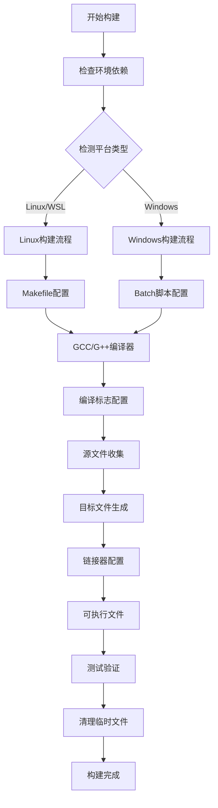
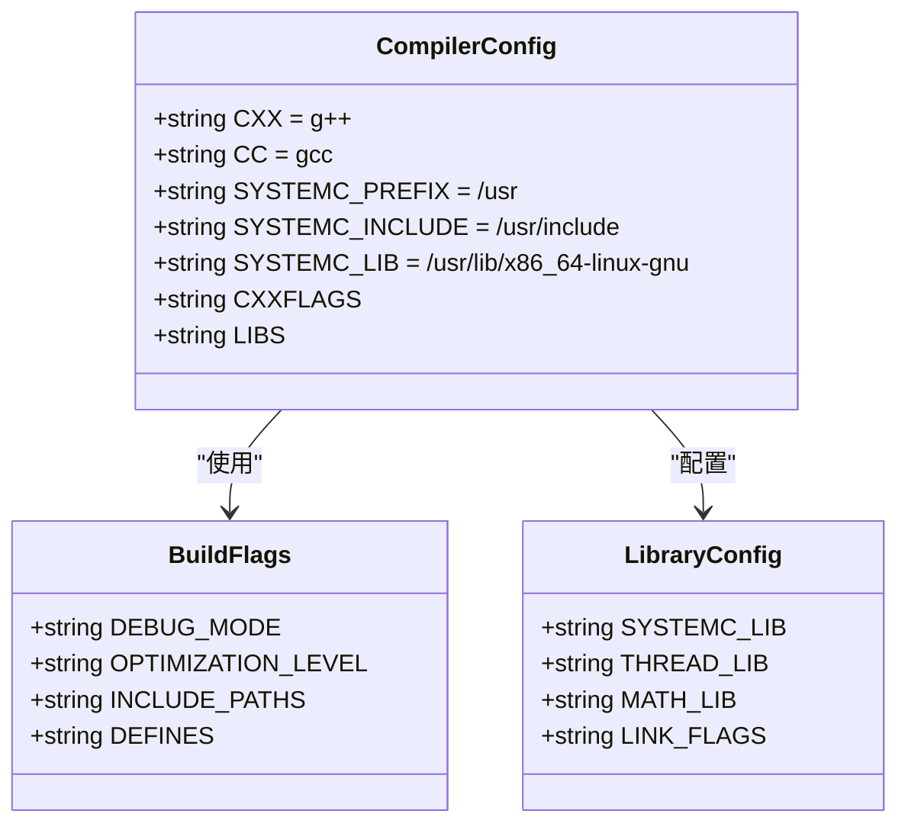
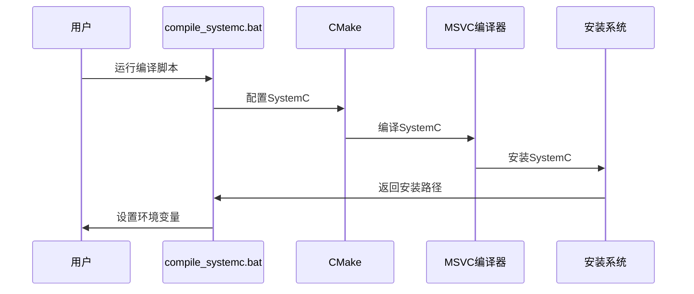
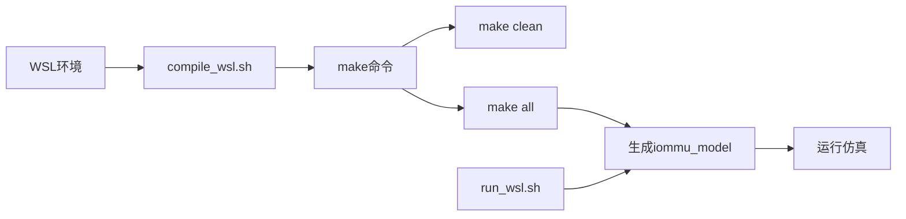
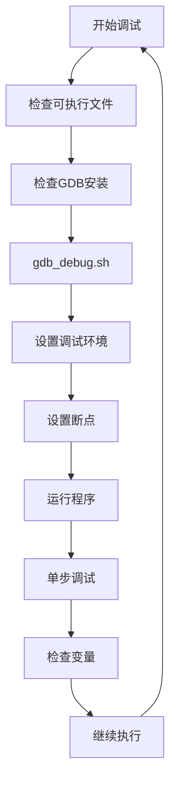
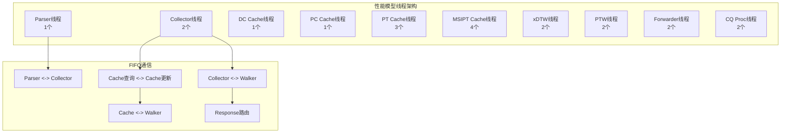
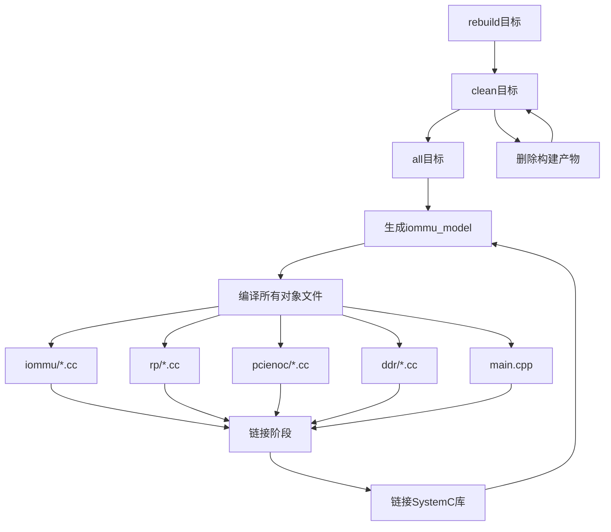
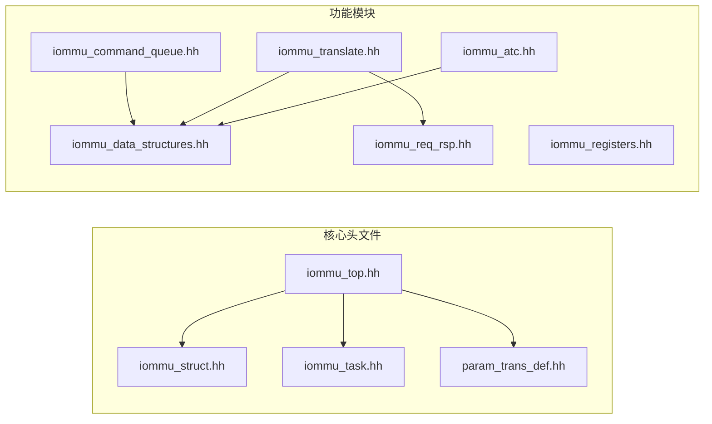

# Build System Documentation

<cite>
**本文档引用的文件**
- [Makefile](file://Makefile)
- [compile_systemc.bat](file://compile_systemc.bat)
- [compile_wsl.sh](file://compile_wsl.sh)
- [run_wsl.sh](file://run_wsl.sh)
- [gdb_debug.sh](file://gdb_debug.sh)
- [main.cpp](file://main.cpp)
- [README.md](file://README.md)
- [PERF_MODEL_IMPLEMENTATION.md](file://PERF_MODEL_IMPLEMENTATION.md)
- [GDB_DEBUG_GUIDE.md](file://GDB_DEBUG_GUIDE.md)
- [iommu_top.hh](file://iommu/iommu_top.hh)
- [iommu_struct.hh](file://iommu/iommu_struct.hh)
</cite>

## 目录
1. [简介](#简介)
2. [项目结构概览](#项目结构概览)
3. [构建系统架构](#构建系统架构)
4. [编译配置详解](#编译配置详解)
5. [跨平台构建支持](#跨平台构建支持)
6. [调试构建流程](#调试构建流程)
7. [性能模型集成](#性能模型集成)
8. [构建脚本分析](#构建脚本分析)
9. [依赖关系管理](#依赖关系管理)
10. [最佳实践指南](#最佳实践指南)
11. [故障排除指南](#故障排除指南)
12. [总结](#总结)

## 简介

RISC-V IOMMU SystemC 模型是一个基于 SystemC 的硬件描述和仿真框架，用于模拟 RISC-V 架构下的输入输出内存管理单元功能。该项目采用现代 C++11 标准，结合 SystemC 2.3.x 库，实现了完整的 IOMMU 地址转换、故障处理和设备上下文管理功能。

该构建系统支持多种开发环境，包括 Windows WSL（Windows Subsystem for Linux）、原生 Linux 环境以及交叉编译场景。系统集成了完整的性能模型实现，支持 SPEC v4 规范的 20 个线程架构。

## 项目结构概览

项目采用模块化组织方式，主要目录结构如下：

**图表来源**
- [Makefile:1-109](file://Makefile#L1-L109)
- [README.md:63-76](file://README.md#L63-L76)

**章节来源**
- [README.md:1-92](file://README.md#L1-L92)
- [Makefile:1-109](file://Makefile#L1-L109)

## 构建系统架构

构建系统采用分层架构设计，支持多平台编译和灵活的配置选项：

**图表来源**
- [Makefile:14-24](file://Makefile#L14-L24)
- [Makefile:26-27](file://Makefile#L26-L27)
- [Makefile:66-71](file://Makefile#L66-L71)

构建系统的核心特点包括：

1. **多平台支持**：同时支持 Linux/WSL 和 Windows 环境
2. **灵活配置**：通过 DEBUG 变量控制调试模式
3. **模块化源码**：按功能模块组织源文件
4. **性能模型集成**：可选择性编译性能相关组件

**章节来源**
- [Makefile:1-109](file://Makefile#L1-L109)
- [compile_systemc.bat:1-50](file://compile_systemc.bat#L1-L50)

## 编译配置详解

### 编译器和工具链配置

构建系统使用标准的 GCC/G++ 工具链，支持 C++11 标准：

**图表来源**
- [Makefile:4-11](file://Makefile#L4-L11)
- [Makefile:14](file://Makefile#L14)
- [Makefile:27](file://Makefile#L27)

### 调试和发布模式

构建系统提供两种构建模式，通过 DEBUG 变量控制：

| 模式 | 编译标志 | 优化级别 | 调试宏 | 用途 |
|------|----------|----------|--------|------|
| 调试模式 (DEBUG=1) | -g -O0 -DDEBUG | -O0 | 所有DEBUG_* | 开发调试 |
| 发布模式 (DEBUG=0) | -O3 -DNDEBUG | -O3 | 无 | 生产部署 |

**章节来源**
- [Makefile:16-24](file://Makefile#L16-L24)
- [README.md:41-53](file://README.md#L41-L53)

## 跨平台构建支持

### Windows 环境支持

项目提供专门的 Windows 批处理脚本，支持本地编译 SystemC 库：

**图表来源**
- [compile_systemc.bat:17-34](file://compile_systemc.bat#L17-L34)

### WSL 环境支持

项目强烈推荐在 WSL 环境中进行编译和运行，提供专门的 shell 脚本：

**图表来源**
- [compile_wsl.sh:1-15](file://compile_wsl.sh#L1-L15)
- [run_wsl.sh:1-16](file://run_wsl.sh#L1-L16)

**章节来源**
- [compile_systemc.bat:1-50](file://compile_systemc.bat#L1-L50)
- [compile_wsl.sh:1-15](file://compile_wsl.sh#L1-L15)
- [run_wsl.sh:1-16](file://run_wsl.sh#L1-L16)

## 调试构建流程

### GDB 调试支持

项目提供了完整的 GDB 调试支持，包括自动化调试脚本：

**图表来源**
- [gdb_debug.sh:7-37](file://gdb_debug.sh#L7-L37)

### 调试宏定义

构建系统为调试目的定义了丰富的宏：

| 宏名称 | 功能描述 | 启用条件 |
|--------|----------|----------|
| DEBUG | 通用调试开关 | 所有调试模式 |
| DEBUG_TRANSLATION | 地址翻译调试 | DEBUG=1 |
| DEBUG_TWOSTAGE | 两级翻译调试 | DEBUG=1 |
| DEBUG_MSITRANS | MSI翻译调试 | DEBUG=1 |
| DEBUG_COMMANDS | 命令处理调试 | DEBUG=1 |
| DEBUG_SECONDSTAGE | 第二阶段调试 | DEBUG=1 |
| DEBUG_ATC | 地址转换缓存调试 | DEBUG=1 |
| DEBUG_FAULTS | 故障处理调试 | DEBUG=1 |
| DEBUG_INTERRUPT | 中断处理调试 | DEBUG=1 |
| DEBUG_HPM | 性能监控调试 | DEBUG=1 |
| DEBUG_UTILS | 工具函数调试 | DEBUG=1 |

**章节来源**
- [Makefile:18-24](file://Makefile#L18-L24)
- [main.cpp:14-31](file://main.cpp#L14-L31)
- [GDB_DEBUG_GUIDE.md:69-102](file://GDB_DEBUG_GUIDE.md#L69-L102)

## 性能模型集成

### 性能模型架构

项目实现了完整的 SPEC v4 性能模型，包含 20 个线程的并行处理架构：

**图表来源**
- [PERF_MODEL_IMPLEMENTATION.md:14-97](file://PERF_MODEL_IMPLEMENTATION.md#L14-L97)

### 源文件组织

性能模型相关的源文件组织如下：

| 模块类别 | 源文件数量 | 主要功能 | 线程数量 |
|----------|------------|----------|----------|
| 核心数据结构 | 3 | 基础数据类型定义 | - |
| Parser模块 | 1 | 请求解析和路由 | 1 |
| Collector模块 | 1 | 结果收集和决策 | 2 |
| DC/PC Cache模块 | 1 | 设备和进程上下文缓存 | 2 |
| PT Cache模块 | 1 | IOTLB查询和管理 | 3 |
| MSIPT Cache模块 | 1 | MSI页表缓存 | 4 |
| xDTW模块 | 1 | DDT/PDT树遍历 | 2 |
| PTW模块 | 1 | 页表遍历和Walker Cache | 2 |
| Forwarder/Fault/CQ模块 | 1 | DMA转发和错误处理 | 4 |
| **总计** | **10** | **完整性能模型** | **20** |

**章节来源**
- [PERF_MODEL_IMPLEMENTATION.md:7-194](file://PERF_MODEL_IMPLEMENTATION.md#L7-L194)
- [Makefile:52-61](file://Makefile#L52-L61)

## 构建脚本分析

### 主构建脚本

Makefile 提供了完整的构建配置，支持智能依赖管理和增量编译：

**图表来源**
- [Makefile:66-91](file://Makefile#L66-L91)
- [Makefile:95-104](file://Makefile#L95-L104)

### Shell脚本功能

项目提供多个 shell 脚本支持不同的开发场景：

| 脚本名称 | 功能描述 | 使用场景 |
|----------|----------|----------|
| compile_wsl.sh | WSL环境编译 | 开发环境快速编译 |
| run_wsl.sh | WSL环境运行 | 仿真测试执行 |
| gdb_debug.sh | GDB调试支持 | 错误诊断和调试 |
| compile_systemc.bat | Windows SystemC编译 | Windows开发环境 |

**章节来源**
- [Makefile:1-109](file://Makefile#L1-L109)
- [compile_wsl.sh:1-15](file://compile_wsl.sh#L1-L15)
- [run_wsl.sh:1-16](file://run_wsl.sh#L1-L16)
- [gdb_debug.sh:1-37](file://gdb_debug.sh#L1-L37)

## 依赖关系管理

### 头文件依赖图

构建系统通过 Makefile 明确声明了关键的头文件依赖关系：

**图表来源**
- [Makefile:107-109](file://Makefile#L107-L109)
- [iommu_top.hh:10-13](file://iommu/iommu_top.hh#L10-L13)

### 库依赖配置

构建系统配置了必要的系统库依赖：

| 库名称 | 用途 | 链接方式 |
|--------|------|----------|
| libsystemc | SystemC核心库 | 动态链接 |
| pthread | 线程支持 | 动态链接 |
| m | 数学库 | 动态链接 |
| --no-as-needed | 链接器选项 | 特殊处理 |

**章节来源**
- [Makefile:27](file://Makefile#L27)
- [Makefile:81](file://Makefile#L81)

## 最佳实践指南

### 编译环境配置

1. **WSL环境推荐**：项目明确要求在 WSL 环境中进行编译和运行
2. **SystemC安装**：确保 SystemC 库正确安装在 `/usr` 目录下
3. **编译器版本**：使用支持 C++11 标准的 GCC/G++ 版本

### 构建优化建议

1. **调试模式**：开发阶段使用 `make DEBUG=1` 获取完整调试信息
2. **发布模式**：生产部署使用 `make DEBUG=0` 获得最优性能
3. **增量编译**：利用 Makefile 的智能依赖管理进行增量编译

### 性能模型选择

根据需求选择合适的性能模型组件：

- **轻量级模型**：仅编译 `iommu_perf_parser.cc`
- **完整性能模型**：编译所有性能相关组件
- **功能验证**：使用简化版本进行基本功能测试

**章节来源**
- [README.md:7-16](file://README.md#L7-L16)
- [README.md:17-53](file://README.md#L17-L53)
- [PERF_MODEL_IMPLEMENTATION.md:130-157](file://PERF_MODEL_IMPLEMENTATION.md#L130-L157)

## 故障排除指南

### 常见构建问题

| 问题类型 | 症状 | 解决方案 |
|----------|------|----------|
| SystemC库缺失 | 编译时报错找不到SystemC头文件 | 在 `/usr` 目录正确安装SystemC |
| 权限问题 | 执行脚本报错 | 使用 `chmod +x` 设置执行权限 |
| 调试符号丢失 | GDB无法调试 | 使用 `make DEBUG=1` 编译 |
| 依赖冲突 | 链接阶段报错 | 检查库版本兼容性 |

### 调试技巧

1. **逐步调试**：使用 GDB 的 `step` 和 `next` 命令
2. **断点设置**：在关键函数入口设置断点
3. **变量检查**：使用 `print` 命令检查关键变量值
4. **条件断点**：只在特定条件下触发断点

### 性能分析

1. **编译时间**：调试模式编译时间较长属正常现象
2. **运行性能**：发布模式下程序运行速度更快
3. **内存使用**：注意调试模式下的内存占用较高

**章节来源**
- [GDB_DEBUG_GUIDE.md:158-173](file://GDB_DEBUG_GUIDE.md#L158-L173)
- [README.md:81-87](file://README.md#L81-L87)

## 总结

RISC-V IOMMU SystemC 模型的构建系统展现了现代 C++ 项目的最佳实践：

1. **跨平台兼容性**：支持 Windows WSL 和原生 Linux 环境
2. **模块化设计**：清晰的源码组织和依赖管理
3. **灵活配置**：通过变量控制不同的构建模式
4. **完整工具链**：包含编译、调试、测试的全套工具
5. **性能优化**：支持性能模型的完整实现

该构建系统为开发者提供了高效、可靠的开发环境，支持从基础功能验证到复杂性能分析的全方位需求。通过合理的配置和使用，开发者可以快速上手项目并进行高效的 IOMMU 功能开发和调试。